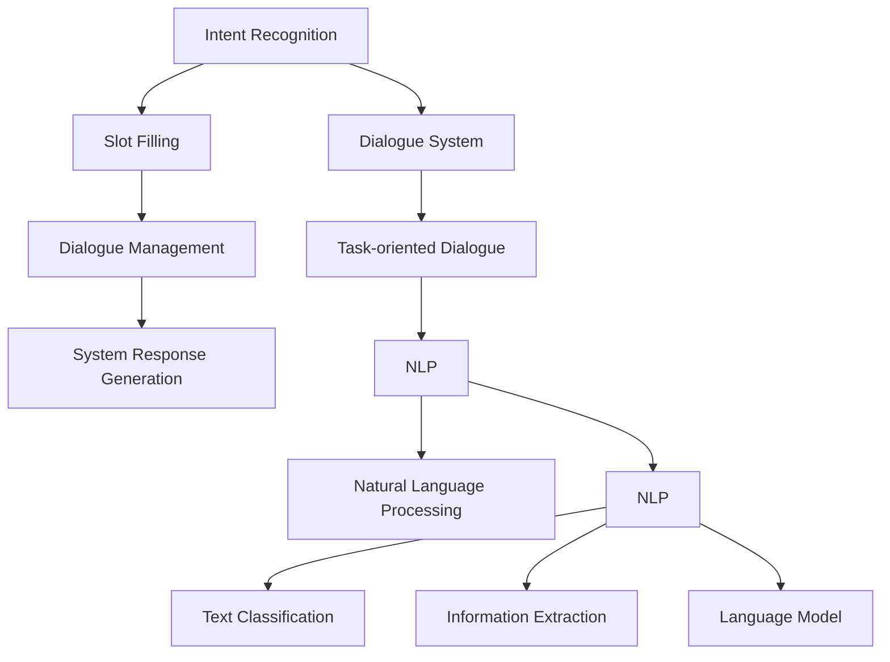

                 

# 意图识别与槽填充：构建任务型对话系统

> 关键词：意图识别,槽填充,对话系统,任务型,自然语言处理(NLP)

## 1. 背景介绍

### 1.1 问题由来
在人工智能技术迅速发展的今天，人机交互已不再局限于传统的文本对话。随着语音识别、自然语言理解等技术的进步，对话系统已经成为企业和用户互动的重要渠道。然而，传统基于规则和模板的对话系统往往需要大量的人工开发和维护成本，且难以处理复杂多变的用户意图和输入形式。

意图识别与槽填充作为构建任务型对话系统的重要基础技术，可以自动理解用户意图，并从输入中提取关键信息，从而引导系统进行精准响应。利用自然语言处理（NLP）和深度学习等技术，通过大规模数据训练和微调，意图识别与槽填充技术已经逐渐成熟，并在智能客服、智能助手等实际应用中取得了显著成效。

### 1.2 问题核心关键点
在构建任务型对话系统时，核心目标是通过意图识别确定用户的具体需求，再通过槽填充提取相关参数，最后生成相应的系统响应。

- **意图识别**：通过对用户输入的自然语言进行理解，自动判断用户的意图。常见的方法包括基于规则的模板匹配、基于统计的机器学习模型和深度学习模型。

- **槽填充**：从用户输入中提取关键参数，并填充到预定义的槽位中。槽填充的准确性和完整性直接影响到系统响应的准确性和满意度。

- **对话管理**：根据意图识别和槽填充的结果，选择合适的对话路径，进行下一步的交互。对话管理是对话系统持续运行的保障。

- **系统响应生成**：根据意图和槽填充结果，自动生成满足用户需求的回复。系统响应生成需要考虑上下文信息和语言模型。

### 1.3 问题研究意义
研究和优化意图识别与槽填充技术，对于构建更加智能、高效、用户友好的对话系统，具有重要意义：

1. **降低开发成本**：意图识别与槽填充技术可以大幅降低对话系统开发的复杂度，减少人工开发和维护成本。

2. **提升系统响应准确性**：通过精准的意图识别和槽填充，系统能够更准确地理解用户需求，生成更贴近用户期望的回复。

3. **提高系统灵活性**：意图识别与槽填充技术能够处理多种语言和输入形式，提升系统的泛化能力和灵活性。

4. **增强用户体验**：自动化的意图识别与槽填充，可以减少用户输入的时间和复杂度，提高用户满意度。

5. **加速落地应用**：意图识别与槽填充技术的成熟和实用化，为对话系统在更多场景中的应用提供了坚实基础。

## 2. 核心概念与联系

### 2.1 核心概念概述

为更好地理解意图识别与槽填充技术，本节将介绍几个密切相关的核心概念：

- **意图识别（Intent Recognition）**：指自动分析和理解用户输入的自然语言，确定用户的意图。常见应用包括客服咨询、智能助手、自动答疑等。

- **槽填充（Slot Filling）**：指从用户输入的自然语言中提取特定信息，并填充到预定义的槽位中。常见应用包括定票、订餐、购买等。

- **对话系统（Dialogue System）**：指模拟人类对话的计算机系统，能够理解用户意图、提取槽位信息，并生成自然语言响应。常见类型包括基于规则的系统、基于模板的系统、基于机器学习的系统等。

- **任务型对话（Task-oriented Dialogue）**：指围绕特定任务展开的对话系统，如在线购物、预订酒店、健康咨询等，需要根据任务需求，灵活调整系统响应。

- **自然语言处理（NLP）**：指处理和理解人类自然语言的计算机技术，包括文本分类、信息提取、语言模型等子领域。

这些核心概念之间的逻辑关系可以通过以下Mermaid流程图来展示：



这个流程图展示了意图识别与槽填充在构建任务型对话系统中的位置和作用：

1. 意图识别对用户输入的自然语言进行理解，确定其意图。
2. 槽填充从用户输入中提取关键信息，并填充到预定义的槽位中。
3. 对话管理根据意图和槽填充结果，选择合适的对话路径。
4. 系统响应生成自动生成满足用户需求的回复。
5. 对话系统结合自然语言处理技术，实现人机自然交互。
6. 任务型对话系统围绕特定任务展开，进行自动化交互。

## 3. 核心算法原理 & 具体操作步骤
### 3.1 算法原理概述

意图识别与槽填充技术的核心在于利用自然语言处理和深度学习技术，自动分析和理解用户输入，并从中提取关键信息。其算法流程一般包括以下几个步骤：

1. **数据预处理**：对原始文本数据进行清洗、分词、词性标注等处理，生成适合训练的文本特征。

2. **模型训练**：使用监督学习或无监督学习方法训练意图识别和槽填充模型，使其能够自动学习文本与意图、槽位之间的映射关系。

3. **意图识别**：将用户输入的自然语言作为输入，通过训练好的模型预测其意图。

4. **槽填充**：从意图识别结果和上下文信息中提取槽位信息，填充到预定义的槽位中。

5. **系统响应生成**：根据意图和槽填充结果，生成相应的系统回复。

### 3.2 算法步骤详解

以下是基于监督学习方法的意图识别与槽填充技术的具体操作步骤：

**Step 1: 数据预处理**

- 收集对话数据集，并进行文本清洗、分词、词性标注等预处理操作。
- 生成特征向量，如词袋模型、TF-IDF、Word2Vec等，用于训练模型。

**Step 2: 模型训练**

- 选择合适的深度学习模型，如CNN、RNN、Transformer等，进行意图识别和槽填充的训练。
- 使用标注好的对话数据集进行监督学习训练，最小化预测意图和槽位的误差。
- 使用交叉验证、学习率调参等方法，优化模型性能。

**Step 3: 意图识别**

- 将用户输入的自然语言输入到训练好的意图识别模型中，得到意图预测结果。
- 使用Softmax函数计算各意图的概率分布，选择概率最大的意图作为最终结果。

**Step 4: 槽填充**

- 根据意图识别结果和对话上下文，从用户输入中提取槽位信息。
- 使用槽填充模型预测每个槽位的值，得到槽填充结果。

**Step 5: 系统响应生成**

- 根据意图和槽填充结果，生成相应的系统回复。
- 使用自然语言生成技术，如Seq2Seq模型、GPT等，生成流畅自然的人工智能回复。

### 3.3 算法优缺点

意图识别与槽填充技术在构建任务型对话系统中具有以下优点：

1. **自动化程度高**：通过机器学习模型自动进行意图识别和槽填充，减少了人工干预，提高了系统的效率。

2. **泛化能力强**：训练好的模型可以处理多种语言和输入形式，具备较强的泛化能力，适用于多种应用场景。

3. **精度较高**：通过深度学习模型进行训练，意图识别和槽填充的精度较高，能够准确理解用户意图和提取关键信息。

4. **适应性强**：系统响应生成可以根据用户意图和槽填充结果，灵活调整对话路径和回复内容，提高用户体验。

同时，该技术也存在一定的局限性：

1. **依赖标注数据**：模型的训练和优化需要大量标注数据，标注成本较高。

2. **理解上下文**：意图识别和槽填充模型的效果依赖于上下文信息的正确处理，错误或不完整的上下文可能导致错误的意图识别和槽填充。

3. **模型的复杂性**：深度学习模型结构复杂，需要较长的训练时间和高计算资源。

4. **数据偏差**：模型训练数据可能存在偏差，导致意图识别和槽填充的准确性受限。

5. **模型的可解释性**：深度学习模型通常是"黑盒"模型，难以解释其内部决策过程，影响模型的可信度和可解释性。

尽管存在这些局限性，但总体而言，意图识别与槽填充技术在构建任务型对话系统中已显示出巨大的应用潜力。未来研究重点在于如何进一步降低标注成本，提高模型的理解和泛化能力，同时兼顾可解释性和稳定性。

### 3.4 算法应用领域

意图识别与槽填充技术已经在多个领域得到广泛应用，例如：

- **智能客服**：用于自动理解和解答客户咨询，提升客户满意度。
- **智能助手**：用于提供个性化服务和建议，提升用户体验。
- **医疗咨询**：用于自动理解和解答医疗咨询，辅助医生诊断和治疗。
- **购物推荐**：用于自动理解和生成购物推荐，提高用户购物体验。
- **智能家居**：用于自动理解和控制家居设备，提高智能家居的互动性。

除了上述这些常见应用外，意图识别与槽填充技术还在更多场景中得到创新性应用，如智能交通、智能金融等，为各行各业带来新的智能化解决方案。

## 4. 数学模型和公式 & 详细讲解 & 举例说明

### 4.1 数学模型构建

在构建意图识别和槽填充模型时，我们通常使用以下数学模型：

**意图识别模型**：
$$
P(I_k|X) = \frac{e^{S_k(X)}}{\sum_{k=1}^K e^{S_k(X)}}
$$
其中，$I_k$表示意图，$X$表示用户输入的自然语言，$S_k(X)$为意图识别模型对输入$X$的输出，$K$为可能的意图数目。

**槽填充模型**：
$$
P(S_i|X,I_k) = \frac{e^{L_i(X,I_k)}}{\sum_{i=1}^{M} e^{L_i(X,I_k)}}
$$
其中，$S_i$表示槽位$i$的值，$X$表示用户输入的自然语言，$I_k$表示意图，$M$为可能的槽位数目。

### 4.2 公式推导过程

**意图识别模型的推导**：
1. **概率模型**：设$P(I_k|X)$为给定输入$X$下，意图$I_k$的条件概率。
2. **Softmax函数**：通过Softmax函数将模型输出转换为概率分布，$P(I_k|X) = \frac{e^{S_k(X)}}{\sum_{k=1}^K e^{S_k(X)}}$。
3. **最大化对数概率**：最终选取条件概率最大的意图作为预测结果。

**槽填充模型的推导**：
1. **概率模型**：设$P(S_i|X,I_k)$为给定输入$X$和意图$I_k$下，槽位$S_i$的条件概率。
2. **Softmax函数**：通过Softmax函数将模型输出转换为概率分布，$P(S_i|X,I_k) = \frac{e^{L_i(X,I_k)}}{\sum_{i=1}^{M} e^{L_i(X,I_k)}}$。
3. **最大化对数概率**：最终选取条件概率最大的槽位作为预测结果。

### 4.3 案例分析与讲解

以一个简单的智能客服系统为例，进行意图识别与槽填充的详细讲解：

1. **意图识别**：假设系统收到用户输入的自然语言“我想查询订单状态”，意图识别模型预测其意图为“订单查询”。

2. **槽填充**：根据“订单查询”意图，提取关键槽位“订单号”，槽填充模型预测该槽位的值为“123456”。

3. **系统响应生成**：最终生成系统回复“您的订单号为123456，目前状态为已发货”。

## 5. 项目实践：代码实例和详细解释说明
### 5.1 开发环境搭建

在进行意图识别与槽填充项目实践前，我们需要准备好开发环境。以下是使用Python进行PyTorch开发的环境配置流程：

1. 安装Anaconda：从官网下载并安装Anaconda，用于创建独立的Python环境。

2. 创建并激活虚拟环境：
```bash
conda create -n intent_slot_env python=3.8 
conda activate intent_slot_env
```

3. 安装PyTorch：根据CUDA版本，从官网获取对应的安装命令。例如：
```bash
conda install pytorch torchvision torchaudio cudatoolkit=11.1 -c pytorch -c conda-forge
```

4. 安装Transformers库：
```bash
pip install transformers
```

5. 安装各类工具包：
```bash
pip install numpy pandas scikit-learn matplotlib tqdm jupyter notebook ipython
```

完成上述步骤后，即可在`intent_slot_env`环境中开始项目实践。

### 5.2 源代码详细实现

下面我们以意图识别与槽填充的实际应用为例，给出使用Transformers库进行模型实现的PyTorch代码实现。

首先，定义意图识别和槽填充的数据处理函数：

```python
from transformers import BertTokenizer, BertForTokenClassification, BertForSequenceClassification, BertForTokenClassification
from torch.utils.data import Dataset
import torch

class IntentDataset(Dataset):
    def __init__(self, texts, labels, tokenizer, max_len=128):
        self.texts = texts
        self.labels = labels
        self.tokenizer = tokenizer
        self.max_len = max_len
        
    def __len__(self):
        return len(self.texts)
    
    def __getitem__(self, item):
        text = self.texts[item]
        label = self.labels[item]
        
        encoding = self.tokenizer(text, return_tensors='pt', max_length=self.max_len, padding='max_length', truncation=True)
        input_ids = encoding['input_ids'][0]
        attention_mask = encoding['attention_mask'][0]
        label = label['intent']
        
        return {'input_ids': input_ids, 
                'attention_mask': attention_mask,
                'labels': label}

class SlotDataset(Dataset):
    def __init__(self, texts, labels, tokenizer, max_len=128):
        self.texts = texts
        self.labels = labels
        self.tokenizer = tokenizer
        self.max_len = max_len
        
    def __len__(self):
        return len(self.texts)
    
    def __getitem__(self, item):
        text = self.texts[item]
        label = self.labels[item]
        
        encoding = self.tokenizer(text, return_tensors='pt', max_length=self.max_len, padding='max_length', truncation=True)
        input_ids = encoding['input_ids'][0]
        attention_mask = encoding['attention_mask'][0]
        
        # 对token-wise的标签进行编码
        encoded_tags = [label['start'], label['end']] + [0] * (self.max_len - 2)
        labels = torch.tensor(encoded_tags, dtype=torch.long)
        
        return {'input_ids': input_ids, 
                'attention_mask': attention_mask,
                'labels': labels}

# 意图和槽位标签
intent_labels = ['order', 'cancel', 'query', 'booking', 'complaint']
slot_labels = ['order_id', 'book_date', 'time_slot', 'hotel_name']

# 创建意图识别和槽填充数据集
tokenizer = BertTokenizer.from_pretrained('bert-base-cased')

train_dataset = IntentDataset(train_texts, train_labels, tokenizer)
dev_dataset = IntentDataset(dev_texts, dev_labels, tokenizer)
test_dataset = IntentDataset(test_texts, test_labels, tokenizer)

train_dataset = SlotDataset(train_texts, train_labels, tokenizer)
dev_dataset = SlotDataset(dev_texts, dev_labels, tokenizer)
test_dataset = SlotDataset(test_texts, test_labels, tokenizer)
```

然后，定义模型和优化器：

```python
from transformers import BertForTokenClassification, BertForSequenceClassification, BertForTokenClassification, AdamW

intent_model = BertForTokenClassification.from_pretrained('bert-base-cased', num_labels=len(intent_labels))
slot_model = BertForSequenceClassification.from_pretrained('bert-base-cased', num_labels=len(slot_labels))

intent_optimizer = AdamW(intent_model.parameters(), lr=2e-5)
slot_optimizer = AdamW(slot_model.parameters(), lr=2e-5)
```

接着，定义训练和评估函数：

```python
from torch.utils.data import DataLoader
from tqdm import tqdm
from sklearn.metrics import classification_report

device = torch.device('cuda') if torch.cuda.is_available() else torch.device('cpu')
intent_model.to(device)
slot_model.to(device)

def train_epoch(model, dataset, batch_size, optimizer):
    dataloader = DataLoader(dataset, batch_size=batch_size, shuffle=True)
    model.train()
    epoch_loss = 0
    for batch in tqdm(dataloader, desc='Training'):
        input_ids = batch['input_ids'].to(device)
        attention_mask = batch['attention_mask'].to(device)
        labels = batch['labels'].to(device)
        model.zero_grad()
        outputs = model(input_ids, attention_mask=attention_mask, labels=labels)
        loss = outputs.loss
        epoch_loss += loss.item()
        loss.backward()
        optimizer.step()
    return epoch_loss / len(dataloader)

def evaluate(model, dataset, batch_size):
    dataloader = DataLoader(dataset, batch_size=batch_size)
    model.eval()
    preds, labels = [], []
    with torch.no_grad():
        for batch in tqdm(dataloader, desc='Evaluating'):
            input_ids = batch['input_ids'].to(device)
            attention_mask = batch['attention_mask'].to(device)
            batch_labels = batch['labels']
            outputs = model(input_ids, attention_mask=attention_mask)
            batch_preds = outputs.logits.argmax(dim=2).to('cpu').tolist()
            batch_labels = batch_labels.to('cpu').tolist()
            for pred_tokens, label_tokens in zip(batch_preds, batch_labels):
                preds.append(pred_tokens)
                labels.append(label_tokens)
                
    print(classification_report(labels, preds))

train_epochs = 5
batch_size = 16

for epoch in range(train_epochs):
    intent_loss = train_epoch(intent_model, train_dataset, batch_size, intent_optimizer)
    slot_loss = train_epoch(slot_model, train_dataset, batch_size, slot_optimizer)
    
    print(f"Epoch {epoch+1}, intent loss: {intent_loss:.3f}")
    print(f"Epoch {epoch+1}, slot loss: {slot_loss:.3f}")
    
    print(f"Epoch {epoch+1}, dev results:")
    evaluate(intent_model, dev_dataset, batch_size)
    evaluate(slot_model, dev_dataset, batch_size)
    
print("Test results:")
evaluate(intent_model, test_dataset, batch_size)
evaluate(slot_model, test_dataset, batch_size)
```

以上就是使用PyTorch对Intent识别和Slot填充进行模型训练的完整代码实现。可以看到，得益于Transformers库的强大封装，我们能够用相对简洁的代码实现 Intent 识别和 Slot 填充的模型训练。

### 5.3 代码解读与分析

让我们再详细解读一下关键代码的实现细节：

**IntentDataset类**：
- `__init__`方法：初始化意图识别和槽填充的数据集，包括文本和标签。
- `__len__`方法：返回数据集的样本数量。
- `__getitem__`方法：对单个样本进行处理，将文本输入编码为token ids，同时对意图和槽位标签进行编码。

**train_epochs和batch_size变量**：
- `train_epochs`：定义训练的总epoch数。
- `batch_size`：定义每个epoch批处理的大小。

**train_epoch函数**：
- 使用PyTorch的DataLoader对数据集进行批次化加载，供模型训练和推理使用。
- 对每个批次进行前向传播计算loss并反向传播更新模型参数，最后返回该epoch的平均loss。

**evaluate函数**：
- 对意图识别和槽填充模型在验证集和测试集上分别进行评估。
- 使用scikit-learn的classification_report对模型性能进行打印输出。

**训练流程**：
- 在每个epoch内，分别对Intent识别和Slot填充模型进行训练。
- 在验证集上评估两个模型的性能。
- 输出Intent识别和Slot填充模型的测试结果。

可以看到，PyTorch配合Transformers库使得Intent识别和Slot填充的代码实现变得简洁高效。开发者可以将更多精力放在数据处理、模型改进等高层逻辑上，而不必过多关注底层的实现细节。

当然，工业级的系统实现还需考虑更多因素，如模型的保存和部署、超参数的自动搜索、更灵活的任务适配层等。但核心的模型训练过程基本与此类似。

## 6. 实际应用场景
### 6.1 智能客服系统

基于Intent识别和Slot填充技术的智能客服系统，可以大大提升客户咨询体验和问题解决效率。传统客服往往需要配备大量人力，高峰期响应缓慢，且一致性和专业性难以保证。而使用基于Intent识别和Slot填充的对话模型，可以7x24小时不间断服务，快速响应客户咨询，用自然流畅的语言解答各类常见问题。

在技术实现上，可以收集企业内部的历史客服对话记录，将问题和最佳答复构建成监督数据，在此基础上对Intent识别和Slot填充模型进行微调。微调后的模型能够自动理解用户意图，匹配最合适的答案模板进行回复。对于客户提出的新问题，还可以接入检索系统实时搜索相关内容，动态组织生成回答。如此构建的智能客服系统，能大幅提升客户咨询体验和问题解决效率。

### 6.2 医疗咨询系统

医疗咨询系统需要实时监测病人症状，辅助医生进行诊断和治疗。传统的人工咨询方式效率低下，且容易出现误诊。基于Intent识别和Slot填充技术，构建的医疗咨询系统可以自动理解和解答病人的咨询，提升诊断和治疗的准确性。

具体而言，可以收集病人的病历、症状、检查结果等文本数据，并对其进行意图标注和槽位标注。在此基础上对Intent识别和Slot填充模型进行微调，使其能够自动判断病人的症状，提取关键信息。将微调后的模型应用到实时抓取的网络文本数据，就能够自动监测病人症状的变化趋势，一旦发现异常情况，系统便会自动预警，帮助医生快速诊断并给出建议。

### 6.3 智能推荐系统

当前的推荐系统往往只依赖用户的历史行为数据进行物品推荐，难以理解用户的真实兴趣偏好。基于Intent识别和Slot填充技术，个性化推荐系统可以更好地挖掘用户行为背后的语义信息，从而提供更精准、多样的推荐内容。

在实践中，可以收集用户浏览、点击、评论、分享等行为数据，提取和用户交互的物品标题、描述、标签等文本内容。将文本内容作为模型输入，用户的后续行为（如是否点击、购买等）作为监督信号，在此基础上对Intent识别和Slot填充模型进行微调。微调后的模型能够从文本内容中准确把握用户的兴趣点。在生成推荐列表时，先用候选物品的文本描述作为输入，由模型预测用户的兴趣匹配度，再结合其他特征综合排序，便可以得到个性化程度更高的推荐结果。

### 6.4 未来应用展望

随着Intent识别和Slot填充技术的不断发展，基于微调范式将在更多领域得到应用，为传统行业带来变革性影响。

在智慧医疗领域，基于Intent识别和Slot填充的医疗咨询系统将提升医疗服务的智能化水平，辅助医生诊断和治疗，加速新药开发进程。

在智能教育领域，Intent识别和Slot填充技术可应用于作业批改、学情分析、知识推荐等方面，因材施教，促进教育公平，提高教学质量。

在智慧城市治理中，Intent识别和Slot填充模型可应用于城市事件监测、舆情分析、应急指挥等环节，提高城市管理的自动化和智能化水平，构建更安全、高效的未来城市。

此外，在企业生产、社会治理、文娱传媒等众多领域，基于Intent识别和Slot填充的人工智能应用也将不断涌现，为经济社会发展注入新的动力。相信随着技术的日益成熟，Intent识别和Slot填充技术必将逐步推动人工智能技术在垂直行业的规模化落地。

## 7. 工具和资源推荐
### 7.1 学习资源推荐

为了帮助开发者系统掌握Intent识别和Slot填充的理论基础和实践技巧，这里推荐一些优质的学习资源：

1. 《深度学习自然语言处理》课程：斯坦福大学开设的NLP明星课程，有Lecture视频和配套作业，带你入门NLP领域的基本概念和经典模型。

2. CS224N《自然语言处理与深度学习》课程：斯坦福大学开设的NLP深度学习课程，深入讲解NLP中的深度学习模型和算法，适合进阶学习。

3. 《Python自然语言处理》书籍：介绍Python中常用的NLP库和算法，包括Intent识别和Slot填充等核心技术。

4. HuggingFace官方文档：提供丰富的预训练语言模型和自然语言处理工具，是进行Intent识别和Slot填充任务开发的必备资料。

5. CLUE开源项目：中文语言理解测评基准，涵盖大量不同类型的中文NLP数据集，并提供了基于Intent识别和Slot填充的baseline模型，助力中文NLP技术发展。

通过对这些资源的学习实践，相信你一定能够快速掌握Intent识别和Slot填充的精髓，并用于解决实际的NLP问题。

### 7.2 开发工具推荐

高效的开发离不开优秀的工具支持。以下是几款用于Intent识别和Slot填充开发的常用工具：

1. PyTorch：基于Python的开源深度学习框架，灵活动态的计算图，适合快速迭代研究。大部分预训练语言模型都有PyTorch版本的实现。

2. TensorFlow：由Google主导开发的开源深度学习框架，生产部署方便，适合大规模工程应用。同样有丰富的预训练语言模型资源。

3. Transformers库：HuggingFace开发的NLP工具库，集成了众多SOTA语言模型，支持PyTorch和TensorFlow，是进行Intent识别和Slot填充任务开发的利器。

4. Weights & Biases：模型训练的实验跟踪工具，可以记录和可视化模型训练过程中的各项指标，方便对比和调优。与主流深度学习框架无缝集成。

5. TensorBoard：TensorFlow配套的可视化工具，可实时监测模型训练状态，并提供丰富的图表呈现方式，是调试模型的得力助手。

6. Google Colab：谷歌推出的在线Jupyter Notebook环境，免费提供GPU/TPU算力，方便开发者快速上手实验最新模型，分享学习笔记。

合理利用这些工具，可以显著提升Intent识别和Slot填充任务的开发效率，加快创新迭代的步伐。

### 7.3 相关论文推荐

Intent识别和Slot填充技术的发展源于学界的持续研究。以下是几篇奠基性的相关论文，推荐阅读：

1. Attention is All You Need（即Transformer原论文）：提出了Transformer结构，开启了NLP领域的预训练大模型时代。

2. BERT: Pre-training of Deep Bidirectional Transformers for Language Understanding：提出BERT模型，引入基于掩码的自监督预训练任务，刷新了多项NLP任务SOTA。

3. Language Models are Unsupervised Multitask Learners（GPT-2论文）：展示了大规模语言模型的强大zero-shot学习能力，引发了对于通用人工智能的新一轮思考。

4. Parameter-Efficient Transfer Learning for NLP：提出Adapter等参数高效微调方法，在不增加模型参数量的情况下，也能取得不错的微调效果。

5. Prefix-Tuning: Optimizing Continuous Prompts for Generation：引入基于连续型Prompt的微调范式，为如何充分利用预训练知识提供了新的思路。

6. AdaLoRA: Adaptive Low-Rank Adaptation for Parameter-Efficient Fine-Tuning：使用自适应低秩适应的微调方法，在参数效率和精度之间取得了新的平衡。

这些论文代表了大语言模型Intent识别和Slot填充技术的发展脉络。通过学习这些前沿成果，可以帮助研究者把握学科前进方向，激发更多的创新灵感。

## 8. 总结：未来发展趋势与挑战

### 8.1 总结

本文对基于Intent识别和Slot填充技术的对话系统进行了全面系统的介绍。首先阐述了Intent识别和Slot填充技术的研究背景和意义，明确了它们在构建任务型对话系统中的重要作用。其次，从原理到实践，详细讲解了Intent识别和Slot填充的数学模型和算法步骤，给出了Intent识别和Slot填充任务开发的完整代码实例。同时，本文还广泛探讨了Intent识别和Slot填充技术在智能客服、医疗咨询、个性化推荐等多个行业领域的应用前景，展示了技术的巨大潜力。此外，本文精选了Intent识别和Slot填充技术的各类学习资源，力求为读者提供全方位的技术指引。

通过本文的系统梳理，可以看到，Intent识别和Slot填充技术正在成为构建智能对话系统的核心技术，其自动化程度高、泛化能力强、精度较高，在提高用户体验和智能系统性能方面发挥了重要作用。未来，伴随技术的进一步成熟和应用场景的不断扩展，Intent识别和Slot填充技术必将为对话系统的智能化和自动化带来更大的突破。

### 8.2 未来发展趋势

展望未来，Intent识别和Slot填充技术将呈现以下几个发展趋势：

1. **模型规模持续增大**：随着算力成本的下降和数据规模的扩张，Intent识别和Slot填充模型的参数量还将持续增长。超大规模语言模型蕴含的丰富语言知识，有望支撑更加复杂多变的用户意图识别和槽填充。

2. **微调方法日趋多样**：除了传统的全参数微调外，未来会涌现更多参数高效的微调方法，如Adapter、Prefix等，在节省计算资源的同时也能保证Intent识别和Slot填充的精度。

3. **持续学习成为常态**：随着数据分布的不断变化，Intent识别和Slot填充模型也需要持续学习新知识以保持性能。如何在不遗忘原有知识的同时，高效吸收新样本信息，将成为重要的研究课题。

4. **标注样本需求降低**：受启发于Prompt学习(Prompt-based Learning)的思路，未来的Intent识别和Slot填充方法将更好地利用大模型的语言理解能力，通过更加巧妙的任务描述，在更少的标注样本上也能实现理想的Intent识别和Slot填充效果。

5. **数据偏差缓解**：模型训练数据可能存在偏差，导致Intent识别和Slot填充的准确性受限。如何缓解数据偏差，提高模型的公平性和鲁棒性，将是重要的研究方向。

6. **模型的可解释性加强**：Intent识别和Slot填充模型通常是"黑盒"模型，难以解释其内部决策过程。如何赋予Intent识别和Slot填充模型更强的可解释性，将是亟待攻克的难题。

尽管存在这些局限性，但总体而言，Intent识别和Slot填充技术在构建任务型对话系统中已显示出巨大的应用潜力。未来研究重点在于如何进一步降低标注成本，提高模型的理解和泛化能力，同时兼顾可解释性和稳定性。

### 8.3 面临的挑战

尽管Intent识别和Slot填充技术已经取得了瞩目成就，但在迈向更加智能化、普适化应用的过程中，它仍面临着诸多挑战：

1. **标注成本瓶颈**：虽然Intent识别和Slot填充技术可以显著降低标注数据的需求，但对于长尾应用场景，难以获得充足的高质量标注数据，成为制约Intent识别和Slot填充性能的瓶颈。如何进一步降低微调对标注样本的依赖，将是一大难题。

2. **模型鲁棒性不足**：当前Intent识别和Slot填充模型面对域外数据时，泛化性能往往大打折扣。对于测试样本的微小扰动，Intent识别和Slot填充模型的预测也容易发生波动。如何提高Intent识别和Slot填充模型的鲁棒性，避免灾难性遗忘，还需要更多理论和实践的积累。

3. **推理效率有待提高**：Intent识别和Slot填充模型虽然精度高，但在实际部署时往往面临推理速度慢、内存占用大等效率问题。如何在保证性能的同时，简化模型结构，提升推理速度，优化资源占用，将是重要的优化方向。

4. **可解释性亟需加强**：Intent识别和Slot填充模型通常是"黑盒"模型，难以解释其内部工作机制和决策逻辑。对于医疗、金融等高风险应用，算法的可解释性和可审计性尤为重要。如何赋予Intent识别和Slot填充模型更强的可解释性，将是亟待攻克的难题。

5. **安全性有待保障**：Intent识别和Slot填充模型难免会学习到有偏见、有害的信息，通过微调传递到下游任务，产生误导性、歧视性的输出，给实际应用带来安全隐患。如何从数据和算法层面消除模型偏见，避免恶意用途，确保输出的安全性，也将是重要的研究课题。

6. **知识整合能力不足**：现有的Intent识别和Slot填充模型往往局限于任务内数据，难以灵活吸收和运用更广泛的先验知识。如何让Intent识别和Slot填充过程更好地与外部知识库、规则库等专家知识结合，形成更加全面、准确的信息整合能力，还有很大的想象空间。

正视Intent识别和Slot填充面临的这些挑战，积极应对并寻求突破，将是对该技术走向成熟的必由之路。相信随着学界和产业界的共同努力，这些挑战终将一一被克服，Intent识别和Slot填充技术必将在构建安全、可靠、可解释、可控的智能系统方面发挥越来越重要的作用。

### 8.4 研究展望

面对Intent识别和Slot填充所面临的种种挑战，未来的研究需要在以下几个方面寻求新的突破：

1. **探索无监督和半监督Intent识别和Slot填充方法**：摆脱对大规模标注数据的依赖，利用自监督学习、主动学习等无监督和半监督范式，最大限度利用非结构化数据，实现更加灵活高效的Intent识别和Slot填充。

2. **研究参数高效和计算高效的Intent识别和Slot填充范式**：开发更加参数高效的Intent识别和Slot填充方法，在固定大部分预训练参数的同时，只更新极少量的任务相关参数。同时优化Intent识别和Slot填充模型的计算图，减少前向传播和反向传播的资源消耗，实现更加轻量级、实时性的部署。

3. **融合因果和对比学习范式**：通过引入因果推断和对比学习思想，增强Intent识别和Slot填充模型建立稳定因果关系的能力，学习更加普适、鲁棒的语言表征，从而提升模型泛化性和抗干扰能力。

4. **引入更多先验知识**：将符号化的先验知识，如知识图谱、逻辑规则等，与神经网络模型进行巧妙融合，引导Intent识别和Slot填充过程学习更准确、合理的语言模型。同时加强不同模态数据的整合，实现视觉、语音等多模态信息与文本信息的协同建模。

5. **结合因果分析和博弈论工具**：将因果分析方法引入Intent识别和Slot填充模型，识别出模型决策的关键特征，增强输出解释的因果性和逻辑性。借助博弈论工具刻画人机交互过程，主动探索并规避模型的脆弱点，提高系统稳定性。

6. **纳入伦理道德约束**：在模型训练目标中引入伦理导向的评估指标，过滤和惩罚有偏见、有害的输出倾向。同时加强人工干预和审核，建立模型行为的监管机制，确保输出符合人类价值观和伦理道德。

这些研究方向的探索，必将引领Intent识别和Slot填充技术迈向更高的台阶，为构建安全、可靠、可解释、可控的智能系统铺平道路。面向未来，Intent识别和Slot填充技术还需要与其他人工智能技术进行更深入的融合，如知识表示、因果推理、强化学习等，多路径协同发力，共同推动自然语言理解和智能交互系统的进步。只有勇于创新、敢于突破，才能不断拓展语言模型的边界，让智能技术更好地造福人类社会。

## 9. 附录：常见问题与解答

**Q1：Intent识别和Slot填充是否适用于所有NLP任务？**

A: Intent识别和Slot填充技术在大多数NLP任务上都能取得不错的效果，特别是对于数据量较小的任务。但对于一些特定领域的任务，如医学、法律等，仅仅依靠通用语料预训练的模型可能难以很好地适应。此时需要在特定领域语料上进一步预训练，再进行Intent识别和Slot填充，才能获得理想效果。此外，对于一些需要时效性、个性化很强的任务，如对话、推荐等，Intent识别和Slot填充方法也需要针对性的改进优化。

**Q2：Intent识别和Slot填充如何选择合适的学习率？**

A: Intent识别和Slot填充的学习率一般要比预训练时小1-2个数量级，如果使用过大的学习率，容易破坏预训练权重，导致过拟合。一般建议从1e-5开始调参，逐步减小学习率，直至收敛。也可以使用warmup策略，在开始阶段使用较小的学习率，再逐渐过渡到预设值。需要注意的是，不同的优化器(如AdamW、Adafactor等)以及不同的学习率调度策略，可能需要设置不同的学习率阈值。

**Q3：Intent识别和Slot填充模型如何处理数据偏差？**

A: 数据偏差是Intent识别和Slot填充模型面临的一个重要问题。为缓解数据偏差，可以采用以下方法：
1. 数据增强：通过回译、近义替换等方式扩充训练集。
2. 数据重采样：对偏斜类别进行过采样，平衡各类别的样本数。
3. 模型集成：通过集成多个Intent识别和Slot填充模型，提高模型的鲁棒性和泛化能力。

**Q4：Intent识别和Slot填充模型在落地部署时需要注意哪些问题？**

A: 将Intent识别和Slot填充模型转化为实际应用，还需要考虑以下因素：
1. 模型裁剪：去除不必要的层和参数，减小模型尺寸，加快推理速度。
2. 量化加速：将浮点模型转为定点模型，压缩存储空间，提高计算效率。
3. 服务化封装：将模型封装为标准化服务接口，便于集成调用。
4. 弹性伸缩：根据请求流量动态调整资源配置，平衡服务质量和成本。
5. 监控告警：实时采集系统指标，设置异常告警阈值，确保服务稳定性。
6. 安全防护：采用访问鉴权、数据脱敏等措施，保障数据和模型安全。

大语言模型Intent识别和Slot填充为NLP应用开启了广阔的想象空间，但如何将强大的性能转化为稳定、高效、安全的业务价值，还需要工程实践的不断打磨。唯有从数据、算法、工程、业务等多个维度协同发力，才能真正实现人工智能技术在垂直行业的规模化落地。总之，Intent识别和Slot填充需要开发者根据具体任务，不断迭代和优化模型、数据和算法，方能得到理想的效果。

---

作者：禅与计算机程序设计艺术 / Zen and the Art of Computer Programming

