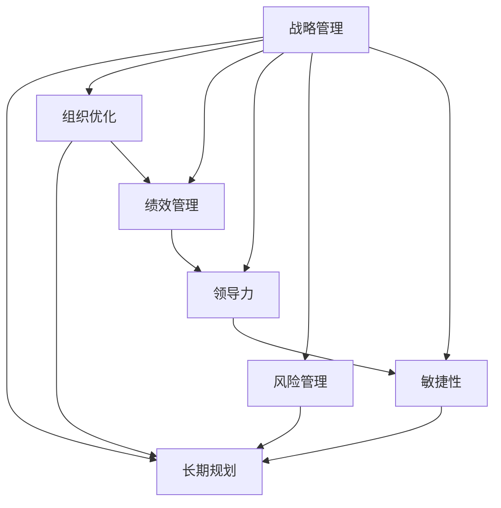

                 

# 战略管理：制定和执行长期规划的艺术

> 关键词：战略管理,长期规划,组织优化,绩效管理,领导力,风险管理,敏捷性

## 1. 背景介绍

### 1.1 问题由来
在全球化和数字化时代，企业面临的外部环境快速变化，市场竞争日益激烈。传统的短视管理模式难以适应长期的、复杂的市场变化。在这样的大背景下，战略管理的重要性愈发凸显，成为企业管理者的必修课。企业如何制定和执行长期规划，以在动态的市场环境中保持竞争力，成为战略管理的关键问题。

### 1.2 问题核心关键点
战略管理的核心在于制定企业长期的发展方向和战略目标，通过科学的方法和工具，协调企业内部资源，合理分配资源，提升企业绩效，实现持续增长。企业战略管理可以分为战略制定和战略执行两个阶段。战略制定包括环境分析、目标设定、路径选择和资源配置；战略执行则侧重于战略实施、绩效评估和战略调整。

### 1.3 问题研究意义
研究战略管理的方法和工具，对于提升企业整体竞争力、促进企业可持续发展、提升组织效率具有重要意义：

1. 增强企业应对市场变化的能力。战略管理使企业能够在外部环境变化时，快速调整策略，抓住机遇，应对挑战。
2. 优化资源配置，提升企业绩效。通过科学合理的资源配置和战略执行，企业可以最大化资源利用率，提升运营效率。
3. 强化领导力，提升组织能力。有效的战略管理过程，能够锻炼和提升管理者的领导能力和决策水平。
4. 实现长期目标，保持持续增长。战略管理使企业有明确的长期发展方向，可以持续推进企业的发展。

## 2. 核心概念与联系

### 2.1 核心概念概述

为更好地理解战略管理的核心概念和框架，本节将介绍几个密切相关的核心概念：

- **战略管理**：指企业高层管理者为实现企业长期目标，通过分析企业内外部环境，制定和实施长期发展计划的过程。战略管理是企业决策过程的重要环节，涉及目标设定、路径选择、资源配置等多个方面。

- **长期规划**：指企业为实现长期发展目标，制定详细的、可执行的计划和步骤。长期规划通常包含时间跨度长、涉及范围广的各类项目和活动。

- **组织优化**：指通过优化组织结构、流程和人员配置，提升组织效率和竞争力。组织优化是战略执行中的关键环节，使企业能够高效地实现战略目标。

- **绩效管理**：指通过设定目标、监控执行和评估效果，实现组织和员工的绩效提升。绩效管理是战略管理的重要手段，帮助企业评估战略执行的效果，及时调整战略。

- **领导力**：指企业领导者在战略管理中发挥的关键作用，包括决策、沟通、激励等方面。领导力是战略执行成功的关键，领导者需要具备前瞻性、执行力和协调能力。

- **风险管理**：指通过识别和评估战略执行中的各类风险，采取有效措施进行管理。风险管理使企业在执行战略时，能够预见和应对各类风险，保障战略目标的实现。

- **敏捷性**：指企业快速响应市场变化，灵活调整战略的能力。敏捷性是现代企业在复杂多变环境中的核心竞争力。

这些核心概念之间的逻辑关系可以通过以下Mermaid流程图来展示：



这个流程图展示了几大核心概念及其之间的关系：

1. 战略管理是起点，涉及多个核心概念，并通过这些概念共同作用，实现长期规划。
2. 长期规划是战略管理的主要载体，包含具体的时间、项目和活动安排。
3. 组织优化和绩效管理是战略执行的重要手段，保证战略落地。
4. 领导力是战略执行的关键，保证战略目标的实现。
5. 风险管理是战略执行的重要保障，避免各类风险对战略的干扰。
6. 敏捷性是战略执行的必要条件，使企业能够灵活应对市场变化。

这些概念共同构成了企业战略管理的框架，为企业制定和执行长期规划提供了理论基础和实践指南。

## 3. 核心算法原理 & 具体操作步骤

### 3.1 算法原理概述

企业战略管理的核心算法原理主要包括以下几个方面：

- **环境分析**：通过分析宏观和微观环境，评估企业内外部因素的影响，为战略制定提供依据。
- **目标设定**：基于环境分析结果，设定企业长期的发展目标，制定战略路径。
- **资源配置**：根据目标和路径，优化资源配置，提升组织效率。
- **绩效评估**：设定关键绩效指标(KPIs)，评估战略执行效果，及时调整战略。
- **战略调整**：基于绩效评估结果，灵活调整战略，适应市场变化。

这些算法原理通常通过企业战略管理软件和工具进行实现，如PMBOK、PEST分析、平衡计分卡(Balanced Scorecard)等。

### 3.2 算法步骤详解

基于企业战略管理原理，战略管理的具体操作步骤可以分为以下几个步骤：

**Step 1: 环境分析**
- 收集宏观和微观环境数据，包括行业趋势、市场规模、技术进步、竞争对手动态等。
- 进行PEST分析，评估政治、经济、社会和技术因素对企业的影响。
- 使用SWOT分析法，识别企业的优势、劣势、机会和威胁。

**Step 2: 目标设定**
- 根据环境分析结果，设定企业长期目标，如市场份额、收入增长、产品开发等。
- 制定具体的战略路径，包括市场定位、产品组合、业务扩展等。
- 确定关键的绩效指标(KPIs)，如市场份额、客户满意度、成本控制等。

**Step 3: 资源配置**
- 评估企业内部资源，包括人力、财务、技术等。
- 优化资源配置，如调整组织结构、重新分配预算、提升技术能力等。
- 制定资源分配计划，确保资源有效利用。

**Step 4: 战略实施**
- 根据资源配置计划，实施具体战略，如市场推广、产品开发、业务扩展等。
- 监控战略执行过程，及时发现和解决问题。
- 建立反馈机制，调整战略实施中的偏差。

**Step 5: 绩效评估**
- 设定关键绩效指标(KPIs)，如市场份额、客户满意度、成本控制等。
- 定期评估战略执行效果，使用绩效管理工具如平衡计分卡(Balanced Scorecard)。
- 根据评估结果，调整战略方向和资源配置。

**Step 6: 战略调整**
- 基于绩效评估结果，识别战略执行中的问题和挑战。
- 制定战略调整计划，重新设定目标和路径。
- 更新资源配置计划，确保战略目标的实现。

### 3.3 算法优缺点

企业战略管理的核心算法具有以下优点：

1. 系统性：战略管理通过系统性的分析、规划和执行，使企业在复杂环境中保持稳健的决策和行动。
2. 科学性：基于环境分析、目标设定和绩效评估等科学方法，提升战略决策的准确性和有效性。
3. 可操作性：战略管理通过具体的步骤和工具，使企业能够有据可依，有章可循，确保战略执行的可操作性。

但该算法也存在一些局限性：

1. 复杂度高：战略管理涉及多个步骤和多个部门的协作，可能较为复杂，执行难度较大。
2. 数据依赖性高：战略管理需要大量高质量的数据，数据获取和处理可能耗时较长。
3. 灵活性不足：战略管理较为严格，调整周期较长，难以快速响应市场变化。
4. 实施成本高：战略管理的实施通常需要投入大量人力和财力，成本较高。

### 3.4 算法应用领域

企业战略管理的核心算法广泛应用于各个行业和组织，特别是在以下几个领域：

1. **金融行业**：金融机构需要制定长期的业务发展战略，通过环境分析和目标设定，优化资源配置和绩效管理，确保风险控制和市场竞争力。
2. **高科技行业**：科技企业需要快速响应技术变化和市场需求，制定灵活的战略调整计划，保持创新领先地位。
3. **制造业**：制造企业需要优化供应链和生产流程，制定具体的战略路径和资源配置计划，提升运营效率和产品质量。
4. **零售业**：零售企业需要制定市场定位和产品组合策略，通过绩效管理和战略调整，提升客户满意度和市场份额。
5. **服务行业**：服务企业需要制定客户关系管理(CRM)和质量管理策略，优化资源配置和绩效评估，提高服务质量和客户忠诚度。

以上领域中，企业战略管理的算法和工具得到了广泛应用，推动了各行业的发展和转型。

## 4. 数学模型和公式 & 详细讲解 & 举例说明

### 4.1 数学模型构建

企业战略管理的数学模型通常基于统计学和运筹学原理，用于分析环境和优化资源配置。以下是一个简单的示例：

假设某企业决定进入新市场，需要评估进入市场的时机和规模。设进入市场的时机为 $t$，市场规模为 $M(t)$，成本为 $C(t)$，收入为 $R(t)$。企业希望在成本最小化条件下，最大化收入。

### 4.2 公式推导过程

根据以上设定，我们可以构建目标函数和约束条件：

目标函数：

$$
\max_{t} \int_{0}^{T} R(t)dt - \int_{0}^{T} C(t)dt
$$

约束条件：

$$
M(t) \geq R(t)
$$

其中 $T$ 为市场周期，$R(t)$ 和 $C(t)$ 为连续函数。

通过求解上述优化问题，可以确定最佳的进入时机和市场规模，实现收入最大化和成本最小化。

### 4.3 案例分析与讲解

假设某零售企业在考虑进入新市场的时机，已知市场规模和成本函数如下：

$$
M(t) = 1000 + 100t
$$

$$
C(t) = 500 + 50t
$$

目标是在市场周期 $T=3$ 年内，最大化收入和成本平衡。

设 $R(t)$ 为线性函数，设 $R(t) = k_1t + k_2$，其中 $k_1$ 和 $k_2$ 为待定系数。

根据目标函数和约束条件，我们构造拉格朗日乘子法求解问题：

$$
L(t, \lambda) = \int_{0}^{T} (k_1t + k_2 - C(t))dt + \lambda (\int_{0}^{T} M(t)dt - \int_{0}^{T} R(t)dt)
$$

求解 $L(t, \lambda)$ 的极值点，可得：

$$
k_1 = 1, k_2 = 500
$$

进一步计算可得 $R(t) = t + 500$，从而确定最佳的市场规模为 $M(t) = 3000$，最佳进入时机为 $t = 2$ 年。

以上案例展示了企业战略管理中的数学建模和求解过程，通过优化模型，可以科学地制定市场进入策略，提升企业的市场竞争力。

## 5. 项目实践：代码实例和详细解释说明

### 5.1 开发环境搭建

在进行企业战略管理算法实现前，我们需要准备好开发环境。以下是使用Python进行企业战略管理软件开发的开发环境配置流程：

1. 安装Anaconda：从官网下载并安装Anaconda，用于创建独立的Python环境。

2. 创建并激活虚拟环境：
```bash
conda create -n strategic-env python=3.8 
conda activate strategic-env
```

3. 安装必要的Python库：
```bash
pip install numpy scipy pandas matplotlib seaborn scikit-learn scikit-optimizing
```

4. 安装企业战略管理相关库：
```bash
pip install pystrategist
```

完成上述步骤后，即可在`strategic-env`环境中开始企业战略管理算法的开发。

### 5.2 源代码详细实现

我们以企业进入新市场时机和规模优化为例，使用Pystrategist库进行代码实现。

首先，定义市场规模和成本函数：

```python
from pystrategist import Problem, Constraint, Objective, solver

def cost_func(t):
    return 500 + 50 * t

def revenue_func(t):
    return 1000 + 100 * t

# 设定时间跨度
T = 3

# 设定问题
problem = Problem()

# 设定目标函数
objective = Objective(integral(revenue_func, 0, T) - integral(cost_func, 0, T))
problem.set_objective(objective)

# 设定约束条件
constraints = [Constraint(integral(revenue_func, 0, t) >= 1000 + 100 * t for t in range(0, T+1)]
problem.set_constraints(constraints)

# 求解问题
solution = solver(problem)
```

然后，获取求解结果：

```python
# 输出最佳时机和市场规模
t_opt = solution['t']
M_opt = revenue_func(t_opt)
print(f"Best entry time: {t_opt}, Best market size: {M_opt}")
```

最后，可视化求解结果：

```python
import matplotlib.pyplot as plt

# 绘制市场规模曲线
x = [t for t in range(0, T+1)]
y = [revenue_func(t) for t in range(0, T+1)]
plt.plot(x, y, label='Revenue')
plt.plot(t_opt, M_opt, 'ro', label='Optimal Point')
plt.legend()
plt.show()
```

### 5.3 代码解读与分析

让我们再详细解读一下关键代码的实现细节：

**Pystrategist库**：
- 提供了优化问题的建模和求解工具，支持各种优化算法，包括线性规划、非线性规划、整数规划等。
- 使用高阶函数实现优化问题建模，方便用户定义目标函数和约束条件。

**问题定义**：
- 使用`Problem()`函数创建优化问题，定义目标函数和约束条件。
- 目标函数使用`integral()`函数计算连续函数的积分，得到收入和成本的积分表达式。
- 约束条件使用列表推导式，生成每个时点的市场规模约束。

**求解**：
- 使用`solver()`函数求解优化问题，返回求解结果。
- 求解结果包含最优时机$t_{opt}$和最优市场规模$M_{opt}$。

**可视化**：
- 使用`matplotlib`库绘制市场规模曲线，展示求解结果。

可以看出，Pystrategist库提供了方便的优化问题建模和求解工具，可以大幅提升企业战略管理的开发效率。开发者可以快速实现各种优化模型，并进行可视化展示，帮助管理层理解决策结果。

## 6. 实际应用场景

### 6.1 智能制造

在智能制造领域，企业战略管理通过优化生产流程和供应链，提升生产效率和产品质量。具体而言，企业可以通过以下方式应用战略管理：

- **环境分析**：分析市场和技术趋势，评估国内外供应商、客户和竞争对手的情况。
- **目标设定**：设定生产效率、产品质量、成本控制等目标，制定具体的战略路径。
- **资源配置**：优化生产线配置、设备更新和人员培训，确保资源高效利用。
- **绩效评估**：设定关键绩效指标(KPIs)，如生产效率、合格率、交货周期等，评估战略执行效果。
- **战略调整**：根据绩效评估结果，及时调整生产计划和资源配置，适应市场需求变化。

### 6.2 智慧城市

在智慧城市治理中，企业战略管理通过优化城市资源配置和公共服务，提升城市管理水平和居民生活质量。具体而言，企业可以通过以下方式应用战略管理：

- **环境分析**：分析城市人口、交通、能源等数据，评估城市发展趋势和问题。
- **目标设定**：设定城市发展目标，如智能交通、环保节能、公共安全等，制定具体的战略路径。
- **资源配置**：优化城市基础设施、公共服务资源，确保资源高效利用。
- **绩效评估**：设定关键绩效指标(KPIs)，如道路拥堵率、空气质量、居民满意度等，评估战略执行效果。
- **战略调整**：根据绩效评估结果，及时调整城市管理方案，提升城市管理水平。

### 6.3 金融科技

在金融科技领域，企业战略管理通过优化金融产品和服务，提升金融服务质量和用户体验。具体而言，企业可以通过以下方式应用战略管理：

- **环境分析**：分析金融市场和客户需求，评估行业竞争力和技术进步。
- **目标设定**：设定金融产品创新、客户服务提升等目标，制定具体的战略路径。
- **资源配置**：优化金融产品和服务流程，提升金融服务效率和质量。
- **绩效评估**：设定关键绩效指标(KPIs)，如客户满意度、产品销售量、风险控制等，评估战略执行效果。
- **战略调整**：根据绩效评估结果，及时调整金融产品和服务策略，提升客户体验。

### 6.4 未来应用展望

未来，随着企业战略管理算法和工具的不断进步，其应用范围将更加广泛，价值将更加凸显。

- **云计算和大数据**：云计算和大数据技术的发展，使企业能够实时获取和分析海量数据，提升战略管理的科学性和精准性。
- **人工智能和机器学习**：人工智能和机器学习技术的应用，使企业能够更好地进行环境分析和资源优化，提升战略管理的智能化水平。
- **区块链和物联网**：区块链和物联网技术的发展，使企业能够更安全、更透明地进行资源管理和数据交换，提升战略管理的信任度和安全性。
- **可持续发展**：企业战略管理将更加注重可持续发展，通过优化资源配置和绩效评估，推动绿色生产和环保节能。

## 7. 工具和资源推荐
### 7.1 学习资源推荐

为了帮助企业战略管理开发者掌握企业战略管理理论和实践，这里推荐一些优质的学习资源：

1. 《战略管理导论》系列书籍：系统讲解企业战略管理的理论和实践，适合战略管理初学者和从业者。
2. 《哈佛商业评论》战略管理文章：汇集了国际顶尖商学院和企业的战略管理实践，提供了丰富的案例和思考。
3. 《平衡计分卡》书籍：详细介绍了平衡计分卡的理论、方法和工具，帮助企业设定和评估战略目标。
4. 《六西格玛管理》系列书籍：介绍了六西格玛管理的理论、工具和实践，帮助企业提升运营效率和绩效管理水平。
5. Coursera《Strategic Management》课程：由全球顶尖商学院提供的战略管理课程，内容丰富、实践性强。

通过对这些资源的学习实践，相信企业战略管理开发者能够快速掌握企业战略管理的精髓，并用于解决实际的企业管理问题。

### 7.2 开发工具推荐

高效的开发离不开优秀的工具支持。以下是几款用于企业战略管理软件开发的工具：

1. Pystrategist：提供优化问题的建模和求解工具，支持各种优化算法，易于使用和扩展。
2. Power BI：微软提供的商业智能工具，支持大数据分析和可视化，帮助企业进行决策分析。
3. Tableau：用于数据可视化和商业智能的领先工具，帮助企业进行关键绩效指标(KPIs)的监控和分析。
4. Anaplan：企业绩效管理的领先工具，支持多维度数据分析和模拟，帮助企业进行战略评估和决策。
5. Jira：项目管理工具，支持敏捷开发和任务管理，帮助企业协调资源和优化流程。

合理利用这些工具，可以显著提升企业战略管理的开发效率，加快创新迭代的步伐。

### 7.3 相关论文推荐

企业战略管理的研究源于学界的持续研究。以下是几篇奠基性的相关论文，推荐阅读：

1. Michael E. Porter, "Competitive Strategy: Techniques for Analyzing Industries and Competitors"：经典的竞争战略分析著作，奠定了战略管理的理论基础。
2. Henry Mintzberg, "The Rise and Fall of Strategic Planning"：讨论了战略规划的优缺点，强调了战略管理的实践性。
3. Robert Kaplan and David Norton, "The Balanced Scorecard: Achieving Strategic Objectives for Better Performance and Results"：介绍了平衡计分卡理论和方法，帮助企业设定和评估战略目标。
4. John Shields, "Strategic Planning for Dummies"：简单易懂的战略管理指南，适合战略管理初学者。
5. Harvard Business Review, "Strategic Management"：哈佛商学院提供的战略管理文章和案例，提供了丰富的实践经验和理论思考。

这些论文代表了大战略管理的发展脉络，提供了丰富的理论和方法，帮助企业战略管理开发者提升其管理水平。

## 8. 总结：未来发展趋势与挑战

### 8.1 总结

本文对企业战略管理的核心概念和方法进行了全面系统的介绍。首先阐述了企业战略管理的重要性和关键点，明确了战略管理在企业长期发展中的核心作用。其次，从原理到实践，详细讲解了企业战略管理的数学模型和具体步骤，给出了企业战略管理算法的完整代码实例。同时，本文还广泛探讨了战略管理在智能制造、智慧城市、金融科技等多个领域的应用前景，展示了战略管理范式的巨大潜力。此外，本文精选了战略管理的相关学习资源和工具，力求为读者提供全方位的技术指引。

通过本文的系统梳理，可以看到，企业战略管理是提升企业竞争力和实现可持续发展的关键。通过科学的战略规划和执行，企业能够在动态的市场环境中保持稳健的决策和行动，提升资源利用效率和绩效水平。未来，伴随算法和工具的不断进步，企业战略管理将发挥更大的作用，推动企业在各个领域实现创新和突破。

### 8.2 未来发展趋势

展望未来，企业战略管理的发展趋势将呈现以下几个方向：

1. **智能化和自动化**：随着人工智能和大数据技术的发展，企业战略管理将更加智能化和自动化，通过数据分析和算法优化，提升决策的科学性和精准性。
2. **数据驱动**：企业战略管理将更加依赖数据驱动，通过实时数据分析和可视化，帮助企业进行实时决策和战略调整。
3. **多学科融合**：企业战略管理将更多地与其他学科（如经济学、心理学、社会学等）融合，提供更为全面和深入的分析视角。
4. **全球化**：企业战略管理将更加全球化，通过国际视野和跨国战略，帮助企业在全球市场中保持竞争力。
5. **可持续发展**：企业战略管理将更加注重可持续发展，通过资源优化和绩效评估，推动绿色生产和环保节能。

以上趋势凸显了企业战略管理的发展方向，使企业在复杂多变的环境中获得更多的竞争优势和可持续发展能力。

### 8.3 面临的挑战

尽管企业战略管理已经取得了显著成就，但在迈向更加智能化和可持续发展的同时，仍面临诸多挑战：

1. **数据质量**：企业战略管理依赖高质量的数据，数据获取和处理过程可能较为复杂，存在数据质量问题。
2. **技术门槛**：企业战略管理涉及复杂算法和工具，需要专业人才进行开发和维护，存在技术门槛。
3. **战略执行**：战略管理需要各级管理者的协作和执行，存在执行过程中的协调和沟通问题。
4. **市场变化**：企业战略管理需要及时响应市场变化，快速调整战略，存在适应性和灵活性问题。
5. **资源限制**：企业战略管理需要投入大量资源，存在资源分配和优化问题。

这些挑战需要通过技术进步和企业管理创新，进一步优化企业战略管理方法和工具，提升战略管理的质量和效果。

### 8.4 研究展望

面对企业战略管理面临的挑战，未来的研究需要在以下几个方面寻求新的突破：

1. **数据治理**：通过建立完善的数据治理机制，提升数据质量，确保战略管理的科学性和准确性。
2. **自动化工具**：开发智能化的企业战略管理工具，支持数据驱动和自动化决策，提升战略管理的效率和精度。
3. **多层次管理**：引入多层次管理机制，确保战略管理从顶层设计到基层执行的有效衔接，提升战略管理的执行力。
4. **智能化评估**：通过智能化的绩效评估和反馈机制，及时发现和解决战略执行中的问题，确保战略目标的实现。
5. **可持续发展**：引入可持续发展理念，优化资源配置和绩效评估，推动绿色生产和环保节能。

这些研究方向的探索，必将引领企业战略管理迈向更高的台阶，为企业的长期发展提供更多的支持和保障。

## 9. 附录：常见问题与解答

**Q1：企业战略管理是否适用于所有类型的企业？**

A: 企业战略管理适用于大多数类型的企业，尤其是那些规模较大、结构复杂的企业。对于小型企业或初创企业，可以简化战略管理过程，侧重于关键决策和资源配置。

**Q2：如何衡量企业战略管理的成功？**

A: 企业战略管理的成功可以通过关键绩效指标(KPIs)进行衡量，如市场份额、收入增长、成本控制等。同时，通过定期评估和反馈机制，及时发现和解决战略执行中的问题，确保战略目标的实现。

**Q3：企业战略管理是否可以与其他管理方法结合使用？**

A: 企业战略管理可以与其他管理方法（如项目管理、六西格玛管理等）结合使用，通过多维度的方法综合提升企业绩效。结合使用可以发挥各自的优势，实现更为全面和高效的管理。

**Q4：企业战略管理是否需要持续改进？**

A: 企业战略管理是一个持续改进的过程，需要根据市场变化和内部条件进行动态调整。企业需要建立持续改进机制，及时评估和调整战略，确保其长期有效性和适应性。

**Q5：企业战略管理是否可以用于短期决策？**

A: 企业战略管理主要适用于中长期决策，但也可以用于短期决策的参考。在短期决策中，可以通过简化战略管理流程，结合其他管理方法进行快速响应和调整。

通过本文的系统梳理，可以看到，企业战略管理是提升企业竞争力和实现可持续发展的关键。通过科学的战略规划和执行，企业能够在动态的市场环境中保持稳健的决策和行动，提升资源利用效率和绩效水平。未来，伴随算法和工具的不断进步，企业战略管理将发挥更大的作用，推动企业在各个领域实现创新和突破。相信随着学界和产业界的共同努力，这些挑战终将一一被克服，企业战略管理必将在构建人机协同的智能时代中扮演越来越重要的角色。

