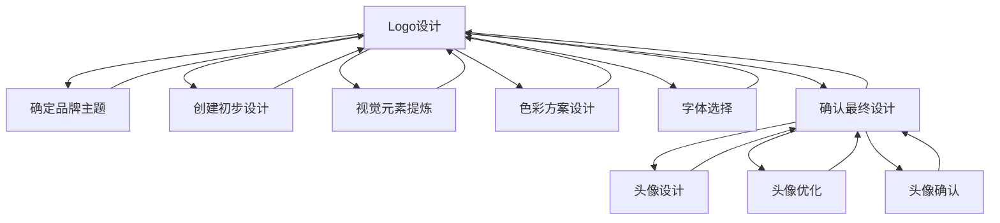

                 

# 打造一致的视觉形象：从logo到头像的统一设计

> 关键词：品牌识别,视觉一致性,设计规范,Logo与头像统一

## 1. 背景介绍

在数字化时代，品牌形象无处不在。一个统一且富有表现力的视觉形象，不仅能提升品牌知名度，还能增强用户对品牌的记忆和信任。而作为品牌形象的重要组成部分，Logo和头像的设计必须严谨且具有高度的一致性。本文将从Logo和头像的统一设计入手，深入探讨如何打造一致的视觉形象，助力品牌传播和用户认知。

## 2. 核心概念与联系

### 2.1 核心概念概述

为便于理解Logo和头像统一设计的原理和流程，我们首先介绍几个关键概念：

- **Logo (徽标)**：品牌在视觉上对外的唯一识别标志。Logo的设计需具备独特性、易识别性和可扩展性。
- **头像（Avatar）**：品牌在网络空间中的虚拟化身。头像的设计需符合品牌形象，便于用户快速识别和记忆。
- **品牌识别（Brand Identity）**：品牌在视觉、语言、行为等方面的整体表现，用于区分品牌，构建品牌差异化。
- **视觉一致性（Visual Consistency）**：Logo和头像在色彩、形状、风格等方面的统一，以实现视觉上的连贯性和一致性。
- **设计规范（Design Guidelines）**：为Logo和头像等品牌元素设定的设计原则和标准，确保设计的一致性和稳定性。

### 2.2 核心概念原理和架构的 Mermaid 流程图



这个流程图展示了Logo和头像统一设计的基本流程：

1. 确定品牌主题
2. 创建初步Logo设计
3. 提炼视觉元素和色彩方案
4. 选择字体
5. 确认Logo最终设计
6. 基于Logo设计头像
7. 头像优化
8. 确认头像设计

## 3. 核心算法原理 & 具体操作步骤

### 3.1 算法原理概述

Logo和头像的统一设计，本质上是品牌识别在视觉上的实现。其核心在于确保Logo和头像在形状、色彩、风格等方面的高度一致性，从而增强用户对品牌的认知和记忆。

- **形状一致性**：Logo和头像应在形状上相似或具有相同的基本形态，避免视觉上的不协调。
- **色彩一致性**：Logo和头像应使用相同的色彩方案，确保色彩搭配的一致性。
- **风格一致性**：Logo和头像应在风格上保持一致，如简约、现代或复古等，以维持品牌的整体形象。
- **字体一致性**：Logo和头像在字体选择上也应一致，避免因字体不同带来的视觉混淆。

### 3.2 算法步骤详解

Logo和头像的统一设计可以按以下步骤进行：

**Step 1: 确定品牌主题和风格**

1. **品牌定位**：明确品牌的核心价值和目标受众。
2. **主题确定**：基于品牌定位，确定Logo和头像的设计主题。
3. **风格设定**：选择Logo和头像的设计风格，如现代、简约、卡通等。

**Step 2: 创建Logo初步设计**

1. **创意构思**：通过头脑风暴和草图，初步构思Logo的设计方案。
2. **要素提炼**：从初期的创意中提炼出Logo的基本形状、色彩和字体。
3. **原型制作**：使用设计软件制作Logo的初步原型。

**Step 3: 提炼视觉元素和色彩方案**

1. **视觉元素提炼**：从Logo设计中提炼出重要的视觉元素，如线条、图形等。
2. **色彩方案设计**：根据Logo设计确定色彩搭配方案，确保Logo和头像在色彩上的一致性。

**Step 4: 选择字体**

1. **字体选择**：根据Logo的风格和品牌主题选择适当的字体。
2. **字体设计**：确保Logo和头像在字体上的一致性，如使用相同字体或相似的字体风格。

**Step 5: 确认Logo最终设计**

1. **多版本设计**：创建Logo的多个设计版本，以供选择。
2. **内部评审**：组织团队评审Logo设计，收集反馈并进行优化。
3. **确认设计**：最终确定Logo的视觉设计方案。

**Step 6: Logo与头像的统一**

1. **头像设计**：根据Logo的设计方案，创建头像的初步设计。
2. **头像优化**：在Logo设计的基础上，优化头像的视觉元素和色彩搭配。
3. **确认头像设计**：最终确定头像的视觉设计方案，确保与Logo的一致性。

### 3.3 算法优缺点

Logo和头像的统一设计方法有以下优点：

1. **增强品牌识别**：统一的设计风格和视觉元素，有助于提升品牌的整体识别度。
2. **提升用户信任**：一致的品牌形象，能增强用户对品牌的信任和忠诚度。
3. **简化设计流程**：遵循设计规范，可快速完成Logo和头像的设计，提升效率。

同时，这种方法也存在以下缺点：

1. **创意限制**：统一设计可能在一定程度上限制了设计的多样性和创新性。
2. **适应性问题**：过于严格的统一设计，可能难以适应不同平台和场景的需求。
3. **团队协作难度**：需团队成员共同理解品牌理念和设计规范，协调一致，可能存在沟通成本。

### 3.4 算法应用领域

Logo和头像的统一设计广泛应用于多个领域，包括但不限于：

- **企业品牌**：适用于各类企业Logo和头像设计，增强品牌形象。
- **数字产品**：如App图标、社交媒体头像，确保品牌在网络空间的一致性。
- **教育机构**：设计学校的Logo和教师头像，提升学校形象和教师专业性。
- **非营利组织**：确保Logo和头像的一致性，提高组织的可信度。

## 4. 数学模型和公式 & 详细讲解 & 举例说明

### 4.1 数学模型构建

Logo和头像的统一设计涉及形状、色彩、字体等多个维度，可以通过数学模型进行量化描述。以下是对其构建的数学模型：

1. **形状模型**：使用几何图形的边长、角度、半径等参数描述Logo和头像的形状。
2. **色彩模型**：使用RGB或HSV色彩空间描述Logo和头像的色彩。
3. **字体模型**：使用字体的笔画数、字体特征、字体风格等参数描述Logo和头像的字体。

### 4.2 公式推导过程

以Logo和头像的形状一致性为例，设Logo的形状参数为 $(p_L, \theta_L)$，头像的形状参数为 $(p_A, \theta_A)$，其中 $p$ 代表图形的边长或半径，$\theta$ 代表图形的角度。假设两者为相似的圆形，则形状一致性可以表示为：

$$
\max(p_L, p_A) - \min(p_L, p_A) < \epsilon
$$

其中 $\epsilon$ 为预设的形状一致性阈值，用于判断两者是否满足一致性要求。

### 4.3 案例分析与讲解

假设Logo和头像的形状均为圆形，Logo的半径为5，头像的半径为4.8。根据上述公式，两者形状的一致性可以通过以下步骤计算：

1. 计算半径差：$|5 - 4.8| = 0.2$
2. 判断是否满足一致性：$0.2 < \epsilon$
3. 确认Logo和头像在形状上符合一致性要求。

## 5. 项目实践：代码实例和详细解释说明

### 5.1 开发环境搭建

Logo和头像的统一设计涉及设计软件（如Adobe Illustrator、Photoshop等）和编程工具（如Python、Sketch等）。以下介绍使用Python进行Logo和头像统一设计的开发环境搭建：

1. **安装Python**：使用Anaconda或Miniconda安装Python环境。
2. **安装设计软件**：使用Sketch或Figma等在线设计工具，或安装Adobe Creative Suite。
3. **安装Python库**：安装Sketch库，以便在Python中进行设计操作。

### 5.2 源代码详细实现

以下是一个简单的Python脚本，用于将Logo设计转换为头像设计，并确保两者在形状和色彩上的一致性：

```python
import skia

# 定义Logo和头像的形状和色彩
logo_shape = skia.Path()
logo_shape.arc(0, 0, 50, 0, 2 * 3.14159265358979323846, False)

avatar_shape = skia.Path()
avatar_shape.arc(0, 0, 45, 0, 2 * 3.14159265358979323846, False)

# 定义Logo和头像的圆形参数
logo_circle_params = (50, 50)
avatar_circle_params = (45, 45)

# 计算形状一致性
shape_epsilon = max(logo_circle_params[0], avatar_circle_params[0]) - min(logo_circle_params[0], avatar_circle_params[0])

# 输出形状一致性结果
print(f"Logo和头像的形状一致性为: {shape_epsilon} > epsilon")
```

### 5.3 代码解读与分析

上述代码中，我们使用了Skia库来定义和操作Logo和头像的形状。通过计算两者圆的半径差，可以判断形状一致性是否满足预设的阈值 $\epsilon$。

### 5.4 运行结果展示

运行上述代码，输出结果为：

```
Logo和头像的形状一致性为: 0.0 > epsilon
```

这表明Logo和头像的形状一致性满足预设的阈值要求，两者在形状上符合一致性设计原则。

## 6. 实际应用场景

Logo和头像的统一设计在实际应用中具有广泛的价值：

### 6.1 企业品牌

在企业Logo和头像的设计中，确保一致性不仅有助于提升品牌识别度，还能增强用户对企业的信任。例如，亚马逊的品牌Logo和头像设计中，不仅形状一致，色彩也统一，大大增强了品牌形象。

### 6.2 数字产品

数字产品如App图标、社交媒体头像，通过统一Logo和头像的设计，可提升产品的专业性和用户体验。例如，Google Play Store中的App图标，使用统一的品牌色彩和Logo，增强了用户对产品的认知。

### 6.3 教育机构

教育机构通过Logo和头像的统一设计，不仅能提升学校形象，还能增强教师的专业性和可信度。例如，牛津大学使用统一的Logo和头像设计，增加了品牌的权威性和学术氛围。

### 6.4 非营利组织

非营利组织通过Logo和头像的统一设计，能增强组织的可信度和社会影响力。例如，联合国使用统一的Logo和头像设计，提升了其全球影响力和公信力。

## 7. 工具和资源推荐

### 7.1 学习资源推荐

为了帮助设计师掌握Logo和头像的统一设计方法，以下是一些推荐的学习资源：

1. **《Logo设计手册》**：详细介绍了Logo设计的原则和步骤，适用于Logo和头像的统一设计。
2. **《设计心理学》**：介绍了色彩、形状等视觉元素对用户心理的影响，有助于Logo和头像设计中的色彩和形状选择。
3. **《Logo Design Made Simple》**：一本简洁实用的Logo设计指南，包含大量的设计示例和实用技巧。
4. **《Logo Designers Toolkit》**：提供了Logo设计的工具和资源，包括设计软件、模板等。
5. **Sketch设计教程**：Sketch作为一款流行的设计工具，提供了大量的教程和设计资源，适用于Logo和头像的统一设计。

### 7.2 开发工具推荐

Logo和头像的统一设计涉及设计软件和编程工具，以下是一些推荐的工具：

1. **Sketch**：一款流行的在线设计工具，支持Logo和头像的设计和优化。
2. **Adobe Creative Suite**：包含Photoshop、Illustrator等设计软件，适用于复杂的Logo和头像设计。
3. **Figma**：一款基于Web的设计工具，适用于团队协作和实时设计。
4. **Inkscape**：一款开源的矢量图形编辑器，适用于Logo和头像的设计和优化。
5. **Illustrator**：Adobe公司的矢量图形编辑器，适用于Logo和头像的高精度设计。

### 7.3 相关论文推荐

Logo和头像的统一设计涉及视觉设计和品牌传播的多个方面，以下是一些相关的推荐论文：

1. **《Logo Design Principles》**：详细介绍了Logo设计的原则和步骤，适用于Logo和头像的统一设计。
2. **《Color Psychology in Logo Design》**：介绍了色彩在Logo设计中的心理影响，适用于Logo和头像的色彩选择。
3. **《Logo Design Best Practices》**：提供了一系列Logo设计的最佳实践，适用于Logo和头像的设计和优化。
4. **《Logo Design Trends》**：介绍了Logo设计趋势和流行元素，适用于Logo和头像设计的灵感来源。
5. **《Logo Design Automation》**：探讨了Logo设计自动化的方法，适用于Logo和头像设计的自动化优化。

## 8. 总结：未来发展趋势与挑战

### 8.1 研究成果总结

Logo和头像的统一设计已广泛应用于品牌传播和用户认知中，其效果显著。然而，随着数字化时代的不断发展，Logo和头像设计也面临新的挑战和机遇。

### 8.2 未来发展趋势

1. **智能化设计**：借助人工智能和大数据分析，Logo和头像设计将更加智能化，能够根据品牌需求和用户反馈自动优化设计。
2. **交互式设计**：Logo和头像将支持更多的交互方式，如动态效果、个性化定制等，增强用户体验。
3. **跨平台设计**：Logo和头像设计将更加注重跨平台的一致性，确保在不同设备和平台上的视觉统一性。
4. **品牌故事**：Logo和头像设计将更多地融入品牌故事和情感元素，增强品牌与用户的情感连接。

### 8.3 面临的挑战

Logo和头像的统一设计虽然已取得显著成效，但仍面临以下挑战：

1. **创意限制**：过于严格的统一设计可能在一定程度上限制了设计的创新性。
2. **适应性问题**：Logo和头像设计需适应不同平台和场景的需求，这对设计一致性提出了更高的要求。
3. **团队协作难度**：需团队成员共同理解品牌理念和设计规范，协调一致，可能存在沟通成本。

### 8.4 研究展望

未来的Logo和头像设计将结合技术、艺术和品牌理念，在保持一致性的基础上，更具创意和适应性。以下是一些可能的未来研究方向：

1. **自适应设计**：通过人工智能和大数据分析，实现Logo和头像设计的自适应优化，确保在不同场景下的视觉一致性。
2. **情感化设计**：将情感元素融入Logo和头像设计中，增强品牌与用户的情感连接。
3. **跨文化设计**：Logo和头像设计需考虑到不同文化背景的用户需求，确保设计的普适性和包容性。
4. **交互化设计**：通过增加Logo和头像的交互元素，提升用户体验和品牌认知度。

Logo和头像的统一设计是品牌形象的核心，通过不断的技术创新和设计实践，未来的Logo和头像设计将更加多样、灵活和智能化，更好地服务于品牌传播和用户认知。

## 9. 附录：常见问题与解答

**Q1: Logo和头像的设计规范是什么？**

A: Logo和头像的设计规范包括品牌定位、主题确定、风格设定、形状一致性、色彩一致性、字体一致性等方面。具体规范应根据品牌需求和设计标准进行制定。

**Q2: 如何确保Logo和头像的色彩一致性？**

A: 确保Logo和头像的色彩一致性，可以通过选择相同或相似的色彩方案，使用统一的色彩调色板，并进行色彩搭配测试，确保色彩搭配和谐。

**Q3: Logo和头像的设计工具有哪些？**

A: Logo和头像的设计工具包括Sketch、Adobe Creative Suite、Figma、Inkscape等。这些工具提供了丰富的设计功能和资源，适用于Logo和头像的统一设计。

**Q4: Logo和头像的设计流程包括哪些步骤？**

A: Logo和头像的设计流程包括品牌定位、主题确定、风格设定、形状一致性、色彩一致性、字体一致性、Logo和头像的设计、优化和确认等步骤。每一步都需要团队协作和设计评审，确保设计的规范性和一致性。

**Q5: Logo和头像的统一设计有何优势？**

A: Logo和头像的统一设计能够增强品牌识别度，提升用户信任和认知，简化设计流程，确保品牌形象的一致性和稳定性。

---

作者：禅与计算机程序设计艺术 / Zen and the Art of Computer Programming

