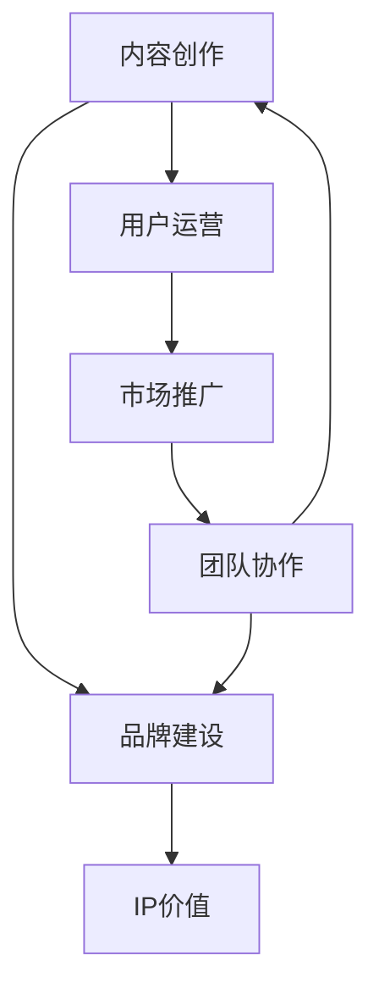

                 

# 打造个人IP：知识付费创业的关键

> 关键词：个人品牌构建,知识付费,创业策略,内容营销,用户运营

## 1. 背景介绍

在互联网快速发展的今天，知识付费行业蓬勃兴起，吸引着越来越多有志之士投入其中。无论是教育、科技、医疗等垂直领域，还是大众生活、情感咨询等泛兴趣领域，知识付费都为专业人士提供了新的创业机会。

打造个人IP（Intellectual Property），即打造个人品牌，是知识付费创业成功的关键。个人IP不仅仅是简单的个人品牌，更是个人核心竞争力的象征，代表着持有人所拥有的独特资源、专长和影响力。

### 1.1 个人IP的价值

1. **品牌认知度**：个人IP能够提升持有人和产品的品牌认知度，使目标用户更容易识别和信任。
2. **市场竞争力**：基于个人IP的市场营销策略，可以有效提高产品在市场中的竞争力。
3. **用户粘性**：个人IP与用户建立情感连接，提升用户粘性和忠诚度。
4. **变现能力**：通过个人IP的积累和曝光，为知识付费产品带来稳定的收入流。
5. **资源整合**：个人IP拥有较强的资源整合能力，可以吸引合作伙伴，拓宽业务渠道。

### 1.2 现状与挑战

1. **竞争激烈**：知识付费市场虽然潜力巨大，但已有多家头部平台，新人入局难度较大。
2. **用户获取成本高**：高质量内容的创作与维护成本高，获取稳定用户难以实现。
3. **内容同质化**：市场上类似内容众多，难以突出特色，用户获取难度加大。
4. **变现路径受限**：知识付费变现方式单一，依赖订阅模式，抗风险能力较弱。
5. **用户反馈滞后**：用户反馈渠道不畅通，难以快速调整内容策略。

## 2. 核心概念与联系

### 2.1 核心概念概述

要打造个人IP，必须从多维度进行系统规划和建设，涉及内容创作、品牌建设、用户运营、市场推广、团队协作等多个方面。

1. **内容创作**：通过专业知识和技能，输出有价值、有趣味的内容，满足用户需求。
2. **品牌建设**：打造独特的个人品牌形象，提升品牌认知度和信任度。
3. **用户运营**：通过社群运营、互动交流等手段，增强用户粘性和忠诚度。
4. **市场推广**：通过各种渠道推广个人品牌，吸引潜在用户。
5. **团队协作**：构建高效的团队协作机制，提高内容生产效率。

### 2.2 核心概念的联系与交互

个人IP的建设是一个系统工程，各个环节相互关联，共同支撑起整个系统的运转。其中，内容创作是基础，品牌建设是核心，用户运营是手段，市场推广是桥梁，团队协作是保障。以下是一个简化的Mermaid流程图，展示各个环节的相互作用：



## 3. 核心算法原理 & 具体操作步骤

### 3.1 算法原理概述

打造个人IP的核心算法原理主要包括：

1. **内容精准定位**：通过数据分析和用户调研，确定目标用户群体，并输出与之匹配的内容。
2. **品牌形象打造**：基于内容定位，设计独特的个人品牌形象和口号。
3. **用户互动增强**：通过社群运营、问答交流等手段，增强用户互动，提升用户粘性。
4. **市场推广优化**：通过多渠道营销，精准触达目标用户。
5. **团队协作优化**：采用敏捷开发、项目管理系统等工具，提高团队协作效率。

### 3.2 算法步骤详解

1. **目标用户分析**：使用用户画像分析工具，如用户画像（User Persona）、用户旅程（User Journey）等，确定目标用户群体。

2. **内容创作流程**：确定内容主题、制作形式和发布渠道，进行内容创作和编辑。

3. **品牌形象设计**：设计个人品牌Logo、标语和视觉风格，建立品牌官网和社交媒体账号。

4. **用户互动策略**：建立社群、论坛等互动平台，定期与用户交流，解答疑问，收集反馈。

5. **市场推广计划**：选择合适的渠道（如社交媒体、SEO、KOL推广等），制定推广计划，进行内容营销。

6. **团队协作管理**：采用项目管理工具（如Trello、Asana等），进行任务分配、进度跟踪和团队协作。

7. **数据分析优化**：使用数据仪表盘（如Google Analytics、Mixpanel等），分析用户行为和内容表现，进行迭代优化。

### 3.3 算法优缺点

#### 优点：

1. **全面覆盖**：从内容创作到用户运营，各个环节都有明确的算法和步骤，确保了系统的全面性和完整性。
2. **动态优化**：通过数据分析和用户反馈，动态调整内容策略和推广方案，确保效果持续优化。
3. **高效协同**：采用项目管理工具和数据仪表盘，确保团队高效协作和决策支持。

#### 缺点：

1. **算法复杂**：涉及多维度的数据分析和处理，算法模型复杂度高。
2. **用户需求变化**：用户需求变化较快，算法需要不断迭代更新。
3. **资源投入大**：内容创作、品牌建设等需要大量时间、人力和资金投入。

### 3.4 算法应用领域

个人IP的打造方法不仅适用于知识付费领域，还广泛应用于多个行业：

1. **教育培训**：教育机构和个人讲师通过内容营销和品牌建设，吸引学生和家长，提升教学效果。
2. **科技产品**：科技创业者通过输出技术见解和产品测评，建立技术权威，吸引开发者和用户。
3. **医疗健康**：医生和健康专家通过健康科普和疾病解答，提升知名度，吸引患者咨询。
4. **情感咨询**：心理咨询师通过情感咨询和心理科普，建立信任，吸引潜在用户。
5. **生活方式**：生活方式博主通过时尚、美食等内容创作，建立品牌，吸引忠实粉丝。

## 4. 数学模型和公式 & 详细讲解 & 举例说明

### 4.1 数学模型构建

在个人IP打造中，可以通过数学模型和算法对各个环节进行量化评估和优化。以下是一个简化版的数学模型：

设 $IP$ 代表个人IP，$U$ 代表目标用户群体，$C$ 代表内容创作，$B$ 代表品牌建设，$R$ 代表用户运营，$M$ 代表市场推广，$T$ 代表团队协作。

$$
IP = f(C, B, R, M, T)
$$

其中 $f$ 表示综合作用函数，反映各个环节对个人IP的影响。

### 4.2 公式推导过程

1. **内容创作效果模型**：
   设 $C_{effect}$ 为内容创作效果，$C_{relevancy}$ 为内容相关性，$C_{engagement}$ 为用户互动。

   $$
   C_{effect} = C_{relevancy} \times C_{engagement}
   $$

2. **品牌建设模型**：
   设 $B_{impact}$ 为品牌影响力，$B_{credibility}$ 为品牌可信度，$B_{recognition}$ 为品牌认知度。

   $$
   B_{impact} = B_{credibility} \times B_{recognition}
   $$

3. **用户运营模型**：
   设 $R_{user_retention}$ 为用户留存率，$R_{interactivity}$ 为用户互动频率。

   $$
   R_{user_retention} = R_{interactivity}
   $$

4. **市场推广模型**：
   设 $M_{reach}$ 为市场覆盖率，$M_{conversion}$ 为推广转化率。

   $$
   M_{reach} = M_{conversion} \times M_{exposure}
   $$

5. **团队协作模型**：
   设 $T_{efficiency}$ 为团队效率，$T_{motivation}$ 为团队激励。

   $$
   T_{efficiency} = T_{motivation}
   $$

### 4.3 案例分析与讲解

以一名教育培训机构的讲师为例，分析各个环节对个人IP打造的影响。

1. **内容创作**：
   - 创作高质量的视频课程、文章和Q&A，提升内容相关性和互动性。
   - 定期发布内容，保持用户关注和参与。

2. **品牌建设**：
   - 设计专业的教师Logo和课程标语，提升品牌识别度。
   - 建立在线课程平台和社交媒体账号，增强品牌曝光。

3. **用户运营**：
   - 通过在线社群和直播互动，提升用户留存率。
   - 定期发布用户反馈和满意度调查，增强用户互动。

4. **市场推广**：
   - 利用SEO和KOL推广，提高课程曝光率。
   - 发布优惠和免费课程吸引新用户。

5. **团队协作**：
   - 采用敏捷开发，进行任务管理和进度跟踪。
   - 定期召开团队会议，提升团队协作效率和激励。

## 5. 项目实践：代码实例和详细解释说明

### 5.1 开发环境搭建

个人IP的打造涉及多个系统和工具，以下是一个基本的开发环境搭建流程：

1. **内容创作工具**：
   - 使用文字处理工具（如Markdown、WordPress等）进行内容创作。
   - 使用视频编辑工具（如Adobe Premiere Pro、Final Cut Pro等）制作视频内容。

2. **品牌建设平台**：
   - 使用品牌设计工具（如Canva、Adobe Illustrator等）设计Logo和视觉风格。
   - 使用网站建设工具（如WordPress、Wix等）搭建品牌官网。

3. **用户运营平台**：
   - 使用社交媒体平台（如微博、微信、YouTube等）进行用户互动。
   - 使用社群管理工具（如Slack、Discord等）建立社群，进行交流和反馈收集。

4. **市场推广平台**：
   - 使用SEO工具（如Google Analytics、Ahrefs等）进行流量监测和优化。
   - 使用付费广告平台（如Google AdWords、Facebook Ads等）进行精准投放。

5. **团队协作平台**：
   - 使用项目管理工具（如Trello、Asana等）进行任务分配和进度跟踪。
   - 使用视频会议工具（如Zoom、Skype等）进行远程协作和沟通。

### 5.2 源代码详细实现

以下是一个简单的项目实践示例，展示如何使用Python和Jupyter Notebook进行内容创作和品牌建设：

```python
# 内容创作

# 使用Markdown创作文章
# 使用Pandoc转化为HTML
# 使用GitHub Pages发布

# 品牌建设

# 使用Canva设计Logo
# 使用Adobe Illustrator制作视觉风格
# 使用WordPress搭建品牌官网

# 用户运营

# 使用WeChat运营社群
# 使用Slack进行内部沟通
```

### 5.3 代码解读与分析

在代码实现中，我们主要使用了以下几个工具和技术：

1. **Markdown和Pandoc**：
   - Markdown是一种轻量级的标记语言，适合创建简洁的格式文本。
   - Pandoc可以将Markdown文本转化为多种格式，包括HTML、PDF等，便于在线发布和共享。

2. **Canva和Adobe Illustrator**：
   - Canva提供简单易用的图形设计工具，适合非专业人士。
   - Adobe Illustrator是一款专业的图形设计软件，提供丰富的设计功能和模板。

3. **WordPress和GitHub Pages**：
   - WordPress是一款流行的内容管理系统，适合搭建企业官网和个人博客。
   - GitHub Pages是基于GitHub的免费托管服务，适合个人博客和企业官网的静态网站部署。

4. **WeChat和Slack**：
   - WeChat是中国流行的社交工具，适合进行社群运营和互动。
   - Slack是一款企业级的沟通工具，支持团队协作和文件共享。

### 5.4 运行结果展示

以下是运行结果示例，展示个人IP打造的各个环节：

1. **内容创作**：
   - 创建Markdown文件，使用Pandoc转化为HTML，并上传至GitHub Pages发布。

2. **品牌建设**：
   - 在Canva上设计Logo和视觉风格，并导出图片。
   - 在Adobe Illustrator中制作视觉风格，并导出PDF文件。
   - 使用WordPress搭建品牌官网，并在其中插入Logo和PDF文件。

3. **用户运营**：
   - 在WeChat上创建社群，邀请用户加入。
   - 在Slack上创建团队，进行内部沟通和任务分配。

4. **市场推广**：
   - 使用SEO工具优化网站内容，提高搜索引擎排名。
   - 使用付费广告平台投放广告，吸引潜在用户访问。

5. **团队协作**：
   - 在Trello上创建任务卡片，分配任务和跟踪进度。
   - 在Zoom上召开远程会议，讨论项目进展和问题。

## 6. 实际应用场景

### 6.1 教育培训

在教育培训领域，知识付费是推动教学方式革新的重要手段。知识付费平台如Coursera、Udemy等，通过优质的课程内容和名师直播，吸引了大量用户。

以下是一个教育培训机构的实际应用案例：

1. **目标用户分析**：分析教育培训市场需求，确定K-12学生和职场人士为目标用户。

2. **内容创作**：设计适合不同年龄段的课程内容，包括小学数学、初中物理、高中英语、职场技能等。

3. **品牌建设**：建立专业教师团队，设计独特的Logo和课程标语，提升品牌知名度。

4. **用户运营**：在WeChat和Slack上建立社群，定期发布课程预告和互动内容。

5. **市场推广**：在Google Ads和Facebook Ads上进行精准投放，吸引新用户注册和付费。

6. **团队协作**：采用敏捷开发，进行任务管理和进度跟踪，确保课程及时上线。

通过以上流程，该培训机构成功打造了个人IP，吸引了大量用户注册和付费，提升了教学效果和品牌影响力。

### 6.2 医疗健康

在医疗健康领域，知识付费可以为患者提供专业的健康咨询和治疗方案，帮助医生提升诊疗效率。

以下是一个医疗健康平台的实际应用案例：

1. **目标用户分析**：分析患者健康咨询需求，确定慢性病患者、老年患者和年轻职场人士为目标用户。

2. **内容创作**：制作健康科普文章、疾病诊治指南和在线医疗咨询视频。

3. **品牌建设**：聘请知名医生和健康专家，提升品牌可信度和知名度。

4. **用户运营**：在WeChat和QQ上建立健康咨询社群，定期发布健康小贴士和互动内容。

5. **市场推广**：在Google Ads和微信公众号上进行精准投放，吸引新用户注册和付费。

6. **团队协作**：采用项目管理工具，进行任务管理和进度跟踪，确保内容及时发布。

通过以上流程，该医疗健康平台成功打造了个人IP，吸引了大量用户注册和付费，提升了医生诊疗效率和品牌影响力。

### 6.3 生活方式

在生活方式领域，知识付费可以帮助用户提升生活品质和健康水平，吸引对生活有追求的年轻人。

以下是一个生活方式平台的实际应用案例：

1. **目标用户分析**：分析生活方式需求，确定对生活有追求的年轻女性为目标用户。

2. **内容创作**：制作时尚穿搭、健康饮食和旅游攻略等内容。

3. **品牌建设**：设计专业的品牌Logo和视觉风格，提升品牌识别度。

4. **用户运营**：在Instagram和Pinterest上建立社群，定期发布生活方式内容。

5. **市场推广**：在Google Ads和Instagram Ads上进行精准投放，吸引新用户注册和付费。

6. **团队协作**：采用项目管理工具，进行任务管理和进度跟踪，确保内容及时发布。

通过以上流程，该生活方式平台成功打造了个人IP，吸引了大量用户注册和付费，提升了品牌影响力和用户粘性。

## 7. 工具和资源推荐

### 7.1 学习资源推荐

为了帮助开发者系统掌握个人IP打造的技术基础和实践技巧，以下推荐一些优质的学习资源：

1. **《打造个人IP：从零到一》书籍**：由知名IP打造专家撰写，详细介绍了个人IP打造的方法论和案例分析。

2. **《内容营销的科学与艺术》课程**：斯坦福大学开设的在线课程，深入讲解内容营销的理论和实践，适合初学者和进阶者。

3. **《品牌建设与管理》书籍**：介绍品牌建设的基本原则和方法，适合品牌管理领域的专业人士。

4. **《用户运营手册》电子书**：系统讲解用户运营的策略和工具，适合运营岗位的职场人士。

5. **《SEO优化实战》书籍**：详细讲解SEO优化的技术和策略，适合SEO从业者和网站运营者。

### 7.2 开发工具推荐

高效的开发离不开优秀的工具支持。以下是几款用于个人IP打造开发的常用工具：

1. **Markdown和Pandoc**：用于内容创作和格式转换。
2. **Canva和Adobe Illustrator**：用于品牌设计。
3. **WordPress和GitHub Pages**：用于网站搭建和发布。
4. **WeChat和Slack**：用于用户运营和团队协作。
5. **SEO工具和广告平台**：用于市场推广。

### 7.3 相关论文推荐

个人IP打造的相关研究主要集中在品牌管理、内容营销、用户运营等领域，以下是几篇奠基性的相关论文，推荐阅读：

1. **《内容营销的力量》论文**：探讨内容营销在提升品牌影响力和用户忠诚度方面的作用。
2. **《用户运营的科学基础》论文**：系统讲解用户运营的理论框架和实践方法。
3. **《品牌建设与管理》论文**：分析品牌建设的基本原则和策略。
4. **《SEO优化实战》论文**：介绍SEO优化的技术和策略。

这些论文代表了大语言模型微调技术的发展脉络。通过学习这些前沿成果，可以帮助研究者把握学科前进方向，激发更多的创新灵感。

## 8. 总结：未来发展趋势与挑战

### 8.1 总结

本文对打造个人IP的关键环节进行了详细分析和解读。个人IP的成功打造，不仅仅是单纯的品牌建设和内容创作，更是多维度系统构建和持续优化的过程。

通过本节的系统梳理，可以看到，打造个人IP的关键在于内容创作、品牌建设、用户运营和市场推广等方面的综合优化。只有从多个维度进行全面规划和系统执行，才能打造出真正具有影响力和商业价值的个人IP。

### 8.2 未来发展趋势

展望未来，个人IP打造将呈现以下几个发展趋势：

1. **多渠道拓展**：除了传统的社交媒体和网站，视频平台、音频平台和播客等新兴渠道将进一步拓宽个人IP的影响范围。
2. **个性化定制**：通过大数据分析和AI推荐，提供个性化的内容和服务，提升用户体验和满意度。
3. **跨领域融合**：将个人IP与其他领域的知识和资源进行融合，拓展新的业务场景，创造更多商业价值。
4. **可持续发展**：通过长期的用户运营和社群建设，打造持续活跃的IP生态系统，实现长期的商业价值。

### 8.3 面临的挑战

尽管个人IP打造具有巨大的市场潜力，但在实际落地过程中，仍面临以下挑战：

1. **内容同质化严重**：大量内容创作者涌入市场，导致内容质量参差不齐，用户选择困难。
2. **用户需求多样**：用户需求多样化和个性化，单一内容难以满足所有用户需求。
3. **市场竞争激烈**：头部平台垄断，新入局者难以获得足够的曝光和流量。
4. **变现路径单一**：知识付费变现依赖订阅模式，抗风险能力较弱。
5. **用户体验差**：内容质量、用户体验等问题影响用户粘性和忠诚度。

### 8.4 研究展望

面对个人IP打造的挑战，未来的研究需要在以下几个方面寻求新的突破：

1. **内容创新**：开发更具创新性和差异化性的内容，提升用户体验和满意度。
2. **用户定向**：通过大数据分析和用户画像，进行精准的用户定向和个性化推荐。
3. **多渠道布局**：拓展多渠道营销，增加曝光和流量。
4. **变现模式**：开发多元化的变现模式，增强抗风险能力。
5. **用户体验优化**：提升内容质量和用户体验，增强用户粘性和忠诚度。

这些研究方向将推动个人IP打造技术不断进步，为未来的知识付费市场带来更多创新和活力。

## 9. 附录：常见问题与解答

**Q1：如何打造独特的个人IP？**

A: 打造独特的个人IP需要从多个维度进行全面规划和系统执行。以下是一些关键步骤：
1. **内容创作**：专注于特定领域，输出高质量、有价值的内容。
2. **品牌建设**：设计独特的Logo和标语，建立品牌官网和社交媒体账号。
3. **用户运营**：建立社群，定期与用户交流，解答疑问，收集反馈。
4. **市场推广**：选择合适的渠道进行精准推广，吸引潜在用户。
5. **团队协作**：采用敏捷开发，进行任务管理和进度跟踪，提高内容生产效率。

**Q2：如何提升个人IP的影响力？**

A: 提升个人IP的影响力需要多渠道拓展、用户定向、个性化定制、跨领域融合等多方面的努力。以下是一些关键策略：
1. **多渠道拓展**：利用视频平台、音频平台等新兴渠道进行推广。
2. **用户定向**：通过大数据分析和用户画像，进行精准的用户定向和个性化推荐。
3. **个性化定制**：提供个性化的内容和服务，提升用户体验和满意度。
4. **跨领域融合**：将个人IP与其他领域的知识和资源进行融合，拓展新的业务场景。
5. **可持续发展**：通过长期的用户运营和社群建设，打造持续活跃的IP生态系统。

**Q3：如何应对个人IP打造的挑战？**

A: 面对个人IP打造的挑战，需要从多个方面进行应对：
1. **内容创新**：开发更具创新性和差异化性的内容，提升用户体验和满意度。
2. **用户定向**：通过大数据分析和用户画像，进行精准的用户定向和个性化推荐。
3. **多渠道布局**：拓展多渠道营销，增加曝光和流量。
4. **变现模式**：开发多元化的变现模式，增强抗风险能力。
5. **用户体验优化**：提升内容质量和用户体验，增强用户粘性和忠诚度。

通过这些策略，可以有效应对个人IP打造的挑战，提升IP的影响力和商业价值。

---

作者：禅与计算机程序设计艺术 / Zen and the Art of Computer Programming

