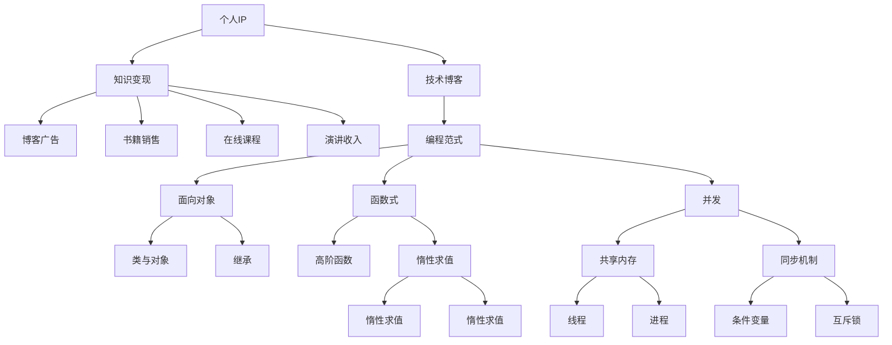

                 

# 打造个人IP：程序员的知识变现之路

> 关键词：个人IP,程序员,知识变现,技术博客,编程范式

## 1. 背景介绍

在信息爆炸的时代，技术类博客已成为程序员不可或缺的知识传递和自我提升工具。如何通过博客、视频、在线课程等形式打造个人品牌，实现知识变现，成为众多技术爱好者的共同追求。本文旨在深入探讨程序员打造个人IP的策略，帮助读者掌握核心技能，实现从技术爱好者到知识变现者的华丽转身。

## 2. 核心概念与联系

### 2.1 核心概念概述

为了更好地理解如何打造个人IP，这里先介绍几个核心概念：

- **个人IP (Individual Brand)**
  指个人在某个特定领域内通过持续输出高质量内容，建立并扩大自己的知名度和影响力，形成独特的个人品牌。在科技领域，个人IP往往与编程范式、技术博客、开源贡献等紧密相关。

- **知识变现 (Knowledge Monetization)**
  指将个人的技术知识、经验、见解通过博客、书籍、课程、演讲等方式转化为实际的收入。知识变现的途径多种多样，从技术博客广告收入到书籍销售，再到在线课程的付费观看。

- **技术博客 (Technical Blog)**
  程序员通过撰写技术博客分享学习心得、项目经验、技术前沿等内容，提升自身知名度和影响力。技术博客不仅是技术积累的记录，也是个人品牌展示的窗口。

- **编程范式 (Programming Paradigm)**
  指编程中的设计理念和思维方式，如面向对象编程、函数式编程、并发编程等。不同的编程范式具有不同的特点和适用场景，选择适合的范式有助于提升编程效率和代码质量。

### 2.2 核心概念原理和架构的 Mermaid 流程图(Mermaid 流程节点中不要有括号、逗号等特殊字符)

该流程图展示了个人IP构建、知识变现和编程范式之间的联系。技术博客和编程范式为个人IP打造提供了内容支撑，而知识变现则为个人IP提供持续发展的动力。

## 3. 核心算法原理 & 具体操作步骤

### 3.1 算法原理概述

打造个人IP的算法原理主要包括内容创作、品牌塑造和社区互动三部分。这些部分相互交织，共同驱动个人IP的成长。

1. **内容创作**
   技术博客的核心在于高质量的内容创作。内容要紧跟技术前沿，易于理解且实用性强。通过持续发布有深度的技术文章，形成自己的技术积累和知识体系。

2. **品牌塑造**
   在内容创作的基础上，通过社交媒体、技术会议、线上线下活动等方式，积极展示自己的技术特长和品牌形象。建立自己的技术社区，吸引粉丝和读者，扩大影响力。

3. **社区互动**
   与读者和同行进行积极互动，回答技术问题、提供技术支持，建立良好的社群氛围。通过不断反馈和互动，不断提升自己的技术能力和品牌影响力。

### 3.2 算法步骤详解

以下是具体步骤：

1. **定位与规划**
   - 确定自己的技术方向，如人工智能、大数据、移动开发等。
   - 设定短期和长期目标，如在半年内开设技术博客，三年内成为该领域的知名专家。

2. **内容创作与发布**
   - 选择博客平台（如Medium、知乎、CSDN等），并设置博客名称和简介。
   - 撰写高质量的技术文章，包括但不限于技术教程、项目实战、前沿技术等。
   - 定期更新，保持持续的内容输出。

3. **品牌塑造与推广**
   - 在各大社交媒体平台（如Twitter、LinkedIn、GitHub）上分享技术文章，吸引关注。
   - 参与技术会议、线下沙龙，结识同行并展示自己的技术实力。
   - 创建技术社区（如技术QQ群、微信订阅号），形成稳定的读者群体。

4. **社区互动与反馈**
   - 积极回应用户留言和评论，解决技术问题，提供帮助。
   - 定期发布技术更新或新闻，保持与读者的互动。
   - 通过社区调查或投票，了解读者的需求和反馈，优化内容。

### 3.3 算法优缺点

个人IP打造具有以下优点：

- **提升知名度**：通过高质量内容和技术互动，吸引大量读者和同行关注，提升个人品牌影响力。
- **增加曝光度**：参与技术会议、线上直播等活动，增加曝光机会，扩大影响范围。
- **多元变现**：通过博客广告、书籍销售、在线课程、技术咨询等多种途径实现知识变现。

同时，也存在一些缺点：

- **内容创作耗时**：高质量的内容创作耗时较多，需要投入大量时间和精力。
- **技术更新迅速**：技术更新迭代快，需不断学习新技术，保持内容的时效性。
- **品牌风险**：个人品牌的建立需要持续努力，过程中可能遇到挫折和失败。

### 3.4 算法应用领域

个人IP打造的方法不仅适用于技术博客，还适用于程序员在多个领域的知识变现。以下是一些具体的应用领域：

- **技术博客**：撰写技术文章，分享项目经验，提升知名度。
- **在线课程**：录制技术教学视频，开设在线课程，获取学费收入。
- **技术咨询**：提供技术支持和咨询服务，如代码审查、技术方案设计等。
- **技术书籍**：根据博客和项目经验，撰写技术书籍，通过出版社或自出版平台销售。
- **技术演讲**：在技术会议、企业内训中做演讲，获取演讲费和品牌曝光。

## 4. 数学模型和公式 & 详细讲解 & 举例说明

### 4.1 数学模型构建

设个人IP的影响力为 $I(t)$，技术博客的点击量为 $C(t)$，社区活跃度为 $A(t)$，技术文章的阅读量为 $R(t)$。模型的基本关系如下：

$$
I(t) = f(C(t), A(t), R(t))
$$

其中，$f$ 为影响函数，具体形式需要根据实际情况定义。例如，如果社区活跃度对影响力的提升有显著作用，可以设 $f$ 为指数函数或对数函数。

### 4.2 公式推导过程

假定社区活跃度 $A(t)$ 与博客点击量 $C(t)$ 成正比关系，即 $A(t) = kC(t)$，其中 $k$ 为比例系数。如果技术文章阅读量 $R(t)$ 与博客点击量 $C(t)$ 成正比，即 $R(t) = mC(t)$，其中 $m$ 为比例系数。则可得：

$$
I(t) = f(kC(t), mC(t))
$$

令 $C(t) = c(t) \times c_0$，其中 $c(t)$ 为某时间点博客点击量的变化率，$c_0$ 为初始点击量。则：

$$
I(t) = f(kc(t) \times c_0, mc(t) \times c_0)
$$

假设技术文章阅读量与博客点击量成正比，即 $R(t) = nC(t)$，其中 $n$ 为比例系数。则：

$$
I(t) = f(kc(t) \times c_0, mc(t) \times c_0, nc(t) \times c_0)
$$

进一步假设影响函数 $f$ 为对数函数，则有：

$$
I(t) = \log(kc(t) \times c_0 \times mc(t) \times c_0 \times nc(t) \times c_0)
$$

化简得：

$$
I(t) = \log(km \times n \times c(t) \times c_0)^3
$$

其中 $kmn$ 为常数项。

### 4.3 案例分析与讲解

以GitHub为例，分析其通过技术贡献和社区互动提升影响力的过程。假设GitHub用户的贡献度（如开源项目贡献数量、Pull Request数等）为 $C$，社区互动度（如参与讨论、问题解答等）为 $A$。设用户的曝光度 $I$ 与贡献度和互动度成正比，即：

$$
I = f(C, A)
$$

若 $C$ 和 $A$ 的关系为 $C = kA$，则：

$$
I = f(kA)
$$

假设 $f$ 为线性函数，则：

$$
I = \alpha kA + \beta
$$

其中 $\alpha$ 和 $\beta$ 为常数。如果 $A$ 增加一倍，则 $I$ 增加 $\alpha k$ 倍。如果 $A$ 和 $C$ 同时增加，则 $I$ 的增加量更大。因此，GitHub用户通过不断增加贡献和互动，可以显著提升其个人影响力。

## 5. 项目实践：代码实例和详细解释说明

### 5.1 开发环境搭建

为方便技术博客的开发和发布，推荐使用以下工具：

1. ** blogging platform**：如Medium、CSDN、知乎等。
2. **博客编辑器**：如VS Code、Atom等。
3. **Git版本控制**：Git、GitHub/Gitee等。
4. **Markdown语法支持**：如GitHub Pages、GitHub Action等。
5. **安全与备份**：云备份工具（如Backblaze），HTTPS证书服务（如Let's Encrypt）。

### 5.2 源代码详细实现

以在Medium上创建技术博客为例，具体实现步骤如下：

1. 注册Medium账号，设置博客名称和简介。
2. 在博客主页上选择“Create”按钮，选择文章模板，输入标题和正文。
3. 使用Markdown语法撰写技术文章，插入代码片段、图片、链接等。
4. 预览并发布文章。

### 5.3 代码解读与分析

以Markdown语法为例，解释其代码实现和优势：

1. **格式简单**：Markdown语法仅需使用简单的文本符号，易于理解和实现。
2. **支持丰富的格式**：包括粗体、斜体、列表、标题、链接、代码块等，方便排版。
3. **跨平台兼容**：支持在多个平台（如Medium、Github Pages、知乎等）上发布，无需额外工具。
4. **版本控制**：支持Git版本控制，方便管理和协作。

### 5.4 运行结果展示

一个完整的技术博客发布后，通过以下方式展示：

1. **网页预览**：在Medium上查看发布的文章，展示效果。
2. **读者反馈**：通过评论和点赞等方式，获取读者反馈。
3. **数据分析**：查看文章的阅读量、点击率、用户互动等数据，分析效果。

## 6. 实际应用场景

### 6.1 技术博客的影响

技术博客作为个人IP的重要组成部分，具有以下实际应用场景：

1. **技术分享**：通过博客分享技术心得和项目经验，提升个人影响力。
2. **社区互动**：通过评论和讨论，建立技术交流社区，吸引更多读者关注。
3. **知识传递**：通过博客文章，帮助其他程序员学习新技术，分享成功经验。

### 6.2 在线课程的市场

在线课程作为知识变现的重要途径，具有以下应用场景：

1. **付费观看**：通过录制视频课程，上传平台（如Udemy、Coursera），获取付费收入。
2. **课程定制**：为企业或个人提供定制化技术培训，获取项目费或咨询费。
3. **教学网站**：开设技术网站，提供免费内容，并通过付费会员、书籍销售等形式变现。

### 6.3 技术咨询的市场

技术咨询作为知识变现的高级形式，具有以下应用场景：

1. **代码审查**：为企业提供代码审查和优化服务，获取技术咨询费。
2. **技术方案设计**：为企业提供技术方案设计和架构规划，获取项目费。
3. **技术支持**：提供技术支持和解决方案，获取长期合作和持续收入。

## 7. 工具和资源推荐

### 7.1 学习资源推荐

1. **博客写作**：《高效写作：技术博客与个人品牌塑造》一书，提供详细的博客写作技巧。
2. **编程范式**：《面向对象编程》《函数式编程》《并发编程》等经典书籍，系统介绍编程范式。
3. **在线课程**：Coursera、Udemy等平台提供大量在线技术课程，提升个人技能。
4. **技术会议**：参加技术会议（如Google I/O、BERT Conference），结识同行，获取最新技术动态。
5. **技术社区**：加入技术社区（如Stack Overflow、GitHub），积极参与讨论和技术支持。

### 7.2 开发工具推荐

1. **版本控制**：Git、GitHub、Gitee等。
2. **编辑器**：VS Code、Atom、Sublime Text等。
3. **博客平台**：Medium、CSDN、知乎等。
4. **在线课程平台**：Udemy、Coursera、edX等。
5. **技术社区**：Stack Overflow、GitHub、知乎等。

### 7.3 相关论文推荐

1. **博客写作技巧**：《博客的力量：如何通过技术博客打造个人品牌》一书，详细阐述博客写作技巧和品牌塑造方法。
2. **编程范式**：《编程范式与设计模式》一书，介绍各种编程范式和设计模式。
3. **在线课程**：《在线课程开发与运营》一书，系统介绍在线课程开发、营销和运营的各个环节。

## 8. 总结：未来发展趋势与挑战

### 8.1 总结

本文详细介绍了程序员如何通过打造个人IP实现知识变现，从技术博客到在线课程，从社区互动到技术咨询，探讨了各种途径和工具。通过持续输出高质量内容和技术互动，程序员可以建立并扩大自己的知名度和影响力，实现知识变现的梦想。

### 8.2 未来发展趋势

未来的技术博客和个人IP将呈现以下趋势：

1. **多平台分发**：通过多平台分发内容，扩大影响范围，吸引更多读者关注。
2. **多元化变现**：结合博客、课程、咨询等多种途径，实现多元化的知识变现。
3. **深度内容**：通过深度文章、专题课程、技术书籍等，提供更具价值的内容。
4. **互动社区**：建立技术社区，形成稳定的读者群体，增强互动性。

### 8.3 面临的挑战

尽管技术博客和个人IP发展潜力巨大，但仍面临一些挑战：

1. **内容质量**：高质量内容创作耗时较多，需投入大量时间和精力。
2. **技术更新**：技术更新迅速，需不断学习新技术，保持内容的时效性。
3. **品牌维护**：个人品牌建立需要持续努力，过程中可能遇到挫折和失败。
4. **变现瓶颈**：知识变现途径有限，需积极探索更多变现渠道。

### 8.4 研究展望

未来的研究需聚焦于以下方向：

1. **内容优化**：通过大数据分析，了解读者需求，优化博客内容。
2. **技术创新**：结合新技术，如AI生成内容、语音识别等，提升内容创作效率。
3. **社区管理**：通过智能算法和推荐系统，提高社区互动效果，吸引更多读者参与。
4. **知识整合**：将开源代码、技术文档等整合到博客平台，提供更全面的技术支持。

## 9. 附录：常见问题与解答

**Q1: 如何提升技术博客的阅读量？**

A: 提升技术博客阅读量的方法有：

1. **优化内容**：确保文章质量高，有深度和实用价值，吸引读者阅读。
2. **SEO优化**：使用关键词、Meta标签等优化博客SEO，提高搜索引擎排名。
3. **社交媒体推广**：在社交媒体平台分享文章，吸引更多人关注。
4. **社区互动**：积极回应读者评论和提问，增强互动性。
5. **定期更新**：保持定期更新，保持内容的时效性。

**Q2: 如何选择适合自己的编程范式？**

A: 选择适合自己的编程范式，需考虑以下因素：

1. **项目需求**：根据项目需求选择合适的编程范式，如面向对象编程适合数据结构复杂、任务清晰的项目。
2. **团队背景**：考虑团队成员的技术背景和经验，选择大家熟悉和擅长的编程范式。
3. **性能要求**：根据性能要求选择合适的编程范式，如并发编程适合高性能计算和大数据处理。
4. **可维护性**：考虑代码的可维护性和可扩展性，选择适合的编程范式。

**Q3: 如何通过博客实现技术变现？**

A: 通过博客实现技术变现的方法有：

1. **广告收入**：在博客上添加广告，获取广告收入。
2. **书籍销售**：根据博客文章，撰写技术书籍，通过出版社或自出版平台销售。
3. **付费课程**：开设在线课程，提供付费观看和互动。
4. **技术咨询**：提供技术支持和咨询服务，获取项目费或咨询费。

**Q4: 如何避免技术博客的过时现象？**

A: 避免技术博客过时的方法有：

1. **持续学习**：保持持续学习新技术，确保内容的时效性。
2. **定期更新**：定期更新博客文章，保持内容的新鲜度。
3. **多平台分发**：通过多平台分发内容，吸引更多读者关注。
4. **读者反馈**：积极回应读者评论和提问，获取反馈并优化内容。

**Q5: 如何建立稳定的技术社区？**

A: 建立稳定技术社区的方法有：

1. **内容丰富**：提供丰富的技术文章和资源，吸引更多读者参与。
2. **互动活跃**：积极回应读者评论和提问，增强互动性。
3. **定期活动**：组织技术分享会、编程竞赛等活动，增强社区凝聚力。
4. **技术支持**：提供技术支持和解决方案，增强社区的实用性和影响力。

**Q6: 如何通过在线课程实现技术变现？**

A: 通过在线课程实现技术变现的方法有：

1. **平台合作**：与在线课程平台合作，获取更多的曝光和用户。
2. **课程优化**：根据用户反馈优化课程内容，提升课程质量。
3. **互动设计**：设计互动环节，如问答、讨论等，增强用户体验。
4. **多样化形式**：提供多种形式的内容，如视频、PPT、代码示例等，满足不同用户的需求。

**Q7: 如何通过技术咨询实现技术变现？**

A: 通过技术咨询实现技术变现的方法有：

1. **平台入驻**：入驻技术咨询平台，获取更多的咨询项目。
2. **技术认证**：获取技术认证，提升技术信任度。
3. **定制方案**：为企业提供定制化技术方案和咨询服务，获取项目费。
4. **长期合作**：与企业建立长期合作关系，获取持续的技术咨询收入。

**Q8: 如何通过技术博客建立品牌影响力？**

A: 通过技术博客建立品牌影响力的方法有：

1. **高质量内容**：提供高质量的技术文章和资源，建立品牌声誉。
2. **持续输出**：保持持续的内容输出，增强品牌影响力。
3. **社交媒体推广**：在社交媒体平台分享文章，扩大品牌曝光。
4. **技术互动**：积极回应读者评论和提问，增强品牌信任度。

---

作者：禅与计算机程序设计艺术 / Zen and the Art of Computer Programming

