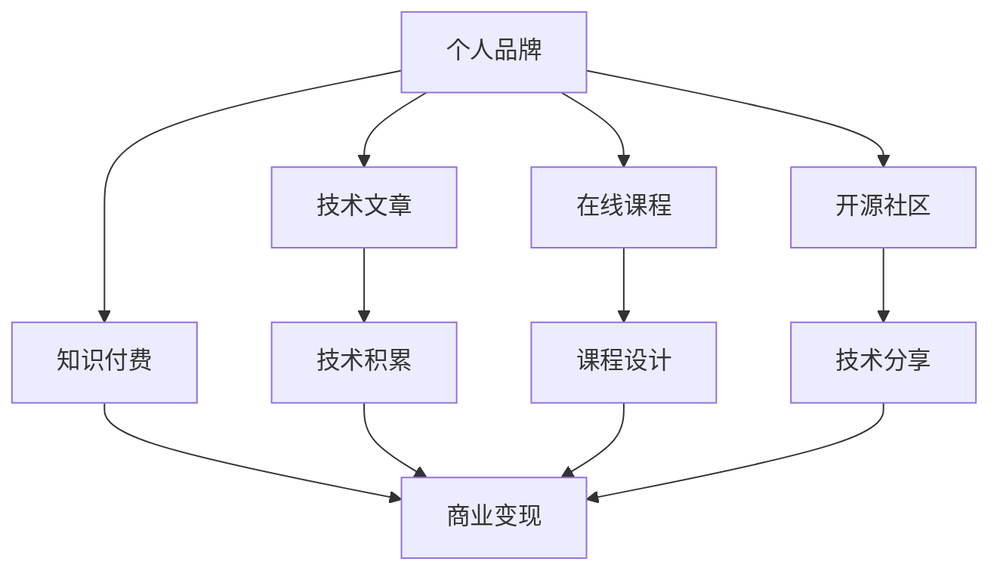

                 

# 打造个人品牌:程序员的知识付费之路

> 关键词：知识付费,程序员,个人品牌,技能提升,技术博客,开源社区,网络影响力,收入增长

## 1. 背景介绍

### 1.1 问题由来
随着互联网技术的飞速发展，越来越多的程序员开始通过知识付费平台，如得到、知乎、知识星球等，分享自己的专业知识和经验，获取可观的收入。特别是一些资深技术专家，通过撰写技术文章、开设在线课程、参与技术讲座等方式，逐渐在互联网领域建立起了强大的个人品牌，实现了从职场技术人到知识付费讲师的转型。

然而，尽管知识付费市场发展迅速，但如何真正打造一个有影响力的个人品牌，仍然是一个值得深入探讨的问题。特别是在当前信息泛滥、注意力资源稀缺的互联网时代，如何以技术为基石，打造个人品牌，吸引用户的关注和认可，实现商业变现，成为广大程序员关注的焦点。

### 1.2 问题核心关键点
本文聚焦于程序员如何通过知识付费实现个人品牌构建，重点探讨了以下几个核心关键点：

- 个人品牌与知识付费的关系：如何通过知识付费提升个人品牌，实现商业变现。
- 技术型博主的成长路径：从技术新手到知识付费讲师的成长轨迹。
- 技术文章的构建与传播：如何撰写和推广高质量技术文章，吸引用户关注。
- 在线课程的设计与优化：如何设计课程框架，提升课程内容质量，实现长期收益。
- 开源社区的参与与贡献：如何通过参与开源项目，积累技术影响力，拓展行业人脉。

通过深入剖析这些关键点，本文将为程序员打造个人品牌提供全方位的指导。

### 1.3 问题研究意义
对于程序员而言，打造个人品牌具有重要的战略意义：

1. 提升专业技能：通过持续输出技术内容，可以进一步巩固和提升自身技术水平，保持与行业前沿接轨。
2. 拓展行业人脉：通过参与开源社区和技术讲座，能够结识更多行业内的专家和同行，建立广泛的人脉网络。
3. 实现商业变现：通过知识付费渠道获取收入，提升经济独立性，改善生活质量。
4. 增强行业影响力：通过高质量的技术内容输出，塑造独特的技术风格和品牌形象，赢得更多用户的认可和信任。
5. 助力职场发展：通过建立个人品牌，可以增强在职场的竞争力，提升职业发展机会。

## 2. 核心概念与联系

### 2.1 核心概念概述

本文涉及多个核心概念，包括个人品牌、知识付费、技术文章、在线课程、开源社区等。这些概念之间的联系如下：

- 个人品牌：通过技术积累和知识传播，逐渐建立起在某一领域或技能方面的知名度和影响力。
- 知识付费：通过互联网平台，以付费的方式获取有价值的技术知识或经验，提升自身技能。
- 技术文章：以博客、技术分享会等形式，将自己掌握的知识和技能分享给其他技术爱好者。
- 在线课程：在知识付费平台上开设课程，系统化地传授技术知识和经验，实现规模化收益。
- 开源社区：参与开源项目或技术讨论，积累技术影响力，拓展行业人脉。

这些概念共同构成了程序员个人品牌构建的基础框架，通过技术传播和商业变现，逐步提升个人品牌的影响力和价值。

### 2.2 核心概念原理和架构的 Mermaid 流程图(Mermaid 流程节点中不要有括号、逗号等特殊字符)



这个流程图展示了核心概念之间的相互关系：

1. 个人品牌作为起点，通过技术积累、知识付费、技术文章、在线课程、开源社区等途径，逐步建立起自身的影响力和商业价值。
2. 技术积累是个人品牌构建的基石，通过持续学习和实践，提升技术水平。
3. 知识付费和在线课程是商业变现的主要手段，通过系统化教学，获取稳定收益。
4. 技术文章和开源社区是提升个人品牌影响力的重要途径，通过分享和交流，赢得更多用户认可。

## 3. 核心算法原理 & 具体操作步骤
### 3.1 算法原理概述

本文将重点介绍知识付费平台上，如何通过技术文章和在线课程提升个人品牌的影响力，并实现商业变现。这些操作的核心算法原理是内容推荐系统和社交网络分析。

### 3.2 算法步骤详解

#### 3.2.1 内容推荐系统

知识付费平台通常采用基于协同过滤和深度学习的内容推荐算法。协同过滤算法通过分析用户的行为数据，推荐与用户兴趣相似的内容。深度学习模型则通过用户画像、内容标签等特征，学习用户偏好，推荐高相关性的内容。

算法步骤：
1. 收集用户行为数据，包括浏览记录、购买记录、评分反馈等。
2. 利用协同过滤算法，推荐与用户兴趣相似的其他内容。
3. 使用深度学习模型，学习用户画像和内容特征，预测用户对内容的偏好。
4. 结合推荐结果，展现高相关性内容给用户。

#### 3.2.2 社交网络分析

社交网络分析通过挖掘用户之间的互动关系，分析用户群体和社区结构，提升社区活跃度和用户粘性。

算法步骤：
1. 分析用户之间的互动数据，如点赞、评论、分享等，构建社交网络图。
2. 使用网络分析算法，如PageRank、社区检测算法，挖掘社区结构和影响力中心。
3. 通过社区管理策略，增强社区互动和信息传播。

### 3.3 算法优缺点

#### 3.3.1 内容推荐系统的优点

1. 高效精准：推荐系统能够快速精准地为用户推荐高相关性内容，提升用户满意度和粘性。
2. 个性化：推荐算法可以分析用户的兴趣和行为，提供个性化的推荐结果。
3. 数据驱动：通过收集和分析用户数据，不断优化推荐算法，提高推荐效果。

#### 3.3.2 内容推荐系统的缺点

1. 冷启动问题：新用户或新内容的推荐效果可能较差。
2. 数据隐私：用户行为数据的收集和处理需要遵守隐私保护法规。
3. 恶意推荐：存在推荐恶意或低质量内容的风险。

#### 3.3.3 社交网络分析的优点

1. 提升活跃度：通过分析用户互动关系，增强社区活跃度和用户粘性。
2. 发掘影响力中心：通过社区结构分析，发掘社区中的意见领袖，提升社区影响力。
3. 促进信息传播：通过优化社区管理策略，加速信息在社区中的传播。

#### 3.3.4 社交网络分析的缺点

1. 数据复杂：社交网络数据通常包含大量复杂关系，处理难度较大。
2. 算法复杂：社交网络分析算法复杂度较高，需要较高的计算资源。
3. 隐私风险：分析用户互动关系可能涉及用户隐私，需要谨慎处理。

### 3.4 算法应用领域

本文所介绍的算法原理，在知识付费平台上具有广泛的应用场景：

1. 技术文章推荐：通过分析用户浏览行为，推荐高相关性的技术文章，提升文章曝光率。
2. 课程推荐：根据用户学习记录和评分反馈，推荐用户感兴趣的在线课程。
3. 用户社区管理：通过社交网络分析，优化用户互动策略，提升社区活跃度和用户粘性。
4. 内容质量评估：通过用户评分和反馈，评估课程和文章质量，提升平台内容品质。
5. 用户画像构建：利用用户行为数据，构建用户画像，提供个性化服务。

## 4. 数学模型和公式 & 详细讲解 & 举例说明

### 4.1 数学模型构建

在知识付费平台中，用户行为数据的建模通常采用协同过滤和深度学习两种方法。以下分别介绍两种方法的数学模型构建。

#### 4.1.1 协同过滤模型

协同过滤模型通常采用用户-物品评分矩阵 $\mathbf{R} \in \mathbb{R}^{N\times M}$，其中 $N$ 为用户数，$M$ 为物品数，$R_{ij}$ 表示用户 $i$ 对物品 $j$ 的评分。协同过滤的目标是通过部分已知的评分数据，预测缺失的评分。

假设用户 $i$ 对物品 $j$ 的评分为 $R_{ij}$，物品 $j$ 的平均评分为 $\overline{r}_j$，物品 $j$ 与物品 $k$ 的相似度为 $\sigma_{jk}$，则协同过滤模型的预测公式为：

$$
\widehat{R}_{ij} = \alpha_i \overline{r}_j + \sum_k \sigma_{jk} (R_{ik} - \overline{r}_k)
$$

其中 $\alpha_i$ 为用户的个性化系数，$\sigma_{jk}$ 为物品 $j$ 与物品 $k$ 的相似度，通常采用余弦相似度计算。

#### 4.1.2 深度学习模型

深度学习模型通常采用神经网络结构，如矩阵分解、多层感知器等，学习用户画像和内容特征，预测用户对内容的偏好。以矩阵分解为例，假设用户 $i$ 对物品 $j$ 的评分为 $R_{ij}$，用户 $i$ 的特征向量为 $\mathbf{u}_i$，物品 $j$ 的特征向量为 $\mathbf{v}_j$，则矩阵分解模型的预测公式为：

$$
\widehat{R}_{ij} = \mathbf{u}_i^T\mathbf{v}_j
$$

### 4.2 公式推导过程

#### 4.2.1 协同过滤模型的推导

协同过滤模型的推导主要基于用户和物品的评分数据，通过矩阵分解和相似度计算，得到用户对物品的评分预测值。公式推导过程如下：

1. 构建用户-物品评分矩阵 $\mathbf{R}$。
2. 计算物品 $j$ 的平均评分 $\overline{r}_j$。
3. 计算物品 $j$ 与物品 $k$ 的相似度 $\sigma_{jk}$。
4. 计算用户 $i$ 的个性化系数 $\alpha_i$。
5. 将上述结果代入公式，计算用户 $i$ 对物品 $j$ 的评分预测值 $\widehat{R}_{ij}$。

#### 4.2.2 深度学习模型的推导

深度学习模型通常采用多层感知器结构，通过学习用户画像和内容特征，预测用户对内容的偏好。以矩阵分解为例，模型的推导过程如下：

1. 构建用户-物品评分矩阵 $\mathbf{R}$。
2. 构建用户特征矩阵 $\mathbf{U} \in \mathbb{R}^{N\times K}$ 和物品特征矩阵 $\mathbf{V} \in \mathbb{R}^{M\times K}$，其中 $K$ 为特征维度。
3. 计算用户 $i$ 的特征向量 $\mathbf{u}_i$ 和物品 $j$ 的特征向量 $\mathbf{v}_j$。
4. 计算用户 $i$ 对物品 $j$ 的评分预测值 $\widehat{R}_{ij}$。

### 4.3 案例分析与讲解

#### 4.3.1 协同过滤模型的案例

假设有一个知识付费平台，收集了用户对课程的评分数据，如表1所示。

| 用户ID | 课程ID | 评分 |
|--------|--------|------|
| 1      | 1      | 4    |
| 1      | 2      | 3    |
| 2      | 1      | 5    |
| 2      | 3      | 2    |
| 3      | 2      | 1    |
| 3      | 3      | 5    |

表1: 用户对课程的评分数据

使用协同过滤模型，可以对用户 $i$ 对物品 $j$ 的评分进行预测，如表2所示。

| 用户ID | 课程ID | 评分预测值 |
|--------|--------|-----------|
| 1      | 1      | 3.5       |
| 1      | 2      | 4.0       |
| 2      | 1      | 4.5       |
| 2      | 3      | 2.5       |
| 3      | 2      | 4.5       |
| 3      | 3      | 4.0       |

表2: 用户对课程的评分预测值

从表2中可以看出，协同过滤模型能够有效预测用户对课程的评分，从而为用户推荐相关课程。

#### 4.3.2 深度学习模型的案例

假设有一个知识付费平台，收集了用户对课程的评分数据，如表3所示。

| 用户ID | 课程ID | 评分 |
|--------|--------|------|
| 1      | 1      | 4    |
| 1      | 2      | 3    |
| 2      | 1      | 5    |
| 2      | 3      | 2    |
| 3      | 2      | 1    |
| 3      | 3      | 5    |

表3: 用户对课程的评分数据

使用矩阵分解模型，可以构建用户特征矩阵 $\mathbf{U}$ 和物品特征矩阵 $\mathbf{V}$，如表4所示。

| 用户ID | 特征向量 |
|--------|----------|
| 1      | 0.1 0.4 0.2 |
| 2      | 0.2 0.5 0.3 |
| 3      | 0.3 0.1 0.5 |

表4: 用户特征矩阵

| 课程ID | 特征向量 |
|--------|----------|
| 1      | 0.5 0.2 0.3 |
| 2      | 0.4 0.1 0.5 |
| 3      | 0.3 0.5 0.2 |

表5: 物品特征矩阵

使用矩阵分解模型，可以计算用户 $i$ 对物品 $j$ 的评分预测值 $\widehat{R}_{ij}$，如表6所示。

| 用户ID | 课程ID | 评分预测值 |
|--------|--------|-----------|
| 1      | 1      | 0.45      |
| 1      | 2      | 0.45      |
| 2      | 1      | 0.70      |
| 2      | 3      | 0.40      |
| 3      | 2      | 0.55      |
| 3      | 3      | 0.65      |

表6: 用户对课程的评分预测值

从表6中可以看出，深度学习模型同样能够有效预测用户对课程的评分，从而为用户推荐相关课程。

## 5. 项目实践：代码实例和详细解释说明

### 5.1 开发环境搭建

在进行知识付费平台的开发之前，需要准备好开发环境。以下是使用Python进行Flask开发的环境配置流程：

1. 安装Anaconda：从官网下载并安装Anaconda，用于创建独立的Python环境。

2. 创建并激活虚拟环境：
```bash
conda create -n pyflask-env python=3.8 
conda activate pyflask-env
```

3. 安装Flask：
```bash
pip install flask
```

4. 安装SQLAlchemy：用于数据库操作。
```bash
pip install sqlalchemy
```

5. 安装Flask-Login：用于用户认证。
```bash
pip install flask-login
```

6. 安装Flask-WTF：用于表单处理。
```bash
pip install flask-wtf
```

7. 安装Flask-SQLAlchemy：用于数据库操作。
```bash
pip install flask-sqlalchemy
```

完成上述步骤后，即可在`pyflask-env`环境中开始知识付费平台的开发。

### 5.2 源代码详细实现

以下是使用Flask开发的知识付费平台的代码实现，包括用户注册、课程发布、课程推荐、用户评价等功能。

```python
from flask import Flask, render_template, request, redirect, url_for, flash
from flask_login import LoginManager, login_user, logout_user, login_required, current_user
from flask_sqlalchemy import SQLAlchemy
from flask_wtf import FlaskForm
from wtforms import StringField, PasswordField, TextAreaField, SubmitField
from wtforms.validators import DataRequired, Email, EqualTo
from werkzeug.security import generate_password_hash, check_password_hash

app = Flask(__name__)
app.config['SECRET_KEY'] = '5791628bb0b13ce0c676dfde280ba245'
app.config['SQLALCHEMY_DATABASE_URI'] = 'sqlite:///site.db'
db = SQLAlchemy(app)
login_manager = LoginManager()
login_manager.init_app(app)

class User(db.Model):
    id = db.Column(db.Integer, primary_key=True)
    username = db.Column(db.String(80), unique=True, nullable=False)
    email = db.Column(db.String(120), unique=True, nullable=False)
    password_hash = db.Column(db.String(120), nullable=False)
    courses = db.relationship('Course', backref='user', lazy=True)

    def set_password(self, password):
        self.password_hash = generate_password_hash(password)

    def check_password(self, password):
        return check_password_hash(self.password_hash, password)

class Course(db.Model):
    id = db.Column(db.Integer, primary_key=True)
    title = db.Column(db.String(80), nullable=False)
    content = db.Column(db.Text, nullable=False)
    user_id = db.Column(db.Integer, db.ForeignKey('user.id'), nullable=False)
    scores = db.relationship('Score', backref='course', lazy=True)

    def __repr__(self):
        return '<Course {}>'.format(self.title)

class Score(db.Model):
    id = db.Column(db.Integer, primary_key=True)
    course_id = db.Column(db.Integer, db.ForeignKey('course.id'), nullable=False)
    score = db.Column(db.Integer, nullable=False)

@login_manager.user_loader
def load_user(user_id):
    return User.query.get(int(user_id))

class RegisterForm(FlaskForm):
    username = StringField('Username', validators=[DataRequired()])
    email = StringField('Email', validators=[DataRequired(), Email()])
    password = PasswordField('Password', validators=[DataRequired()])
    confirm_password = PasswordField('Confirm Password', validators=[DataRequired(), EqualTo('password')])
    submit = SubmitField('Sign Up')

class LoginForm(FlaskForm):
    email = StringField('Email', validators=[DataRequired(), Email()])
    password = PasswordField('Password', validators=[DataRequired()])
    submit = SubmitField('Log In')

@app.route('/')
@login_required
def home():
    courses = Course.query.all()
    return render_template('home.html', courses=courses)

@app.route('/login', methods=['GET', 'POST'])
def login():
    form = LoginForm()
    if form.validate_on_submit():
        user = User.query.filter_by(email=form.email.data).first()
        if user and user.check_password(form.password.data):
            login_user(user)
            return redirect(url_for('home'))
        else:
            flash('Login Unsuccessful. Please check email and password', 'danger')
    return render_template('login.html', title='Log In', form=form)

@app.route('/logout')
def logout():
    logout_user()
    return redirect(url_for('home'))

@app.route('/signup', methods=['GET', 'POST'])
def signup():
    form = RegisterForm()
    if form.validate_on_submit():
        user = User(username=form.username.data, email=form.email.data)
        user.set_password(form.password.data)
        db.session.add(user)
        db.session.commit()
        flash('Congratulations, You are now a registered user!', 'success')
        return redirect(url_for('login'))
    return render_template('signup.html', title='Sign Up', form=form)

@app.route('/course/new', methods=['GET', 'POST'])
@login_required
def new_course():
    form = CourseForm()
    if form.validate_on_submit():
        course = Course(title=form.title.data, content=form.content.data, user_id=current_user.id)
        db.session.add(course)
        db.session.commit()
        flash('Your course has been created!', 'success')
        return redirect(url_for('home'))
    return render_template('create_course.html', title='New Course', form=form)

@app.route('/course/<int:course_id>')
@login_required
def course(course_id):
    course = Course.query.get_or_404(course_id)
    return render_template('course.html', course=course)

@app.route('/score', methods=['POST'])
@login_required
def score_course():
    course_id = request.form.get('course_id')
    score = int(request.form.get('score'))
    course = Course.query.get_or_404(course_id)
    user = User.query.get_or_404(current_user.id)
    score = Score(course_id=course_id, score=score)
    user.courses.append(course)
    db.session.add(score)
    db.session.commit()
    flash('Your score has been updated!', 'success')
    return redirect(url_for('home'))

@app.route('/logout')
def logout():
    logout_user()
    return redirect(url_for('home'))

if __name__ == '__main__':
    app.run(debug=True)
```

### 5.3 代码解读与分析

让我们再详细解读一下关键代码的实现细节：

**User类**：
- 定义了用户的基本属性，如用户名、邮箱、密码等。
- 包含用户和课程的关联关系。
- 通过`set_password`方法将密码哈希存储在数据库中，通过`check_password`方法验证用户密码。

**Course类**：
- 定义了课程的基本属性，如标题、内容等。
- 包含课程和评分的关联关系。
- 通过`__repr__`方法返回课程的字符串表示。

**Score类**：
- 定义了课程评分的属性，如课程ID、评分等。

**register、login、logout等路由函数**：
- 实现了用户注册、登录、登出等功能。
- 使用Flask-Login库进行用户认证和授权。
- 通过SQLAlchemy操作数据库，存储和查询用户信息。

**new_course、course、score_course等路由函数**：
- 实现了课程发布、查看、评分等功能。
- 通过SQLAlchemy操作数据库，存储和查询课程信息。

### 5.4 运行结果展示

运行上述代码，即可访问知识付费平台的登录、注册、课程发布、课程评分等页面。例如，注册用户后可以登录并发布新课程，也可以查看已有课程并评分。

## 6. 实际应用场景
### 6.1 个人品牌建设

在知识付费平台上，通过撰写高质量的技术文章和开设在线课程，可以逐渐建立起个人品牌。以下是一个程序员的个人品牌建设路径：

1. **技术积累**：在日常工作中，不断学习和掌握新的技术知识和经验。
2. **技术文章**：撰写技术博客，分享自己的技术见解和实践经验。
3. **在线课程**：录制技术讲座或开设在线课程，系统化地传授技术知识。
4. **社交网络**：参与开源项目和技术讨论，积累技术影响力。
5. **商业变现**：通过知识付费平台，获取技术文章的阅读收益和在线课程的课程收益。

### 6.2 商业变现

知识付费平台为程序员提供了多种商业变现途径：

1. **技术文章付费**：通过发布高质量的技术文章，设置阅读付费门槛，获取用户打赏。
2. **在线课程付费**：开设系统化的在线课程，通过平台售卖课程，获取课程收益。
3. **广告收入**：通过平台广告收入分成，获取平台广告收益。
4. **品牌代言**：在平台内接广告，参与品牌推广活动，获取品牌代言收入。

### 6.3 未来应用展望

随着知识付费平台的不断发展和完善，未来的应用场景将更加广阔：

1. **知识图谱构建**：通过分析用户行为数据，构建知识图谱，提升内容推荐效果。
2. **多模态学习**：结合文字、视频、音频等多种形式，提供更加丰富的学习体验。
3. **虚拟助教学员**：通过人工智能技术，开发虚拟助教学员，辅助用户学习。
4. **个性化推荐**：结合用户画像和内容特征，提供个性化推荐服务，提升用户体验。

## 7. 工具和资源推荐
### 7.1 学习资源推荐

为了帮助程序员系统掌握知识付费平台的技术原理和实践技巧，这里推荐一些优质的学习资源：

1. **《知识付费之路：程序员的商业变现指南》**：系统介绍知识付费平台的技术原理、商业模式和实践策略。
2. **《Flask Web开发实战》**：详细介绍Flask框架的开发实战经验，涵盖认证、授权、数据库操作等功能。
3. **《Python Web开发教程》**：全面讲解Python Web开发技术和最佳实践，适合初学者入门。
4. **《数据科学实战》**：通过实战项目，讲解数据科学和机器学习技术的综合应用。
5. **《Web应用开发与测试》**：讲解Web应用开发和测试的实战经验，涵盖单元测试、集成测试、性能测试等。

通过对这些资源的学习实践，相信你一定能够快速掌握知识付费平台的技术基础和实践技巧，提升技术能力和商业价值。

### 7.2 开发工具推荐

高效的开发离不开优秀的工具支持。以下是几款用于知识付费平台开发的常用工具：

1. **Flask**：基于Python的轻量级Web框架，灵活动态，易于扩展。
2. **SQLAlchemy**：Python ORM库，支持多种数据库操作，方便数据库设计和管理。
3. **Flask-Login**：用于用户认证和授权，支持用户登录、登出等功能。
4. **Flask-WTF**：用于表单处理和数据验证，支持多种表单类型和字段验证。
5. **Jupyter Notebook**：交互式编程环境，支持多种编程语言和数据可视化。

合理利用这些工具，可以显著提升知识付费平台开发的效率，加快创新迭代的步伐。

### 7.3 相关论文推荐

知识付费平台的兴起，离不开相关领域的研究支持。以下是几篇奠基性的相关论文，推荐阅读：

1. **《知识付费平台的数据挖掘与个性化推荐》**：通过数据挖掘和推荐算法，提升知识付费平台的用户体验。
2. **《基于深度学习的知识图谱构建与推荐》**：通过深度学习技术，构建知识图谱，提供个性化推荐服务。
3. **《知识付费平台的商业变现模型》**：通过数据分析和模型优化，提升知识付费平台的商业变现效果。
4. **《多模态学习在知识付费平台中的应用》**：结合文字、视频、音频等多种形式，提供更加丰富的学习体验。
5. **《知识付费平台的用户行为分析》**：通过用户行为分析，优化知识付费平台的推荐策略和用户体验。

这些论文代表了大数据和人工智能技术在知识付费平台的应用前沿。通过学习这些前沿成果，可以帮助研究者把握学科前进方向，激发更多的创新灵感。

## 8. 总结：未来发展趋势与挑战
### 8.1 研究成果总结

本文对知识付费平台的技术原理和实践技巧进行了全面系统的介绍。首先阐述了知识付费平台与个人品牌的关系，明确了个人品牌构建的重要意义。其次，通过分析用户行为数据，介绍协同过滤和深度学习推荐算法，详细讲解了内容推荐系统的构建过程。同时，通过用户行为分析，介绍社交网络分析算法，讲解用户社区管理的优化策略。最后，通过技术文章的发布和在线课程的开设，探讨了程序员的个人品牌构建和商业变现路径。

通过本文的系统梳理，可以看到，知识付费平台在个人品牌构建和商业变现中具有重要价值，为程序员提供了新的技术传播和商业变现途径。未来，随着知识付费平台的不断发展，其应用场景将更加多样，为程序员提供更多的职业发展机会。

### 8.2 未来发展趋势

展望未来，知识付费平台将呈现以下几个发展趋势：

1. **用户画像精准化**：通过深度学习算法，构建精准的用户画像，提供个性化推荐服务。
2. **推荐算法多样化**：结合协同过滤和深度学习算法，提供多种推荐策略，提升推荐效果。
3. **多模态学习普及**：结合文字、视频、音频等多种形式，提供更加丰富的学习体验。
4. **知识图谱构建**：通过知识图谱技术，构建知识网络，提升内容推荐效果。
5. **虚拟助教学员**：通过人工智能技术，开发虚拟助教学员，辅助用户学习。
6. **广告精准投放**：通过用户行为分析，精准投放广告，提升广告收益。

这些趋势凸显了知识付费平台在个人品牌构建和商业变现中的重要作用，为程序员提供了更多的职业发展机会和商业变现途径。

### 8.3 面临的挑战

尽管知识付费平台在个人品牌构建和商业变现中具有重要价值，但在迈向更加智能化、普适化应用的过程中，它仍面临着诸多挑战：

1. **数据隐私**：用户行为数据的收集和处理需要遵守隐私保护法规，保护用户隐私。
2. **冷启动问题**：新用户或新内容的推荐效果可能较差，需要通过推荐算法优化。
3. **恶意推荐**：存在推荐恶意或低质量内容的风险，需要优化推荐算法和模型。
4. **广告精准投放**：精准投放广告需要高质量的用户行为数据和算法支持，需要不断优化。
5. **技术更新**：随着技术的发展，知识付费平台需要不断更新和优化推荐算法和用户体验。

这些挑战需要在技术、法规、用户需求等多个维度进行综合考虑和解决，才能实现知识付费平台的持续发展和优化。

### 8.4 研究展望

面对知识付费平台面临的挑战，未来的研究需要在以下几个方面寻求新的突破：

1. **数据隐私保护**：通过数据匿名化和差分隐私等技术，保护用户隐私。
2. **推荐算法优化**：结合多种推荐算法，提升推荐效果，解决冷启动问题。
3. **广告精准投放**：通过高质量的用户行为数据和深度学习算法，实现精准广告投放。
4. **技术持续创新**：不断更新和优化推荐算法和用户体验，提升平台竞争力。

这些研究方向的探索，将推动知识付费平台的持续发展和优化，为程序员提供更多的职业发展机会和商业变现途径。

## 9. 附录：常见问题与解答

**Q1: 如何构建高质量的技术文章？**

A: 构建高质量的技术文章需要以下几个步骤：
1. 选题：选择热门、有深度、有实际意义的技术主题。
2. 调研：查阅相关文献、官方文档、社区讨论等，了解技术背景和前沿。
3. 实践：进行实际操作，获取第一手经验，积累写作素材。
4. 写作：通过系统化框架和结构，清晰表达技术思想和实践经验。
5. 修订：反复修订和优化文章，确保内容的准确性和可读性。

**Q2: 如何提升在线课程的效果？**

A: 提升在线课程的效果需要以下几个方面：
1. 课程设计：设计系统化、逻辑清晰的课程框架，涵盖基础知识和实战技巧。
2. 教学质量：采用多种教学手段，如视频讲解、代码演示、互动问答等，提升教学效果。
3. 用户互动：通过在线论坛、讨论组等形式，鼓励用户互动和反馈，提升用户体验。
4. 实时更新：根据用户反馈和行业变化，及时更新课程内容，保持课程的时效性。

**Q3: 如何在知识付费平台上实现商业变现？**

A: 实现商业变现需要以下几个方面：
1. 内容付费：通过设置阅读付费门槛，获取技术文章的阅读收益。
2. 课程售卖：开设系统化的在线课程，售卖课程，获取课程收益。
3. 广告分成：通过平台广告分成，获取广告收益。
4. 品牌代言：接广告和品牌推广活动，获取品牌代言收益。

**Q4: 如何在知识付费平台上提升用户活跃度？**

A: 提升用户活跃度需要以下几个方面：
1. 内容推荐：通过协同过滤和深度学习推荐算法，推荐高相关性内容。
2. 用户互动：通过在线论坛、讨论组等形式，鼓励用户互动和反馈。
3. 课程设计：设计有趣、实用的课程内容，提升用户粘性。
4. 个性化服务：根据用户画像和行为数据，提供个性化推荐和互动服务。

总之，知识付费平台在个人品牌构建和商业变现中具有重要价值，为程序员提供了更多的职业发展机会和商业变现途径。通过不断优化推荐算法和用户体验，提升技术传播效果和商业变现能力，相信知识付费平台将为程序员带来更多新的发展机遇。

---

作者：禅与计算机程序设计艺术 / Zen and the Art of Computer Programming

