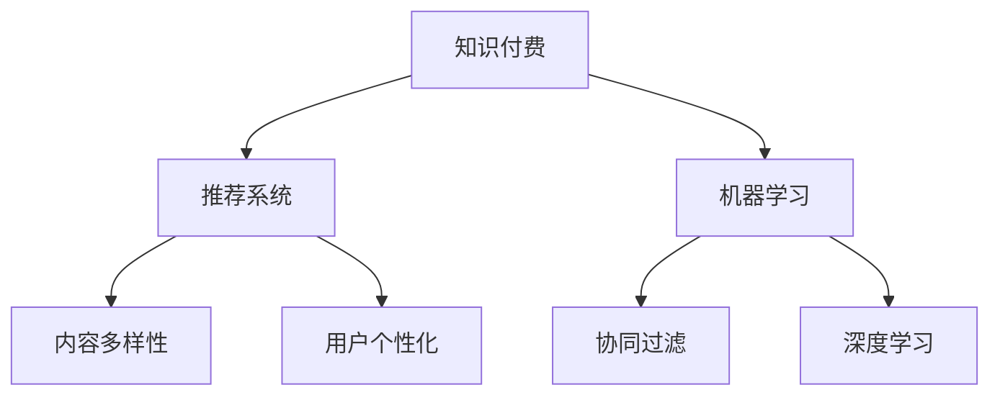

                 

# 打造知识付费垂直领域的独特优势

## 1. 背景介绍

在知识付费领域，用户对高质量、个性化内容的需求不断增长，市场竞争日益激烈。各大平台纷纷加大内容投入，争夺用户心智。然而，面对海量的课程和内容，用户的选择变得困难，需要更加高效、精准的推荐和引导机制。本文将探讨如何通过机器学习和推荐系统，打造知识付费垂直领域的独特优势，提升用户体验和平台收益。

## 2. 核心概念与联系

### 2.1 核心概念概述

为了更好地理解如何打造知识付费垂直领域的独特优势，首先需要明确几个核心概念：

- 知识付费：基于内容付费的模式，用户为获取专业知识和技能支付费用。
- 推荐系统：通过用户行为数据和内容属性，推荐符合用户兴趣和需求的内容。
- 机器学习：利用算法和大数据训练模型，实现内容推荐、用户画像、用户行为分析等功能。
- 协同过滤：通过分析用户历史行为数据，发现相似用户群体，实现内容推荐。
- 深度学习：使用神经网络模型，提升推荐系统的精度和泛化能力。
- 内容多样性：在推荐内容中兼顾热门和冷门课程，促进内容的丰富性。
- 用户个性化：根据用户兴趣和行为，定制化推荐内容，提升用户体验。

这些核心概念之间的逻辑关系可以通过以下Mermaid流程图来展示：



这个流程图展示了从知识付费到推荐系统的整体流程，以及如何通过机器学习和协同过滤等技术，实现内容推荐和用户个性化。

## 3. 核心算法原理 & 具体操作步骤
### 3.1 算法原理概述

知识付费平台的推荐系统，旨在根据用户的历史行为和兴趣，推荐其可能感兴趣的课程内容。核心算法包括协同过滤、深度学习等，这些算法通过分析用户行为数据，预测用户可能感兴趣的内容。

协同过滤算法基于用户行为数据，通过分析用户与内容的交互，寻找相似用户群体，实现内容推荐。具体而言，协同过滤分为基于用户的协同过滤和基于物品的协同过滤两种方法。

深度学习算法通过构建神经网络模型，实现更加复杂的推荐逻辑。常用的深度学习模型包括协同学习模型、序列推荐模型、多任务学习模型等。

### 3.2 算法步骤详解

知识付费平台的推荐系统主要包含以下几个步骤：

**Step 1: 数据采集和预处理**
- 收集用户行为数据，包括浏览、点击、评分等。
- 收集课程内容数据，包括标题、简介、分类、评分等。
- 对数据进行清洗和处理，去除噪声和异常值，生成可用于训练的数据集。

**Step 2: 特征工程**
- 提取用户行为特征，如浏览时间、点击位置、评分等。
- 提取课程内容特征，如标题、简介、关键词等。
- 构建用户画像和内容画像，用于后续的推荐计算。

**Step 3: 模型训练**
- 选择合适的推荐算法，如协同过滤、深度学习等。
- 划分训练集、验证集和测试集，进行模型训练和调参。
- 使用交叉验证等方法，评估模型性能。

**Step 4: 推荐计算**
- 根据用户画像和内容画像，计算推荐分数。
- 使用排序算法对推荐结果进行排序，生成推荐列表。
- 对推荐列表进行截断，限制推荐数量。

**Step 5: 反馈收集和模型更新**
- 收集用户对推荐结果的反馈，如点击、购买等行为。
- 基于反馈数据，更新用户画像和内容画像，优化推荐模型。
- 定期更新推荐模型，保证模型性能的持续优化。

### 3.3 算法优缺点

知识付费平台的推荐系统具有以下优点：
1. 提高用户满意度。通过推荐符合用户兴趣的课程，提升用户粘性，增加平台收益。
2. 提升内容价值。帮助冷门课程获得更多曝光，提升平台内容多样性。
3. 减少用户选择成本。通过推荐系统，用户可以更快找到感兴趣的内容，降低决策难度。
4. 降低营销成本。通过精准推荐，减少平台对广告的依赖，提高广告ROI。

然而，该系统也存在一些局限性：
1. 数据冷启动问题。新用户或课程缺乏历史数据，难以进行精准推荐。
2. 数据隐私问题。用户行为数据和课程内容数据可能涉及隐私，需做好数据保护。
3. 内容同质化问题。过度推荐热门课程，导致内容同质化，影响用户体验。
4. 计算资源消耗。推荐系统计算复杂，需要大量计算资源，影响实时性。

### 3.4 算法应用领域

知识付费平台的推荐系统在多个领域得到应用，例如：

- 课程推荐：推荐用户感兴趣的课程，提高用户购买率。
- 活动推荐：推荐用户感兴趣的活动，如课程试听、抽奖等。
- 内容推送：推送用户感兴趣的内容，如文章、视频等。
- 用户互动：通过推荐系统，增加用户之间的互动，如评论、点赞等。

这些应用场景展示了推荐系统在知识付费平台中的广泛适用性，为平台带来了新的价值和收益。

## 4. 数学模型和公式 & 详细讲解 & 举例说明
### 4.1 数学模型构建

知识付费平台的推荐系统涉及多个数学模型，包括协同过滤模型、深度学习模型等。以协同过滤模型为例，其数学模型构建如下：

设用户集为 $U$，物品集为 $I$，用户 $u$ 对物品 $i$ 的评分记为 $r_{ui}$，协同过滤模型通过计算用户 $u$ 和物品 $i$ 的相似度，预测用户对物品的评分。相似度计算可以基于余弦相似度、皮尔逊相关系数等方法。

### 4.2 公式推导过程

以余弦相似度为例，用户 $u$ 和物品 $i$ 的相似度 $s_{ui}$ 计算公式如下：

$$
s_{ui} = \frac{\sum_{j \in N(u) \cap N(i)} r_{uj} r_{ij}}{\sqrt{\sum_{j \in N(u)} r_{uj}^2} \sqrt{\sum_{j \in N(i)} r_{ij}^2}}
$$

其中 $N(u)$ 表示用户 $u$ 的邻居集，即与用户 $u$ 行为相似的用户集合。物品 $i$ 的邻居集 $N(i)$ 同理。

### 4.3 案例分析与讲解

以Coursera平台的课程推荐为例，基于协同过滤的推荐系统可以按照以下步骤进行：

1. 收集用户行为数据，包括课程浏览、点击、评分等。
2. 对数据进行预处理，生成用户行为矩阵 $R$，其中 $R_{ui}$ 表示用户 $u$ 对课程 $i$ 的评分。
3. 使用余弦相似度计算用户 $u$ 和物品 $i$ 的相似度 $s_{ui}$。
4. 根据相似度，预测用户对课程的评分，生成推荐列表。
5. 对推荐列表进行排序，生成最终推荐结果。

通过这种方式，Coursera平台可以根据用户行为数据，实现精准的课程推荐，提升用户满意度和平台收益。

## 5. 项目实践：代码实例和详细解释说明
### 5.1 开发环境搭建

在进行推荐系统开发前，首先需要搭建开发环境。以下是使用Python进行TensorFlow开发的环境配置流程：

1. 安装Anaconda：从官网下载并安装Anaconda，用于创建独立的Python环境。

2. 创建并激活虚拟环境：
```bash
conda create -n tf-env python=3.7 
conda activate tf-env
```

3. 安装TensorFlow：根据CUDA版本，从官网获取对应的安装命令。例如：
```bash
pip install tensorflow
```

4. 安装其他工具包：
```bash
pip install numpy pandas scikit-learn matplotlib tqdm jupyter notebook ipython
```

完成上述步骤后，即可在`tf-env`环境中开始推荐系统开发。

### 5.2 源代码详细实现

下面我们以推荐系统中的协同过滤算法为例，给出TensorFlow代码实现。

```python
import tensorflow as tf
from tensorflow.keras.layers import Embedding, Dense, Dot
from tensorflow.keras.models import Model

# 定义模型输入和输出
user_input = tf.keras.layers.Input(shape=(1,))
item_input = tf.keras.layers.Input(shape=(1,))

# 定义用户特征和物品特征
user_features = Embedding(input_dim=1000, output_dim=16, mask_zero=True)(user_input)
item_features = Embedding(input_dim=1000, output_dim=16, mask_zero=True)(item_input)

# 计算相似度
similarity = Dot(axes=(1, 1))([user_features, item_features])

# 预测用户评分
rating = Dense(1, activation='sigmoid')(similarity)

# 定义模型
model = Model(inputs=[user_input, item_input], outputs=rating)

# 编译模型
model.compile(optimizer='adam', loss='binary_crossentropy', metrics=['accuracy'])

# 训练模型
model.fit(x=[user_train, item_train], y=rating_train, epochs=10, batch_size=32, validation_data=([user_val, item_val], rating_val))
```

上述代码实现了基于协同过滤算法的推荐系统。用户和物品特征通过嵌入层(Embedding)进行编码，相似度通过点积(Dot)计算，用户评分通过全连接层(Dense)预测。

### 5.3 代码解读与分析

让我们再详细解读一下关键代码的实现细节：

**模型输入和输出**：
- 使用`tf.keras.layers.Input`定义模型输入，`user_input`和`item_input`分别表示用户和物品的输入。
- 输出层`rating`表示用户对物品的评分预测，使用`Dense`层，激活函数为`sigmoid`。

**用户特征和物品特征**：
- 使用`Embedding`层将用户和物品的ID编码为向量表示，`mask_zero=True`表示将缺失值编码为0。
- 维度`16`表示嵌入层的输出维度，可以根据实际情况进行调整。

**相似度计算**：
- 使用`Dot`层计算用户和物品特征的点积，得到相似度`similarity`。

**用户评分预测**：
- 使用`Dense`层进行评分预测，维度为`1`，激活函数为`sigmoid`。

**模型训练**：
- 使用`Model`层定义模型，输入为`user_input`和`item_input`，输出为`rating`。
- 使用`compile`方法编译模型，设置优化器`adam`，损失函数`binary_crossentropy`，评估指标`accuracy`。
- 使用`fit`方法训练模型，设置训练数据`x=[user_train, item_train]`，验证数据`([user_val, item_val], rating_val)`，迭代轮数`epochs=10`，批次大小`batch_size=32`。

完成上述步骤后，即可使用训练好的模型进行推荐计算。

### 5.4 运行结果展示

在训练完成后，可以使用以下代码进行推荐计算：

```python
# 加载模型
model = tf.keras.models.load_model('recommender_model.h5')

# 预测推荐
recommendations = model.predict([[1], [2]])
```

其中`[[1], [2]]`表示用户ID和物品ID，模型将返回用户对物品的评分预测。

## 6. 实际应用场景
### 6.1 智能推荐引擎

知识付费平台的核心竞争力在于推荐系统，通过智能推荐引擎，平台能够提供更加个性化、精准的内容推荐，提升用户粘性和平台收益。智能推荐引擎通常包含以下几个关键组件：

- 数据收集：收集用户行为数据和课程内容数据，生成用户画像和课程画像。
- 特征工程：提取用户行为特征和课程内容特征，构建用户画像和课程画像。
- 模型训练：使用协同过滤、深度学习等算法，训练推荐模型。
- 推荐计算：根据用户画像和课程画像，计算推荐分数，生成推荐列表。
- 反馈收集：收集用户对推荐结果的反馈，更新用户画像和课程画像，优化推荐模型。

通过智能推荐引擎，平台能够实现以下功能：
- 个性化推荐：根据用户兴趣和行为，推荐感兴趣的内容，提升用户体验。
- 内容多样化：推荐热门和冷门课程，促进内容多样性。
- 营销推广：推荐热门课程，提高平台曝光率和用户增长。
- 会员推荐：根据会员等级和行为，推荐专属课程，提升会员价值。

### 6.2 多平台推荐系统

知识付费平台不仅需要服务自身用户，还需要拓展到多个平台，提供跨平台的推荐服务。多平台推荐系统需要考虑以下几个关键问题：

- 数据共享：不同平台之间如何共享数据，保护用户隐私。
- 数据融合：不同平台的数据如何融合，形成统一的用户画像。
- 算法优化：不同平台如何优化推荐算法，提升推荐效果。
- 平台集成：不同平台如何集成推荐系统，实现无缝协作。

通过多平台推荐系统，知识付费平台可以实现以下功能：
- 跨平台推荐：推荐符合用户兴趣的内容，提升用户粘性。
- 用户画像：跨平台收集用户行为数据，形成全面的用户画像。
- 内容分发：跨平台分发推荐结果，提升平台曝光率。
- 营销推广：跨平台推荐热门课程，提高营销效果。

### 6.3 未来应用展望

随着知识付费市场的不断发展，推荐系统也将迎来新的机遇和挑战：

- 用户需求多样化：用户对内容的需求更加多样化，推荐系统需要更精细化地匹配用户兴趣。
- 内容供给多元化：平台需要提供更多元化、高质量的内容，推荐系统需要更高效地匹配内容。
- 推荐算法复杂化：推荐算法需要更加复杂，考虑更多维度的数据和特征，提升推荐效果。
- 用户体验提升：推荐系统需要更加智能，提升用户满意度和平台收益。

面向未来，推荐系统需要在以下几个方面进行改进和优化：
- 引入深度学习算法：提升推荐系统的精度和泛化能力。
- 融合多模态数据：引入视频、音频等多模态数据，提升推荐效果。
- 优化推荐算法：引入协同学习、序列推荐等算法，提升推荐精度和效率。
- 加强用户体验：优化推荐算法，提升推荐结果的相关性和多样性。

## 7. 工具和资源推荐
### 7.1 学习资源推荐

为了帮助开发者系统掌握推荐系统的理论和实践，这里推荐一些优质的学习资源：

1. 《推荐系统实践》系列博文：由推荐系统专家撰写，深入浅出地介绍了推荐系统的原理、算法和实践方法。

2. 《深度学习推荐系统》课程：斯坦福大学开设的推荐系统课程，涵盖推荐系统的基本概念和经典算法。

3. 《推荐系统》书籍：由推荐系统领域的权威专家所著，全面介绍了推荐系统的理论基础和实践方法。

4. Kaggle推荐系统竞赛：参加Kaggle推荐系统竞赛，实践推荐系统的算法和优化。

5. Weights & Biases：推荐系统训练的实验跟踪工具，可以记录和可视化模型训练过程中的各项指标，方便对比和调优。

通过对这些资源的学习实践，相信你一定能够快速掌握推荐系统的精髓，并用于解决实际的推荐问题。

### 7.2 开发工具推荐

高效的开发离不开优秀的工具支持。以下是几款用于推荐系统开发的常用工具：

1. TensorFlow：由Google主导开发的开源深度学习框架，生产部署方便，适合大规模工程应用。

2. PyTorch：基于Python的开源深度学习框架，灵活动态的计算图，适合快速迭代研究。

3. H2O.ai：提供推荐系统的高效实现，支持多种推荐算法，易于部署和扩展。

4. Apache Spark：大数据处理和分析框架，支持大规模数据处理和推荐系统算法。

5. R语言：提供丰富的推荐系统算法库，易于进行特征工程和模型优化。

合理利用这些工具，可以显著提升推荐系统的开发效率，加快创新迭代的步伐。

### 7.3 相关论文推荐

推荐系统的发展源于学界的持续研究。以下是几篇奠基性的相关论文，推荐阅读：

1. Matrix Factorization Techniques for Recommender Systems：提出矩阵分解算法，解决推荐系统中的冷启动问题。

2. Factorization Machines with Feature Crossing for Recommender Systems：提出因子化机算法，提升推荐系统的预测精度。

3. Deep Collaborative Filtering Using Multi-Task Learning and Tensor Decomposition：提出深度协作过滤算法，通过多任务学习和张量分解提升推荐精度。

4. Deep Multi-Task Matrix Factorization：提出深度多任务矩阵分解算法，提升推荐系统的泛化能力。

5. Video Recommendation with Multi-Stream Neural Networks：提出多流神经网络算法，提升视频推荐系统的精度。

这些论文代表了大规模推荐系统的最新进展。通过学习这些前沿成果，可以帮助研究者把握推荐系统的发展方向，激发更多的创新灵感。

## 8. 总结：未来发展趋势与挑战
### 8.1 总结

本文对知识付费平台的推荐系统进行了全面系统的介绍。首先阐述了推荐系统在知识付费领域的重要作用，明确了推荐系统在提升用户体验和平台收益方面的独特价值。其次，从原理到实践，详细讲解了推荐系统的数学原理和关键步骤，给出了推荐任务开发的完整代码实例。同时，本文还探讨了推荐系统在智能推荐引擎、多平台推荐系统等场景中的应用前景，展示了推荐系统的广泛适用性。

通过本文的系统梳理，可以看到，推荐系统在知识付费平台中的应用前景广阔，为平台带来了新的价值和收益。未来，伴随推荐算法的持续演进，推荐系统将更加智能、高效，成为知识付费平台的核心竞争力。

### 8.2 未来发展趋势

展望未来，推荐系统将呈现以下几个发展趋势：

1. 深度学习算法普及。深度学习算法在推荐系统中的应用将更加广泛，提升推荐精度和泛化能力。

2. 多模态推荐系统兴起。推荐系统将融合视频、音频、图像等多模态数据，提升推荐效果和用户体验。

3. 实时推荐系统普及。通过引入在线学习算法，推荐系统可以实现实时推荐，提升用户粘性。

4. 用户个性化推荐加强。推荐系统将更加精细化地匹配用户兴趣，提升推荐效果和用户体验。

5. 跨平台推荐系统普及。跨平台推荐系统将广泛应用，提升平台曝光率和用户粘性。

6. 推荐系统与AI结合。推荐系统将与其他AI技术进行更深入的融合，如知识图谱、因果推理等，提升推荐系统的智能性。

以上趋势凸显了推荐系统的广阔前景。这些方向的探索发展，必将进一步提升推荐系统的性能和应用范围，为知识付费平台带来新的价值和收益。

### 8.3 面临的挑战

尽管推荐系统在知识付费平台中已经取得了显著成就，但在迈向更加智能化、普适化应用的过程中，它仍面临着诸多挑战：

1. 数据稀疏问题。推荐系统往往面临数据稀疏问题，难以准确预测用户行为。需要引入更复杂的多模态数据，提升推荐效果。

2. 计算资源消耗。推荐系统计算复杂，需要大量计算资源，影响实时性。需要优化算法和部署方式，提升计算效率。

3. 数据隐私问题。推荐系统需要收集大量用户数据，存在数据隐私和安全风险。需要加强数据保护和隐私管理。

4. 用户反馈处理。用户反馈数据是优化推荐系统的关键，需要有效处理和利用，提升推荐精度。

5. 推荐算法优化。推荐算法需要不断优化和改进，提升推荐效果和用户体验。

6. 系统稳定性保障。推荐系统需要保障系统稳定性，防止出现系统崩溃和推荐错误。

以上挑战凸显了推荐系统在知识付费平台中的复杂性和难度。研究者需要在算法、数据、计算、隐私等方面进行全面优化，才能实现推荐系统的持续改进和优化。

### 8.4 研究展望

面对推荐系统面临的挑战，未来的研究需要在以下几个方面寻求新的突破：

1. 引入多模态数据：融合视频、音频、图像等多模态数据，提升推荐系统的精度和效果。

2. 优化推荐算法：引入协同学习、序列推荐等算法，提升推荐系统的精度和效率。

3. 强化用户反馈：优化用户反馈机制，提升推荐系统的优化效果。

4. 加强系统稳定性：引入故障转移、数据备份等技术，保障推荐系统的稳定性。

5. 引入跨平台技术：实现跨平台推荐系统，提升平台曝光率和用户粘性。

6. 加强数据隐私保护：加强数据保护和隐私管理，保障用户数据安全。

这些研究方向将引领推荐系统的持续发展，为知识付费平台带来新的突破和创新。

## 9. 附录：常见问题与解答
**Q1：推荐系统如何实现个性化推荐？**

A: 推荐系统通过分析用户历史行为数据，构建用户画像，预测用户对物品的评分，生成推荐列表。具体而言，推荐系统包含以下步骤：
1. 收集用户行为数据，包括浏览、点击、评分等。
2. 构建用户画像，表示用户的历史行为和兴趣偏好。
3. 使用协同过滤、深度学习等算法，预测用户对物品的评分。
4. 根据评分，生成推荐列表。

**Q2：推荐系统如何应对数据冷启动问题？**

A: 数据冷启动问题是指新用户或物品缺乏历史数据，难以进行精准推荐。推荐系统可以采用以下方法应对：
1. 使用预训练模型：使用预训练模型对新用户或物品进行初步预测，再进行微调。
2. 引入多模态数据：通过多模态数据，提升推荐系统的泛化能力。
3. 引入推荐算法：使用协同过滤、深度学习等算法，提升推荐效果。
4. 引入推荐模型：使用多任务学习、深度矩阵分解等模型，提升推荐精度。

**Q3：推荐系统如何优化推荐算法？**

A: 推荐算法需要不断优化和改进，提升推荐效果和用户体验。优化推荐算法的方法包括：
1. 引入深度学习算法：提升推荐系统的精度和泛化能力。
2. 引入协同学习算法：通过多任务学习、深度矩阵分解等算法，提升推荐精度。
3. 引入序列推荐算法：通过序列模型，提升推荐系统的预测精度。
4. 引入强化学习算法：通过强化学习，提升推荐系统的优化效果。

这些方法可以帮助推荐系统不断优化和改进，提升推荐效果和用户体验。

**Q4：推荐系统如何处理用户反馈数据？**

A: 用户反馈数据是优化推荐系统的关键，推荐系统需要有效处理和利用，提升推荐精度。处理用户反馈数据的方法包括：
1. 构建反馈模型：使用深度学习模型，预测用户对推荐结果的满意度。
2. 优化推荐算法：根据反馈数据，优化推荐算法，提升推荐效果。
3. 实时更新模型：根据反馈数据，实时更新推荐模型，提升推荐精度。
4. 引入多模态数据：通过多模态数据，提升推荐系统的精度和效果。

通过有效处理和利用用户反馈数据，推荐系统可以不断优化和改进，提升推荐效果和用户体验。

**Q5：推荐系统如何保障系统稳定性？**

A: 推荐系统需要保障系统稳定性，防止出现系统崩溃和推荐错误。保障系统稳定性的方法包括：
1. 引入数据备份：通过数据备份和故障转移，保障系统稳定运行。
2. 优化算法性能：优化推荐算法性能，提升计算效率。
3. 引入容错机制：通过容错机制，保障系统稳定运行。
4. 引入在线学习算法：通过在线学习算法，实现实时推荐。

这些方法可以帮助推荐系统保障系统稳定性，防止出现系统崩溃和推荐错误。

---

作者：禅与计算机程序设计艺术 / Zen and the Art of Computer Programming

