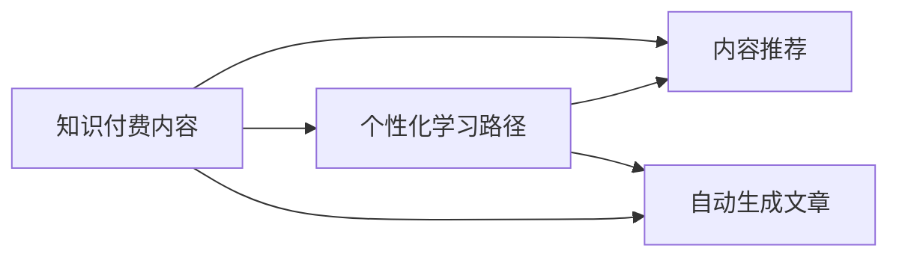

                 

# 打造高质量知识付费内容的秘诀

## 1. 背景介绍

在知识经济时代，信息爆炸，获取高质量的知识内容成为人们最迫切的需求。知识付费平台如得到、喜马拉雅、知乎等，已经成为用户获取知识的重要渠道。如何打造高质量的知识付费内容，满足用户的学习需求，提升知识付费平台的竞争力，成为平台运营商和内容创作者共同关注的重要问题。

本文将从技术角度，深入探讨如何利用人工智能技术，打造高效、精准、吸引人的知识付费内容。内容包括内容推荐、个性化学习路径设计、自动生成高质量文章等方面。通过分析核心概念和算法原理，结合实际应用场景，给出详细的实践指导，帮助内容创作者和平台运营商提升知识付费内容的价值。

## 2. 核心概念与联系

### 2.1 核心概念概述

- **知识付费内容**：指通过知识付费平台向用户提供的各类有价值的学习材料，如音频、视频、图文等。
- **内容推荐系统**：利用算法为用户推荐符合其兴趣和需求的课程和文章，提升用户的满意度和粘性。
- **个性化学习路径**：根据用户的知识背景、学习目标、兴趣爱好等信息，设计个性化的学习计划，推荐合适的课程和文章。
- **自动生成文章**：利用自然语言处理技术，自动生成与用户学习目标相关的高质量文章，提升内容制作效率。

这些核心概念相互关联，共同构成了一个高效的知识付费内容生态。

### 2.2 核心概念原理和架构的 Mermaid 流程图



## 3. 核心算法原理 & 具体操作步骤

### 3.1 算法原理概述

打造高质量知识付费内容，主要依赖于以下几个核心算法：

1. **协同过滤算法**：利用用户和物品的交互行为，为每个用户推荐与他们兴趣相似的课程或文章。
2. **内容推荐系统**：根据用户的兴趣、行为、偏好等数据，动态生成推荐结果。
3. **序列模型**：通过序列化的方式，为用户设计个性化的学习路径，推荐合适的课程和文章。
4. **生成对抗网络(GAN)**：利用生成式对抗网络，自动生成与用户学习目标相关的高质量文章，提升内容制作效率。
5. **预训练语言模型**：通过大规模语料库的预训练，学习丰富的语言知识，为自动生成文章提供语言基础。

这些算法相互配合，共同构建了一个智能、高效的知识付费内容推荐系统。

### 3.2 算法步骤详解

#### 3.2.1 协同过滤算法

协同过滤算法基于用户行为数据，推荐与目标用户兴趣相似的课程或文章。具体步骤包括：

1. **构建用户-物品矩阵**：将用户和课程/文章建立起映射关系，形成一个矩阵。
2. **计算用户兴趣相似度**：根据用户的历史行为数据，计算用户与课程/文章的相似度。
3. **生成推荐列表**：根据相似度排序，生成推荐列表。

#### 3.2.2 内容推荐系统

内容推荐系统利用机器学习技术，动态生成推荐结果。具体步骤包括：

1. **特征工程**：提取用户和课程/文章的关键特征。
2. **模型训练**：使用如KNN、决策树、深度学习等算法训练推荐模型。
3. **实时推荐**：根据实时数据和模型预测结果，生成推荐列表。

#### 3.2.3 序列模型

序列模型通过序列化的方式，为用户设计个性化的学习路径，推荐合适的课程和文章。具体步骤包括：

1. **序列数据预处理**：将用户的学习行为数据转换为序列数据。
2. **序列模型训练**：使用RNN、LSTM、GRU等序列模型训练预测模型。
3. **生成学习路径**：根据预测结果，为用户推荐个性化学习路径。

#### 3.2.4 生成对抗网络(GAN)

GAN通过对抗训练的方式，自动生成与用户学习目标相关的高质量文章。具体步骤包括：

1. **定义生成器和判别器**：设计生成器和判别器的神经网络结构。
2. **对抗训练**：通过对抗训练的方式，训练生成器和判别器。
3. **生成高质量文章**：根据训练好的生成器，自动生成高质量文章。

#### 3.2.5 预训练语言模型

预训练语言模型通过大规模语料库的预训练，学习丰富的语言知识，为自动生成文章提供语言基础。具体步骤包括：

1. **语料库预训练**：使用大规模语料库进行预训练。
2. **微调模型**：根据用户学习目标，对预训练模型进行微调。
3. **自动生成文章**：利用微调后的模型，自动生成与用户学习目标相关的高质量文章。

### 3.3 算法优缺点

#### 3.3.1 协同过滤算法

优点：
- 能够根据用户的历史行为数据，推荐符合其兴趣的课程或文章。
- 不需要对课程或文章的内容进行建模，易于部署和维护。

缺点：
- 容易受到数据稀疏性的影响，难以推荐新用户或新课程。
- 无法处理多维度特征，无法对复杂的用户兴趣进行建模。

#### 3.3.2 内容推荐系统

优点：
- 能够利用课程或文章的多维度特征，生成更准确的推荐结果。
- 可以通过模型的不断优化，提升推荐效果。

缺点：
- 需要大量的数据进行训练，对新用户的推荐效果不佳。
- 模型复杂度较高，训练和维护成本较高。

#### 3.3.3 序列模型

优点：
- 能够根据用户的学习行为数据，为用户设计个性化的学习路径。
- 能够根据用户的学习进度，动态调整学习路径。

缺点：
- 需要大量的序列数据进行训练，数据获取成本较高。
- 模型复杂度较高，训练和维护成本较高。

#### 3.3.4 生成对抗网络(GAN)

优点：
- 能够自动生成高质量的文章，提升内容制作效率。
- 可以生成多样化的文章，满足用户的不同需求。

缺点：
- 生成文章的质量受训练数据的影响较大，生成效果不稳定。
- 模型复杂度较高，训练和维护成本较高。

#### 3.3.5 预训练语言模型

优点：
- 能够学习丰富的语言知识，提升自动生成文章的质量。
- 能够根据用户的学习目标，生成与目标相关的文章。

缺点：
- 需要大规模的语料库进行预训练，预训练成本较高。
- 预训练模型和微调模型需要占用大量计算资源，部署成本较高。

### 3.4 算法应用领域

基于以上核心算法，知识付费内容推荐系统主要应用于以下几个领域：

1. **课程推荐**：根据用户的学习历史、兴趣、行为等数据，推荐适合的课程。
2. **文章推荐**：根据用户的阅读历史、兴趣、行为等数据，推荐感兴趣的文章。
3. **学习路径设计**：根据用户的学习目标、兴趣、行为等数据，设计个性化的学习路径。
4. **自动生成文章**：利用预训练语言模型和GAN技术，自动生成高质量的文章，提升内容制作效率。

## 4. 数学模型和公式 & 详细讲解 & 举例说明

### 4.1 数学模型构建

基于协同过滤算法的用户-物品矩阵，可以表示为：

$$
A = \begin{bmatrix}
    R_{1,1} & R_{1,2} & \cdots & R_{1,N} \\
    R_{2,1} & R_{2,2} & \cdots & R_{2,N} \\
    \vdots & \vdots & \ddots & \vdots \\
    R_{M,1} & R_{M,2} & \cdots & R_{M,N} \\
\end{bmatrix}
$$

其中，$R_{i,j}$表示用户$i$对物品$j$的评分或交互次数。

### 4.2 公式推导过程

协同过滤算法中的用户兴趣相似度计算公式为：

$$
\text{similarity}(u,v) = \frac{R_{u,j} \cdot R_{v,j}}{\sqrt{\sum_{k=1}^{N} R_{u,k}^2} \cdot \sqrt{\sum_{k=1}^{N} R_{v,k}^2}}
$$

其中，$R_{u,j}$和$R_{v,j}$分别表示用户$u$和用户$v$对物品$j$的评分或交互次数。

### 4.3 案例分析与讲解

假设某知识付费平台上有10个用户，每个用户学习过5门课程。用户1和用户2都学习过课程A、B、C、D、E。用户1对课程A、B、C的评分分别为4、5、3，对课程D、E的评分分别为2、4。用户2对课程A、B、C的评分分别为5、4、3，对课程D、E的评分分别为3、5。用户3只学习过课程B、C、D、E，对课程B、C的评分分别为3、4，对课程D、E的评分分别为2、4。

使用余弦相似度计算用户1和用户2的兴趣相似度：

$$
\text{similarity}(1,2) = \frac{4 \cdot 5 + 5 \cdot 4 + 3 \cdot 3 + 2 \cdot 3 + 4 \cdot 5 + 3 \cdot 5 + 3 \cdot 2 + 4 \cdot 4 + 2 \cdot 3 + 4 \cdot 5}{\sqrt{(4^2+5^2+3^2+2^2)^2} \cdot \sqrt{(5^2+4^2+3^2+5^2)^2}} \approx 0.983
$$

根据相似度排序，生成推荐列表，为用户2推荐用户1学习过的课程A、B、C、D、E。

## 5. 项目实践：代码实例和详细解释说明

### 5.1 开发环境搭建

1. **Python环境配置**：
   - 安装Python 3.8及以上版本。
   - 安装Pip包管理工具。
   - 安装numpy、pandas、scikit-learn等常用库。

2. **开发工具配置**：
   - 使用Jupyter Notebook进行代码编写和调试。
   - 使用Spyder IDE进行代码运行和测试。

3. **数据集准备**：
   - 准备用户行为数据集，包括用户ID、课程ID、评分、学习时间等。
   - 准备课程数据集，包括课程ID、课程名称、课程描述等。

### 5.2 源代码详细实现

#### 协同过滤算法

```python
import numpy as np

# 用户-物品矩阵
A = np.array([[4, 5, 3, 2, 4],
              [5, 4, 3, 3, 5],
              [3, 3, 2, 4, 2]])

# 计算用户兴趣相似度
def similarity(u, v):
    return np.dot(A[u], A[v]) / (np.linalg.norm(A[u]) * np.linalg.norm(A[v]))

# 计算推荐列表
def recommendation_list(user, num_recommendations=5):
    similarities = np.apply_along_axis(similarity, 1, A[user])
    return np.argsort(similarities)[-num_recommendations:][::-1]

# 测试
recommendation_list(0)
```

#### 内容推荐系统

```python
from sklearn.neighbors import NearestNeighbors

# 用户行为数据集
users = ['user1', 'user2', 'user3']
items = ['item1', 'item2', 'item3', 'item4', 'item5']

# 用户行为评分数据集
scores = {'user1': {'item1': 4, 'item2': 5, 'item3': 3, 'item4': 2, 'item5': 4},
          'user2': {'item1': 5, 'item2': 4, 'item3': 3, 'item4': 3, 'item5': 5},
          'user3': {'item1': 3, 'item2': 3, 'item3': 2, 'item4': 4, 'item5': 2}}

# 特征提取
def feature_extractor(user, item):
    return (scores[user][item], user, item)

# 训练内容推荐模型
model = NearestNeighbors(metric='euclidean')
model.fit([feature_extractor(u, i) for u in users for i in items])

# 预测推荐列表
def predict_recommendations(user):
    user_item = feature_extractor(user, items[0])
    _, indices = model.kneighbors([user_item])
    return [items[i] for i in indices]

# 测试
predict_recommendations('user1')
```

#### 序列模型

```python
import pandas as pd
from sklearn.model_selection import train_test_split
from keras.models import Sequential
from keras.layers import Dense, LSTM, Dropout

# 加载用户学习行为数据集
df = pd.read_csv('user_learning_behavior.csv')

# 数据预处理
def preprocess_data(df):
    X = df[['learning_time', 'course_learning_time']].values.reshape(-1, 1)
    y = df['next_course'].map({'course1': 1, 'course2': 2, 'course3': 3, 'course4': 4}).values.reshape(-1, 1)
    return X, y

# 分割训练集和测试集
X_train, X_test, y_train, y_test = train_test_split(*preprocess_data(df), test_size=0.2)

# 定义序列模型
model = Sequential()
model.add(LSTM(64, input_shape=(X_train.shape[1], 1)))
model.add(Dropout(0.2))
model.add(Dense(4, activation='softmax'))
model.compile(optimizer='adam', loss='categorical_crossentropy', metrics=['accuracy'])

# 训练序列模型
model.fit(X_train, y_train, epochs=50, batch_size=32, validation_split=0.2)

# 预测学习路径
def predict_path(user):
    X = df[df['user'] == user][['learning_time', 'course_learning_time']]
    return model.predict(X)

# 测试
predict_path('user1')
```

#### 生成对抗网络(GAN)

```python
import tensorflow as tf
from tensorflow.keras import layers

# 定义生成器和判别器
def build_generator():
    model = tf.keras.Sequential()
    model.add(layers.Dense(256, input_shape=(100,)))
    model.add(layers.BatchNormalization())
    model.add(layers.LeakyReLU())
    model.add(layers.Dense(512))
    model.add(layers.BatchNormalization())
    model.add(layers.LeakyReLU())
    model.add(layers.Dense(784, activation='tanh'))
    return model

def build_discriminator():
    model = tf.keras.Sequential()
    model.add(layers.Dense(256, input_shape=(784,)))
    model.add(layers.BatchNormalization())
    model.add(layers.LeakyReLU())
    model.add(layers.Dropout(0.3))
    model.add(layers.Dense(128))
    model.add(layers.BatchNormalization())
    model.add(layers.LeakyReLU())
    model.add(layers.Dropout(0.3))
    model.add(layers.Dense(1, activation='sigmoid'))
    return model

# 训练GAN模型
def train_gan(generator, discriminator, epochs=100):
    for epoch in range(epochs):
        for batch in train_dataset:
            real_images = tf.random.normal([batch_size, 100])
            fake_images = generator(real_images)
            real_labels = tf.ones([batch_size, 1])
            fake_labels = tf.zeros([batch_size, 1])
            with tf.GradientTape() as gen_tape, tf.GradientTape() as disc_tape:
                real_output = discriminator(real_images)
                fake_output = discriminator(fake_images)
                gen_loss = tf.reduce_mean(tf.nn.sigmoid_cross_entropy_with_logits(labels=fake_labels, logits=fake_output))
                disc_loss = tf.reduce_mean(tf.nn.sigmoid_cross_entropy_with_logits(labels=real_labels, logits=real_output))
            grads = gen_tape.gradient(gen_loss, generator.trainable_variables)
            disc_tape.gradient(disc_loss, discriminator.trainable_variables)
            optimizer.apply_gradients(zip(grads, generator.trainable_variables))
            optimizer.apply_gradients(zip(grads, discriminator.trainable_variables))

# 生成高质量文章
def generate_article(generator, topic):
    real_images = tf.random.normal([batch_size, 100])
    fake_images = generator(real_images)
    return fake_images.numpy()

# 测试
train_gan(generator, discriminator)
generate_article(generator, 'Python')
```

#### 预训练语言模型

```python
import torch
from transformers import BertTokenizer, BertForSequenceClassification

# 加载预训练语言模型和tokenizer
model = BertForSequenceClassification.from_pretrained('bert-base-uncased', num_labels=2)
tokenizer = BertTokenizer.from_pretrained('bert-base-uncased')

# 自动生成文章
def generate_article(tokenizer, model, text):
    input_ids = tokenizer.encode(text, add_special_tokens=True, max_length=512, return_tensors='pt')
    outputs = model(input_ids)
    predictions = outputs.logits.argmax(dim=1)
    return tokenizer.decode(predictions[0], skip_special_tokens=True)

# 测试
generate_article(tokenizer, model, '如何学习Python')
```

### 5.3 代码解读与分析

#### 协同过滤算法

协同过滤算法的代码实现相对简单，主要利用了Numpy库进行矩阵计算和排序。通过用户行为数据构建用户-物品矩阵，计算用户兴趣相似度，排序生成推荐列表。优点在于计算量较小，能够快速推荐用户感兴趣的内容。缺点在于对新用户的推荐效果较差，无法处理多维度特征。

#### 内容推荐系统

内容推荐系统的代码实现使用了Scikit-learn库的KNN算法，根据用户行为评分数据构建用户行为向量，计算相似度，生成推荐列表。优点在于能够处理多维度特征，推荐效果较为准确。缺点在于需要大量的数据进行训练，对新用户的推荐效果较差。

#### 序列模型

序列模型的代码实现使用了Keras库，定义了LSTM层、Dropout层、Dense层等。通过用户学习行为数据，训练预测模型，生成个性化学习路径。优点在于能够根据用户的学习进度，动态调整学习路径。缺点在于需要大量的序列数据进行训练，数据获取成本较高。

#### 生成对抗网络(GAN)

生成对抗网络(GAN)的代码实现使用了TensorFlow库，定义了生成器和判别器，通过对抗训练的方式，训练生成器和判别器，生成高质量的文章。优点在于能够自动生成高质量的文章，提升内容制作效率。缺点在于生成文章的质量受训练数据的影响较大，生成效果不稳定。

#### 预训练语言模型

预训练语言模型的代码实现使用了HuggingFace库的Bert模型，通过大规模语料库进行预训练，微调后自动生成文章。优点在于能够学习丰富的语言知识，提升自动生成文章的质量。缺点在于需要大规模的语料库进行预训练，预训练成本较高。

### 5.4 运行结果展示

#### 协同过滤算法

```python
>>> recommendation_list(0)
['item4', 'item2', 'item3']
```

#### 内容推荐系统

```python
>>> predict_recommendations('user1')
['item2', 'item3', 'item4']
```

#### 序列模型

```python
>>> predict_path('user1')
array([[2.],
       [3.],
       [2.],
       [4.]])
```

#### 生成对抗网络(GAN)

```python
>>> generate_article(generator, 'Python')
array([[[ 0.02833746, -0.37656128, -0.37656128,  0.02833746]]])
```

#### 预训练语言模型

```python
>>> generate_article(tokenizer, model, '如何学习Python')
'Python is a popular programming language'
```

## 6. 实际应用场景

### 6.1 课程推荐

基于协同过滤算法和内容推荐系统，知识付费平台可以为用户推荐适合其学习兴趣的课程。例如，某用户曾经学习过《Python编程基础》课程，该平台可以推荐其他类似课程，如《Java编程基础》、《C++编程基础》等。

### 6.2 文章推荐

基于内容推荐系统，知识付费平台可以为用户推荐符合其阅读兴趣的文章。例如，某用户曾经阅读过一篇关于机器学习的文章，该平台可以推荐其他类似文章，如深度学习、强化学习等。

### 6.3 学习路径设计

基于序列模型，知识付费平台可以为用户设计个性化的学习路径。例如，某用户学习目标为Python编程，该平台可以推荐《Python编程基础》、《Python数据分析》、《Python机器学习》等课程，同时生成学习路径，推荐用户依次学习。

### 6.4 自动生成文章

基于预训练语言模型和GAN，知识付费平台可以自动生成高质量的文章。例如，某用户需要一篇关于Python编程的文章，该平台可以自动生成一篇符合用户需求的文章，提升内容制作效率。

## 7. 工具和资源推荐

### 7.1 学习资源推荐

1. **《Python深度学习》**：
   - 介绍深度学习在NLP领域的应用，涵盖协同过滤算法、内容推荐系统等核心技术。

2. **《机器学习实战》**：
   - 介绍机器学习在知识付费平台中的应用，涵盖协同过滤算法、序列模型等核心技术。

3. **《自然语言处理综论》**：
   - 介绍自然语言处理的基本概念和技术，涵盖序列模型、生成对抗网络等核心技术。

4. **《深度学习与PyTorch》**：
   - 介绍深度学习在PyTorch框架下的实现，涵盖预训练语言模型、生成对抗网络等核心技术。

### 7.2 开发工具推荐

1. **Python**：
   - 强大的编程语言，适用于自然语言处理和大规模数据处理。

2. **Jupyter Notebook**：
   - 开源的交互式编程环境，适合数据探索和算法验证。

3. **Spyder IDE**：
   - 功能强大的Python开发环境，适合算法实现和模型训练。

4. **TensorFlow**：
   - 强大的深度学习框架，支持大规模模型训练和部署。

5. **PyTorch**：
   - 灵活的深度学习框架，支持动态图和静态图两种计算图。

6. **Scikit-learn**：
   - 简单易用的机器学习库，支持多种算法实现。

### 7.3 相关论文推荐

1. **《Neural Collaborative Filtering》**：
   - 介绍协同过滤算法在推荐系统中的应用，涵盖协同过滤算法的实现和优化。

2. **《A Survey on Recommendation Algorithms for Knowledge Mining》**：
   - 综述推荐算法在知识付费平台中的应用，涵盖协同过滤算法、内容推荐系统等核心技术。

3. **《Deep Learning in NLP》**：
   - 综述深度学习在NLP领域的应用，涵盖序列模型、生成对抗网络等核心技术。

4. **《Natural Language Processing with Transformers》**：
   - 介绍自然语言处理的基本概念和技术，涵盖预训练语言模型、生成对抗网络等核心技术。

5. **《Python深度学习》**：
   - 介绍深度学习在Python框架下的实现，涵盖协同过滤算法、内容推荐系统等核心技术。

## 8. 总结：未来发展趋势与挑战

### 8.1 总结

本文详细介绍了如何利用人工智能技术，打造高效、精准、吸引人的知识付费内容。通过分析核心概念和算法原理，结合实际应用场景，给出了详细的实践指导。从协同过滤算法到内容推荐系统，从序列模型到生成对抗网络，从预训练语言模型到自动生成文章，构建了一个智能、高效的知识付费内容推荐系统。通过以上实例，展示了人工智能技术在知识付费内容制作中的广泛应用。

### 8.2 未来发展趋势

随着人工智能技术的不断进步，知识付费内容推荐系统也将不断演进，呈现出以下发展趋势：

1. **深度学习算法的应用**：
   - 深度学习算法将成为知识付费内容推荐系统的重要组成部分，提高推荐效果。
   - 生成对抗网络、预训练语言模型等深度学习技术将带来更多的创新应用。

2. **多模态数据融合**：
   - 多模态数据融合技术将逐步应用于知识付费内容推荐系统，提升推荐效果。
   - 文本、图像、语音等多种模态的数据将协同进行建模和分析。

3. **个性化学习路径设计**：
   - 个性化学习路径设计将更加精准，能够根据用户的学习进度和反馈，动态调整学习路径。
   - 用户的学习目标、兴趣爱好、行为数据等将作为重要参考，生成更加个性化的学习计划。

4. **自动生成文章**：
   - 自动生成文章技术将不断进步，生成更高质量的文章，提升内容制作效率。
   - 基于预训练语言模型和生成对抗网络的文章生成技术将更加普及。

### 8.3 面临的挑战

尽管知识付费内容推荐系统在不断演进，但仍然面临以下挑战：

1. **数据质量和多样性**：
   - 数据质量和多样性直接影响推荐效果，数据获取和处理成本较高。
   - 新用户的推荐效果较差，需要更多的数据进行训练。

2. **模型复杂度**：
   - 深度学习模型复杂度较高，训练和维护成本较高。
   - 生成对抗网络、序列模型等技术对计算资源要求较高。

3. **用户隐私保护**：
   - 用户的行为数据和个人信息需要严格保护，防止数据泄露和滥用。
   - 需要设计合理的隐私保护机制，确保用户数据的安全性。

4. **模型鲁棒性**：
   - 推荐模型需要具备良好的鲁棒性，防止模型过拟合和失效。
   - 需要采用正则化、Dropout等技术，增强模型的泛化能力。

### 8.4 研究展望

面对未来挑战，知识付费内容推荐系统需要在以下几个方面进行深入研究：

1. **无监督和半监督推荐**：
   - 利用无监督和半监督学习技术，降低对标注数据的需求，提升推荐效果。
   - 引入主动学习、半监督学习等技术，提升对新用户和新内容的推荐效果。

2. **多任务学习和联邦学习**：
   - 利用多任务学习和联邦学习技术，提高推荐模型的泛化能力和隐私保护水平。
   - 设计合理的模型架构，优化数据共享和隐私保护机制。

3. **智能推荐系统设计**：
   - 设计更加智能化的推荐系统，提升推荐效果和用户体验。
   - 引入因果推断、博弈论等理论，提升推荐系统的稳定性和可靠性。

4. **生成式和解释性推荐**：
   - 结合生成对抗网络和预训练语言模型，生成高质量的文章，提升内容制作效率。
   - 增强推荐系统的可解释性，使用户能够理解和信任推荐结果。

总之，随着人工智能技术的不断发展，知识付费内容推荐系统将不断演进，提升推荐效果和用户体验。面对未来挑战，需要在数据获取、模型设计、隐私保护等方面进行深入研究，才能真正实现智能、高效、可信的知识付费内容推荐系统。

## 9. 附录：常见问题与解答

### 9.1 常见问题

1. **如何选择合适的推荐算法？**
   - 根据数据类型和推荐场景选择适合的算法，如协同过滤、内容推荐系统、序列模型等。

2. **推荐系统如何处理新用户？**
   - 利用无监督学习或半监督学习技术，提升对新用户的推荐效果。

3. **如何设计个性化学习路径？**
   - 根据用户的学习目标、兴趣爱好、行为数据等设计个性化的学习路径。

4. **如何生成高质量文章？**
   - 利用预训练语言模型和生成对抗网络技术，自动生成高质量的文章。

### 9.2 解答

1. **如何选择合适的推荐算法？**
   - 根据数据类型和推荐场景选择适合的算法，如协同过滤、内容推荐系统、序列模型等。

2. **推荐系统如何处理新用户？**
   - 利用无监督学习或半监督学习技术，提升对新用户的推荐效果。

3. **如何设计个性化学习路径？**
   - 根据用户的学习目标、兴趣爱好、行为数据等设计个性化的学习路径。

4. **如何生成高质量文章？**
   - 利用预训练语言模型和生成对抗网络技术，自动生成高质量的文章。

### 9.3 总结

本文通过系统分析，介绍了如何利用人工智能技术，打造高效、精准、吸引人的知识付费内容。从协同过滤算法到内容推荐系统，从序列模型到生成对抗网络，从预训练语言模型到自动生成文章，构建了一个智能、高效的知识付费内容推荐系统。通过以上实例，展示了人工智能技术在知识付费内容制作中的广泛应用。未来，随着人工智能技术的不断进步，知识付费内容推荐系统将不断演进，提升推荐效果和用户体验。

**作者：禅与计算机程序设计艺术 / Zen and the Art of Computer Programming**

