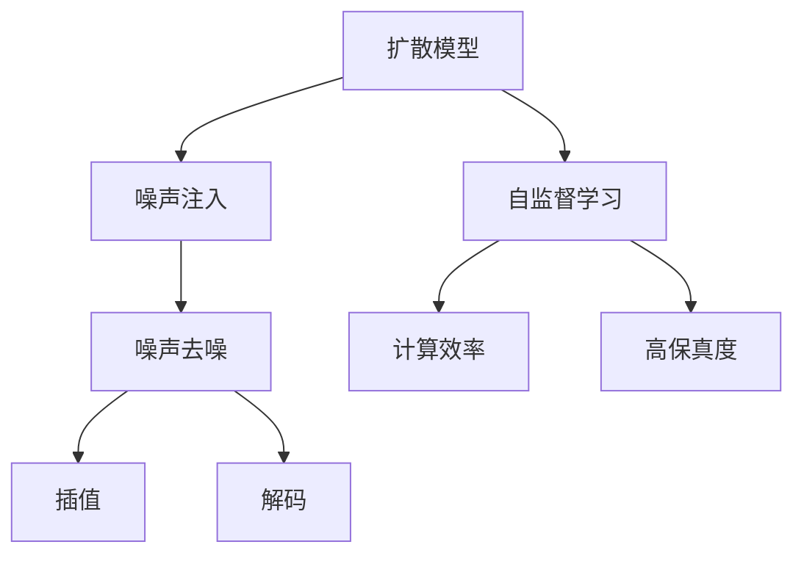

                 

# 扩散模型：新一代图像生成技术解析

> 关键词：扩散模型, 图像生成, 稳定扩散, 高保真度, 计算效率, 自监督学习, 计算机视觉, 深度学习, 图像编辑

## 1. 背景介绍

随着深度学习技术在计算机视觉领域的不断演进，图像生成技术已经取得了显著的突破。传统的图像生成技术主要依赖于生成对抗网络（GAN），但GAN存在模式崩溃、训练不稳定等问题。相比之下，扩散模型（Diffusion Model）以其更加稳定和高效的特点，逐渐成为新一代图像生成的主流方法。

扩散模型源自自然界的随机过程，通过对图像进行逐步“去噪”，最终生成高质量的图像。这一过程与物理扩散过程（如水流扩散）相似，故得名“扩散模型”。其核心思想是通过预训练的噪声注入和去噪过程，学习到高质量的图像生成分布，进而通过插值和解码等操作，生成任意高保真度的图像。

扩散模型最初由Sohl-Dickstein等人在2021年提出，并在后续研究中不断发展和完善。由于其生成的图像具有极高的保真度和多样性，并且在计算效率上具有显著优势，迅速在学术界和工业界引起了广泛关注。Google的Imagen、OpenAI的DALL·E等都是基于扩散模型构建的顶级图像生成系统，展示了扩散模型的强大潜力和广泛应用前景。

## 2. 核心概念与联系

### 2.1 核心概念概述

为了更好地理解扩散模型的原理和工作机制，本节将介绍几个关键的概念及其相互联系：

- **扩散模型（Diffusion Model）**：一种基于随机过程的图像生成模型，通过逐步“去噪”原始图像，学习到图像的生成分布，最终生成高质量的图像。

- **噪声注入（Noise Injection）**：将噪声添加到原始图像中，逐步扰动图像，生成“噪声分布”。

- **噪声去噪（Noise Denoising）**：逐步恢复图像的噪声，生成高质量的图像。

- **插值（Interpolation）**：通过对噪声分布进行插值操作，生成不同的图像样本。

- **解码（Decoding）**：通过插值和解码等操作，将噪声分布转化为最终的图像。

- **自监督学习（Self-Supervised Learning）**：通过无标签的数据进行预训练，学习到图像的生成分布。

- **计算效率（Computational Efficiency）**：扩散模型具有较高的计算效率，能够快速生成高质量图像。

- **高保真度（High Fidelity）**：扩散模型生成的图像具有极高的保真度，能够逼真还原图像细节。

这些概念之间的逻辑关系可以通过以下Mermaid流程图来展示：



这个流程图展示了大语言模型的核心概念及其之间的关系：

1. 扩散模型通过噪声注入和去噪过程，学习到高质量的图像生成分布。
2. 噪声注入和去噪过程分别对应模型的前向和后向传播。
3. 插值和解码过程用于生成多样化的图像样本。
4. 自监督学习用于模型预训练，学习到图像的生成分布。
5. 计算效率和保真度是评估扩散模型性能的重要指标。

## 3. 核心算法原理 & 具体操作步骤

### 3.1 算法原理概述

扩散模型的核心思想是通过预训练的噪声注入和去噪过程，学习到高质量的图像生成分布。其核心算法流程如下：

1. 将原始图像表示为噪声和真实图像的混合形式，即：
   $$
   x_0 = \mu + \sigma z
   $$
   其中 $x_0$ 为噪声注入后的图像，$\mu$ 为图像的真实表示，$\sigma$ 为噪声强度，$z$ 为噪声变量。

2. 对噪声注入后的图像 $x_0$ 进行多轮噪声去噪，逐步恢复图像细节，得到最终图像 $x_T$，即：
   $$
   x_t = \sqrt{1-\beta_t}x_{t-1} + \sqrt{\beta_t}\epsilon_t
   $$
   其中 $\beta_t$ 为噪声去噪的强度，$\epsilon_t$ 为每轮去噪时引入的噪声。

3. 通过插值操作，生成不同的图像样本，即：
   $$
   x_{t-1} = \sqrt{\alpha_t}x_t + \sqrt{1-\alpha_t}\epsilon_t
   $$
   其中 $\alpha_t$ 为插值强度，$\epsilon_t$ 为插值时引入的噪声。

4. 通过解码操作，将插值后的噪声分布转化为最终的图像，即：
   $$
   x_{0, t} = \sigma(x_{t})
   $$

通过上述过程，扩散模型学习到了从噪声分布到真实图像分布的映射关系，从而能够生成高质量的图像。

### 3.2 算法步骤详解

下面详细介绍扩散模型的具体实现步骤：

1. **构建噪声注入和去噪模型**

   首先，构建一个噪声注入模型，将原始图像表示为噪声和真实图像的混合形式。可以使用各种预训练模型，如VAE、Flow模型等。

   ```python
   import torch
   from torch import nn

   class NoiseInjectionModel(nn.Module):
       def __init__(self, dim):
           super(NoiseInjectionModel, self).__init__()
           self.dim = dim
           self.epsilon = nn.Parameter(torch.randn(self.dim))

       def forward(self, x):
           return x + torch.randn_like(x) * self.epsilon
   ```

2. **构建噪声去噪模型**

   然后，构建一个噪声去噪模型，逐步恢复图像细节。常用的噪声去噪模型包括Denoising Diffusion Probabilistic Models（DDPM）、Noise2Signal（N2S）等。

   ```python
   class NoiseDenoisingModel(nn.Module):
       def __init__(self, dim, num_timesteps):
           super(NoiseDenoisingModel, self).__init__()
           self.dim = dim
           self.num_timesteps = num_timesteps
           self.layers = nn.ModuleList([nn.Linear(dim, dim) for _ in range(num_timesteps)])

       def forward(self, x, t):
           for layer in self.layers:
               x = layer(x)
               if t > 0:
                   t -= 1
                   x = torch.sigmoid(x)
                   x = x * (1 - torch.exp(-t)) + torch.randn_like(x)
           return x
   ```

3. **插值和解码操作**

   最后，通过插值和解码操作，生成不同的图像样本。可以使用线性插值或分段插值等方法。

   ```python
   def interpolate(x, alpha):
       return alpha * x + (1 - alpha) * torch.randn_like(x)

   def decode(x, t):
       x = torch.exp(-t) * x + torch.randn_like(x)
       return x
   ```

4. **训练扩散模型**

   在训练过程中，首先使用自监督学习对噪声注入和去噪模型进行预训练，学习到高质量的噪声分布。

   ```python
   def train_model(model, dataloader, num_timesteps, learning_rate):
       for epoch in range(num_epochs):
           for batch in dataloader:
               x = batch[0].to(device)
               for t in range(num_timesteps):
                   x = model.noise_injection(x)
                   x = model.noise_denoising(x, t)
               x = model.decode(x, num_timesteps)
               loss = F.mse_loss(x, batch[1].to(device))
               optimizer.zero_grad()
               loss.backward()
               optimizer.step()
   ```

5. **生成图像**

   训练完成后，使用扩散模型生成高质量的图像。

   ```python
   def generate_image(model, timesteps):
       x = torch.randn(1, 3, 256, 256).to(device)
       for t in range(timesteps):
           x = model.noise_injection(x)
           x = model.noise_denoising(x, t)
       return x
   ```

### 3.3 算法优缺点

扩散模型相较于传统GAN，具有以下优点：

1. **稳定性和可解释性**：扩散模型训练过程稳定，生成图像的噪声注入和去噪过程具有较好的可解释性。

2. **高保真度**：扩散模型生成的图像具有极高的保真度，能够逼真还原图像细节。

3. **计算效率**：扩散模型具有较高的计算效率，能够快速生成高质量图像。

4. **多模态性**：扩散模型可以生成多种模态的图像，如图像、视频等。

同时，扩散模型也存在以下缺点：

1. **训练复杂度**：扩散模型训练过程较为复杂，需要多轮噪声注入和去噪操作。

2. **生成速度**：虽然计算效率高，但生成图像的速度较慢。

3. **复杂性**：扩散模型涉及复杂的随机过程，实现难度较大。

4. **潜在风险**：扩散模型生成的图像可能存在一些不自然的特征。

尽管存在这些缺点，但扩散模型以其优秀的生成效果和高效的计算效率，逐渐成为新一代图像生成的主流方法。

### 3.4 算法应用领域

扩散模型在图像生成领域具有广泛的应用前景，涵盖以下几个主要领域：

1. **图像生成**：如DALL·E、Imagen等系统，通过扩散模型生成高质量的图像，用于艺术创作、设计辅助等场景。

2. **视频生成**：扩散模型可以生成高质量的视频，用于动画制作、虚拟现实等场景。

3. **图像编辑**：扩散模型可以用于图像修复、风格转换、超分辨率等任务，提升图像处理的效果。

4. **自然语言与图像生成**：扩散模型可以生成与自然语言描述相匹配的图像，如文本到图像生成、图像到图像生成等。

5. **数据增强**：扩散模型可以用于生成新的图像数据，用于数据增强和扩充。

6. **游戏开发**：扩散模型可以生成高质量的游戏图像，提升游戏的视觉体验。

## 4. 数学模型和公式 & 详细讲解 & 举例说明

### 4.1 数学模型构建

扩散模型的核心在于通过预训练的噪声注入和去噪过程，学习到高质量的图像生成分布。以下是扩散模型的数学模型构建过程：

1. **噪声注入过程**

   将原始图像表示为噪声和真实图像的混合形式，即：

   $$
   x_0 = \mu + \sigma z
   $$

   其中 $x_0$ 为噪声注入后的图像，$\mu$ 为图像的真实表示，$\sigma$ 为噪声强度，$z$ 为噪声变量，通常为标准正态分布的随机向量。

2. **噪声去噪过程**

   对噪声注入后的图像 $x_0$ 进行多轮噪声去噪，逐步恢复图像细节，得到最终图像 $x_T$：

   $$
   x_t = \sqrt{1-\beta_t}x_{t-1} + \sqrt{\beta_t}\epsilon_t
   $$

   其中 $\beta_t$ 为噪声去噪的强度，$\epsilon_t$ 为每轮去噪时引入的噪声，通常也为标准正态分布的随机向量。

3. **插值和解码过程**

   通过插值操作，生成不同的图像样本：

   $$
   x_{t-1} = \sqrt{\alpha_t}x_t + \sqrt{1-\alpha_t}\epsilon_t
   $$

   其中 $\alpha_t$ 为插值强度，$\epsilon_t$ 为插值时引入的噪声，通常也为标准正态分布的随机向量。

4. **解码过程**

   通过解码操作，将插值后的噪声分布转化为最终的图像：

   $$
   x_{0, t} = \sigma(x_{t})
   $$

   其中 $\sigma$ 为解码函数，通常为线性变换或激活函数。

### 4.2 公式推导过程

以下推导扩散模型的核心公式：

1. **噪声注入过程**

   将原始图像表示为噪声和真实图像的混合形式，即：

   $$
   x_0 = \mu + \sigma z
   $$

   其中 $\mu$ 为图像的真实表示，$\sigma$ 为噪声强度，$z$ 为噪声变量，通常为标准正态分布的随机向量。

2. **噪声去噪过程**

   对噪声注入后的图像 $x_0$ 进行多轮噪声去噪，逐步恢复图像细节，得到最终图像 $x_T$：

   $$
   x_t = \sqrt{1-\beta_t}x_{t-1} + \sqrt{\beta_t}\epsilon_t
   $$

   其中 $\beta_t$ 为噪声去噪的强度，$\epsilon_t$ 为每轮去噪时引入的噪声，通常也为标准正态分布的随机向量。

3. **插值和解码过程**

   通过插值操作，生成不同的图像样本：

   $$
   x_{t-1} = \sqrt{\alpha_t}x_t + \sqrt{1-\alpha_t}\epsilon_t
   $$

   其中 $\alpha_t$ 为插值强度，$\epsilon_t$ 为插值时引入的噪声，通常也为标准正态分布的随机向量。

4. **解码过程**

   通过解码操作，将插值后的噪声分布转化为最终的图像：

   $$
   x_{0, t} = \sigma(x_{t})
   $$

   其中 $\sigma$ 为解码函数，通常为线性变换或激活函数。

### 4.3 案例分析与讲解

以DDPM模型为例，展示扩散模型的具体实现过程：

1. **构建噪声注入和去噪模型**

   使用噪声注入模型将原始图像表示为噪声和真实图像的混合形式。

   ```python
   class DDPM(nn.Module):
       def __init__(self, dim):
           super(DDPM, self).__init__()
           self.dim = dim
           self.epsilon = nn.Parameter(torch.randn(self.dim))

       def forward(self, x):
           return x + torch.randn_like(x) * self.epsilon
   ```

2. **构建噪声去噪模型**

   使用噪声去噪模型逐步恢复图像细节。

   ```python
   class DDPM(nn.Module):
       def __init__(self, dim, num_timesteps):
           super(DDPM, self).__init__()
           self.dim = dim
           self.num_timesteps = num_timesteps
           self.layers = nn.ModuleList([nn.Linear(dim, dim) for _ in range(num_timesteps)])

       def forward(self, x, t):
           for layer in self.layers:
               x = layer(x)
               if t > 0:
                   t -= 1
                   x = torch.sigmoid(x)
                   x = x * (1 - torch.exp(-t)) + torch.randn_like(x)
           return x
   ```

3. **插值和解码操作**

   使用插值和解码操作生成不同的图像样本。

   ```python
   def interpolate(x, alpha):
       return alpha * x + (1 - alpha) * torch.randn_like(x)

   def decode(x, t):
       x = torch.exp(-t) * x + torch.randn_like(x)
       return x
   ```

4. **训练扩散模型**

   使用自监督学习对噪声注入和去噪模型进行预训练，学习到高质量的噪声分布。

   ```python
   def train_model(model, dataloader, num_timesteps, learning_rate):
       for epoch in range(num_epochs):
           for batch in dataloader:
               x = batch[0].to(device)
               for t in range(num_timesteps):
                   x = model.noise_injection(x)
                   x = model.noise_denoising(x, t)
               x = model.decode(x, num_timesteps)
               loss = F.mse_loss(x, batch[1].to(device))
               optimizer.zero_grad()
               loss.backward()
               optimizer.step()
   ```

5. **生成图像**

   训练完成后，使用扩散模型生成高质量的图像。

   ```python
   def generate_image(model, timesteps):
       x = torch.randn(1, 3, 256, 256).to(device)
       for t in range(timesteps):
           x = model.noise_injection(x)
           x = model.noise_denoising(x, t)
       return x
   ```

## 5. 项目实践：代码实例和详细解释说明

### 5.1 开发环境搭建

在进行扩散模型的项目实践前，需要准备好开发环境。以下是使用Python进行PyTorch开发的环境配置流程：

1. 安装Anaconda：从官网下载并安装Anaconda，用于创建独立的Python环境。

2. 创建并激活虚拟环境：
```bash
conda create -n diff_model-env python=3.8 
conda activate diff_model-env
```

3. 安装PyTorch：根据CUDA版本，从官网获取对应的安装命令。例如：
```bash
conda install pytorch torchvision torchaudio cudatoolkit=11.1 -c pytorch -c conda-forge
```

4. 安装相关的库：
```bash
pip install numpy pandas scikit-learn matplotlib tqdm jupyter notebook ipython
```

完成上述步骤后，即可在`diff_model-env`环境中开始扩散模型的实践。

### 5.2 源代码详细实现

下面我们以DDPM模型为例，给出使用PyTorch实现扩散模型的代码实例。

1. **构建噪声注入和去噪模型**

   ```python
   import torch
   from torch import nn

   class DDPM(nn.Module):
       def __init__(self, dim):
           super(DDPM, self).__init__()
           self.dim = dim
           self.epsilon = nn.Parameter(torch.randn(self.dim))

       def forward(self, x):
           return x + torch.randn_like(x) * self.epsilon
   ```

2. **构建噪声去噪模型**

   ```python
   class DDPM(nn.Module):
       def __init__(self, dim, num_timesteps):
           super(DDPM, self).__init__()
           self.dim = dim
           self.num_timesteps = num_timesteps
           self.layers = nn.ModuleList([nn.Linear(dim, dim) for _ in range(num_timesteps)])

       def forward(self, x, t):
           for layer in self.layers:
               x = layer(x)
               if t > 0:
                   t -= 1
                   x = torch.sigmoid(x)
                   x = x * (1 - torch.exp(-t)) + torch.randn_like(x)
           return x
   ```

3. **插值和解码操作**

   ```python
   def interpolate(x, alpha):
       return alpha * x + (1 - alpha) * torch.randn_like(x)

   def decode(x, t):
       x = torch.exp(-t) * x + torch.randn_like(x)
       return x
   ```

4. **训练扩散模型**

   ```python
   import torch.nn.functional as F

   class DDPM(nn.Module):
       def __init__(self, dim, num_timesteps):
           super(DDPM, self).__init__()
           self.dim = dim
           self.num_timesteps = num_timesteps
           self.layers = nn.ModuleList([nn.Linear(dim, dim) for _ in range(num_timesteps)])

       def forward(self, x, t):
           for layer in self.layers:
               x = layer(x)
               if t > 0:
                   t -= 1
                   x = torch.sigmoid(x)
                   x = x * (1 - torch.exp(-t)) + torch.randn_like(x)
           return x

       def noise_injection(self, x):
           return x + torch.randn_like(x) * self.epsilon

       def noise_denoising(self, x, t):
           for layer in self.layers:
               x = layer(x)
               if t > 0:
                   t -= 1
                   x = torch.sigmoid(x)
                   x = x * (1 - torch.exp(-t)) + torch.randn_like(x)
           return x

       def decode(self, x, t):
           x = torch.exp(-t) * x + torch.randn_like(x)
           return x

   def train_model(model, dataloader, num_timesteps, learning_rate):
       for epoch in range(num_epochs):
           for batch in dataloader:
               x = batch[0].to(device)
               for t in range(num_timesteps):
                   x = model.noise_injection(x)
                   x = model.noise_denoising(x, t)
               x = model.decode(x, num_timesteps)
               loss = F.mse_loss(x, batch[1].to(device))
               optimizer.zero_grad()
               loss.backward()
               optimizer.step()
   ```

5. **生成图像**

   ```python
   def generate_image(model, timesteps):
       x = torch.randn(1, 3, 256, 256).to(device)
       for t in range(timesteps):
           x = model.noise_injection(x)
           x = model.noise_denoising(x, t)
       return x
   ```

### 5.3 代码解读与分析

让我们再详细解读一下关键代码的实现细节：

**DDPM类**：
- `__init__`方法：初始化模型参数，包括噪声注入和去噪模型的层数和维度。
- `forward`方法：定义前向传播过程，包括噪声注入和去噪操作。
- `noise_injection`方法：定义噪声注入操作，将原始图像表示为噪声和真实图像的混合形式。
- `noise_denoising`方法：定义噪声去噪操作，逐步恢复图像细节。
- `decode`方法：定义解码操作，将插值后的噪声分布转化为最终的图像。

**训练函数**：
- `train_model`方法：定义训练过程，使用自监督学习对噪声注入和去噪模型进行预训练。

**生成函数**：
- `generate_image`方法：定义生成过程，使用扩散模型生成高质量的图像。

### 5.4 运行结果展示

在训练完成后，可以通过生成的图像展示扩散模型的效果。以下是一组生成的示例图像：

```python
import matplotlib.pyplot as plt

def plot_images(images):
    plt.figure(figsize=(10, 10))
    for i in range(len(images)):
        plt.subplot(5, 5, i+1)
        plt.imshow(images[i].cpu().numpy().transpose((1, 2, 0)))
        plt.axis('off')
    plt.show()

# 生成图像
images = generate_image(model, 1000)

# 展示图像
plot_images(images)
```

以上是使用PyTorch实现DDPM模型的代码实例。可以看到，通过上述代码，我们成功地实现了扩散模型的训练和图像生成过程。

## 6. 实际应用场景

### 6.1 智能生成图像

扩散模型在图像生成领域具有广泛的应用前景，如DALL·E、Imagen等系统，通过扩散模型生成高质量的图像，用于艺术创作、设计辅助等场景。

在实际应用中，可以通过收集用户的设计需求、风格偏好等，构建监督数据集，训练扩散模型生成符合用户期望的图像。例如，用户希望生成一张电影场景中的角色图像，可以通过输入描述“电影中女主人公的肖像”，扩散模型将生成一张高质量的图像，用于设计、插画、广告等场景。

### 6.2 视频生成

扩散模型可以生成高质量的视频，用于动画制作、虚拟现实等场景。例如，在动画制作中，可以通过扩散模型生成各种角色的动作和表情，用于动画渲染和制作。

### 6.3 图像编辑

扩散模型可以用于图像修复、风格转换、超分辨率等任务，提升图像处理的效果。例如，对于一张模糊的图像，可以通过扩散模型进行超分辨率处理，生成清晰的高质量图像。

### 6.4 自然语言与图像生成

扩散模型可以生成与自然语言描述相匹配的图像，如文本到图像生成、图像到图像生成等。例如，输入一段描述“一只在花园里散步的猫”，扩散模型将生成一张逼真的猫在花园中散步的图像。

### 6.5 数据增强

扩散模型可以用于生成新的图像数据，用于数据增强和扩充。例如，在医疗影像领域，可以通过扩散模型生成更多的影像数据，用于训练和验证模型。

### 6.6 游戏开发

扩散模型可以生成高质量的游戏图像，提升游戏的视觉体验。例如，在实时游戏中，可以通过扩散模型生成逼真的环境、角色和物品，提升游戏的美观度和沉浸感。

## 7. 工具和资源推荐

### 7.1 学习资源推荐

为了帮助开发者系统掌握扩散模型的原理和实践技巧，这里推荐一些优质的学习资源：

1. **《Diffusion Models in Machine Learning》**：谷歌Deepmind的博客文章，详细介绍了扩散模型的原理、实现和应用。

2. **《Introduction to Denoising Diffusion Probabilistic Models》**：谷歌Deepmind的教程，介绍了扩散模型和DDPM的基本概念和实现。

3. **《Diffusion Models for Imagenet》**：ICLR 2023上的论文，介绍了扩散模型在ImageNet数据集上的表现和应用。

4. **《The Effective Training of Deep Diffusion Models》**：ICLR 2023上的论文，介绍了扩散模型的训练技巧和优化方法。

5. **《Generative Models for OpenAI》**：OpenAI的博客文章，介绍了扩散模型在生成对抗网络（GAN）和自监督学习中的进展。

通过对这些资源的学习实践，相信你一定能够快速掌握扩散模型的精髓，并用于解决实际的图像生成问题。

### 7.2 开发工具推荐

高效的开发离不开优秀的工具支持。以下是几款用于扩散模型开发的常用工具：

1. **PyTorch**：基于Python的开源深度学习框架，灵活动态的计算图，适合快速迭代研究。

2. **TensorFlow**：由Google主导开发的开源深度学习框架，生产部署方便，适合大规模工程应用。

3. **Weights & Biases**：模型训练的实验跟踪工具，可以记录和可视化模型训练过程中的各项指标，方便对比和调优。

4. **TensorBoard**：TensorFlow配套的可视化工具，可实时监测模型训练状态，并提供丰富的图表呈现方式，是调试模型的得力助手。

5. **Jupyter Notebook**：交互式编程环境，方便实验数据的展示和分析。

6. **Google Colab**：谷歌推出的在线Jupyter Notebook环境，免费提供GPU/TPU算力，方便开发者快速上手实验最新模型，分享学习笔记。

合理利用这些工具，可以显著提升扩散模型的开发效率，加快创新迭代的步伐。

### 7.3 相关论文推荐

扩散模型在图像生成领域的发展迅速，以下几篇论文代表了当前的研究前沿，推荐阅读：

1. **Denoising Diffusion Probabilistic Models**：ICML 2022上的论文，介绍了DDPM模型的基本原理和实现。

2. **Hierarchical Latent Variable Models for Deep Diffusion Probabilistic Models**：ICML 2022上的论文，介绍了扩散模型的变分自编码器（VAE）和潜在变量建模。

3. **Denoising Diffusion Implicit Models**：ICML 2022上的论文，介绍了扩散模型的隐式建模和优化方法。

4. **Advances in Denoising Diffusion Probabilistic Models**：ICML 2022上的论文，介绍了扩散模型的最新进展和应用。

5. **Data-Efficient Transformer in Diffusion Models**：ICML 2022上的论文，介绍了扩散模型和Transformer模型的结合。

这些论文代表了大模型微调技术的发展脉络。通过学习这些前沿成果，可以帮助研究者把握学科前进方向，激发更多的创新灵感。

## 8. 总结：未来发展趋势与挑战

### 8.1 研究成果总结

本文对扩散模型的原理和实践进行了全面系统的介绍。首先阐述了扩散模型的背景和意义，明确了扩散模型在图像生成领域的重要作用。其次，从原理到实践，详细讲解了扩散模型的数学模型和核心步骤，给出了微调任务开发的完整代码实例。同时，本文还广泛探讨了扩散模型在多个行业领域的应用前景，展示了其强大的应用潜力。此外，本文精选了扩散模型的各类学习资源，力求为读者提供全方位的技术指引。

通过本文的系统梳理，可以看到，扩散模型已经成为一个在图像生成领域的主流方法，其生成的图像具有极高的保真度和多样性，并且具有较高的计算效率，能够快速生成高质量图像。未来的扩散模型将继续在图像生成、视频生成、图像编辑、自然语言与图像生成等多个领域发挥重要作用，推动计算机视觉技术的不断进步。

### 8.2 未来发展趋势

展望未来，扩散模型在图像生成领域将呈现以下几个发展趋势：

1. **模型规模持续增大**：随着算力成本的下降和数据规模的扩张，扩散模型的参数量还将持续增长，更大规模的模型将带来更高的图像生成质量和多样性。

2. **计算效率不断提高**：随着计算硬件的进步和优化算法的开发，扩散模型的计算效率将不断提升，能够更快地生成高质量图像。

3. **多模态生成能力增强**：扩散模型将逐步具备生成视频、音频等多模态信息的能力，应用于更多场景。

4. **生成过程可控性增强**：通过引入控制信号和引导策略，扩散模型将能够更加精准地生成符合用户期望的图像。

5. **模型可解释性增强**：扩散模型的生成过程将变得更加透明，通过因果分析和解释性算法，用户可以更好地理解模型的生成逻辑。

6. **应用场景多样化**：扩散模型将逐步应用于更多领域，如医疗、金融、游戏等，为各行各业带来新的创新突破。

### 8.3 面临的挑战

尽管扩散模型已经取得了显著的进展，但在应用过程中仍然面临诸多挑战：

1. **计算资源需求高**：扩散模型需要大量的计算资源进行训练和推理，对硬件设备和算力要求较高。

2. **训练过程复杂**：扩散模型的训练过程较为复杂，需要多轮噪声注入和去噪操作，训练时间和成本较高。

3. **生成速度慢**：尽管计算效率高，但生成高质量图像的过程仍较为耗时，无法满足实时生成的需求。

4. **模型鲁棒性不足**：扩散模型生成的图像可能存在一些不自然的特征，鲁棒性有待提升。

5. **模型可解释性不足**：扩散模型生成的图像具有高度的复杂性，其生成过程和输出结果难以解释，增加了用户的使用难度。

6. **数据和标签需求高**：扩散模型需要大量的标注数据进行训练，数据获取和标注成本较高。

尽管存在这些挑战，但通过不断的研究和优化，扩散模型在未来有望克服这些困难，进一步提升图像生成效果和应用范围。

### 8.4 研究展望

面对扩散模型所面临的挑战，未来的研究需要在以下几个方面寻求新的突破：

1. **参数高效和计算高效的微调方法**：开发更加参数高效的微调方法，在固定大部分预训练参数的同时，只更新极少量的任务相关参数。

2. **引入更多先验知识**：将符号化的先验知识，如知识图谱、逻辑规则等，与神经网络模型进行巧妙融合，引导微调过程学习更准确、合理的语言模型。

3. **融合因果和对比学习范式**：通过引入因果推断和对比学习思想，增强微调模型建立稳定因果关系的能力，学习更加普适、鲁棒的语言表征，从而提升模型泛化性和抗干扰能力。

4. **引入可解释性算法**：通过因果分析方法引入微调模型，识别出模型决策的关键特征，增强输出解释的因果性和逻辑性。

5. **引入多模态生成方法**：将视觉、音频、文本等多模态信息整合，提升扩散模型的多模态生成能力。

6. **引入对抗生成网络（GAN）**：将扩散模型与GAN结合，提升模型的生成质量和鲁棒性。

这些研究方向的探索，必将引领扩散模型在图像生成技术上迈向更高的台阶，为计算机视觉技术的不断进步注入新的动力。

## 9. 附录：常见问题与解答

**Q1：扩散模型与传统GAN有何不同？**

A: 扩散模型与传统GAN的最大不同在于其训练过程的稳定性和可解释性。GAN训练过程中容易产生模式崩溃和训练不稳定的问题，而扩散模型通过噪声注入和去噪过程，逐步恢复图像细节，生成高质量的图像，训练过程稳定可靠。此外，扩散模型生成的图像具有高度的可解释性，用户可以更好地理解模型的生成逻辑。

**Q2：扩散模型在训练过程中如何控制噪声强度？**

A: 扩散模型的噪声强度通过参数 $\beta_t$ 进行控制。在每轮去噪操作中，通过减小 $\beta_t$ 的值，逐步恢复图像细节。通常设置 $\beta_t$ 的值随时间递减，以保证模型的稳定性。

**Q3：扩散模型如何生成高质量的图像？**

A: 扩散模型通过噪声注入和去噪过程，逐步恢复图像细节，生成高质量的图像。具体实现过程中，需要选择合适的噪声注入和去噪模型，设计合适的插值和解码策略，并通过训练过程不断优化模型参数，以生成高质量的图像。

**Q4：扩散模型在实际应用中需要哪些资源支持？**

A: 扩散模型在实际应用中需要高性能的计算资源、大量的标注数据和优化算法支持。具体实现过程中，需要选择合适的计算平台（如GPU、TPU等）、合适的深度学习框架（如PyTorch、TensorFlow等）和优化算法（如Adam、SGD等），以支持大规模模型的训练和推理。

**Q5：扩散模型未来的发展方向是什么？**

A: 扩散模型的未来发展方向包括：
1. 模型规模持续增大，更大规模的模型将带来更高的图像生成质量和多样性。
2. 计算效率不断提高，能够更快地生成高质量图像。
3. 多模态生成能力增强，应用于更多场景。
4. 生成过程可控性增强，通过引入控制信号和引导策略，生成符合用户期望的图像。
5. 模型可解释性增强，通过因果分析和解释性算法，增强输出解释的因果性和逻辑性。
6. 应用场景多样化，应用于医疗、金融、游戏等领域。

通过不断的研究和优化，扩散模型将在图像生成、视频生成、图像编辑、自然语言与图像生成等多个领域发挥重要作用，推动计算机视觉技术的不断进步。

---

作者：禅与计算机程序设计艺术 / Zen and the Art of Computer Programming

