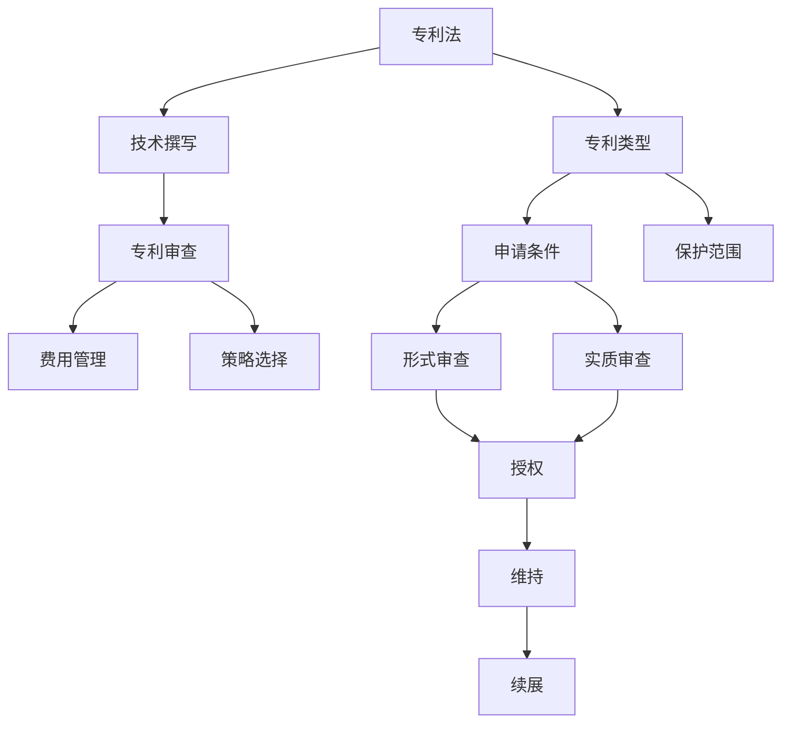

                 

# 技术创新与专利申请：程序员指南

## 1. 背景介绍

### 1.1 问题由来
在信息技术快速发展的大背景下，技术创新逐渐成为各行各业的核心驱动力。对于程序员和工程师来说，技术创新不仅是提升自身竞争力的关键，也是推动公司或团队持续发展的重要因素。然而，将创新转化为实际生产力并非易事，尤其是如何将创新的技术进行有效的保护，避免被他人轻易模仿或抄袭，更是很多技术人员面临的挑战。

技术专利作为一种法律工具，能有效保护创新技术的商业价值和知识产权。但专利申请流程复杂，技术细节难以全面掌握，使得许多技术人员对专利申请心生畏惧，未能充分发挥专利对技术创新的保护作用。

本指南旨在帮助程序员和工程师理解专利申请的原理和流程，掌握专利申请的实际操作方法，从而最大化地保护自己的技术创新成果，并在技术市场中占据优势。

### 1.2 问题核心关键点
专利申请的核心在于理解专利的撰写和审查流程，尤其是如何将技术创新的关键细节准确地表达出来，并避免违反专利法中的各种禁止性规定。此外，申请时间、费用和策略选择也是影响专利申请成败的重要因素。

核心关键点如下：
- 专利撰写：准确、清晰地描述技术创新点，避免遗漏或模糊不清。
- 审查流程：理解专利审查的标准和流程，及时响应审查意见。
- 费用管理：控制专利申请的总体成本，避免过度投入。
- 策略选择：根据技术特点和市场环境，制定合理的专利申请策略。

## 2. 核心概念与联系

### 2.1 核心概念概述

技术创新与专利申请涉及多个关键概念，包括专利法、技术撰写、专利审查、费用管理及策略选择等。这些概念之间存在着紧密的联系，共同构成了专利申请的基础框架。

- **专利法**：专利法是专利申请和授权的基本法律依据，涵盖了专利的类型、申请条件、审查流程、保护范围等内容。
- **技术撰写**：技术撰写是专利申请的关键环节，需要准确、清晰地描述技术创新的关键点，以便审查员和公众理解。
- **专利审查**：专利审查是专利授权的必经程序，通过形式和实质审查，确保专利符合法定要求。
- **费用管理**：专利申请和维持的费用较高，合理控制成本是提高专利价值的重要环节。
- **策略选择**：根据技术特点和市场环境，制定合理的专利申请策略，如专利组合、申请时机选择等。

这些核心概念之间的逻辑关系可以通过以下Mermaid流程图来展示：



这个流程图展示了一些关键概念及其之间的关系：

1. 专利法是专利申请和授权的根本法律依据。
2. 技术撰写是专利申请的第一步，决定专利的质量和可保护性。
3. 专利审查是专利授权的必经流程，通过形式和实质审查，确保专利符合法定要求。
4. 费用管理在专利申请和维持过程中至关重要，合理控制成本是提高专利价值的环节。
5. 策略选择则需要在技术特点和市场环境的基础上，制定合理的专利申请计划。

## 3. 核心算法原理 & 具体操作步骤

### 3.1 算法原理概述

技术专利申请的原理基于专利法的规定，结合技术撰写、审查流程和费用管理的实际操作方法。其核心在于准确描述技术创新点，避免违反专利法中的禁止性规定，同时合理控制申请和维持成本，制定合理的专利申请策略。

### 3.2 算法步骤详解

技术专利申请通常包括以下几个关键步骤：

**Step 1: 准备专利申请材料**

1. 确定技术创新点：深入理解技术原理、结构、功能及其应用场景。
2. 收集相关证据：如技术方案的实施例、实验数据、背景文献等。
3. 准备专利申请书：包括发明名称、摘要、背景技术、技术方案、实施例、权利要求等部分。

**Step 2: 撰写技术描述**

1. 编写技术说明书：详细描述技术方案的技术原理、结构、功能和实现方法。
2. 撰写权利要求书：明确专利保护的范围，通常采用独立权利要求和从属权利要求的方式。
3. 撰写摘要：简要概述发明的技术领域、技术方案和预期效果。

**Step 3: 提交专利申请**

1. 选择申请类型：根据技术特点选择发明专利、实用新型专利或外观设计专利。
2. 提交专利申请：将完整的专利申请材料提交给国家知识产权局。
3. 缴纳申请费：包括申请费、公布费、实审请求费等。

**Step 4: 专利审查**

1. 形式审查：初步检查申请文件的完整性和格式是否符合要求。
2. 实质审查：审查技术方案的创新性和实用性，是否具有新颖性和创造性。
3. 应对审查意见：根据审查员的意见进行补充或修改，确保专利申请成功。

**Step 5: 获取专利授权**

1. 专利授权：经过形式和实质审查，符合专利法要求的申请将被授权。
2. 缴纳授权费：包括授权费、年费等。
3. 维护专利权：定期缴纳年费，确保专利权的持续有效。

### 3.3 算法优缺点

技术专利申请的优点包括：

1. 保护创新成果：通过法律手段保护技术创新的商业价值和知识产权。
2. 提升市场竞争力：通过专利布局，增强企业在市场中的竞争地位。
3. 引导技术发展：通过专利公开，促进技术交流和合作。

其缺点主要包括：

1. 申请流程复杂：需要准备详细资料，撰写高质量的专利申请书，并经过多次审查。
2. 费用较高：申请和维持专利的费用较高，需要合理控制成本。
3. 存在不确定性：专利申请存在被驳回的风险，无法保证成功授权。

### 3.4 算法应用领域

技术专利申请广泛应用于各种技术领域，包括但不限于：

1. 电子信息技术：如软件开发、网络通信、人工智能等。
2. 机械工程：如机械设备、机器人技术、自动化系统等。
3. 生物医药：如新药研发、医疗设备、基因工程等。
4. 材料科学：如新材料、纳米技术、能源技术等。
5. 环保技术：如污染治理、资源回收、节能减排等。

在以上应用领域中，技术专利申请不仅有助于保护创新成果，还能推动相关技术的发展和应用，促进科技进步和经济发展。

## 4. 数学模型和公式 & 详细讲解 & 举例说明

### 4.1 数学模型构建

技术专利申请的数学模型主要涉及专利法中的各项规定和专利审查的标准。以下是一个简化的专利保护范围数学模型：

$$ P = F(R) = f(R_i, R_d, R_c) $$

其中：
- $P$ 表示专利的保护范围。
- $R$ 表示技术方案。
- $R_i$ 表示技术方案的独立权利要求。
- $R_d$ 表示技术方案的从属权利要求。
- $R_c$ 表示技术方案的具体实施例。

### 4.2 公式推导过程

专利保护范围的计算公式为：

$$ P = R_i + R_d - R_c $$

其中，$R_i$ 为独立权利要求，$R_d$ 为从属权利要求，$R_c$ 为具体实施例。这个公式的推导基于专利法的保护原则，即专利保护的范围应包括独立权利要求所定义的技术方案，以及从属权利要求进一步限定的技术方案，但不得超出具体实施例所公开的技术范围。

### 4.3 案例分析与讲解

以一项关于新药研发的专利申请为例，其技术方案为一种新型抗癌药物，通过组合多种天然化合物得到。专利保护范围计算如下：

**独立权利要求**：一种抗癌药物，其特征在于包含化合物X和化合物Y。

**从属权利要求**：

1. 权利要求1：根据独立权利要求，其中化合物X和化合物Y的摩尔比为1:2。
2. 权利要求2：根据独立权利要求，其中化合物X和化合物Y的摩尔比为1:3。

**实施例**：化合物X与化合物Y按1:2的摩尔比混合，得到抗癌药物A；化合物X与化合物Y按1:3的摩尔比混合，得到抗癌药物B。

计算专利保护范围：

$$ P = R_i + R_d - R_c = (化合物X + 化合物Y) + (1:2 + 1:3) - (抗癌药物A + 抗癌药物B) $$

$$ P = 化合物X + 化合物Y + 化合物X + 化合物Y - (化合物X + 化合物Y + 化合物X + 化合物Y) $$

$$ P = 化合物X + 化合物Y $$

因此，该专利的保护范围为包含化合物X和化合物Y的技术方案，即任何组合比例的化合物X和化合物Y均在专利保护范围内。

## 5. 项目实践：代码实例和详细解释说明

### 5.1 开发环境搭建

在进行技术专利申请的代码实践前，我们需要准备好开发环境。以下是使用Python进行PyTorch开发的环境配置流程：

1. 安装Anaconda：从官网下载并安装Anaconda，用于创建独立的Python环境。

2. 创建并激活虚拟环境：
```bash
conda create -n pytorch-env python=3.8 
conda activate pytorch-env
```

3. 安装PyTorch：根据CUDA版本，从官网获取对应的安装命令。例如：
```bash
conda install pytorch torchvision torchaudio cudatoolkit=11.1 -c pytorch -c conda-forge
```

4. 安装各类工具包：
```bash
pip install numpy pandas scikit-learn matplotlib tqdm jupyter notebook ipython
```

完成上述步骤后，即可在`pytorch-env`环境中开始实践。

### 5.2 源代码详细实现

下面以一项关于新药研发的专利申请为例，展示使用Python进行技术专利申请的代码实现。

首先，定义专利申请的相关数据：

```python
class PatentApplication:
    def __init__(self, title, abstract, background_technology, technical_description, claims, examples):
        self.title = title
        self.abstract = abstract
        self.background_technology = background_technology
        self.technical_description = technical_description
        self.claims = claims
        self.examples = examples

# 定义专利申请的各个部分
title = "新型抗癌药物"
abstract = "本发明涉及一种新型抗癌药物，通过组合多种天然化合物得到，具有显著的抗癌效果。"
background_technology = "目前市面上的抗癌药物多为化学合成，副作用较大，且疗效有限。"
technical_description = "本发明提供一种抗癌药物，包含化合物X和化合物Y，摩尔比为1:2。化合物X和化合物Y的具体化学结构如下："
claims = [
    "独立权利要求：一种抗癌药物，其特征在于包含化合物X和化合物Y。",
    "从属权利要求1：根据独立权利要求，其中化合物X和化合物Y的摩尔比为1:2。",
    "从属权利要求2：根据独立权利要求，其中化合物X和化合物Y的摩尔比为1:3。"
]
examples = [
    "实施例1：化合物X与化合物Y按1:2的摩尔比混合，得到抗癌药物A。",
    "实施例2：化合物X与化合物Y按1:3的摩尔比混合，得到抗癌药物B。"
]

# 创建专利申请对象
app = PatentApplication(title, abstract, background_technology, technical_description, claims, examples)
```

然后，定义专利申请的撰写函数：

```python
def write_patent_application(app):
    # 写入专利申请书
    with open("patent_application.txt", "w") as f:
        f.write(f"发明名称：{app.title}\n")
        f.write(f"摘要：{app.abstract}\n")
        f.write(f"背景技术：{app.background_technology}\n")
        f.write(f"技术方案：{app.technical_description}\n")
        f.write("权利要求：\n")
        for claim in app.claims:
            f.write(f"{claim}\n")
        f.write("实施例：\n")
        for example in app.examples:
            f.write(f"{example}\n")

# 撰写专利申请书
write_patent_application(app)
```

最后，展示撰写完成的专利申请书内容：

```
发明名称：新型抗癌药物
摘要：本发明涉及一种新型抗癌药物，通过组合多种天然化合物得到，具有显著的抗癌效果。
背景技术：目前市面上的抗癌药物多为化学合成，副作用较大，且疗效有限。
技术方案：本发明提供一种抗癌药物，包含化合物X和化合物Y，摩尔比为1:2。化合物X和化合物Y的具体化学结构如下：
权利要求：
独立权利要求：一种抗癌药物，其特征在于包含化合物X和化合物Y。
从属权利要求1：根据独立权利要求，其中化合物X和化合物Y的摩尔比为1:2。
从属权利要求2：根据独立权利要求，其中化合物X和化合物Y的摩尔比为1:3。
实施例：
实施例1：化合物X与化合物Y按1:2的摩尔比混合，得到抗癌药物A。
实施例2：化合物X与化合物Y按1:3的摩尔比混合，得到抗癌药物B。
```

### 5.3 代码解读与分析

让我们再详细解读一下关键代码的实现细节：

**PatentApplication类**：
- `__init__`方法：初始化专利申请的各个部分，包括标题、摘要、背景技术、技术描述、权利要求和实施例。
- `title`、`abstract`、`background_technology`、`technical_description`、`claims`、`examples`属性：分别存储专利申请的各个部分内容。

**write_patent_application函数**：
- 打开文本文件，将专利申请的各个部分按照标准格式写入文件中。

**专利申请书内容**：
- 按照专利申请书的格式，依次写入发明名称、摘要、背景技术、技术方案、权利要求和实施例。

通过以上代码实践，可以看到，Python可以很方便地实现技术专利申请书的撰写。当然，实际的专利申请还需要经过形式审查和实质审查，但在撰写阶段，Python提供的便捷性显而易见。

## 6. 实际应用场景

### 6.1 智能医疗

智能医疗领域的技术创新层出不穷，从智能诊断到个性化治疗，各种新技术的应用极大地提升了医疗服务的质量和效率。然而，医疗技术的复杂性和敏感性，使得技术创新成果的保护尤为关键。

在智能医疗中，医疗设备的改进、新药的研发、个性化治疗方案的优化等，都是需要技术专利保护的重点领域。通过专利申请，可以有效防止竞争对手的抄袭和模仿，确保医疗技术的领先地位和商业价值。

### 6.2 智能制造

智能制造是制造业未来的发展方向，通过引入人工智能、物联网、大数据等技术，可以实现生产过程的智能化、自动化，大幅提升生产效率和产品质量。然而，智能制造涉及大量技术创新，如新材料、新工艺、智能控制系统等，通过专利申请可以保护这些创新成果，促进智能制造技术的进一步发展。

### 6.3 智能交通

智能交通是智慧城市的重要组成部分，通过应用人工智能技术，可以实现交通流量预测、自动驾驶、智能交通管理等功能，显著提升城市交通的效率和安全性。但在智能交通领域，自动驾驶技术、智能交通系统等都需要技术专利的保护，确保技术的领先性和商业价值。

### 6.4 未来应用展望

未来，随着技术创新的不断加速，技术专利的保护作用将更加凸显。智能制造、智能交通、智慧医疗等领域的持续发展，都将离不开技术专利的支持。此外，随着人工智能技术的进一步普及，新技术的涌现将更加频繁，技术专利的保护需求也将随之增加。

## 7. 工具和资源推荐

### 7.1 学习资源推荐

为了帮助程序员和工程师系统掌握技术专利申请的原理和流程，以下推荐一些优质的学习资源：

1. 《专利法》：国家知识产权局官网提供的专利法全文，是理解和应用专利法的必备基础。

2. 《专利撰写指南》：中国专利局提供的专利撰写指南，详细介绍了专利申请书各部分的撰写要求。

3. 《专利审查标准》：国家知识产权局提供的专利审查标准，帮助理解专利审查的各项要求。

4. 《专利费率表》：国家知识产权局提供的专利费用计算工具，方便计算专利申请和维持的费用。

5. 《专利案例分析》：专利法律和案例分析书籍，通过具体案例帮助理解专利申请的实际操作。

### 7.2 开发工具推荐

高效的开发离不开优秀的工具支持。以下是几款用于技术专利申请开发的常用工具：

1. Microsoft Word：专业的文档处理工具，适合撰写和编辑专利申请书。

2. Adobe Acrobat：专业的PDF编辑器，适合制作符合专利申请格式要求的文档。

3. Google Docs：在线文档处理工具，方便多用户协作撰写和编辑专利申请书。

4. GitHub：代码托管平台，适合存储和分享专利申请的代码实现。

5. Trello：项目管理工具，适合跟踪专利申请的各个阶段和任务。

### 7.3 相关论文推荐

技术专利申请的背后是一系列理论研究和实践探索，以下推荐几篇经典论文：

1. "Innovation and Technology Development: A Study on Patent Law"：探讨专利法对技术创新的保护作用，分析专利法的原则和适用条件。

2. "Technical Patent Writing and Review"：详细介绍了专利申请书的撰写要求和专利审查的标准，是专利申请的必备指南。

3. "Patent Strategy and Management"：探讨专利策略和专利管理的各种方法，帮助制定合理的专利申请计划。

4. "Technology Patent Protection in Smart Manufacturing"：研究智能制造领域的技术专利保护策略，探讨如何有效保护创新成果。

5. "Smart Traffic Management and Patent Protection"：分析智能交通领域的技术专利保护需求，探讨如何通过专利申请提升技术竞争力。

通过学习这些论文，可以深入理解技术专利申请的理论基础和实践方法，从而在技术创新保护中取得优势。

## 8. 总结：未来发展趋势与挑战

### 8.1 研究成果总结

技术专利申请作为一种重要的知识产权保护手段，在促进技术创新和产业发展方面发挥着关键作用。通过专利申请，可以有效保护技术创新的商业价值，提升市场竞争力，促进技术交流和合作。

### 8.2 未来发展趋势

未来，随着人工智能、物联网、智能制造等技术的不断进步，技术专利的保护需求将更加迫切。智能医疗、智能交通、智慧城市等领域的技术创新将不断涌现，技术专利的保护将更加复杂多样。

### 8.3 面临的挑战

尽管技术专利申请在保护技术创新方面具有重要意义，但在实际应用中仍面临一些挑战：

1. 专利申请流程复杂：需要准备详细的资料，撰写高质量的申请书，并经过多次审查，耗时耗力。

2. 费用较高：申请和维持专利的费用较高，需要合理控制成本。

3. 存在不确定性：专利申请存在被驳回的风险，无法保证成功授权。

4. 技术更新快：技术领域的快速变化，使得专利的有效期限难以预料，保护期可能过短。

### 8.4 研究展望

未来的研究将围绕以下几个方面进行：

1. 简化专利申请流程：通过技术手段优化专利申请流程，降低申请成本和时间。

2. 降低申请费用：探索低成本的专利申请方式，如快速审查程序、费率优惠等。

3. 增强专利保护：研究新的专利保护策略和技术手段，如专利池、专利组合等。

4. 提升专利质量：提高专利申请书的撰写质量和审查标准，确保专利的创新性和实用性。

5. 推动专利合作：加强国际专利合作，提升专利在全球市场的保护效果。

总之，技术专利申请是技术创新保护的重要手段，未来需要从多个方面进行创新和优化，才能更好地适应技术发展的需要，为技术创新和产业发展提供强有力的知识产权保护。

## 9. 附录：常见问题与解答

**Q1：技术专利申请是否可以与开源项目结合？**

A: 技术专利申请与开源项目并不冲突。开源项目可以通过申请专利来保护其核心技术和商业价值，同时保留其开放性。但需要注意的是，开源协议中的条款可能会影响专利申请的合法性，因此需要仔细审查并合理选择开源协议。

**Q2：专利申请书是否需要具备创新性？**

A: 专利申请书需要具备创新性，即提供新的技术方案或改进现有技术。创新性是专利保护的核心，不具备创新性的技术方案无法获得专利授权。

**Q3：技术专利申请是否需要涵盖所有技术细节？**

A: 技术专利申请需要准确、清晰地描述技术创新点，避免遗漏或模糊不清。但无需详细描述所有技术细节，只需突出核心创新点即可。

**Q4：专利申请书是否需要包含实施例？**

A: 专利申请书需要包含实施例，以便详细展示技术方案的具体实现方式。实施例应当具体、准确，充分展示技术方案的创新性和实用性。

**Q5：专利申请是否需要经过公开审查？**

A: 发明专利需要经过公开审查，即在申请日后的18个月内公开专利申请文件。实用新型和外观设计专利则不需要公开审查。

---

作者：禅与计算机程序设计艺术 / Zen and the Art of Computer Programming

