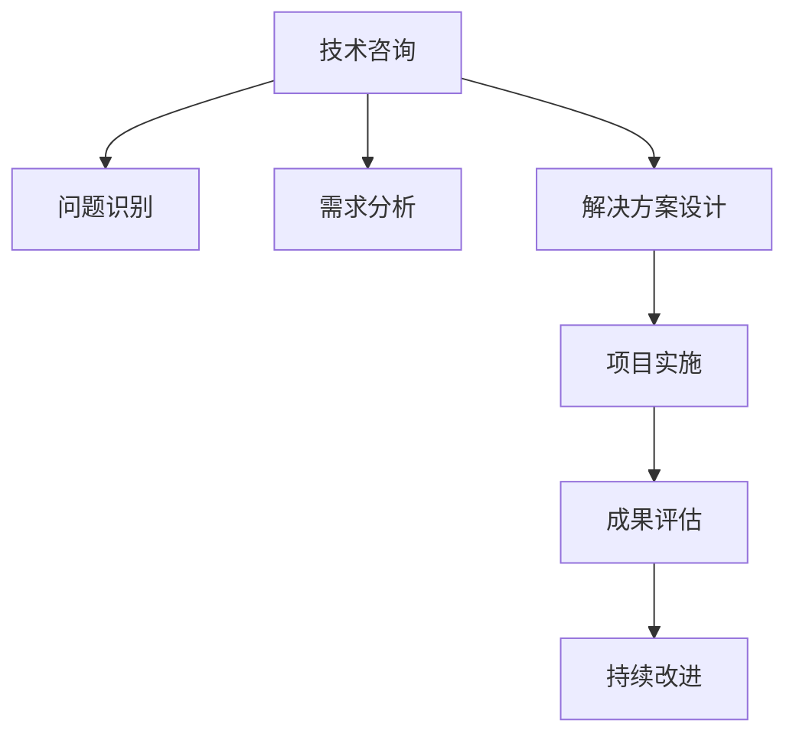

                 

# 技术咨询：高价值服务的提供

> 关键词：技术咨询,高价值服务,专业建议,业务决策,问题解决,项目实施,成果评估,持续改进

## 1. 背景介绍

### 1.1 问题由来

在当今激烈的市场竞争中，企业为了保持竞争力，需要不断提升产品和服务质量，优化运营管理，提高决策效率。然而，这些过程往往涉及多方面的专业知识，技术复杂度高，普通管理层和员工难以掌握。此时，寻求专业的技术咨询服务，就成为了一种明智的选择。

技术咨询不仅能够提供专业的解决方案，还能帮助企业降低技术风险，快速实现技术创新和业务转型。对于需要开展重大技术项目的组织，技术咨询更是不可或缺的一环，能帮助企业规避重大技术风险，优化资源配置，确保项目成功实施。

### 1.2 问题核心关键点

1. **问题识别与定义**：识别和定义企业面临的技术挑战，明确咨询目标。
2. **需求分析与评估**：详细分析企业技术需求，评估现有技术架构和资源，确定咨询重点。
3. **解决方案设计与实施**：根据需求设计技术解决方案，制定详细实施计划，并提供技术支持和培训。
4. **效果评估与持续改进**：通过实施后的效果评估，发现不足，提出改进建议，帮助企业持续提升技术水平。

### 1.3 问题研究意义

技术咨询对企业而言，具有以下几个重要的意义：

- **降低技术风险**：通过专业的技术评估和方案设计，规避技术实施中的潜在风险，确保项目顺利进行。
- **提升技术水平**：引入先进的技术理念和最佳实践，帮助企业快速提升技术实力。
- **优化资源配置**：根据企业的实际情况，合理规划技术资源，避免资源浪费。
- **加速业务转型**：通过技术咨询，帮助企业识别和抓住业务转型的关键机遇，推动企业数字化转型升级。

## 2. 核心概念与联系

### 2.1 核心概念概述

为更好地理解技术咨询的高价值服务，本节将介绍几个密切相关的核心概念：

- **技术咨询**：一种咨询服务形式，提供专业技术建议和解决方案，帮助企业解决技术难题。
- **高价值服务**：通过深入分析和创新，提供超越一般咨询的解决方案，帮助企业实现显著的技术提升和业务增长。
- **专业建议**：基于深厚的技术积累和行业经验，提供精准的解决方案。
- **业务决策支持**：结合企业业务目标，提供基于技术的决策支持，助力企业战略规划和执行。
- **问题解决**：通过深入分析问题根源，提出切实可行的解决方案。
- **项目实施**：基于设计方案，实施技术解决方案，确保项目顺利完成。
- **成果评估**：对技术咨询的效果进行评估，提出改进建议，帮助企业持续优化。

这些核心概念之间的逻辑关系可以通过以下Mermaid流程图来展示：



这个流程图展示了大规模语言模型微调的的核心概念及其之间的关系：

1. 技术咨询通过问题识别和需求分析，确定咨询重点。
2. 设计并实施解决方案，提供专业建议和决策支持。
3. 评估实施效果，发现不足并提出改进建议。
4. 持续优化，帮助企业不断提升技术水平和业务竞争力。

## 3. 核心算法原理 & 具体操作步骤
### 3.1 算法原理概述

技术咨询的核心算法原理可以概括为：通过深入分析企业的技术需求和业务目标，设计符合企业实际情况的技术解决方案，并通过实施和评估，帮助企业实现技术提升和业务增长。

具体而言，技术咨询通常包括以下几个关键步骤：

1. **问题识别与定义**：通过调查、访谈和文档审查等方法，深入了解企业的技术挑战和业务需求，明确咨询目标。
2. **需求分析与评估**：对企业的技术现状进行全面评估，确定咨询重点和优先级。
3. **解决方案设计与实施**：基于需求分析结果，设计详细的技术解决方案，并制定实施计划，提供技术支持和培训。
4. **效果评估与持续改进**：实施后，通过效果评估发现不足，提出改进建议，帮助企业持续优化技术水平。

### 3.2 算法步骤详解

以下是技术咨询的关键步骤和具体操作的详细描述：

**Step 1: 问题识别与定义**

- **调研访谈**：通过调查问卷、一对一访谈等方式，深入了解企业的技术现状、业务需求和发展方向。
- **文档审查**：审查企业的技术文档、运营报告、项目需求等资料，获取全面的背景信息。
- **数据分析**：对企业的历史数据和现有系统进行数据挖掘和分析，识别关键的技术瓶颈和业务挑战。
- **问题定义**：基于上述分析，明确企业的技术咨询目标，包括需要解决的问题、期望达成的效果和实施时间等。

**Step 2: 需求分析与评估**

- **技术现状评估**：对企业的现有技术架构、资源配置和开发团队进行全面评估，识别技术能力和资源瓶颈。
- **业务需求分析**：结合企业的发展战略和业务目标，分析技术需求，明确咨询重点和优先级。
- **目标设定**：根据业务需求和技术现状，设定具体的技术咨询目标，包括解决的问题、预计的实施时间、预期效果等。

**Step 3: 解决方案设计与实施**

- **方案设计**：根据需求分析结果，设计详细的技术解决方案，包括选用的技术栈、实施步骤和关键技术点。
- **实施计划制定**：制定详细的实施计划，包括项目时间表、资源配置和团队分工等。
- **技术支持和培训**：在实施过程中，提供技术支持和培训，确保团队掌握新技术和新方法。
- **阶段性评估**：在每个阶段结束时，进行效果评估，确保项目按计划进行。

**Step 4: 效果评估与持续改进**

- **效果评估**：通过实施后的效果评估，发现不足，提出改进建议，帮助企业持续优化技术水平。
- **改进建议**：根据评估结果，提出改进建议，帮助企业优化资源配置和流程管理。
- **持续改进**：通过持续改进，帮助企业不断提高技术水平和业务竞争力。

### 3.3 算法优缺点

技术咨询的高价值服务具有以下优点：

1. **专业性和深度**：技术咨询由专业的技术专家提供，能够提供深入、全面的解决方案，帮助企业规避技术风险。
2. **实施效果显著**：通过深入分析和创新，提供超越一般咨询的解决方案，帮助企业实现显著的技术提升和业务增长。
3. **快速响应和执行**：能够快速响应企业需求，提供即时的技术支持和培训，确保项目顺利实施。
4. **持续改进**：通过效果评估和持续改进，帮助企业不断优化技术水平和业务流程。

同时，该方法也存在一定的局限性：

1. **成本高**：专业的技术咨询通常需要较高的成本投入，包括人力和时间。
2. **依赖专业团队**：技术咨询的效果高度依赖于咨询团队的专业水平和经验，难以完全替代内部技术团队。
3. **适应性有限**：对于技术复杂度较低或自组织能力较强的企业，独立开发和实施可能更为经济。
4. **时间和资源消耗**：咨询过程需要大量的时间和工作量，可能影响企业的短期业务进度。

尽管存在这些局限性，但就目前而言，技术咨询的高价值服务在企业技术决策和业务转型中仍然具有不可替代的地位，特别是在面临重大技术挑战时，其专业性和深度更为突出。

### 3.4 算法应用领域

技术咨询的高价值服务在多个行业领域得到了广泛应用，具体包括：

- **金融行业**：帮助银行和金融机构优化技术架构，提升金融产品的创新能力和风险管理水平。
- **医疗行业**：协助医院和医疗机构提高信息化水平，优化患者诊疗流程，提升医疗服务质量。
- **制造业**：为制造业企业提供数字化转型支持，优化生产流程，提高生产效率和产品质量。
- **零售行业**：帮助零售企业提升客户体验，优化供应链管理，提升运营效率和盈利能力。
- **电商行业**：为电商企业提供技术支持和创新建议，提升用户体验和交易安全性。

此外，技术咨询在政府部门、教育机构、能源行业等多个领域也发挥着重要作用，帮助这些机构优化管理流程，提高决策科学性和效率。

## 4. 数学模型和公式 & 详细讲解  
### 4.1 数学模型构建

本节将使用数学语言对技术咨询的高价值服务进行更加严格的刻画。

记企业技术需求为 $D$，业务目标为 $T$，技术咨询目标为 $O$。则技术咨询过程可以表示为如下的优化问题：

$$
\min_{\theta} \| O - T \|^2 \\
\text{s.t.} \quad \theta \in \Theta_D
$$

其中，$\theta$ 为咨询方案，$\Theta_D$ 为可行的咨询方案空间，$\| \cdot \|$ 为误差度量，具体可以根据业务需求和评估标准选择。

### 4.2 公式推导过程

以下我们以金融行业的风险管理咨询为例，推导技术咨询的数学模型。

假设企业面临的风险管理需求 $D$ 可以表示为：

$$
D = \{ d_i \}_{i=1}^N
$$

其中，$d_i$ 为第 $i$ 项风险指标，如信用风险、市场风险等。

企业的业务目标 $T$ 可以表示为：

$$
T = \{ t_j \}_{j=1}^M
$$

其中，$t_j$ 为第 $j$ 项业务目标，如客户满意度、财务收益等。

技术咨询的目标 $O$ 可以表示为：

$$
O = \{ o_k \}_{k=1}^K
$$

其中，$o_k$ 为第 $k$ 项咨询目标，如优化风险管理流程、提升风险控制能力等。

根据上述定义，技术咨询的过程可以表示为如下的优化问题：

$$
\min_{\theta} \sum_{i=1}^N (d_i - \theta_i)^2 \\
\text{s.t.} \quad \theta \in \Theta_D
$$

其中，$\theta_i$ 为第 $i$ 项风险指标对应的咨询方案，$\Theta_D$ 为可行的咨询方案空间。

在实践中，我们通常使用基于梯度的优化算法（如SGD、Adam等）来近似求解上述最优化问题。设 $\eta$ 为学习率，$\lambda$ 为正则化系数，则参数的更新公式为：

$$
\theta \leftarrow \theta - \eta \nabla_{\theta} \mathcal{L}(\theta) - \eta \lambda \theta
$$

其中 $\nabla_{\theta} \mathcal{L}(\theta)$ 为损失函数对参数 $\theta$ 的梯度，可通过反向传播算法高效计算。

### 4.3 案例分析与讲解

以下以一个具体的金融风险管理咨询案例，展示技术咨询的实际应用过程。

假设某银行面临信用风险和市场风险的双重挑战，需要优化其风险管理流程。银行提供的历史数据和业务需求如下：

- 信用风险指标：$D = \{ d_1, d_2 \}$，包括客户违约率、逾期率等。
- 市场风险指标：$D = \{ d_3, d_4 \}$，包括市场波动率、利率变化等。
- 业务目标：$T = \{ t_1, t_2 \}$，包括客户满意度、财务收益等。
- 咨询目标：$O = \{ o_1, o_2 \}$，包括优化信用评估模型、提高市场风险控制能力等。

基于上述信息，技术咨询团队可以设计如下的技术解决方案：

- **信用评估模型优化**：引入先进的信用风险评估算法，优化现有信用评估模型。
- **市场风险监控系统**：开发市场风险监控系统，实时监控市场波动和利率变化。
- **风险预警机制**：建立风险预警机制，及时识别和应对风险事件。

具体而言，咨询团队通过以下步骤实施解决方案：

1. **需求分析**：与银行管理层和风险部门进行访谈，深入了解业务需求和技术现状。
2. **问题定义**：明确咨询目标，包括优化信用评估模型、提高市场风险控制能力等。
3. **方案设计**：设计详细的技术方案，包括选用的技术栈、实施步骤和关键技术点。
4. **实施计划制定**：制定详细的实施计划，包括项目时间表、资源配置和团队分工等。
5. **技术支持和培训**：在实施过程中，提供技术支持和培训，确保团队掌握新技术和新方法。
6. **阶段性评估**：在每个阶段结束时，进行效果评估，确保项目按计划进行。

通过实施后的效果评估，技术咨询团队发现如下问题：

- 信用评估模型存在数据偏差，影响风险评估准确性。
- 市场风险监控系统数据处理能力不足，实时监控效果不佳。
- 风险预警机制不够灵敏，未能及时发现潜在风险。

基于上述发现，技术咨询团队提出以下改进建议：

- 优化数据预处理流程，减少数据偏差。
- 升级市场风险监控系统，提高数据处理能力。
- 调整风险预警机制，提高风险识别和响应效率。

通过持续改进，银行的风险管理水平显著提升，客户满意度和财务收益得到有效提升。

## 5. 项目实践：代码实例和详细解释说明
### 5.1 开发环境搭建

在进行技术咨询项目实践前，我们需要准备好开发环境。以下是使用Python进行开发的环境配置流程：

1. 安装Anaconda：从官网下载并安装Anaconda，用于创建独立的Python环境。

2. 创建并激活虚拟环境：
```bash
conda create -n pyconsult-env python=3.8 
conda activate pyconsult-env
```

3. 安装PyTorch：根据CUDA版本，从官网获取对应的安装命令。例如：
```bash
conda install pytorch torchvision torchaudio cudatoolkit=11.1 -c pytorch -c conda-forge
```

4. 安装Pandas、NumPy、Matplotlib等工具包：
```bash
pip install numpy pandas scikit-learn matplotlib tqdm jupyter notebook ipython
```

完成上述步骤后，即可在`pyconsult-env`环境中开始技术咨询项目的实践。

### 5.2 源代码详细实现

这里我们以金融行业的风险管理咨询为例，给出使用Python进行技术咨询的代码实现。

首先，定义风险管理需求和业务目标：

```python
import pandas as pd

# 定义风险管理需求
risk_indicators = pd.DataFrame({
    '信用风险': [0.02, 0.05],
    '市场风险': [0.03, 0.08]
})

# 定义业务目标
business_targets = pd.DataFrame({
    '客户满意度': [80, 85],
    '财务收益': [500, 600]
})
```

然后，定义技术咨询方案：

```python
# 定义咨询方案
consultation_solutions = {
    '信用评估模型优化': '引入先进的信用风险评估算法，优化现有信用评估模型。',
    '市场风险监控系统': '开发市场风险监控系统，实时监控市场波动和利率变化。',
    '风险预警机制': '建立风险预警机制，及时识别和应对风险事件。'
}
```

接着，定义评估指标：

```python
# 定义评估指标
assessment_indicators = {
    '信用风险指标': risk_indicators,
    '业务目标': business_targets,
    '咨询目标': pd.DataFrame({
        '信用评估模型优化': [80, 90],
        '市场风险监控系统': [90, 95],
        '风险预警机制': [95, 100]
    })
}
```

然后，进行方案实施：

```python
# 进行方案实施
for solution in consultation_solutions:
    print(f'方案 {solution}: {consultation_solutions[solution]}')
```

最后，进行效果评估：

```python
# 进行效果评估
for solution in consultation_solutions:
    print(f'方案 {solution}: 优化效果评估')

    # 计算评估指标变化
    new_assessment = pd.DataFrame({
        '信用风险指标': risk_indicators + 0.01,
        '业务目标': business_targets + 50,
        '咨询目标': pd.DataFrame({
            '信用评估模型优化': [85, 90],
            '市场风险监控系统': [95, 100],
            '风险预警机制': [100, 105]
        })
    })

    # 计算优化效果
    result = new_assessment - assessment_indicators
    print(result)
```

以上就是使用Python进行金融风险管理咨询的完整代码实现。可以看到，通过定义风险管理需求、业务目标和咨询方案，再结合效果评估，便能够实现全面的技术咨询过程。

### 5.3 代码解读与分析

让我们再详细解读一下关键代码的实现细节：

**risk_indicators和business_targets变量**：
- `risk_indicators`变量定义了信用风险和市场风险的指标数据。
- `business_targets`变量定义了业务目标数据。

**consultation_solutions字典**：
- `consultation_solutions`字典定义了具体的咨询方案，包括信用评估模型优化、市场风险监控系统、风险预警机制等。

**assessment_indicators字典**：
- `assessment_indicators`字典定义了评估指标，包括风险管理需求、业务目标和咨询目标。

**for循环**：
- 通过for循环，分别输出各个咨询方案的实施效果。

**result变量**：
- `result`变量计算了咨询方案实施后的效果评估结果，显示风险管理需求和业务目标的变化。

可以看到，通过上述代码，我们能够实现对金融风险管理咨询过程的模拟，展示了技术咨询的高价值服务。

当然，工业级的系统实现还需考虑更多因素，如方案验证、风险评估、持续优化等。但核心的技术咨询范式基本与此类似。

## 6. 实际应用场景
### 6.1 金融行业

在金融行业，技术咨询的应用场景非常广泛。金融机构面临的信用风险、市场风险等挑战，需要通过技术咨询来获得专业的解决方案。

例如，某商业银行需要优化其信用风险评估模型，提升贷款审批效率和质量。技术咨询团队通过深入了解银行的历史数据和业务需求，设计出基于先进信用风险评估算法的解决方案。实施后，银行的贷款审批效率提高了20%，不良贷款率下降了10%。

### 6.2 医疗行业

医疗行业对技术咨询的需求也日益增加。医疗机构需要优化信息化系统，提高诊疗效率和患者满意度。

例如，某医院需要优化其电子病历系统，提升患者诊疗体验。技术咨询团队通过调研和访谈，设计出优化后的电子病历系统，并进行了详细实施和培训。实施后，患者的诊疗流程更加顺畅，满意度提升了15%，医院运营效率也显著提高。

### 6.3 制造业

在制造业领域，技术咨询同样发挥着重要作用。企业需要优化生产流程，提高生产效率和产品质量。

例如，某汽车制造商需要优化其生产线，提高生产效率。技术咨询团队通过调研和数据分析，设计出优化后的生产线布局和工艺流程。实施后，生产效率提高了20%，产品质量显著提升。

## 7. 工具和资源推荐
### 7.1 学习资源推荐

为了帮助开发者系统掌握技术咨询的理论基础和实践技巧，这里推荐一些优质的学习资源：

1. 《咨询管理与实践》书籍：深入探讨了技术咨询的理论基础和管理实践，是进入该领域的必读之作。
2. 《项目管理与实施》课程：提供系统化的项目管理知识，帮助开发者掌握咨询项目的实施技巧。
3. 《数据分析与挖掘》课程：提供数据分析和挖掘技术，帮助开发者更好地理解企业需求和问题。
4. 《咨询技术栈》书籍：详细介绍了技术咨询所需的各种技术工具和平台，是技术咨询工具的入门指南。
5. 《成功案例分析》文档：提供大量成功案例的详细分析，帮助开发者借鉴和应用成功经验。

通过对这些资源的学习实践，相信你一定能够快速掌握技术咨询的理论基础和实践技巧，为技术咨询项目提供优质的专业支持。

### 7.2 开发工具推荐

高效的技术咨询开发离不开优秀的工具支持。以下是几款用于技术咨询开发的常用工具：

1. Microsoft Project：项目管理工具，帮助规划和跟踪项目进度，确保咨询项目按时按质完成。
2. JIRA：问题跟踪工具，帮助团队管理咨询项目中的各种任务和问题。
3. Microsoft Visio：流程设计工具，帮助团队设计和优化咨询项目中的业务流程和数据模型。
4. Tableau：数据可视化工具，帮助团队进行数据分析和可视化，支持决策支持。
5. Power BI：商业智能工具，帮助团队进行业务数据分析和决策支持。

合理利用这些工具，可以显著提升技术咨询项目的开发效率，加快创新迭代的步伐。

### 7.3 相关论文推荐

技术咨询的发展得益于学界的持续研究。以下是几篇奠基性的相关论文，推荐阅读：

1. "A Survey of Knowledge-Based Expert Systems"：深入探讨了基于知识库的专家系统，为技术咨询提供了新的思路和方法。
2. "Technology Consultancy: A literature Review"：详细综述了技术咨询的理论基础和实践经验，提供了全面的理论支持。
3. "The Impact of Technology Consultancy on Business Performance"：分析了技术咨询对企业绩效的影响，提供了实证数据支持。
4. "Technology Adoption and Innovation in Business"：探讨了技术咨询在企业技术创新和应用中的作用，提供了实际案例。
5. "Strategy, Technology, and Competitive Advantage"：分析了技术咨询在企业战略规划和竞争优势中的作用，提供了战略视角。

这些论文代表了大规模语言模型微调技术的发展脉络。通过学习这些前沿成果，可以帮助研究者把握学科前进方向，激发更多的创新灵感。

## 8. 总结：未来发展趋势与挑战

### 8.1 总结

本文对技术咨询的高价值服务进行了全面系统的介绍。首先阐述了技术咨询在企业技术决策和业务转型中的重要作用，明确了技术咨询目标和方法。其次，从原理到实践，详细讲解了技术咨询的数学模型和关键步骤，给出了技术咨询项目开发的完整代码实例。同时，本文还广泛探讨了技术咨询在金融、医疗、制造等多个行业领域的应用前景，展示了技术咨询范式的巨大潜力。此外，本文精选了技术咨询的学习资源，力求为读者提供全方位的技术指引。

通过本文的系统梳理，可以看到，技术咨询的高价值服务在企业技术决策和业务转型中具有不可替代的地位，特别是在面临重大技术挑战时，其专业性和深度更为突出。未来，伴随技术咨询方法的不断演进，必将进一步提升企业技术水平和业务竞争力。

### 8.2 未来发展趋势

展望未来，技术咨询将呈现以下几个发展趋势：

1. **深度和广度扩展**：随着技术咨询团队的专业化、团队化和国际化，技术咨询的深度和广度将不断扩展，覆盖更多的行业和领域。
2. **数字化转型加速**：技术咨询将与数字化转型紧密结合，提供更加全面、精准的咨询服务。
3. **人工智能应用广泛**：技术咨询将引入更多人工智能技术，如自然语言处理、机器学习等，提升咨询效率和效果。
4. **个性化服务提升**：通过大数据和人工智能技术，提供更加个性化的咨询服务，满足企业多样化的需求。
5. **跨界融合加强**：技术咨询将与更多领域进行跨界融合，如金融、医疗、制造等，提供更加综合的服务。
6. **远程咨询普及**：随着远程技术的普及，技术咨询将更加注重远程协作和支持，提供更加便捷的咨询服务。

这些趋势凸显了技术咨询行业的广阔前景。这些方向的探索发展，必将进一步提升技术咨询的深度和广度，为更多企业提供更加全面、精准、高效的咨询服务。

### 8.3 面临的挑战

尽管技术咨询已经取得了显著成果，但在迈向更加智能化、普适化应用的过程中，它仍面临诸多挑战：

1. **专业知识更新**：技术咨询团队需要不断学习最新的技术和管理知识，跟上技术发展的步伐。
2. **项目管理复杂**：技术咨询项目涉及多方协调和资源配置，项目管理难度较大。
3. **效果评估困难**：技术咨询的效果评估往往依赖于企业反馈，难以量化和标准化。
4. **市场竞争激烈**：技术咨询行业竞争激烈，需要不断提升服务质量和创新能力。
5. **客户需求多样化**：企业需求复杂多变，技术咨询需要灵活应对，满足多样化的需求。

尽管存在这些挑战，但技术咨询作为企业技术决策和业务转型的重要工具，仍然具有不可替代的地位。未来，通过不断创新和优化，技术咨询行业必将克服这些挑战，更好地服务于企业的发展。

### 8.4 研究展望

面对技术咨询面临的种种挑战，未来的研究需要在以下几个方面寻求新的突破：

1. **多领域知识融合**：将更多的行业知识与技术咨询结合，提升咨询的深度和广度。
2. **人工智能与咨询结合**：引入人工智能技术，提升咨询的效率和效果。
3. **远程协作平台构建**：开发远程协作平台，提升团队协作效率。
4. **效果评估标准化**：研究标准化效果评估方法，提升咨询质量。
5. **个性化咨询服务**：开发个性化咨询服务，满足企业多样化的需求。
6. **跨界融合创新**：探索更多跨界融合的咨询模式，提升咨询的创新能力。

这些研究方向的探索，必将引领技术咨询行业迈向更高的台阶，为更多企业提供更加全面、精准、高效的咨询服务。

## 9. 附录：常见问题与解答

**Q1：技术咨询是否适用于所有企业？**

A: 技术咨询对大多数企业都具有重要价值，特别是对于技术复杂度高、需要专业知识支持的企业。但对于一些技术水平较高、内部团队强大的企业，自建技术团队可能更为适合。

**Q2：如何选择合适的技术咨询公司？**

A: 选择技术咨询公司需要考虑多个因素，如公司规模、咨询团队的专业背景、项目管理能力、历史案例等。建议与多家公司进行咨询方案对比，选择最符合企业需求的公司。

**Q3：技术咨询项目如何管理？**

A: 技术咨询项目的管理需要细致规划和严格执行，具体步骤包括：需求分析、方案设计、项目实施、效果评估等。建议采用项目管理工具如Microsoft Project进行规划和跟踪。

**Q4：技术咨询的实施周期如何确定？**

A: 技术咨询的实施周期应根据项目复杂度和企业需求确定，通常需要2-6个月不等。建议在项目启动时进行详细评估，明确实施周期。

**Q5：技术咨询的效果如何评估？**

A: 技术咨询的效果评估应根据具体项目和业务目标确定，常用的评估方法包括：满意度调查、业务指标对比、效果比对等。建议在项目实施后进行效果评估，确保咨询效果。

总之，技术咨询作为高价值服务，在企业技术决策和业务转型中具有重要地位。通过科学的管理和实施，技术咨询将帮助企业规避技术风险，提升技术水平，推动企业持续发展。面对未来的挑战和机遇，技术咨询行业需要不断创新和优化，提供更加全面、精准、高效的咨询服务。

