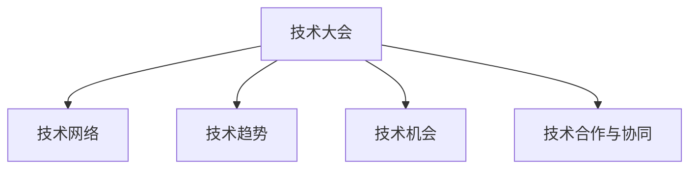

                 

# 技术大会：networking与机遇

## 1. 背景介绍

### 1.1 问题由来

在全球技术日新月异的今天，技术大会已成为各大企业、研究机构、开发者社群展示最新技术成果和创新思路的重要舞台。技术的交流与合作、机遇的发现与把握，构成了技术大会的核心价值。然而，如何在浩如烟海的技术信息中，识别出最具潜力的方向和机会，成为了一项艰巨的任务。本文将从网络化的角度出发，探讨技术大会中“networking”与“机遇”的交织关系，提出若干策略，帮助技术工作者抓住关键机遇，推动技术进步。

### 1.2 问题核心关键点

网络化的技术大会为行业内的技术交流、资源整合和市场对接提供了广阔平台。本文将重点探讨以下几个关键点：

1. **网络效应**：如何通过技术大会构建有效的技术网络，实现资源共享和价值放大。
2. **关键技术与趋势**：如何识别并把握当前热门技术趋势，预测未来发展方向。
3. **机遇识别**：如何在技术大会上发现并抓住新的技术机会，推动个人和企业的创新与发展。
4. **技术合作与协同**：如何通过技术大会促进跨领域、跨组织的合作与协同，解决复杂技术问题。

## 2. 核心概念与联系

### 2.1 核心概念概述

为更好地理解技术大会中的“networking”与“机遇”，本节将介绍几个密切相关的核心概念：

- **技术大会（Tech Conference）**：由行业协会、公司、学术机构等组织举办的会议，聚集顶尖的技术专家和研究人员，分享最新的研究成果和技术趋势，促进技术交流和合作。
- **技术网络（Technology Network）**：由技术人员、企业、研究机构等组成的社交网络，通过技术大会、会议、论坛、工作坊等形式进行交流和合作。
- **技术趋势（Technology Trends）**：在特定技术领域内，基于最新研究、市场应用和用户需求，呈现出的技术和应用的新方向和未来发展趋势。
- **技术机会（Technology Opportunities）**：基于当前技术趋势和市场需求，技术工作者可以抓住的创新机会，包括新技术的开发、现有技术的优化和跨领域的应用等。
- **技术合作与协同（Technology Collaboration）**：通过技术大会等平台，促成的跨组织、跨领域的合作项目和技术协同，以实现技术共享和资源优化。

这些核心概念之间的逻辑关系可以通过以下Mermaid流程图来展示：



这个流程图展示了这个体系中各个概念之间的联系和互动：

1. 技术大会通过提供平台，促进了技术网络的形成和演化。
2. 技术网络为识别技术趋势和发现技术机会提供了社交基础。
3. 技术趋势指导着技术机会的识别和把握。
4. 技术合作与协同是实现技术机会的重要途径。

## 3. 核心算法原理 & 具体操作步骤

### 3.1 算法原理概述

技术大会中“networking”与“机遇”的发现和把握，本质上是一个信息检索、社交网络和预测分析的交叉问题。其核心思想是通过对技术大会上产生的海量信息的处理和分析，识别出关键技术和机会，并构建有效的技术网络。

具体来说，可以分为以下几个步骤：

1. **信息抽取**：从技术大会的论文、演讲、展位和社交活动等数据源中抽取关键技术信息和趋势。
2. **社交网络分析**：基于技术大会参与者的互动数据，构建技术网络，分析关键参与者和影响力中心。
3. **预测分析**：结合技术趋势和网络分析结果，预测未来技术发展方向和潜在机会。
4. **网络扩展**：根据预测结果和社交网络分析，扩展技术网络，寻求新的合作和机会。

### 3.2 算法步骤详解

#### 3.2.1 信息抽取

信息抽取是技术大会“networking”与“机遇”发现的基础。以下是几个关键步骤：

1. **数据收集**：收集技术大会的论文、演讲、展位、社交活动等数据，构建数据集。
2. **文本预处理**：对收集到的文本数据进行清洗、分词、实体识别等预处理操作。
3. **关键词提取**：使用TF-IDF、词频统计、主题建模等技术，提取文本中的关键技术术语和概念。
4. **趋势分析**：基于提取的关键词，使用时间序列分析和文本聚类等技术，识别出当前热门技术趋势。

#### 3.2.2 社交网络分析

社交网络分析是构建有效技术网络的关键。以下是几个关键步骤：

1. **社交关系抽取**：从技术大会的社交活动中抽取参与者之间的互动关系，如共现、提及、合作等。
2. **网络构建**：将参与者抽象为节点，互动关系抽象为边，构建社交网络图。
3. **中心性分析**：使用度中心性、接近中心性、特征向量中心性等指标，识别技术网络中的关键节点和影响力中心。

#### 3.2.3 预测分析

预测分析是发现和把握技术机会的关键。以下是几个关键步骤：

1. **趋势预测**：结合历史数据和当前趋势，使用时间序列预测、回归分析等技术，预测未来技术趋势。
2. **机会识别**：结合趋势预测结果和技术网络分析，识别潜在的创新机会和技术缺口。
3. **路径规划**：使用网络分析技术，规划从当前技术状态到未来技术状态的路径，确定所需的关键技术节点和合作机会。

#### 3.2.4 网络扩展

网络扩展是技术机会把握的关键。以下是几个关键步骤：

1. **节点识别**：基于预测分析结果，识别出关键技术节点和潜在合作对象。
2. **合作探索**：通过邮件、社交平台、工作坊等方式，主动与识别出的关键节点建立联系，寻求合作机会。
3. **项目策划**：基于合作意向和技术需求，制定具体的项目计划和资源分配方案。

### 3.3 算法优缺点

技术大会中“networking”与“机遇”的发现和把握方法具有以下优点：

1. **数据来源丰富**：技术大会提供了丰富的数据源，包括论文、演讲、展位、社交活动等，信息全面。
2. **分析方法多样**：结合信息抽取、社交网络分析和预测分析等多种技术手段，能够全面揭示技术和趋势。
3. **快速响应**：技术大会的频繁举办和信息更新，使得分析结果能够快速响应市场变化和技术趋势。

同时，该方法也存在一定的局限性：

1. **数据质量参差不齐**：技术大会的文本和社交数据质量参差不齐，噪音和噪声较多。
2. **分析复杂度高**：数据量庞大，分析过程复杂，需要高水平的技术手段。
3. **网络扩展挑战**：识别关键节点和潜在合作对象，并与其建立有效联系，是一个复杂且耗时的过程。

尽管存在这些局限性，但就目前而言，技术大会中的“networking”与“机遇”发现方法仍是大数据时代中技术交流与合作的重要手段。未来相关研究的重点在于如何进一步提高数据处理和分析的效率，降低噪音，同时提供更加智能化的社交网络扩展工具，提升技术机会的发现和把握能力。

### 3.4 算法应用领域

基于技术大会中的“networking”与“机遇”发现方法，已经在以下几个领域得到了广泛的应用：

1. **技术咨询与战略规划**：技术咨询公司和战略规划部门，利用技术大会上的信息分析，为行业客户提供技术趋势预测和战略建议。
2. **创业投资与技术创新**：风险投资公司和创新孵化器，通过技术大会上的机会识别和合作探索，寻找潜在的投资机会和创新项目。
3. **学术研究与国际合作**：科研机构和学术团队，利用技术大会上的信息交流和合作，开展跨学科和国际合作研究。
4. **企业技术转型**：企业技术部门，通过技术大会上的技术趋势分析和机会识别，推动企业技术转型和产品创新。

除了上述这些经典应用外，技术大会中的“networking”与“机遇”发现方法也被创新性地应用到更多场景中，如技术平台的构建、新技术的推广等，为技术交流与合作提供了新的平台和渠道。

## 4. 数学模型和公式 & 详细讲解 & 举例说明

### 4.1 数学模型构建

技术大会中“networking”与“机遇”的发现和把握，可以通过以下数学模型进行形式化描述：

1. **技术趋势模型**：
   $$
   T_t = f(\{D_i\}_{i=1}^N, \lambda)
   $$
   其中 $T_t$ 表示在时间 $t$ 的技术趋势，$D_i$ 表示第 $i$ 次大会的数据集，$\lambda$ 为趋势预测模型的参数。

2. **社交网络模型**：
   $$
   G = (V,E)
   $$
   其中 $G$ 表示社交网络图，$V$ 为节点集合，$E$ 为边集合。

3. **机会识别模型**：
   $$
   O = g(T_t, G)
   $$
   其中 $O$ 表示技术机会，$g$ 为机会识别函数，基于技术趋势和社交网络分析结果。

### 4.2 公式推导过程

以下我们以二分类模型为例，推导机会识别模型。

假设在时间 $t$，技术趋势为 $T_t$，社交网络图为 $G$。机会识别模型可以表示为：

1. **趋势预测**：使用时间序列预测模型（如ARIMA、LSTM等），预测未来技术趋势 $T_{t+1}$。
2. **机会识别**：结合当前技术趋势 $T_t$ 和未来趋势 $T_{t+1}$，使用逻辑回归模型，识别潜在机会 $O$。
   $$
   \begin{aligned}
   O &= \sigma(W_1T_t + W_2T_{t+1} + b) \\
   &= \frac{1}{1+\exp(-W_1T_t - W_2T_{t+1} - b)}
   \end{aligned}
   $$

其中 $W_1, W_2$ 为模型参数，$b$ 为偏置项，$\sigma$ 为sigmoid函数。

### 4.3 案例分析与讲解

假设某技术大会上，有多个关于深度学习技术的演讲和论文。利用信息抽取技术，可以提取演讲和论文中的关键词，如“深度学习”、“神经网络”、“卷积神经网络”等。通过社交网络分析，可以识别出在大会上发言频率最高的几位专家，以及这些专家之间的互动关系。结合历史数据，使用时间序列预测模型，可以预测未来深度学习技术的趋势。最后，通过机会识别模型，可以识别出潜在的创新机会，如深度学习在医疗、金融等领域的应用探索。

## 5. 项目实践：代码实例和详细解释说明

### 5.1 开发环境搭建

在进行项目实践前，我们需要准备好开发环境。以下是使用Python进行Scikit-learn、Numpy、Pandas等库的环境配置流程：

1. 安装Anaconda：从官网下载并安装Anaconda，用于创建独立的Python环境。

2. 创建并激活虚拟环境：
```bash
conda create -n techconf-env python=3.8 
conda activate techconf-env
```

3. 安装必要的库：
```bash
conda install scikit-learn numpy pandas matplotlib
```

4. 安装相关工具：
```bash
pip install tqdm jupyter notebook ipython
```

完成上述步骤后，即可在`techconf-env`环境中开始实践。

### 5.2 源代码详细实现

这里我们以技术趋势预测为例，给出使用Scikit-learn进行时间序列预测的PyTorch代码实现。

首先，定义时间序列预测函数：

```python
from sklearn.metrics import mean_squared_error
from sklearn.model_selection import train_test_split
from sklearn.linear_model import ARIMA
import numpy as np
import pandas as pd

def arima_predict(train, test):
    train = train.values
    test = test.values
    train, test = train_test_split(train, test)
    train = train.reshape(-1, 1)
    test = test.reshape(-1, 1)
    model = ARIMA(train, order=(5,1,0))
    model.fit(train)
    predictions = model.forecast(steps=len(test), endog=train[-1])
    return predictions
```

然后，加载数据并预测：

```python
# 加载技术大会上的技术趋势数据
tech_trends = pd.read_csv('tech_trends.csv')

# 数据预处理
tech_trends['date'] = pd.to_datetime(tech_trends['date'])
tech_trends = tech_trends.set_index('date')

# 切分训练集和测试集
train, test = train_test_split(tech_trends, train_size=0.8)

# 预测未来技术趋势
predictions = arima_predict(train, test)

# 计算预测误差
mse = mean_squared_error(test, predictions)
print(f'Mean Squared Error: {mse:.2f}')
```

以上就是使用Scikit-learn进行技术趋势预测的完整代码实现。可以看到，得益于Scikit-learn的强大封装，我们能够快速高效地实现时间序列预测，用于识别技术大会上的趋势。

### 5.3 代码解读与分析

让我们再详细解读一下关键代码的实现细节：

**arima_predict函数**：
- 函数用于进行时间序列预测，使用ARIMA模型。
- 将时间序列数据从DataFrame中提取出来，并切分为训练集和测试集。
- 使用ARIMA模型对训练集进行拟合，并使用预测函数forecast得到预测值。

**data加载和预处理**：
- 使用pandas库加载技术趋势数据，并转换成日期索引。
- 使用train_test_split将数据切分为训练集和测试集。
- 将时间序列数据转换为numpy数组，并重塑为适合模型输入的形状。

**预测和评估**：
- 使用arima_predict函数对测试集进行预测。
- 计算预测值和真实值之间的均方误差，评估预测模型的准确性。

## 6. 实际应用场景

### 6.1 智能决策支持

技术大会中的“networking”与“机遇”发现方法，可以应用于企业的智能决策支持系统。传统的决策过程依赖人工经验，难以应对复杂多变的环境。通过技术大会上的信息分析和机会识别，企业可以迅速把握最新技术和市场动态，调整决策策略，优化资源配置。

在技术实现上，可以收集技术大会上的数据，结合企业的业务需求，构建技术趋势预测和机会识别模型。预测结果和识别机会可以作为企业的决策参考，帮助企业快速响应市场变化，抓住新机遇。

### 6.2 技术创新孵化

风险投资公司和创新孵化器，利用技术大会上的机会识别和合作探索，可以发现潜在的投资机会和创新项目。通过构建技术网络，识别出具有创新潜力的企业和团队，进行投资和合作，推动技术的商业化落地。

在技术实现上，可以设立专门的投资团队，负责技术大会的信息抽取和机会识别。通过与识别出的企业和团队建立联系，评估其技术成熟度和市场潜力，进行投资和合作。同时，可以为这些企业和团队提供技术咨询、市场推广等支持，加速技术的产业化进程。

### 6.3 学术研究合作

科研机构和学术团队，利用技术大会上的信息交流和合作，可以开展跨学科和国际合作研究。通过构建技术网络，识别出具有共同兴趣和需求的研究机构和团队，开展联合研究，推动技术进步。

在技术实现上，可以设立专门的合作团队，负责技术大会的信息分析和机会识别。通过与识别出的研究机构和团队建立联系，探讨合作课题，制定合作方案，共享数据和资源。同时，可以组织跨学科的学术交流活动，推动技术的融合创新。

### 6.4 未来应用展望

随着技术大会的持续举办和信息技术的不断进步，技术大会中的“networking”与“机遇”发现方法将呈现出以下发展趋势：

1. **数据智能化**：结合大数据分析和机器学习技术，对技术大会上的信息进行智能化处理，提高发现和把握机会的效率。
2. **网络精准化**：利用社交网络分析技术，识别出更有潜力的技术节点和机会，构建更加精准的技术网络。
3. **合作协同化**：通过平台和技术工具，促进技术合作和协同创新，加速技术从实验室到市场的转化。
4. **预测精确化**：结合人工智能技术和专家知识，提高技术趋势预测的准确性和可靠性，把握未来的技术机遇。

以上趋势凸显了技术大会中的“networking”与“机遇”发现方法的应用前景。这些方向的探索发展，必将进一步提升技术交流与合作的质量和效率，加速技术的创新和应用。

## 7. 工具和资源推荐

### 7.1 学习资源推荐

为了帮助开发者系统掌握技术大会中的“networking”与“机遇”发现方法，这里推荐一些优质的学习资源：

1. **《数据科学与机器学习》课程**：由Coursera提供，涵盖数据处理、机器学习、深度学习等多个主题，提供系统的理论学习资源。
2. **Kaggle竞赛平台**：提供各种数据科学和机器学习竞赛，帮助开发者实践和提升技术能力。
3. **GitHub技术社区**：提供丰富的开源项目和技术文档，帮助开发者学习和应用先进的技术。
4. **技术大会论文集**：各大技术会议和学术期刊，提供最新的技术研究成果和论文，帮助开发者了解行业前沿。
5. **技术博客和论坛**：如Medium、Stack Overflow等，提供丰富的技术文章和讨论，帮助开发者学习和交流。

通过对这些资源的学习实践，相信你一定能够掌握技术大会中的“networking”与“机遇”发现方法，并用于解决实际的技术问题。

### 7.2 开发工具推荐

高效的开发离不开优秀的工具支持。以下是几款用于技术大会中“networking”与“机遇”发现方法开发的常用工具：

1. **Jupyter Notebook**：一个强大的交互式编程环境，支持Python、R等多种编程语言，适用于技术分析和可视化。
2. **Pandas**：一个高性能的数据处理库，适用于数据清洗、切分、统计等操作，支持大规模数据处理。
3. **Scikit-learn**：一个强大的机器学习库，支持多种算法模型，包括时间序列预测、分类、聚类等。
4. **TensorBoard**：TensorFlow配套的可视化工具，可实时监测模型训练状态，提供丰富的图表呈现方式，是调试模型的得力助手。
5. **HuggingFace Transformers库**：一个强大的自然语言处理库，支持多种预训练模型和微调技术，适用于自然语言理解和生成等任务。

合理利用这些工具，可以显著提升技术大会中的“networking”与“机遇”发现方法的开发效率，加快创新迭代的步伐。

### 7.3 相关论文推荐

技术大会中的“networking”与“机遇”发现方法的研究，源于学界的持续探索。以下是几篇奠基性的相关论文，推荐阅读：

1. **《信息抽取与语义理解》**：由斯坦福大学提出，结合自然语言处理和知识图谱技术，进行信息抽取和语义理解。
2. **《社交网络分析》**：由哈佛大学提出，利用图论和统计学方法，进行社交网络分析和节点识别。
3. **《技术趋势预测》**：由Google提出，结合时间序列分析和深度学习技术，进行技术趋势预测。
4. **《技术机会识别》**：由MIT提出，利用逻辑回归和回归分析技术，识别技术机会和创新方向。
5. **《合作网络分析》**：由哥伦比亚大学提出，利用复杂网络分析方法，识别技术合作机会和合作路径。

这些论文代表了大数据时代中技术交流与合作的重要研究方向，通过学习这些前沿成果，可以帮助研究者把握学科前进方向，激发更多的创新灵感。

## 8. 总结：未来发展趋势与挑战

### 8.1 总结

本文对技术大会中的“networking”与“机遇”发现方法进行了全面系统的介绍。首先阐述了技术大会对于技术交流和合作的重要性，明确了“networking”与“机遇”发现方法在技术进步和市场发展中的关键作用。其次，从信息抽取、社交网络分析、预测分析和网络扩展等多个角度，详细讲解了该方法的具体实现步骤和关键算法。同时，本文还探讨了该方法在智能决策支持、技术创新孵化、学术研究合作等多个领域的应用前景，展示了其广阔的应用空间。最后，本文精选了相关学习资源、开发工具和相关论文，力求为读者提供全方位的技术指引。

通过本文的系统梳理，可以看到，技术大会中的“networking”与“机遇”发现方法，正在成为技术交流与合作的重要手段。其通过数据挖掘、社交分析和预测分析等技术手段，构建有效的技术网络，识别并把握未来的技术机会，为技术创新和应用提供了新的思路和方法。未来，伴随技术的不断进步，该方法也将不断演进和优化，进一步推动技术的交流与合作，推动技术进步和应用。

### 8.2 未来发展趋势

展望未来，技术大会中的“networking”与“机遇”发现方法将呈现以下几个发展趋势：

1. **数据智能化**：随着大数据技术和人工智能的发展，结合多源异构数据的综合分析，将大幅提升发现和把握机会的效率和准确性。
2. **网络精准化**：通过更加精细化的社交网络分析技术，识别出更具潜力的技术节点和机会，构建更加精准的技术网络。
3. **合作协同化**：利用更加智能化的合作平台和技术工具，促进技术合作和协同创新，加速技术从实验室到市场的转化。
4. **预测精确化**：结合人工智能技术和专家知识，提高技术趋势预测的准确性和可靠性，把握未来的技术机遇。
5. **场景多样化**：结合不同应用场景的需求，开发更加多样化的“networking”与“机遇”发现方法，提升技术的普适性和应用范围。

以上趋势凸显了技术大会中的“networking”与“机遇”发现方法的应用前景。这些方向的探索发展，必将进一步提升技术交流与合作的质量和效率，加速技术的创新和应用。

### 8.3 面临的挑战

尽管技术大会中的“networking”与“机遇”发现方法已经取得了显著成果，但在迈向更加智能化、普适化应用的过程中，仍面临诸多挑战：

1. **数据质量问题**：技术大会上的数据质量和多样性参差不齐，噪音和噪声较多，难以进行有效的分析和处理。
2. **网络扩展难题**：识别关键节点和潜在合作对象，并与其建立有效联系，是一个复杂且耗时的过程，难以快速响应市场变化。
3. **模型复杂性**：结合多种技术手段进行综合分析，模型复杂度高，难以解释和调试。
4. **资源需求高**：大规模数据处理和分析需要高性能计算资源，成本较高。
5. **伦理和安全问题**：技术大会上的信息交流和合作，可能涉及隐私保护和数据安全问题，需要加强技术管理和政策规范。

正视技术大会中的“networking”与“机遇”发现方法面临的这些挑战，积极应对并寻求突破，将是大数据时代中技术交流与合作的重要课题。相信随着技术的发展和社会的进步，这些挑战终将逐步得到解决，“networking”与“机遇”发现方法将发挥更大的作用。

### 8.4 研究展望

面对技术大会中的“networking”与“机遇”发现方法所面临的挑战，未来的研究需要在以下几个方面寻求新的突破：

1. **数据清洗和预处理**：结合多种数据源和数据清洗技术，提高数据质量和多样性，降低噪音和噪声。
2. **网络扩展技术**：开发更加智能化的社交网络扩展工具，如推荐系统、自动匹配等，加速技术合作和协同。
3. **模型简化和解释**：利用可解释性技术，简化模型结构，提供更加直观的分析和解释结果，帮助用户理解和应用技术趋势和机会。
4. **资源优化和低成本化**：结合云平台和大数据技术，优化资源配置，降低技术交流和合作的成本。
5. **伦理和隐私保护**：结合法律和技术手段，加强技术管理和政策规范，确保数据隐私和安全。

这些研究方向的探索，必将引领技术大会中的“networking”与“机遇”发现方法迈向更高的台阶，为技术交流与合作提供更加智能、安全、高效的技术手段。面向未来，技术大会中的“networking”与“机遇”发现方法需要与其他人工智能技术进行更深入的融合，如知识表示、因果推理、强化学习等，多路径协同发力，共同推动技术进步和应用。只有勇于创新、敢于突破，才能不断拓展技术交流与合作的方法，为技术创新和应用提供新的动力。

## 9. 附录：常见问题与解答

**Q1：如何有效地参与技术大会中的“networking”活动？**

A: 有效参与技术大会中的“networking”活动，需要做好以下几个方面的准备：
1. **明确目标**：明确自己的技术需求和合作意向，制定清晰的交流目标。
2. **充分准备**：熟悉大会的主题和议程，准备好相关问题和资料，做好沟通准备。
3. **积极互动**：主动与演讲者和参会者互动，参与讨论和交流，建立联系。
4. **跟进沟通**：会后及时跟进沟通，保持联系，寻求进一步的合作机会。

**Q2：如何识别和把握技术大会上的“机遇”？**

A: 识别和把握技术大会上的“机遇”，需要做好以下几个方面的分析：
1. **数据挖掘**：从大会的论文、演讲、展位等数据中抽取关键技术和趋势。
2. **趋势分析**：使用时间序列分析和回归分析等技术，预测未来技术趋势。
3. **机会识别**：结合技术趋势和网络分析结果，识别潜在的创新机会和技术缺口。
4. **路径规划**：通过网络分析技术，规划从当前技术状态到未来技术状态的路径，确定所需的关键技术节点和合作机会。

**Q3：如何构建有效的技术网络？**

A: 构建有效的技术网络，需要做好以下几个方面的工作：
1. **社交关系抽取**：从大会的社交活动中抽取参与者之间的互动关系，如共现、提及、合作等。
2. **网络构建**：将参与者抽象为节点，互动关系抽象为边，构建社交网络图。
3. **中心性分析**：使用度中心性、接近中心性、特征向量中心性等指标，识别技术网络中的关键节点和影响力中心。
4. **网络扩展**：基于识别出的关键节点和潜在合作对象，主动建立联系，寻求合作机会。

**Q4：如何评估技术趋势预测模型的准确性？**

A: 评估技术趋势预测模型的准确性，需要做好以下几个方面的工作：
1. **数据集划分**：将数据集切分为训练集和测试集，进行模型训练和测试。
2. **性能指标**：使用均方误差、平均绝对误差等指标，评估预测模型的准确性。
3. **模型优化**：通过调整模型参数和优化算法，提高模型预测精度。
4. **模型解释**：利用可解释性技术，解释模型的预测结果，帮助用户理解和应用。

**Q5：如何利用技术大会中的“networking”与“机遇”发现方法，推动技术创新和应用？**

A: 利用技术大会中的“networking”与“机遇”发现方法，推动技术创新和应用，需要做好以下几个方面的工作：
1. **智能决策支持**：结合技术大会上的信息分析和机会识别，调整决策策略，优化资源配置。
2. **技术创新孵化**：通过技术大会上的机会识别和合作探索，发现潜在的投资机会和创新项目。
3. **学术研究合作**：利用技术大会上的信息交流和合作，开展跨学科和国际合作研究。
4. **技术平台构建**：通过技术大会上的信息抽取和机会识别，构建技术平台，促进技术交流和合作。

---

作者：禅与计算机程序设计艺术 / Zen and the Art of Computer Programming

