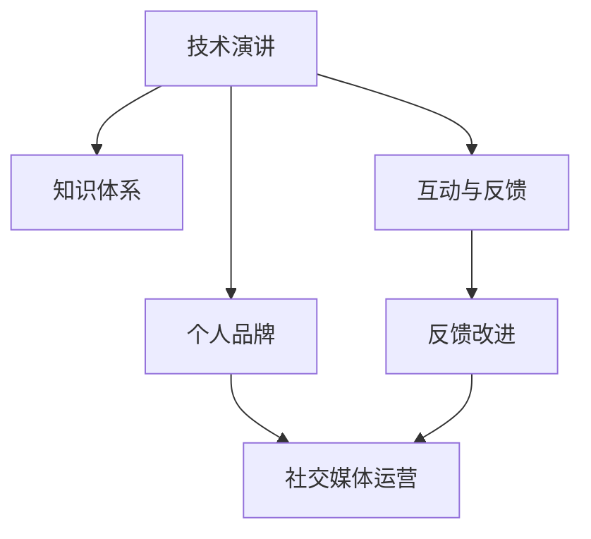

                 

# 技术演讲：从分享到个人IP打造

## 1. 背景介绍

### 1.1 问题由来
在当今信息爆炸的时代，技术分享已成为推动科技发展的关键因素。然而，技术的快速迭代和知识的分散性使得许多技术人员面临着如何将自己的技术见解和经验系统化、结构化，进而构建个人IP的挑战。本文将探讨如何通过有效的技术演讲，以及系统化分享策略，帮助技术专家打造个人IP，提升自身影响力。

### 1.2 问题核心关键点
技术分享和个人IP打造的核心在于如何将技术知识高效、系统地传达给听众，同时建立自己的技术品牌。核心点包括：

- **技术表达能力**：如何将复杂的算法、代码和概念用简单易懂的方式表达。
- **知识体系结构**：如何将零散的技术点整合为系统的知识体系。
- **互动与反馈**：如何通过互动环节提升听众的理解和兴趣，并在演讲后获取有效反馈。
- **个人品牌塑造**：如何将个人技术形象与演讲内容紧密结合，形成独特IP。

### 1.3 问题研究意义
成功构建个人IP不仅能提升技术专家的知名度和影响力，还能带来更多的职业机会和发展空间。本文将详细介绍技术分享和IP打造的原理与方法，帮助技术专家系统性地提升演讲技巧，构建个人技术品牌。

## 2. 核心概念与联系

### 2.1 核心概念概述

- **技术演讲**：以技术分享为目的的公开演讲，通常包括技术原理、应用场景、代码实现和个人经验。
- **知识体系**：由一系列相互关联的技术点构成的系统化知识结构，便于听众理解和记忆。
- **个人品牌**：通过持续的技术分享和社交媒体运营，形成的具有独特风格和影响力的个人技术形象。

- **互动与反馈**：在演讲过程中与听众互动，以及通过社交平台获取听众反馈，持续优化演讲内容。

通过这些核心概念，我们可以构建一个从技术演讲到个人IP打造的完整框架。

### 2.2 核心概念原理和架构的 Mermaid 流程图(Mermaid 流程节点中不要有括号、逗号等特殊字符)



这个流程图展示了技术演讲、知识体系、互动与反馈和个人品牌之间的关系。演讲的互动环节和听众反馈可以改进技术表达和知识体系，而社交媒体运营则有助于个人品牌的塑造。

## 3. 核心算法原理 & 具体操作步骤
### 3.1 算法原理概述

技术演讲的核心在于高效、系统地传达技术知识，同时与听众建立互动，获得反馈。其算法原理包括：

- **信息传递**：将复杂的算法和代码转化为易于理解的故事和实例，使用类比、比喻等手段。
- **知识结构**：将技术点系统化组织，从基础到高级，逐步深入。
- **互动设计**：通过问答、代码演示、小组讨论等方式，与听众互动，提升参与度。
- **反馈收集**：通过现场调查、社交媒体评论等方式，收集听众反馈，不断优化演讲内容。

### 3.2 算法步骤详解

1. **确定主题**：明确演讲主题和目标听众，选择适当的技术点进行讲解。
2. **构建知识框架**：将技术点系统化组织，分为基础知识、进阶技巧和实际应用等模块。
3. **设计互动环节**：根据知识框架设计互动环节，如代码演示、小组讨论等。
4. **收集反馈**：通过问卷调查、现场提问和社交媒体评论等途径收集听众反馈。
5. **改进演讲**：根据反馈调整知识结构和互动设计，不断优化演讲内容。
6. **品牌塑造**：通过持续的技术分享和社交媒体运营，逐步构建个人技术形象。

### 3.3 算法优缺点

技术演讲和知识分享的优点包括：

- **提升影响力**：通过分享技术知识，提升个人在行业内的知名度和影响力。
- **建立信任**：通过系统的知识结构和实用的技术内容，建立听众对演讲者的信任。
- **推动交流**：通过互动环节，促进技术交流和合作。

缺点则包括：

- **准备复杂**：构建知识体系和设计互动环节需要较长时间准备。
- **反馈周期长**：收集和分析听众反馈需要时间，改进效果较慢。

### 3.4 算法应用领域

技术演讲和知识分享的广泛应用领域包括：

- **技术大会**：如CVPR、NIPS等，展示最新研究成果和技术趋势。
- **技术博客**：通过系统化文章分享，积累个人技术影响力和知识体系。
- **社交媒体**：通过视频、文章等形式，持续分享技术见解，建立个人品牌。
- **企业内部**：向同事和合作伙伴分享技术经验，推动内部技术创新和合作。

## 4. 数学模型和公式 & 详细讲解 & 举例说明（备注：数学公式请使用latex格式，latex嵌入文中独立段落使用 $$，段落内使用 $)
### 4.1 数学模型构建

技术演讲的数学模型可以表示为：

$$
\text{技术演讲} = f(\text{技术点}, \text{听众群体}, \text{演讲时长}, \text{互动方式})
$$

其中，技术点（Technology Points）表示演讲涉及的技术内容，听众群体（Audience Groups）表示目标听众的特征，演讲时长（Presentation Duration）表示演讲的持续时间，互动方式（Interactive Methods）表示与听众互动的方式。

### 4.2 公式推导过程

假设我们有 $N$ 个技术点，每个技术点可以用 $p_i$ 表示，其中 $i \in [1, N]$。设听众群体为 $G$，演讲时长为 $T$，互动方式为 $M$。则技术演讲的数学模型可以表示为：

$$
\text{技术演讲} = f(p_1, p_2, ..., p_N, G, T, M)
$$

我们将每个技术点 $p_i$ 对听众群体 $G$ 的影响表示为 $I_i(G)$，互动方式 $M$ 对演讲效果的影响表示为 $M(T)$。则公式可以进一步表示为：

$$
\text{技术演讲} = \sum_{i=1}^{N} I_i(G) p_i + M(T)
$$

其中，$I_i(G)$ 表示技术点 $p_i$ 对听众群体 $G$ 的影响，$M(T)$ 表示互动方式 $M$ 对演讲效果的影响。

### 4.3 案例分析与讲解

假设我们有一个关于深度学习的技术演讲，包含以下技术点：

1. 神经网络基础
2. 卷积神经网络（CNN）
3. 循环神经网络（RNN）
4. 生成对抗网络（GAN）

设听众群体为技术开发者，演讲时长为60分钟。我们将每个技术点对听众的影响表示为 $I_i(G)$，互动方式 $M$ 对演讲效果的影响表示为 $M(T)$。

1. 神经网络基础：对所有听众群体都有较高影响，互动方式对演讲效果影响较小。
2. 卷积神经网络（CNN）：对技术开发者有较高影响，互动方式对演讲效果影响较大。
3. 循环神经网络（RNN）：对有一定深度学习基础的技术开发者有较高影响，互动方式对演讲效果影响较大。
4. 生成对抗网络（GAN）：对有一定研究基础的技术开发者有较高影响，互动方式对演讲效果影响较大。

## 5. 项目实践：代码实例和详细解释说明
### 5.1 开发环境搭建

为了进行技术演讲和知识分享，我们需要搭建一个合适的开发环境。

1. **选择平台**：选择适合的技术分享平台，如Zoom、Slideshare等。
2. **准备素材**：准备演讲稿、代码演示、视频等内容。
3. **技术工具**：使用文本编辑器、Markdown编辑器、代码高亮工具等，制作高质量的演讲内容。

### 5.2 源代码详细实现

以下是一个简单的技术分享示例，展示如何使用Python和Markdown编写技术演讲稿：

```python
# 技术演讲稿

## 标题
### 副标题

```python
# 代码示例
def function(x):
    return x * 2
```

```python
# 代码块
def function(x):
    return x * 2
```

## 细节
### 注意事项
- **代码高亮**：使用`gh_prism`或`highlight.js`等工具进行代码高亮，提升代码的可读性。
- **Markdown格式**：使用Markdown语法，方便生成PDF或HTML格式的内容。
- **演讲稿排版**：使用Markdown编辑器，如Typora、VS Code等，进行演讲稿的排版和预览。
- **视频演示**：录制技术分享视频，上传至YouTube、Bilibili等平台，方便听众回看和分享。

### 5.3 代码解读与分析

通过上述示例，我们可以看到：

- **标题和副标题**：使用Markdown的#符号表示标题层级，增强文档的层次感。
- **代码示例**：使用````python`包围代码块，进行代码高亮和格式化。
- **细节描述**：通过Markdown列表和文本格式，详细描述技术点和注意事项。

## 6. 实际应用场景
### 6.1 技术大会

技术大会在技术交流和知识分享中扮演重要角色。以下是一个技术大会的实例：

- **主题选择**：选择当前热门且具有深度的主题，如深度学习、人工智能等。
- **技术点选择**：根据大会主题，选择相关的技术点，如卷积神经网络、生成对抗网络等。
- **互动设计**：通过现场代码演示、互动问答等方式，增强听众参与度。
- **品牌推广**：通过大会发言、社交媒体宣传等方式，提升个人品牌影响力。

### 6.2 技术博客

技术博客是技术分享的重要渠道，以下是一个技术博客的实例：

- **主题选择**：选择个人擅长的技术领域，如机器学习、自然语言处理等。
- **内容创作**：系统化地撰写技术博客，涵盖基础知识、进阶技巧和实际应用等内容。
- **内容优化**：使用Markdown编辑器进行格式化和排版，生成高质量的内容。
- **社交分享**：通过社交媒体平台进行分享，提升博客曝光率。

### 6.3 社交媒体

社交媒体是个人品牌塑造的重要平台，以下是一个社交媒体的实例：

- **视频分享**：录制技术分享视频，上传至YouTube、Bilibili等平台。
- **文章分享**：撰写技术文章，分享在Medium、GitHub等平台。
- **互动交流**：通过评论区、私信等方式，与听众互动，获取反馈。
- **品牌建设**：持续分享技术内容，积累个人技术影响力。

### 6.4 未来应用展望

未来技术演讲和个人IP打造将更加注重：

- **跨领域融合**：将技术演讲与其他领域（如教育、设计等）结合，形成跨学科的知识体系。
- **实时互动**：利用WebAssembly、WebRTC等技术，实现实时互动和反馈收集。
- **多平台整合**：将技术分享内容整合至多个平台（如YouTube、TikTok等），提升曝光率。
- **个性化推荐**：利用推荐算法，个性化推荐技术内容和互动方式，提升用户体验。

## 7. 工具和资源推荐
### 7.1 学习资源推荐

- **《演讲的艺术》（The Art of Public Speaking）**：提升技术演讲的表达技巧。
- **《如何写作》（On Writing）**：提升技术写作和文档排版能力。
- **《社交媒体策略》（Social Media Marketing）**：提升社交媒体运营和品牌建设能力。
- **《内容营销》（Content Marketing）**：提升技术内容的创作和分享能力。
- **《数据可视化》（Data Visualization）**：提升技术内容的展示效果。

### 7.2 开发工具推荐

- **文本编辑器**：如Visual Studio Code、Sublime Text等，支持代码高亮和格式化。
- **Markdown编辑器**：如Typora、VS Code等，支持Markdown格式排版和预览。
- **代码高亮工具**：如gh_prism、highlight.js等，提升代码的可读性。
- **视频录制工具**：如OBS Studio、Adobe Premiere Pro等，制作高质量的视频内容。
- **社交媒体管理工具**：如Hootsuite、Buffer等，管理社交媒体发布和互动。

### 7.3 相关论文推荐

- **《技术演讲的艺术》（The Art of the Technical Talk）**：深入探讨技术演讲的表达技巧。
- **《内容创作的力量》（The Power of Content Creation）**：探讨技术内容的创作和分享策略。
- **《社交媒体营销的科学》（The Science of Social Media Marketing）**：探讨社交媒体平台的运营策略。
- **《数据可视化的艺术》（The Art of Data Visualization）**：探讨数据可视化技术的实现和应用。
- **《品牌建设的艺术》（The Art of Building a Brand）**：探讨个人品牌的构建和管理。

## 8. 总结：未来发展趋势与挑战

### 8.1 研究成果总结

技术演讲和个人IP打造是一个系统性的过程，涉及技术表达、知识体系、互动设计等多个方面。通过深入理解这些核心概念和算法原理，技术专家可以系统性地提升演讲技巧，构建个人技术品牌。

### 8.2 未来发展趋势

未来技术演讲和个人IP打造将呈现以下发展趋势：

- **跨领域融合**：将技术演讲与其他领域结合，形成跨学科的知识体系。
- **实时互动**：利用WebAssembly、WebRTC等技术，实现实时互动和反馈收集。
- **多平台整合**：将技术分享内容整合至多个平台，提升曝光率。
- **个性化推荐**：利用推荐算法，个性化推荐技术内容和互动方式。

### 8.3 面临的挑战

技术演讲和个人IP打造虽然前景广阔，但也面临以下挑战：

- **时间成本**：技术演讲和知识体系构建需要大量时间和精力。
- **互动设计**：设计互动环节需要创新思维和实践经验。
- **反馈收集**：及时收集和分析听众反馈，不断改进演讲内容。
- **品牌建设**：在社交媒体上建立和维护个人品牌需要持续的运营和管理。

### 8.4 研究展望

未来的技术演讲和个人IP打造研究，可以从以下几个方向进行：

- **创新表达方式**：探索新的技术表达方式，如AR、VR等，提升听众体验。
- **跨领域融合**：将技术演讲与其他领域（如教育、设计等）结合，形成跨学科的知识体系。
- **实时互动**：利用WebAssembly、WebRTC等技术，实现实时互动和反馈收集。
- **个性化推荐**：利用推荐算法，个性化推荐技术内容和互动方式。

## 9. 附录：常见问题与解答

**Q1：如何进行系统化的技术分享？**

A: 系统化的技术分享需要构建完整的知识体系，从基础到高级，逐步深入。例如，可以按如下结构进行分享：

1. **基础知识**：介绍技术的基本概念和原理。
2. **进阶技巧**：讲解技术的高级技巧和应用。
3. **实际案例**：通过实际案例展示技术的应用效果。
4. **未来趋势**：分享技术的发展趋势和未来方向。

**Q2：如何选择适合的技术点进行分享？**

A: 选择适合的技术点需要考虑以下因素：

1. **听众群体**：了解听众的技术水平和兴趣，选择适合的技术点。
2. **演讲时长**：根据演讲时长，选择恰当的技术点数量。
3. **技术热度**：选择当前热门且具有深度的主题，如深度学习、人工智能等。
4. **互动需求**：选择适合进行互动演示的技术点，如代码示例、现场演示等。

**Q3：如何进行互动设计？**

A: 互动设计可以通过以下方式实现：

1. **现场问答**：在演讲过程中设置问答环节，与听众互动。
2. **代码演示**：通过现场代码演示，展示技术实现的细节。
3. **小组讨论**：通过小组讨论，提升听众的参与度。
4. **实时投票**：利用投票工具，实时收集听众的反馈和意见。

**Q4：如何进行有效的反馈收集？**

A: 有效的反馈收集可以通过以下方式实现：

1. **现场调查**：在演讲结束时，通过问卷调查收集听众反馈。
2. **社交媒体评论**：通过社交媒体平台的评论功能，收集听众的反馈和意见。
3. **私信互动**：通过私信与听众互动，获取更深入的反馈。
4. **定期回访**：定期回访听众，收集后续的反馈和建议。

**Q5：如何进行品牌建设？**

A: 品牌建设需要持续的技术分享和社交媒体运营，以下是一个系统化的策略：

1. **技术文章**：定期撰写技术文章，分享个人技术见解和经验。
2. **视频分享**：录制技术分享视频，上传至YouTube、Bilibili等平台。
3. **社交媒体**：通过社交媒体平台进行分享，提升曝光率。
4. **互动交流**：通过评论区、私信等方式，与听众互动，获取反馈。

---

作者：禅与计算机程序设计艺术 / Zen and the Art of Computer Programming

