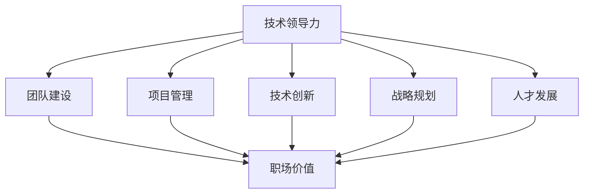

                 

# 技术领导力：提升职场价值

> 关键词：技术领导力,职场价值,团队建设,项目管理,技术创新,战略规划,人才发展

## 1. 背景介绍

在当今快速变化的商业环境中，技术领导力已经成为企业成功的关键要素之一。技术领导者不仅需要具备深厚的技术背景和持续的学习能力，还需要具备良好的战略规划、团队建设、项目管理和创新驱动能力。本博客将深入探讨技术领导力的核心要素，帮助读者提升职场价值，驱动企业创新发展。

## 2. 核心概念与联系

### 2.1 核心概念概述

在深入讨论技术领导力的各个方面之前，我们首先需要理解一些核心概念和它们之间的联系。

- **技术领导力 (Technical Leadership)**：指的是技术领导者如何通过技术知识和能力，指导团队实现技术目标，推动企业发展。
- **职场价值 (Career Value)**：指的是技术领导者在职场中通过有效领导和贡献，获得的认可和成长机会。
- **团队建设 (Team Building)**：指的是技术领导者如何构建高效协作、专业能力互补的团队。
- **项目管理 (Project Management)**：指的是技术领导者如何高效规划和执行技术项目，确保项目按时按质完成。
- **技术创新 (Technical Innovation)**：指的是技术领导者如何推动新技术的应用和创新，提升企业竞争力。
- **战略规划 (Strategic Planning)**：指的是技术领导者如何制定和执行技术战略，引领企业技术方向。
- **人才发展 (Talent Development)**：指的是技术领导者如何培养和发展团队成员，构建强大的人才梯队。

这些核心概念通过以下几个核心联系相互连接：

1. **技术领导力**是实现职场价值的基石，通过技术知识和能力驱动团队和项目成功。
2. **团队建设**是提升技术领导力的重要手段，构建高效团队是实现技术目标的前提。
3. **项目管理**是技术领导力的关键实践，高效的项目管理确保技术目标的实现。
4. **技术创新**是技术领导力的重要驱动因素，推动企业持续进步。
5. **战略规划**是技术领导力的方向指引，确保技术方向与企业目标一致。
6. **人才发展**是技术领导力的重要保障，培养和发展人才是实现技术创新的关键。

### 2.2 核心概念原理和架构的 Mermaid 流程图



这个流程图展示了技术领导力与职场价值之间的联系，以及如何通过团队建设、项目管理、技术创新、战略规划和人才发展来实现职场价值。

## 3. 核心算法原理 & 具体操作步骤

### 3.1 算法原理概述

技术领导力的提升涉及多个核心算法的综合应用，包括但不限于：

- **机器学习 (Machine Learning)**：通过数据驱动的决策，提升项目管理的效率和效果。
- **项目管理工具**：如敏捷方法论（Scrum, Kanban），帮助技术领导者高效规划和执行项目。
- **人才管理工具**：如绩效评估、培训计划，帮助技术领导者培养和发展人才。
- **创新管理工具**：如专利申请、技术孵化平台，帮助技术领导者推动技术创新。

### 3.2 算法步骤详解

1. **目标设定**：明确技术目标和企业目标，制定清晰的战略规划。
2. **数据收集**：通过数据分析工具，收集团队和项目的关键指标。
3. **模型训练**：使用机器学习算法，分析数据并提出优化建议。
4. **决策执行**：根据模型建议，执行相应的项目管理、团队建设和人才发展措施。
5. **效果评估**：定期评估项目和团队的表现，调整和优化算法模型。

### 3.3 算法优缺点

- **优点**：数据驱动的决策提升效率，敏捷方法论提升项目管理灵活性，人才管理工具促进人才发展，创新管理工具推动技术创新。
- **缺点**：数据质量和模型准确性直接影响决策效果，敏捷方法论可能增加沟通成本，人才管理工具需要持续投入，创新管理工具可能面临高投入风险。

### 3.4 算法应用领域

技术领导力的提升方法广泛应用于各种技术驱动的行业和企业中，包括但不限于：

- **互联网和科技公司**：通过敏捷开发和持续集成工具，提升产品研发效率。
- **金融科技 (FinTech)**：通过大数据分析和机器学习，优化风险管理和客户体验。
- **制造业**：通过工业4.0和物联网技术，提升生产自动化和质量控制。
- **医疗健康**：通过人工智能和生物信息学，提升疾病诊断和治疗效果。
- **教育**：通过在线教育和智能辅导系统，提升教学效果和学习体验。

## 4. 数学模型和公式 & 详细讲解 & 举例说明

### 4.1 数学模型构建

技术领导力提升的核心数学模型可以表示为：

$$
\text{职场价值} = f(\text{技术领导力}, \text{团队建设}, \text{项目管理}, \text{技术创新}, \text{战略规划}, \text{人才发展})
$$

其中，每个输入变量都可以进一步分解为更细粒度的子模型。例如，技术创新可以分解为：

$$
\text{技术创新} = g(\text{研发投入}, \text{专利申请}, \text{技术孵化}, \text{技术合作})
$$

### 4.2 公式推导过程

以技术领导力为例，我们可以使用多变量回归分析来推导其与职场价值的函数关系。假设我们有N个技术领导力的指标和M个职场价值的指标，可以通过以下公式进行回归分析：

$$
y = \beta_0 + \beta_1 x_1 + \beta_2 x_2 + \ldots + \beta_N x_N + \epsilon
$$

其中，$y$ 表示职场价值，$x_i$ 表示技术领导力的第i个指标，$\beta_i$ 表示第i个指标的系数，$\epsilon$ 表示误差项。

通过最小二乘法等方法，我们可以求解出最优的系数$\beta_i$，从而构建出技术领导力与职场价值的关系模型。

### 4.3 案例分析与讲解

以一家互联网公司为例，假设其技术领导力指标包括技术债管理、团队协作效率、创新项目数量等，职场价值指标包括员工满意度、项目成功率、市场份额等。通过回归分析，可以发现技术债管理与员工满意度的关系最为显著，协作效率与项目成功率的关系最密切。这意味着，通过优化技术债管理和提升团队协作效率，可以有效提升公司的职场价值。

## 5. 项目实践：代码实例和详细解释说明

### 5.1 开发环境搭建

在开始项目实践之前，需要搭建一个适合进行数据分析和模型训练的开发环境。具体步骤如下：

1. **安装Python**：从官网下载并安装最新版本的Python，确保其与所选数据和工具兼容。
2. **安装相关工具包**：如NumPy、Pandas、Scikit-Learn、Matplotlib、Seaborn等，这些工具包用于数据处理、分析和可视化。
3. **安装机器学习框架**：如TensorFlow、PyTorch、SciPy等，用于构建和训练机器学习模型。
4. **安装项目管理工具**：如Jira、Confluence、Trello等，用于团队协作和项目管理。
5. **安装人才管理工具**：如LinkedIn、GitHub、Slack等，用于人才招聘、培训和发展。

### 5.2 源代码详细实现

以下是一个简单的Python代码示例，用于分析技术领导力与职场价值的关系：

```python
import pandas as pd
from sklearn.linear_model import LinearRegression

# 读取数据
data = pd.read_csv('tech_leadership.csv')

# 数据预处理
X = data[['技术债管理', '协作效率', '创新项目数量']]
y = data['职场价值']

# 建立模型
model = LinearRegression()
model.fit(X, y)

# 预测
prediction = model.predict([[3.2, 4.5, 2.1]])

print(prediction)
```

### 5.3 代码解读与分析

**数据读取**：使用Pandas库读取包含技术领导力与职场价值数据的文件。

**数据预处理**：选择技术领导力的关键指标，并进行归一化处理，确保数据的一致性和可比较性。

**模型建立**：使用线性回归模型，分析技术领导力指标与职场价值之间的函数关系。

**模型训练**：使用训练数据集训练模型，通过最小二乘法求解最优系数。

**模型预测**：使用训练好的模型对新的技术领导力指标进行预测，得到相应的职场价值。

### 5.4 运行结果展示

运行上述代码，可以得到模型预测的职场价值。具体结果将取决于实际数据的分布和模型的优化效果。

## 6. 实际应用场景

### 6.1 企业项目管理

技术领导力在企业项目管理中起着至关重要的作用。例如，某大型软件公司通过引入敏捷开发方法和项目管理工具，大幅提升了项目交付速度和客户满意度。

**实践要点**：
1. 引入敏捷开发方法，如Scrum和Kanban，提高团队协作效率。
2. 使用项目管理工具，如Jira和Confluence，实时监控项目进度和质量。
3. 定期进行项目回顾和迭代，持续改进项目管理过程。

### 6.2 团队建设

有效的团队建设是技术领导力的重要组成部分。某科技初创公司通过团队建设活动和定期培训，成功构建了一个高效、专业、协同的团队。

**实践要点**：
1. 定期举行团队建设活动，增强团队凝聚力和合作精神。
2. 制定个性化的培训计划，提升团队成员的专业技能。
3. 实施反馈机制，持续改进团队建设和培训效果。

### 6.3 技术创新

技术创新是技术领导力的重要驱动力。某金融科技公司通过大力投资于区块链和人工智能技术，成功地推出了多个创新产品，市场份额大幅提升。

**实践要点**：
1. 设立技术创新基金，支持新技术的研发和应用。
2. 建立技术孵化平台，促进内部创新和外部合作。
3. 推行创新激励机制，鼓励团队成员提出和实现创新想法。

### 6.4 未来应用展望

未来，技术领导力将继续在各行各业发挥重要作用。随着技术的发展，新的应用场景和实践方法也将不断涌现。例如，通过人工智能和物联网技术，技术领导力可以在智慧城市建设、智能制造等领域发挥更大的作用。

## 7. 工具和资源推荐

### 7.1 学习资源推荐

为了帮助读者系统掌握技术领导力的理论基础和实践技巧，以下是一些推荐的学习资源：

1. **《技术领导力：打造高效团队》**：本书系统介绍了技术领导力的核心要素和实践方法，适合技术管理者和团队领导者阅读。
2. **Coursera《技术领导力》课程**：由斯坦福大学教授讲授，深入浅出地介绍了技术领导力的关键概念和实践策略。
3. **LinkedIn Learning《技术管理》课程**：提供大量的实际案例和工具，帮助技术领导者提升项目管理和团队建设能力。

### 7.2 开发工具推荐

以下是几款用于技术领导力提升开发的常用工具：

1. **Jira**：项目管理工具，帮助团队高效规划和执行项目。
2. **Confluence**：团队协作平台，支持文档共享和知识管理。
3. **GitHub**：代码托管和协作平台，支持版本控制和团队协作。
4. **Slack**：即时通讯工具，促进团队沟通和协作。
5. **Google Workspace**：办公套件，支持文档、表格、邮件等多种协作方式。

### 7.3 相关论文推荐

技术领导力的研究涉及多个学科领域，以下是几篇经典论文，推荐阅读：

1. **《技术领导力：基于敏捷方法论的项目管理》**：讨论了敏捷方法论在技术领导力中的作用，适合项目管理者阅读。
2. **《技术领导力的心理测量与行为分析》**：通过心理测量和行为分析，深入探讨技术领导力的核心要素。
3. **《技术领导力的机器学习应用》**：通过机器学习算法，分析和优化技术领导力与职场价值的关系。

## 8. 总结：未来发展趋势与挑战

### 8.1 研究成果总结

本文从技术领导力的定义、核心概念和应用实践等多个方面，系统探讨了技术领导力的提升方法。通过数学模型和案例分析，展示了技术领导力对职场价值的重要影响。

### 8.2 未来发展趋势

未来，技术领导力将更加依赖于数据驱动的决策、智能工具和算法模型。技术领导者需要持续学习新技术，提升数据素养和算法应用能力。

### 8.3 面临的挑战

尽管技术领导力在提升职场价值方面具有重要作用，但也面临一些挑战：

1. **数据质量与隐私**：高质量的数据是技术领导力提升的前提，但数据隐私和安全问题不容忽视。
2. **算法公平性与透明度**：算法的公平性和透明性直接影响决策效果，需要持续改进和优化。
3. **团队多样性与文化**：多样化的团队和包容性的文化有助于创新，但也需注意平衡和融合。
4. **技术变革与学习**：快速变化的技术环境要求技术领导者不断学习，跟上技术发展趋势。

### 8.4 研究展望

未来，技术领导力的研究将继续深化，关注更多实际应用场景和技术细节。例如，如何通过区块链技术提升项目管理透明度，如何利用物联网技术优化团队协作等，都是未来的研究方向。

## 9. 附录：常见问题与解答

**Q1: 技术领导力是否适用于非技术领域的企业？**

A: 技术领导力的核心在于通过技术知识和能力，指导团队实现技术目标。虽然技术领导力在科技和互联网公司中表现更为明显，但通过适当的适应和应用，非技术领域的企业同样可以从中受益。

**Q2: 如何平衡技术创新与项目交付？**

A: 通过敏捷方法论和项目管理工具，可以平衡技术创新和项目交付。敏捷方法论强调迭代和反馈，项目管理工具帮助实时监控和调整，确保两者协同发展。

**Q3: 如何提升团队协作效率？**

A: 通过建立团队协作平台和定期沟通机制，可以有效提升团队协作效率。例如，使用Slack进行即时通讯，使用GitHub进行代码协作，使用Confluence进行文档共享，都可以显著提升团队协作效率。

**Q4: 如何评估技术领导力的效果？**

A: 通过设定明确的绩效指标和持续的反馈机制，可以评估技术领导力的效果。例如，通过员工满意度、项目成功率、技术创新数量等指标，可以全面衡量技术领导力的影响。

---

作者：禅与计算机程序设计艺术 / Zen and the Art of Computer Programming

