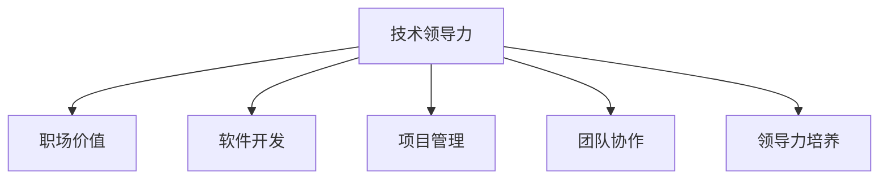

                 

# 技术领导力：提升职场价值

> 关键词：技术领导力,职场价值,软件开发,项目管理,团队协作,领导力培养

## 1. 背景介绍

### 1.1 问题由来
在快速变化的信息时代，技术正在以令人惊叹的速度改变我们的工作方式和生活方式。技术人才不仅需要掌握前沿的技术知识，更需要在工作中展现出卓越的领导力，驱动团队、项目的成功。然而，在许多公司和组织中，技术人员往往只关注于技术问题本身，而忽视了领导力这一关键因素。

### 1.2 问题核心关键点
技术领导力，是指技术人员在项目、团队中展现出组织、协调、激励、决策等方面的能力，从而推动技术和业务共同发展。它不仅关系到个人的职业发展，也影响着团队的效率、项目的成败以及公司的竞争力。提升技术领导力，能够使技术人员在职场中脱颖而出，成为不可或缺的领袖。

### 1.3 问题研究意义
在技术驱动的今天，掌握技术领导力对于技术人员来说至关重要。它不仅能够提升个人的职业价值，还能够在团队中形成正向影响力，推动组织的整体进步。本文将详细探讨技术领导力的核心概念、提升策略以及其在职场中的具体应用，帮助技术人员从技术专家成长为技术领导者。

## 2. 核心概念与联系

### 2.1 核心概念概述

为了更好地理解技术领导力及其在职场中的作用，我们首先介绍几个关键概念：

- **技术领导力（Technical Leadership）**：技术人员在项目或团队中展现出的组织、协调、激励、决策等能力，推动技术和业务共同发展。

- **职场价值（Career Value）**：技术人才在职场中的综合价值，包括技术能力、领导力、团队协作能力、沟通能力等多方面。

- **软件开发（Software Development）**：通过编程语言和工具，设计和实现软件系统的过程，涉及需求分析、设计、编码、测试、部署等环节。

- **项目管理（Project Management）**：通过计划、组织、协调、控制等手段，确保项目目标的实现。

- **团队协作（Team Collaboration）**：多个人员共同完成项目，通过有效沟通、分工合作、资源共享等方式提升团队效率。

- **领导力培养（Leadership Development）**：通过系统化培训、实践经验积累等方式提升个人领导力。

这些核心概念之间的逻辑关系可以通过以下Mermaid流程图来展示：



这个流程图展示了技术领导力如何通过影响职场价值，推动软件开发、项目管理、团队协作和领导力培养的各个方面，进而提升整个团队的绩效。

## 3. 核心算法原理 & 具体操作步骤
### 3.1 算法原理概述

技术领导力的提升，实际上是一个系统化的过程，涉及到多个方面。本文将从理论到实践，详细讲解技术领导力的提升策略，并通过具体步骤来指导实际操作。

### 3.2 算法步骤详解

提升技术领导力的过程可以分解为以下几个关键步骤：

1. **自我评估**：通过问卷调查、360度反馈等方式，了解自身在技术、团队协作、领导力等方面的优劣势。

2. **目标设定**：明确提升领导力的具体目标，如提升团队协作能力、提高项目管理效率、改善领导决策等。

3. **学习培训**：参加相关领导力培训课程，学习领导力理论和实践技巧。可以通过线上平台、培训课程、书籍等多种方式进行学习。

4. **实践应用**：在实际工作中应用所学知识和技巧，如主动承担项目领导角色、引导团队讨论决策、优化项目流程等。

5. **反馈调整**：定期收集团队和上级反馈，分析领导力提升的效果，及时调整优化策略。

### 3.3 算法优缺点

提升技术领导力的过程中，有以下优点和缺点：

**优点**：

- **增强团队凝聚力**：有效的领导力能够提升团队的凝聚力和协作效率。
- **提高项目成功率**：优秀的项目领导者能够确保项目按时交付，并达到预期目标。
- **提升个人职业价值**：具备领导力的技术人员能够更快地晋升和获得更多的职业发展机会。

**缺点**：

- **时间和精力投入大**：提升领导力需要持续的学习和实践，可能会占用大量时间和精力。
- **效果难以量化**：领导力的提升往往难以通过具体数据衡量，需要更多主观评估。

### 3.4 算法应用领域

技术领导力提升策略适用于各种技术和业务场景，包括但不限于以下领域：

- **软件开发团队**：技术领导者能够确保项目的顺利推进，提升团队的生产力。
- **产品开发团队**：通过有效的项目管理，确保产品按时上线，满足客户需求。
- **技术架构师**：在技术选型、架构设计等方面发挥领导作用，推动技术创新和应用。
- **技术支持团队**：通过提升团队协作和问题解决能力，提升客户满意度。

## 4. 数学模型和公式 & 详细讲解 & 举例说明

### 4.1 数学模型构建

为了更好地理解技术领导力的提升过程，我们可以构建一个简化的数学模型。假设领导力提升的效果可以用一个正向增长的函数 $L(t)$ 表示，其中 $t$ 表示时间（以月为单位），$L(t)$ 表示在 $t$ 个月后的领导力水平。

模型假设：

1. 初始领导力水平为 $L_0$。
2. 每月领导力提升的速度为 $v$。
3. $L(t)$ 在 $t$ 个月后的值为：
   $$
   L(t) = L_0 + vt
   $$

### 4.2 公式推导过程

根据上述假设，我们可以推导出领导力提升的公式。通过设置不同的 $v$ 值，可以计算出在不同时间段内领导力提升的具体效果。例如，如果 $v=0.1$，则表示每月领导力提升10%。

设 $t=6$ 个月，$L_0=50$，$v=0.1$，则领导力提升的计算如下：
$$
L(6) = 50 + 0.1 \times 6 = 56
$$

这意味着在6个月内，领导力提升了6%。

### 4.3 案例分析与讲解

假设某技术团队在开始时领导力水平为50，每月提升速度为0.1。通过6个月的提升，领导力水平达到了56。这表明，通过持续的培训和学习，团队的领导力可以得到显著提升。

## 5. 项目实践：代码实例和详细解释说明

### 5.1 开发环境搭建

在进行领导力提升的实践前，我们需要准备好开发环境。以下是使用Python进行实践的环境配置流程：

1. 安装Anaconda：从官网下载并安装Anaconda，用于创建独立的Python环境。

2. 创建并激活虚拟环境：
```bash
conda create -n leadership-env python=3.8 
conda activate leadership-env
```

3. 安装PyTorch：根据CUDA版本，从官网获取对应的安装命令。例如：
```bash
conda install pytorch torchvision torchaudio cudatoolkit=11.1 -c pytorch -c conda-forge
```

4. 安装TensorBoard：用于可视化训练过程。

5. 安装Pandas：用于数据处理。

完成上述步骤后，即可在`leadership-env`环境中进行领导力提升的实践。

### 5.2 源代码详细实现

这里我们以技术领导力提升模型为例，给出Python代码实现。

```python
import pandas as pd

# 初始领导力水平和每月提升速度
L0 = 50
v = 0.1

# 时间（以月为单位）
t = 6

# 领导力提升的计算
L = L0 + v * t

print(f"在6个月内，领导力提升了{v * t}%，达到{L}")
```

### 5.3 代码解读与分析

**代码实现**：
- 通过定义变量 `L0`、`v` 和 `t`，表示初始领导力水平、每月提升速度和时间。
- 使用公式计算领导力提升的值 `L`。
- 最后输出提升结果。

**代码解读**：
- `L0` 表示初始领导力水平，设置为50。
- `v` 表示每月领导力提升的速度，设置为0.1，即每月提升10%。
- `t` 表示时间，设置为6个月。
- 通过计算 `L = L0 + v * t`，得到领导力提升的结果。

## 6. 实际应用场景

### 6.1 软件开发团队

在软件开发团队中，技术领导者能够通过以下方式提升领导力：

- **需求分析**：组织团队成员进行需求讨论，明确项目目标和优先级。
- **技术选型**：引导团队选择最适合项目的技术栈和框架。
- **代码评审**：定期进行代码评审，确保代码质量。
- **问题解决**：主动解决团队成员在项目中遇到的技术难题。

### 6.2 产品开发团队

技术领导者通过有效的项目管理，能够确保产品按时上线，满足客户需求。具体方法包括：

- **制定计划**：制定详细的项目计划，明确每个阶段的任务和时间节点。
- **资源调配**：合理调配团队资源，确保项目高效推进。
- **风险管理**：识别潜在风险，制定应对策略，减少项目延期。
- **质量控制**：定期进行代码审查和功能测试，确保产品质量。

### 6.3 技术架构师

技术架构师在技术选型、架构设计等方面发挥领导作用，推动技术创新和应用。具体方法包括：

- **技术调研**：调研最新的技术趋势和行业标准，提出技术选型建议。
- **架构设计**：设计合理的技术架构，确保系统的可扩展性和可维护性。
- **技术评估**：评估新技术的可行性和风险，制定实施计划。
- **技术推广**：推广新技术的应用，提升团队的技术水平。

### 6.4 技术支持团队

通过提升团队协作和问题解决能力，技术支持团队能够提升客户满意度。具体方法包括：

- **沟通协调**：加强与客户和团队的沟通，确保信息畅通。
- **问题解决**：快速响应客户问题，提供有效的解决方案。
- **知识共享**：建立知识库，记录和共享问题解决方法。
- **技能培训**：定期进行技能培训，提升团队整体能力。

### 6.5 未来应用展望

随着技术领导力的不断提升，未来将会在更多领域得到应用，为技术人才带来新的机遇和挑战。

在智慧医疗领域，技术领导者能够推动医疗系统的智能化发展，提升医疗服务的质量。在智能制造领域，通过技术领导力的提升，能够优化生产流程，提高生产效率。在智慧城市建设中，技术领导者能够推动城市治理的智能化水平，提升城市管理能力。

## 7. 工具和资源推荐

### 7.1 学习资源推荐

为了帮助开发者系统掌握技术领导力的理论基础和实践技巧，这里推荐一些优质的学习资源：

1. **《技术领导力》系列书籍**：系统介绍了技术领导力的理论基础和实践技巧，涵盖项目管理、团队协作、沟通技巧等多个方面。

2. **Coursera《技术领导力》课程**：由知名大学开设的在线课程，提供系统的领导力培训，帮助技术人员提升领导能力。

3. **TED Talks《领导力》**：包含多个关于领导力的演讲视频，涵盖不同领域和背景的领导者经验和观点。

4. **《技术领导力手册》**：系统总结了技术领导力的关键要素和实践策略，是提升领导力的重要参考。

5. **LinkedIn Learning《领导力》**：提供丰富的领导力培训视频和课程，涵盖多种技能和领域。

通过对这些资源的学习实践，相信你一定能够快速掌握技术领导力的精髓，并用于解决实际的领导力问题。

### 7.2 开发工具推荐

高效的开发离不开优秀的工具支持。以下是几款用于技术领导力提升开发的常用工具：

1. **Microsoft Project**：项目管理工具，帮助制定详细的项目计划，跟踪进度和资源。

2. **JIRA**：项目管理平台，支持任务分配、跟踪和协作。

3. **Slack**：团队沟通工具，支持实时消息和文件共享。

4. **Zoom**：视频会议工具，支持远程沟通和协作。

5. **GitHub**：代码版本控制工具，支持代码协作和版本管理。

6. **Google Docs**：在线文档工具，支持团队协作和文件共享。

合理利用这些工具，可以显著提升技术领导力提升任务的开发效率，加快创新迭代的步伐。

### 7.3 相关论文推荐

技术领导力的研究源于学界的持续研究。以下是几篇奠基性的相关论文，推荐阅读：

1. **《技术领导力：一个多维度的综合模型》**：提出了技术领导力的多维度模型，涵盖技术技能、沟通技能、团队协作等多个方面。

2. **《技术领导者与创新：实证研究》**：通过实证研究，探讨了技术领导者对团队创新能力的影响。

3. **《领导力提升：理论与实践》**：系统总结了领导力提升的理论和实践方法，提供了具体的培训和实践案例。

4. **《技术领导力的测量和评估》**：提出了一套技术领导力的评估指标和测量方法，帮助企业和组织评估领导力水平。

5. **《技术领导者与管理者的角色冲突》**：探讨了技术领导者在项目管理中面临的角色冲突和应对策略。

这些论文代表了大领导力提升技术的发展脉络。通过学习这些前沿成果，可以帮助研究者把握学科前进方向，激发更多的创新灵感。

## 8. 总结：未来发展趋势与挑战

### 8.1 总结

本文对技术领导力的提升进行了全面系统的介绍。首先阐述了技术领导力在职场中的重要性，明确了提升领导力的具体策略和方法。其次，从理论到实践，详细讲解了技术领导力的提升策略，给出了具体的步骤和方法。同时，本文还广泛探讨了技术领导力在各种职场应用中的具体应用，展示了领导力提升的广阔前景。

通过本文的系统梳理，可以看到，技术领导力提升是一个系统化的过程，需要从多个维度进行全面提升。唯有系统化的培训和学习，持续的实践和反馈，才能真正提升技术领导力，在职场中脱颖而出。

### 8.2 未来发展趋势

展望未来，技术领导力的提升将呈现以下几个发展趋势：

1. **技术领导力的多维度发展**：未来技术领导力将不再局限于技术技能，将更多地涵盖沟通技能、团队协作、项目管理等多个方面。

2. **技术领导力的全球化**：随着全球化进程的加速，技术领导者将面临更多跨文化、跨地域的协作和管理挑战，提升全球视野和跨文化沟通能力将成为关键。

3. **技术领导力的智能化**：随着人工智能技术的发展，技术领导者将更多地借助智能工具进行决策和管理，提升工作效率和决策质量。

4. **技术领导力的个性化**：未来的技术领导力提升将更多地关注个体差异，提供个性化的培训和发展路径，帮助每个人找到最适合的发展方向。

5. **技术领导力的持续化**：领导力提升将是一个持续的过程，通过持续的学习和实践，不断提升领导能力。

这些趋势凸显了技术领导力提升的广阔前景，未来的领导者将更加多样化和智能化，能够更好地适应复杂多变的职场环境。

### 8.3 面临的挑战

尽管技术领导力的提升已经取得了显著进展，但在迈向更加智能化、普适化应用的过程中，它仍面临诸多挑战：

1. **时间与精力的投入**：提升领导力需要持续的学习和实践，可能会占用大量时间和精力。如何在保证工作任务的同时进行领导力提升，是一个重要挑战。

2. **效果的评估与量化**：领导力的提升往往难以通过具体数据衡量，需要更多主观评估。如何建立科学有效的评估指标，是未来的一个重要方向。

3. **跨文化沟通的挑战**：全球化进程中，技术领导者将面临更多的跨文化沟通和协作挑战。如何在不同文化背景下进行有效沟通，提升团队凝聚力，是未来需要重点突破的问题。

4. **技术领导力与传统管理的冲突**：技术领导力的提升往往与传统管理方式存在冲突，如何在保持组织稳定性的同时，提升技术领导力，需要更多的实践和探索。

5. **技术的依赖与脱耦**：未来技术领导者将更多地依赖智能工具进行决策和管理，如何在技术依赖和人的智慧之间找到平衡，是一个需要持续探索的问题。

### 8.4 研究展望

面对技术领导力提升所面临的挑战，未来的研究需要在以下几个方面寻求新的突破：

1. **领导力的量化评估**：建立科学有效的领导力评估指标，量化评估领导力的提升效果。

2. **跨文化沟通的研究**：研究不同文化背景下领导力的提升策略，提供跨文化沟通和协作的解决方案。

3. **智能化工具的应用**：开发更多智能化的领导力提升工具，帮助技术领导者更好地进行决策和管理。

4. **个性化培训的发展**：根据个体差异，提供个性化的培训和发展路径，帮助每个人找到最适合的发展方向。

5. **技术与人的协同**：探索技术与人的协同工作模式，提升技术的智能化水平，同时保持人的智慧和创造力。

这些研究方向的探索，必将引领技术领导力提升技术迈向更高的台阶，为构建安全、可靠、高效的技术系统铺平道路。面向未来，技术领导力提升需要与其他人工智能技术进行更深入的融合，共同推动技术创新的进步。

## 9. 附录：常见问题与解答

**Q1：提升技术领导力是否需要系统的培训和学习？**

A: 是的，系统化的培训和学习是提升技术领导力的关键。通过学习领导力理论和实践技巧，可以更好地掌握领导力的核心要素和提升策略。

**Q2：技术领导力提升的效果如何衡量？**

A: 技术领导力的提升效果可以通过多个指标进行衡量，如团队协作效率、项目进度、客户满意度等。这些指标可以通过问卷调查、数据分析等方式进行评估。

**Q3：如何在繁忙的工作中提升技术领导力？**

A: 可以利用碎片时间进行领导力提升，如在通勤途中听相关的培训课程，利用午休时间进行反思和总结。同时，可以将领导力提升融入日常工作中，如在项目中主动承担领导角色，与团队成员进行定期沟通和反馈。

**Q4：提升技术领导力是否需要时间和精力投入？**

A: 是的，提升技术领导力需要持续的学习和实践，可能会占用大量时间和精力。但是，通过有效的学习方法和时间管理，可以平衡工作任务和领导力提升，实现双赢。

**Q5：如何克服技术领导力提升中的跨文化挑战？**

A: 提升跨文化沟通和协作能力是克服跨文化挑战的关键。可以通过参加跨文化培训、与不同文化背景的同事进行交流等方式，提升跨文化沟通能力。

总之，技术领导力的提升不仅关系到个人的职业发展，也影响着团队的效率、项目的成败以及公司的竞争力。通过系统化的培训和学习，持续的实践和反馈，技术人员可以逐步提升领导力，在职场中脱颖而出。面向未来，技术领导力的提升将更加多样化和智能化，为技术人才带来新的机遇和挑战。相信通过不懈努力和持续探索，技术领导者将引领技术创新，推动技术进步，为人类社会带来深远的影响。

