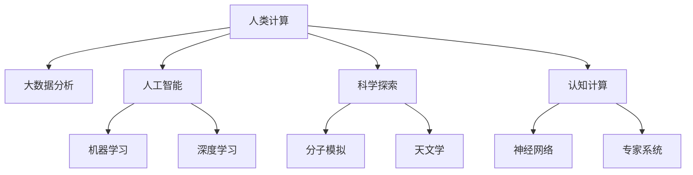

                 

# 拓展认知边界：人类计算的科学探索

> 关键词：人类计算、科学探索、认知扩展、算法创新、大数据分析、人工智能

## 1. 背景介绍

### 1.1 问题由来
在信息化时代，人类计算能力得到了前所未有的提升。从算盘和计算器到计算机和互联网，每一次技术的革新都极大拓展了人类的计算边界，带来了生产力的飞跃。然而，人类计算能力的提升并未停止，如今，AI和机器学习等新兴技术的兴起，正在进一步突破人类计算的极限，为科学探索提供了前所未有的可能性。

### 1.2 问题核心关键点
人类计算的科学探索，核心在于如何通过计算技术，高效地处理和分析海量数据，揭示复杂系统的内在规律，推动科学研究的进步。现代计算机科学的发展，使得基于数据驱动的研究方法变得日益重要。机器学习、大数据分析等技术的兴起，为科学探索提供了新的工具和方法，开启了全新的研究范式。

## 2. 核心概念与联系

### 2.1 核心概念概述

为更好地理解人类计算的科学探索，本节将介绍几个密切相关的核心概念：

- 人类计算(Human Computation)：指利用人类的计算能力，通过协作和众包的方式，处理复杂计算任务的方法。其核心思想是通过合理设计计算任务，将复杂计算转化为可管理的人类工作，从而降低计算成本，提升计算效率。

- 科学探索(Scientific Exploration)：指通过计算技术和数据分析，揭示科学现象背后的本质规律，解决科学问题，推动学科发展。现代科学探索越来越多地依赖于计算技术，从分子模拟到天文观测，计算已经成为科学研究的必备工具。

- 大数据分析(Big Data Analysis)：指从海量数据中提取有用信息，揭示数据背后的规律和趋势，支持决策和研究。大数据分析方法广泛应用于各个领域，如医学、金融、气象等，极大地提升了数据的利用价值。

- 人工智能(Artificial Intelligence)：指通过模拟人类智能，使计算机具备感知、推理、学习等能力，从而解决复杂问题。AI技术的发展，使得计算能力不断提升，推动了科学探索的深度和广度。

- 认知计算(Cognitive Computing)：指通过计算模拟人类认知过程，如感知、学习、记忆、推理等，以解决复杂问题。认知计算旨在通过计算实现对人类认知过程的模拟和拓展，推动认知科学的进步。

这些核心概念之间的逻辑关系可以通过以下Mermaid流程图来展示：



这个流程图展示了这个主题中的几个关键概念及其之间的关系：

1. 人类计算是大数据分析和科学探索的基础，通过将复杂计算任务转化为人类工作，为数据处理和研究提供了可能。
2. 人工智能和认知计算是提升人类计算能力的重要工具，通过模拟人类智能，使得计算能够处理更复杂的问题。
3. 大数据分析和机器学习是实现科学探索的核心方法，通过海量数据的分析，揭示科学现象的内在规律。
4. 科学探索是认知计算的最终目标，通过模拟人类认知过程，解决复杂科学问题。

这些概念共同构成了人类计算的科学探索框架，使其能够在各个领域实现更高效的计算和研究。

## 3. 核心算法原理 & 具体操作步骤
### 3.1 算法原理概述

人类计算的科学探索，本质上是一个数据驱动的计算过程。其核心思想是通过计算技术，高效地处理和分析海量数据，揭示复杂系统的内在规律。这一过程一般分为以下几个步骤：

1. **数据采集**：从各种数据源中获取数据，如传感器数据、科学实验数据、网络数据等。
2. **数据预处理**：对数据进行清洗、转换、归一化等预处理操作，以提高数据的可用性。
3. **数据分析**：通过算法和技术对数据进行分析和建模，提取有用信息。
4. **模型训练**：利用数据分析结果，训练机器学习模型，以预测和推断新的数据。
5. **结果验证**：对模型进行验证和评估，确保其准确性和可靠性。

### 3.2 算法步骤详解

以一个生物医学领域的科学探索为例，介绍人类计算的科学探索过程。

**Step 1: 数据采集**
- 从公共数据库（如PubMed、GEO）和生物实验中获取大量的基因表达数据。
- 利用传感器数据采集生物体的新陈代谢和行为信息。

**Step 2: 数据预处理**
- 对基因表达数据进行去噪、归一化和缺失值处理。
- 对传感器数据进行信号放大和降噪，以提高数据的准确性。

**Step 3: 数据分析**
- 使用PCA、t-SNE等降维算法，将高维数据转化为低维表示，便于可视化分析。
- 利用机器学习算法（如支持向量机、随机森林）对数据进行分类和聚类分析。
- 通过深度学习模型（如卷积神经网络、循环神经网络）对数据进行建模，提取特征。

**Step 4: 模型训练**
- 使用大量已标注的基因表达数据和传感器数据，训练分类和回归模型。
- 通过交叉验证和超参数调优，提高模型的准确性和泛化能力。

**Step 5: 结果验证**
- 利用新的数据对模型进行测试和评估，确保其在新数据上的表现。
- 对模型的输出进行可视化分析，揭示数据背后的规律和趋势。

### 3.3 算法优缺点

人类计算的科学探索方法，具有以下优点：
1. 高效性：通过计算技术处理海量数据，能够显著提升数据处理和分析的速度。
2. 可靠性：机器学习和大数据分析方法能够减少人为误差，提高数据处理的准确性。
3. 可扩展性：随着计算资源的增加，计算能力和数据处理能力可以线性扩展。
4. 广泛适用性：适用于各种领域的数据处理和分析，如医学、金融、气象等。

同时，该方法也存在一定的局限性：
1. 数据质量依赖：数据的质量和数量直接影响分析结果的准确性，数据采集和预处理是关键环节。
2. 模型复杂性：复杂的模型可能会过拟合，需要更多的数据和更强的计算资源。
3. 计算成本高：处理大规模数据需要高性能计算资源，如GPU、TPU等，成本较高。
4. 算法透明性：机器学习模型的黑盒特性使得其可解释性较差，难以理解其内部工作机制。

尽管存在这些局限性，但就目前而言，基于计算技术的科学探索方法已经成为了主流的研究范式。未来相关研究的重点在于如何进一步降低计算成本，提高算法的透明性和可解释性，同时兼顾数据质量和高性能计算资源的使用。

### 3.4 算法应用领域

基于计算技术的科学探索方法，在多个领域得到了广泛应用，例如：

- 生物医学：通过基因表达和蛋白质组数据，揭示疾病的机理和治疗方法。
- 天文学：利用多波段数据，研究星系、黑洞等天体的物理特性。
- 地球科学：通过气候和环境数据，研究全球变化和自然灾害的预测。
- 社会科学：利用人类行为数据，分析社会现象和公共政策。
- 经济学：通过市场数据，预测经济趋势和行为模式。

除了上述这些经典领域外，基于计算技术的科学探索还在更多场景中得到应用，如工业制造、环境保护、生物多样性研究等，为科学研究带来了新的突破。

## 4. 数学模型和公式 & 详细讲解  
### 4.1 数学模型构建

本节将使用数学语言对人类计算的科学探索过程进行更加严格的刻画。

记原始数据集为 $D=\{x_i\}_{i=1}^N$，其中 $x_i$ 为向量形式的数据点。假设对数据进行 $d$ 维特征提取，得到特征矩阵 $X \in \mathbb{R}^{N \times d}$。

定义 $X$ 的均值 $\mu = \frac{1}{N} \sum_{i=1}^N x_i$ 和协方差矩阵 $\Sigma = \frac{1}{N} \sum_{i=1}^N (x_i - \mu)(x_i - \mu)^T$。

定义线性回归模型 $\hat{y} = \theta^T x$，其中 $\theta$ 为回归系数向量。

回归模型的损失函数为均方误差：

$$
\mathcal{L}(\theta) = \frac{1}{N} \sum_{i=1}^N (y_i - \hat{y}_i)^2
$$

其中 $y_i$ 为数据点的真实标签。

### 4.2 公式推导过程

以线性回归模型为例，推导最小二乘法的求解过程。

最小二乘法通过最小化损失函数 $\mathcal{L}(\theta)$ 来求解回归系数 $\theta$，即：

$$
\hat{\theta} = \arg\min_{\theta} \mathcal{L}(\theta)
$$

通过求导，得：

$$
\nabla_{\theta} \mathcal{L}(\theta) = -\frac{2}{N} X^T (y - \hat{y})
$$

令导数等于零，解方程得：

$$
\hat{\theta} = (X^T X)^{-1} X^T y
$$

这就是最小二乘法的求解公式，通过计算 $X^T X$ 的逆矩阵，可以得到最优的回归系数 $\hat{\theta}$。

### 4.3 案例分析与讲解

以金融风险评估为例，介绍如何利用计算技术进行科学探索。

假设有一份包含历史交易数据的金融数据集，我们可以使用线性回归模型进行风险评估，其中 $y$ 表示交易盈亏，$x_i$ 表示交易的特征（如价格、成交量等）。

通过计算均值和协方差矩阵，我们可以得到回归模型的系数 $\hat{\theta}$。然后，利用新交易数据 $x'$，可以计算其预测盈亏 $\hat{y}' = \hat{\theta}^T x'$，从而预测交易风险。

通过反复训练和验证，我们可以不断优化模型，提高预测的准确性。同时，利用可视化工具（如Matplotlib、Seaborn）对数据进行可视化分析，揭示数据背后的规律和趋势，从而更好地理解交易行为和市场变化。

## 5. 项目实践：代码实例和详细解释说明
### 5.1 开发环境搭建

在进行科学探索项目开发前，我们需要准备好开发环境。以下是使用Python进行NumPy、Pandas、Scikit-learn等库进行科学探索的环境配置流程：

1. 安装Anaconda：从官网下载并安装Anaconda，用于创建独立的Python环境。

2. 创建并激活虚拟环境：
```bash
conda create -n sci-env python=3.8 
conda activate sci-env
```

3. 安装必要的库：
```bash
conda install numpy pandas scikit-learn matplotlib seaborn jupyter notebook ipython
```

4. 安装TensorFlow、Keras等深度学习库（如需要）：
```bash
conda install tensorflow keras
```

完成上述步骤后，即可在`sci-env`环境中开始科学探索项目开发。

### 5.2 源代码详细实现

下面以一个简单的线性回归为例，给出使用Scikit-learn库进行数据处理和模型训练的Python代码实现。

```python
import numpy as np
from sklearn.linear_model import LinearRegression
from sklearn.metrics import mean_squared_error
from sklearn.model_selection import train_test_split
import matplotlib.pyplot as plt
import pandas as pd

# 读取数据
data = pd.read_csv('data.csv')

# 数据预处理
X = data.iloc[:, :-1].values
y = data.iloc[:, -1].values

# 划分训练集和测试集
X_train, X_test, y_train, y_test = train_test_split(X, y, test_size=0.2, random_state=0)

# 训练模型
regressor = LinearRegression()
regressor.fit(X_train, y_train)

# 预测并评估
y_pred = regressor.predict(X_test)
mse = mean_squared_error(y_test, y_pred)
print(f"均方误差: {mse}")

# 可视化结果
plt.scatter(X_test, y_test, color='red')
plt.plot(X_test, y_pred, color='blue')
plt.title('Linear Regression')
plt.xlabel('X')
plt.ylabel('y')
plt.show()
```

### 5.3 代码解读与分析

让我们再详细解读一下关键代码的实现细节：

- `read_csv`方法：从CSV文件中读取数据，生成DataFrame对象。
- `iloc`属性：通过索引访问DataFrame中的数据，方便进行数据切片。
- `train_test_split`方法：将数据集划分为训练集和测试集，设定测试集比例为20%，随机种子为0。
- `LinearRegression`类：使用线性回归模型进行模型训练。
- `mean_squared_error`函数：计算预测值与真实值之间的均方误差。
- `scatter`方法：绘制真实值和预测值之间的散点图。
- `plot`方法：绘制线性回归的拟合曲线。

可以看到，Scikit-learn库使得数据处理和模型训练变得简单易懂，开发者可以将更多精力放在模型设计和优化上，而不必过多关注底层的实现细节。

## 6. 实际应用场景
### 6.1 智慧医疗

在智慧医疗领域，基于计算技术的科学探索方法可以应用于疾病预测、诊断、治疗方案推荐等多个方面。通过分析患者的病历数据、基因组数据和生理参数，可以揭示疾病的发展规律，预测患者未来病情，推荐最适合的治疗方案。

具体而言，可以使用机器学习算法对海量的医疗数据进行建模和分析，通过预测模型对患者进行风险评估，利用可视化工具（如Tableau、PowerBI）对分析结果进行可视化展示，从而帮助医生制定精准的治疗方案。

### 6.2 金融风险评估

金融领域的风险评估是计算技术的重要应用之一。通过分析市场数据和公司财务报表，可以预测企业的财务状况和风险水平，帮助投资者做出更加明智的投资决策。

具体而言，可以使用随机森林、支持向量机等算法对历史数据进行建模，通过预测模型对企业的财务状况进行评估，利用可视化工具对结果进行展示，从而帮助投资者识别潜在的投资机会和风险。

### 6.3 智慧城市

智慧城市的建设离不开计算技术的支持。通过分析城市中的交通、环境、能源等数据，可以揭示城市运行规律，优化城市管理，提升居民生活质量。

具体而言，可以使用机器学习算法对城市中的传感器数据进行分析，通过预测模型对城市运行状况进行评估，利用可视化工具对结果进行展示，从而帮助城市管理者制定更加科学的决策。

### 6.4 未来应用展望

随着计算技术的发展，基于计算技术的科学探索方法将在更多领域得到应用，为各个行业带来变革性影响。

在智慧农业领域，基于计算技术的科学探索方法可以应用于作物生长预测、病虫害检测、农机自动驾驶等方面，提高农业生产效率，降低生产成本。

在智慧教育领域，基于计算技术的科学探索方法可以应用于学习数据分析、个性化推荐、教育决策等方面，因材施教，提高教育质量。

在智慧交通领域，基于计算技术的科学探索方法可以应用于交通流量预测、智能导航、智能调度等方面，提高交通管理效率，降低交通拥堵。

此外，在智能制造、环境保护、生物多样性研究等众多领域，基于计算技术的科学探索方法也将不断涌现，为各行各业带来新的技术突破。

## 7. 工具和资源推荐
### 7.1 学习资源推荐

为了帮助开发者系统掌握计算技术的应用，这里推荐一些优质的学习资源：

1. 《Python数据科学手册》系列博文：由数据科学专家撰写，深入浅出地介绍了Python在数据科学中的应用，包括NumPy、Pandas、Scikit-learn等库的使用。

2. 《深度学习入门》课程：由吴恩达教授开设的深度学习课程，涵盖深度学习的基本概念和经典模型，适合初学者入门。

3. 《机器学习实战》书籍：由机器学习专家编写，详细介绍了机器学习算法和实践技巧，适合实战练习。

4. Kaggle平台：全球最大的数据科学竞赛平台，提供海量数据集和模型，是学习计算技术的重要资源。

5. GitHub开源项目：GitHub上汇集了大量的计算技术开源项目，是学习和实践计算技术的重要工具。

通过对这些资源的学习实践，相信你一定能够快速掌握计算技术的应用，并用于解决实际的科学探索问题。

### 7.2 开发工具推荐

高效的开发离不开优秀的工具支持。以下是几款用于科学探索开发的常用工具：

1. Jupyter Notebook：交互式数据处理和代码实现工具，方便实时调试和展示。

2. Google Colab：免费的在线Jupyter Notebook环境，支持GPU/TPU算力，方便快速实验最新模型。

3. TensorBoard：TensorFlow配套的可视化工具，可实时监测模型训练状态，并提供丰富的图表呈现方式。

4. Weights & Biases：模型训练的实验跟踪工具，可以记录和可视化模型训练过程中的各项指标，方便对比和调优。

5. Plotly：可视化工具，可以生成交互式图表，方便数据的展示和分析。

合理利用这些工具，可以显著提升计算技术应用的开发效率，加快创新迭代的步伐。

### 7.3 相关论文推荐

计算技术的发展源于学界的持续研究。以下是几篇奠基性的相关论文，推荐阅读：

1. 《TensorFlow: A System for Large-Scale Machine Learning》：提出TensorFlow框架，成为计算技术研究的重要里程碑。

2. 《Google Brain: The State of the Art in Deep Learning》：Google Brain团队发表的深度学习综述论文，介绍了多项最新的深度学习技术。

3. 《Machine Learning: A Probabilistic Perspective》：机器学习专家编写的经典教材，介绍了机器学习的基本概念和算法。

4. 《Deep Learning》：深度学习领域的经典教材，介绍了深度学习的基本概念和实践技巧。

5. 《Visualization of High-Dimensional Data Using t-SNE》：t-SNE算法的发明人发表的论文，介绍了t-SNE算法的原理和实现。

这些论文代表了大数据、机器学习等计算技术的发展脉络。通过学习这些前沿成果，可以帮助研究者把握学科前进方向，激发更多的创新灵感。

## 8. 总结：未来发展趋势与挑战

### 8.1 总结

本文对基于计算技术的科学探索方法进行了全面系统的介绍。首先阐述了计算技术在科学探索中的重要作用，明确了计算技术对数据驱动的研究方法的重要支撑作用。其次，从原理到实践，详细讲解了科学探索的数学原理和关键步骤，给出了计算技术应用的完整代码实例。同时，本文还广泛探讨了计算技术在智慧医疗、金融风险评估、智慧城市等众多领域的应用前景，展示了计算技术的巨大潜力。此外，本文精选了计算技术的学习资源，力求为读者提供全方位的技术指引。

通过本文的系统梳理，可以看到，基于计算技术的科学探索方法已经成为科学研究的重要手段，极大地提升了科学研究的效率和准确性。未来，伴随计算技术的不断发展，计算能力将进一步提升，数据规模将不断扩大，科学探索将变得更加高效和深入。

### 8.2 未来发展趋势

展望未来，基于计算技术的科学探索方法将呈现以下几个发展趋势：

1. 计算能力持续提升。随着算力成本的下降和计算技术的进步，计算能力将不断提升，能够处理更大规模、更复杂的数据集。

2. 数据质量不断提高。数据的收集和处理技术将不断进步，数据质量将不断提高，为科学探索提供更好的数据基础。

3. 算法创新不断涌现。新的算法和技术将不断涌现，推动科学探索方法的进步，解决更加复杂的问题。

4. 多学科融合加强。计算技术将与其他学科相结合，推动跨学科的研究，揭示更深入的科学规律。

5. 数据驱动决策普及。基于计算技术的科学探索方法将更多地应用于政策制定和商业决策，提升决策的科学性和准确性。

6. 人类计算占比增加。随着计算技术的普及，人类计算将更多地应用于计算任务的辅助，提升计算效率和精度。

以上趋势凸显了计算技术在科学探索中的重要地位和巨大潜力。这些方向的探索发展，必将进一步推动科学研究的进步，为人类认知智能的提升带来新的突破。

### 8.3 面临的挑战

尽管计算技术在科学探索中取得了瞩目成就，但在迈向更加智能化、普适化应用的过程中，它仍面临着诸多挑战：

1. 数据隐私保护：科学数据往往包含个人隐私信息，如何在保护隐私的同时，进行数据共享和分析，是一个重要的问题。

2. 计算资源成本高昂：大规模数据处理和复杂模型训练需要高性能计算资源，成本较高，如何降低计算成本，是重要的研究方向。

3. 算法透明性不足：许多计算模型（如深度学习）具有黑盒特性，难以解释其内部工作机制，如何提高算法的透明性和可解释性，是重要的研究方向。

4. 多学科协同困难：跨学科的研究需要整合不同领域的专业知识，如何打破学科壁垒，实现协同创新，是一个重要的挑战。

5. 计算技术的普及度不足：计算技术的普及度较低，需要更多的教育和培训，提高全社会对计算技术的理解和应用能力。

6. 计算技术的伦理问题：计算技术的应用可能带来伦理问题，如何制定相关的伦理规范，保障计算技术的安全和公正，是重要的研究方向。

这些挑战需要学术界、产业界和社会各界的共同努力，才能更好地发挥计算技术在科学探索中的作用。

### 8.4 研究展望

面向未来，计算技术在科学探索中的应用前景广阔，我们需要在以下几个方面寻求新的突破：

1. 加强数据共享和开放：建立科学数据共享平台，促进数据的开放和共享，推动科学研究的协同创新。

2. 发展高效计算框架：研究新的计算框架和技术，提高计算效率和精度，降低计算成本。

3. 提高算法透明性和可解释性：开发更透明和可解释的计算模型，增强计算结果的可理解性和可信度。

4. 推动多学科融合：加强不同学科的交流和合作，推动跨学科的研究，揭示更深入的科学规律。

5. 普及计算技术教育：提高全社会对计算技术的理解和应用能力，推动计算技术的普及和应用。

6. 制定伦理规范：制定相关的伦理规范和标准，保障计算技术的安全和公正，推动科学研究的健康发展。

这些研究方向将进一步推动计算技术在科学探索中的应用，为科学研究的进步和人类认知智能的提升带来新的突破。

## 9. 附录：常见问题与解答

**Q1：计算技术如何应用于科学探索？**

A: 计算技术可以通过数据处理、模型训练和结果分析，帮助科学家从海量数据中提取有用信息，揭示科学现象的内在规律。具体而言，可以从以下几个方面应用计算技术：

1. 数据处理：通过清洗、归一化和特征提取等预处理操作，将原始数据转化为可用于分析的格式。
2. 模型训练：利用机器学习和深度学习模型，对数据进行建模和预测，发现数据背后的规律和趋势。
3. 结果分析：通过可视化工具对分析结果进行展示和解读，揭示数据背后的规律和趋势。

**Q2：计算技术在科学探索中存在哪些局限性？**

A: 计算技术在科学探索中也存在一些局限性，主要包括以下几个方面：

1. 数据质量：计算技术依赖于高质量的数据，数据的质量和数量直接影响分析结果的准确性。
2. 模型复杂性：复杂的模型可能会过拟合，需要更多的数据和更强的计算资源。
3. 计算成本：处理大规模数据需要高性能计算资源，成本较高，如何降低计算成本是一个重要问题。
4. 算法透明性：许多计算模型具有黑盒特性，难以解释其内部工作机制，如何提高算法的透明性和可解释性是重要的研究方向。

**Q3：如何提高计算技术的普及度？**

A: 提高计算技术的普及度需要从以下几个方面入手：

1. 教育和培训：加强对计算技术的教育和培训，提高全社会对计算技术的理解和应用能力。
2. 工具和平台：开发易用、高效的工具和平台，降低计算技术的入门门槛，促进计算技术的普及和应用。
3. 开放和共享：建立科学数据共享平台，促进数据的开放和共享，推动计算技术在更多领域的应用。
4. 政府和机构支持：政府和机构可以提供政策支持和资金投入，推动计算技术的研发和应用。

**Q4：计算技术在科学探索中的应用前景如何？**

A: 计算技术在科学探索中的应用前景广阔，将进一步推动科学研究的进步和人类认知智能的提升。具体而言，计算技术将会在以下几个方面发挥重要作用：

1. 数据驱动决策：基于计算技术的科学探索方法将更多地应用于政策制定和商业决策，提升决策的科学性和准确性。
2. 跨学科研究：计算技术将与其他学科相结合，推动跨学科的研究，揭示更深入的科学规律。
3. 智慧医疗：计算技术可以应用于疾病预测、诊断、治疗方案推荐等多个方面，提高医疗服务的智能化水平。
4. 智慧城市：计算技术可以应用于交通、环境、能源等多个领域，优化城市管理，提升居民生活质量。

总之，计算技术在科学探索中的应用前景广阔，将为科学研究带来新的突破，推动社会进步和发展。

---

作者：禅与计算机程序设计艺术 / Zen and the Art of Computer Programming

