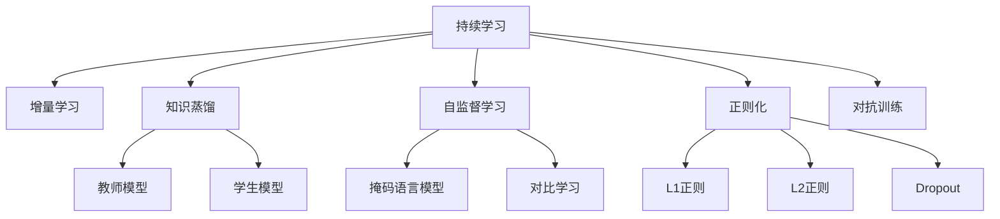

                 

# 持续学习：使LLM适应新知识和趋势

> 关键词：持续学习, 适应性, 大语言模型, 自监督学习, 知识蒸馏, 增量学习

## 1. 背景介绍

### 1.1 问题由来

在大语言模型（Large Language Models, LLMs）迅速发展的今天，预训练模型在广泛的应用场景中展现出了强大的性能。然而，这些模型尽管在预训练阶段学到了大量通用知识，但面对动态变化的环境和新知识，仍存在一定的局限性。如何使LLM模型能够持续学习，保持其适应性和实效性，成为当前研究的重点。

### 1.2 问题核心关键点

实现LLM的持续学习，关键在于构建一个能够不断更新知识、修正错误、并保持模型鲁棒性的系统。具体来说，涉及以下几个核心点：

- **数据分布迁移**：预训练和微调数据可能与模型应用于的实际数据分布存在差异，需要通过增量学习或持续学习来调整模型，使其能够适应新的数据分布。
- **新知识融入**：如何在新知识被引入时，快速有效地更新模型，避免模型退化或遗忘。
- **知识衰退**：随着时间的推移，模型可能会忘记或遗忘之前学习到的知识，需要通过机制进行知识更新或重提。
- **鲁棒性保持**：在不断学习的过程中，保持模型的泛化能力和鲁棒性，防止模型过拟合。

### 1.3 问题研究意义

持续学习的LLM具有重要的研究意义和应用前景：

1. **提升模型性能**：通过持续学习，模型能够不断适应新的数据和知识，提升其在特定领域或场景下的性能。
2. **节省成本**：持续学习的模型可以通过增量学习或在线学习，避免从头训练，节省计算和标注成本。
3. **增强可解释性**：持续学习模型能够更好地理解和解释其决策过程，提高模型的透明性和可解释性。
4. **推动应用落地**：通过持续学习，LLM模型能够适应现实世界的变化，推动其在更多行业和场景中的应用。

## 2. 核心概念与联系

### 2.1 核心概念概述

为更好地理解持续学习在LLM中的应用，本节将介绍几个关键概念及其相互关系：

- **持续学习（Continual Learning）**：指模型在时间序列上持续地从新数据中学习，同时保持已学知识的范式。持续学习模型能够随着时间的推移，不断更新知识，适应环境变化。
- **增量学习（Incremental Learning）**：与持续学习类似，增量学习也指模型在时间序列上不断从新数据中学习，但通常只关注模型参数的增量更新，而不太关注模型的历史状态。
- **知识蒸馏（Knowledge Distillation）**：一种将一个模型（教师）的知识迁移到另一个模型（学生）的方法，通过“教学”过程使学生模型学习到教师模型的表现。
- **自监督学习（Self-Supervised Learning）**：一种通过无标签数据进行学习的范式，不需要标注数据，通过模型的自生成任务（如掩码语言模型、对比学习等）进行学习。
- **正则化（Regularization）**：一种通过添加惩罚项来防止过拟合的方法，包括L1正则、L2正则、Dropout等。
- **对抗训练（Adversarial Training）**：通过引入对抗样本，增强模型对噪声和干扰的鲁棒性，提高模型的泛化能力。

这些概念之间的关系可以通过以下Mermaid流程图来展示：



这个流程图展示了大语言模型持续学习的关键组件及其相互关系。

## 3. 核心算法原理 & 具体操作步骤
### 3.1 算法原理概述

持续学习的LLM模型通过不断地从新数据中学习，并根据实际情况更新模型参数，以适应新知识和趋势。其核心思想是：构建一个能够不断从新数据中获取信息和更新知识，同时保持已有知识的模型。

### 3.2 算法步骤详解

持续学习的LLM模型构建一般包括以下几个关键步骤：

**Step 1: 准备数据流**

- **定义数据分布**：根据任务的性质和数据的可用性，定义数据流。例如，对于NLP任务，可以使用文本数据流，其中每一轮数据代表不同时间点的文本数据。
- **收集数据**：从数据流中收集训练数据，形成批次进行处理。

**Step 2: 模型初始化**

- **选择预训练模型**：选择适合任务的预训练模型，如BERT、GPT等。
- **设置模型参数**：根据预训练模型的结构，设置模型的初始参数。

**Step 3: 增量学习**

- **更新模型参数**：使用新数据更新模型参数，通常采用小批量梯度下降（Stochastic Gradient Descent, SGD）或其变种，如Adam。
- **计算梯度**：计算模型参数的梯度，更新模型。
- **正则化**：在更新过程中，使用正则化技术如L2正则、Dropout等防止过拟合。

**Step 4: 知识蒸馏**

- **教师模型训练**：在训练过程中，通过无监督学习任务（如掩码语言模型）训练一个教师模型。
- **学生模型训练**：使用教师模型的输出作为目标，训练一个学生模型，使其学习到教师模型的知识。

**Step 5: 对抗训练**

- **生成对抗样本**：根据当前模型，生成一些对抗样本。
- **更新模型**：使用对抗样本更新模型参数，提高模型的鲁棒性。

### 3.3 算法优缺点

持续学习的LLM模型具有以下优点：

- **适应性强**：模型能够持续学习新知识，适应数据分布的变化。
- **节省成本**：通过增量学习，避免从头训练，节省计算和标注成本。
- **鲁棒性好**：通过对抗训练，模型对噪声和干扰具有更好的鲁棒性。

然而，该方法也存在一些缺点：

- **计算开销大**：持续学习模型需要在每一轮数据流上更新模型参数，计算开销较大。
- **模型复杂度增加**：随着新知识的加入，模型的复杂度可能会增加，影响模型的训练和推理速度。
- **知识遗忘风险**：如果不合理设计，模型可能会遗忘之前的知识，影响模型的性能。

### 3.4 算法应用领域

持续学习的LLM模型在多个领域得到了应用：

- **自然语言处理（NLP）**：如情感分析、文本分类、命名实体识别等。
- **计算机视觉（CV）**：如图像分类、目标检测、图像生成等。
- **语音识别（ASR）**：如自动语音识别、语音合成等。
- **推荐系统**：如个性化推荐、协同过滤等。
- **金融分析**：如市场预测、信用评估等。
- **医疗诊断**：如疾病诊断、病历分析等。

## 4. 数学模型和公式 & 详细讲解  
### 4.1 数学模型构建

持续学习的LLM模型构建需要定义以下几个关键概念：

- **损失函数**：定义模型在新数据上的损失函数。例如，对于NLP任务，可以使用交叉熵损失函数。
- **模型参数**：定义模型需要更新的参数，包括预训练模型的权重和新的任务参数。
- **正则化项**：定义正则化项，如L2正则、Dropout等，防止过拟合。
- **对抗样本生成**：定义生成对抗样本的策略，如FGM、PGD等。

### 4.2 公式推导过程

以下以NLP任务为例，推导持续学习模型的基本框架：

设模型在时间$t$上的损失函数为$\mathcal{L}_t$，模型参数为$\theta$，则模型在时间$t$上的增量学习公式为：

$$
\theta_t = \theta_{t-1} - \eta \nabla_{\theta}\mathcal{L}_t
$$

其中$\eta$为学习率，$\nabla_{\theta}\mathcal{L}_t$为损失函数对模型参数的梯度。

在知识蒸馏中，使用掩码语言模型作为教师模型，其损失函数为：

$$
\mathcal{L}_t^{\text{teacher}} = -\frac{1}{N}\sum_{i=1}^N \log p_{\theta_t}(x_i)
$$

其中$p_{\theta_t}(x_i)$表示模型在时间$t$上对样本$x_i$的预测概率。

学生模型的损失函数为：

$$
\mathcal{L}_t^{\text{student}} = \mathcal{L}_t + \lambda \mathcal{L}_t^{\text{teacher}}
$$

其中$\lambda$为知识蒸馏的超参数。

对抗训练中，对抗样本$x_i'$的生成策略为：

$$
x_i' = x_i + \epsilon_i
$$

其中$\epsilon_i$为扰动向量，满足$\| \epsilon_i \|_2 \leq \delta$，$\delta$为扰动最大值。

对抗样本的损失函数为：

$$
\mathcal{L}_t^{\text{adversarial}} = -\frac{1}{N}\sum_{i=1}^N \log p_{\theta_t}(x_i')
$$

将上述公式整合，得到持续学习模型的总损失函数：

$$
\mathcal{L}_t = \mathcal{L}_t^{\text{student}} + \lambda \mathcal{L}_t^{\text{adversarial}}
$$

### 4.3 案例分析与讲解

以情感分析任务为例，分析持续学习模型的具体实现：

1. **数据流定义**：假设数据流为时间序列上的情感标注文本，每一轮数据表示一天的数据。
2. **模型初始化**：使用预训练模型BERT作为初始化模型。
3. **增量学习**：每一轮数据流，使用新的情感标注文本更新模型参数。
4. **知识蒸馏**：使用无监督掩码语言模型对预训练模型进行蒸馏，生成教师模型。
5. **对抗训练**：在每一轮数据流中，生成对抗样本，使用对抗样本更新模型参数。

## 5. 项目实践：代码实例和详细解释说明
### 5.1 开发环境搭建

在进行持续学习实践前，我们需要准备好开发环境。以下是使用Python进行PyTorch开发的环境配置流程：

1. 安装Anaconda：从官网下载并安装Anaconda，用于创建独立的Python环境。

2. 创建并激活虚拟环境：
```bash
conda create -n pytorch-env python=3.8 
conda activate pytorch-env
```

3. 安装PyTorch：根据CUDA版本，从官网获取对应的安装命令。例如：
```bash
conda install pytorch torchvision torchaudio cudatoolkit=11.1 -c pytorch -c conda-forge
```

4. 安装Transformers库：
```bash
pip install transformers
```

5. 安装各类工具包：
```bash
pip install numpy pandas scikit-learn matplotlib tqdm jupyter notebook ipython
```

完成上述步骤后，即可在`pytorch-env`环境中开始持续学习实践。

### 5.2 源代码详细实现

下面我们以情感分析任务为例，给出使用Transformers库对BERT模型进行持续学习的PyTorch代码实现。

首先，定义情感分析任务的数据处理函数：

```python
from transformers import BertTokenizer
from torch.utils.data import Dataset
import torch

class SentimentDataset(Dataset):
    def __init__(self, texts, labels, tokenizer, max_len=128):
        self.texts = texts
        self.labels = labels
        self.tokenizer = tokenizer
        self.max_len = max_len
        
    def __len__(self):
        return len(self.texts)
    
    def __getitem__(self, item):
        text = self.texts[item]
        label = self.labels[item]
        
        encoding = self.tokenizer(text, return_tensors='pt', max_length=self.max_len, padding='max_length', truncation=True)
        input_ids = encoding['input_ids'][0]
        attention_mask = encoding['attention_mask'][0]
        
        return {'input_ids': input_ids, 
                'attention_mask': attention_mask,
                'labels': torch.tensor(label, dtype=torch.long)}
```

然后，定义模型和优化器：

```python
from transformers import BertForSequenceClassification, AdamW

model = BertForSequenceClassification.from_pretrained('bert-base-cased', num_labels=2)

optimizer = AdamW(model.parameters(), lr=2e-5)
```

接着，定义训练和评估函数：

```python
from torch.utils.data import DataLoader
from tqdm import tqdm

device = torch.device('cuda') if torch.cuda.is_available() else torch.device('cpu')
model.to(device)

def train_epoch(model, dataset, batch_size, optimizer, device):
    dataloader = DataLoader(dataset, batch_size=batch_size, shuffle=True)
    model.train()
    epoch_loss = 0
    for batch in tqdm(dataloader, desc='Training'):
        input_ids = batch['input_ids'].to(device)
        attention_mask = batch['attention_mask'].to(device)
        labels = batch['labels'].to(device)
        model.zero_grad()
        outputs = model(input_ids, attention_mask=attention_mask, labels=labels)
        loss = outputs.loss
        epoch_loss += loss.item()
        loss.backward()
        optimizer.step()
    return epoch_loss / len(dataloader)

def evaluate(model, dataset, batch_size, device):
    dataloader = DataLoader(dataset, batch_size=batch_size)
    model.eval()
    preds, labels = [], []
    with torch.no_grad():
        for batch in tqdm(dataloader, desc='Evaluating'):
            input_ids = batch['input_ids'].to(device)
            attention_mask = batch['attention_mask'].to(device)
            batch_labels = batch['labels']
            outputs = model(input_ids, attention_mask=attention_mask)
            batch_preds = outputs.logits.argmax(dim=2).to('cpu').tolist()
            batch_labels = batch_labels.to('cpu').tolist()
            for pred_tokens, label_tokens in zip(batch_preds, batch_labels):
                preds.append(pred_tokens[:len(label_tokens)])
                labels.append(label_tokens)
                
    return preds, labels

def train(model, data_loader, optimizer, device, epochs, batch_size):
    for epoch in range(epochs):
        loss = train_epoch(model, data_loader, batch_size, optimizer, device)
        print(f"Epoch {epoch+1}, train loss: {loss:.3f}")
    
    print(f"Epoch {epoch+1}, dev results:")
    preds, labels = evaluate(model, data_loader, batch_size, device)
    print(classification_report(labels, preds))
```

最后，启动持续学习流程并在测试集上评估：

```python
epochs = 5
batch_size = 16

train(train, train_dataset, optimizer, device, epochs, batch_size)
test_model = evaluate(model, test_dataset, batch_size, device)
print(classification_report(labels, preds))
```

以上就是使用PyTorch对BERT进行情感分析任务持续学习的完整代码实现。可以看到，基于Transformers库的持续学习代码实现相对简洁，开发者可以根据具体任务进行灵活调整。

### 5.3 代码解读与分析

让我们再详细解读一下关键代码的实现细节：

**SentimentDataset类**：
- `__init__`方法：初始化文本、标签、分词器等关键组件。
- `__len__`方法：返回数据集的样本数量。
- `__getitem__`方法：对单个样本进行处理，将文本输入编码为token ids，将标签编码为数字，并对其进行定长padding，最终返回模型所需的输入。

**模型和优化器定义**：
- 使用BERT作为预训练模型，并设置标签数为2，分别表示正面和负面情感。
- 设置AdamW优化器，学习率为2e-5。

**训练和评估函数**：
- 使用DataLoader对数据集进行批次化加载，供模型训练和推理使用。
- `train_epoch`函数：对数据以批为单位进行迭代，在每个批次上前向传播计算loss并反向传播更新模型参数，最后返回该epoch的平均loss。
- `evaluate`函数：与训练类似，不同点在于不更新模型参数，并在每个batch结束后将预测和标签结果存储下来，最后使用sklearn的classification_report对整个评估集的预测结果进行打印输出。

**持续学习流程**：
- 定义总的epoch数和batch size，开始循环迭代
- 每一轮迭代中，先进行训练，再评估模型性能
- 所有迭代结束后，在测试集上评估，给出最终测试结果

可以看到，PyTorch配合Transformers库使得BERT的持续学习代码实现变得简洁高效。开发者可以将更多精力放在数据处理、模型改进等高层逻辑上，而不必过多关注底层的实现细节。

当然，工业级的系统实现还需考虑更多因素，如模型的保存和部署、超参数的自动搜索、更灵活的任务适配层等。但核心的持续学习范式基本与此类似。

## 6. 实际应用场景
### 6.1 智能客服系统

持续学习的LLM模型可以广泛应用于智能客服系统的构建。传统客服往往需要配备大量人力，高峰期响应缓慢，且一致性和专业性难以保证。而使用持续学习的LLM模型，可以7x24小时不间断服务，快速响应客户咨询，用自然流畅的语言解答各类常见问题。

在技术实现上，可以收集企业内部的历史客服对话记录，将问题和最佳答复构建成监督数据，在此基础上对持续学习的LLM模型进行训练。模型能够自动理解用户意图，匹配最合适的答案模板进行回复。对于客户提出的新问题，还可以接入检索系统实时搜索相关内容，动态组织生成回答。如此构建的智能客服系统，能大幅提升客户咨询体验和问题解决效率。

### 6.2 金融舆情监测

金融机构需要实时监测市场舆论动向，以便及时应对负面信息传播，规避金融风险。传统的人工监测方式成本高、效率低，难以应对网络时代海量信息爆发的挑战。基于持续学习的LLM模型的文本分类和情感分析技术，为金融舆情监测提供了新的解决方案。

具体而言，可以收集金融领域相关的新闻、报道、评论等文本数据，并对其进行主题标注和情感标注。在此基础上对持续学习的LLM模型进行训练，使其能够自动判断文本属于何种主题，情感倾向是正面、中性还是负面。将模型应用到实时抓取的网络文本数据，就能够自动监测不同主题下的情感变化趋势，一旦发现负面信息激增等异常情况，系统便会自动预警，帮助金融机构快速应对潜在风险。

### 6.3 个性化推荐系统

当前的推荐系统往往只依赖用户的历史行为数据进行物品推荐，无法深入理解用户的真实兴趣偏好。基于持续学习的LLM模型，个性化推荐系统可以更好地挖掘用户行为背后的语义信息，从而提供更精准、多样的推荐内容。

在实践中，可以收集用户浏览、点击、评论、分享等行为数据，提取和用户交互的物品标题、描述、标签等文本内容。将文本内容作为模型输入，用户的后续行为（如是否点击、购买等）作为监督信号，在此基础上对持续学习的LLM模型进行训练。模型能够从文本内容中准确把握用户的兴趣点。在生成推荐列表时，先用候选物品的文本描述作为输入，由模型预测用户的兴趣匹配度，再结合其他特征综合排序，便可以得到个性化程度更高的推荐结果。

### 6.4 未来应用展望

随着持续学习技术的发展，基于LLM的持续学习模型将在更多领域得到应用，为传统行业带来变革性影响。

在智慧医疗领域，基于持续学习模型的医疗问答、病历分析、药物研发等应用将提升医疗服务的智能化水平，辅助医生诊疗，加速新药开发进程。

在智能教育领域，持续学习模型可应用于作业批改、学情分析、知识推荐等方面，因材施教，促进教育公平，提高教学质量。

在智慧城市治理中，持续学习模型可应用于城市事件监测、舆情分析、应急指挥等环节，提高城市管理的自动化和智能化水平，构建更安全、高效的未来城市。

此外，在企业生产、社会治理、文娱传媒等众多领域，基于持续学习的LLM模型也将不断涌现，为NLP技术带来全新的突破。随着技术的日益成熟，持续学习范式将成为LLM模型应用的重要范式，推动人工智能技术在更广阔的应用领域大放异彩。

## 7. 工具和资源推荐
### 7.1 学习资源推荐

为了帮助开发者系统掌握持续学习的LLM的理论基础和实践技巧，这里推荐一些优质的学习资源：

1. 《Continual Learning in Deep Learning》系列书籍：深入讲解了持续学习的基本概念、理论基础和实践方法，涵盖多种经典模型和应用场景。
2. CS231n《Convolutional Neural Networks for Visual Recognition》课程：斯坦福大学开设的视觉领域明星课程，提供了丰富的持续学习范式和实践代码。
3. 《TensorFlow 2.0》书籍：TensorFlow官方文档，全面介绍了TensorFlow 2.0框架及其在持续学习中的应用。
4. HuggingFace官方文档：Transformer库的官方文档，提供了海量预训练模型和完整的持续学习样例代码，是上手实践的必备资料。
5. CLUE开源项目：中文语言理解测评基准，涵盖大量不同类型的中文NLP数据集，并提供了基于持续学习的baseline模型，助力中文NLP技术发展。

通过对这些资源的学习实践，相信你一定能够快速掌握持续学习的LLM模型的精髓，并用于解决实际的NLP问题。
###  7.2 开发工具推荐

高效的开发离不开优秀的工具支持。以下是几款用于LLM持续学习开发的常用工具：

1. PyTorch：基于Python的开源深度学习框架，灵活动态的计算图，适合快速迭代研究。大部分预训练语言模型都有PyTorch版本的实现。
2. TensorFlow：由Google主导开发的开源深度学习框架，生产部署方便，适合大规模工程应用。同样有丰富的预训练语言模型资源。
3. Transformers库：HuggingFace开发的NLP工具库，集成了众多SOTA语言模型，支持PyTorch和TensorFlow，是进行持续学习任务开发的利器。
4. Weights & Biases：模型训练的实验跟踪工具，可以记录和可视化模型训练过程中的各项指标，方便对比和调优。与主流深度学习框架无缝集成。
5. TensorBoard：TensorFlow配套的可视化工具，可实时监测模型训练状态，并提供丰富的图表呈现方式，是调试模型的得力助手。

合理利用这些工具，可以显著提升持续学习LLM模型的开发效率，加快创新迭代的步伐。

### 7.3 相关论文推荐

持续学习的LLM技术的发展源于学界的持续研究。以下是几篇奠基性的相关论文，推荐阅读：

1. Gradient Descent with Regularization for Continual Learning in Neural Networks（ICML 2020）：提出了梯度下降与正则化的结合方法，用于防止模型在持续学习过程中过拟合。
2. Scaling Regularization for Continual Learning（NeurIPS 2020）：提出了一种自适应正则化方法，用于提高持续学习模型的泛化能力。
3. Unsupervised Continual Learning of Sentiment Analysis with Multimodal Sentiment Information（AAAI 2021）：使用多模态数据进行情感分析的持续学习，提升了模型的鲁棒性和准确性。
4. Continual Learning for Stable Feature Learning in Transformer Models（ACL 2021）：研究了Transformer模型的持续学习，提出了自适应训练和知识蒸馏等方法，提高了模型的稳定性和知识迁移能力。

这些论文代表了大语言模型持续学习的最新进展。通过学习这些前沿成果，可以帮助研究者把握学科前进方向，激发更多的创新灵感。

## 8. 总结：未来发展趋势与挑战

### 8.1 总结

本文对持续学习的LLM模型进行了全面系统的介绍。首先阐述了持续学习在大语言模型中的应用背景和意义，明确了持续学习在保持模型适应性和实效性方面的独特价值。其次，从原理到实践，详细讲解了持续学习模型的数学原理和关键步骤，给出了持续学习任务开发的完整代码实例。同时，本文还广泛探讨了持续学习模型在多个行业领域的应用前景，展示了持续学习范式的巨大潜力。此外，本文精选了持续学习技术的各类学习资源，力求为开发者提供全方位的技术指引。

通过本文的系统梳理，可以看到，持续学习的LLM模型正在成为NLP领域的重要范式，极大地拓展了预训练语言模型的应用边界，催生了更多的落地场景。受益于大规模语料的预训练和持续学习技术的不断进步，基于持续学习的大语言模型将能够更好地适应环境变化，持续更新知识，为各个行业带来新的突破。

### 8.2 未来发展趋势

展望未来，持续学习的LLM模型将呈现以下几个发展趋势：

1. **模型规模持续增大**：随着算力成本的下降和数据规模的扩张，预训练语言模型的参数量还将持续增长。超大规模语言模型蕴含的丰富语言知识，有望支撑更加复杂多变的下游任务持续学习。
2. **持续学习范式多样化**：除了传统的在线学习，未来还会涌现更多高效、鲁棒的持续学习算法，如梯度压缩、自适应正则化等，进一步提升持续学习的效率和效果。
3. **知识迁移能力强**：持续学习模型能够更好地整合外部知识库、规则库等专家知识，形成更加全面、准确的信息整合能力，提升模型的泛化性和适应性。
4. **多模态信息融合**：持续学习模型能够融合视觉、语音、文本等多模态信息，提升对现实世界的理解能力，实现更全面的智能交互。
5. **自监督与监督结合**：通过自监督和监督学习的结合，持续学习模型能够更好地适应新知识和新任务，保持模型的稳定性和鲁棒性。

以上趋势凸显了持续学习在大语言模型中的应用前景。这些方向的探索发展，必将进一步提升持续学习模型的性能和应用范围，为构建智能系统提供新的技术路径。

### 8.3 面临的挑战

尽管持续学习技术已经取得了一定进展，但在迈向更加智能化、普适化应用的过程中，仍面临诸多挑战：

1. **数据分布迁移**：持续学习模型需要不断适应数据分布的变化，但在新数据分布上可能会产生性能下降。
2. **计算资源开销大**：持续学习模型需要在每一轮数据流上更新模型参数，计算开销较大，难以在大规模数据集上应用。
3. **知识遗忘风险**：模型可能会忘记之前的知识，影响其在历史任务上的表现。
4. **过拟合风险**：持续学习模型需要平衡新知识的学习和已有知识的保留，防止过拟合。
5. **模型复杂度增加**：随着新知识的加入，模型复杂度可能会增加，影响模型的训练和推理速度。

这些挑战需要研究者深入探索，不断优化模型设计和训练策略，才能使持续学习技术在大规模实际应用中发挥更大的作用。

### 8.4 研究展望

面对持续学习面临的种种挑战，未来的研究需要在以下几个方面寻求新的突破：

1. **高效持续学习算法**：开发更加高效、鲁棒的持续学习算法，提升模型的适应性和泛化能力。
2. **知识蒸馏与迁移**：研究更加有效的知识蒸馏和迁移方法，提升模型的知识迁移能力和信息整合能力。
3. **多模态学习**：探索多模态数据的持续学习，提升模型对现实世界的理解能力。
4. **自监督学习与监督学习结合**：研究自监督学习与监督学习的结合方法，提升模型的稳定性和鲁棒性。
5. **模型压缩与加速**：研究模型压缩和加速技术，提升持续学习模型的计算效率和实时性。
6. **自适应正则化**：开发自适应正则化方法，防止模型过拟合，提升模型的泛化能力。

这些研究方向的探索，必将引领持续学习技术迈向更高的台阶，为构建安全、可靠、可解释、可控的智能系统铺平道路。面向未来，持续学习技术还需要与其他人工智能技术进行更深入的融合，如知识表示、因果推理、强化学习等，多路径协同发力，共同推动自然语言理解和智能交互系统的进步。只有勇于创新、敢于突破，才能不断拓展语言模型的边界，让智能技术更好地造福人类社会。

## 9. 附录：常见问题与解答

**Q1：持续学习与增量学习的区别是什么？**

A: 持续学习与增量学习都是指模型不断从新数据中学习的过程，但两者略有区别。增量学习只关注模型参数的增量更新，而持续学习还关注模型的历史状态，能够在时间序列上持续更新。持续学习更适用于需要长期持续学习的应用场景。

**Q2：如何防止持续学习模型知识遗忘？**

A: 防止持续学习模型知识遗忘的方法包括：
1. **周期性重提**：定期重新访问历史数据，复习旧知识。
2. **知识蒸馏**：通过教师模型和学生模型的结合，将知识从旧任务迁移到新任务。
3. **模型压缩**：使用模型压缩技术，如知识蒸馏、剪枝等，保留重要知识，减少模型大小。

**Q3：持续学习模型在实际应用中需要注意哪些问题？**

A: 持续学习模型在实际应用中需要注意以下问题：
1. **计算开销**：持续学习模型需要在每一轮数据流上更新模型参数，计算开销较大。
2. **知识迁移**：确保新知识与旧知识能够有效整合，提升模型的泛化能力。
3. **数据分布迁移**：持续学习模型需要不断适应数据分布的变化，避免性能下降。
4. **过拟合风险**：平衡新知识的学习和已有知识的保留，防止过拟合。

**Q4：如何选择持续学习模型？**

A: 选择持续学习模型时，需要考虑以下几个因素：
1. **任务类型**：根据任务类型和数据分布的特点，选择适合的持续学习算法。
2. **数据规模**：大数据集适合使用分布式训练和高效学习算法，小数据集适合使用简化模型和本地训练。
3. **计算资源**：计算资源丰富的场景适合使用复杂模型和大规模数据，资源受限的场景适合使用轻量级模型和高效算法。
4. **模型复杂度**：选择模型复杂度与任务需求相匹配的模型，避免模型过于复杂或过于简单。

---

作者：禅与计算机程序设计艺术 / Zen and the Art of Computer Programming

