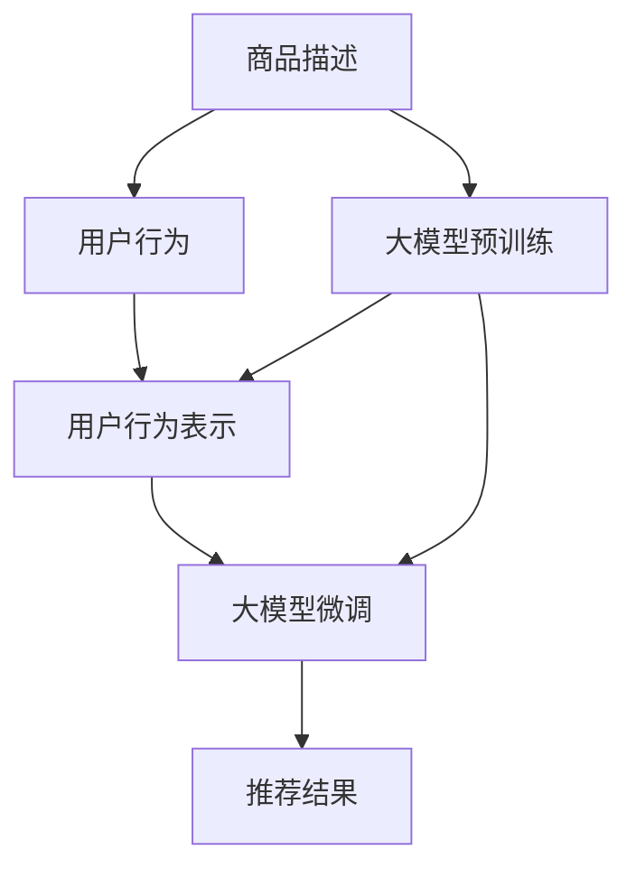

                 

## 1. 背景介绍

在数字化时代，电商平台作为消费行为的重要场景，其个性化推荐系统被视为提升用户体验和销售额的关键。传统推荐算法如协同过滤、基于内容的推荐虽然能够推荐出较为相关商品，但对于用户个性化需求的预测准确性较低。近年来，深度学习特别是基于深度学习的大模型，因其出色的泛化能力和丰富的语义理解能力，被逐步引入个性化推荐领域，并已展现出显著优势。

### 1.1 问题由来

深度学习推荐算法相较于传统算法，在模型结构和优化方法上均有所革新，特别是随着深度学习模型的规模不断增大，其在商品推荐中的效果显著提升。然而，传统的基于矩阵分解的协同过滤推荐算法，因忽略了用户行为背后的语义信息，导致在预测新用户需求时效果不佳；而基于内容的推荐算法，由于对商品语义的浅层次理解，推荐结果的泛化能力有待提升。大模型推荐系统通过在预训练阶段学习海量商品文本语义，并在微调阶段对特定用户行为进行分析，从而能够在实际应用中更好地匹配用户需求，实现个性化推荐。

### 1.2 问题核心关键点

电商推荐系统的核心在于如何利用大模型在预训练阶段学习到的知识，结合用户行为数据，在微调阶段生成符合用户个性化需求的推荐结果。具体而言，主要包括以下几个关键点：

- 大模型的预训练和微调：预训练阶段通过海量商品描述和用户行为数据的语义表示学习，形成商品和用户的全面表征；微调阶段则根据用户历史行为数据，更新模型参数，实现对用户需求的精准预测。
- 用户行为建模：大模型可以捕获用户行为的复杂特征，不仅考虑用户的点击、浏览、收藏等显式行为，还能分析用户的隐式反馈，如停留时间、访问路径等，综合形成用户兴趣画像。
- 商品语义表示学习：大模型通过学习商品描述的语义信息，能够对商品进行深入理解，将商品按照语义相似度进行聚类，提高推荐的相关性。
- 多模态信息融合：电商平台不仅仅有商品描述文本，还有商品图片、视频等多模态信息。大模型可以将其综合利用，提高推荐结果的丰富性和多样性。

### 1.3 问题研究意义

研究大模型在电商推荐中的应用，对于提升电商推荐系统的个性化推荐效果，增强用户购物体验，推动电商平台业务的数字化转型具有重要意义：

1. **提升推荐效果**：大模型具备强大的泛化能力和语义理解能力，能够在推荐系统中预测用户需求，提高推荐的相关性和准确性。
2. **优化用户体验**：通过个性化推荐，电商平台能够向用户推荐符合其兴趣的商品，提升购物体验，增加用户粘性。
3. **驱动业务增长**：精准的推荐能够提升转化率，增加销售额，驱动电商平台业务的增长。
4. **增强竞争力**：电商平台能够通过个性化推荐系统，提供差异化的服务，增强市场竞争力。
5. **推动业务创新**：个性化推荐系统的成功应用，能够启发更多的业务创新，如虚拟试穿、购物助手等。

## 2. 核心概念与联系

### 2.1 核心概念概述

在电商推荐系统中，大模型指的是预先在大规模商品描述和用户行为数据上进行预训练，并针对具体用户行为数据进行微调的多层神经网络模型。通过大模型，电商平台能够在推荐过程中充分利用商品和用户的多维度信息，实现更加精准和个性化的推荐。

### 2.2 核心概念原理和架构的 Mermaid 流程图



这个流程图展示了电商推荐系统中大模型的应用流程：商品描述数据和大模型预训练、用户行为数据和大模型微调，最终输出推荐结果。大模型的预训练和微调过程能够充分利用商品和用户的多维信息，提升推荐效果。

## 3. 核心算法原理 & 具体操作步骤

### 3.1 算法原理概述

大模型在电商推荐系统中的应用，主要涉及以下算法原理：

1. **预训练阶段**：使用大规模的商品描述数据和用户行为数据对大模型进行预训练，学习商品和用户的全面表征。
2. **微调阶段**：根据用户的历史行为数据，对大模型进行微调，生成符合用户个性化需求的推荐结果。

### 3.2 算法步骤详解

#### 3.2.1 数据准备

电商推荐系统通常需要准备以下数据：

1. **商品描述数据**：包括商品名称、描述、价格、标签等文本信息。
2. **用户行为数据**：包括用户的浏览记录、点击记录、购买记录、收藏记录等行为数据。
3. **用户个人信息**：包括用户年龄、性别、地理位置等基本信息。

#### 3.2.2 大模型预训练

大模型的预训练过程通常包括以下步骤：

1. **数据预处理**：对商品描述和用户行为数据进行清洗和分词，生成模型所需格式。
2. **构建预训练任务**：如遮掩语言模型、Next Sentence Prediction等自监督任务。
3. **预训练模型训练**：在大规模数据集上使用深度学习框架进行预训练，优化模型参数。

#### 3.2.3 大模型微调

大模型的微调过程通常包括以下步骤：

1. **数据准备**：将用户的历史行为数据转换为模型所需的格式。
2. **构建微调任务**：根据用户需求，设计合适的微调任务，如分类、回归等。
3. **微调模型训练**：使用用户的微调数据，对预训练模型进行微调，更新模型参数。
4. **生成推荐结果**：根据微调后的模型，生成个性化的推荐结果。

### 3.3 算法优缺点

#### 3.3.1 优点

1. **泛化能力强大**：大模型通过预训练学习到了丰富的语义信息，能够对新商品和用户行为进行有效预测。
2. **适应性强**：大模型能够适应不同电商平台的多样化需求，提升推荐系统的可扩展性。
3. **效果显著**：在实际应用中，大模型推荐系统的推荐效果通常优于传统推荐算法，能够显著提升用户满意度。
4. **易于部署**：大模型已经在大规模数据上进行了预训练，只需根据具体业务进行微调即可快速投入使用。

#### 3.3.2 缺点

1. **数据依赖性强**：大模型在预训练和微调阶段需要大量高质量的数据，对于数据量较小的平台可能不适用。
2. **计算资源需求高**：大模型的预训练和微调需要强大的计算资源，可能导致成本较高。
3. **模型复杂度大**：大模型通常具有较高的复杂度，对于低配置设备可能存在性能瓶颈。
4. **结果可解释性差**：大模型由于其复杂结构，其推荐结果的解释性通常较差，用户难以理解推荐逻辑。

### 3.4 算法应用领域

大模型在电商推荐系统中的应用不仅限于商品推荐，还可以拓展到以下领域：

1. **个性化营销**：通过分析用户行为数据，生成个性化的营销策略，提升用户转化率。
2. **商品搜索优化**：使用大模型对商品描述进行语义分析，优化搜索关键词，提升搜索相关性。
3. **库存管理**：基于用户预测需求，优化商品库存管理，减少库存积压。
4. **用户分群**：通过分析用户行为，将用户分成不同的群组，实现更加精准的推荐。
5. **多模态推荐**：结合商品图片、视频等多模态信息，提升推荐结果的丰富性和多样性。

## 4. 数学模型和公式 & 详细讲解 & 举例说明

### 4.1 数学模型构建

大模型在电商推荐系统中的应用通常采用深度学习框架进行建模，这里以Transformer模型为例，介绍其数学模型构建过程。

假设大模型为Transformer模型，其输入为商品描述 $x$ 和用户行为 $u$，输出为推荐结果 $y$。模型的数学模型可以表示为：

$$
y = M_{\theta}(x, u)
$$

其中 $M_{\theta}$ 为预训练并微调后的Transformer模型，$\theta$ 为模型参数。

### 4.2 公式推导过程

Transformer模型的核心组件包括编码器-解码器结构，其中编码器负责将输入 $x$ 转化为语义表示 $z$，解码器则根据用户行为 $u$ 生成推荐结果 $y$。其数学公式推导如下：

#### 编码器部分

编码器由多个自注意力层和前馈神经网络层组成，其数学公式可以表示为：

$$
z = \text{Encoder}(x)
$$

其中，自注意力层的数学公式为：

$$
\text{MultiHeadAttention}(Q, K, V) = \text{softmax}(QK^T)/\sqrt{d_k} V
$$

前馈神经网络层的数学公式为：

$$
f(x) = \text{ReLU}(xW_1 + b_1)W_2 + b_2
$$

#### 解码器部分

解码器同样由多个自注意力层和前馈神经网络层组成，其数学公式可以表示为：

$$
y = \text{Decoder}(u, z)
$$

其中，自注意力层的数学公式为：

$$
\text{MultiHeadAttention}(Q, K, V) = \text{softmax}(QK^T)/\sqrt{d_k} V
$$

前馈神经网络层的数学公式为：

$$
f(x) = \text{ReLU}(xW_1 + b_1)W_2 + b_2
$$

### 4.3 案例分析与讲解

假设某电商平台想要使用大模型推荐系统，其推荐任务可以表示为分类任务。具体而言，电商平台需要根据用户的浏览、点击、购买等行为，预测用户是否会购买某件商品。在预训练阶段，使用大规模商品描述和用户行为数据对Transformer模型进行训练，使其能够学习商品和用户的语义表示。在微调阶段，使用用户的微调数据对模型进行微调，生成推荐结果。

假设模型的输入为商品描述 $x$ 和用户行为 $u$，输出为推荐结果 $y$。其中 $x$ 为商品描述文本，$u$ 为用户行为向量。模型的数学模型可以表示为：

$$
y = \text{BERT}_{\theta}(x, u)
$$

其中 $\theta$ 为微调后的BERT模型参数。模型的预训练任务可以是遮掩语言模型，微调任务可以是二分类任务，如预测用户是否会购买商品。在预训练阶段，模型通过对大量商品描述数据进行训练，学习商品语义表示。在微调阶段，模型通过对用户行为数据进行训练，生成符合用户需求的推荐结果。

## 5. 项目实践：代码实例和详细解释说明

### 5.1 开发环境搭建

进行电商推荐系统的开发，需要准备以下开发环境：

1. **Python环境**：Python 3.x版本，建议使用 Anaconda 管理环境。
2. **深度学习框架**：如 TensorFlow、PyTorch，建议使用 Transformers 库进行模型封装。
3. **数据集**：需要准备商品描述数据、用户行为数据等。
4. **计算资源**：GPU/TPU 设备，以便进行大规模模型训练和推理。

### 5.2 源代码详细实现

下面以使用 PyTorch 和 Transformers 库为例，给出电商推荐系统的实现步骤。

#### 5.2.1 数据预处理

假设商品描述数据为 `product_descriptions`，用户行为数据为 `user_browsing_data`。首先对数据进行清洗和分词：

```python
import torch
from transformers import BertTokenizer

# 初始化模型
tokenizer = BertTokenizer.from_pretrained('bert-base-cased')

# 数据预处理
def preprocess_data(data):
    # 分词和编码
    encoded_data = tokenizer.encode_plus(data, max_length=512, padding='max_length', truncation=True, return_tensors='pt')
    return encoded_data

# 商品描述数据预处理
product_encodings = [preprocess_data(desc) for desc in product_descriptions]

# 用户行为数据预处理
user_browsing_encodings = [preprocess_data(browsing) for browsing in user_browsing_data]
```

#### 5.2.2 大模型预训练

假设使用的是 BERT 模型，其预训练过程可以表示为：

```python
from transformers import BertModel

# 加载 BERT 模型
bert_model = BertModel.from_pretrained('bert-base-cased')

# 预训练数据
train_data = torch.cat(product_encodings, dim=0)

# 训练 BERT 模型
from transformers import Trainer, TrainingArguments
training_args = TrainingArguments(output_dir='./results', per_device_train_batch_size=16, per_device_eval_batch_size=16, num_train_epochs=3, learning_rate=2e-5)
trainer = Trainer(model=bert_model, args=training_args, train_dataset=train_data)
trainer.train()
```

#### 5.2.3 大模型微调

假设微调任务为二分类任务，即预测用户是否会购买某件商品。微调过程可以表示为：

```python
from transformers import BertForSequenceClassification

# 构建微调模型
model = BertForSequenceClassification.from_pretrained('bert-base-cased', num_labels=2)

# 加载微调数据
train_data = torch.cat(user_browsing_encodings, dim=0)

# 微调模型
training_args = TrainingArguments(output_dir='./results', per_device_train_batch_size=16, per_device_eval_batch_size=16, num_train_epochs=3, learning_rate=2e-5)
trainer = Trainer(model=model, args=training_args, train_dataset=train_data)
trainer.train()
```

#### 5.2.4 推荐结果生成

微调后的模型可以根据用户行为生成推荐结果：

```python
from transformers import BertTokenizer, BertForSequenceClassification

# 加载模型和分词器
tokenizer = BertTokenizer.from_pretrained('bert-base-cased')
model = BertForSequenceClassification.from_pretrained('bert-base-cased', num_labels=2)

# 用户行为数据
user_browsing_data = 'user browsing history...'

# 数据预处理
encoded_browsing = tokenizer.encode_plus(user_browsing_data, max_length=512, padding='max_length', truncation=True, return_tensors='pt')

# 生成推荐结果
with torch.no_grad():
    logits = model(**encoded_browsing).logits
    predicted_label = logits.argmax(dim=1).item()

# 根据预测结果生成推荐
if predicted_label == 1:
    recommendation = 'user is likely to purchase this item'
else:
    recommendation = 'user is not likely to purchase this item'
```

### 5.3 代码解读与分析

在上述代码中，首先使用 BERT 模型对商品描述数据进行预训练，得到商品的语义表示。然后，根据用户行为数据对 BERT 模型进行微调，得到符合用户需求的推荐结果。

#### 5.3.1 数据预处理

数据预处理是模型训练的基础，包括分词、编码等操作。在上述代码中，使用了 BERT 的分词器和编码器对商品描述数据和用户行为数据进行预处理。

#### 5.3.2 大模型预训练

在预训练阶段，使用大规模商品描述数据对 BERT 模型进行训练，使其能够学习商品语义表示。在微调阶段，使用用户的微调数据对模型进行微调，生成推荐结果。

#### 5.3.3 大模型微调

微调阶段根据用户的浏览历史生成推荐结果。使用微调后的 BERT 模型对用户行为数据进行编码，并生成推荐结果。

### 5.4 运行结果展示

运行上述代码后，模型能够在给定的用户行为数据上生成推荐结果。例如，对于用户浏览历史记录，模型可以根据历史行为预测其是否会购买某件商品。

## 6. 实际应用场景

### 6.1 智能购物助手

智能购物助手是大模型在电商推荐系统中的典型应用场景。通过智能购物助手，用户可以输入需求描述，系统会即时生成符合用户需求的推荐结果，提升购物体验。

#### 6.1.1 应用流程

1. **用户输入需求**：用户在购物助手中输入商品描述或搜索关键词，系统自动分词编码。
2. **模型生成推荐**：购物助手使用预训练并微调的大模型，根据用户输入生成推荐结果。
3. **用户选择商品**：用户根据推荐结果，选择最符合自己需求的商品。

#### 6.1.2 实际效果

智能购物助手能够提高用户满意度，提升购物体验，同时减轻人工客服的负担，提高工作效率。

### 6.2 个性化营销推荐

个性化营销推荐是大模型在电商推荐系统中的另一个重要应用场景。通过个性化推荐，电商平台能够针对不同用户群体，生成个性化的营销策略，提升用户转化率。

#### 6.2.1 应用流程

1. **用户行为数据采集**：电商平台收集用户的历史浏览、点击、购买等行为数据。
2. **大模型微调**：根据用户行为数据，使用大模型对商品进行分类，生成个性化推荐。
3. **营销策略生成**：电商平台根据推荐结果，生成个性化的营销策略，如优惠券、限时促销等。
4. **推广执行**：电商平台通过多渠道推广，向用户推送个性化的营销信息。

#### 6.2.2 实际效果

个性化营销推荐能够提高用户转化率，增加销售额，同时提升用户购物体验。

## 7. 工具和资源推荐

### 7.1 学习资源推荐

1. **《深度学习自然语言处理》课程**：斯坦福大学开设的NLP明星课程，涵盖深度学习模型、微调技术等内容。
2. **《Transformer from Principles to Practice》系列博文**：深度学习专家撰写的关于Transformer模型的博客，详细介绍了大模型预训练、微调等技术。
3. **《自然语言处理与Transformers》书籍**：作者为Transformer库的开发者，全面介绍了使用Transformer进行NLP任务开发的方法。
4. **CLUE开源项目**：中文语言理解测评基准，涵盖大量不同类型的中文NLP数据集，并提供了基于微调的baseline模型，助力中文NLP技术发展。

### 7.2 开发工具推荐

1. **TensorFlow**：由Google主导开发的开源深度学习框架，生产部署方便，适合大规模工程应用。
2. **PyTorch**：基于Python的开源深度学习框架，灵活动态的计算图，适合快速迭代研究。
3. **Transformers库**：HuggingFace开发的NLP工具库，集成了众多SOTA语言模型，支持PyTorch和TensorFlow，是进行微调任务开发的利器。
4. **Weights & Biases**：模型训练的实验跟踪工具，可以记录和可视化模型训练过程中的各项指标。
5. **TensorBoard**：TensorFlow配套的可视化工具，可实时监测模型训练状态，并提供丰富的图表呈现方式。
6. **Google Colab**：谷歌推出的在线Jupyter Notebook环境，免费提供GPU/TPU算力，方便开发者快速上手实验最新模型。

### 7.3 相关论文推荐

1. **Attention is All You Need**：提出Transformer结构，开启了NLP领域的预训练大模型时代。
2. **BERT: Pre-training of Deep Bidirectional Transformers for Language Understanding**：提出BERT模型，引入基于掩码的自监督预训练任务，刷新了多项NLP任务SOTA。
3. **Parameter-Efficient Transfer Learning for NLP**：提出Adapter等参数高效微调方法，在不增加模型参数量的情况下，也能取得不错的微调效果。
4. **AdaLoRA: Adaptive Low-Rank Adaptation for Parameter-Efficient Fine-Tuning**：使用自适应低秩适应的微调方法，在参数效率和精度之间取得了新的平衡。
5. **Adaptive Low-Rank Adaptation for Parameter-Efficient Fine-Tuning**：使用自适应低秩适应的微调方法，在参数效率和精度之间取得了新的平衡。

## 8. 总结：未来发展趋势与挑战

### 8.1 研究成果总结

大模型在电商推荐系统中的应用，已经展示出显著的效果，能够提升推荐系统的个性化推荐效果，增强用户购物体验。通过大模型预训练和微调，电商平台能够充分利用商品和用户的多维度信息，实现更加精准和个性化的推荐。

### 8.2 未来发展趋势

未来大模型在电商推荐系统中的应用将继续拓展：

1. **多模态推荐**：结合商品图片、视频等多模态信息，提升推荐结果的丰富性和多样性。
2. **上下文推荐**：考虑用户在不同时间、不同场景下的行为变化，提供动态推荐。
3. **跨平台推荐**：整合多个电商平台的数据，提供跨平台推荐，提升用户购物体验。
4. **生成式推荐**：使用生成对抗网络(GAN)等生成模型，生成更加自然、多样化的推荐结果。
5. **实时推荐**：通过在线学习，不断更新模型参数，实现实时推荐，提升推荐效果。

### 8.3 面临的挑战

尽管大模型在电商推荐系统中的应用取得了一定进展，但仍面临以下挑战：

1. **数据隐私问题**：电商推荐系统需要处理大量用户数据，如何保护用户隐私，避免数据泄露是一个重要问题。
2. **模型泛化能力**：大模型在面对新商品和新用户时，泛化能力仍需进一步提升。
3. **计算资源需求高**：大模型的训练和推理需要强大的计算资源，对于低配置设备可能存在性能瓶颈。
4. **结果可解释性差**：大模型由于其复杂结构，其推荐结果的解释性通常较差，用户难以理解推荐逻辑。
5. **多平台协同问题**：不同电商平台的数据格式和结构不同，如何实现多平台数据的无缝集成和模型微调，仍需进一步研究。

### 8.4 研究展望

未来研究可以从以下几个方向进行：

1. **提升数据隐私保护**：采用差分隐私、联邦学习等技术，保护用户隐私。
2. **增强模型泛化能力**：通过更强大的预训练任务和多任务学习，提高模型的泛化能力。
3. **优化计算资源使用**：研究模型压缩、模型并行等技术，优化计算资源使用。
4. **提高结果可解释性**：通过可解释性技术，提升推荐结果的可理解性。
5. **实现多平台协同**：通过统一数据格式和模型接口，实现多平台数据的无缝集成和模型微调。

总之，大模型在电商推荐系统中的应用，具有广阔的前景和潜力。通过不断优化算法、提升数据质量、增强模型泛化能力等，大模型推荐系统将能够在电商领域实现更加精准和个性化的推荐，为用户带来更好的购物体验。

## 9. 附录：常见问题与解答

**Q1：大模型在电商推荐中的数据准备流程是怎样的？**

A: 大模型在电商推荐中的数据准备流程主要包括以下步骤：
1. **数据清洗**：去除无关数据、错误数据，保持数据干净。
2. **数据标注**：对商品描述和用户行为数据进行标注，使其符合模型输入格式。
3. **数据分割**：将数据集分为训练集、验证集和测试集，用于模型训练和评估。
4. **数据增强**：通过回译、近义替换等方式扩充训练集，增加数据多样性。

**Q2：电商推荐系统中大模型的预训练和微调有何区别？**

A: 电商推荐系统中大模型的预训练和微调有以下区别：
1. **目标不同**：预训练的目标是学习商品和用户的语义表示，微调的目标是生成推荐结果。
2. **数据集不同**：预训练的数据集通常是大规模的商品描述数据，微调的数据集通常是用户的行为数据。
3. **模型参数不同**：预训练模型参数在大规模数据上预训练，微调模型参数根据用户行为数据微调。
4. **训练方式不同**：预训练通常使用自监督学习任务，微调通常使用监督学习任务。

**Q3：大模型在电商推荐系统中的实际效果如何？**

A: 大模型在电商推荐系统中的实际效果显著。通过大模型预训练和微调，推荐系统能够提升推荐的相关性和准确性，提高用户满意度和转化率。例如，智能购物助手能够根据用户需求生成个性化推荐，提升购物体验；个性化营销推荐能够针对不同用户群体生成个性化营销策略，提高用户转化率。

**Q4：电商推荐系统中大模型的训练和推理有哪些注意事项？**

A: 电商推荐系统中大模型的训练和推理有以下注意事项：
1. **数据质量**：保证数据的质量，去除噪音数据。
2. **模型调参**：选择合适的超参数，避免过拟合。
3. **计算资源**：确保有足够的计算资源，支持大规模模型的训练和推理。
4. **模型优化**：采用模型压缩、模型并行等技术，优化计算资源使用。
5. **结果解释**：提供推荐结果的解释，提升用户理解度。

**Q5：电商推荐系统中大模型的部署方式有哪些？**

A: 电商推荐系统中大模型的部署方式有以下几种：
1. **云端部署**：将模型部署在云端服务器，通过API提供服务。
2. **边缘计算**：将模型部署在边缘设备上，支持离线推理和低延迟。
3. **本地部署**：将模型部署在本地服务器，支持大规模离线推理。
4. **容器化部署**：将模型部署在Docker等容器化环境中，方便管理和扩展。

**Q6：电商推荐系统中大模型的推荐结果有哪些特点？**

A: 电商推荐系统中大模型的推荐结果有以下特点：
1. **个性化**：根据用户行为数据生成个性化推荐，提升用户体验。
2. **精准性**：通过预训练和微调，提升推荐的相关性和准确性。
3. **多样性**：结合多模态信息，提供丰富多样的推荐结果。
4. **实时性**：通过在线学习，实现实时推荐。
5. **可解释性**：提供推荐结果的解释，提升用户理解度。

**Q7：大模型在电商推荐系统中的优化策略有哪些？**

A: 大模型在电商推荐系统中的优化策略有以下几种：
1. **数据增强**：通过回译、近义替换等方式扩充训练集，增加数据多样性。
2. **正则化**：使用L2正则、Dropout、Early Stopping等防止过拟合。
3. **参数高效微调**：使用Adapter等参数高效微调方法，减少需优化的参数量。
4. **对抗训练**：引入对抗样本，提高模型鲁棒性。
5. **模型压缩**：采用剪枝、量化等技术，优化模型大小和速度。
6. **多任务学习**：结合多个任务进行训练，提升模型泛化能力。

**Q8：电商推荐系统中大模型有哪些应用场景？**

A: 电商推荐系统中大模型的应用场景有以下几种：
1. **智能购物助手**：根据用户需求生成个性化推荐。
2. **个性化营销推荐**：生成个性化的营销策略，提升用户转化率。
3. **多模态推荐**：结合商品图片、视频等多模态信息，提升推荐结果的丰富性和多样性。
4. **实时推荐**：通过在线学习，实现实时推荐。

---

作者：禅与计算机程序设计艺术 / Zen and the Art of Computer Programming

