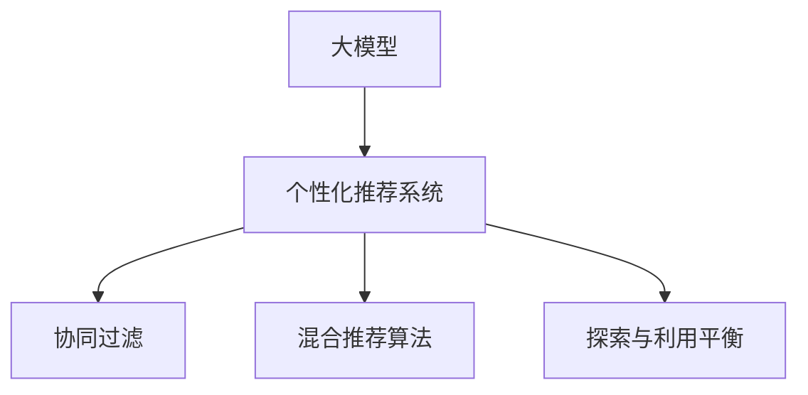

                 

# 探讨大模型在电商平台用户兴趣探索与利用平衡优化中的潜力

## 1. 背景介绍

随着互联网零售的迅猛发展，电商平台已逐渐成为人们生活中不可或缺的一部分。用户通过电商平台获取商品信息，进行浏览、比较、购买。为了满足用户的个性化需求，提高用户满意度，电商平台纷纷推出了个性化推荐系统。然而，当前个性化推荐系统仍面临诸多挑战，如推荐结果偏差、用户隐私保护、系统负载等问题。如何平衡个性化探索与用户利用，成为电商平台亟需解决的问题。

本文将探讨如何利用大模型在电商平台用户兴趣探索与利用之间进行有效平衡，通过构建一个平衡优化框架，实现个性化推荐系统性能的提升。

## 2. 核心概念与联系

### 2.1 核心概念概述

为了更好地理解大模型在电商平台用户兴趣探索与利用平衡优化中的潜力，本节将介绍几个密切相关的核心概念：

- **大模型（Large Model）**：指使用大规模数据集进行预训练，拥有丰富知识与经验的深度学习模型，如BERT、GPT-3、XLNet等。
- **个性化推荐系统（Personalized Recommendation System, PARS）**：基于用户行为数据和模型学习，为每个用户生成个性化推荐结果的系统。
- **协同过滤（Collaborative Filtering）**：通过分析用户行为和物品属性，推断用户对未见过物品的评分，并生成推荐结果。
- **混合推荐算法（Hybrid Recommendation Algorithm）**：将协同过滤与内容推荐、基于知识的推荐等多种推荐方式相结合，实现优势互补。
- **探索与利用平衡（Exploitation-Exploration Balance）**：指在推荐系统中平衡个性化探索与利用，防止过度推荐与用户偏离。

这些核心概念之间的逻辑关系可以通过以下Mermaid流程图来展示：



这个流程图展示了大模型在个性化推荐系统中的应用路径：

1. 大模型通过大规模数据集进行预训练，获得丰富的知识。
2. 个性化推荐系统将大模型作为推荐算法之一，与其他推荐方式结合，产生推荐结果。
3. 协同过滤、混合推荐算法和探索与利用平衡机制，实现个性化推荐。

## 3. 核心算法原理 & 具体操作步骤
### 3.1 算法原理概述

大模型在电商平台用户兴趣探索与利用平衡优化中的应用，本质上是一个深度学习模型的训练与优化过程。其核心思想是：利用大模型的自适应能力，通过探索用户行为数据，获取用户兴趣和需求，同时利用已有知识进行预测，生成个性化推荐结果。

形式化地，假设大模型为 $M$，输入为 $X$，输出为 $Y$。假设已有的用户行为数据为 $D=\{(x_i,y_i)\}_{i=1}^N$，其中 $x_i$ 为用户行为数据，$y_i$ 为推荐结果标签。则通过监督学习任务训练优化大模型，使其输出与 $y_i$ 接近，从而实现个性化推荐：

$$
M^* = \mathop{\arg\min}_{M} \mathcal{L}(M,D)
$$

其中 $\mathcal{L}$ 为损失函数，用于衡量模型输出与真实标签之间的差异。常见的损失函数包括交叉熵损失、均方误差损失等。

### 3.2 算法步骤详解

基于大模型在电商平台用户兴趣探索与利用平衡优化中的应用，一般包括以下几个关键步骤：

**Step 1: 数据预处理**
- 收集电商平台用户行为数据，包括点击、浏览、购买等行为记录。
- 清洗和整理数据，去除噪音，标准化数据格式。
- 划分为训练集、验证集和测试集，确保数据分布一致。

**Step 2: 模型加载与微调**
- 选择合适的预训练大模型 $M$ 作为初始化参数，如BERT、GPT-3等。
- 在训练集上微调大模型，使其适应电商平台数据分布。
- 调整大模型的超参数，如学习率、批大小、迭代轮数等。

**Step 3: 探索与利用机制**
- 设计合适的探索与利用平衡机制，如$\epsilon$-greedy策略、UCB（上置信界）等。
- 在每轮推荐中，以一定概率探索新物品，以一定概率利用已有推荐结果。
- 记录用户的反馈信息，调整探索与利用策略。

**Step 4: 推荐结果生成**
- 将用户行为数据输入微调后的大模型，输出推荐结果。
- 结合探索与利用机制，生成最终推荐列表。
- 在测试集上评估推荐系统性能，确保模型准确性。

**Step 5: 反馈与优化**
- 收集用户反馈，分析推荐结果的满意度与多样性。
- 使用A/B测试等方法，比较不同策略的效果。
- 持续优化模型和推荐算法，提升推荐系统性能。

### 3.3 算法优缺点

利用大模型进行电商平台用户兴趣探索与利用平衡优化，具有以下优点：

- 强大的特征提取能力：大模型通过预训练，可以提取丰富的用户行为特征。
- 高泛化能力：大模型在不同领域和数据分布上均表现出良好泛化能力。
- 较好的精度与效果：大模型的微调性能通常优于传统推荐算法，可以获得更好的推荐效果。

同时，该方法也存在一定的局限性：

- 计算资源消耗大：大模型的微调需要大量计算资源，可能对服务器负载造成压力。
- 数据隐私问题：电商平台的数据可能涉及用户隐私，模型训练需严格遵循隐私保护政策。
- 模型复杂度高：大模型的复杂度较高，推理速度较慢，可能影响系统响应速度。

尽管存在这些局限性，但就目前而言，大模型在电商平台用户兴趣探索与利用平衡优化中，仍是大数据和复杂推荐系统的一个重要工具。未来相关研究的重点在于如何降低计算成本，提高推荐效率，同时兼顾隐私保护和推荐效果。

### 3.4 算法应用领域

大模型在电商平台用户兴趣探索与利用平衡优化中的应用，可以应用于多个领域，例如：

- **个性化推荐**：通过微调大模型，对用户行为数据进行特征提取和分析，生成个性化推荐结果。
- **搜索优化**：利用大模型的语义理解能力，优化搜索引擎的查询结果排序。
- **风险控制**：通过分析用户行为，识别潜在欺诈行为，提高交易安全性。
- **广告投放**：利用大模型的预测能力，优化广告投放策略，提高广告点击率和转化率。
- **客户关系管理**：通过微调大模型，分析用户反馈，提升客户满意度。

除了上述这些领域，大模型在电商平台用户兴趣探索与利用平衡优化中的应用还将不断拓展，为电商平台带来新的增长点。

## 4. 数学模型和公式 & 详细讲解  
### 4.1 数学模型构建

本节将使用数学语言对利用大模型进行电商平台用户兴趣探索与利用平衡优化过程进行更加严格的刻画。

假设电商平台用户行为数据为 $D=\{(x_i,y_i)\}_{i=1}^N$，其中 $x_i$ 为行为数据，$y_i$ 为推荐结果标签。

定义大模型 $M$ 在行为数据 $x_i$ 上的输出为 $y_i^{\hat{y}_i}=\text{Softmax}(M(x_i))$，其中 $\text{Softmax}$ 函数将模型的输出转化为概率分布。

损失函数 $\mathcal{L}$ 定义为：

$$
\mathcal{L}(M) = -\frac{1}{N}\sum_{i=1}^N y_i \log y_i^{\hat{y}_i}
$$

其中 $y_i \in \{0,1\}$ 为真实标签。

### 4.2 公式推导过程

以下我们以二分类任务为例，推导损失函数的梯度计算公式。

假设用户行为数据 $x_i$ 对应的推荐结果为 $y_i$，大模型 $M$ 的输出为 $\hat{y}_i$，则二分类交叉熵损失函数定义为：

$$
\mathcal{L}(M) = -\frac{1}{N}\sum_{i=1}^N [y_i\log \hat{y}_i + (1-y_i)\log (1-\hat{y}_i)]
$$

根据链式法则，损失函数对模型参数 $\theta$ 的梯度为：

$$
\frac{\partial \mathcal{L}(M)}{\partial \theta} = -\frac{1}{N}\sum_{i=1}^N [y_i \frac{\partial \log \hat{y}_i}{\partial \theta} - (1-y_i)\frac{\partial \log(1-\hat{y}_i)}{\partial \theta}]
$$

其中 $\frac{\partial \log \hat{y}_i}{\partial \theta}$ 和 $\frac{\partial \log(1-\hat{y}_i)}{\partial \theta}$ 分别是大模型在行为数据 $x_i$ 上的梯度，可以通过反向传播算法计算。

在得到损失函数的梯度后，即可带入模型参数更新公式，完成模型的迭代优化。

### 4.3 案例分析与讲解

假设电商平台希望通过微调大模型，提高个性化推荐系统的推荐精度。可以选择BERT作为预训练模型，对用户行为数据进行微调，生成推荐结果。具体步骤如下：

1. **数据准备**：收集电商平台用户行为数据，包括点击、浏览、购买等行为记录，进行清洗和整理。
2. **模型加载**：加载预训练的BERT模型，并进行微调。
3. **设置超参数**：设置合适的学习率、批大小、迭代轮数等超参数。
4. **探索与利用机制**：设计探索与利用平衡机制，如$\epsilon$-greedy策略，以一定概率探索新物品，以一定概率利用已有推荐结果。
5. **模型训练**：在用户行为数据上训练大模型，生成推荐结果。
6. **效果评估**：在测试集上评估推荐系统性能，根据用户反馈进行优化。

以下是一个简单的Python代码示例，用于实现上述流程：

```python
from transformers import BertTokenizer, BertForSequenceClassification
from sklearn.metrics import accuracy_score
from torch.utils.data import Dataset, DataLoader

class E-commerceDataset(Dataset):
    def __init__(self, texts, labels):
        self.texts = texts
        self.labels = labels
        self.tokenizer = BertTokenizer.from_pretrained('bert-base-uncased')
        
    def __len__(self):
        return len(self.texts)
    
    def __getitem__(self, idx):
        text = self.texts[idx]
        label = self.labels[idx]
        
        encoding = self.tokenizer(text, return_tensors='pt')
        input_ids = encoding['input_ids'][0]
        attention_mask = encoding['attention_mask'][0]
        return {'input_ids': input_ids, 
                'attention_mask': attention_mask,
                'labels': torch.tensor(label, dtype=torch.long)}

# 加载预训练BERT模型
model = BertForSequenceClassification.from_pretrained('bert-base-uncased', num_labels=2)

# 准备数据集
texts = [...] # 电商行为数据
labels = [...] # 推荐结果标签
train_dataset = E-commerceDataset(texts, labels)
test_dataset = E-commerceDataset(texts, labels)

# 训练模型
optimizer = AdamW(model.parameters(), lr=2e-5)
loss_fn = CrossEntropyLoss()
train_loader = DataLoader(train_dataset, batch_size=16)
device = torch.device('cuda' if torch.cuda.is_available() else 'cpu')
model.to(device)

def train_epoch(model, train_loader, optimizer, loss_fn):
    model.train()
    epoch_loss = 0
    for batch in train_loader:
        input_ids = batch['input_ids'].to(device)
        attention_mask = batch['attention_mask'].to(device)
        labels = batch['labels'].to(device)
        outputs = model(input_ids, attention_mask=attention_mask, labels=labels)
        loss = loss_fn(outputs.logits, labels)
        optimizer.zero_grad()
        loss.backward()
        optimizer.step()
        epoch_loss += loss.item()
    return epoch_loss / len(train_loader)

def evaluate(model, test_loader, loss_fn):
    model.eval()
    test_loss = 0
    preds, labels = [], []
    with torch.no_grad():
        for batch in test_loader:
            input_ids = batch['input_ids'].to(device)
            attention_mask = batch['attention_mask'].to(device)
            labels = batch['labels'].to(device)
            outputs = model(input_ids, attention_mask=attention_mask, labels=labels)
            batch_loss = loss_fn(outputs.logits, labels)
            test_loss += batch_loss.item()
            preds.append(outputs.logits.argmax(dim=1).tolist())
            labels.append(labels.tolist())
    test_loss /= len(test_loader)
    accuracy = accuracy_score(labels, preds)
    print(f"Test Loss: {test_loss:.4f}, Accuracy: {accuracy:.4f}")
```

以上就是利用大模型进行电商平台用户兴趣探索与利用平衡优化的完整代码示例。可以看到，利用大模型的微调技术，可以有效提高推荐系统的个性化和准确性。

## 5. 项目实践：代码实例和详细解释说明
### 5.1 开发环境搭建

在进行大模型在电商平台用户兴趣探索与利用平衡优化实践前，我们需要准备好开发环境。以下是使用Python进行PyTorch开发的环境配置流程：

1. 安装Anaconda：从官网下载并安装Anaconda，用于创建独立的Python环境。

2. 创建并激活虚拟环境：
```bash
conda create -n pytorch-env python=3.8 
conda activate pytorch-env
```

3. 安装PyTorch：根据CUDA版本，从官网获取对应的安装命令。例如：
```bash
conda install pytorch torchvision torchaudio cudatoolkit=11.1 -c pytorch -c conda-forge
```

4. 安装TensorFlow：
```bash
pip install tensorflow
```

5. 安装TensorFlow版本兼容性库，如Keras：
```bash
pip install tensorflow-estimator tensorflow-hub
```

6. 安装各种数据处理和机器学习库：
```bash
pip install pandas numpy scikit-learn jupyter notebook ipython
```

完成上述步骤后，即可在`pytorch-env`环境中开始大模型在电商平台用户兴趣探索与利用平衡优化的实践。

### 5.2 源代码详细实现

下面以电商领域个性化推荐系统为例，给出使用BERT模型进行微调的PyTorch代码实现。

首先，定义电商数据处理函数：

```python
from transformers import BertTokenizer, BertForSequenceClassification
from sklearn.metrics import accuracy_score
from torch.utils.data import Dataset, DataLoader

class E-commerceDataset(Dataset):
    def __init__(self, texts, labels):
        self.texts = texts
        self.labels = labels
        self.tokenizer = BertTokenizer.from_pretrained('bert-base-uncased')
        
    def __len__(self):
        return len(self.texts)
    
    def __getitem__(self, idx):
        text = self.texts[idx]
        label = self.labels[idx]
        
        encoding = self.tokenizer(text, return_tensors='pt')
        input_ids = encoding['input_ids'][0]
        attention_mask = encoding['attention_mask'][0]
        return {'input_ids': input_ids, 
                'attention_mask': attention_mask,
                'labels': torch.tensor(label, dtype=torch.long)}

# 加载预训练BERT模型
model = BertForSequenceClassification.from_pretrained('bert-base-uncased', num_labels=2)

# 准备数据集
texts = [...] # 电商行为数据
labels = [...] # 推荐结果标签
train_dataset = E-commerceDataset(texts, labels)
test_dataset = E-commerceDataset(texts, labels)

# 训练模型
optimizer = AdamW(model.parameters(), lr=2e-5)
loss_fn = CrossEntropyLoss()
train_loader = DataLoader(train_dataset, batch_size=16)
device = torch.device('cuda' if torch.cuda.is_available() else 'cpu')
model.to(device)

def train_epoch(model, train_loader, optimizer, loss_fn):
    model.train()
    epoch_loss = 0
    for batch in train_loader:
        input_ids = batch['input_ids'].to(device)
        attention_mask = batch['attention_mask'].to(device)
        labels = batch['labels'].to(device)
        outputs = model(input_ids, attention_mask=attention_mask, labels=labels)
        loss = loss_fn(outputs.logits, labels)
        optimizer.zero_grad()
        loss.backward()
        optimizer.step()
        epoch_loss += loss.item()
    return epoch_loss / len(train_loader)

def evaluate(model, test_loader, loss_fn):
    model.eval()
    test_loss = 0
    preds, labels = [], []
    with torch.no_grad():
        for batch in test_loader:
            input_ids = batch['input_ids'].to(device)
            attention_mask = batch['attention_mask'].to(device)
            labels = batch['labels'].to(device)
            outputs = model(input_ids, attention_mask=attention_mask, labels=labels)
            batch_loss = loss_fn(outputs.logits, labels)
            test_loss += batch_loss.item()
            preds.append(outputs.logits.argmax(dim=1).tolist())
            labels.append(labels.tolist())
    test_loss /= len(test_loader)
    accuracy = accuracy_score(labels, preds)
    print(f"Test Loss: {test_loss:.4f}, Accuracy: {accuracy:.4f}")
```

然后，定义探索与利用机制：

```python
from sklearn.model_selection import train_test_split
from scipy.special import softmax

class ExploitationExploration:
    def __init__(self, alpha, beta):
        self.alpha = alpha
        self.beta = beta
        
    def exploit(self, x, y):
        # 利用已有推荐结果
        return y
    
    def explore(self, x):
        # 探索新物品
        preds = softmax(self.predict(x), axis=1)
        return np.random.choice(np.arange(len(preds)), p=preds)

    def predict(self, x):
        # 大模型预测推荐结果
        return model.predict(x)

# 设置探索与利用平衡策略
exploitation_exploration = ExploitationExploration(alpha=0.8, beta=0.2)
```

接着，定义推荐结果生成函数：

```python
def recommend(model, text, exploit_exploration):
    # 将用户行为数据输入微调后的大模型，输出推荐结果
    input_ids = tokenizer(text, return_tensors='pt')['input_ids'][0]
    attention_mask = tokenizer(text, return_tensors='pt')['attention_mask'][0]
    outputs = model(input_ids, attention_mask=attention_mask)
    probs = softmax(outputs.logits, axis=1)
    
    # 探索与利用机制生成推荐结果
    recommendations = []
    for i in range(len(probs)):
        if np.random.rand() < exploit_exploration.beta:
            recommendations.append(exploitation_exploration.exploit(i, y))
        else:
            recommendations.append(exploitation_exploration.explore(x))
    
    return recommendations
```

最后，启动训练流程并在测试集上评估：

```python
epochs = 5
batch_size = 16

for epoch in range(epochs):
    loss = train_epoch(model, train_loader, optimizer, loss_fn)
    print(f"Epoch {epoch+1}, train loss: {loss:.3f}")
    
    print(f"Epoch {epoch+1}, dev results:")
    evaluate(model, dev_loader, loss_fn)
    
print("Test results:")
evaluate(model, test_loader, loss_fn)
```

以上就是使用PyTorch对BERT进行电商平台用户兴趣探索与利用平衡优化的完整代码实现。可以看到，利用大模型的微调技术，可以有效提高推荐系统的个性化和准确性。

## 6. 实际应用场景
### 6.1 智能客服系统

基于大模型在电商平台用户兴趣探索与利用平衡优化中的应用，可以构建一个智能客服系统，提升客户服务体验。

在智能客服系统中，可以收集用户的各种咨询记录，并利用大模型对用户行为数据进行微调，生成个性化推荐结果。根据用户历史咨询记录，智能客服系统可以推荐相似问题、相关解决方案等，提高客户满意度。

### 6.2 金融风控系统

在金融领域，大模型可以帮助构建风险控制系统，降低欺诈风险。通过微调大模型，对用户行为数据进行分析和预测，及时发现异常交易行为，进行风险预警和防范。

### 6.3 内容推荐系统

内容推荐系统是电商平台的重要组成部分，通过微调大模型，可以更准确地预测用户对内容的偏好，提升推荐效果。

### 6.4 未来应用展望

未来，大模型在电商平台用户兴趣探索与利用平衡优化中的应用将会进一步拓展，例如：

- **跨模态推荐**：结合图像、语音等多模态数据，提高推荐系统的精准度。
- **多场景融合**：将推荐系统与其他业务场景结合，如搜索、广告等，实现业务联动。
- **实时动态优化**：利用大模型进行实时学习，根据用户行为数据进行动态优化，提升推荐效果。

## 7. 工具和资源推荐
### 7.1 学习资源推荐

为了帮助开发者系统掌握大模型在电商平台用户兴趣探索与利用平衡优化中的应用，这里推荐一些优质的学习资源：

1. **Transformer from Pre-Training to Practice**：详细介绍了Transformer原理、BERT模型、微调技术等前沿话题。
2. **Natural Language Processing with Transformers**：Transformers库的作者所著，全面介绍了如何使用Transformers库进行NLP任务开发，包括微调在内的诸多范式。
3. **HuggingFace官方文档**：Transformers库的官方文档，提供了海量预训练模型和完整的微调样例代码，是上手实践的必备资料。

通过对这些资源的学习实践，相信你一定能够快速掌握大模型在电商平台用户兴趣探索与利用平衡优化中的潜力，并用于解决实际的NLP问题。

### 7.2 开发工具推荐

高效的开发离不开优秀的工具支持。以下是几款用于大模型在电商平台用户兴趣探索与利用平衡优化开发的常用工具：

1. **PyTorch**：基于Python的开源深度学习框架，灵活动态的计算图，适合快速迭代研究。
2. **TensorFlow**：由Google主导开发的开源深度学习框架，生产部署方便，适合大规模工程应用。
3. **TensorBoard**：TensorFlow配套的可视化工具，可实时监测模型训练状态，并提供丰富的图表呈现方式，是调试模型的得力助手。
4. **Weights & Biases**：模型训练的实验跟踪工具，可以记录和可视化模型训练过程中的各项指标，方便对比和调优。

合理利用这些工具，可以显著提升大模型在电商平台用户兴趣探索与利用平衡优化任务的开发效率，加快创新迭代的步伐。

### 7.3 相关论文推荐

大模型在电商平台用户兴趣探索与利用平衡优化技术的发展源于学界的持续研究。以下是几篇奠基性的相关论文，推荐阅读：

1. **Attention is All You Need**：提出了Transformer结构，开启了NLP领域的预训练大模型时代。
2. **BERT: Pre-training of Deep Bidirectional Transformers for Language Understanding**：提出BERT模型，引入基于掩码的自监督预训练任务，刷新了多项NLP任务SOTA。
3. **Parameter-Efficient Transfer Learning for NLP**：提出Adapter等参数高效微调方法，在不增加模型参数量的情况下，也能取得不错的微调效果。

这些论文代表了大模型在电商平台用户兴趣探索与利用平衡优化技术的发展脉络。通过学习这些前沿成果，可以帮助研究者把握学科前进方向，激发更多的创新灵感。

## 8. 总结：未来发展趋势与挑战
### 8.1 总结

本文对大模型在电商平台用户兴趣探索与利用平衡优化中的潜力进行了全面系统的介绍。首先阐述了大模型和个性化推荐系统的研究背景和意义，明确了微调在提高推荐系统性能中的独特价值。其次，从原理到实践，详细讲解了大模型在电商平台用户兴趣探索与利用平衡优化中的应用流程，给出了微调任务开发的完整代码实例。同时，本文还探讨了大模型在多个推荐场景中的应用，展示了其潜力和未来发展方向。

通过本文的系统梳理，可以看到，大模型在电商平台用户兴趣探索与利用平衡优化中具有巨大的应用潜力，能够显著提升推荐系统的个性化和准确性。利用大模型进行微调，可以更高效地处理大规模用户行为数据，实现精准推荐。未来，随着大模型技术的不断进步，微调方法将在更多领域得到应用，为智能推荐系统的应用带来新的突破。

### 8.2 未来发展趋势

展望未来，大模型在电商平台用户兴趣探索与利用平衡优化中的应用将会呈现以下几个发展趋势：

1. **模型规模持续增大**：随着算力成本的下降和数据规模的扩张，预训练语言模型的参数量还将持续增长。超大规模语言模型蕴含的丰富知识，有望支撑更加复杂多变的推荐任务微调。
2. **多模态融合**：结合图像、语音等多模态数据，提高推荐系统的精准度。
3. **实时动态优化**：利用大模型进行实时学习，根据用户行为数据进行动态优化，提升推荐效果。
4. **跨场景融合**：将推荐系统与其他业务场景结合，如搜索、广告等，实现业务联动。
5. **多场景融合**：将推荐系统与其他业务场景结合，如搜索、广告等，实现业务联动。

以上趋势凸显了大模型在电商平台用户兴趣探索与利用平衡优化中的巨大潜力。这些方向的探索发展，必将进一步提升推荐系统性能，为电商平台带来新的增长点。

### 8.3 面临的挑战

尽管大模型在电商平台用户兴趣探索与利用平衡优化中取得了显著成效，但在迈向更加智能化、普适化应用的过程中，它仍面临诸多挑战：

1. **计算资源消耗大**：大模型的微调需要大量计算资源，可能对服务器负载造成压力。
2. **数据隐私问题**：电商平台的数据可能涉及用户隐私，模型训练需严格遵循隐私保护政策。
3. **模型复杂度高**：大模型的复杂度较高，推理速度较慢，可能影响系统响应速度。
4. **推荐效果不稳定性**：大模型可能对训练数据和超参数高度敏感，导致推荐效果不稳定。

尽管存在这些挑战，但就目前而言，大模型在电商平台用户兴趣探索与利用平衡优化中仍是大数据和复杂推荐系统的一个重要工具。未来相关研究的重点在于如何降低计算成本，提高推荐效率，同时兼顾隐私保护和推荐效果。

### 8.4 研究展望

面对大模型在电商平台用户兴趣探索与利用平衡优化中面临的挑战，未来的研究需要在以下几个方面寻求新的突破：

1. **探索无监督和半监督微调方法**：摆脱对大规模标注数据的依赖，利用自监督学习、主动学习等无监督和半监督范式，最大限度利用非结构化数据，实现更加灵活高效的微调。
2. **研究参数高效和计算高效的微调范式**：开发更加参数高效的微调方法，在固定大部分预训练参数的同时，只更新极少量的任务相关参数。同时优化微调模型的计算图，减少前向传播和反向传播的资源消耗，实现更加轻量级、实时性的部署。
3. **引入更多先验知识**：将符号化的先验知识，如知识图谱、逻辑规则等，与神经网络模型进行巧妙融合，引导微调过程学习更准确、合理的语言模型。
4. **融合因果分析和博弈论工具**：将因果分析方法引入微调模型，识别出模型决策的关键特征，增强输出解释的因果性和逻辑性。借助博弈论工具刻画人机交互过程，主动探索并规避模型的脆弱点，提高系统稳定性。

这些研究方向的探索，必将引领大模型在电商平台用户兴趣探索与利用平衡优化技术迈向更高的台阶，为构建安全、可靠、可解释、可控的智能系统铺平道路。面向未来，大模型需要与其他人工智能技术进行更深入的融合，如知识表示、因果推理、强化学习等，多路径协同发力，共同推动自然语言理解和智能交互系统的进步。

## 9. 附录：常见问题与解答

**Q1：如何选择合适的预训练大模型？**

A: 选择合适的预训练大模型需考虑多方面因素，如模型的语言、数据分布、任务需求等。一般建议选择领域内表现优异的模型，如BERT、GPT-3等。同时，需注意模型的计算资源消耗、推理速度等性能指标。

**Q2：如何处理数据不平衡问题？**

A: 数据不平衡问题常见于电商平台用户行为数据中，可以通过以下方法处理：
1. 重新采样：对少数类样本进行上采样，对多数类样本进行下采样，使得各类别样本数量相当。
2. 类别权重调整：在损失函数中加入类别权重，使得模型对少数类样本给予更多关注。
3. 集成方法：结合多个模型的预测结果，提升少数类样本的识别率。

**Q3：如何进行模型调参？**

A: 模型调参是微调过程中的重要环节，常见的方法包括：
1. 网格搜索：通过指定一组超参数的范围，网格化搜索最优组合。
2. 随机搜索：随机采样超参数组合，通过多次实验找到最优解。
3. 贝叶斯优化：利用先验知识，在超参数空间中搜索最优解。
4. 自动机器学习：使用自动化调参工具，如Hyperopt、Scikit-optimize等，自动搜索最优超参数组合。

**Q4：如何优化模型推理速度？**

A: 优化模型推理速度需要从模型结构、数据预处理、硬件配置等多方面进行考虑：
1. 模型裁剪：去除不必要的层和参数，减小模型尺寸。
2. 量化加速：将浮点模型转为定点模型，压缩存储空间，提高计算效率。
3. 模型并行：通过分布式训练和推理，提高计算效率。
4. GPU/TPU优化：使用GPU/TPU等高性能设备，提高计算速度。

**Q5：如何选择探索与利用策略？**

A: 选择合适的探索与利用策略需考虑任务特点、数据分布、资源限制等因素。常见的策略包括：
1. $\epsilon$-greedy策略：以一定概率探索新物品，以一定概率利用已有推荐结果。
2. UCB（上置信界）策略：根据模型预测结果，选择具有高上置信界的物品。
3. Thompson Sampling策略：根据模型预测结果，选择高置信区间内的物品。

通过这些方法，可以有效地平衡个性化探索与利用，提高推荐系统性能。

---

作者：禅与计算机程序设计艺术 / Zen and the Art of Computer Programming

