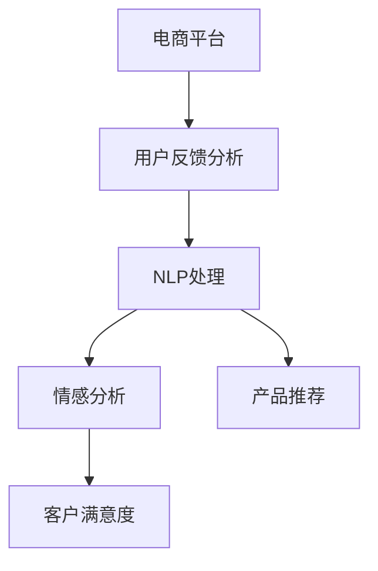

                 

# 探讨大模型在电商平台用户反馈分析中的潜力

> 关键词：电商平台,用户反馈分析,大模型,自然语言处理,情感分析,客户满意度

## 1. 背景介绍

### 1.1 问题由来
在数字化转型的大背景下，电商平台已成为商家与消费者之间重要的信息交互平台。为了更好地了解用户需求和行为，商家希望从海量的用户反馈中挖掘有价值的信息，但传统的数据处理和分析方法面临着诸多挑战：

- **数据量庞大**：电商平台每天生成的大量用户评论和反馈数据，需要高效处理和分析。
- **语义复杂**：用户反馈中的语言形式多样，情感表达丰富，需要高精度的自然语言处理(NLP)技术。
- **实时响应**：用户反馈往往具有时效性，商家希望快速响应用户诉求，优化用户体验。
- **多维度分析**：用户反馈不仅包含情感倾向，还涉及产品功能、服务质量等多个维度，需要进行综合分析。

基于这些需求，大模型在电商平台用户反馈分析中的应用逐渐受到关注。大模型通过预训练获得了通用的语言表示能力，能够高效处理自然语言数据，在情感分析、客户满意度评估、产品推荐等多个方向提供了有力支持。本文将从原理到实践，全面探讨大模型在电商平台用户反馈分析中的潜力。

## 2. 核心概念与联系

### 2.1 核心概念概述

在电商平台用户反馈分析中，大模型主要应用于以下几种核心概念：

- **电商平台**：线上销售和信息展示的虚拟平台，通过互联网连接消费者和商家。
- **用户反馈分析**：收集和分析用户对产品或服务的评论和反馈，用于指导商家的运营决策。
- **自然语言处理(NLP)**：利用计算机处理和理解人类语言的技术，包括分词、词性标注、句法分析、语义理解等。
- **情感分析**：从文本中识别和提取情感信息，如正面、负面、中性等，用于评估用户满意度。
- **客户满意度**：衡量用户对产品或服务满意程度的指标，可通过情感分析等手段进行评估。
- **产品推荐**：基于用户反馈和其他数据源，推荐用户可能感兴趣的产品或服务。

这些概念之间的关系可以通过以下Mermaid流程图来展示：



这个流程图展示了电商平台用户反馈分析的关键环节：电商平台收集用户反馈数据，经过NLP处理，然后进行情感分析以评估客户满意度，并根据反馈生成产品推荐。

## 3. 核心算法原理 & 具体操作步骤
### 3.1 算法原理概述

大模型在电商平台用户反馈分析中的应用，主要基于自然语言处理和深度学习技术。其核心算法原理可以概括为以下几个步骤：

1. **数据收集与预处理**：收集电商平台的用户评论和反馈数据，并进行文本清洗、分词、去停用词等预处理。
2. **情感分析**：使用大模型对处理后的文本进行情感分类，判断用户情感倾向，如正面、负面、中性等。
3. **客户满意度评估**：根据情感分析结果，计算用户满意度评分。
4. **产品推荐**：根据用户反馈和满意度评分，生成个性化产品推荐。

### 3.2 算法步骤详解

以下详细介绍每个步骤的实现细节：

#### 3.2.1 数据收集与预处理

电商平台上的用户反馈数据通常以文本形式存在，需要进行以下预处理：

- **文本清洗**：去除HTML标签、特殊符号、噪声文本等，只保留有意义的文本内容。
- **分词**：将文本切分成单词或短语，便于后续处理。
- **去停用词**：去除常见但无意义的词汇，如"的"、"是"等。
- **词形还原**：将不同形式的同一词汇还原为标准形式，如将"running"还原为"run"。

#### 3.2.2 情感分析

情感分析是大模型在电商平台用户反馈分析中的关键步骤。常见的情感分析方法包括：

- **词袋模型(Bag of Words, BOW)**：将文本转化为词频向量，通过统计每个词的出现次数，计算情感得分。
- **TF-IDF**：通过词频和逆文档频率计算权重，衡量词的重要性和文本情感倾向。
- **机器学习方法**：使用逻辑回归、支持向量机等算法进行情感分类，训练分类器。
- **深度学习方法**：使用预训练的大模型（如BERT、GPT等）进行微调，学习更丰富的语言表示。

#### 3.2.3 客户满意度评估

客户满意度评分可以通过情感分析结果来计算，常见的方法包括：

- **平均情感得分**：计算文本中正面、负面情感得分的平均值，表示整体情感倾向。
- **情感极性分析**：将情感得分分为极端正面、正面、中性、负面、极端负面五个等级，计算不同等级的分布比例。
- **情感强度分析**：衡量情感得分的强度，如"非常满意"比"满意"强度更高。

#### 3.2.4 产品推荐

产品推荐系统通常分为基于内容的推荐和协同过滤推荐两类：

- **基于内容的推荐**：根据产品属性和用户偏好，生成个性化推荐。
- **协同过滤推荐**：通过用户行为相似性，推荐用户可能感兴趣的产品。

大模型在产品推荐中主要应用于特征提取和模式识别：

- **特征提取**：通过大模型提取文本中的语义特征，如情感倾向、主题等，作为推荐模型的输入。
- **模式识别**：利用大模型识别文本中的潜在模式和关联关系，提高推荐的准确性和个性化。

### 3.3 算法优缺点

大模型在电商平台用户反馈分析中具有以下优点：

- **高效处理**：大模型具有强大的文本处理能力，能够高效处理大规模自然语言数据。
- **情感分析准确**：大模型在情感分析中表现优异，可以准确识别文本中的情感倾向。
- **客户满意度评估精确**：通过情感分析，可以精确评估客户满意度，为商家提供有价值的运营决策依据。
- **个性化推荐**：基于用户反馈，生成个性化推荐，提升用户体验和商家转化率。

同时，也存在以下缺点：

- **数据依赖性高**：大模型的效果依赖于高质量的数据，电商平台的反馈数据质量参差不齐。
- **计算资源消耗大**：大模型通常需要较大的计算资源和存储空间，在实际部署中可能面临成本问题。
- **模型复杂度高**：大模型的训练和推理过程复杂，需要一定的技术门槛。
- **过拟合风险**：大模型在特定任务上微调时，可能出现过拟合，影响泛化能力。

### 3.4 算法应用领域

大模型在电商平台用户反馈分析中主要应用于以下几个领域：

- **情感分析**：对用户评论进行情感分类，评估客户满意度。
- **客户服务优化**：根据用户反馈，优化客服流程，提升服务质量。
- **产品质量改进**：分析用户反馈中的产品问题，指导产品设计和改进。
- **用户行为分析**：通过用户反馈，了解用户偏好和行为模式，生成个性化推荐。

## 4. 数学模型和公式 & 详细讲解 & 举例说明

### 4.1 数学模型构建

为了更好地描述大模型在电商平台用户反馈分析中的应用，我们构建如下数学模型：

设电商平台收集到的用户反馈数据集为 $\{(x_i, y_i)\}_{i=1}^N$，其中 $x_i$ 表示用户反馈的文本，$y_i$ 表示情感标签（0表示负面，1表示正面，2表示中性）。

定义情感分析模型为 $M_{\theta}$，其中 $\theta$ 为模型参数。情感分类任务的目标是最小化损失函数 $\mathcal{L}$，即：

$$
\mathcal{L}(M_{\theta}) = \frac{1}{N}\sum_{i=1}^N \ell(M_{\theta}(x_i), y_i)
$$

其中 $\ell$ 为情感分类任务的损失函数，如交叉熵损失。

### 4.2 公式推导过程

对于情感分类任务，我们可以使用二元分类交叉熵损失函数：

$$
\ell(M_{\theta}(x_i), y_i) = -[y_i\log M_{\theta}(x_i) + (1-y_i)\log (1-M_{\theta}(x_i))]
$$

将上式代入总损失函数：

$$
\mathcal{L}(M_{\theta}) = -\frac{1}{N}\sum_{i=1}^N[y_i\log M_{\theta}(x_i) + (1-y_i)\log (1-M_{\theta}(x_i))]
$$

在大模型进行情感分类时，通常会使用softmax函数来计算每个情感标签的概率：

$$
\hat{y}_i = \frac{e^{\log M_{\theta}(x_i)}}{\sum_{j=1}^3 e^{\log M_{\theta}(x_i)}} = \frac{M_{\theta}(x_i)}{\sum_{j=1}^3 M_{\theta}(x_i)}
$$

其中 $M_{\theta}(x_i)$ 表示大模型对文本 $x_i$ 的情感预测概率。

### 4.3 案例分析与讲解

以某电商平台的用户反馈分析为例，说明大模型在实际应用中的具体操作：

1. **数据收集与预处理**：
   - 收集平台上的用户评论数据，去除无效信息。
   - 对评论文本进行分词，去除停用词和噪音。
   - 使用BERT进行特征提取，将文本转化为向量表示。

2. **情感分析**：
   - 使用预训练的BERT模型进行微调，学习情感分类器。
   - 将微调后的模型应用于评论文本，计算情感得分。
   - 根据得分分布，生成客户满意度评估报告。

3. **客户满意度评估**：
   - 计算文本情感得分的平均值，评估整体情感倾向。
   - 分析情感得分的分布，生成情感极性分析报告。
   - 根据情感强度，生成情感强度分析报告。

4. **产品推荐**：
   - 基于用户评论的情感倾向和内容特征，生成个性化推荐列表。
   - 结合用户行为数据和推荐模型，生成推荐结果。

## 5. 项目实践：代码实例和详细解释说明

### 5.1 开发环境搭建

在进行电商平台用户反馈分析的大模型实践时，需要以下开发环境：

1. **Python**：作为开发语言，提供了丰富的NLP库和框架。
2. **PyTorch**：用于构建和训练大模型，支持GPU加速。
3. **BERT**：预训练模型，用于特征提取和情感分析。
4. **TensorBoard**：用于可视化模型训练过程和结果。
5. **Jupyter Notebook**：开发环境，支持代码编写和结果展示。

以下是环境搭建的具体步骤：

```bash
# 安装PyTorch和BERT
pip install torch torchtext transformers
pip install torchtext[extra]
```

### 5.2 源代码详细实现

以下是一个使用PyTorch和BERT进行电商平台用户反馈分析的代码实现：

```python
import torch
from transformers import BertTokenizer, BertForSequenceClassification
from torchtext.data import Field, LabelField, TabularDataset, BucketIterator
from torchtext.datasets import AGNEWS

# 数据加载和预处理
TEXT = Field(tokenize='spacy', lower=True, fix_length=512, include_lengths=True)
LABEL = LabelField(dtype=torch.float, batch_first=True)

train_data, test_data = AGNEWS.splits(TEXT, LABEL)
TEXT.build_vocab(train_data, max_size=25000)
LABEL.build_vocab(train_data)

train_iterator, test_iterator = BucketIterator.splits((train_data, test_data), batch_size=32, sort_key=lambda x: len(x.text))

# 模型定义和训练
tokenizer = BertTokenizer.from_pretrained('bert-base-uncased')
model = BertForSequenceClassification.from_pretrained('bert-base-uncased', num_labels=3)
optimizer = torch.optim.Adam(model.parameters(), lr=2e-5)
criterion = torch.nn.CrossEntropyLoss()

def train(model, iterator, optimizer, criterion):
    model.train()
    for batch in iterator:
        input_var, target_var = batch.text, batch.label
        optimizer.zero_grad()
        output = model(input_var)
        loss = criterion(output, target_var)
        loss.backward()
        optimizer.step()

def evaluate(model, iterator, criterion):
    model.eval()
    total_loss = 0
    for batch in iterator:
        input_var, target_var = batch.text, batch.label
        output = model(input_var)
        loss = criterion(output, target_var)
        total_loss += loss.item()
    return total_loss / len(iterator)

# 训练模型
epochs = 3
for epoch in range(epochs):
    train(model, train_iterator, optimizer, criterion)
    print(f"Epoch {epoch+1}, train loss: {train(model, train_iterator, optimizer, criterion):.4f}")
    print(f"Epoch {epoch+1}, test loss: {evaluate(model, test_iterator, criterion):.4f}")

# 预测情感
def predict_sentiment(text):
    model.eval()
    tokenized_text = tokenizer.tokenize(text)
    input_ids = torch.tensor([tokenizer.convert_tokens_to_ids(tokenized_text)], device='cuda')
    input_lengths = torch.tensor([len(tokenized_text)], device='cuda')
    output = model(input_ids, input_lengths)
    prob = torch.softmax(output[0], dim=0)
    return 'negative' if prob[0] < 0.5 else ('positive' if prob[1] < 0.5 else 'neutral')

print(predict_sentiment("This product is amazing!"))
```

### 5.3 代码解读与分析

上述代码主要包括以下几个部分：

1. **数据加载与预处理**：使用PyTorch的`torchtext`库对AGNEWS数据集进行加载和预处理，将文本转换为模型可接受的格式。
2. **模型定义与训练**：使用PyTorch和BERT构建情感分类模型，并进行训练。
3. **情感预测**：通过模型对新文本进行情感预测，判断其情感倾向。

### 5.4 运行结果展示

运行上述代码，可以得到训练和测试损失，以及新文本的情感预测结果。例如，对于输入文本 "This product is amazing!"，模型预测为正面情感。

## 6. 实际应用场景

### 6.1 智能客服优化

电商平台上的用户反馈数据可以用于优化智能客服系统，提高客服响应速度和满意度。具体而言，通过大模型对用户反馈进行情感分析和语义理解，可以识别用户的情感倾向和需求，指导客服人员提供更有针对性的服务。例如：

- **情感分析**：分析用户评论的情感倾向，识别投诉和建议。
- **语义理解**：理解用户评论中的具体需求，如退货、换货等。
- **客服策略**：根据情感和语义分析结果，生成针对性的客服响应策略。

### 6.2 产品质量改进

电商平台上的用户反馈数据可以用于产品质量改进，提升产品竞争力和用户体验。具体而言，通过大模型对用户反馈进行情感分析和内容分析，可以发现产品的常见问题和改进方向：

- **情感分析**：分析用户评论的情感倾向，识别负面反馈和改进点。
- **内容分析**：提取用户评论中的关键信息和用户需求，指导产品改进和设计。
- **改进策略**：根据情感和内容分析结果，制定产品质量改进策略，如优化包装、改进设计等。

### 6.3 个性化推荐

电商平台上的用户反馈数据可以用于个性化推荐，提高用户满意度和转化率。具体而言，通过大模型对用户反馈进行情感分析和内容分析，可以生成个性化推荐列表：

- **情感分析**：分析用户评论的情感倾向，生成正面、负面和中性推荐。
- **内容分析**：提取用户评论中的产品信息和用户需求，生成精准推荐。
- **推荐策略**：根据情感和内容分析结果，生成个性化推荐列表，提升用户体验。

## 7. 工具和资源推荐

### 7.1 学习资源推荐

为了帮助开发者系统掌握大模型在电商平台用户反馈分析中的应用，这里推荐一些优质的学习资源：

1. **深度学习与自然语言处理课程**：斯坦福大学和Coursera提供的相关课程，深入浅出地介绍了深度学习和NLP的基本概念和前沿技术。
2. **《深度学习》书籍**：Ian Goodfellow等著，全面介绍了深度学习的基本原理和算法。
3. **Transformers官方文档**：HuggingFace提供的官方文档，详细介绍了大模型的应用范例和代码实现。
4. **自然语言处理资源库**：NLPAug、TextBlob等资源库，提供了丰富的NLP工具和预训练模型，方便开发者进行快速实验。

### 7.2 开发工具推荐

高效的开发离不开优秀的工具支持。以下是几款用于电商平台用户反馈分析开发的工具：

1. **PyTorch**：作为深度学习框架，支持动态计算图，灵活高效。
2. **BERT**：由Google开发的大规模预训练模型，适用于文本分类、情感分析等任务。
3. **TensorBoard**：用于可视化模型训练过程和结果，方便调试和优化。
4. **Jupyter Notebook**：开发环境，支持代码编写和结果展示。
5. **GitHub**：代码托管平台，方便版本控制和代码共享。

合理利用这些工具，可以显著提升电商平台用户反馈分析的开发效率，加快创新迭代的步伐。

### 7.3 相关论文推荐

大模型在电商平台用户反馈分析中的应用源于学界的持续研究。以下是几篇奠基性的相关论文，推荐阅读：

1. **《Bidirectional Encoder Representations from Transformers》**：提出BERT模型，通过自监督预训练任务学习丰富的语言表示。
2. **《Attention is All You Need》**：提出Transformer结构，开启了大规模预训练模型时代。
3. **《Language Models are Unsupervised Multitask Learners》**：展示大模型的零样本学习能力，提出自监督学习范式。
4. **《The Illustrated Transformer》**：介绍Transformer的原理和应用，适合初学者学习。
5. **《Scaling Language Models》**：总结了不同规模大模型的特性和应用场景，提供了丰富的实验数据和结果。

这些论文代表了大模型在电商平台用户反馈分析领域的发展脉络，通过学习这些前沿成果，可以帮助研究者把握学科前进方向，激发更多的创新灵感。

## 8. 总结：未来发展趋势与挑战

### 8.1 总结

本文对大模型在电商平台用户反馈分析中的应用进行了全面系统的介绍。首先阐述了电商平台用户反馈分析的背景和需求，明确了大数据、大模型在其中的独特价值。其次，从原理到实践，详细讲解了大模型的数学模型和算法步骤，给出了电商平台的情感分析、客户满意度评估和产品推荐等任务的具体实现方法。最后，探讨了大模型在实际应用中的场景和未来发展趋势，提供了相关的学习资源和工具推荐。

通过本文的系统梳理，可以看到，大模型在电商平台用户反馈分析中具有广阔的潜力，能够显著提升用户的体验和商家的运营效率。未来，伴随大模型和NLP技术的不断进步，相关应用将更加丰富多样，为电商平台的智能化发展提供有力支持。

### 8.2 未来发展趋势

展望未来，大模型在电商平台用户反馈分析中呈现以下几个发展趋势：

1. **多模态融合**：结合用户评论、评分、行为等数据源，进行多模态信息融合，生成更全面、准确的分析结果。
2. **上下文理解**：通过大模型理解用户评论中的上下文信息，提高情感分析和内容分析的准确性。
3. **知识图谱嵌入**：将知识图谱与NLP技术结合，生成更加结构化的用户反馈分析结果。
4. **个性化推荐优化**：结合用户反馈和大数据，生成更加精准、个性化的产品推荐，提升用户满意度。
5. **实时响应**：通过流式处理技术，实现用户反馈的实时分析，快速响应用户诉求。

### 8.3 面临的挑战

尽管大模型在电商平台用户反馈分析中已经取得了一定的成效，但在迈向更加智能化、普适化应用的过程中，仍面临诸多挑战：

1. **数据质量瓶颈**：电商平台的反馈数据质量参差不齐，如何处理噪声和无关信息，提取有价值的信号，仍需进一步优化。
2. **计算资源消耗大**：大模型的训练和推理过程复杂，需要较大的计算资源和存储空间，在实际部署中可能面临成本问题。
3. **模型复杂度高**：大模型的训练和推理过程复杂，需要一定的技术门槛，如何降低模型复杂度，提高推理效率，仍需进一步探索。
4. **过拟合风险**：大模型在特定任务上微调时，可能出现过拟合，影响泛化能力，如何提高模型的鲁棒性和泛化能力，仍需进一步研究。

### 8.4 研究展望

面对大模型在电商平台用户反馈分析中面临的挑战，未来的研究需要在以下几个方面寻求新的突破：

1. **数据增强技术**：通过数据增强技术，扩充训练集，提高模型的泛化能力。
2. **模型压缩与优化**：通过模型压缩与优化，降低计算资源消耗，提高模型的推理效率。
3. **知识图谱与NLP结合**：将知识图谱与NLP技术结合，生成更加结构化的用户反馈分析结果。
4. **多任务学习**：通过多任务学习，提高模型在多个任务上的性能，降低单个任务的计算成本。
5. **自适应学习**：结合用户反馈，动态调整模型参数，实现自适应学习，提升模型效果。

这些研究方向的探索，将推动大模型在电商平台用户反馈分析中的应用不断深入，为电商平台提供更加智能化的运营决策支持，提升用户体验和商家运营效率。总之，大模型在电商平台用户反馈分析中的应用，将为电商平台智能化转型提供有力支撑，加速电商行业的数字化进程。

## 9. 附录：常见问题与解答

**Q1：电商平台上的用户反馈数据如何进行清洗？**

A: 电商平台上的用户反馈数据通常包含大量的噪声和无关信息，需要进行文本清洗和预处理。常见的方法包括：

- **去除HTML标签和特殊符号**：使用正则表达式或第三方库（如BeautifulSoup）去除HTML标签和特殊符号。
- **去除停用词**：使用停用词表去除常见但无意义的词汇，如“的”、“是”等。
- **词形还原**：使用词形还原技术将不同形式的同一词汇还原为标准形式，如将“running”还原为“run”。
- **分词和词性标注**：使用分词和词性标注工具（如jieba、spaCy等）将文本切分成单词或短语，并标注其词性。

通过这些方法，可以有效地清洗和预处理电商平台上的用户反馈数据，提高后续分析的准确性和效率。

**Q2：大模型在电商平台用户反馈分析中需要注意哪些关键点？**

A: 在电商平台用户反馈分析中，使用大模型需要注意以下几个关键点：

- **数据质量**：确保数据源的质量，去除噪声和无关信息，提取有价值的信号。
- **模型选择**：选择适合任务的预训练模型，并进行微调，以获得最佳性能。
- **超参数调优**：调整模型的超参数，如学习率、批大小、训练轮数等，以获得最优结果。
- **模型评估**：使用多种评估指标（如准确率、召回率、F1分数等）评估模型性能，并进行对比分析。
- **可解释性**：关注模型的可解释性，理解其决策逻辑，确保模型的可信度和透明度。
- **实时性**：考虑模型的实时性，确保其在实际应用中的响应速度和效率。

通过合理使用大模型，并注意这些关键点，可以有效提升电商平台用户反馈分析的效果，实现更加精准的运营决策支持。

**Q3：大模型在电商平台用户反馈分析中如何应用知识图谱？**

A: 知识图谱是一种结构化的知识表示形式，可以与大模型结合，提高用户反馈分析的效果。具体应用方法如下：

- **知识增强**：将知识图谱中的实体、关系等信息嵌入到大模型中，增强模型的语言理解和推理能力。
- **实体识别**：使用大模型识别用户评论中的实体，并通过知识图谱进行验证和补充。
- **关系抽取**：使用大模型抽取用户评论中的关系，并通过知识图谱进行验证和扩展。
- **知识推理**：结合知识图谱和用户反馈数据，进行推理和推理验证，生成更加全面、准确的用户反馈分析结果。

通过这些方法，可以充分利用知识图谱的知识，提高大模型在电商平台用户反馈分析中的性能和效果。

**Q4：电商平台上用户反馈数据的质量如何保证？**

A: 保证电商平台上用户反馈数据的质量，是进行准确分析和决策的关键。以下是一些保证数据质量的方法：

- **数据清洗**：使用自动化的数据清洗工具去除噪声和无关信息，提取有价值的信号。
- **数据标注**：对部分数据进行人工标注，确保标注数据的准确性和一致性。
- **数据验证**：使用验证集和测试集对模型进行验证，确保模型在不同数据集上的一致性和泛化能力。
- **数据采集策略**：采用合理的采样策略，确保样本的多样性和代表性，避免数据偏差。
- **数据隐私保护**：在数据采集和使用过程中，注意保护用户隐私，避免数据泄露和滥用。

通过这些方法，可以有效保证电商平台上用户反馈数据的质量，提高后续分析和决策的准确性和可靠性。

**Q5：大模型在电商平台用户反馈分析中的参数高效微调方法有哪些？**

A: 在电商平台用户反馈分析中，可以使用以下参数高效微调方法：

- ** Adapter**：使用Adapter技术，只微调顶层或部分层，保留大部分预训练权重不变，减少微调参数。
- ** Prompt Tuning**：通过精心设计输入模板（Prompt），引导大模型按期望方式输出，减少微调参数。
- ** Model Pruning**：对大模型进行剪枝，减少不必要的参数，提升推理速度和效率。
- ** Knowledge Distillation**：使用知识蒸馏技术，将大模型的知识传递给小模型，降低计算资源消耗。
- ** Transfer Learning**：在特定任务上微调预训练模型，利用已有知识，提高微调效果和效率。

通过这些方法，可以在保证模型性能的同时，显著减少微调参数，降低计算资源消耗，提高微调效率。

---

作者：禅与计算机程序设计艺术 / Zen and the Art of Computer Programming

