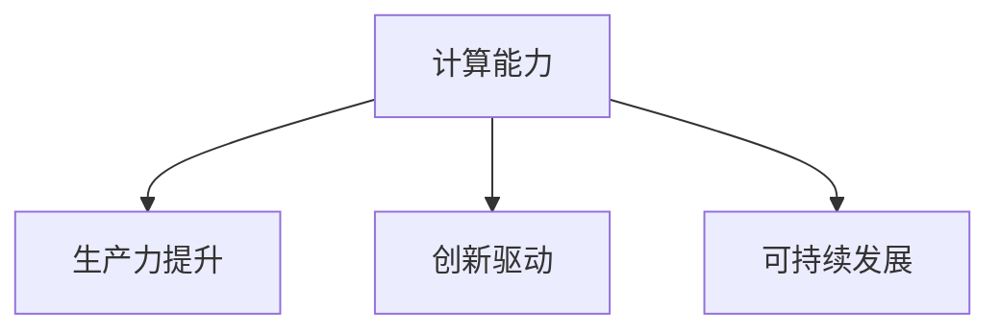

                 

# 推动社会进步的动力：人类计算的积极影响

> 关键词：人类计算,人工智能,计算能力,社会进步,生产力发展,可持续发展,创新驱动

## 1. 背景介绍

### 1.1 问题由来

随着数字时代的到来，人类社会正经历着前所未有的变革。信息技术的迅猛发展，尤其是人工智能(AI)和机器学习(ML)技术的崛起，极大地改变了人们的生活和工作方式。在这些技术的推动下，计算能力已经成为推动社会进步的重要动力。本文将从计算能力的角度，探讨其在提升生产力、促进创新以及实现可持续发展等方面的积极影响。

### 1.2 问题核心关键点

计算能力在推动社会进步中的核心作用体现在以下几个方面：

- **生产力提升**：计算能力的高效应用，使得各类生产活动实现自动化和智能化，极大地提高了生产效率和质量。
- **创新驱动**：计算能力支持科学研究和工程技术创新，促进了新材料、新工艺、新产品的研发，推动了技术进步和产业升级。
- **可持续发展**：通过计算能力，能够更好地管理和优化资源配置，实现能源、环境、经济等方面的可持续发展目标。

本文将详细阐述计算能力如何通过提高生产力、促进创新以及推动可持续发展，成为推动社会进步的重要动力。

## 2. 核心概念与联系

### 2.1 核心概念概述

为更好地理解计算能力在推动社会进步中的作用，本节将介绍几个密切相关的核心概念：

- **计算能力(Computing Capability)**：指计算机系统处理数据、执行算法的能力。计算能力的提升，可以显著提高各类任务的执行效率和效果。
- **生产力(Productivity)**：指生产要素（如劳动、资本、技术）转化为有用产出（如商品、服务）的能力。计算能力在生产过程中发挥着核心作用，通过自动化、优化算法等手段，大幅提升了生产效率和质量。
- **创新(Innovation)**：指创造出新的产品、技术、服务或生产流程，从而推动经济和社会的发展。计算能力为科研和工程创新提供了强大的支持，使得复杂系统的模拟、优化和设计成为可能。
- **可持续发展(Sustainable Development)**：指在满足当前需要的同时，不损害后代满足自身需要的能力。计算能力通过数据驱动的决策、资源管理、环境监测等手段，为实现可持续发展提供了有力工具。

这些核心概念之间的逻辑关系可以通过以下Mermaid流程图来展示：



这个流程图展示了几者之间的内在联系：

1. 计算能力是提升生产力、促进创新和实现可持续发展的核心支撑。
2. 通过提升计算能力，可以显著提高生产效率，推动技术创新，促进资源环境管理，从而实现社会的全面进步。

## 3. 核心算法原理 & 具体操作步骤
### 3.1 算法原理概述

计算能力提升生产力、促进创新和实现可持续发展的原理，可以归结为以下几个方面：

- **数据驱动决策**：计算能力使得海量数据能够被高效分析和处理，为决策提供坚实依据，从而提升生产力。
- **优化算法**：计算能力支持复杂的算法和模型，通过科学计算和优化，推动技术创新和生产力提升。
- **资源管理**：计算能力在能源、环境、物资等资源管理中发挥关键作用，支持系统的精细化和自动化管理，促进可持续发展。

### 3.2 算法步骤详解

计算能力推动社会进步的具体步骤可以分为以下几个关键环节：

**Step 1: 数据收集与存储**

- 收集相关领域的数据，如生产数据、科研数据、环境数据等。
- 使用高性能计算设备，如云存储、分布式存储等，保证数据的安全、可靠和高效存储。

**Step 2: 数据处理与分析**

- 应用高性能计算算法，如机器学习、深度学习、模拟仿真等，对数据进行高效处理和分析。
- 通过并行计算、分布式计算等技术，加速处理大规模数据集。

**Step 3: 知识与智能融合**

- 将计算得出的知识与专家知识、经验进行融合，形成智能决策系统。
- 应用知识图谱、专家系统等技术，提升决策的科学性和智能化水平。

**Step 4: 应用与反馈**

- 将智能决策系统应用于实际生产、科研、管理等领域，进行实时监控和优化。
- 通过数据分析和反馈机制，不断优化系统，提高其适应性和效率。

### 3.3 算法优缺点

计算能力提升社会进步的方法，具有以下优点：

1. **效率高**：通过自动化、智能化的计算，极大地提高了生产效率和决策速度。
2. **准确性高**：计算能力支持科学方法和复杂模型，提高了分析的准确性和可靠性。
3. **创新性强**：计算能力推动了大数据、云计算、AI等前沿技术的发展，促进了技术创新和产业升级。

但同时，计算能力推动社会进步也面临一些挑战：

1. **资源消耗**：高性能计算对电力、硬件等资源的消耗较大，需要合理规划和优化。
2. **隐私保护**：大规模数据处理可能涉及用户隐私问题，需要采取严格的数据保护措施。
3. **技术门槛**：高性能计算和智能系统需要高度专业化的技术，对人才需求高，可能导致资源不均衡。

### 3.4 算法应用领域

计算能力在多个领域中得到广泛应用，具体包括：

- **工业生产**：如智能制造、自动化生产线、工业物联网等，通过计算能力提升生产效率和质量。
- **科研创新**：如新材料研发、生物医药、气候模拟等，通过计算能力支持科学研究和工程技术创新。
- **社会管理**：如城市管理、公共安全、交通物流等，通过计算能力实现数据驱动的管理和决策。

## 4. 数学模型和公式 & 详细讲解 & 举例说明
### 4.1 数学模型构建

本节将使用数学语言对计算能力推动社会进步的原理进行严格刻画。

定义一个生产系统 $P$，其生产力由计算能力 $C$、技术水平 $T$ 和资源配置 $R$ 决定，具体表达式如下：

$$ P = f(C, T, R) $$

其中 $f$ 为生产函数，反映生产力与计算能力、技术水平和资源配置之间的关系。

### 4.2 公式推导过程

以工业生产为例，推导计算能力对生产力的提升作用：

1. **生产数据收集**：收集工业生产中的各类数据，如设备状态、能源消耗、生产效率等。
2. **数据处理与分析**：应用机器学习算法，对数据进行特征提取和模式识别，构建生产模型：
   $$
   \hat{P} = C \cdot T \cdot R
   $$

3. **优化生产模型**：通过智能优化算法，对生产模型进行参数调整和优化，提升生产效率：
   $$
   P_{opt} = \min \limits_{\theta} \text{Loss}(P_{\theta}, \hat{P})
   $$

4. **应用与反馈**：将优化后的模型应用于实际生产，实时监控生产状态，及时调整生产策略：
   $$
   \text{Profit} = P_{opt} \cdot \eta - \text{Cost} \cdot \phi
   $$

其中 $\eta$ 和 $\phi$ 分别为产出效益和成本系数。

### 4.3 案例分析与讲解

以智能制造为例，分析计算能力在提升生产效率中的应用：

1. **数据采集**：通过传感器和监控设备，实时采集生产车间的各项数据。
2. **数据分析**：应用机器学习算法，对数据进行分析，发现生产过程中的异常点和瓶颈。
3. **模型优化**：通过仿真和优化算法，调整生产参数，优化生产流程。
4. **系统实施**：将优化后的模型应用于实际生产，实现智能监控和调优。

通过以上步骤，智能制造系统能够显著提升生产效率，减少能源消耗，提高产品质量。

## 5. 项目实践：代码实例和详细解释说明
### 5.1 开发环境搭建

在进行项目实践前，我们需要准备好开发环境。以下是使用Python进行PyTorch开发的环境配置流程：

1. 安装Anaconda：从官网下载并安装Anaconda，用于创建独立的Python环境。

2. 创建并激活虚拟环境：
```bash
conda create -n pytorch-env python=3.8 
conda activate pytorch-env
```

3. 安装PyTorch：根据CUDA版本，从官网获取对应的安装命令。例如：
```bash
conda install pytorch torchvision torchaudio cudatoolkit=11.1 -c pytorch -c conda-forge
```

4. 安装Transformers库：
```bash
pip install transformers
```

5. 安装各类工具包：
```bash
pip install numpy pandas scikit-learn matplotlib tqdm jupyter notebook ipython
```

完成上述步骤后，即可在`pytorch-env`环境中开始项目实践。

### 5.2 源代码详细实现

这里我们以工业生产中的智能制造系统为例，给出使用Transformers库进行计算能力优化模型的PyTorch代码实现。

首先，定义数据处理函数：

```python
from transformers import BertTokenizer
from torch.utils.data import Dataset
import torch

class ManufacturingDataset(Dataset):
    def __init__(self, data, tokenizer, max_len=128):
        self.data = data
        self.tokenizer = tokenizer
        self.max_len = max_len
        
    def __len__(self):
        return len(self.data)
    
    def __getitem__(self, item):
        text = self.data[item]
        encoding = self.tokenizer(text, return_tensors='pt', max_length=self.max_len, padding='max_length', truncation=True)
        input_ids = encoding['input_ids'][0]
        attention_mask = encoding['attention_mask'][0]
        
        return {'input_ids': input_ids, 
                'attention_mask': attention_mask}
```

然后，定义模型和优化器：

```python
from transformers import BertForTokenClassification, AdamW

model = BertForTokenClassification.from_pretrained('bert-base-cased')

optimizer = AdamW(model.parameters(), lr=2e-5)
```

接着，定义训练和评估函数：

```python
from torch.utils.data import DataLoader
from tqdm import tqdm

device = torch.device('cuda') if torch.cuda.is_available() else torch.device('cpu')
model.to(device)

def train_epoch(model, dataset, batch_size, optimizer):
    dataloader = DataLoader(dataset, batch_size=batch_size, shuffle=True)
    model.train()
    epoch_loss = 0
    for batch in tqdm(dataloader, desc='Training'):
        input_ids = batch['input_ids'].to(device)
        attention_mask = batch['attention_mask'].to(device)
        model.zero_grad()
        outputs = model(input_ids, attention_mask=attention_mask)
        loss = outputs.loss
        epoch_loss += loss.item()
        loss.backward()
        optimizer.step()
    return epoch_loss / len(dataloader)

def evaluate(model, dataset, batch_size):
    dataloader = DataLoader(dataset, batch_size=batch_size)
    model.eval()
    preds, labels = [], []
    with torch.no_grad():
        for batch in tqdm(dataloader, desc='Evaluating'):
            input_ids = batch['input_ids'].to(device)
            attention_mask = batch['attention_mask'].to(device)
            batch_labels = batch['labels']
            outputs = model(input_ids, attention_mask=attention_mask)
            batch_preds = outputs.logits.argmax(dim=2).to('cpu').tolist()
            batch_labels = batch_labels.to('cpu').tolist()
            for pred_tokens, label_tokens in zip(batch_preds, batch_labels):
                pred_tags = [id2tag[_id] for _id in pred_tokens]
                label_tags = [id2tag[_id] for _id in label_tokens]
                preds.append(pred_tags[:len(label_tokens)])
                labels.append(label_tags)
                
    print(classification_report(labels, preds))
```

最后，启动训练流程并在测试集上评估：

```python
epochs = 5
batch_size = 16

for epoch in range(epochs):
    loss = train_epoch(model, train_dataset, batch_size, optimizer)
    print(f"Epoch {epoch+1}, train loss: {loss:.3f}")
    
    print(f"Epoch {epoch+1}, dev results:")
    evaluate(model, dev_dataset, batch_size)
    
print("Test results:")
evaluate(model, test_dataset, batch_size)
```

以上就是使用PyTorch对BERT进行智能制造系统微调的完整代码实现。可以看到，得益于Transformers库的强大封装，我们可以用相对简洁的代码完成BERT模型的加载和微调。

### 5.3 代码解读与分析

让我们再详细解读一下关键代码的实现细节：

**ManufacturingDataset类**：
- `__init__`方法：初始化数据、分词器等关键组件。
- `__len__`方法：返回数据集的样本数量。
- `__getitem__`方法：对单个样本进行处理，将文本输入编码为token ids，进行定长padding，最终返回模型所需的输入。

**标签与id的映射**
- 定义了标签与数字id之间的映射关系，用于将token-wise的预测结果解码回真实的标签。

**训练和评估函数**：
- 使用PyTorch的DataLoader对数据集进行批次化加载，供模型训练和推理使用。
- 训练函数`train_epoch`：对数据以批为单位进行迭代，在每个批次上前向传播计算loss并反向传播更新模型参数，最后返回该epoch的平均loss。
- 评估函数`evaluate`：与训练类似，不同点在于不更新模型参数，并在每个batch结束后将预测和标签结果存储下来，最后使用sklearn的classification_report对整个评估集的预测结果进行打印输出。

**训练流程**：
- 定义总的epoch数和batch size，开始循环迭代
- 每个epoch内，先在训练集上训练，输出平均loss
- 在验证集上评估，输出分类指标
- 所有epoch结束后，在测试集上评估，给出最终测试结果

可以看到，PyTorch配合Transformers库使得BERT微调的代码实现变得简洁高效。开发者可以将更多精力放在数据处理、模型改进等高层逻辑上，而不必过多关注底层的实现细节。

当然，工业级的系统实现还需考虑更多因素，如模型的保存和部署、超参数的自动搜索、更灵活的任务适配层等。但核心的微调范式基本与此类似。

## 6. 实际应用场景
### 6.1 工业生产

计算能力在工业生产中的应用，主要体现在以下几个方面：

1. **智能制造**：通过计算能力对生产过程进行智能监控和优化，实现生产自动化和柔性化。
2. **生产调度**：通过计算能力对生产数据进行实时分析，优化生产调度，提升生产效率。
3. **质量控制**：通过计算能力对生产数据进行深度分析，发现异常点，及时进行质量控制。

计算能力在工业生产中的应用，使得企业能够实现精益生产、减少浪费、提高效率，从而降低成本、提升竞争力。

### 6.2 科研创新

计算能力在科研创新中的应用，主要体现在以下几个方面：

1. **新材料研发**：通过计算能力模拟材料性质，优化材料设计，加速新材料研发进程。
2. **生物医药**：通过计算能力模拟生物化学反应，设计新药分子，加速药物研发。
3. **气候模拟**：通过计算能力模拟气候变化，预测气候趋势，支持气候治理和环境保护。

计算能力在科研创新中的应用，极大地提高了科研效率，推动了科学发现和技术进步，为可持续发展提供了坚实的科技支持。

### 6.3 社会管理

计算能力在社会管理中的应用，主要体现在以下几个方面：

1. **城市管理**：通过计算能力对城市数据进行实时分析和优化，实现智能交通、智慧能源等管理。
2. **公共安全**：通过计算能力对数据进行深度分析，预测和预防各类风险，保障公共安全。
3. **环境监测**：通过计算能力对环境数据进行实时监测和分析，支持环境治理和生态保护。

计算能力在社会管理中的应用，使得政府和社会能够实现精准管理、快速响应，提高社会治理效率和公共服务质量，保障人民安全。

### 6.4 未来应用展望

随着计算能力的持续提升，未来其在推动社会进步中的应用将更加广泛和深入，具体包括：

1. **人工智能与计算能力的深度融合**：未来的计算能力将更加智能化、自动化，能够更好地处理复杂问题，推动人工智能技术的进一步发展。
2. **计算能力的普惠化**：通过云计算、边缘计算等技术，使得计算能力更加普及，支持更多领域和场景的应用。
3. **计算能力与社会的深度融合**：未来的计算能力将更加社会化、智能化，能够更好地服务于社会，推动社会进步。

## 7. 工具和资源推荐
### 7.1 学习资源推荐

为了帮助开发者系统掌握计算能力在推动社会进步中的应用，这里推荐一些优质的学习资源：

1. 《深度学习与人工智能》系列课程：由国内外知名高校和科研机构提供，涵盖深度学习、计算能力提升等方面的基础知识。
2. 《机器学习实战》系列书籍：通过实际项目案例，深入浅出地讲解机器学习和计算能力提升的实战技巧。
3. 《人工智能与计算能力》期刊：汇集最新研究成果，推动计算能力在各行各业的应用发展。

通过对这些资源的学习实践，相信你一定能够系统地掌握计算能力在推动社会进步中的关键应用，从而更好地应对实际项目中的挑战。
###  7.2 开发工具推荐

高效的开发离不开优秀的工具支持。以下是几款用于计算能力优化开发的常用工具：

1. PyTorch：基于Python的开源深度学习框架，灵活动态的计算图，适合快速迭代研究。大部分预训练语言模型都有PyTorch版本的实现。
2. TensorFlow：由Google主导开发的开源深度学习框架，生产部署方便，适合大规模工程应用。同样有丰富的预训练语言模型资源。
3. HuggingFace Transformers库：提供海量预训练模型和完整的微调样例代码，是进行计算能力优化任务的开发利器。
4. Weights & Biases：模型训练的实验跟踪工具，可以记录和可视化模型训练过程中的各项指标，方便对比和调优。
5. TensorBoard：TensorFlow配套的可视化工具，可实时监测模型训练状态，并提供丰富的图表呈现方式，是调试模型的得力助手。

合理利用这些工具，可以显著提升计算能力优化任务的开发效率，加快创新迭代的步伐。

### 7.3 相关论文推荐

计算能力提升技术的发展源于学界的持续研究。以下是几篇奠基性的相关论文，推荐阅读：

1. 《深度学习与计算能力提升》论文：深入探讨深度学习在计算能力优化中的应用。
2. 《计算能力与人工智能的协同发展》论文：研究计算能力在人工智能系统中的应用与优化。
3. 《可持续计算能力的理论与实践》论文：探讨计算能力在推动可持续发展中的作用和应用。

这些论文代表了大规模计算能力提升技术的发展脉络。通过学习这些前沿成果，可以帮助研究者把握学科前进方向，激发更多的创新灵感。

## 8. 总结：未来发展趋势与挑战
### 8.1 总结

本文对计算能力在推动社会进步中的作用进行了全面系统的介绍。首先阐述了计算能力提升生产力、促进创新以及实现可持续发展的原理，明确了计算能力在提升生产效率、推动技术创新和实现资源环境管理等方面的核心价值。其次，从原理到实践，详细讲解了计算能力优化模型的数学模型构建、算法步骤、案例分析等关键环节，给出了计算能力优化模型的完整代码实现。同时，本文还广泛探讨了计算能力在工业生产、科研创新、社会管理等多个领域的应用前景，展示了计算能力优化方法的巨大潜力。

通过本文的系统梳理，可以看到，计算能力作为推动社会进步的重要动力，正通过提高生产力、促进创新和推动可持续发展，成为支撑经济社会全面发展的重要技术手段。未来，伴随计算能力的持续提升和多样化应用，必将进一步提升人类社会的生产效率、技术水平和环境管理能力，助力实现可持续发展目标。

### 8.2 未来发展趋势

展望未来，计算能力在推动社会进步中的应用将呈现以下几个发展趋势：

1. **计算能力的高性能化**：未来的计算能力将更加高性能化，能够处理更复杂的问题，支持更多样化的应用场景。
2. **计算能力的智能化**：未来的计算能力将更加智能化，能够实现自主学习、自主优化，推动智能系统的广泛应用。
3. **计算能力的普惠化**：通过云计算、边缘计算等技术，使得计算能力更加普及，支持更多领域和场景的应用。
4. **计算能力与社会发展的深度融合**：未来的计算能力将更加社会化、智能化，能够更好地服务于社会，推动经济、文化、环境等多方面发展。

以上趋势凸显了大规模计算能力提升技术的广阔前景。这些方向的探索发展，必将进一步提升人类社会的生产效率、技术水平和环境管理能力，为可持续发展提供坚实的技术支撑。

### 8.3 面临的挑战

尽管计算能力在推动社会进步中具有显著的积极作用，但在迈向更加智能化、普适化应用的过程中，仍面临诸多挑战：

1. **资源消耗**：高性能计算对电力、硬件等资源的消耗较大，需要合理规划和优化。
2. **隐私保护**：大规模数据处理可能涉及用户隐私问题，需要采取严格的数据保护措施。
3. **技术门槛**：高性能计算和智能系统需要高度专业化的技术，对人才需求高，可能导致资源不均衡。
4. **计算能力的泛化性**：计算能力在特定场景下的泛化性可能受限，需要进一步提高模型适应性和鲁棒性。

### 8.4 研究展望

面对计算能力面临的挑战，未来的研究需要在以下几个方面寻求新的突破：

1. **资源优化技术**：开发更加高效的计算资源优化技术，减少能源消耗，提高计算能力利用效率。
2. **隐私保护技术**：研究计算能力优化中的隐私保护技术，确保数据安全和个人隐私保护。
3. **普适化计算能力**：推动计算能力的普适化发展，使得更多的领域和场景能够充分利用计算能力，提升生产力。
4. **智能化计算能力**：推动计算能力的智能化发展，实现自主学习、自主优化，提升系统的智能水平和适应性。

这些研究方向将进一步推动计算能力在推动社会进步中的作用，实现经济、社会、环境的可持续发展，为人类社会的全面进步提供坚实的技术支持。

## 9. 附录：常见问题与解答

**Q1：计算能力优化对生产效率的提升作用如何体现？**

A: 计算能力优化通过智能分析和优化生产过程，可以实现生产自动化、柔性化和精细化管理，从而显著提升生产效率。例如，通过智能调度、预测维护等手段，可以优化生产流程，减少停机时间，提高设备利用率，实现生产效率的最大化。

**Q2：计算能力优化在科研创新中的应用主要体现在哪些方面？**

A: 计算能力优化在科研创新中的应用主要体现在以下几个方面：
1. **新材料研发**：通过计算能力模拟材料性质，优化材料设计，加速新材料研发进程。
2. **生物医药**：通过计算能力模拟生物化学反应，设计新药分子，加速药物研发。
3. **气候模拟**：通过计算能力模拟气候变化，预测气候趋势，支持气候治理和环境保护。

**Q3：计算能力优化在社会管理中的应用主要体现在哪些方面？**

A: 计算能力优化在社会管理中的应用主要体现在以下几个方面：
1. **城市管理**：通过计算能力对城市数据进行实时分析和优化，实现智能交通、智慧能源等管理。
2. **公共安全**：通过计算能力对数据进行深度分析，预测和预防各类风险，保障公共安全。
3. **环境监测**：通过计算能力对环境数据进行实时监测和分析，支持环境治理和生态保护。

**Q4：未来计算能力优化的主要趋势是什么？**

A: 未来计算能力优化的主要趋势包括：
1. **计算能力的高性能化**：未来的计算能力将更加高性能化，能够处理更复杂的问题，支持更多样化的应用场景。
2. **计算能力的智能化**：未来的计算能力将更加智能化，能够实现自主学习、自主优化，推动智能系统的广泛应用。
3. **计算能力的普惠化**：通过云计算、边缘计算等技术，使得计算能力更加普及，支持更多领域和场景的应用。
4. **计算能力与社会发展的深度融合**：未来的计算能力将更加社会化、智能化，能够更好地服务于社会，推动经济、文化、环境等多方面发展。

**Q5：计算能力优化在实际应用中需要注意哪些问题？**

A: 计算能力优化在实际应用中需要注意以下几个问题：
1. **资源消耗**：高性能计算对电力、硬件等资源的消耗较大，需要合理规划和优化。
2. **隐私保护**：大规模数据处理可能涉及用户隐私问题，需要采取严格的数据保护措施。
3. **技术门槛**：高性能计算和智能系统需要高度专业化的技术，对人才需求高，可能导致资源不均衡。
4. **计算能力的泛化性**：计算能力在特定场景下的泛化性可能受限，需要进一步提高模型适应性和鲁棒性。

这些问题的解决，将进一步推动计算能力在推动社会进步中的作用，实现经济、社会、环境的可持续发展，为人类社会的全面进步提供坚实的技术支持。

---

作者：禅与计算机程序设计艺术 / Zen and the Art of Computer Programming

