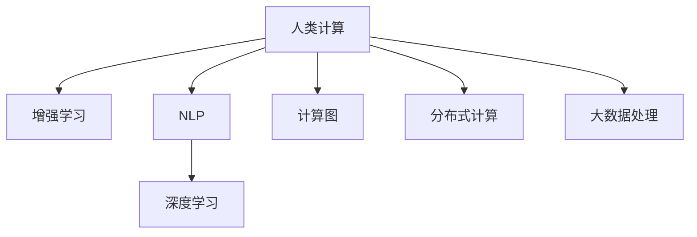

                 

## 1. 背景介绍

### 1.1 问题由来

现代科技的迅猛发展离不开高效、可靠、可扩展的计算能力。无论是深度学习、量子计算，还是区块链、物联网，所有的技术突破和应用落地，背后都离不开强大的计算支持。尤其是在人工智能领域，高性能计算资源是推动其发展的核心引擎。

随着数据量的爆炸性增长和模型复杂度的不断提升，如何突破计算能力的瓶颈，提升数据处理和模型训练的效率，已经成为当前技术研究的热点问题。人类计算（Human-in-the-Loop Computation）技术应运而生，通过人机协同的智能计算方法，使得人类能更高效地利用计算资源，推动科技进步。

### 1.2 问题核心关键点

人类计算的核心在于将人类的经验、智慧与计算资源进行深度融合，形成更智能、更灵活的计算过程。其核心思想包括：

- 增强计算的智能性：通过人类对数据的理解、归纳和推理，引导计算过程，提升计算的准确性和效率。
- 提高计算的可解释性：人类计算注重于计算过程的透明化和可解释性，使得决策过程更易于理解和审核。
- 优化计算的可持续性：通过人为干预和调试，避免计算过程中的资源浪费和数据污染，确保计算的绿色和环保。
- 增强计算的安全性：利用人类的监督和验证机制，确保计算过程不受恶意攻击和数据泄露风险的影响。

人类计算的这些核心特性，使其在人工智能、大数据分析、生物计算等多个领域展现出广阔的应用前景。本文将深入探讨人类计算的基本原理、操作步骤、优缺点及应用领域，并通过具体的项目实践，阐述其实际应用场景。

### 1.3 问题研究意义

研究和实现人类计算技术，对于拓展人工智能的应用范围，提高计算效率，增强计算结果的可解释性，保障计算过程的可持续性和安全性，具有重要意义：

1. **提升计算效率**：通过人机协同的智能计算方法，显著降低对计算资源的需求，提升数据处理和模型训练的效率。
2. **增强计算结果的可解释性**：计算过程中引入人类经验，使结果更易理解和验证，便于发现和修正计算错误。
3. **确保计算过程的可持续性**：人类计算注重计算过程的优化和调整，避免资源浪费和数据污染，保障计算过程的绿色环保。
4. **保障计算过程的安全性**：利用人类的监督和验证机制，确保计算过程不受恶意攻击和数据泄露风险的影响。
5. **推动技术创新**：人类计算技术为人工智能、大数据等前沿领域提供了新的计算方法和工具，推动相关技术的快速发展和应用。

## 2. 核心概念与联系

### 2.1 核心概念概述

为更好地理解人类计算的基本原理和应用方法，本节将介绍几个密切相关的核心概念：

- **人类计算(Human-in-the-Loop Computation)**：一种将人类智慧与计算资源结合的智能计算方法，通过人机协同提升计算效率和结果可解释性。

- **增强学习(Reinforcement Learning, RL)**：一种利用人类反馈信息（奖励信号），通过试错迭代优化计算过程的智能学习方法。

- **自然语言处理(Natural Language Processing, NLP)**：研究如何让计算机理解、处理和生成自然语言的技术。

- **深度学习(Deep Learning)**：一种基于神经网络的机器学习方法，通过多层次数据处理，提升模型的表达能力和预测准确度。

- **计算图(Computation Graph)**：用于描述计算过程和数据流向的图形表示，是优化计算过程的重要工具。

- **分布式计算(Distributed Computing)**：通过多台计算机协同工作，实现大规模计算任务的并行处理。

- **大数据处理(Big Data Processing)**：研究如何高效存储、处理和分析大规模数据集的技术。

这些核心概念之间的逻辑关系可以通过以下Mermaid流程图来展示：



这个流程图展示了一系列关键概念及其之间的关系：

1. 人类计算通过增强学习和深度学习，提升计算过程的智能性和准确性。
2. 人类计算利用自然语言处理技术，提升计算过程的可解释性和人机交互效果。
3. 人类计算依赖计算图和大数据处理技术，优化计算过程的执行效率和数据管理能力。
4. 分布式计算则提供了实现大规模并行计算的基础设施支持。

这些概念共同构成了人类计算的基础框架，使其能够在多个领域发挥强大的智能计算能力。通过理解这些核心概念，我们可以更好地把握人类计算的工作原理和应用方法。

## 3. 核心算法原理 & 具体操作步骤
### 3.1 算法原理概述

人类计算的核心算法原理可以归纳为：利用人类对数据的理解和分析，结合计算资源，通过智能化的计算方法，实现高效的、可解释的、可持续的和安全的计算过程。其基本流程包括数据预处理、计算模型构建、智能推理和结果验证四个步骤。

- **数据预处理**：通过人类对数据进行初步分析和整理，确定计算任务的关键数据点和模型输入格式。
- **计算模型构建**：利用深度学习等技术构建计算模型，设定模型的参数和结构。
- **智能推理**：将计算模型应用到数据上，进行推理计算，得出中间结果。
- **结果验证**：通过人类对计算结果的验证和反馈，调整计算模型和计算过程，确保结果的准确性和可靠性。

### 3.2 算法步骤详解

人类计算的核心操作步骤主要包括：

**Step 1: 数据预处理**
- 收集和清洗原始数据，进行数据标注和预处理。
- 利用自然语言处理技术，将非结构化数据转化为结构化数据。
- 设定计算模型的输入格式和输出格式。

**Step 2: 计算模型构建**
- 选择合适的深度学习框架，构建计算模型。
- 设定模型的超参数和网络结构。
- 利用增强学习等技术，优化模型的训练过程。

**Step 3: 智能推理**
- 将数据输入计算模型，进行前向推理计算。
- 收集计算中间结果，进行数据分析和可视化。
- 利用分布式计算技术，加速计算过程。

**Step 4: 结果验证**
- 收集人类对计算结果的反馈，进行结果验证。
- 利用人工智能技术，自动识别计算过程中的错误和异常。
- 通过人工干预和调试，优化计算过程和结果。

### 3.3 算法优缺点

人类计算技术具有以下优点：
1. **增强计算智能性**：通过人类对数据的理解和分析，引导计算过程，提升计算的准确性和效率。
2. **提高计算可解释性**：计算过程中引入人类经验，使结果更易理解和验证，便于发现和修正计算错误。
3. **优化计算可持续性**：利用人类的监督和调整机制，避免资源浪费和数据污染，确保计算过程的绿色环保。
4. **保障计算安全性**：利用人类的监督和验证机制，确保计算过程不受恶意攻击和数据泄露风险的影响。

同时，该方法也存在一定的局限性：
1. **依赖人类经验**：计算结果的可靠性高度依赖于人类对数据和模型的理解，需要保证数据标注和模型构建的质量。
2. **计算效率有限**：虽然人类计算能提升计算效率，但受限于人类干预的时效性，不能完全替代机器计算。
3. **计算过程复杂**：人类计算涉及人机协同的多个环节，操作流程复杂，需要协调不同领域的专家和技术人员。
4. **结果可解释性仍受限**：尽管计算结果更易于理解，但仍需人工验证和解释，不能完全消除计算过程的不确定性。

尽管存在这些局限性，但就目前而言，人类计算方法在计算过程中引入了人类智慧，能够显著提升计算过程的智能性和可解释性，成为推动科技发展的重要方法。

### 3.4 算法应用领域

人类计算技术在多个领域展现出广阔的应用前景，主要包括：

- **人工智能**：利用人类计算提升深度学习模型的准确性和可解释性，开发更智能的智能系统。
- **大数据分析**：通过人机协同的数据分析方法，提升大数据处理的速度和质量，挖掘数据背后的深层规律。
- **生物计算**：利用人类计算优化生物信息学研究中的计算过程，提高基因组学、蛋白质组学等研究效率。
- **金融建模**：结合人类对金融市场和风险的理解，优化量化投资模型的构建和验证，提升投资决策的准确性。
- **智能制造**：利用人类计算优化生产过程的智能控制和决策，提升制造业的生产效率和灵活性。
- **城市治理**：通过人机协同的智能计算方法，优化城市管理流程，提升城市运行效率和服务质量。

除了上述这些领域，人类计算技术还将在更多应用场景中发挥其独特优势，推动相关领域的科技进步。

## 4. 数学模型和公式 & 详细讲解 & 举例说明

### 4.1 数学模型构建

人类计算的数学模型构建过程通常包括数据表示、模型选择和损失函数设定三个步骤：

1. **数据表示**：将原始数据转化为模型可接受的格式，如向量、矩阵等。
2. **模型选择**：选择适合的计算模型，如深度神经网络、决策树等。
3. **损失函数设定**：定义计算模型的输出与真实结果之间的差异度量，如均方误差、交叉熵等。

### 4.2 公式推导过程

以线性回归模型为例，推导人类计算中常用的最小二乘法的公式：

设数据集为 $(x_i, y_i)$，其中 $x_i$ 为输入特征，$y_i$ 为输出结果，模型参数为 $\theta$。

最小二乘法目标为最小化预测值与真实值之间的平方误差：

$$
\sum_{i=1}^n (y_i - \theta \cdot x_i)^2
$$

将其展开并求导，得：

$$
\frac{\partial}{\partial \theta} \sum_{i=1}^n (y_i - \theta \cdot x_i)^2 = -2 \sum_{i=1}^n (y_i - \theta \cdot x_i) x_i
$$

令导数为0，解得最优参数 $\theta$：

$$
\theta = \frac{\sum_{i=1}^n (y_i x_i)}{\sum_{i=1}^n x_i^2}
$$

通过推导，我们可以发现人类计算的数学模型构建过程与传统机器学习的目标一致，即通过最小化预测误差来优化模型参数，从而提升模型的预测能力。

### 4.3 案例分析与讲解

以医疗影像分析为例，分析人类计算在医疗影像诊断中的应用。

医疗影像诊断是一个典型的计算任务，需要结合大量的医疗知识和影像数据。人类计算可以通过以下步骤实现：

**Step 1: 数据预处理**
- 收集和清洗医疗影像数据，进行数据标注和预处理。
- 利用自然语言处理技术，将影像数据转化为结构化数据。
- 设定计算模型的输入格式和输出格式。

**Step 2: 计算模型构建**
- 选择合适的深度学习框架，构建计算模型。
- 设定模型的超参数和网络结构。
- 利用增强学习等技术，优化模型的训练过程。

**Step 3: 智能推理**
- 将医疗影像输入计算模型，进行前向推理计算。
- 收集计算中间结果，进行数据分析和可视化。
- 利用分布式计算技术，加速计算过程。

**Step 4: 结果验证**
- 收集医生对计算结果的反馈，进行结果验证。
- 利用人工智能技术，自动识别计算过程中的错误和异常。
- 通过人工干预和调试，优化计算过程和结果。

通过人类计算方法，医疗影像诊断可以实现高效的计算和智能化的决策支持，提升医生的诊断准确性和效率，同时也能提高诊断结果的可解释性和可靠性。

## 5. 项目实践：代码实例和详细解释说明

### 5.1 开发环境搭建

在进行人类计算的实践前，我们需要准备好开发环境。以下是使用Python进行TensorFlow开发的环境配置流程：

1. 安装Anaconda：从官网下载并安装Anaconda，用于创建独立的Python环境。

2. 创建并激活虚拟环境：
```bash
conda create -n human_computation python=3.8 
conda activate human_computation
```

3. 安装TensorFlow：根据CUDA版本，从官网获取对应的安装命令。例如：
```bash
conda install tensorflow -c tensorflow -c conda-forge
```

4. 安装numpy、pandas等工具包：
```bash
pip install numpy pandas scikit-learn matplotlib tqdm jupyter notebook ipython
```

完成上述步骤后，即可在`human_computation-env`环境中开始实践。

### 5.2 源代码详细实现

下面我们以医疗影像分析为例，给出使用TensorFlow进行人类计算的Python代码实现。

首先，定义医疗影像数据处理函数：

```python
import tensorflow as tf
import numpy as np
from tensorflow.keras.layers import Dense, Flatten

def preprocess_data(data):
    # 对数据进行标准化处理
    mean = np.mean(data)
    std = np.std(data)
    data = (data - mean) / std
    return data
```

然后，定义医疗影像分类模型：

```python
class MedicalImagingModel(tf.keras.Model):
    def __init__(self):
        super().__init__()
        self.flatten = Flatten()
        self.dense1 = Dense(64, activation='relu')
        self.dense2 = Dense(10, activation='softmax')

    def call(self, x):
        x = self.flatten(x)
        x = self.dense1(x)
        x = self.dense2(x)
        return x
```

接着，定义人类计算的训练和评估函数：

```python
def train_model(model, train_data, train_labels, epochs, batch_size, optimizer):
    model.compile(optimizer=optimizer, loss='categorical_crossentropy', metrics=['accuracy'])
    model.fit(train_data, train_labels, epochs=epochs, batch_size=batch_size)

def evaluate_model(model, test_data, test_labels, batch_size):
    model.evaluate(test_data, test_labels, batch_size=batch_size)
```

最后，启动人类计算的训练流程并在测试集上评估：

```python
# 准备训练和测试数据
train_data = ...
train_labels = ...
test_data = ...
test_labels = ...

# 加载模型
model = MedicalImagingModel()
optimizer = tf.keras.optimizers.Adam()

# 开始训练
epochs = 10
batch_size = 32

train_model(model, train_data, train_labels, epochs, batch_size, optimizer)
evaluate_model(model, test_data, test_labels, batch_size)
```

以上就是使用TensorFlow进行医疗影像分析的人类计算的完整代码实现。可以看到，TensorFlow提供了丰富的高级API，可以方便地实现复杂的计算模型和优化算法。

### 5.3 代码解读与分析

让我们再详细解读一下关键代码的实现细节：

**preprocess_data函数**：
- 对输入数据进行标准化处理，使其满足后续深度学习模型的要求。

**MedicalImagingModel类**：
- 定义了医疗影像分类模型的结构，包括输入层、隐藏层和输出层。

**train_model函数**：
- 使用TensorFlow的API进行模型编译和训练，设置训练参数和优化器。
- 在每个epoch结束时，将模型保存在磁盘上，以便后续使用。

**evaluate_model函数**：
- 使用TensorFlow的API进行模型评估，输出测试集上的准确率。

**人类计算训练流程**：
- 定义训练和测试数据集，加载模型和优化器。
- 设置训练参数，启动训练流程。
- 在每个epoch结束时，保存模型。
- 在训练结束后，对测试集进行评估。

可以看到，TensorFlow提供了完整的深度学习框架和丰富的API，可以大大简化人类计算的开发过程。开发者只需要关注具体的计算任务和算法实现，而不必过多关注底层的计算细节。

当然，实际的应用中还需要考虑更多因素，如模型的存储和部署、超参数的自动搜索、更灵活的任务适配层等。但核心的计算流程基本与此类似。

## 6. 实际应用场景

### 6.1 医疗影像分析

人类计算在医疗影像分析中的应用前景广阔。医疗影像数据量大、复杂，传统机器学习算法难以高效处理。通过引入人类智慧，利用增强学习等技术，可以提升医疗影像诊断的准确性和效率。

具体而言，可以利用人类计算技术，构建智能化的医疗影像分析系统。系统首先通过人类对影像数据的初步分析和理解，设定计算模型和训练数据。然后利用深度学习等技术进行计算，并结合医生的反馈进行结果验证和调整。最后，系统可以自动生成诊断报告，辅助医生进行决策。

### 6.2 金融风险评估

金融行业面临着高风险和高不确定性的挑战，需要高效、准确的风险评估方法。人类计算可以通过结合人类的金融知识和市场经验，提升风险评估的准确性和可靠性。

例如，可以利用人类计算技术，构建智能化的金融风险评估模型。系统首先通过人类对金融市场和风险数据的初步分析，设定计算模型和训练数据。然后利用深度学习等技术进行计算，并结合金融专家的反馈进行结果验证和调整。最后，系统可以自动生成风险评估报告，辅助金融机构进行决策。

### 6.3 智能制造优化

智能制造是现代制造业的重要方向，需要高效、可靠的计算过程。通过人类计算，可以在制造过程中实现智能化的优化和决策。

例如，可以利用人类计算技术，构建智能化的制造过程优化系统。系统首先通过人类对制造过程和数据的初步分析，设定计算模型和训练数据。然后利用深度学习等技术进行计算，并结合工程师的反馈进行结果验证和调整。最后，系统可以自动生成优化方案，辅助制造企业进行决策。

### 6.4 未来应用展望

随着人类计算技术的不断发展和完善，其应用场景将进一步拓展。未来，人类计算将在更多领域发挥其独特优势，为科技进步注入新的动力。

- **智慧医疗**：利用人类计算技术，构建智能化的医疗诊断和治疗系统，提升医疗服务的智能化水平。
- **智能制造**：利用人类计算技术，构建智能化的制造过程优化系统，提升制造效率和灵活性。
- **智慧城市**：利用人类计算技术，构建智能化的城市管理和服务系统，提升城市运行效率和服务质量。
- **智能交通**：利用人类计算技术，构建智能化的交通管理和服务系统，提升交通运行效率和安全性。
- **智能教育**：利用人类计算技术，构建智能化的教育辅助系统，提升教育资源的利用效率和教学质量。

总之，人类计算技术将在多个领域展现出广阔的应用前景，为科技发展注入新的活力和创新动力。

## 7. 工具和资源推荐
### 7.1 学习资源推荐

为了帮助开发者系统掌握人类计算的理论基础和实践技巧，这里推荐一些优质的学习资源：

1. 《Deep Learning with TensorFlow》系列书籍：谷歌官方出版，详细介绍了TensorFlow的使用方法和深度学习技术。
2. 《Human-in-the-Loop Machine Learning》课程：斯坦福大学开设的在线课程，介绍了人机协同的机器学习方法和实践。
3. 《Machine Learning Yearning》书籍：Andrew Ng的书籍，详细介绍了机器学习的实践方法和经验总结。
4. 《Human-Centered Machine Learning》论文：探讨人机协同的机器学习方法，展示了人类计算技术的实际应用。
5. Weights & Biases平台：用于记录和可视化模型训练过程中的各项指标，方便对比和调优。
6. TensorBoard：TensorFlow配套的可视化工具，可实时监测模型训练状态，并提供丰富的图表呈现方式。

通过对这些资源的学习实践，相信你一定能够快速掌握人类计算的精髓，并用于解决实际的计算问题。

### 7.2 开发工具推荐

高效的开发离不开优秀的工具支持。以下是几款用于人类计算开发的常用工具：

1. TensorFlow：由谷歌主导开发的开源深度学习框架，生产部署方便，适合大规模工程应用。
2. PyTorch：基于Python的开源深度学习框架，灵活易用，适合快速迭代研究。
3. Weights & Biases：记录和可视化模型训练过程中的各项指标，方便对比和调优。
4. TensorBoard：TensorFlow配套的可视化工具，可实时监测模型训练状态，并提供丰富的图表呈现方式。
5. Jupyter Notebook：支持Python等语言，方便进行交互式开发和实验。

合理利用这些工具，可以显著提升人类计算任务的开发效率，加快创新迭代的步伐。

### 7.3 相关论文推荐

人类计算技术的发展源于学界的持续研究。以下是几篇奠基性的相关论文，推荐阅读：

1. "Human-in-the-Loop Deep Reinforcement Learning for Healthcare"：探讨人机协同的深度强化学习在医疗领域的应用。
2. "Human-in-the-Loop Machine Learning"：总结了人机协同机器学习的理论和方法，展示了其在医疗、金融等领域的实际应用。
3. "Human-in-the-Loop Reinforcement Learning for Navigation"：展示了人机协同的强化学习在智能导航中的应用。
4. "Human-in-the-Loop Machine Learning for Natural Language Processing"：探讨人机协同的机器学习在自然语言处理中的应用。
5. "Human-in-the-Loop Machine Learning for Complex Problem Solving"：总结了人机协同机器学习的理论和方法，展示了其在复杂问题求解中的应用。

这些论文代表了大计算技术的发展脉络。通过学习这些前沿成果，可以帮助研究者把握学科前进方向，激发更多的创新灵感。

## 8. 总结：未来发展趋势与挑战

### 8.1 总结

本文对人类计算的基本原理和应用方法进行了全面系统的介绍。首先阐述了人类计算的背景和意义，明确了其在大数据、人工智能等领域的重要应用价值。其次，从原理到实践，详细讲解了人类计算的数学模型构建和操作步骤，给出了人类计算任务开发的完整代码实例。同时，本文还广泛探讨了人类计算在医疗、金融、智能制造等多个行业领域的应用前景，展示了其巨大的潜力。此外，本文精选了人类计算技术的各类学习资源，力求为读者提供全方位的技术指引。

通过本文的系统梳理，可以看到，人类计算技术在计算过程中引入了人类智慧，能够显著提升计算过程的智能性和可解释性，成为推动科技发展的重要方法。未来，伴随人类计算技术的不断发展和完善，其在计算领域的深入应用将进一步拓展，为科技发展注入新的动力。

### 8.2 未来发展趋势

展望未来，人类计算技术将呈现以下几个发展趋势：

1. **计算智能化增强**：通过引入增强学习等技术，提升计算过程的智能性和自动化水平，减少对人类干预的依赖。
2. **计算过程透明化**：利用区块链等技术，实现计算过程的透明化和可追溯性，确保计算结果的可解释性和可验证性。
3. **计算资源优化**：通过分布式计算和边缘计算等技术，优化计算资源的分配和使用，提升计算效率和资源利用率。
4. **计算安全保障**：利用加密技术、访问控制等手段，确保计算过程和数据的安全性和隐私性。
5. **计算效果评估**：引入人类专家的参与，构建多维度、多层次的计算效果评估体系，提升计算结果的可靠性和可信度。
6. **计算应用多样化**：扩展计算应用场景，涵盖更多领域的智能计算需求，推动各领域的科技进步。

以上趋势凸显了人类计算技术的发展前景和应用潜力。这些方向的探索发展，必将进一步提升计算过程的智能性和可解释性，为科技发展注入新的活力和创新动力。

### 8.3 面临的挑战

尽管人类计算技术已经取得了瞩目成就，但在迈向更加智能化、普适化应用的过程中，它仍面临诸多挑战：

1. **计算成本高昂**：尽管利用人类计算技术能够提升计算过程的智能性和可解释性，但其依赖于高昂的计算资源，难以普及到更多领域。
2. **计算结果可解释性不足**：尽管利用增强学习等技术，计算过程的透明化和可追溯性仍有所不足，难以满足高可靠性和高可信度的计算需求。
3. **计算资源分布不均**：当前的计算资源分布不均，难以满足大规模计算任务的需求，需要进一步优化计算资源分配策略。
4. **计算安全性难以保障**：利用增强学习等技术，计算过程的安全性和隐私性仍需进一步提升，避免数据泄露和恶意攻击。
5. **计算效果评估困难**：由于计算过程的复杂性和多样性，计算效果的评估仍需依赖人类专家的参与，难以建立统一的评估标准。

正视人类计算面临的这些挑战，积极应对并寻求突破，将使人类计算技术不断完善，为科技发展提供更强大的动力和支撑。

### 8.4 研究展望

面对人类计算技术所面临的挑战，未来的研究需要在以下几个方面寻求新的突破：

1. **探索增强学习等智能计算方法**：进一步利用增强学习等技术，提升计算过程的智能性和自动化水平，减少对人类干预的依赖。
2. **引入区块链等透明化技术**：利用区块链等技术，实现计算过程的透明化和可追溯性，确保计算结果的可解释性和可验证性。
3. **优化计算资源分配策略**：通过分布式计算和边缘计算等技术，优化计算资源的分配和使用，提升计算效率和资源利用率。
4. **保障计算安全性**：利用加密技术、访问控制等手段，确保计算过程和数据的安全性和隐私性。
5. **建立统一计算效果评估体系**：引入人类专家的参与，构建多维度、多层次的计算效果评估体系，提升计算结果的可靠性和可信度。

这些研究方向的探索，必将引领人类计算技术迈向更高的台阶，为构建安全、可靠、可解释、可控的智能系统铺平道路。面向未来，人类计算技术还需要与其他人工智能技术进行更深入的融合，如知识表示、因果推理、强化学习等，多路径协同发力，共同推动计算过程的智能化和可解释性。只有勇于创新、敢于突破，才能不断拓展计算过程的边界，让计算技术更好地造福人类社会。

## 9. 附录：常见问题与解答

**Q1：人类计算是否适用于所有计算任务？**

A: 人类计算在大部分计算任务中都能取得不错的效果，特别是对于数据量较小、复杂度较高的任务。但对于一些计算强度极高、需要大规模并行计算的任务，如高性能计算、实时数据处理等，仍需依赖机器计算。

**Q2：人类计算的优势和劣势是什么？**

A: 人类计算的优势在于引入人类智慧，提升计算过程的智能性和可解释性。但其劣势在于依赖人类干预，计算成本高昂，难以普及到更多领域。

**Q3：如何选择适合的人类计算方法？**

A: 选择适合的人类计算方法需要考虑任务的复杂度、数据规模、计算资源等因素。对于复杂度高、数据量大的任务，可以选择基于深度学习的计算方法；对于数据量较小、复杂度较低的任务，可以选择基于规则的计算方法。

**Q4：人类计算的开发流程是怎样的？**

A: 人类计算的开发流程通常包括数据预处理、计算模型构建、智能推理和结果验证四个步骤。在每个步骤中，都需要引入人类智慧，进行适当的干预和调整。

**Q5：人类计算技术在实际应用中需要注意哪些问题？**

A: 在实际应用中，人类计算技术需要注意计算成本、结果可解释性、计算资源分配、计算安全性等问题。需要综合考虑各种因素，进行合理的技术选型和系统设计。

通过本文的系统梳理，可以看到，人类计算技术在计算过程中引入了人类智慧，能够显著提升计算过程的智能性和可解释性，成为推动科技发展的重要方法。未来，伴随人类计算技术的不断发展和完善，其在计算领域的深入应用将进一步拓展，为科技发展注入新的动力。

