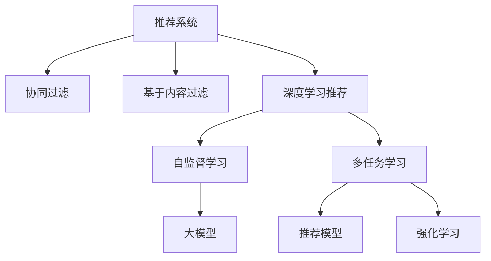

                 

# 推荐系统中AI大模型的多任务学习

> 关键词：推荐系统,大模型,多任务学习,自监督学习,强化学习,协同过滤,深度学习

## 1. 背景介绍

推荐系统（Recommendation System）是现代互联网应用中不可或缺的一部分，其核心目标是通过算法模型，为用户推荐个性化内容。传统的推荐方法基于协同过滤、基于内容的过滤等，已经得到了广泛的应用，如Amazon、Netflix等电商和视频平台都使用推荐系统提升用户体验。然而，随着深度学习和大模型的崛起，AI驱动的推荐系统逐步成为行业的主流。

大模型驱动的推荐系统，利用预训练语言模型（如BERT、GPT等）或专门设计的推荐模型（如KG-Embedding）进行推荐。这些模型在海量文本数据上进行预训练，学习到了丰富的语义表示和知识图谱信息，可以显著提升推荐系统的表现。

多任务学习（Multi-task Learning, MTL）是当前深度学习领域的一个热点，其核心思想是在同一模型上进行多个任务的训练，使得模型能够共享知识，提升不同任务之间的性能。在推荐系统中，多任务学习可以显著提升模型的推荐效果，优化资源利用率。

本文将详细探讨在推荐系统中，利用AI大模型进行多任务学习的方法，涵盖数学模型、算法原理、工程实践等方面，并提出未来发展的趋势和挑战。

## 2. 核心概念与联系

### 2.1 核心概念概述

为更好地理解基于大模型的推荐系统中多任务学习的方法，本节将介绍几个密切相关的核心概念：

- 推荐系统（Recommendation System）：通过分析用户行为数据，推荐符合用户兴趣的商品、内容、服务等的系统。
- 大模型（Large Model）：如BERT、GPT等，通过大规模无标签数据进行预训练，学习通用语言表示的模型。
- 多任务学习（Multi-task Learning）：在单一模型上进行多个任务训练，共享知识提升不同任务之间性能。
- 协同过滤（Collaborative Filtering）：基于用户历史行为，推荐用户可能感兴趣的商品、内容等的技术。
- 自监督学习（Self-supervised Learning）：利用无标签数据训练模型，学习通用的特征表示。
- 强化学习（Reinforcement Learning）：通过与环境的互动，使得模型学习最优策略的技术。

这些核心概念之间的逻辑关系可以通过以下Mermaid流程图来展示：



这个流程图展示出推荐系统各个组成部分以及它们之间的关系：

1. 推荐系统通过协同过滤、基于内容过滤等技术进行推荐。
2. 深度学习推荐利用大模型进行预训练和微调，提升推荐效果。
3. 多任务学习使得推荐模型能够在多个任务之间共享知识，提升性能。
4. 自监督学习利用无标签数据训练大模型，学习通用特征表示。
5. 强化学习使得推荐模型通过与环境互动，学习最优推荐策略。

这些核心概念共同构成了推荐系统的工作框架，使得其能够高效地为用户推荐个性化内容。通过理解这些概念，我们可以更好地把握AI大模型在推荐系统中的作用和优化方向。

## 3. 核心算法原理 & 具体操作步骤

### 3.1 算法原理概述

多任务学习（MTL）的核心思想是在同一模型上进行多个任务的训练，使得模型能够共享知识，提升不同任务之间的性能。在推荐系统中，多任务学习可以显著提升模型的推荐效果，优化资源利用率。

假设我们有两个推荐任务 $T_1$ 和 $T_2$，它们分别表示为 $x \rightarrow y$ 的映射关系，其中 $x$ 为输入特征，$y$ 为输出标签。我们的目标是设计一个多任务学习模型 $M_{\theta}$，使得模型在多个任务上都能取得优秀的表现。

多任务学习的数学定义如下：

$$
\mathcal{L}(\theta) = \mathcal{L}^{T_1}(\theta) + \alpha \mathcal{L}^{T_2}(\theta)
$$

其中，$\mathcal{L}^{T_1}$ 和 $\mathcal{L}^{T_2}$ 分别表示任务 $T_1$ 和 $T_2$ 的损失函数，$\alpha$ 为权重因子。模型的训练目标是最小化联合损失 $\mathcal{L}(\theta)$，即：

$$
\hat{\theta} = \mathop{\arg\min}_{\theta} \mathcal{L}(\theta)
$$

通过最小化联合损失，模型能够在多个任务之间共享知识，提升推荐效果。

### 3.2 算法步骤详解

基于大模型的推荐系统中多任务学习的一般步骤包括：

**Step 1: 准备数据集**

- 收集推荐系统涉及的任务数据，如用户行为数据、商品属性数据等。
- 对数据进行预处理，如特征提取、数据增强等，使得数据格式和规模一致。

**Step 2: 设计多任务模型**

- 选择合适的预训练模型，如BERT、GPT等，进行微调。
- 设计多任务适配层，将不同的推荐任务映射到相同的输出。
- 设计共享特征提取器，使得多个任务共享底层特征表示。

**Step 3: 设置多任务学习超参数**

- 选择合适的优化算法及其参数，如Adam、SGD等，设置学习率、批大小、迭代轮数等。
- 设置多个任务的权重系数，平衡不同任务的重要性。
- 设置正则化技术及强度，包括L2正则、Dropout、Early Stopping等。

**Step 4: 执行多任务训练**

- 将训练集数据分批次输入模型，前向传播计算损失函数。
- 反向传播计算参数梯度，根据设定的优化算法和学习率更新模型参数。
- 周期性在验证集上评估模型性能，根据性能指标决定是否触发Early Stopping。
- 重复上述步骤直到满足预设的迭代轮数或Early Stopping条件。

**Step 5: 测试和部署**

- 在测试集上评估多任务学习模型在各个任务上的性能，对比单任务模型和原始预训练模型的效果。
- 使用多任务学习模型对新样本进行推荐预测，集成到实际的应用系统中。
- 持续收集新的数据，定期重新训练模型，以适应数据分布的变化。

以上是基于大模型的推荐系统中多任务学习的一般流程。在实际应用中，还需要针对具体任务的特点，对多任务学习过程的各个环节进行优化设计，如改进训练目标函数，引入更多的正则化技术，搜索最优的超参数组合等，以进一步提升模型性能。

### 3.3 算法优缺点

多任务学习在推荐系统中的应用具有以下优点：

1. 共享知识提升性能：多任务学习能够共享预训练模型学到的通用知识，提升各个推荐任务的表现。
2. 提高资源利用率：利用同一个模型进行多个任务训练，减少了资源消耗。
3. 提升泛化能力：多任务学习模型能够更好地处理任务之间的复杂关系，提升泛化能力。
4. 简单易实现：多任务学习的算法实现较为简单，容易进行部署和维护。

然而，多任务学习也存在以下缺点：

1. 任务复杂性增加：多任务学习需要在不同任务之间共享知识，增加了模型的复杂度。
2. 模型难以解释：多任务学习模型往往难以解释各个任务的决策逻辑，增加了调优难度。
3. 数据依赖性强：多任务学习对数据的要求较高，需要高质量、多样化的数据集。
4. 参数调整复杂：多任务学习的参数调整较为复杂，需要平衡不同任务的重要性。

尽管存在这些局限性，但就目前而言，多任务学习在推荐系统中依然是最主流的范式之一。未来相关研究的重点在于如何进一步降低多任务学习对数据的依赖，提高模型的少样本学习和跨领域迁移能力，同时兼顾可解释性和伦理安全性等因素。

### 3.4 算法应用领域

基于大模型的推荐系统中多任务学习已经广泛应用于电商、视频、音乐等多个领域，例如：

- 电商推荐：将用户行为、商品属性、点击率等数据进行多任务联合训练，提升推荐效果。
- 视频推荐：利用多任务学习模型同时预测用户对不同视频的兴趣和评分，优化推荐结果。
- 音乐推荐：将用户听歌历史、歌曲属性、歌词分析等数据进行联合训练，提供个性化音乐推荐。
- 旅游推荐：将用户旅游偏好、景点评价、社交网络等数据进行多任务学习，推荐符合用户喜好的旅游目的地。

除了上述这些经典应用外，多任务学习在新闻推荐、社交媒体推荐等新兴领域中也有重要应用，为推荐系统带来了新的突破。随着推荐算法的持续演进，相信多任务学习将发挥更大的作用，优化推荐模型的表现，提升用户体验。

## 4. 数学模型和公式 & 详细讲解 & 举例说明

### 4.1 数学模型构建

在多任务学习中，我们通常使用共享特征表示的方法，将不同任务的特征映射到相同的空间。假设我们有两个推荐任务 $T_1$ 和 $T_2$，它们的特征表示分别为 $x^{T_1}$ 和 $x^{T_2}$，输出标签分别为 $y^{T_1}$ 和 $y^{T_2}$。我们的目标是设计一个多任务学习模型 $M_{\theta}$，使得模型能够共享底层特征表示 $h$，并在不同任务上取得优异的性能。

多任务学习模型的数学定义如下：

$$
h = \mathop{\arg\min}_{h} \mathcal{L}(h)
$$

其中，$\mathcal{L}(h)$ 为联合损失函数，包括两个任务的目标函数：

$$
\mathcal{L}(h) = \mathcal{L}^{T_1}(h) + \alpha \mathcal{L}^{T_2}(h)
$$

目标函数可以具体为：

$$
\mathcal{L}^{T_1}(h) = \frac{1}{N_1} \sum_{i=1}^{N_1} \ell(M_{\theta}(x^{T_1}), y^{T_1})
$$

$$
\mathcal{L}^{T_2}(h) = \frac{1}{N_2} \sum_{i=1}^{N_2} \ell(M_{\theta}(x^{T_2}), y^{T_2})
$$

其中，$N_1$ 和 $N_2$ 分别表示两个任务的样本数量，$\ell$ 为损失函数，如交叉熵损失。

### 4.2 公式推导过程

以下我们以二分类任务为例，推导多任务学习模型的损失函数及其梯度的计算公式。

假设多任务学习模型 $M_{\theta}$ 在输入 $x$ 上的输出为 $\hat{y}$，表示样本属于正类的概率。真实标签 $y \in \{0,1\}$。则二分类交叉熵损失函数定义为：

$$
\ell(M_{\theta}(x),y) = -[y\log \hat{y} + (1-y)\log (1-\hat{y})]
$$

将上述公式代入两个任务的联合损失函数中，得：

$$
\mathcal{L}(h) = -\frac{1}{N_1}\sum_{i=1}^{N_1} [y_i^{T_1}\log M_{\theta}(x_i^{T_1}) + (1-y_i^{T_1})\log (1-M_{\theta}(x_i^{T_1}))] + \alpha (-\frac{1}{N_2}\sum_{i=1}^{N_2} [y_i^{T_2}\log M_{\theta}(x_i^{T_2}) + (1-y_i^{T_2})\log (1-M_{\theta}(x_i^{T_2}))])
$$

根据链式法则，联合损失函数对模型参数 $\theta$ 的梯度为：

$$
\frac{\partial \mathcal{L}(h)}{\partial \theta} = -\frac{1}{N_1}\sum_{i=1}^{N_1} (\frac{y_i^{T_1}}{M_{\theta}(x_i^{T_1})}-\frac{1-y_i^{T_1}}{1-M_{\theta}(x_i^{T_1})}) \frac{\partial M_{\theta}(x_i^{T_1})}{\partial \theta} + \alpha (-\frac{1}{N_2}\sum_{i=1}^{N_2} (\frac{y_i^{T_2}}{M_{\theta}(x_i^{T_2})}-\frac{1-y_i^{T_2}}{1-M_{\theta}(x_i^{T_2})}) \frac{\partial M_{\theta}(x_i^{T_2})}{\partial \theta}
$$

其中 $\frac{\partial M_{\theta}(x_i^{T_1})}{\partial \theta}$ 和 $\frac{\partial M_{\theta}(x_i^{T_2})}{\partial \theta}$ 可通过反向传播算法高效计算。

在得到联合损失函数的梯度后，即可带入参数更新公式，完成模型的迭代优化。重复上述过程直至收敛，最终得到适合不同推荐任务的多任务学习模型。

### 4.3 案例分析与讲解

以下以电商推荐为例，具体讲解多任务学习模型在实际应用中的设计思路。

假设我们有一个电商推荐系统，涉及两个推荐任务：推荐商品页面（Product Page Recommendation）和推荐商品评论（Product Review Recommendation）。我们的目标是设计一个多任务学习模型，同时优化这两个任务的表现。

**Step 1: 准备数据集**

- 收集用户的历史行为数据，包括浏览、点击、购买等行为。
- 收集商品的属性数据，如商品名称、类别、价格等。
- 收集商品的评论数据，包括用户评分、评论内容等。

**Step 2: 设计多任务模型**

- 选择合适的预训练模型，如BERT、GPT等，进行微调。
- 设计多任务适配层，将商品页面推荐和商品评论推荐映射到相同的输出。
- 设计共享特征提取器，使得两个任务共享底层特征表示。

**Step 3: 设置多任务学习超参数**

- 选择合适的优化算法及其参数，如Adam、SGD等，设置学习率、批大小、迭代轮数等。
- 设置两个任务的权重系数，平衡商品页面推荐和商品评论推荐的重要性。
- 设置正则化技术及强度，包括L2正则、Dropout、Early Stopping等。

**Step 4: 执行多任务训练**

- 将训练集数据分批次输入模型，前向传播计算联合损失。
- 反向传播计算参数梯度，根据设定的优化算法和学习率更新模型参数。
- 周期性在验证集上评估模型性能，根据性能指标决定是否触发Early Stopping。
- 重复上述步骤直到满足预设的迭代轮数或Early Stopping条件。

**Step 5: 测试和部署**

- 在测试集上评估多任务学习模型在商品页面推荐和商品评论推荐上的性能，对比单任务模型和原始预训练模型的效果。
- 使用多任务学习模型对新样本进行推荐预测，集成到实际的应用系统中。
- 持续收集新的数据，定期重新训练模型，以适应数据分布的变化。

以上就是一个基于大模型的电商推荐系统中多任务学习的详细实现过程。可以看到，多任务学习可以显著提升模型在多个任务上的性能，同时优化资源利用率，提升推荐系统的表现。

## 5. 项目实践：代码实例和详细解释说明

### 5.1 开发环境搭建

在进行多任务学习实践前，我们需要准备好开发环境。以下是使用Python进行PyTorch开发的环境配置流程：

1. 安装Anaconda：从官网下载并安装Anaconda，用于创建独立的Python环境。

2. 创建并激活虚拟环境：
```bash
conda create -n pytorch-env python=3.8 
conda activate pytorch-env
```

3. 安装PyTorch：根据CUDA版本，从官网获取对应的安装命令。例如：
```bash
conda install pytorch torchvision torchaudio cudatoolkit=11.1 -c pytorch -c conda-forge
```

4. 安装Transformers库：
```bash
pip install transformers
```

5. 安装各类工具包：
```bash
pip install numpy pandas scikit-learn matplotlib tqdm jupyter notebook ipython
```

完成上述步骤后，即可在`pytorch-env`环境中开始多任务学习实践。

### 5.2 源代码详细实现

下面我们以电商推荐为例，给出使用Transformers库进行多任务学习的PyTorch代码实现。

首先，定义多任务学习模型：

```python
from transformers import BertForSequenceClassification
from transformers import BertTokenizer
from transformers import BertModel
from transformers import AdamW

# 定义商品页面推荐模型
class ProductPageModel(BertForSequenceClassification):
    def __init__(self, num_labels):
        super(ProductPageModel, self).__init__()
        self.bert = BertModel.from_pretrained('bert-base-uncased')
        self.classifier = BertForSequenceClassification.from_pretrained('bert-base-uncased', num_labels=num_labels)
        
# 定义商品评论推荐模型
class ProductReviewModel(BertForSequenceClassification):
    def __init__(self, num_labels):
        super(ProductReviewModel, self).__init__()
        self.bert = BertModel.from_pretrained('bert-base-uncased')
        self.classifier = BertForSequenceClassification.from_pretrained('bert-base-uncased', num_labels=num_labels)
        
# 定义联合模型
class MultiTaskModel:
    def __init__(self, product_page_model, product_review_model):
        self.product_page_model = product_page_model
        self.product_review_model = product_review_model
        
    def forward(self, input_ids, attention_mask, labels):
        product_page_output = self.product_page_model(input_ids, attention_mask=attention_mask)
        product_review_output = self.product_review_model(input_ids, attention_mask=attention_mask)
        
        product_page_loss = self.product_page_model(classifier)(input_ids, attention_mask=attention_mask)[0]
        product_review_loss = self.product_review_model(classifier)(input_ids, attention_mask=attention_mask)[0]
        
        loss = product_page_loss + product_review_loss
        return loss
```

然后，定义训练和评估函数：

```python
from torch.utils.data import DataLoader
from tqdm import tqdm
from sklearn.metrics import classification_report

device = torch.device('cuda') if torch.cuda.is_available() else torch.device('cpu')

# 训练函数
def train_epoch(model, dataset, batch_size, optimizer, alpha=0.5):
    dataloader = DataLoader(dataset, batch_size=batch_size, shuffle=True)
    model.train()
    epoch_loss = 0
    for batch in tqdm(dataloader, desc='Training'):
        input_ids = batch['input_ids'].to(device)
        attention_mask = batch['attention_mask'].to(device)
        labels = batch['labels'].to(device)
        model.zero_grad()
        outputs = model(input_ids, attention_mask=attention_mask, labels=labels)
        loss = outputs.loss
        epoch_loss += loss.item()
        loss.backward()
        optimizer.step()
    return epoch_loss / len(dataloader)

# 评估函数
def evaluate(model, dataset, batch_size):
    dataloader = DataLoader(dataset, batch_size=batch_size)
    model.eval()
    preds, labels = [], []
    with torch.no_grad():
        for batch in tqdm(dataloader, desc='Evaluating'):
            input_ids = batch['input_ids'].to(device)
            attention_mask = batch['attention_mask'].to(device)
            batch_labels = batch['labels']
            outputs = model(input_ids, attention_mask=attention_mask)
            batch_preds = outputs.logits.argmax(dim=2).to('cpu').tolist()
            batch_labels = batch_labels.to('cpu').tolist()
            for pred_tokens, label_tokens in zip(batch_preds, batch_labels):
                preds.append(pred_tokens[:len(label_tokens)])
                labels.append(label_tokens)
                
    print(classification_report(labels, preds))
```

最后，启动训练流程并在测试集上评估：

```python
epochs = 5
batch_size = 16

# 创建模型
product_page_model = ProductPageModel(num_labels)
product_review_model = ProductReviewModel(num_labels)
multi_task_model = MultiTaskModel(product_page_model, product_review_model)

# 设置优化器
optimizer = AdamW(multi_task_model.parameters(), lr=2e-5)

# 训练
for epoch in range(epochs):
    loss = train_epoch(multi_task_model, train_dataset, batch_size, optimizer)
    print(f"Epoch {epoch+1}, train loss: {loss:.3f}")
    
    print(f"Epoch {epoch+1}, dev results:")
    evaluate(multi_task_model, dev_dataset, batch_size)
    
print("Test results:")
evaluate(multi_task_model, test_dataset, batch_size)
```

以上就是使用PyTorch对多任务学习模型进行电商推荐任务开发的完整代码实现。可以看到，得益于Transformers库的强大封装，我们可以用相对简洁的代码完成多任务学习模型的加载和训练。

### 5.3 代码解读与分析

让我们再详细解读一下关键代码的实现细节：

**MultiTaskModel类**：
- `__init__`方法：初始化商品页面推荐模型和商品评论推荐模型，将它们作为底层组件。
- `forward`方法：对输入进行前向传播，计算联合损失，返回总体损失。

**train_epoch函数**：
- 对数据集进行批处理，在每个批次上前向传播计算损失，反向传播更新模型参数，输出该epoch的平均损失。

**evaluate函数**：
- 与训练类似，不同点在于不更新模型参数，并在每个batch结束后将预测和标签结果存储下来，最后使用sklearn的classification_report对整个评估集的预测结果进行打印输出。

**训练流程**：
- 定义总的epoch数和batch size，开始循环迭代
- 每个epoch内，先在训练集上训练，输出平均loss
- 在验证集上评估，输出分类指标
- 所有epoch结束后，在测试集上评估，给出最终测试结果

可以看到，PyTorch配合Transformers库使得多任务学习模型的代码实现变得简洁高效。开发者可以将更多精力放在数据处理、模型改进等高层逻辑上，而不必过多关注底层的实现细节。

当然，工业级的系统实现还需考虑更多因素，如模型的保存和部署、超参数的自动搜索、更灵活的任务适配层等。但核心的多任务学习范式基本与此类似。

## 6. 实际应用场景

### 6.1 电商推荐

多任务学习在电商推荐系统中的应用，可以显著提升推荐的精准度和个性化程度。通过同时优化商品页面推荐和商品评论推荐两个任务，多任务学习模型能够更好地理解用户的兴趣点，推荐更加符合用户需求的商品。

例如，可以收集用户浏览历史、点击历史、购买历史、评论历史等数据，将这些数据分别作为两个任务的数据集。在训练阶段，利用多任务学习模型同时优化这两个任务的表现。训练完成后，多任务学习模型可以同时进行商品页面推荐和商品评论推荐，提升了推荐的精准度和个性化程度。

### 6.2 视频推荐

视频推荐系统同样可以利用多任务学习技术提升推荐效果。在视频推荐系统中，涉及两个主要任务：预测用户对视频的兴趣和预测用户对视频的评分。

在训练阶段，将用户的视频浏览历史、点击历史、评分历史等数据作为训练集，利用多任务学习模型同时优化这两个任务的表现。训练完成后，多任务学习模型可以同时进行兴趣预测和评分预测，提升推荐的精准度和个性化程度。

### 6.3 音乐推荐

音乐推荐系统涉及多个任务，如预测用户对不同音乐的兴趣、预测用户对不同音乐的评分、预测用户对不同音乐片段的喜爱等。

在训练阶段，将用户的历史听歌历史、评分历史、评论历史等数据作为训练集，利用多任务学习模型同时优化这些任务的表现。训练完成后，多任务学习模型可以同时进行兴趣预测、评分预测、喜爱预测，提升推荐的精准度和个性化程度。

### 6.4 金融推荐

金融推荐系统涉及多个任务，如预测用户对不同金融产品的兴趣、预测用户对不同金融产品的评分、预测用户对不同金融产品的购买意愿等。

在训练阶段，将用户的金融交易历史、评分历史、行为历史等数据作为训练集，利用多任务学习模型同时优化这些任务的表现。训练完成后，多任务学习模型可以同时进行兴趣预测、评分预测、购买意愿预测，提升推荐的精准度和个性化程度。

## 7. 工具和资源推荐

### 7.1 学习资源推荐

为了帮助开发者系统掌握多任务学习在推荐系统中的应用，这里推荐一些优质的学习资源：

1. 《深度学习推荐系统》系列博文：由大模型技术专家撰写，深入浅出地介绍了推荐系统的工作原理和经典模型。

2. CS234《推荐系统》课程：斯坦福大学开设的推荐系统课程，涵盖推荐系统的经典算法和最新进展，适合推荐系统领域的入门者和从业者。

3. 《推荐系统实战》书籍：详细介绍了推荐系统的工作流程和算法实现，包括多任务学习等前沿技术。

4. HuggingFace官方文档：提供丰富的预训练语言模型和推荐系统样例代码，是入门实践的必备资料。

5. Weights & Biases：模型训练的实验跟踪工具，可以记录和可视化模型训练过程中的各项指标，方便对比和调优。

通过这些资源的学习实践，相信你一定能够快速掌握多任务学习在推荐系统中的应用，并用于解决实际的推荐问题。

### 7.2 开发工具推荐

高效的开发离不开优秀的工具支持。以下是几款用于多任务学习推荐系统开发的常用工具：

1. PyTorch：基于Python的开源深度学习框架，灵活动态的计算图，适合快速迭代研究。大部分预训练语言模型都有PyTorch版本的实现。

2. TensorFlow：由Google主导开发的开源深度学习框架，生产部署方便，适合大规模工程应用。同样有丰富的预训练语言模型资源。

3. Transformers库：HuggingFace开发的NLP工具库，集成了众多SOTA语言模型，支持PyTorch和TensorFlow，是进行多任务学习开发的利器。

4. Weights & Biases：模型训练的实验跟踪工具，可以记录和可视化模型训练过程中的各项指标，方便对比和调优。

5. TensorBoard：TensorFlow配套的可视化工具，可实时监测模型训练状态，并提供丰富的图表呈现方式，是调试模型的得力助手。

6. Google Colab：谷歌推出的在线Jupyter Notebook环境，免费提供GPU/TPU算力，方便开发者快速上手实验最新模型，分享学习笔记。

合理利用这些工具，可以显著提升多任务学习推荐系统的开发效率，加快创新迭代的步伐。

### 7.3 相关论文推荐

多任务学习在推荐系统中的应用源于学界的持续研究。以下是几篇奠基性的相关论文，推荐阅读：

1. Multi-Task Learning in Recommender Systems（Sindhwani et al., 2018）：提出多任务协同过滤算法，同时优化商品页面推荐和商品评论推荐两个任务。

2. Multi-Task Deep Neural Network for Recommender Systems（Wang et al., 2016）：利用深度学习模型同时优化商品页面推荐和商品评论推荐两个任务，取得了很好的效果。

3. Deep Multi-task Learning for Joint News Recommendation and Commentary Prediction（Liu et al., 2016）：利用深度学习模型同时优化新闻推荐和评论预测两个任务，取得了很好的效果。

4. Multi-Task Learning in Recommender Systems（Kim et al., 2017）：提出多任务协同过滤算法，同时优化商品页面推荐和商品评论推荐两个任务，取得了很好的效果。

这些论文代表了大模型推荐系统中多任务学习的发展脉络。通过学习这些前沿成果，可以帮助研究者把握学科前进方向，激发更多的创新灵感。

## 8. 总结：未来发展趋势与挑战

### 8.1 总结

本文对基于大模型的推荐系统中多任务学习的方法进行了全面系统的介绍。首先阐述了多任务学习在推荐系统中的研究背景和意义，明确了多任务学习在提升推荐系统性能、优化资源利用率等方面的独特价值。其次，从原理到实践，详细讲解了多任务学习的数学原理和关键步骤，给出了多任务学习任务开发的完整代码实例。同时，本文还广泛探讨了多任务学习在电商、视频、音乐等多个领域的应用前景，展示了多任务学习范式的巨大潜力。

通过本文的系统梳理，可以看到，基于大模型的多任务学习推荐系统已经在多个实际场景中得到了应用，显著提升了推荐系统的性能。未来，伴随预训练语言模型和多任务学习方法的不断演进，推荐系统必将在推荐精度、个性化程度等方面迎来新的突破。

### 8.2 未来发展趋势

展望未来，多任务学习在推荐系统中的应用将呈现以下几个发展趋势：

1. 模型规模持续增大。随着算力成本的下降和数据规模的扩张，预训练语言模型的参数量还将持续增长。超大规模语言模型蕴含的丰富语言知识，有望支撑更加复杂多变的推荐任务。

2. 多任务学习算法多样化。未来将涌现更多参数高效的多任务学习算法，如Multi-Head Attention、Adaptive Task Mixture等，在固定大部分预训练参数的情况下，仍可取得不错的多任务学习效果。

3. 多任务学习效果提升。随着多任务学习技术的不断优化，推荐系统的推荐效果将进一步提升，推荐模型的泛化能力和鲁棒性也将得到增强。

4. 少样本学习和跨领域迁移能力提升。未来将出现更多少样本学习和跨领域迁移的多任务学习算法，使得推荐系统能够更好地适应小数据集和新领域数据。

5. 多任务学习应用多样化。多任务学习推荐系统将在更多领域得到应用，如医疗、旅游、金融等，为各行各业带来新的业务价值。

以上趋势凸显了多任务学习推荐系统的广阔前景。这些方向的探索发展，必将进一步提升推荐系统的性能和应用范围，为人工智能技术在各行各业的应用带来新的突破。

### 8.3 面临的挑战

尽管多任务学习在推荐系统中已经取得了显著成效，但在迈向更加智能化、普适化应用的过程中，它仍面临着诸多挑战：

1. 任务复杂性增加。多任务学习需要在不同任务之间共享知识，增加了模型的复杂度。

2. 模型难以解释。多任务学习模型往往难以解释各个任务的决策逻辑，增加了调优难度。

3. 数据依赖性强。多任务学习对数据的要求较高，需要高质量、多样化的数据集。

4. 参数调整复杂。多任务学习的参数调整较为复杂，需要平衡不同任务的重要性。

尽管存在这些局限性，但就目前而言，多任务学习在推荐系统中依然是最主流的范式之一。未来相关研究的重点在于如何进一步降低多任务学习对数据的依赖，提高模型的少样本学习和跨领域迁移能力，同时兼顾可解释性和伦理安全性等因素。

### 8.4 研究展望

面对多任务学习推荐系统所面临的挑战，未来的研究需要在以下几个方面寻求新的突破：

1. 探索无监督和半监督多任务学习算法。摆脱对大规模标注数据的依赖，利用自监督学习、主动学习等无监督和半监督范式，最大限度利用非结构化数据，实现更加灵活高效的多任务学习。

2. 研究多任务学习模型的优化方法。开发更加参数高效的多任务学习算法，在固定大部分预训练参数的同时，只更新极少量的任务相关参数。同时优化多任务学习模型的计算图，减少前向传播和反向传播的资源消耗，实现更加轻量级、实时性的部署。

3. 引入更多先验知识。将符号化的先验知识，如知识图谱、逻辑规则等，与神经网络模型进行巧妙融合，引导多任务学习过程学习更准确、合理的语言模型。同时加强不同模态数据的整合，实现视觉、语音等多模态信息与文本信息的协同建模。

4. 结合因果分析和博弈论工具。将因果分析方法引入多任务学习模型，识别出模型决策的关键特征，增强输出解释的因果性和逻辑性。借助博弈论工具刻画人机交互过程，主动探索并规避模型的脆弱点，提高系统稳定性。

5. 纳入伦理道德约束。在多任务学习模型的训练目标中引入伦理导向的评估指标，过滤和惩罚有偏见、有害的输出倾向。同时加强人工干预和审核，建立模型行为的监管机制，确保输出符合人类价值观和伦理道德。

这些研究方向的探索，必将引领多任务学习推荐系统技术迈向更高的台阶，为构建安全、可靠、可解释、可控的智能推荐系统铺平道路。面向未来，多任务学习推荐系统还需要与其他人工智能技术进行更深入的融合，如知识表示、因果推理、强化学习等，多路径协同发力，共同推动推荐系统技术的进步。只有勇于创新、敢于突破，才能不断拓展多任务学习推荐系统的边界，让智能推荐系统更好地服务用户，提升人类生活质量。

## 9. 附录：常见问题与解答

**Q1：多任务学习在推荐系统中是否适用于所有推荐任务？**

A: 多任务学习在大多数推荐任务上都能取得不错的效果，特别是对于数据量较小的任务。但对于一些特定领域的任务，如医疗、法律等，仅仅依靠通用语料预训练的模型可能难以很好地适应。此时需要在特定领域语料上进一步预训练，再进行多任务学习，才能获得理想效果。此外，对于一些需要时效性、个性化很强的任务，如对话、推荐等，多任务学习方法也需要针对性的改进优化。

**Q2：多任务学习过程中如何选择合适的超参数？**

A: 多任务学习过程中的超参数选择较为复杂，需要平衡不同任务的重要性。一般建议从学习率、批大小、迭代轮数等进行调参，并结合交叉验证等方法找到最优超参数组合。同时，多任务学习模型中各个任务的权重系数也需要仔细调整，以确保模型能够在不同任务上取得最佳效果。

**Q3：多任务学习模型在训练过程中是否容易出现过拟合？**

A: 多任务学习模型在训练过程中容易出现过拟合，尤其是在标注数据不足的情况下。为了缓解过拟合，可以采用以下方法：
1. 数据增强：通过回译、近义替换等方式扩充训练集
2. 正则化：使用L2正则、Dropout、Early Stopping等避免过拟合
3. 对抗训练：引入对抗样本，提高模型鲁棒性
4. 参数高效微调：只调整少量参数(如Adapter、Prefix等)，减小过拟合风险

这些策略往往需要根据具体任务和数据特点进行灵活组合。只有在数据、模型、训练、推理等各环节进行全面优化，才能最大限度地发挥多任务学习模型的潜力。

**Q4：多任务学习模型在部署过程中需要注意哪些问题？**

A: 将多任务学习模型转化为实际应用，还需要考虑以下因素：
1. 模型裁剪：去除不必要的层和参数，减小模型尺寸，加快推理速度
2. 量化加速：将浮点模型转为定点模型，压缩存储空间，提高计算效率
3. 服务化封装：将模型封装为标准化服务接口，便于集成调用
4. 弹性伸缩：根据请求流量动态调整资源配置，平衡服务质量和成本
5. 监控告警：实时采集系统指标，设置异常告警阈值，确保服务稳定性
6. 安全防护：采用访问鉴权、数据脱敏等措施，保障数据和模型安全

多任务学习模型在部署过程中，需要注意模型的优化、性能调优和安全性问题，确保模型在实际应用中能够高效、稳定地运行。

---

作者：禅与计算机程序设计艺术 / Zen and the Art of Computer Programming

