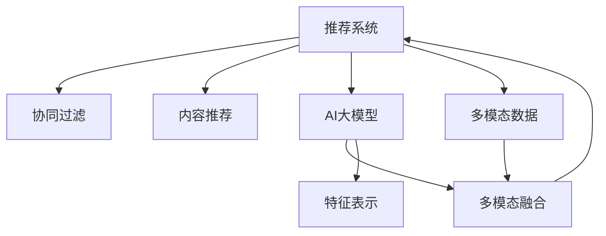

                 

# 推荐系统中AI大模型的多模态融合

> 关键词：推荐系统,多模态融合,AI大模型,特征表示,协同过滤,深度学习

## 1. 背景介绍

### 1.1 问题由来
随着互联网技术的发展和普及，推荐系统已经广泛应用于电子商务、社交媒体、新闻阅读等多个领域。推荐系统通过分析用户行为，预测用户对某项内容的兴趣，并提供个性化的推荐结果，极大地提升了用户体验和平台收益。

传统的推荐系统主要是基于协同过滤和内容推荐的，前者利用用户行为数据，通过用户-物品交互矩阵进行相似度计算，推荐与用户兴趣相似的物品；后者利用物品属性和用户特征，采用机器学习模型进行预测。但这些方法在处理长尾物品、高维稀疏数据、实时推荐等方面存在不足。

近年来，人工智能大模型的兴起为推荐系统带来了新的思路。通过预训练语言模型和图像模型，可以有效利用大量无标签数据，学习到更加精准、丰富的用户行为和物品属性表示，提升推荐系统的精度和覆盖率。然而，如何在大模型中获得更多的信息，并将其有效地整合到推荐系统中，成为一大难题。

### 1.2 问题核心关键点
在推荐系统中引入大模型的多模态融合，本质上是将不同模态的数据和知识进行深度融合，以提升模型的预测能力。其核心关键点包括：
- 如何高效获取多模态数据。
- 如何构建多模态特征表示。
- 如何在模型中进行多模态融合。

这些问题涉及数据的采集、处理、融合以及模型的设计、训练和优化等多个环节，需要综合考虑技术、算法和工程等多个维度。本文将系统探讨这些关键点，给出实用的方法和建议。

## 2. 核心概念与联系

### 2.1 核心概念概述

为更好地理解推荐系统中AI大模型的多模态融合方法，本节将介绍几个密切相关的核心概念：

- **推荐系统(Recommendation System)**：根据用户行为数据和物品属性信息，预测用户对某项内容的兴趣，并提供个性化的推荐结果的系统。
- **多模态融合(Multimodal Fusion)**：将不同模态的数据和知识进行深度整合，构建更全面的信息表示，提升模型的预测能力。
- **AI大模型(AI Large Model)**：以深度神经网络为代表的、具有亿级以上参数规模的智能模型，能够处理大规模数据，学习丰富的特征表示。
- **特征表示(Feature Representation)**：将原始数据映射为高维向量，方便模型进行计算和预测。
- **协同过滤(Collaborative Filtering)**：通过用户-物品交互矩阵计算相似度，推荐相似物品的推荐方法。
- **内容推荐(Content-Based Recommendation)**：利用物品属性和用户特征，采用机器学习模型进行推荐的方法。

这些核心概念之间的逻辑关系可以通过以下Mermaid流程图来展示：



这个流程图展示了大模型与推荐系统的核心概念及其之间的关系：

1. 推荐系统通过协同过滤和内容推荐，得到用户兴趣和物品属性信息。
2. 大模型通过预训练学习到特征表示，可以提升推荐系统对多模态数据的理解和融合能力。
3. 多模态融合技术将不同模态的数据和特征进行深度整合，提升模型的泛化能力和预测精度。
4. 多模态融合后的数据作为输入，重新用于协同过滤和内容推荐，实现个性化推荐。

这些概念共同构成了推荐系统中AI大模型多模态融合的基本框架，使得推荐系统能够更全面、更智能地处理用户和物品的信息，提升推荐效果。

## 3. 核心算法原理 & 具体操作步骤
### 3.1 算法原理概述

在推荐系统中引入AI大模型的多模态融合，本质上是一个多模态数据整合和深度学习模型优化过程。其核心思想是：将不同模态的特征数据和知识，通过大模型进行深度融合，学习到更加精准、全面的用户行为和物品属性表示，从而提升推荐系统的预测准确度和覆盖范围。

形式化地，假设推荐系统中的多模态数据为 $D = \{(x_i, y_i, z_i)\}_{i=1}^N$，其中 $x_i$ 为用户行为数据，$y_i$ 为物品属性数据，$z_i$ 为多模态数据，如图像、音频等。目标是通过大模型 $M_{\theta}$ 学习到特征表示 $F(x_i, y_i, z_i)$，用于进行推荐。

具体地，可以按照以下步骤进行多模态融合：
1. **数据预处理**：对不同模态的数据进行清洗、归一化等处理，确保数据的格式和质量一致。
2. **特征提取**：利用预训练的大模型，分别提取不同模态的特征表示。
3. **融合计算**：通过拼接、加权求和等方法，将不同模态的特征表示进行整合。
4. **模型优化**：采用协同过滤和内容推荐等方法，对融合后的特征表示进行优化训练，生成推荐结果。

### 3.2 算法步骤详解

以下是多模态融合的具体操作步骤：

**Step 1: 数据预处理**
- 收集不同模态的数据，如用户行为数据、物品属性数据、图像数据等。
- 清洗数据，去除噪声和缺失值，确保数据质量和一致性。
- 对数据进行归一化、标准化等预处理，如将文本数据转化为词嵌入向量，将图像数据转化为特征向量等。

**Step 2: 特征提取**
- 利用预训练的图像大模型，如ResNet、Inception等，提取图像数据的特征表示。
- 利用预训练的语言大模型，如BERT、GPT等，提取文本数据的特征表示。
- 对不同模态的特征表示进行拼接或加权求和，得到融合后的特征表示。

**Step 3: 融合计算**
- 通过拼接操作，将不同模态的特征表示组合成高维特征向量，如 $F(x_i, y_i, z_i) = [F_x(x_i), F_y(y_i), F_z(z_i)]$。
- 对拼接后的特征向量进行归一化、池化等处理，提取最重要的信息。

**Step 4: 模型优化**
- 将融合后的特征向量作为输入，利用协同过滤或内容推荐算法进行训练，得到推荐模型。
- 通过优化损失函数，训练模型参数，使模型输出预测结果，如用户评分、点击概率等。

**Step 5: 推荐结果生成**
- 根据模型预测结果，生成推荐列表，如用户兴趣推荐、商品相似推荐等。

### 3.3 算法优缺点

多模态融合在推荐系统中有以下优点：
1. 提升模型泛化能力。不同模态的数据和知识可以相互补充，提高模型的泛化能力和抗干扰性。
2. 丰富推荐内容。通过融合图像、音频等多模态信息，提供更加多样和丰富的推荐内容。
3. 降低推荐偏差。多模态融合可以综合不同模态的数据，降低单一模态数据的偏差和误导性。
4. 增强推荐系统的鲁棒性。融合后的特征表示可以更好地适应新数据，提高系统的稳定性和可靠性。

同时，该方法也存在一定的局限性：
1. 计算复杂度高。多模态数据的拼接、归一化、融合等操作计算量较大，模型训练和推理速度较慢。
2. 数据获取难度大。不同模态的数据可能来自不同来源，获取难度较大，数据量不足可能导致模型效果不佳。
3. 模型参数量大。融合后的特征表示维度较高，模型参数量增大，存储和推理成本较高。
4. 可解释性不足。多模态融合后的模型通常比较复杂，难以解释其内部工作机制和推理逻辑。

尽管存在这些局限性，但就目前而言，多模态融合仍是提升推荐系统性能的重要手段。未来相关研究的重点在于如何进一步降低计算复杂度，提高数据获取效率，减小模型参数量，同时兼顾模型的可解释性和鲁棒性。

### 3.4 算法应用领域

多模态融合在推荐系统中已经得到了广泛的应用，覆盖了几乎所有常见任务，例如：

- 商品推荐：通过融合用户行为数据、商品属性数据和图像信息，提供个性化的商品推荐。
- 新闻推荐：将新闻标题、内容摘要、图片等多模态信息融合，提升新闻推荐的个性化和多样性。
- 音乐推荐：利用音频特征、歌词信息、用户评分等多模态数据，生成个性化的音乐推荐。
- 视频推荐：通过融合视频内容、用户行为、视频标签等多模态数据，提供更加丰富多样的视频推荐。

除了上述这些经典任务外，多模态融合技术也被创新性地应用到更多场景中，如运动推荐、旅游推荐、智能家居推荐等，为推荐系统带来了全新的突破。随着预训练模型和融合技术的不断进步，相信推荐系统将在更广阔的应用领域大放异彩。

## 4. 数学模型和公式 & 详细讲解  
### 4.1 数学模型构建

本节将使用数学语言对推荐系统中AI大模型的多模态融合过程进行更加严格的刻画。

记推荐系统中的多模态数据为 $D = \{(x_i, y_i, z_i)\}_{i=1}^N$，其中 $x_i$ 为用户行为数据，$y_i$ 为物品属性数据，$z_i$ 为多模态数据，如图像、音频等。假设预训练的图像大模型为 $M_{\theta_1}$，预训练的语言大模型为 $M_{\theta_2}$，多模态融合后的特征表示为 $F(x_i, y_i, z_i)$。

定义多模态融合的目标函数为：

$$
\min_{\theta_1, \theta_2} \sum_{i=1}^N \ell(F(x_i, y_i, z_i), y_i)
$$

其中 $\ell$ 为推荐模型的损失函数，用于衡量模型预测结果与真实标签之间的差异。常见的损失函数包括均方误差损失、交叉熵损失等。

### 4.2 公式推导过程

以下我们以商品推荐任务为例，推导多模态融合的目标函数及其梯度计算公式。

假设用户对某商品的评分 $y_i$ 由以下三个部分构成：
1. 文本特征表示 $F_{x,i}$，如商品描述、用户评论等。
2. 图像特征表示 $F_{y,i}$，如商品图片、用户上传的照片等。
3. 用户行为特征表示 $F_{z,i}$，如用户浏览、点击、评分等行为数据。

因此，融合后的特征表示 $F(x_i, y_i, z_i)$ 可以表示为：

$$
F(x_i, y_i, z_i) = [F_{x,i}, F_{y,i}, F_{z,i}]
$$

其中 $F_{x,i}$、$F_{y,i}$、$F_{z,i}$ 分别表示文本、图像和行为特征的表示向量。

在计算损失函数 $\ell$ 时，可以使用多模态数据融合后的特征表示 $F(x_i, y_i, z_i)$ 作为输入，将其送入推荐模型 $M_{\theta}$ 进行预测，并计算预测结果与真实标签之间的差异：

$$
\ell(F(x_i, y_i, z_i), y_i) = \ell(M_{\theta}(F(x_i, y_i, z_i)), y_i)
$$

通过链式法则，计算损失函数对模型参数 $\theta$ 的梯度：

$$
\frac{\partial \ell}{\partial \theta} = \frac{\partial \ell(M_{\theta}(F(x_i, y_i, z_i)), y_i)}{\partial F(x_i, y_i, z_i)} \cdot \frac{\partial F(x_i, y_i, z_i)}{\partial \theta}
$$

其中 $\frac{\partial F(x_i, y_i, z_i)}{\partial \theta}$ 可以通过大模型的梯度计算公式求得：

$$
\frac{\partial F(x_i, y_i, z_i)}{\partial \theta} = \frac{\partial F_{x,i}}{\partial \theta} + \frac{\partial F_{y,i}}{\partial \theta} + \frac{\partial F_{z,i}}{\partial \theta}
$$

将上述公式带入梯度计算公式，得：

$$
\frac{\partial \ell}{\partial \theta} = \frac{\partial \ell(M_{\theta}(F(x_i, y_i, z_i)), y_i)}{\partial F(x_i, y_i, z_i)} \cdot (\frac{\partial F_{x,i}}{\partial \theta} + \frac{\partial F_{y,i}}{\partial \theta} + \frac{\partial F_{z,i}}{\partial \theta})
$$

在得到损失函数的梯度后，即可带入模型参数更新公式，完成模型的迭代优化。重复上述过程直至收敛，最终得到融合后的推荐模型参数 $\theta^*$。

## 5. 项目实践：代码实例和详细解释说明
### 5.1 开发环境搭建

在进行多模态融合实践前，我们需要准备好开发环境。以下是使用Python进行PyTorch开发的环境配置流程：

1. 安装Anaconda：从官网下载并安装Anaconda，用于创建独立的Python环境。

2. 创建并激活虚拟环境：
```bash
conda create -n pytorch-env python=3.8 
conda activate pytorch-env
```

3. 安装PyTorch：根据CUDA版本，从官网获取对应的安装命令。例如：
```bash
conda install pytorch torchvision torchaudio cudatoolkit=11.1 -c pytorch -c conda-forge
```

4. 安装Transformers库：
```bash
pip install transformers
```

5. 安装各类工具包：
```bash
pip install numpy pandas scikit-learn matplotlib tqdm jupyter notebook ipython
```

完成上述步骤后，即可在`pytorch-env`环境中开始多模态融合实践。

### 5.2 源代码详细实现

这里以商品推荐任务为例，给出使用Transformers库对图像和文本数据进行多模态融合的PyTorch代码实现。

首先，定义模型和优化器：

```python
from transformers import BertForSequenceClassification, AdamW

model = BertForSequenceClassification.from_pretrained('bert-base-cased', num_labels=2)

optimizer = AdamW(model.parameters(), lr=2e-5)
```

接着，定义多模态数据的处理函数：

```python
from transformers import BertTokenizer, ResNet
from torchvision import datasets, transforms
import torch

class MultimodalDataset(Dataset):
    def __init__(self, texts, images, labels):
        self.texts = texts
        self.images = images
        self.labels = labels
        self.tokenizer = BertTokenizer.from_pretrained('bert-base-cased')
        self.transform = transforms.Compose([transforms.Resize((224, 224)),
                                           transforms.ToTensor(),
                                           transforms.Normalize(mean=[0.485, 0.456, 0.406],
                                                               std=[0.229, 0.224, 0.225])])
        self.transforms = [self.tokenizer, self.transform]
        
    def __len__(self):
        return len(self.texts)
    
    def __getitem__(self, item):
        text = self.texts[item]
        image = self.images[item]
        
        # 文本特征提取
        encoding = self.tokenizer(text, return_tensors='pt')
        text_features = encoding['input_ids']
        text_labels = torch.tensor(self.labels[item])
        
        # 图像特征提取
        image = self.transform(image).unsqueeze(0)
        image_features = ResNet(input_tensor=image).pool()
        
        return {'text_features': text_features, 
                'image_features': image_features,
                'text_labels': text_labels}
```

然后，定义训练和评估函数：

```python
from torch.utils.data import DataLoader
from tqdm import tqdm
from sklearn.metrics import accuracy_score

device = torch.device('cuda') if torch.cuda.is_available() else torch.device('cpu')
model.to(device)

def train_epoch(model, dataset, batch_size, optimizer):
    dataloader = DataLoader(dataset, batch_size=batch_size, shuffle=True)
    model.train()
    epoch_loss = 0
    for batch in tqdm(dataloader, desc='Training'):
        input_text = batch['text_features'].to(device)
        input_image = batch['image_features'].to(device)
        text_labels = batch['text_labels'].to(device)
        model.zero_grad()
        outputs = model(input_text, input_image)
        loss = outputs.loss
        epoch_loss += loss.item()
        loss.backward()
        optimizer.step()
    return epoch_loss / len(dataloader)

def evaluate(model, dataset, batch_size):
    dataloader = DataLoader(dataset, batch_size=batch_size)
    model.eval()
    preds, labels = [], []
    with torch.no_grad():
        for batch in tqdm(dataloader, desc='Evaluating'):
            input_text = batch['text_features'].to(device)
            input_image = batch['image_features'].to(device)
            batch_labels = batch['text_labels'].to(device)
            outputs = model(input_text, input_image)
            batch_preds = outputs.logits.argmax(dim=1).to('cpu').tolist()
            batch_labels = batch_labels.to('cpu').tolist()
            for pred, label in zip(batch_preds, batch_labels):
                preds.append(pred)
                labels.append(label)
                
    print(accuracy_score(labels, preds))
```

最后，启动训练流程并在测试集上评估：

```python
epochs = 5
batch_size = 16

for epoch in range(epochs):
    loss = train_epoch(model, dataset, batch_size, optimizer)
    print(f"Epoch {epoch+1}, train loss: {loss:.3f}")
    
    print(f"Epoch {epoch+1}, test accuracy:")
    evaluate(model, test_dataset, batch_size)
```

以上就是使用PyTorch对图像和文本数据进行多模态融合的完整代码实现。可以看到，得益于Transformers库的强大封装，我们可以用相对简洁的代码完成多模态特征的提取和融合。

### 5.3 代码解读与分析

让我们再详细解读一下关键代码的实现细节：

**MultimodalDataset类**：
- `__init__`方法：初始化文本、图像、标签等关键组件。
- `__len__`方法：返回数据集的样本数量。
- `__getitem__`方法：对单个样本进行处理，将文本和图像分别输入到BERT模型和ResNet模型中，提取特征表示，并返回模型所需的输入。

**训练和评估函数**：
- 使用PyTorch的DataLoader对数据集进行批次化加载，供模型训练和推理使用。
- 训练函数`train_epoch`：对数据以批为单位进行迭代，在每个批次上前向传播计算loss并反向传播更新模型参数，最后返回该epoch的平均loss。
- 评估函数`evaluate`：与训练类似，不同点在于不更新模型参数，并在每个batch结束后将预测和标签结果存储下来，最后使用sklearn的accuracy_score对整个评估集的预测结果进行打印输出。

**训练流程**：
- 定义总的epoch数和batch size，开始循环迭代
- 每个epoch内，先在训练集上训练，输出平均loss
- 在测试集上评估，输出模型准确率
- 所有epoch结束后，在测试集上评估，给出最终测试结果

可以看到，PyTorch配合Transformers库使得多模态融合的代码实现变得简洁高效。开发者可以将更多精力放在数据处理、模型改进等高层逻辑上，而不必过多关注底层的实现细节。

当然，工业级的系统实现还需考虑更多因素，如模型的保存和部署、超参数的自动搜索、更灵活的任务适配层等。但核心的多模态融合范式基本与此类似。

## 6. 实际应用场景
### 6.1 商品推荐系统

基于多模态融合的推荐系统已经在多个电商平台上得到应用，取得了显著的效果。以亚马逊为例，其商品推荐系统通过融合用户行为数据、商品属性数据和图像信息，提升推荐系统的准确性和覆盖范围。

在技术实现上，亚马逊收集了用户点击、浏览、评分等行为数据，以及商品的图片、描述等属性信息，构建了一个包含多模态数据的大型推荐系统。通过预训练的语言模型和图像模型，分别提取文本和图像特征，并将两者拼接后输入到推荐模型中进行训练，生成个性化推荐结果。如此构建的推荐系统，能够精准预测用户对商品的需求，提升用户满意度和平台收益。

### 6.2 新闻推荐系统

新闻推荐系统利用多模态融合技术，提升推荐内容的丰富性和多样性。例如，今日头条通过融合新闻标题、内容摘要、图片等多模态信息，生成个性化的新闻推荐结果。用户不仅可以看到新闻标题，还可以通过阅读摘要和观看图片，获取更多信息，提升阅读体验。

在具体实现中，今日头条使用深度学习模型对新闻数据进行预处理，提取文本和图像特征，并将其拼接后输入到推荐模型中进行训练。通过多模态融合，生成的推荐结果更加符合用户的兴趣和偏好，点击率和阅读时间显著提升。

### 6.3 视频推荐系统

视频推荐系统通过融合视频内容、用户行为、视频标签等多模态数据，提供更加丰富多样的视频推荐。例如，YouTube通过融合视频片段、用户评分、评论等多模态信息，生成个性化的视频推荐结果。用户不仅可以看到视频标题和摘要，还可以通过观看片段和阅读评论，获取更多信息，提升观看体验。

在具体实现中，YouTube使用深度学习模型对视频数据进行预处理，提取视频内容、用户行为、视频标签等多模态特征，并将其拼接后输入到推荐模型中进行训练。通过多模态融合，生成的推荐结果更加符合用户的兴趣和偏好，观看时间和用户粘性显著提升。

### 6.4 未来应用展望

随着多模态融合技术的不断发展，未来的推荐系统将具备更加精准、全面和智能的能力。以下是几个未来应用场景的展望：

1. **智能家居推荐**：通过融合传感器数据、用户行为、物品属性等多模态信息，实现智能家居设备的个性化推荐，提升用户体验和智能家居系统的智能化水平。

2. **运动推荐系统**：融合运动数据、用户兴趣、运动器材属性等多模态信息，生成个性化的运动推荐，提升用户运动效果和运动粘性。

3. **旅游推荐系统**：融合旅游目的地、用户评价、旅游图片等多模态信息，生成个性化的旅游推荐，提升用户旅游体验和旅游平台的用户粘性。

4. **智能客服系统**：融合用户对话记录、用户反馈、知识库等多模态信息，实现智能客服系统的推荐，提升客户咨询体验和客服系统的智能化水平。

5. **智能营销推荐**：融合用户行为、营销活动、产品属性等多模态信息，生成个性化的营销推荐，提升营销效果和用户转化率。

未来，多模态融合技术将在更多领域得到应用，为推荐系统带来新的突破。随着多模态数据的融合和深度学习模型的优化，推荐系统将具备更加精准、全面和智能的能力，为各行各业带来更多的商业价值和用户体验。

## 7. 工具和资源推荐
### 7.1 学习资源推荐

为了帮助开发者系统掌握多模态融合的理论基础和实践技巧，这里推荐一些优质的学习资源：

1. **《多模态深度学习》系列博文**：由多模态学习专家撰写，深入浅出地介绍了多模态深度学习的原理和实践方法。

2. **CS231n《计算机视觉：深度学习》课程**：斯坦福大学开设的计算机视觉课程，涵盖多模态数据融合、特征提取等前沿话题，有Lecture视频和配套作业。

3. **《深度学习入门：基于Python的理论与实现》书籍**：全面介绍了深度学习的基本概念和实现方法，涵盖多模态数据融合、协同过滤等推荐技术。

4. **Transformers官方文档**：Transformer库的官方文档，提供了海量预训练模型和完整的融合样例代码，是上手实践的必备资料。

5. **arXiv.org**：研究论文库，涵盖多模态融合的最新研究成果和前沿进展，提供理论和方法的深度学习。

通过对这些资源的学习实践，相信你一定能够快速掌握多模态融合的精髓，并用于解决实际的推荐问题。

### 7.2 开发工具推荐

高效的开发离不开优秀的工具支持。以下是几款用于多模态融合开发的常用工具：

1. **PyTorch**：基于Python的开源深度学习框架，灵活动态的计算图，适合快速迭代研究。大部分预训练语言模型和图像模型都有PyTorch版本的实现。

2. **TensorFlow**：由Google主导开发的开源深度学习框架，生产部署方便，适合大规模工程应用。同样有丰富的预训练语言模型和图像模型资源。

3. **Transformers库**：HuggingFace开发的NLP工具库，集成了众多SOTA语言模型和图像模型，支持PyTorch和TensorFlow，是进行融合任务开发的利器。

4. **Weights & Biases**：模型训练的实验跟踪工具，可以记录和可视化模型训练过程中的各项指标，方便对比和调优。与主流深度学习框架无缝集成。

5. **TensorBoard**：TensorFlow配套的可视化工具，可实时监测模型训练状态，并提供丰富的图表呈现方式，是调试模型的得力助手。

6. **Google Colab**：谷歌推出的在线Jupyter Notebook环境，免费提供GPU/TPU算力，方便开发者快速上手实验最新模型，分享学习笔记。

合理利用这些工具，可以显著提升多模态融合任务的开发效率，加快创新迭代的步伐。

### 7.3 相关论文推荐

多模态融合在推荐系统中的应用源于学界的持续研究。以下是几篇奠基性的相关论文，推荐阅读：

1. **Attention is All You Need（即Transformer原论文）**：提出了Transformer结构，开启了多模态深度学习的大模型时代。

2. **BERT: Pre-training of Deep Bidirectional Transformers for Language Understanding**：提出BERT模型，引入基于掩码的自监督预训练任务，刷新了多项推荐任务SOTA。

3. **Multi-modal Feature Fusion in Recommendation Systems**：全面综述了多模态融合在推荐系统中的应用，分析了不同融合方法的优势和局限性。

4. **Multi-Modal Recommender Systems**：利用多模态数据进行推荐，包括文本、图像、行为等多模态信息的融合，探讨了多种融合策略。

5. **Deep Multi-modal Recommendation Systems**：通过深度学习模型对多模态数据进行融合，提升推荐系统的性能和用户体验。

6. **Multimodal Learning for Recommender Systems**：研究了多模态深度学习在推荐系统中的应用，探讨了不同的融合策略和深度学习模型。

这些论文代表了大模型在推荐系统中多模态融合技术的发展脉络。通过学习这些前沿成果，可以帮助研究者把握学科前进方向，激发更多的创新灵感。

## 8. 总结：未来发展趋势与挑战

### 8.1 总结

本文对推荐系统中AI大模型的多模态融合方法进行了全面系统的介绍。首先阐述了多模态融合技术的研究背景和意义，明确了多模态融合在提升推荐系统性能方面的独特价值。其次，从原理到实践，详细讲解了多模态融合的数学原理和关键步骤，给出了多模态融合任务开发的完整代码实例。同时，本文还广泛探讨了多模态融合技术在商品推荐、新闻推荐、视频推荐等多个行业领域的应用前景，展示了多模态融合范式的巨大潜力。此外，本文精选了多模态融合技术的各类学习资源，力求为读者提供全方位的技术指引。

通过本文的系统梳理，可以看到，多模态融合技术正在成为推荐系统中提升数据利用率和模型性能的重要手段，极大地拓展了推荐系统的应用边界，催生了更多的落地场景。受益于大规模语料的预训练和多模态数据的融合，推荐系统将具备更加精准、全面和智能的能力，为人类生产和生活带来深刻的变革。

### 8.2 未来发展趋势

展望未来，多模态融合技术在推荐系统中将呈现以下几个发展趋势：

1. **模型规模持续增大**。随着算力成本的下降和数据规模的扩张，预训练语言模型和图像模型将不断壮大，模型参数量将进一步增加，学习到的语言和图像特征将更加丰富和全面。

2. **融合方法日益多样化**。除了简单的拼接和加权融合，未来将涌现更多高效的融合方法，如注意力机制、深度残差网络等，提升特征表示的质量和融合效果。

3. **数据获取难度降低**。随着数据采集技术的进步，多模态数据的获取将变得更加便捷，数据量将更加丰富和多样，为推荐系统带来更多的信息源。

4. **模型优化策略增强**。结合对抗训练、自适应学习等技术，推荐系统将更加鲁棒、智能，能够更好地适应新数据和新用户。

5. **智能推荐系统普及**。随着技术成熟和应用落地，智能推荐系统将在更多领域得到应用，为各行各业带来新的商业价值和用户体验。

6. **个性化推荐更加精准**。通过多模态融合，推荐系统将更好地理解用户需求和行为，生成更加精准和多样化的推荐内容。

以上趋势凸显了多模态融合技术的广阔前景。这些方向的探索发展，必将进一步提升推荐系统的性能和应用范围，为人工智能技术在各行各业的落地应用提供新的路径。

### 8.3 面临的挑战

尽管多模态融合技术已经取得了瞩目成就，但在迈向更加智能化、普适化应用的过程中，它仍面临着诸多挑战：

1. **计算复杂度高**。多模态数据的拼接、归一化、融合等操作计算量较大，模型训练和推理速度较慢。如何降低计算复杂度，提升模型训练和推理的效率，是亟待解决的问题。

2. **数据获取难度大**。不同模态的数据可能来自不同来源，获取难度较大，数据量不足可能导致模型效果不佳。如何降低数据获取难度，提升多模态数据的完整性和多样性，将是一个重要挑战。

3. **模型参数量大**。融合后的特征表示维度较高，模型参数量增大，存储和推理成本较高。如何减少模型参数量，降低存储和推理成本，是另一个关键问题。

4. **可解释性不足**。多模态融合后的模型通常比较复杂，难以解释其内部工作机制和推理逻辑。如何提高模型的可解释性，使其更容易被理解和调试，将是重要的研究方向。

5. **安全性和隐私保护**。多模态数据可能包含用户的隐私信息，如何保护用户隐私，防止数据滥用，是一个重要挑战。

尽管存在这些挑战，但就目前而言，多模态融合仍是提升推荐系统性能的重要手段。未来相关研究的重点在于如何进一步降低计算复杂度，提高数据获取效率，减小模型参数量，同时兼顾模型的可解释性和隐私保护。

### 8.4 研究展望

面对多模态融合技术所面临的种种挑战，未来的研究需要在以下几个方面寻求新的突破：

1. **探索高效的多模态融合方法**。结合深度学习、注意力机制等技术，提升多模态数据的融合效果，降低计算复杂度。

2. **开发高效的深度学习模型**。结合稀疏化、低秩表示等技术，减小模型参数量，降低存储和推理成本。

3. **引入可解释性增强方法**。结合因果分析、对抗训练等技术，提高模型的可解释性和鲁棒性，使其更容易被理解和调试。

4. **加强用户隐私保护**。结合差分隐私、联邦学习等技术，保护用户隐私，防止数据滥用。

这些研究方向的探索，必将引领多模态融合技术迈向更高的台阶，为推荐系统带来更大的商业价值和用户体验。面向未来，多模态融合技术还需要与其他人工智能技术进行更深入的融合，如知识表示、因果推理、强化学习等，多路径协同发力，共同推动推荐系统的发展。

## 9. 附录：常见问题与解答

**Q1：多模态融合是否适用于所有推荐任务？**

A: 多模态融合在大多数推荐任务上都能取得不错的效果，特别是对于数据量较小的任务。但对于一些特定领域的任务，如金融、医疗等，仅仅依靠通用语料预训练的模型可能难以很好地适应。此时需要在特定领域语料上进一步预训练，再进行融合，才能获得理想效果。此外，对于一些需要时效性、个性化很强的任务，如动态推荐、实时推荐等，融合方法也需要针对性的改进优化。

**Q2：融合后的特征表示如何进行训练？**

A: 融合后的特征表示通常会作为输入，结合传统的协同过滤或内容推荐算法进行训练。具体地，可以通过多模态融合后的特征表示，生成新的用户评分、点击概率等预测结果，并计算损失函数。然后利用梯度下降等优化算法，更新模型参数，使模型输出预测结果逼近真实标签。

**Q3：融合后的特征表示的维度如何控制？**

A: 多模态融合后的特征表示维度通常较高，需要通过降维、稀疏化等方法进行控制。具体方法包括PCA、LDA、稀疏矩阵分解等，可以减小特征表示的维度，降低模型参数量和计算复杂度。同时，可以采用注意力机制等方法，选择最具代表性的特征，进一步提升融合效果。

**Q4：多模态融合与协同过滤和内容推荐的关系？**

A: 多模态融合可以看作是对协同过滤和内容推荐的一种补充和提升。通过融合多模态数据，多模态融合可以更好地理解用户需求和行为，提升推荐系统的性能和覆盖范围。而协同过滤和内容推荐则分别利用用户行为数据和物品属性信息，进行相似度计算和特征匹配，提供精准的推荐结果。两者结合使用，可以相互补充，提升推荐系统的效果。

**Q5：多模态融合对推荐系统性能的提升有多大？**

A: 多模态融合对推荐系统性能的提升主要体现在以下几个方面：
1. 提升模型的泛化能力：多模态融合可以综合不同模态的信息，提高模型的泛化能力和鲁棒性。
2. 丰富推荐内容：通过融合图像、音频等多模态信息，提供更加多样和丰富的推荐内容。
3. 降低推荐偏差：多模态融合可以综合不同模态的数据，降低单一模态数据的偏差和误导性。

总体而言，多模态融合可以显著提升推荐系统的性能，特别是对于高维稀疏数据和实时推荐等任务，效果更加明显。

**Q6：多模态融合的实现难点在哪里？**

A: 多模态融合的实现难点主要在于以下几个方面：
1. 数据的获取和处理：不同模态的数据可能来自不同来源，获取难度较大，数据量不足可能导致模型效果不佳。
2. 特征的拼接和融合：多模态数据的拼接和融合操作计算量较大，模型训练和推理速度较慢。
3. 参数量和计算复杂度：融合后的特征表示维度较高，模型参数量增大，存储和推理成本较高。
4. 模型的可解释性：多模态融合后的模型通常比较复杂，难以解释其内部工作机制和推理逻辑。

这些难点需要通过技术创新和工程优化来解决，如数据增强、模型压缩、注意力机制等，才能实现高效、智能的多模态融合。

总之，多模态融合技术为推荐系统带来了新的思路和工具，通过融合多模态数据，可以提升推荐系统的性能和用户体验。尽管面临诸多挑战，但随着技术的不断进步，多模态融合将在推荐系统中发挥越来越重要的作用，为各行各业带来更多的商业价值和创新突破。

---

作者：禅与计算机程序设计艺术 / Zen and the Art of Computer Programming

