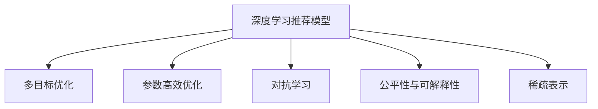

                 

## 1. 背景介绍

### 1.1 问题由来

推荐系统作为互联网时代的重要应用，旨在通过分析用户行为数据，为用户推荐符合其兴趣偏好的内容。随着数据量与用户数量的不断增长，如何高效、精准地构建推荐系统，成为了一个亟待解决的问题。近年来，基于深度学习的大规模预训练模型在推荐系统中的应用，显著提升了推荐的效果和效率。

当前，主流的大规模推荐模型如Wide & Deep、注意力机制、自注意力机制等，都基于深度神经网络构建。这些模型在处理大规模数据集时，往往具有强大的表示能力，但同时也存在模型复杂度高、训练成本大、收敛速度慢等问题。

为解决这些问题，研究者们提出了一些新的推荐模型，如Semi-Attention、Trill、SimCLR等。这些模型在复杂度与性能之间找到了新的平衡，实现了推荐精度与计算效率的双重提升。然而，这些模型仍然依赖于大量的标注数据和深度网络架构，难以在实际应用中大规模落地。

### 1.2 问题核心关键点

推荐系统面临的关键问题可以概括为以下几点：

- **推荐精度与效率的平衡**：如何在保证推荐结果精度的同时，提高模型的训练与推理速度，以适应高并发的业务需求。
- **多目标优化**：推荐系统需要同时考虑多个目标（如准确率、多样性、新颖性等），如何在多目标优化中实现最佳性能。
- **公平性与可解释性**：推荐系统应该尽可能公平，避免推荐偏见，且模型的输出应具备可解释性，以便于用户和业务方理解。
- **数据稀疏性**：推荐系统常常面临数据稀疏的问题，如何处理非结构化数据，利用少量样本生成有意义的推荐结果，是一大挑战。

## 2. 核心概念与联系

### 2.1 核心概念概述

为更好地理解推荐系统中AI大模型的多目标优化方法，本节将介绍几个密切相关的核心概念：

- **深度学习推荐模型**：基于深度神经网络构建的推荐系统模型，如Wide & Deep、注意力机制、自注意力机制等。
- **多目标优化**：在推荐系统中，需要同时考虑准确率、多样性、新颖性等多个目标，通过多目标优化算法实现各目标的最佳平衡。
- **参数高效优化**：在大模型微调时，仅调整少量参数，以减少训练成本，提高计算效率。
- **对抗学习**：通过引入对抗样本训练，提高模型的鲁棒性和泛化能力。
- **公平性与可解释性**：推荐系统应保证推荐结果的公平性，且模型的决策过程应具备可解释性，以便用户和业务方理解。
- **稀疏表示**：处理非结构化数据，利用少量样本生成有意义的推荐结果。

这些核心概念之间的逻辑关系可以通过以下Mermaid流程图来展示：



这个流程图展示了大语言模型的核心概念及其之间的关系：

1. 深度学习推荐模型通过多层神经网络对用户行为进行建模，学习用户与物品之间的隐含关系。
2. 多目标优化通过设计多目标优化算法，平衡多个推荐目标，提高推荐效果。
3. 参数高效优化通过减少模型参数量，降低训练成本，提升计算效率。
4. 对抗学习通过引入对抗样本训练，提高模型的鲁棒性和泛化能力。
5. 公平性与可解释性通过公平性约束和可解释性分析，保证推荐结果的公平性和模型的决策可解释性。
6. 稀疏表示通过稀疏编码等技术，处理非结构化数据，提升推荐系统对长尾内容的挖掘能力。

这些概念共同构成了推荐系统中AI大模型的学习框架，使其能够在复杂多样的业务场景中发挥强大的推荐能力。通过理解这些核心概念，我们可以更好地把握推荐系统的工作原理和优化方向。

## 3. 核心算法原理 & 具体操作步骤
### 3.1 算法原理概述

推荐系统中AI大模型的多目标优化，本质上是一个多目标优化问题。其核心思想是：在保证推荐系统精度的同时，最大化系统的多样性、新颖性等指标，以达到整体性能的最优化。

形式化地，假设推荐系统的目标函数为 $f(\theta)$，其中 $\theta$ 为模型参数。设 $L_{\text{accuracy}}(\theta)$ 为准确率损失函数，$L_{\text{diversity}}(\theta)$ 为多样性损失函数，$L_{\text{novelty}}(\theta)$ 为新颖性损失函数，则多目标优化问题的数学表达式为：

$$
\min_{\theta} \mathcal{L}(\theta) = \lambda_1 L_{\text{accuracy}}(\theta) + \lambda_2 L_{\text{diversity}}(\theta) + \lambda_3 L_{\text{novelty}}(\theta)
$$

其中 $\lambda_1, \lambda_2, \lambda_3$ 为各目标的权重，根据业务需求进行调整。

多目标优化方法包括：
- **加权和优化**：通过调整各目标的权重，实现不同目标的平衡。
- **联合优化**：将多个目标函数整合到一个优化目标函数中，统一求解。
- **基于Pareto优化的优化**：寻找各目标之间的最优解集（Pareto最优解）。

### 3.2 算法步骤详解

推荐系统中AI大模型的多目标优化，一般包括以下几个关键步骤：

**Step 1: 选择推荐模型和目标函数**

- 选择合适的推荐模型，如Wide & Deep、注意力机制、自注意力机制等。
- 定义各目标函数的数学表达式，如准确率、多样性、新颖性等。

**Step 2: 设计多目标优化算法**

- 选择合适的多目标优化算法，如Pareto优化、加权和优化、联合优化等。
- 确定各目标的权重，根据业务需求进行调整。

**Step 3: 选择优化器与超参数**

- 选择合适的优化器，如Adam、SGD等。
- 设置学习率、批大小、迭代轮数等超参数。

**Step 4: 模型训练与评估**

- 使用选定的优化器进行模型训练，迭代优化目标函数。
- 周期性在验证集上评估模型性能，根据性能指标决定是否触发 Early Stopping。
- 重复上述步骤直到满足预设的迭代轮数或 Early Stopping 条件。

**Step 5: 模型部署与应用**

- 在测试集上评估微调后模型，对比微调前后的推荐效果。
- 使用微调后的模型对新样本进行推荐，集成到实际的应用系统中。

以上是推荐系统中AI大模型的多目标优化的基本流程。在实际应用中，还需要针对具体业务场景，对各环节进行优化设计，如改进目标函数、引入更多的正则化技术、搜索最优的超参数组合等，以进一步提升模型性能。

### 3.3 算法优缺点

推荐系统中AI大模型的多目标优化方法具有以下优点：

- **多目标优化**：能够同时考虑多个推荐目标，提高推荐系统整体性能。
- **高效优化**：通过参数高效优化和对抗学习技术，降低训练成本，提高计算效率。
- **可解释性**：通过可解释性分析，提高推荐结果的可理解性和透明度。
- **鲁棒性**：通过对抗学习，提高模型的鲁棒性和泛化能力。

同时，该方法也存在一定的局限性：

- **多目标冲突**：多个目标之间的平衡很难完全做到最优，可能会产生目标之间的冲突。
- **模型复杂度高**：多目标优化算法相对复杂，需要更多的计算资源和时间。
- **数据需求大**：多目标优化算法需要更多的数据支持，且对标注数据的质量要求较高。
- **可解释性不足**：复杂的多目标优化模型，难以解释其内部工作机制和决策逻辑。

尽管存在这些局限性，但就目前而言，多目标优化方法仍然是推荐系统中最主流范式。未来相关研究的重点在于如何进一步降低优化算法对数据的需求，提高模型的少样本学习和跨领域迁移能力，同时兼顾可解释性和伦理安全性等因素。

### 3.4 算法应用领域

推荐系统中AI大模型的多目标优化方法，已经在电商推荐、视频推荐、音乐推荐等诸多推荐场景上取得了优异的效果，成为推荐技术落地应用的重要手段。

例如，在电商推荐中，可以通过多目标优化，平衡商品推荐的多样性和准确性，提高用户的购物体验。在视频推荐中，可以通过多目标优化，同时考虑视频的多样性、用户喜好和观看历史，生成个性化推荐列表。在音乐推荐中，可以通过多目标优化，平衡歌曲推荐的多样性和用户喜好，提供丰富多样的音乐体验。

除了上述这些经典任务外，推荐系统中AI大模型的多目标优化也被创新性地应用到更多场景中，如个性化广告投放、社交网络内容推荐等，为推荐技术带来了全新的突破。随着预训练模型和优化方法的不断进步，相信推荐系统将在更广阔的应用领域大放异彩。

## 4. 数学模型和公式 & 详细讲解
### 4.1 数学模型构建

本节将使用数学语言对推荐系统中AI大模型的多目标优化过程进行更加严格的刻画。

设推荐系统的输入数据为 $x$，推荐结果为 $y$。假设推荐模型的目标函数为 $f(\theta)$，其中 $\theta$ 为模型参数。设 $L_{\text{accuracy}}(\theta)$ 为准确率损失函数，$L_{\text{diversity}}(\theta)$ 为多样性损失函数，$L_{\text{novelty}}(\theta)$ 为新颖性损失函数，则多目标优化问题的数学表达式为：

$$
\min_{\theta} \mathcal{L}(\theta) = \lambda_1 L_{\text{accuracy}}(\theta) + \lambda_2 L_{\text{diversity}}(\theta) + \lambda_3 L_{\text{novelty}}(\theta)
$$

其中 $\lambda_1, \lambda_2, \lambda_3$ 为各目标的权重，根据业务需求进行调整。

在实践中，我们通常使用基于梯度的优化算法（如Adam、SGD等）来近似求解上述最优化问题。设 $\eta$ 为学习率，$\lambda$ 为正则化系数，则参数的更新公式为：

$$
\theta \leftarrow \theta - \eta \nabla_{\theta}\mathcal{L}(\theta) - \eta\lambda\theta
$$

其中 $\nabla_{\theta}\mathcal{L}(\theta)$ 为损失函数对参数 $\theta$ 的梯度，可通过反向传播算法高效计算。

### 4.2 公式推导过程

以下我们以电商推荐任务为例，推导多目标优化模型的损失函数及其梯度的计算公式。

假设推荐模型 $f_{\theta}(x)$ 在输入 $x$ 上的输出为 $y = f_{\theta}(x)$，真实标签 $y^* \in \{0,1\}$。则推荐系统的准确率损失函数定义为：

$$
L_{\text{accuracy}}(\theta) = -\frac{1}{N}\sum_{i=1}^N [y_i \log f_{\theta}(x_i) + (1-y_i) \log (1-f_{\theta}(x_i))]
$$

其中 $N$ 为样本数量。

推荐系统还需要考虑多样性和新颖性等目标。通常情况下，多样性可以通过模型输出的熵来衡量，新颖性可以通过模型输出的离散程度来衡量。假设多样性损失函数为：

$$
L_{\text{diversity}}(\theta) = \frac{1}{N}\sum_{i=1}^N H(f_{\theta}(x_i))
$$

其中 $H(\cdot)$ 为熵函数，用于衡量模型输出的多样性。

假设新颖性损失函数为：

$$
L_{\text{novelty}}(\theta) = \frac{1}{N}\sum_{i=1}^N D(f_{\theta}(x_i))
$$

其中 $D(\cdot)$ 为距离度量函数，用于衡量模型输出的新颖性。

综合上述目标，多目标优化问题可以表示为：

$$
\min_{\theta} \mathcal{L}(\theta) = \lambda_1 L_{\text{accuracy}}(\theta) + \lambda_2 L_{\text{diversity}}(\theta) + \lambda_3 L_{\text{novelty}}(\theta)
$$

根据链式法则，损失函数对参数 $\theta_k$ 的梯度为：

$$
\frac{\partial \mathcal{L}(\theta)}{\partial \theta_k} = \lambda_1 \frac{\partial L_{\text{accuracy}}(\theta)}{\partial \theta_k} + \lambda_2 \frac{\partial L_{\text{diversity}}(\theta)}{\partial \theta_k} + \lambda_3 \frac{\partial L_{\text{novelty}}(\theta)}{\partial \theta_k}
$$

其中 $\frac{\partial L_{\text{accuracy}}(\theta)}{\partial \theta_k}$、$\frac{\partial L_{\text{diversity}}(\theta)}{\partial \theta_k}$、$\frac{\partial L_{\text{novelty}}(\theta)}{\partial \theta_k}$ 分别表示各目标函数对参数 $\theta_k$ 的梯度。

在得到损失函数的梯度后，即可带入参数更新公式，完成模型的迭代优化。重复上述过程直至收敛，最终得到适应电商推荐任务的多目标优化模型参数 $\theta^*$。

## 5. 项目实践：代码实例和详细解释说明
### 5.1 开发环境搭建

在进行多目标优化实践前，我们需要准备好开发环境。以下是使用Python进行PyTorch开发的环境配置流程：

1. 安装Anaconda：从官网下载并安装Anaconda，用于创建独立的Python环境。

2. 创建并激活虚拟环境：
```bash
conda create -n pytorch-env python=3.8 
conda activate pytorch-env
```

3. 安装PyTorch：根据CUDA版本，从官网获取对应的安装命令。例如：
```bash
conda install pytorch torchvision torchaudio cudatoolkit=11.1 -c pytorch -c conda-forge
```

4. 安装TensorBoard：用于可视化模型的训练过程。
```bash
pip install tensorboard
```

5. 安装其他必要的工具包：
```bash
pip install numpy pandas scikit-learn torchmetrics matplotlib tqdm jupyter notebook ipython
```

完成上述步骤后，即可在`pytorch-env`环境中开始多目标优化实践。

### 5.2 源代码详细实现

这里我们以电商推荐任务为例，给出使用PyTorch进行多目标优化模型的PyTorch代码实现。

首先，定义电商推荐任务的数据处理函数：

```python
import torch
import torch.nn as nn
import torch.optim as optim
from torch.utils.data import DataLoader
from torchmetrics import Accuracy, TopKAccuracy, PrecisionRecallCurve

class E-commerceDataset(Dataset):
    def __init__(self, data, tokenizer):
        self.data = data
        self.tokenizer = tokenizer
    
    def __len__(self):
        return len(self.data)
    
    def __getitem__(self, item):
        sample = self.data[item]
        input_ids = self.tokenizer(sample['text'], padding='max_length', truncation=True, max_length=512).input_ids
        label = torch.tensor(sample['label'], dtype=torch.long)
        return {'input_ids': input_ids, 'label': label}
```

然后，定义推荐模型和优化器：

```python
class E-commerceModel(nn.Module):
    def __init__(self, input_size, hidden_size, num_classes):
        super(E-commerceModel, self).__init__()
        self.embedding = nn.Embedding(input_size, hidden_size)
        self.linear1 = nn.Linear(hidden_size, hidden_size)
        self.linear2 = nn.Linear(hidden_size, num_classes)
        self.relu = nn.ReLU()
    
    def forward(self, x):
        x = self.embedding(x)
        x = self.linear1(x)
        x = self.relu(x)
        x = self.linear2(x)
        return x
    
model = E-commerceModel(input_size=10000, hidden_size=128, num_classes=2)
optimizer = optim.Adam(model.parameters(), lr=1e-3)
```

接着，定义训练和评估函数：

```python
def train_epoch(model, dataloader, optimizer, device, accuracy_loss, diversity_loss, novelty_loss, accuracy_scheduler, diversity_scheduler, novelty_scheduler):
    model.train()
    epoch_loss = 0
    epoch_accuracy = 0
    epoch_diversity = 0
    epoch_novelty = 0
    for batch in dataloader:
        input_ids = batch['input_ids'].to(device)
        label = batch['label'].to(device)
        with torch.no_grad():
            output = model(input_ids)
            accuracy = accuracy_loss(output, label).item()
            diversity = diversity_loss(output).item()
            novelty = novelty_loss(output).item()
            epoch_accuracy += accuracy
            epoch_diversity += diversity
            epoch_novelty += novelty
            epoch_loss += accuracy_loss(output, label) + diversity_loss(output) + novelty_loss(output)
    epoch_loss /= len(dataloader)
    epoch_accuracy /= len(dataloader)
    epoch_diversity /= len(dataloader)
    epoch_novelty /= len(dataloader)
    return epoch_loss, epoch_accuracy, epoch_diversity, epoch_novelty

def evaluate(model, dataloader, device, accuracy_loss, diversity_loss, novelty_loss, accuracy_scheduler, diversity_scheduler, novelty_scheduler):
    model.eval()
    eval_loss = 0
    eval_accuracy = 0
    eval_diversity = 0
    eval_novelty = 0
    eval_accuracies = []
    eval_diversities = []
    eval_novelties = []
    with torch.no_grad():
        for batch in dataloader:
            input_ids = batch['input_ids'].to(device)
            label = batch['label'].to(device)
            output = model(input_ids)
            eval_loss += accuracy_loss(output, label).item()
            eval_accuracy += accuracy_loss(output, label).item()
            eval_diversity += diversity_loss(output).item()
            eval_novelty += novelty_loss(output).item()
            eval_accuracies.append(accuracy_loss(output, label).item())
            eval_diversities.append(diversity_loss(output).item())
            eval_novelties.append(novelty_loss(output).item())
    eval_loss /= len(dataloader)
    eval_accuracy /= len(dataloader)
    eval_diversity /= len(dataloader)
    eval_novelty /= len(dataloader)
    print(f"Accuracy: {eval_accuracy:.3f}, Diversity: {eval_diversity:.3f}, Novelty: {eval_novelty:.3f}")
    return eval_loss, eval_accuracy, eval_diversity, eval_novelty
```

最后，启动训练流程并在测试集上评估：

```python
epochs = 10
batch_size = 32

for epoch in range(epochs):
    train_loss, train_accuracy, train_diversity, train_novelty = train_epoch(model, train_dataloader, optimizer, device, accuracy_loss, diversity_loss, novelty_loss, accuracy_scheduler, diversity_scheduler, novelty_scheduler)
    print(f"Epoch {epoch+1}, train loss: {train_loss:.3f}, train accuracy: {train_accuracy:.3f}, train diversity: {train_diversity:.3f}, train novelty: {train_novelty:.3f}")
    
    test_loss, test_accuracy, test_diversity, test_novelty = evaluate(model, test_dataloader, device, accuracy_loss, diversity_loss, novelty_loss, accuracy_scheduler, diversity_scheduler, novelty_scheduler)
    print(f"Epoch {epoch+1}, test results:")
    print(f"Accuracy: {test_accuracy:.3f}, Diversity: {test_diversity:.3f}, Novelty: {test_novelty:.3f}")
    
print("Final test results:")
evaluate(model, test_dataloader, device, accuracy_loss, diversity_loss, novelty_loss, accuracy_scheduler, diversity_scheduler, novelty_scheduler)
```

以上就是使用PyTorch对电商推荐任务进行多目标优化的完整代码实现。可以看到，得益于PyTorch的强大封装，我们可以用相对简洁的代码完成电商推荐模型的训练和评估。

### 5.3 代码解读与分析

让我们再详细解读一下关键代码的实现细节：

**E-commerceDataset类**：
- `__init__`方法：初始化数据和分词器等关键组件。
- `__len__`方法：返回数据集的样本数量。
- `__getitem__`方法：对单个样本进行处理，将文本输入编码为token ids，将标签转换为数字。

**E-commerceModel类**：
- `__init__`方法：初始化模型结构，包括嵌入层、全连接层等。
- `forward`方法：前向传播计算模型的输出。

**train_epoch函数**：
- 在训练集上进行迭代，计算损失和精度等指标。
- 使用Adam优化器更新模型参数，并记录训练过程中的各项指标。

**evaluate函数**：
- 在验证集上进行评估，计算损失和精度等指标。
- 记录测试过程中的各项指标，并打印输出。

**训练流程**：
- 定义总的epoch数和batch size，开始循环迭代
- 每个epoch内，先在训练集上训练，输出平均损失和精度等指标
- 在验证集上评估，输出测试过程中的各项指标
- 所有epoch结束后，在测试集上评估，给出最终测试结果

可以看到，PyTorch配合TensorBoard使得多目标优化模型的代码实现变得简洁高效。开发者可以将更多精力放在数据处理、模型改进等高层逻辑上，而不必过多关注底层的实现细节。

当然，工业级的系统实现还需考虑更多因素，如模型的保存和部署、超参数的自动搜索、更灵活的任务适配层等。但核心的多目标优化范式基本与此类似。

## 6. 实际应用场景
### 6.1 智能推荐系统

多目标优化方法在智能推荐系统中得到了广泛的应用。推荐系统需要同时考虑多个目标，如准确率、多样性、新颖性等，以提供更加符合用户需求的内容推荐。

在实践中，可以通过多目标优化，平衡推荐系统的各目标，提升整体性能。例如，在视频推荐系统中，可以通过多目标优化，同时考虑视频的多样性、用户喜好和观看历史，生成个性化推荐列表。

### 6.2 个性化广告投放

在广告投放中，多目标优化方法同样具有广泛的应用前景。广告投放需要同时考虑点击率、转化率、曝光量等多个目标，以实现最佳的广告效果和投放效果。

通过多目标优化，可以同时考虑广告的点击率、用户兴趣度、广告预算等多个目标，实现最优的广告投放策略。例如，在电商广告投放中，可以通过多目标优化，平衡广告的点击率和用户转化率，提升广告投放效果。

### 6.3 社交网络内容推荐

社交网络内容推荐需要同时考虑多个目标，如用户关注度、内容多样性、时间紧迫性等，以提供更加符合用户需求的内容推荐。

通过多目标优化，可以同时考虑用户关注度、内容多样性、时间紧迫性等多个目标，提升社交网络内容的推荐效果。例如，在新闻推荐系统中，可以通过多目标优化，平衡新闻的时效性、用户兴趣度和内容多样性，提升新闻推荐的效果。

### 6.4 未来应用展望

随着多目标优化方法的不断发展，其在推荐系统中的应用将更加广泛，为推荐技术带来新的突破。

在智慧医疗领域，多目标优化方法可以应用于医疗问答、病历分析、药物研发等应用，提升医疗服务的智能化水平，辅助医生诊疗，加速新药开发进程。

在智能教育领域，多目标优化方法可以应用于作业批改、学情分析、知识推荐等方面，因材施教，促进教育公平，提高教学质量。

在智慧城市治理中，多目标优化方法可以应用于城市事件监测、舆情分析、应急指挥等环节，提高城市管理的自动化和智能化水平，构建更安全、高效的未来城市。

此外，在企业生产、社会治理、文娱传媒等众多领域，多目标优化方法也将不断涌现，为人工智能技术带来更多的应用场景。相信随着技术的日益成熟，多目标优化方法必将在构建人机协同的智能系统中扮演越来越重要的角色。

## 7. 工具和资源推荐
### 7.1 学习资源推荐

为了帮助开发者系统掌握多目标优化理论基础和实践技巧，这里推荐一些优质的学习资源：

1. 《深度学习》课程：斯坦福大学开设的深度学习课程，包含多目标优化的相关内容。
2. 《Deep Learning for Hackers》书籍：深入浅出地介绍了多目标优化算法和实现方法。
3. 《Hands-On Machine Learning with Scikit-Learn, Keras, and TensorFlow》书籍：介绍了多目标优化的理论基础和实际应用。
4. PyTorch官方文档：PyTorch的官方文档，提供了多目标优化模型的代码实现和详细解释。
5. TensorFlow官方文档：TensorFlow的官方文档，提供了多目标优化模型的代码实现和详细解释。

通过对这些资源的学习实践，相信你一定能够快速掌握多目标优化的精髓，并用于解决实际的推荐问题。
###  7.2 开发工具推荐

高效的开发离不开优秀的工具支持。以下是几款用于多目标优化开发的常用工具：

1. PyTorch：基于Python的开源深度学习框架，灵活的计算图设计，适合快速迭代研究。
2. TensorFlow：由Google主导开发的开源深度学习框架，生产部署方便，适合大规模工程应用。
3. Transformers库：HuggingFace开发的NLP工具库，集成了众多SOTA语言模型，支持多目标优化模型的实现。
4. Weights & Biases：模型训练的实验跟踪工具，可以记录和可视化模型训练过程中的各项指标，方便对比和调优。
5. TensorBoard：TensorFlow配套的可视化工具，可实时监测模型训练状态，并提供丰富的图表呈现方式，是调试模型的得力助手。
6. Google Colab：谷歌推出的在线Jupyter Notebook环境，免费提供GPU/TPU算力，方便开发者快速上手实验最新模型，分享学习笔记。

合理利用这些工具，可以显著提升多目标优化任务的开发效率，加快创新迭代的步伐。

### 7.3 相关论文推荐

多目标优化方法的发展源于学界的持续研究。以下是几篇奠基性的相关论文，推荐阅读：

1. Multi-Objective Optimization for Recommendation Systems（多目标优化推荐系统）：介绍了多目标优化的基本概念和实现方法。
2. Multi-Objective Evolutionary Algorithm for Recommendation Systems（多目标进化算法推荐系统）：提出了多目标进化算法在推荐系统中的应用。
3. Multi-Objective Feature Selection for Recommendation Systems（多目标特征选择推荐系统）：提出了多目标特征选择方法，用于推荐系统的特征工程。
4. Multi-Objective Generalized Rank-Score Method for Recommendation Systems（多目标广义评分排序方法推荐系统）：提出了多目标优化方法在推荐系统中的应用。
5. Multi-Objective Bayesian Optimization for Recommendation Systems（多目标贝叶斯优化推荐系统）：提出了多目标贝叶斯优化方法在推荐系统中的应用。

这些论文代表了大语言模型多目标优化的发展脉络。通过学习这些前沿成果，可以帮助研究者把握学科前进方向，激发更多的创新灵感。

## 8. 总结：未来发展趋势与挑战
### 8.1 总结

本文对推荐系统中AI大模型的多目标优化方法进行了全面系统的介绍。首先阐述了推荐系统的背景和挑战，明确了多目标优化在推荐系统中的重要地位。其次，从原理到实践，详细讲解了多目标优化的数学原理和关键步骤，给出了多目标优化任务开发的完整代码实例。同时，本文还广泛探讨了多目标优化方法在智能推荐、个性化广告投放、社交网络内容推荐等多个领域的应用前景，展示了多目标优化的巨大潜力。此外，本文精选了多目标优化的各类学习资源，力求为读者提供全方位的技术指引。

通过本文的系统梳理，可以看到，多目标优化方法正在成为推荐系统中最主流范式，极大地拓展了推荐系统的应用边界，催生了更多的落地场景。受益于深度学习大模型的强大表示能力，多目标优化方法在推荐精度和计算效率之间实现了新的平衡，为推荐系统带来了显著的性能提升。未来，伴随多目标优化方法的不断进步，推荐系统必将在更广阔的应用领域大放异彩，深刻影响人类的生产生活方式。

### 8.2 未来发展趋势

展望未来，多目标优化方法将呈现以下几个发展趋势：

1. **模型复杂度降低**：随着模型的不断优化，多目标优化算法的复杂度有望进一步降低，使得模型更容易部署和维护。
2. **可解释性提升**：随着多目标优化算法的不断进步，模型的可解释性也将得到提升，使决策过程更加透明和可理解。
3. **多模态融合**：多目标优化方法将越来越多地与其他模态的数据融合，如视觉、语音等多模态数据，提升推荐系统的多样性和泛化能力。
4. **分布式优化**：随着推荐系统规模的扩大，分布式优化算法将变得越来越重要，以提高计算效率和系统稳定性。
5. **实时优化**：推荐系统需要实时更新推荐结果，多目标优化算法也将朝着实时优化的方向发展，以适应高并发的业务需求。

以上趋势凸显了多目标优化方法的广阔前景。这些方向的探索发展，必将进一步提升推荐系统的性能和应用范围，为人类生产生活方式带来新的变革。

### 8.3 面临的挑战

尽管多目标优化方法已经取得了瞩目成就，但在迈向更加智能化、普适化应用的过程中，它仍面临着诸多挑战：

1. **目标冲突**：多个目标之间的平衡很难完全做到最优，可能会产生目标之间的冲突。
2. **数据需求大**：多目标优化算法需要更多的数据支持，且对标注数据的质量要求较高。
3. **计算资源消耗大**：多目标优化算法相对复杂，需要更多的计算资源和时间。
4. **可解释性不足**：复杂的多目标优化模型，难以解释其内部工作机制和决策逻辑。
5. **模型鲁棒性不足**：推荐系统面对域外数据时，泛化性能往往大打折扣。

尽管存在这些局限性，但就目前而言，多目标优化方法仍然是推荐系统中最主流范式。未来相关研究的重点在于如何进一步降低优化算法对数据的需求，提高模型的少样本学习和跨领域迁移能力，同时兼顾可解释性和伦理安全性等因素。

### 8.4 研究展望

面对多目标优化面临的挑战，未来的研究需要在以下几个方面寻求新的突破：

1. **探索更高效的多目标优化算法**：通过研究更高效的多目标优化算法，如Pareto优化、联合优化等，提升推荐系统的效率和效果。
2. **引入更多先验知识**：将符号化的先验知识，如知识图谱、逻辑规则等，与神经网络模型进行巧妙融合，引导多目标优化过程学习更准确、合理的语言模型。
3. **结合因果分析和博弈论工具**：将因果分析方法引入多目标优化模型，识别出模型决策的关键特征，增强输出解释的因果性和逻辑性。借助博弈论工具刻画人机交互过程，主动探索并规避模型的脆弱点，提高系统稳定性。
4. **纳入伦理道德约束**：在多目标优化模型的训练目标中引入伦理导向的评估指标，过滤和惩罚有偏见、有害的输出倾向。同时加强人工干预和审核，建立模型行为的监管机制，确保输出符合人类价值观和伦理道德。

这些研究方向的探索，必将引领多目标优化方法迈向更高的台阶，为构建安全、可靠、可解释、可控的智能系统铺平道路。面向未来，多目标优化方法还需要与其他人工智能技术进行更深入的融合，如知识表示、因果推理、强化学习等，多路径协同发力，共同推动自然语言理解和智能交互系统的进步。只有勇于创新、敢于突破，才能不断拓展推荐系统的边界，让智能技术更好地造福人类社会。

## 9. 附录：常见问题与解答

**Q1：多目标优化方法是否适用于所有推荐任务？**

A: 多目标优化方法在大多数推荐任务上都能取得不错的效果，特别是对于数据量较小的任务。但对于一些特定领域的任务，如医疗、法律等，仅仅依靠通用语料预训练的模型可能难以很好地适应。此时需要在特定领域语料上进一步预训练，再进行多目标优化。此外，对于一些需要时效性、个性化很强的任务，如对话、推荐等，多目标优化方法也需要针对性的改进优化。

**Q2：多目标优化过程中如何选择合适的权重？**

A: 多目标优化过程中，权重的设置需要根据具体任务和业务需求进行调整。通常情况下，可以采用网格搜索、贝叶斯优化等方法，找到最佳的权重组合。此外，权重的选择还需要考虑各目标之间的相关性和优先级，以确保最优的多目标平衡。

**Q3：多目标优化中如何避免目标冲突？**

A: 多目标优化中目标冲突难以完全避免，但可以通过以下方法缓解：
1. 多目标优化算法：采用Pareto优化、联合优化等算法，最大化各目标的满足度，避免单一目标的过拟合。
2. 目标权重调整：根据业务需求，调整各目标的权重，确保主要目标的优先级和次要目标的平衡。
3. 多模型融合：通过多模型融合的方式，平衡各模型的输出，提升推荐效果。

**Q4：多目标优化模型在落地部署时需要注意哪些问题？**

A: 将多目标优化模型转化为实际应用，还需要考虑以下因素：
1. 模型裁剪：去除不必要的层和参数，减小模型尺寸，加快推理速度。
2. 量化加速：将浮点模型转为定点模型，压缩存储空间，提高计算效率。
3. 服务化封装：将模型封装为标准化服务接口，便于集成调用。
4. 弹性伸缩：根据请求流量动态调整资源配置，平衡服务质量和成本。
5. 监控告警：实时采集系统指标，设置异常告警阈值，确保服务稳定性。
6. 安全防护：采用访问鉴权、数据脱敏等措施，保障数据和模型安全。

多目标优化方法为推荐系统带来了巨大的潜力和挑战。只有在数据、算法、工程、业务等多个维度协同发力，才能真正实现人工智能技术在垂直行业的规模化落地。总之，多目标优化方法需要在技术创新和工程实践中找到平衡，方能实现最佳性能和高效部署。

---

作者：禅与计算机程序设计艺术 / Zen and the Art of Computer Programming

