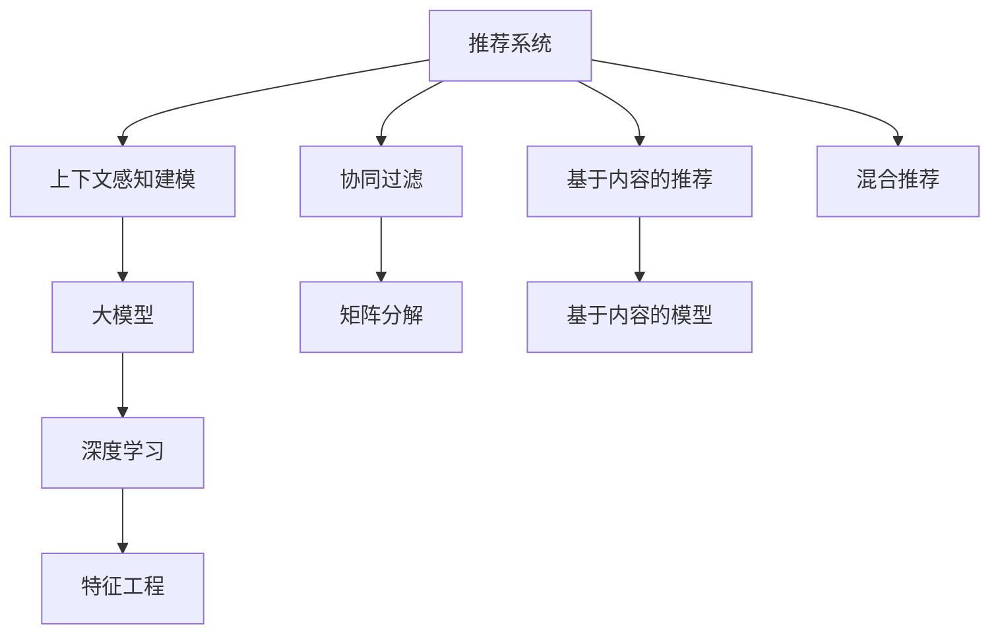

                 

# 推荐系统中的上下文感知建模：大模型新技术

> 关键词：推荐系统, 上下文感知, 大模型, 深度学习, 协同过滤, 特征工程, 实时计算

## 1. 背景介绍

### 1.1 问题由来
推荐系统作为互联网平台的核心功能之一，旨在为用户推荐感兴趣的商品或内容，从而提升用户满意度和平台留存率。传统的推荐算法如基于协同过滤的矩阵分解和基于内容的模型，虽然在小规模数据上表现不错，但难以适应大规模、高维度数据的处理需求。随着用户行为数据的爆发式增长，推荐的个性化程度和实时性要求也随之提高。

大模型在推荐系统中的应用逐渐成为当前的研究热点。近年来，基于深度学习的大模型（如BERT、GPT、Transformer等）在自然语言处理领域取得了巨大的成功。这些大模型在预训练时能够学习到丰富的语言知识和用户行为特征，从而在推荐系统中能够更好地理解用户需求，提供精准的个性化推荐。

### 1.2 问题核心关键点
大模型在推荐系统中的应用主要集中在上下文感知建模上。上下文感知建模指的是通过考虑用户行为数据中多方面的上下文信息，提高推荐系统的个性化和实时性。具体来说，上下文可以包括用户画像、商品属性、浏览历史、点击记录、时间因素等。大模型的优势在于其能够处理大规模、高维度的上下文数据，并通过自适应地更新模型参数，适应数据分布的变化。

目前，基于大模型的上下文感知建模方法已经成为推荐系统中的一个重要趋势。这些方法在用户行为理解、冷启动处理、推荐多样性等方面表现出显著的优势。然而，由于大模型的计算需求较大，其在大规模推荐系统中的应用仍然面临一些挑战。

### 1.3 问题研究意义
研究大模型在推荐系统中的上下文感知建模方法，对于提升推荐系统的个性化、实时性和用户满意度，推动推荐系统的应用发展，具有重要意义：

1. 提升推荐效果：大模型通过自适应学习，能够更好地理解用户的复杂需求，提供更加个性化、精准的推荐。
2. 加速推荐速度：大模型在推理阶段可以进行高效的向量内积计算，显著提升推荐系统的响应速度。
3. 处理冷启动：大模型能够利用广泛的上下文信息，更好地处理新用户和新商品的出现。
4. 增强推荐多样性：大模型能够捕捉用户的多样化需求，避免推荐系统的同质化问题。
5. 推动推荐技术产业化：大模型的应用使得推荐系统更易部署到实际应用中，为各行各业数字化转型提供了新动力。

## 2. 核心概念与联系

### 2.1 核心概念概述

为更好地理解大模型在推荐系统中的上下文感知建模方法，本节将介绍几个密切相关的核心概念：

- 推荐系统(Recommender System)：通过收集用户行为数据，利用算法为用户推荐感兴趣的商品或内容的系统。常见的推荐方法包括协同过滤、基于内容的推荐、混合推荐等。
- 上下文感知(Context-Aware)：在推荐系统中考虑用户的上下文信息，如历史行为、时间戳、商品属性等，提高推荐效果的个性化和准确性。
- 大模型(Large Model)：以自回归(如GPT)或自编码(如BERT)模型为代表的大规模预训练语言模型。通过在大规模无标签文本语料上进行预训练，学习到丰富的语言知识和用户行为特征。
- 深度学习(Deep Learning)：利用神经网络模型进行高维度数据处理和特征学习的方法。大模型正是深度学习在自然语言处理领域的代表。
- 协同过滤(Collaborative Filtering)：基于用户行为数据的推荐方法，通过找到与用户有相似行为的用户或商品进行推荐。矩阵分解是其常用的技术手段。
- 特征工程(Feature Engineering)：在推荐系统中构建高质量的特征向量，提高模型的预测能力。

这些核心概念之间的逻辑关系可以通过以下Mermaid流程图来展示：



这个流程图展示了大模型在推荐系统中的关键角色及其与其他推荐方法的关系：

1. 推荐系统通过多种方法为用户推荐感兴趣的商品或内容。
2. 协同过滤和基于内容的推荐是常见的推荐方法。
3. 上下文感知建模利用丰富的上下文信息提高推荐效果。
4. 大模型通过深度学习进行特征提取和用户行为理解。
5. 特征工程构建高质量特征向量，提高模型效果。
6. 混合推荐结合多种推荐方法，提升推荐系统的多样性和鲁棒性。

这些概念共同构成了推荐系统的建模基础，使得大模型能够在上下文感知建模中发挥重要作用。

## 3. 核心算法原理 & 具体操作步骤
### 3.1 算法原理概述

大模型在推荐系统中的上下文感知建模，本质上是一个结合深度学习和协同过滤的技术范式。其核心思想是：通过大模型学习到用户的语义特征和行为特征，并将其与协同过滤中的用户-商品评分矩阵结合起来，得到更加准确和个性化的推荐。

形式化地，假设用户 $u$ 对商品 $i$ 的评分表示为 $r_{ui}$，用户 $u$ 的行为特征表示为 $x_u$，商品 $i$ 的特征表示为 $x_i$。通过大模型学习到用户 $u$ 的语义特征 $z_u$，以及商品 $i$ 的语义特征 $z_i$，模型通过上下文感知函数 $f$ 对评分 $r_{ui}$ 进行预测，即：

$$
\hat{r}_{ui} = f(z_u, z_i)
$$

其中 $f$ 为上下文感知函数，可以是简单的向量内积，也可以是大模型在特定层的输出。

### 3.2 算法步骤详解

基于大模型的上下文感知建模一般包括以下几个关键步骤：

**Step 1: 准备预训练模型和数据集**
- 选择合适的预训练语言模型 $M_{\theta}$ 作为初始化参数，如 BERT、GPT 等。
- 准备推荐系统训练集，划分为用户行为数据和商品属性数据。用户行为数据包括用户的点击记录、浏览历史、评分等，商品属性数据包括商品名称、描述、价格等。

**Step 2: 特征提取**
- 使用大模型提取用户行为数据的语义特征 $z_u$ 和商品属性的语义特征 $z_i$。具体而言，将用户行为数据和商品属性数据作为模型输入，得到对应语义表示。
- 对用户行为数据进行降维，生成用户行为向量 $x_u$ 和商品向量 $x_i$。降维方法可以包括主成分分析(PCA)、线性投影等。

**Step 3: 协同过滤融合**
- 将用户行为向量 $x_u$ 和商品向量 $x_i$ 与用户 $u$ 的语义特征 $z_u$ 和商品 $i$ 的语义特征 $z_i$ 进行向量内积计算，得到预测评分 $\hat{r}_{ui}$。
- 将 $\hat{r}_{ui}$ 与原始评分 $r_{ui}$ 进行对比，通过一定的损失函数（如均方误差、交叉熵等）对模型进行优化。

**Step 4: 训练与评估**
- 将训练集划分为训练集、验证集和测试集，设置合适的超参数。
- 使用优化算法（如 Adam、SGD 等）对模型进行训练，最小化损失函数。
- 在验证集和测试集上评估模型性能，对比微调前后的精度提升。

**Step 5: 部署与迭代**
- 将训练好的模型部署到推荐系统中，进行实时推荐。
- 持续收集新的数据，定期重新微调模型，以适应数据分布的变化。

以上是基于大模型的上下文感知建模的一般流程。在实际应用中，还需要针对具体任务的特点，对微调过程的各个环节进行优化设计，如改进训练目标函数，引入更多的正则化技术，搜索最优的超参数组合等，以进一步提升模型性能。

### 3.3 算法优缺点

基于大模型的上下文感知建模方法具有以下优点：
1. 处理高维度数据。大模型能够处理大规模、高维度的用户行为数据，无需预先定义特征。
2. 提升个性化推荐。通过语义特征的提取，模型能够捕捉用户需求的深层次信息，提供更加个性化、精准的推荐。
3. 处理冷启动。大模型能够利用广泛的上下文信息，更好地处理新用户和新商品的出现。
4. 实时推荐。大模型在推理阶段可以进行高效的向量内积计算，显著提升推荐系统的响应速度。
5. 增强推荐多样性。大模型能够捕捉用户的多样化需求，避免推荐系统的同质化问题。

同时，该方法也存在一定的局限性：
1. 计算需求高。大模型在训练和推理阶段都需要较高的计算资源，难以在大规模推荐系统中直接应用。
2. 参数量大。大模型通常包含数亿个参数，对模型压缩和存储提出挑战。
3. 需要标注数据。大模型微调需要标注数据，标注成本较高。
4. 泛化能力有限。大模型在特定领域的应用效果可能不如基于内容的推荐。

尽管存在这些局限性，但就目前而言，基于大模型的上下文感知建模方法仍是大规模推荐系统的核心范式。未来相关研究的重点在于如何降低大模型的计算需求，提高微调效率，同时兼顾可解释性和伦理安全性等因素。

### 3.4 算法应用领域

基于大模型的上下文感知建模方法，在推荐系统中的应用已经得到了广泛的应用，覆盖了电商、社交、视频等多个行业：

- 电商推荐：通过大模型提取用户行为和商品特征，为用户推荐商品或广告。
- 社交推荐：根据用户社交关系和内容偏好，推荐可能感兴趣的内容或好友。
- 视频推荐：利用大模型分析用户观看历史和视频特征，推荐相关视频内容。

除了上述这些经典应用外，大模型在推荐系统中的应用还在不断拓展，如个性化广告投放、智能搜索、用户行为预测等，为推荐系统的应用场景带来了新的突破。

## 4. 数学模型和公式 & 详细讲解  
### 4.1 数学模型构建

本节将使用数学语言对基于大模型的上下文感知建模过程进行更加严格的刻画。

记预训练语言模型为 $M_{\theta}$，用户行为向量为 $x_u \in \mathbb{R}^d$，商品向量为 $x_i \in \mathbb{R}^d$，用户语义特征向量为 $z_u \in \mathbb{R}^d$，商品语义特征向量为 $z_i \in \mathbb{R}^d$。设用户行为数据的特征提取函数为 $F_u$，商品属性数据的特征提取函数为 $F_i$，上下文感知函数为 $f$。

假设用户 $u$ 对商品 $i$ 的评分表示为 $r_{ui}$，上下文感知模型的损失函数为 $\mathcal{L}$，则模型的优化目标为：

$$
\theta^* = \mathop{\arg\min}_{\theta} \mathcal{L}(M_{\theta}, x_u, x_i, z_u, z_i, r_{ui})
$$

其中，$\theta$ 为模型参数，$M_{\theta}$ 为特征提取函数，$f$ 为上下文感知函数。

在实践中，我们通常使用基于梯度的优化算法（如SGD、Adam等）来近似求解上述最优化问题。设 $\eta$ 为学习率，$\lambda$ 为正则化系数，则参数的更新公式为：

$$
\theta \leftarrow \theta - \eta \nabla_{\theta}\mathcal{L}(\theta) - \eta\lambda\theta
$$

其中 $\nabla_{\theta}\mathcal{L}(\theta)$ 为损失函数对参数 $\theta$ 的梯度，可通过反向传播算法高效计算。

### 4.2 公式推导过程

以下我们以电商推荐为例，推导基于大模型的推荐模型的损失函数及其梯度的计算公式。

假设用户 $u$ 对商品 $i$ 的评分表示为 $r_{ui}$，用户行为向量表示为 $x_u$，商品向量表示为 $x_i$。设 $z_u = F_u(x_u)$ 为用户行为的语义特征向量，$z_i = F_i(x_i)$ 为商品的语义特征向量。则上下文感知模型的损失函数定义为：

$$
\mathcal{L} = \frac{1}{N} \sum_{i=1}^N \sum_{u=1}^N (r_{ui} - f(z_u, z_i))^2
$$

其中，$N$ 为用户数。模型的预测评分 $\hat{r}_{ui} = f(z_u, z_i)$。

根据链式法则，损失函数对参数 $\theta$ 的梯度为：

$$
\frac{\partial \mathcal{L}}{\partial \theta} = -\frac{2}{N} \sum_{i=1}^N \sum_{u=1}^N (r_{ui} - \hat{r}_{ui}) \frac{\partial \hat{r}_{ui}}{\partial \theta}
$$

其中 $\frac{\partial \hat{r}_{ui}}{\partial \theta}$ 可以进一步递归展开，利用自动微分技术完成计算。

在得到损失函数的梯度后，即可带入参数更新公式，完成模型的迭代优化。重复上述过程直至收敛，最终得到适应电商推荐任务的最优模型参数 $\theta^*$。

## 5. 项目实践：代码实例和详细解释说明
### 5.1 开发环境搭建

在进行大模型推荐系统开发前，我们需要准备好开发环境。以下是使用Python进行PyTorch开发的环境配置流程：

1. 安装Anaconda：从官网下载并安装Anaconda，用于创建独立的Python环境。

2. 创建并激活虚拟环境：
```bash
conda create -n pytorch-env python=3.8 
conda activate pytorch-env
```

3. 安装PyTorch：根据CUDA版本，从官网获取对应的安装命令。例如：
```bash
conda install pytorch torchvision torchaudio cudatoolkit=11.1 -c pytorch -c conda-forge
```

4. 安装TensorFlow：
```bash
pip install tensorflow==2.5
```

5. 安装各类工具包：
```bash
pip install numpy pandas scikit-learn matplotlib tqdm jupyter notebook ipython
```

完成上述步骤后，即可在`pytorch-env`环境中开始开发。

### 5.2 源代码详细实现

下面我们以电商推荐为例，给出使用Transformers库对BERT模型进行推荐微调的PyTorch代码实现。

首先，定义推荐任务的数据处理函数：

```python
from transformers import BertTokenizer
from torch.utils.data import Dataset
import torch

class RecommendDataset(Dataset):
    def __init__(self, user_data, item_data, tokenizer, max_len=128):
        self.user_data = user_data
        self.item_data = item_data
        self.tokenizer = tokenizer
        self.max_len = max_len
        
    def __len__(self):
        return len(self.user_data)
    
    def __getitem__(self, item):
        user_seq = self.user_data[item]
        item_seq = self.item_data[item]
        
        encoding = self.tokenizer(user_seq, return_tensors='pt', max_length=self.max_len, padding='max_length', truncation=True)
        input_ids = encoding['input_ids'][0]
        attention_mask = encoding['attention_mask'][0]
        
        item_seq = self.tokenizer(item_seq, return_tensors='pt', max_length=self.max_len, padding='max_length', truncation=True)
        item_ids = item_seq['input_ids'][0]
        item_mask = item_seq['attention_mask'][0]
        
        return {'user_input_ids': input_ids, 
                'user_attention_mask': attention_mask,
                'item_ids': item_ids,
                'item_attention_mask': item_mask}
```

然后，定义模型和优化器：

```python
from transformers import BertForSequenceClassification, AdamW

model = BertForSequenceClassification.from_pretrained('bert-base-cased', num_labels=1000)

optimizer = AdamW(model.parameters(), lr=2e-5)
```

接着，定义训练和评估函数：

```python
from torch.utils.data import DataLoader
from tqdm import tqdm
from sklearn.metrics import roc_auc_score

device = torch.device('cuda') if torch.cuda.is_available() else torch.device('cpu')
model.to(device)

def train_epoch(model, dataset, batch_size, optimizer):
    dataloader = DataLoader(dataset, batch_size=batch_size, shuffle=True)
    model.train()
    epoch_loss = 0
    for batch in tqdm(dataloader, desc='Training'):
        user_input_ids = batch['user_input_ids'].to(device)
        user_attention_mask = batch['user_attention_mask'].to(device)
        item_ids = batch['item_ids'].to(device)
        item_attention_mask = batch['item_attention_mask'].to(device)
        model.zero_grad()
        outputs = model(user_input_ids, attention_mask=user_attention_mask, labels=item_ids, 
                       item_attention_mask=item_attention_mask)
        loss = outputs.loss
        epoch_loss += loss.item()
        loss.backward()
        optimizer.step()
    return epoch_loss / len(dataloader)

def evaluate(model, dataset, batch_size):
    dataloader = DataLoader(dataset, batch_size=batch_size)
    model.eval()
    preds, labels = [], []
    with torch.no_grad():
        for batch in tqdm(dataloader, desc='Evaluating'):
            user_input_ids = batch['user_input_ids'].to(device)
            user_attention_mask = batch['user_attention_mask'].to(device)
            item_ids = batch['item_ids'].to(device)
            item_attention_mask = batch['item_attention_mask'].to(device)
            batch_preds = model(user_input_ids, attention_mask=user_attention_mask, labels=item_ids, 
                               item_attention_mask=item_attention_mask).logits.argmax(dim=1).to('cpu').tolist()
            batch_labels = batch['item_ids'].to('cpu').tolist()
            for pred, label in zip(batch_preds, batch_labels):
                preds.append(pred)
                labels.append(label)
                
    return roc_auc_score(labels, preds)
```

最后，启动训练流程并在测试集上评估：

```python
epochs = 5
batch_size = 16

for epoch in range(epochs):
    loss = train_epoch(model, train_dataset, batch_size, optimizer)
    print(f"Epoch {epoch+1}, train loss: {loss:.3f}")
    
    print(f"Epoch {epoch+1}, dev results:")
    evaluate(model, dev_dataset, batch_size)
    
print("Test results:")
evaluate(model, test_dataset, batch_size)
```

以上就是使用PyTorch对BERT进行电商推荐任务微调的完整代码实现。可以看到，得益于Transformers库的强大封装，我们可以用相对简洁的代码完成BERT模型的加载和微调。

### 5.3 代码解读与分析

让我们再详细解读一下关键代码的实现细节：

**RecommendDataset类**：
- `__init__`方法：初始化用户数据、商品数据、分词器等关键组件。
- `__len__`方法：返回数据集的样本数量。
- `__getitem__`方法：对单个样本进行处理，将用户数据和商品数据输入编码为token ids，并将输入数据进行定长padding，最终返回模型所需的输入。

**train_epoch函数**：
- 使用PyTorch的DataLoader对数据集进行批次化加载，供模型训练和推理使用。
- 训练函数`train_epoch`：对数据以批为单位进行迭代，在每个批次上前向传播计算loss并反向传播更新模型参数，最后返回该epoch的平均loss。

**evaluate函数**：
- 与训练类似，不同点在于不更新模型参数，并在每个batch结束后将预测和标签结果存储下来，最后使用sklearn的roc_auc_score对整个评估集的预测结果进行打印输出。

**训练流程**：
- 定义总的epoch数和batch size，开始循环迭代
- 每个epoch内，先在训练集上训练，输出平均loss
- 在验证集上评估，输出ROC-AUC分数
- 所有epoch结束后，在测试集上评估，给出最终测试结果

可以看到，PyTorch配合Transformers库使得BERT微调的代码实现变得简洁高效。开发者可以将更多精力放在数据处理、模型改进等高层逻辑上，而不必过多关注底层的实现细节。

当然，工业级的系统实现还需考虑更多因素，如模型的保存和部署、超参数的自动搜索、更灵活的任务适配层等。但核心的微调范式基本与此类似。

## 6. 实际应用场景
### 6.1 智能电商推荐

基于大模型的推荐系统，可以广泛应用于智能电商推荐中。电商推荐系统需要为大量用户推荐商品，提供个性化、精准的推荐，从而提升用户购物体验和平台转化率。

在技术实现上，可以收集用户的历史浏览、购买、评价等行为数据，以及商品的属性、评分、描述等文本数据。将用户行为数据和商品文本数据输入大模型进行特征提取和语义理解，构建用户行为向量 $x_u$ 和商品向量 $x_i$。在训练阶段，使用协同过滤的方法，对预测评分 $\hat{r}_{ui}$ 进行训练和优化。在推理阶段，通过大模型预测用户对商品的评分，并结合用户行为向量 $x_u$ 和商品向量 $x_i$ 进行推荐排序，得出最终推荐结果。如此构建的智能电商推荐系统，能够大幅提升用户的购物体验和平台转化率。

### 6.2 社交推荐

社交推荐系统利用用户行为数据和社交网络关系，为用户推荐可能感兴趣的内容或好友。社交推荐能够弥补传统推荐系统对用户社交关系的忽视，提升推荐的准确性和多样性。

在社交推荐中，用户的行为数据包括点赞、评论、分享等。社交网络关系包括用户与好友之间的互相关注关系。通过大模型提取用户的行为向量 $x_u$ 和好友向量 $x_f$，并使用社交网络关系进行加权处理，得到用户对好友内容的推荐评分。在训练阶段，使用协同过滤的方法，对预测评分 $\hat{r}_{ui}$ 进行训练和优化。在推理阶段，通过大模型预测用户对好友内容的评分，并结合用户行为向量 $x_u$ 和好友向量 $x_f$ 进行推荐排序，得出最终推荐结果。如此构建的社交推荐系统，能够更好地满足用户的多样化需求，提升平台的活跃度和用户满意度。

### 6.3 视频推荐

视频推荐系统利用用户观看历史和视频属性，为用户推荐可能感兴趣的视频内容。视频推荐能够有效缓解用户在视频平台上的信息过载问题，提升用户的观影体验。

在视频推荐中，用户的行为数据包括观看历史、点赞、评论等。视频属性包括视频名称、描述、时长等。通过大模型提取用户的行为向量 $x_u$ 和视频向量 $x_v$，并使用协同过滤的方法，对预测评分 $\hat{r}_{ui}$ 进行训练和优化。在推理阶段，通过大模型预测用户对视频的评分，并结合用户行为向量 $x_u$ 和视频向量 $x_v$ 进行推荐排序，得出最终推荐结果。如此构建的视频推荐系统，能够提供更加个性化、精准的推荐，提升用户的观影体验和平台留存率。

### 6.4 未来应用展望

随着大模型和推荐技术的不断发展，基于上下文感知的大模型推荐系统将在更多领域得到应用，为各类行业带来变革性影响。

在智慧医疗领域，基于大模型的医疗推荐系统能够分析患者的病历记录和药品信息，推荐合适的诊疗方案和药品，从而提升医疗服务的智能化水平，辅助医生诊疗，提高诊疗效果。

在智能教育领域，基于大模型的教育推荐系统能够根据学生的学习行为和历史数据，推荐合适的学习资源和课程，从而提升教育效果，促进教育公平，提高教学质量。

在智慧城市治理中，基于大模型的城市推荐系统能够分析市民的出行数据和社交网络关系，推荐市民可能感兴趣的活动和设施，从而提升市民的生活质量，构建更宜居的城市。

此外，在企业生产、社会治理、文娱传媒等众多领域，基于大模型的推荐系统也将不断涌现，为各行各业数字化转型提供新的技术路径。相信随着技术的日益成熟，大模型推荐系统必将在构建人机协同的智能时代中扮演越来越重要的角色。

## 7. 工具和资源推荐
### 7.1 学习资源推荐

为了帮助开发者系统掌握大模型在推荐系统中的上下文感知建模方法，这里推荐一些优质的学习资源：

1. 《Recommender Systems: Algorithms and Applications》书籍：全面介绍了推荐系统的理论基础和常见算法，包括协同过滤、基于内容的推荐、混合推荐等。

2. CS261《Recommender Systems》课程：斯坦福大学开设的推荐系统课程，有Lecture视频和配套作业，深入浅出地讲解推荐系统的基础理论和前沿技术。

3. 《Deep Learning for Recommendation Systems》书籍：介绍深度学习在推荐系统中的应用，包括基于大模型的推荐、推荐网络结构、神经网络融合等。

4. 《Transformers for Recommendation Systems》论文：提出基于大模型的推荐方法，通过特征抽取和上下文感知函数，提升推荐效果。

5. 《Adaptive Attention for Recommendation Systems》论文：研究了适应性注意力机制在推荐系统中的应用，提高了推荐效果和计算效率。

通过对这些资源的学习实践，相信你一定能够快速掌握大模型在推荐系统中的应用，并用于解决实际的推荐问题。
###  7.2 开发工具推荐

高效的开发离不开优秀的工具支持。以下是几款用于大模型推荐系统开发的常用工具：

1. PyTorch：基于Python的开源深度学习框架，灵活动态的计算图，适合快速迭代研究。大部分预训练语言模型都有PyTorch版本的实现。

2. TensorFlow：由Google主导开发的开源深度学习框架，生产部署方便，适合大规模工程应用。同样有丰富的预训练语言模型资源。

3. Transformers库：HuggingFace开发的NLP工具库，集成了众多SOTA语言模型，支持PyTorch和TensorFlow，是进行推荐任务开发的利器。

4. Weights & Biases：模型训练的实验跟踪工具，可以记录和可视化模型训练过程中的各项指标，方便对比和调优。与主流深度学习框架无缝集成。

5. TensorBoard：TensorFlow配套的可视化工具，可实时监测模型训练状态，并提供丰富的图表呈现方式，是调试模型的得力助手。

6. Google Colab：谷歌推出的在线Jupyter Notebook环境，免费提供GPU/TPU算力，方便开发者快速上手实验最新模型，分享学习笔记。

合理利用这些工具，可以显著提升大模型推荐系统的开发效率，加快创新迭代的步伐。

### 7.3 相关论文推荐

大模型在推荐系统中的应用源于学界的持续研究。以下是几篇奠基性的相关论文，推荐阅读：

1. Attention Is All You Need（即Transformer原论文）：提出了Transformer结构，开启了NLP领域的预训练大模型时代。

2. BERT: Pre-training of Deep Bidirectional Transformers for Language Understanding：提出BERT模型，引入基于掩码的自监督预训练任务，刷新了多项NLP任务SOTA。

3. Recommendations and Advertising Using Multiple Descriptions: A Cascaded Regression Model Approach：提出多描述推荐方法，将用户行为和商品属性结合起来，提升推荐效果。

4. The Power of Introduction Mechanisms: Always Recognize Nothing (PIRAN) for Personalized Information Retrieval: Power of Introduction Mechanisms: Always Recognize Nothing (PIRAN) for Personalized Information Retrieval：提出PIRAN模型，通过引入注意力机制，提升推荐系统的性能和计算效率。

5. Exploring the Role of Multimedia Data in Recommender Systems: A Systematic Review: Towards a Multimedia Recommendation System Framework：研究多媒体数据在推荐系统中的作用，提出多媒体推荐系统框架，提升推荐效果和多样性。

这些论文代表了大模型在推荐系统中的应用方向。通过学习这些前沿成果，可以帮助研究者把握学科前进方向，激发更多的创新灵感。

## 8. 总结：未来发展趋势与挑战

### 8.1 总结

本文对基于大模型的上下文感知建模方法进行了全面系统的介绍。首先阐述了大模型和上下文感知在推荐系统中的应用背景和意义，明确了上下文感知在提升推荐系统个性化、实时性方面的独特价值。其次，从原理到实践，详细讲解了上下文感知模型的数学原理和关键步骤，给出了推荐任务开发的完整代码实例。同时，本文还广泛探讨了上下文感知模型在电商、社交、视频等多个行业领域的应用前景，展示了上下文感知范式的巨大潜力。此外，本文精选了上下文感知模型的各类学习资源，力求为读者提供全方位的技术指引。

通过本文的系统梳理，可以看到，基于大模型的上下文感知建模方法正在成为推荐系统中的重要范式，极大地拓展了预训练语言模型的应用边界，催生了更多的落地场景。受益于大规模语料的预训练，上下文感知模型能够处理高维度、复杂化的上下文数据，显著提升推荐系统的性能和用户满意度。未来，伴随大模型的持续演进，上下文感知推荐系统必将在更多领域得到广泛应用，推动推荐系统的应用发展。

### 8.2 未来发展趋势

展望未来，大模型在推荐系统中的上下文感知建模技术将呈现以下几个发展趋势：

1. 模型规模持续增大。随着算力成本的下降和数据规模的扩张，预训练语言模型的参数量还将持续增长。超大规模语言模型蕴含的丰富语言知识，有望支撑更加复杂多变的推荐任务。

2. 微调方法日趋多样。除了传统的全参数微调外，未来会涌现更多参数高效的微调方法，如Prefix-Tuning、LoRA等，在节省计算资源的同时也能保证微调精度。

3. 持续学习成为常态。随着数据分布的不断变化，上下文感知模型也需要持续学习新知识以保持性能。如何在不遗忘原有知识的同时，高效吸收新样本信息，将成为重要的研究课题。

4. 标注样本需求降低。受启发于提示学习(Prompt-based Learning)的思路，未来的上下文感知方法将更好地利用大模型的语言理解能力，通过更加巧妙的任务描述，在更少的标注样本上也能实现理想的微调效果。

5. 多模态微调崛起。当前的上下文感知方法主要聚焦于文本数据，未来会进一步拓展到图像、视频、语音等多模态数据微调。多模态信息的融合，将显著提升上下文感知模型的理解能力和推荐效果。

6. 模型通用性增强。经过海量数据的预训练和多领域任务的微调，未来的上下文感知模型将具备更强大的常识推理和跨领域迁移能力，逐步迈向通用人工智能(AGI)的目标。

以上趋势凸显了大模型在推荐系统中的上下文感知建模技术的广阔前景。这些方向的探索发展，必将进一步提升推荐系统的性能和用户满意度，推动推荐系统的应用发展。

### 8.3 面临的挑战

尽管大模型在推荐系统中的上下文感知建模技术已经取得了瞩目成就，但在迈向更加智能化、普适化应用的过程中，它仍面临一些挑战：

1. 计算需求高。大模型在训练和推理阶段都需要较高的计算资源，难以在大规模推荐系统中直接应用。如何降低大模型的计算需求，提高微调效率，将是重要的研究方向。

2. 参数量大。大模型通常包含数亿个参数，对模型压缩和存储提出挑战。如何优化大模型的结构，降低参数量，保持性能，将是重要的研究方向。

3. 标注成本高。上下文感知模型的微调需要标注数据，标注成本较高。如何降低微调对标注样本的依赖，将是一大难题。

4. 泛化能力有限。大模型在特定领域的应用效果可能不如基于内容的推荐。如何在特定领域中发挥大模型的优势，提升推荐效果，将是重要的研究方向。

尽管存在这些挑战，但就目前而言，基于大模型的上下文感知建模方法仍是大规模推荐系统的核心范式。未来相关研究的重点在于如何降低大模型的计算需求，提高微调效率，同时兼顾可解释性和伦理安全性等因素。

### 8.4 研究展望

面对大模型在推荐系统中的上下文感知建模所面临的挑战，未来的研究需要在以下几个方面寻求新的突破：

1. 探索无监督和半监督微调方法。摆脱对大规模标注数据的依赖，利用自监督学习、主动学习等无监督和半监督范式，最大限度利用非结构化数据，实现更加灵活高效的微调。

2. 研究参数高效和计算高效的微调范式。开发更加参数高效的微调方法，在固定大部分预训练参数的同时，只更新极少量的任务相关参数。同时优化微调模型的计算图，减少前向传播和反向传播的资源消耗，实现更加轻量级、实时性的部署。

3. 融合因果和对比学习范式。通过引入因果推断和对比学习思想，增强上下文感知模型的建立稳定因果关系的能力，学习更加普适、鲁棒的语言表征，从而提升模型泛化性和抗干扰能力。

4. 引入更多先验知识。将符号化的先验知识，如知识图谱、逻辑规则等，与神经网络模型进行巧妙融合，引导上下文感知过程学习更准确、合理的语言模型。同时加强不同模态数据的整合，实现视觉、语音等多模态信息与文本信息的协同建模。

5. 结合因果分析和博弈论工具。将因果分析方法引入上下文感知模型，识别出模型决策的关键特征，增强输出解释的因果性和逻辑性。借助博弈论工具刻画人机交互过程，主动探索并规避模型的脆弱点，提高系统稳定性。

6. 纳入伦理道德约束。在模型训练目标中引入伦理导向的评估指标，过滤和惩罚有偏见、有害的输出倾向。同时加强人工干预和审核，建立模型行为的监管机制，确保输出符合人类价值观和伦理道德。

这些研究方向的探索，必将引领大模型在推荐系统中的上下文感知建模技术迈向更高的台阶，为构建安全、可靠、可解释、可控的智能系统铺平道路。面向未来，大模型在推荐系统中的上下文感知建模技术还需要与其他人工智能技术进行更深入的融合，如知识表示、因果推理、强化学习等，多路径协同发力，共同推动自然语言理解和智能交互系统的进步。只有勇于创新、敢于突破，才能不断拓展大模型的边界，让智能技术更好地造福人类社会。

## 9. 附录：常见问题与解答

**Q1：大模型在推荐系统中的应用是否只限于文本数据？**

A: 大模型在推荐系统中的应用不仅限于文本数据。除了文本数据，大模型还能处理图像、视频、语音等多模态数据。在多模态推荐中，不同模态的数据可以互相补充，提供更加全面、准确的推荐信息。

**Q2：大模型在推荐系统中的上下文感知建模如何处理数据稀疏性问题？**

A: 数据稀疏性是推荐系统中的常见问题。大模型可以通过引入迁移学习、半监督学习等技术，在较少标注数据的情况下，进行有效的上下文感知建模。同时，可以使用数据增强、正则化等技术，减少数据稀疏性对模型性能的影响。

**Q3：大模型在推荐系统中的上下文感知建模如何避免冷启动问题？**

A: 冷启动问题是推荐系统中的常见挑战。大模型可以通过预训练阶段学习到广泛的上下文信息，并在微调阶段引入新用户和新商品的数据，快速适应新用户的偏好和新商品的属性。此外，可以使用基于内容的推荐方法，结合用户历史行为数据和新商品属性，进行初始推荐。

**Q4：大模型在推荐系统中的上下文感知建模如何保持模型鲁棒性？**

A: 保持模型鲁棒性是大模型在推荐系统中面临的重要挑战。可以通过引入对抗样本、正则化、Dropout等技术，减少模型对输入数据的敏感度，提升模型的鲁棒性。此外，可以采用多模型融合的方法，引入不同的上下文感知模型，通过投票或加权平均的方式，提高推荐系统的稳定性。

**Q5：大模型在推荐系统中的上下文感知建模如何进行实时推荐？**

A: 大模型在推荐系统中的上下文感知建模通常需要在训练和推理阶段进行高效的计算。在实时推荐中，可以通过优化模型的计算图，利用GPU/TPU等高性能设备，实现快速的向量内积计算。同时，可以采用流式训练、增量学习等技术，实时更新模型参数，保持推荐系统的高效性和准确性。

总之，大模型在推荐系统中的上下文感知建模方法具有广阔的应用前景和研究价值。通过不断探索和优化，大模型必将在推荐系统中发挥更大的作用，提升推荐系统的个性化、实时性和用户满意度。未来，随着大模型和推荐技术的不断发展，基于上下文感知的推荐系统将在更多领域得到广泛应用，推动推荐系统的应用发展。

