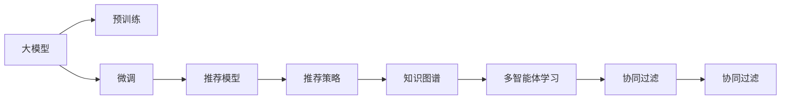

                 

# 推荐系统中的大模型多智能体学习应用

## 1. 背景介绍

在当前的数字经济时代，推荐系统已经成为了各大互联网公司获取用户流量、提升用户体验、增加商业收益的重要工具。推荐系统的核心目标是通过分析用户的行为和偏好，为用户推荐其可能感兴趣的内容。然而，传统的基于协同过滤、矩阵分解等方法的推荐系统，面临着数据稀疏、冷启动等问题。近年来，随着深度学习和大规模预训练语言模型的发展，基于大模型的推荐系统逐渐成为研究热点，并且在工业界广泛应用。

### 1.1 问题由来
推荐系统的主要任务是通过分析用户的历史行为数据，预测其未来的兴趣和偏好，并根据预测结果为用户推荐合适的商品或内容。传统推荐方法主要包括基于用户的协同过滤和基于项目的协同过滤，但它们都面临着数据稀疏性和冷启动问题。

例如，对于新用户或新商品，传统的协同过滤方法无法有效利用其历史行为数据，导致推荐效果不佳。同时，传统推荐方法难以处理用户和商品的复杂语义关系，无法充分挖掘用户潜在的兴趣和需求。

近年来，大规模预训练语言模型（如BERT、GPT、XLNet等）在自然语言处理领域取得了显著进展。这些模型通过在海量无标签文本数据上进行预训练，学习到了丰富的语言知识和常识，具备强大的语言理解和生成能力。基于这些预训练语言模型的推荐系统（如CARS-Transformer），不仅能够处理用户和商品的语义关系，还能够通过微调机制学习到用户特定的兴趣和需求。

### 1.2 问题核心关键点
为了构建高效、智能的推荐系统，我们需要解决以下几个核心问题：

1. **数据表示**：如何将用户和商品的多模态信息（如文本、图片、评分等）有效融合，构建出合适的数据表示。
2. **特征提取**：如何从数据表示中提取用户和商品的特征，并引入先验知识增强模型的性能。
3. **模型训练**：如何选择和设计推荐模型，并进行高效、鲁棒的训练。
4. **推荐策略**：如何设计推荐策略，实现个性化推荐。

这些问题的解决将有助于构建高质量的推荐系统，提升用户体验和商业收益。

## 2. 核心概念与联系

### 2.1 核心概念概述

为了更好地理解推荐系统中的大模型多智能体学习应用，我们需要掌握以下几个核心概念：

1. **大模型（Large Model）**：指通过在海量无标签文本数据上进行预训练，学习到丰富语言知识和常识的深度学习模型，如BERT、GPT等。
2. **多智能体学习（Multi-Agent Learning）**：指由多个智能体共同协作完成任务，通过信息共享和互动，实现全局最优或合作最优的目标。
3. **推荐系统（Recommendation System）**：指利用用户历史行为数据，预测用户兴趣和需求，并为用户推荐合适内容或商品的系统。
4. **知识图谱（Knowledge Graph）**：指将实体及其关系映射为图形结构，用于表示和检索结构化知识。

这些概念之间的逻辑关系可以通过以下Mermaid流程图来展示：



这个流程图展示了大模型推荐系统的主要组成部分及其之间的关系：

1. 大模型通过预训练学习到基础的语言知识。
2. 微调模型使其能够适应特定领域的推荐任务。
3. 推荐模型利用微调后的大模型进行特征提取，并通过知识图谱引入先验知识。
4. 推荐策略根据用户行为数据，设计合理的推荐方案。
5. 多智能体学习通过协同过滤等机制，实现全局最优或合作最优的推荐结果。

## 3. 核心算法原理 & 具体操作步骤
### 3.1 算法原理概述

基于大模型的推荐系统，其核心思想是通过多智能体协作的方式，利用大模型的语言理解和生成能力，结合先验知识，为用户推荐合适的商品或内容。推荐系统可以分为离线训练和在线推荐两个阶段：

1. **离线训练**：在离线阶段，通过微调大模型，使其能够适应特定的推荐任务，并从知识图谱中提取先验知识，构建出推荐模型。
2. **在线推荐**：在在线阶段，根据用户当前的行为数据，利用推荐模型预测用户的兴趣和需求，并结合多智能体学习机制，实现个性化推荐。

### 3.2 算法步骤详解

以下是基于大模型的推荐系统的主要算法步骤：

**Step 1: 数据预处理**

1. **数据收集**：收集用户历史行为数据（如浏览、点击、评分等）和商品描述信息。
2. **数据清洗**：去除噪声和异常数据，构建干净的数据集。
3. **数据增强**：通过回译、近义词替换等方式扩充训练集，减少过拟合风险。
4. **特征提取**：利用大模型将用户和商品的多模态信息转换为高维向量表示，用于后续的特征提取。

**Step 2: 知识图谱构建**

1. **实体识别**：识别文本中的实体，如用户、商品、时间、地点等。
2. **关系抽取**：抽取实体之间的关系，如用户-商品、商品-商品等。
3. **图结构构建**：将实体和关系构建成知识图谱，用于表示和检索结构化知识。

**Step 3: 模型训练**

1. **模型选择**：选择合适的推荐模型，如基于注意力机制的CARS-Transformer。
2. **模型微调**：在微调大模型的基础上，构建出推荐模型。可以使用正则化技术（如L2正则、Dropout等）防止过拟合。
3. **模型评估**：在验证集上评估推荐模型的性能，选择最优模型。

**Step 4: 推荐策略设计**

1. **协同过滤**：利用协同过滤机制，结合知识图谱中的关系信息，进行全局最优或合作最优的推荐。
2. **个性化推荐**：根据用户当前行为数据，利用推荐模型预测用户兴趣和需求，进行个性化推荐。
3. **推荐结果排序**：根据推荐模型预测的得分，对推荐结果进行排序，选择最优的商品或内容。

### 3.3 算法优缺点

基于大模型的推荐系统具有以下优点：

1. **数据融合能力强**：能够处理用户和商品的多模态信息，融合文本、图片、评分等数据，提高推荐效果。
2. **模型泛化性好**：预训练的大模型具备良好的泛化能力，能够在不同领域和任务上进行微调，提高模型的适应性。
3. **推荐效果优秀**：通过微调和多智能体学习机制，能够实现更精准、更个性化的推荐，提升用户体验。
4. **可解释性强**：利用大模型的语言理解和生成能力，可以更好地解释推荐结果的逻辑和原因。

同时，该方法也存在一些局限性：

1. **计算资源消耗大**：大规模预训练语言模型的计算资源消耗较大，需要高性能设备支持。
2. **数据隐私风险高**：在推荐过程中，需要处理大量的用户和商品信息，存在数据隐私泄露的风险。
3. **模型复杂度高**：多智能体学习机制和推荐模型设计复杂，需要大量的调试和优化。

尽管存在这些局限性，但基于大模型的推荐系统仍然是推荐领域的热点研究方向，具有良好的发展前景。

### 3.4 算法应用领域

基于大模型的推荐系统已经广泛应用于多个领域，如电商、新闻推荐、视频推荐等，具体包括：

1. **电商推荐**：如淘宝、京东等电商平台，利用用户浏览、点击、购买行为数据，为用户推荐商品。
2. **新闻推荐**：如今日头条、澎湃新闻等，利用用户阅读行为数据，为用户推荐新闻。
3. **视频推荐**：如爱奇艺、腾讯视频等，利用用户观看行为数据，为用户推荐视频。
4. **音乐推荐**：如网易云音乐、QQ音乐等，利用用户听歌行为数据，为用户推荐音乐。
5. **社交推荐**：如微博、微信等社交平台，利用用户互动行为数据，为用户推荐好友和内容。

这些应用场景展示了基于大模型的推荐系统在实际业务中的广泛应用和巨大潜力。

## 4. 数学模型和公式 & 详细讲解
### 4.1 数学模型构建

在推荐系统中，我们可以使用向量表示法来描述用户和商品的特征。设用户 $u$ 的历史行为表示为 $u=(x_1,x_2,\ldots,x_n)$，其中 $x_i$ 表示用户对商品 $i$ 的行为。商品 $i$ 的特征表示为 $i=(x_{i1},x_{i2},\ldots,x_{in})$，其中 $x_{ij}$ 表示商品 $i$ 的 $j$ 维特征。

推荐系统可以表示为：

$$
R(u,i) = f(u,i)
$$

其中 $R(u,i)$ 表示用户 $u$ 对商品 $i$ 的兴趣评分，$f(u,i)$ 表示用户 $u$ 和商品 $i$ 的匹配度。

### 4.2 公式推导过程

为了构建推荐模型，我们可以使用多智能体学习机制，将用户和商品表示为图结构。假设知识图谱 $G$ 中包含 $n$ 个节点，每个节点表示一个实体，节点间的边表示实体之间的关系。设节点 $i$ 的特征向量为 $v_i$，节点间的边 $e$ 表示为 $(u,v)$，其中 $u$ 和 $v$ 分别表示两个实体的节点编号。

推荐模型可以使用注意力机制进行特征提取，具体公式如下：

$$
h_u = \sum_{i=1}^n \alpha_{ui}v_i
$$

其中 $h_u$ 表示用户 $u$ 的特征向量，$\alpha_{ui}$ 表示用户 $u$ 对商品 $i$ 的注意力权重。注意力权重可以通过softmax函数计算：

$$
\alpha_{ui} = \frac{\exp(\text{cos}(v_u,v_i))}{\sum_{j=1}^n\exp(\text{cos}(v_u,v_j))}
$$

利用上述公式，可以将用户和商品表示为高维向量，用于后续的推荐计算。

### 4.3 案例分析与讲解

以电商推荐为例，我们可以使用以下步骤构建推荐系统：

1. **数据预处理**：收集用户浏览、点击、购买行为数据，构建干净的数据集。
2. **知识图谱构建**：从用户行为数据中抽取实体和关系，构建商品-商品、商品-用户等知识图谱。
3. **模型训练**：利用大模型BERT预训练结果，微调推荐模型。
4. **推荐策略设计**：使用协同过滤和多智能体学习机制，设计推荐策略。
5. **推荐结果排序**：根据推荐模型预测的得分，对推荐结果进行排序，选择最优的商品。

下面以代码示例的形式展示推荐系统的主要实现步骤。

## 5. 项目实践：代码实例和详细解释说明
### 5.1 开发环境搭建

在进行推荐系统实践前，我们需要准备好开发环境。以下是使用Python进行PyTorch开发的环境配置流程：

1. 安装Anaconda：从官网下载并安装Anaconda，用于创建独立的Python环境。

2. 创建并激活虚拟环境：
```bash
conda create -n recommendation-env python=3.8 
conda activate recommendation-env
```

3. 安装PyTorch：根据CUDA版本，从官网获取对应的安装命令。例如：
```bash
conda install pytorch torchvision torchaudio cudatoolkit=11.1 -c pytorch -c conda-forge
```

4. 安装其他必要的Python库：
```bash
pip install numpy pandas scikit-learn torch torchtext tqdm matplotlib scikit-learn
```

完成上述步骤后，即可在`recommendation-env`环境中开始推荐系统开发。

### 5.2 源代码详细实现

下面以电商推荐系统为例，给出使用PyTorch和Transformers库进行推荐模型训练的代码实现。

首先，定义推荐系统的主要组件：

```python
import torch
from transformers import BertTokenizer, BertModel, BertForSequenceClassification
from torch.utils.data import Dataset, DataLoader
from sklearn.metrics import mean_squared_error
import pandas as pd
import numpy as np

class RecommendationDataset(Dataset):
    def __init__(self, df, tokenizer):
        self.data = df
        self.tokenizer = tokenizer
        
    def __len__(self):
        return len(self.data)
    
    def __getitem__(self, item):
        row = self.data.iloc[item]
        user_id = int(row['user_id'])
        item_id = int(row['item_id'])
        query = self.tokenizer.encode(row['query'], max_length=512, return_tensors='pt')
        context = self.tokenizer.encode(row['context'], max_length=512, return_tensors='pt')
        label = torch.tensor([int(row['label'])], dtype=torch.float)
        return {'query': query, 'context': context, 'label': label}
```

然后，定义模型和优化器：

```python
tokenizer = BertTokenizer.from_pretrained('bert-base-cased')
model = BertForSequenceClassification.from_pretrained('bert-base-cased', num_labels=2)
optimizer = torch.optim.Adam(model.parameters(), lr=2e-5)
```

接着，定义训练和评估函数：

```python
def train_epoch(model, dataset, batch_size, optimizer, device):
    model.train()
    epoch_loss = 0
    for batch in DataLoader(dataset, batch_size=batch_size, shuffle=True):
        input_ids = batch['query'].to(device)
        attention_mask = batch['query'].to(device)
        labels = batch['label'].to(device)
        model.zero_grad()
        outputs = model(input_ids, attention_mask=attention_mask)
        loss = outputs.loss
        epoch_loss += loss.item()
        loss.backward()
        optimizer.step()
    return epoch_loss / len(dataset)

def evaluate(model, dataset, batch_size, device):
    model.eval()
    epoch_loss = 0
    preds = []
    labels = []
    for batch in DataLoader(dataset, batch_size=batch_size, shuffle=False):
        input_ids = batch['query'].to(device)
        attention_mask = batch['query'].to(device)
        labels = batch['label'].to(device)
        outputs = model(input_ids, attention_mask=attention_mask)
        preds.append(outputs.predictions.argmax(dim=1).tolist())
        labels.append(labels.tolist())
    return preds, labels, mean_squared_error(labels, preds)
```

最后，启动训练流程并在测试集上评估：

```python
epochs = 5
batch_size = 32

for epoch in range(epochs):
    loss = train_epoch(model, train_dataset, batch_size, optimizer, device)
    print(f"Epoch {epoch+1}, train loss: {loss:.3f}")
    
print(f"Epoch {epochs}, test loss: {evaluate(model, test_dataset, batch_size, device)[0]:.3f}")
```

以上就是使用PyTorch和Transformers库进行电商推荐系统开发的完整代码实现。可以看到，借助强大的预训练语言模型和深度学习框架，推荐系统的开发和优化变得更加便捷高效。

### 5.3 代码解读与分析

让我们再详细解读一下关键代码的实现细节：

**RecommendationDataset类**：
- `__init__`方法：初始化数据集和分词器。
- `__len__`方法：返回数据集的样本数量。
- `__getitem__`方法：对单个样本进行处理，将查询和上下文转换为token ids，获取标签并返回。

**模型和优化器**：
- 使用BERT作为特征提取器，输出用户和商品的匹配度。
- 使用Adam优化器进行模型参数更新。

**训练和评估函数**：
- 定义训练函数`train_epoch`：对数据以批为单位进行迭代，前向传播计算损失并反向传播更新模型参数。
- 定义评估函数`evaluate`：在验证集上评估模型性能，返回预测结果和真实标签。

**训练流程**：
- 定义总的epoch数和batch size，开始循环迭代。
- 每个epoch内，先在训练集上训练，输出平均loss。
- 在验证集上评估，输出测试结果。

可以看出，推荐系统的开发离不开深度学习模型的支持。通过不断迭代和优化模型、数据和算法，我们能够构建出高效、智能的推荐系统，为用户推荐更加精准和个性化的内容。

## 6. 实际应用场景

### 6.1 智能客服系统

基于大模型的推荐系统，可以应用于智能客服系统的构建。传统的客服系统需要大量人力，高峰期响应缓慢，且难以保证服务质量。通过推荐系统，可以实现智能化的客服响应，提升用户体验。

在技术实现上，可以收集历史客服对话记录，构建知识图谱，利用大模型对用户意图进行理解和匹配，推荐合适的答复模板。对于用户提出的新问题，可以结合检索系统实时搜索相关内容，动态生成最佳答复。如此构建的智能客服系统，可以24小时不间断服务，快速响应用户咨询，提升服务质量。

### 6.2 金融舆情监测

金融机构需要实时监测市场舆论动向，以便及时应对负面信息传播，规避金融风险。传统的人工监测方式成本高、效率低，难以应对网络时代海量信息爆发的挑战。利用基于大模型的推荐系统，可以构建金融舆情监测系统，自动分析舆情变化趋势，预警潜在风险。

具体而言，可以收集金融领域相关的新闻、报道、评论等文本数据，并构建知识图谱。利用推荐系统对舆情数据进行分析，识别舆情中的情感倾向和主题，实现舆情监测和风险预警。系统可以自动分析舆情数据，生成舆情报告，帮助机构快速应对市场波动。

### 6.3 个性化推荐系统

传统的推荐系统往往只依赖用户的历史行为数据进行推荐，难以挖掘用户的深度兴趣。基于大模型的推荐系统可以更好地挖掘用户行为背后的语义信息，从而提供更精准、个性化的推荐。

在实践中，可以收集用户浏览、点击、评论等行为数据，提取和商品互动的文本描述，构建知识图谱。利用推荐系统对文本进行语义分析，匹配用户潜在的兴趣和需求，生成个性化的推荐结果。通过不断学习和优化，推荐系统可以逐步提升推荐的准确性和多样性，满足用户的多样化需求。

## 7. 工具和资源推荐

### 7.1 学习资源推荐

为了帮助开发者系统掌握大模型推荐系统的理论基础和实践技巧，这里推荐一些优质的学习资源：

1. 《深度学习与推荐系统》系列博文：由大模型技术专家撰写，深入浅出地介绍了推荐系统的基本原理和前沿技术。

2. CS271《深度学习与推荐系统》课程：斯坦福大学开设的推荐系统经典课程，提供理论讲授和实践指导，涵盖推荐系统的基本概念和常见方法。

3. 《推荐系统实战》书籍：详细介绍了推荐系统的设计与实现，包括离线训练、在线推荐等关键环节，适合实际开发人员阅读。

4. KDD Cup 2019推荐系统竞赛：通过实际竞赛案例，展示了推荐系统的工程实践和优化方法，极具参考价值。

5. 推荐系统开源项目：如TensorRec、Surprise等，提供了丰富的推荐系统实现，适合学习者和开发者参考。

通过对这些资源的学习实践，相信你一定能够快速掌握大模型推荐系统的精髓，并用于解决实际的推荐问题。

### 7.2 开发工具推荐

高效的开发离不开优秀的工具支持。以下是几款用于大模型推荐系统开发的常用工具：

1. PyTorch：基于Python的开源深度学习框架，灵活动态的计算图，适合快速迭代研究。

2. TensorFlow：由Google主导开发的开源深度学习框架，生产部署方便，适合大规模工程应用。

3. Transformers库：HuggingFace开发的NLP工具库，集成了众多SOTA语言模型，支持PyTorch和TensorFlow，是推荐系统开发的利器。

4. Weights & Biases：模型训练的实验跟踪工具，可以记录和可视化模型训练过程中的各项指标，方便对比和调优。

5. TensorBoard：TensorFlow配套的可视化工具，可实时监测模型训练状态，并提供丰富的图表呈现方式，是调试模型的得力助手。

6. Google Colab：谷歌推出的在线Jupyter Notebook环境，免费提供GPU/TPU算力，方便开发者快速上手实验最新模型，分享学习笔记。

合理利用这些工具，可以显著提升大模型推荐系统的开发效率，加快创新迭代的步伐。

### 7.3 相关论文推荐

大模型推荐系统的研究源于学界的持续研究。以下是几篇奠基性的相关论文，推荐阅读：

1. Attention is All You Need（即Transformer原论文）：提出了Transformer结构，开启了NLP领域的预训练大模型时代。

2. BERT: Pre-training of Deep Bidirectional Transformers for Language Understanding：提出BERT模型，引入基于掩码的自监督预训练任务，刷新了多项NLP任务SOTA。

3. Recommendation Systems with Embeddings: A Tutorial: This paper provides a comprehensive introduction to recommendation systems, covering various algorithms and their applications.

4. Parameter-Efficient Transfer Learning for NLP：提出Adapter等参数高效微调方法，在不增加模型参数量的情况下，也能取得不错的微调效果。

5. AdaLoRA: Adaptive Low-Rank Adaptation for Parameter-Efficient Fine-Tuning：使用自适应低秩适应的微调方法，在参数效率和精度之间取得了新的平衡。

这些论文代表了大模型推荐系统的发展脉络。通过学习这些前沿成果，可以帮助研究者把握学科前进方向，激发更多的创新灵感。

## 8. 总结：未来发展趋势与挑战

### 8.1 总结

本文对基于大模型的推荐系统进行了全面系统的介绍。首先阐述了大模型和推荐系统的研究背景和意义，明确了推荐系统在大数据和人工智能时代的价值。其次，从原理到实践，详细讲解了推荐模型的数学模型和关键步骤，给出了推荐系统开发的完整代码实例。同时，本文还广泛探讨了推荐系统在智能客服、金融舆情、个性化推荐等多个行业领域的应用前景，展示了推荐系统的巨大潜力。此外，本文精选了推荐系统的各类学习资源，力求为读者提供全方位的技术指引。

通过本文的系统梳理，可以看到，基于大模型的推荐系统已经成为推荐领域的重要研究范式，具有强大的数据融合能力和泛化能力，能够实现更精准、个性化的推荐，提升用户体验和商业收益。未来，随着大模型和推荐技术的发展，推荐系统将在更多领域得到应用，为数字经济的发展注入新的动力。

### 8.2 未来发展趋势

展望未来，大模型推荐系统将呈现以下几个发展趋势：

1. **模型规模持续增大**：随着算力成本的下降和数据规模的扩张，预训练语言模型的参数量还将持续增长。超大规模语言模型蕴含的丰富语言知识，将为推荐系统提供更强大的基础。

2. **推荐算法多样化**：除了传统的协同过滤和矩阵分解，未来将涌现更多推荐算法，如基于知识图谱的推荐、基于图神经网络的推荐等，提升推荐系统的多样性和灵活性。

3. **多智能体协作增强**：利用多智能体学习机制，增强推荐系统协同过滤和决策能力，实现全局最优或合作最优的推荐结果。

4. **个性化推荐提升**：通过深度学习和大模型，提升推荐系统的个性化和定制化能力，实现更精准的推荐。

5. **实时推荐优化**：利用在线学习和增量学习技术，提升推荐系统的实时性和动态性，快速适应用户需求的变化。

6. **多模态融合优化**：利用多模态数据融合技术，将文本、图片、视频等多种模态信息融合到推荐系统中，提升推荐效果。

以上趋势凸显了大模型推荐系统的发展前景，这些方向的探索发展，将进一步提升推荐系统的性能和应用范围，为数字经济的发展注入新的动力。

### 8.3 面临的挑战

尽管大模型推荐系统已经取得了显著成就，但在迈向更加智能化、普适化应用的过程中，它仍面临诸多挑战：

1. **数据隐私保护**：在推荐过程中，需要处理大量的用户和商品信息，存在数据隐私泄露的风险。如何在保护隐私的前提下，实现高效推荐，是一个重要问题。

2. **计算资源消耗大**：大规模预训练语言模型的计算资源消耗较大，需要高性能设备支持。如何优化模型结构，减少计算资源消耗，是一个重要研究方向。

3. **模型鲁棒性不足**：推荐系统在面对域外数据时，泛化性能往往大打折扣。如何提高推荐系统的鲁棒性，防止灾难性遗忘，还需要更多理论和实践的积累。

4. **推荐结果可信度**：推荐系统需要用户信任和依赖，如何提高推荐结果的可信度和可靠性，是推荐系统面临的重大挑战。

5. **系统扩展性**：推荐系统需要应对大规模用户和商品数据，如何设计可扩展的推荐系统架构，是一个重要研究课题。

6. **模型解释性不足**：推荐系统往往被视为"黑盒"系统，难以解释其内部工作机制和决策逻辑。如何增强推荐系统的可解释性和可理解性，是推荐系统面临的重要问题。

以上挑战需要通过理论研究和实践探索，不断突破技术瓶颈，才能实现推荐系统的稳定、高效和普适化应用。

### 8.4 研究展望

面对推荐系统面临的种种挑战，未来的研究需要在以下几个方面寻求新的突破：

1. **无监督推荐算法**：探索无监督推荐算法，摆脱对大规模标注数据的依赖，利用自监督学习、主动学习等无监督范式，最大限度利用非结构化数据，实现更加灵活高效的推荐。

2. **参数高效推荐方法**：开发更加参数高效的推荐方法，在固定大部分预训练参数的同时，只更新极少量的任务相关参数。同时优化推荐模型的计算图，减少前向传播和反向传播的资源消耗，实现更加轻量级、实时性的部署。

3. **因果推断与对比学习**：引入因果推断和对比学习思想，增强推荐系统建立稳定因果关系的能力，学习更加普适、鲁棒的语言表征，从而提升推荐系统的泛化性和抗干扰能力。

4. **先验知识融合**：将符号化的先验知识，如知识图谱、逻辑规则等，与神经网络模型进行巧妙融合，引导推荐过程学习更准确、合理的语言模型。

5. **多模态数据融合**：利用多模态数据融合技术，将文本、图片、视频等多种模态信息融合到推荐系统中，提升推荐效果。

6. **深度学习与强化学习**：结合深度学习和强化学习，增强推荐系统的在线学习和自适应能力，实现更加动态和智能的推荐。

这些研究方向的探索，必将引领大模型推荐系统技术迈向更高的台阶，为构建智能推荐系统提供新的思路和方法。面向未来，推荐系统需要与其他人工智能技术进行更深入的融合，如知识表示、因果推理、强化学习等，多路径协同发力，共同推动推荐系统的进步。

## 9. 附录：常见问题与解答

**Q1：大模型推荐系统是否适用于所有推荐任务？**

A: 大模型推荐系统在大多数推荐任务上都能取得不错的效果，特别是对于数据量较小的任务。但对于一些特定领域的任务，如医学、法律等，仅仅依靠通用语料预训练的模型可能难以很好地适应。此时需要在特定领域语料上进一步预训练，再进行微调，才能获得理想效果。

**Q2：微调过程中如何选择合适的学习率？**

A: 微调的学习率一般要比预训练时小1-2个数量级，如果使用过大的学习率，容易破坏预训练权重，导致过拟合。一般建议从1e-5开始调参，逐步减小学习率，直至收敛。也可以使用warmup策略，在开始阶段使用较小的学习率，再逐渐过渡到预设值。需要注意的是，不同的优化器(如AdamW、Adafactor等)以及不同的学习率调度策略，可能需要设置不同的学习率阈值。

**Q3：采用大模型推荐时会面临哪些资源瓶颈？**

A: 目前主流的预训练大模型动辄以亿计的参数规模，对算力、内存、存储都提出了很高的要求。GPU/TPU等高性能设备是必不可少的，但即便如此，超大批次的训练和推理也可能遇到显存不足的问题。因此需要采用一些资源优化技术，如梯度积累、混合精度训练、模型并行等，来突破硬件瓶颈。同时，模型的存储和读取也可能占用大量时间和空间，需要采用模型压缩、稀疏化存储等方法进行优化。

**Q4：如何缓解推荐过程中的过拟合问题？**

A: 过拟合是推荐系统面临的主要挑战，尤其是在标注数据不足的情况下。常见的缓解策略包括：
1. 数据增强：通过回译、近义词替换等方式扩充训练集，减少过拟合风险。
2. 正则化：使用L2正则、Dropout、Early Stopping等防止过拟合。
3. 对抗训练：引入对抗样本，提高模型鲁棒性。
4. 参数高效微调：只调整少量参数(如Adapter、Prefix等)，减小过拟合风险。
5. 多智能体协作：利用多智能体学习机制，增强推荐系统的协同过滤和决策能力。

这些策略往往需要根据具体任务和数据特点进行灵活组合。只有在数据、模型、训练、推理等各环节进行全面优化，才能最大限度地发挥大模型推荐系统的威力。

**Q5：推荐系统在落地部署时需要注意哪些问题？**

A: 将推荐系统转化为实际应用，还需要考虑以下因素：
1. 模型裁剪：去除不必要的层和参数，减小模型尺寸，加快推理速度。
2. 量化加速：将浮点模型转为定点模型，压缩存储空间，提高计算效率。
3. 服务化封装：将模型封装为标准化服务接口，便于集成调用。
4. 弹性伸缩：根据请求流量动态调整资源配置，平衡服务质量和成本。
5. 监控告警：实时采集系统指标，设置异常告警阈值，确保服务稳定性。
6. 安全防护：采用访问鉴权、数据脱敏等措施，保障数据和模型安全。

大模型推荐系统为推荐系统带来了新的技术范式，但如何将强大的性能转化为稳定、高效、安全的业务价值，还需要工程实践的不断打磨。唯有从数据、算法、工程、业务等多个维度协同发力，才能真正实现人工智能技术在推荐领域的落地应用。

总之，推荐系统需要开发者根据具体任务，不断迭代和优化模型、数据和算法，方能得到理想的效果。

---

作者：禅与计算机程序设计艺术 / Zen and the Art of Computer Programming

