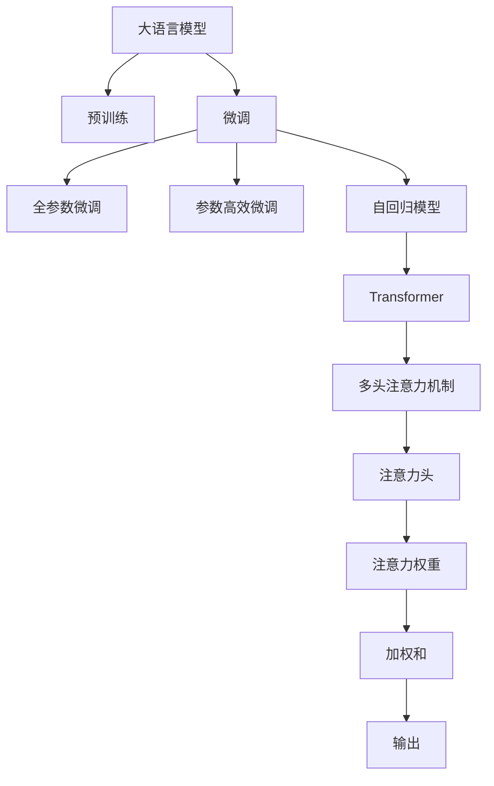

                 

# 推荐系统中的注意力机制：大模型新视角

> 关键词：推荐系统, 注意力机制, 大模型, 推荐算法, 推荐引擎

## 1. 背景介绍

推荐系统已经逐渐成为互联网时代的标配。无论是电商网站、视频平台，还是新闻媒体、社交网络，都通过推荐算法向用户推送个性化的内容，极大地提升了用户体验和系统点击率。然而，随着推荐内容的多样化和推荐场景的复杂化，传统的协同过滤和内容推荐算法面临着诸多挑战。近年来，基于深度学习的推荐系统逐渐受到广泛关注，尤其是大语言模型在推荐系统中的应用，展示了巨大的潜力。

推荐系统的大模型范式主要有两种：基于预训练的语言模型和基于自回归的深度学习模型。前者如BERT、GPT等，后者如PMI、ESIM等。无论是哪种大模型，注意力机制都成为了其核心组件，为推荐系统带来了全新的思路和突破。本文将聚焦于大语言模型中的注意力机制，探索其在推荐系统中的应用及其潜在的挑战和优化策略。

## 2. 核心概念与联系

### 2.1 核心概念概述

在讨论注意力机制在大语言模型中的应用前，我们首先回顾几个相关的核心概念：

- **推荐系统**：通过分析用户行为数据和物品属性，为每个用户推荐最相关和满意度的物品的系统。
- **注意力机制**：一种用于选择关注内容的机制，主要用于机器学习和深度学习中，可以动态地为每个输入元素分配不同的权重。
- **大语言模型**：如BERT、GPT等，通过在大规模无标签文本数据上进行预训练，学习到通用的语言表示，具备强大的语言理解和生成能力。
- **推荐算法**：协同过滤、基于内容的推荐、矩阵分解、深度学习等方法，是推荐系统的技术基础。

注意力机制的核心思想是，通过对输入数据的动态加权，选择对当前任务有用的信息，从而提升模型性能。在推荐系统中，注意力机制可以用于动态调整对物品属性、用户行为、上下文环境的关注度，提高推荐的相关性和多样性。

### 2.2 核心概念原理和架构的 Mermaid 流程图



这个流程图展示了从预训练到大语言模型微调，再到大模型在推荐系统中的应用的整个流程。预训练大语言模型通过注意力机制选择输入特征，进行微调后应用于推荐系统，生成最终的推荐结果。

## 3. 核心算法原理 & 具体操作步骤

### 3.1 算法原理概述

注意力机制在大语言模型中的实现主要基于Transformer结构和自注意力机制。其核心思想是，通过对输入数据的动态加权，选择对当前任务有用的信息，从而提升模型性能。在推荐系统中，注意力机制可以用于动态调整对物品属性、用户行为、上下文环境的关注度，提高推荐的相关性和多样性。

形式化地，假设输入序列为 $X = \{x_1, x_2, ..., x_n\}$，模型输出为 $Y$。注意力机制通过对每个输入元素 $x_i$ 赋予不同的权重 $a_i$，计算加权和 $y_i = \sum_{i=1}^n a_i x_i$。权重 $a_i$ 的计算公式为：

$$
a_i = \frac{e^{v_i^T u}}{\sum_{j=1}^n e^{v_j^T u}}
$$

其中，$v_i$ 和 $u$ 是注意力机制中的查询向量（Query）和键值向量（Key-Value）。

### 3.2 算法步骤详解

大语言模型中的注意力机制实现步骤如下：

1. **输入编码**：将输入序列 $X$ 映射到高维表示向量 $z_i$。
2. **查询-键值计算**：对每个向量 $z_i$，计算其与查询向量 $v$ 的点积，得到注意力分数。
3. **注意力权重计算**：将注意力分数进行softmax操作，得到权重向量 $a_i$。
4. **加权和计算**：对每个向量 $z_i$ 进行加权求和，得到加权和 $y_i$。
5. **输出预测**：将加权和 $y_i$ 映射到输出向量 $Y$。

具体代码实现如下：

```python
import torch
import torch.nn as nn
import torch.nn.functional as F

class MultiHeadAttention(nn.Module):
    def __init__(self, d_model, num_heads):
        super(MultiHeadAttention, self).__init__()
        self.d_model = d_model
        self.num_heads = num_heads
        self.depth = d_model // num_heads

        self.w_q = nn.Linear(d_model, d_model)
        self.w_k = nn.Linear(d_model, d_model)
        self.w_v = nn.Linear(d_model, d_model)

        self.fc_out = nn.Linear(d_model, d_model)

    def forward(self, query, key, value):
        # 线性变换
        query = self.w_q(query)
        key = self.w_k(key)
        value = self.w_v(value)

        # 分割成多个子序列
        query = query.view(query.size(0), query.size(1), self.num_heads, self.depth).transpose(1, 2)
        key = key.view(key.size(0), key.size(1), self.num_heads, self.depth).transpose(1, 2)
        value = value.view(value.size(0), value.size(1), self.num_heads, self.depth).transpose(1, 2)

        # 计算注意力分数
        scores = torch.matmul(query, key.transpose(2, 3)) / torch.sqrt(torch.tensor(self.depth))

        # softmax操作
        attention_weights = F.softmax(scores, dim=-1)

        # 计算加权和
        context = torch.matmul(attention_weights, value)
        context = context.transpose(1, 2).reshape(context.size(0), context.size(1), self.d_model)

        # 线性变换
        output = self.fc_out(context)
        return output
```

### 3.3 算法优缺点

注意力机制在大语言模型中的应用，具有以下优点：

1. **动态关注**：通过动态计算注意力权重，模型可以关注输入序列中的关键部分，忽略无关信息，提升性能。
2. **提升泛化能力**：通过学习输入序列的复杂关系，模型可以更好地处理多样化和复杂化的推荐场景。
3. **减少参数量**：与全连接层相比，注意力机制所需的参数量更少，计算速度更快。

同时，注意力机制也存在一些缺点：

1. **计算复杂度高**：注意力机制需要计算大量的注意力权重，计算复杂度较高。
2. **容易过拟合**：在微调过程中，注意力机制可能过度关注输入序列中的某些部分，导致过拟合。
3. **参数初始化困难**：注意力机制的参数初始化需要精心设计，否则可能导致模型训练不稳定。

### 3.4 算法应用领域

注意力机制在大语言模型中的应用，不仅限于自然语言处理，也广泛用于推荐系统、图像识别、语音识别等多个领域。在推荐系统中，注意力机制可以用于用户行为分析、物品属性匹配、上下文感知等方面，提升推荐效果。

## 4. 数学模型和公式 & 详细讲解 & 举例说明

### 4.1 数学模型构建

在大语言模型中，注意力机制主要应用于Transformer结构。假设输入序列 $X$ 的向量表示为 $z_i$，输出序列 $Y$ 的向量表示为 $y_i$。通过多头部注意力机制（Multi-Head Attention），可以将输入序列映射到输出序列，具体模型如下：

$$
y_i = \sum_{j=1}^n a_{ij} z_j
$$

其中，注意力权重 $a_{ij}$ 的计算公式为：

$$
a_{ij} = \frac{e^{z_i^T v_j}}{\sum_{k=1}^n e^{z_k^T v_j}}
$$

### 4.2 公式推导过程

对于上述公式，我们可以进一步推导其具体实现过程：

1. **线性变换**：将输入序列 $X$ 和查询向量 $v$ 进行线性变换，得到查询向量 $q_i$ 和键值向量 $k_j$。
2. **点积计算**：计算 $q_i$ 和 $k_j$ 的点积，得到注意力分数 $s_{ij}$。
3. **softmax操作**：对注意力分数进行softmax操作，得到权重向量 $a_i$。
4. **加权和计算**：将权重向量 $a_i$ 与键值向量 $v_j$ 进行加权求和，得到加权和 $y_i$。

具体代码实现如下：

```python
import torch
import torch.nn as nn
import torch.nn.functional as F

class MultiHeadAttention(nn.Module):
    def __init__(self, d_model, num_heads):
        super(MultiHeadAttention, self).__init__()
        self.d_model = d_model
        self.num_heads = num_heads
        self.depth = d_model // num_heads

        self.w_q = nn.Linear(d_model, d_model)
        self.w_k = nn.Linear(d_model, d_model)
        self.w_v = nn.Linear(d_model, d_model)

        self.fc_out = nn.Linear(d_model, d_model)

    def forward(self, query, key, value):
        # 线性变换
        query = self.w_q(query)
        key = self.w_k(key)
        value = self.w_v(value)

        # 分割成多个子序列
        query = query.view(query.size(0), query.size(1), self.num_heads, self.depth).transpose(1, 2)
        key = key.view(key.size(0), key.size(1), self.num_heads, self.depth).transpose(1, 2)
        value = value.view(value.size(0), value.size(1), self.num_heads, self.depth).transpose(1, 2)

        # 计算注意力分数
        scores = torch.matmul(query, key.transpose(2, 3)) / torch.sqrt(torch.tensor(self.depth))

        # softmax操作
        attention_weights = F.softmax(scores, dim=-1)

        # 计算加权和
        context = torch.matmul(attention_weights, value)
        context = context.transpose(1, 2).reshape(context.size(0), context.size(1), self.d_model)

        # 线性变换
        output = self.fc_out(context)
        return output
```

### 4.3 案例分析与讲解

以电商推荐系统为例，分析注意力机制在其中的具体应用。假设有一个电商网站，需要通过推荐系统向用户推荐商品。

1. **用户行为编码**：将用户的历史行为数据（如浏览记录、购买记录、评价等）编码为高维向量 $X$。
2. **商品属性编码**：将商品的多种属性（如价格、类别、品牌等）编码为高维向量 $K$。
3. **注意力计算**：将 $X$ 和 $K$ 输入到Multi-Head Attention中，计算注意力权重 $A$。
4. **加权和计算**：根据注意力权重 $A$ 和 $K$，计算加权和 $Y$。
5. **推荐预测**：将加权和 $Y$ 映射到输出向量 $Z$，作为推荐结果。

通过这种方式，模型可以动态地关注用户行为和商品属性的重要部分，生成更符合用户偏好的推荐结果。

## 5. 项目实践：代码实例和详细解释说明

### 5.1 开发环境搭建

在进行注意力机制的实践前，我们需要准备好开发环境。以下是使用Python进行PyTorch开发的环境配置流程：

1. 安装Anaconda：从官网下载并安装Anaconda，用于创建独立的Python环境。

2. 创建并激活虚拟环境：
```bash
conda create -n pytorch-env python=3.8 
conda activate pytorch-env
```

3. 安装PyTorch：根据CUDA版本，从官网获取对应的安装命令。例如：
```bash
conda install pytorch torchvision torchaudio cudatoolkit=11.1 -c pytorch -c conda-forge
```

4. 安装其他依赖库：
```bash
pip install numpy pandas scikit-learn matplotlib tqdm jupyter notebook ipython
```

完成上述步骤后，即可在`pytorch-env`环境中开始实践。

### 5.2 源代码详细实现

下面是基于PyTorch实现的多头注意力机制的代码：

```python
import torch
import torch.nn as nn
import torch.nn.functional as F

class MultiHeadAttention(nn.Module):
    def __init__(self, d_model, num_heads):
        super(MultiHeadAttention, self).__init__()
        self.d_model = d_model
        self.num_heads = num_heads
        self.depth = d_model // num_heads

        self.w_q = nn.Linear(d_model, d_model)
        self.w_k = nn.Linear(d_model, d_model)
        self.w_v = nn.Linear(d_model, d_model)

        self.fc_out = nn.Linear(d_model, d_model)

    def forward(self, query, key, value):
        # 线性变换
        query = self.w_q(query)
        key = self.w_k(key)
        value = self.w_v(value)

        # 分割成多个子序列
        query = query.view(query.size(0), query.size(1), self.num_heads, self.depth).transpose(1, 2)
        key = key.view(key.size(0), key.size(1), self.num_heads, self.depth).transpose(1, 2)
        value = value.view(value.size(0), value.size(1), self.num_heads, self.depth).transpose(1, 2)

        # 计算注意力分数
        scores = torch.matmul(query, key.transpose(2, 3)) / torch.sqrt(torch.tensor(self.depth))

        # softmax操作
        attention_weights = F.softmax(scores, dim=-1)

        # 计算加权和
        context = torch.matmul(attention_weights, value)
        context = context.transpose(1, 2).reshape(context.size(0), context.size(1), self.d_model)

        # 线性变换
        output = self.fc_out(context)
        return output
```

### 5.3 代码解读与分析

让我们再详细解读一下关键代码的实现细节：

**MultiHeadAttention类**：
- `__init__`方法：初始化注意力机制的相关参数，包括模型维度 `d_model`、头部数量 `num_heads`、头部深度 `depth`、查询、键、值线性变换层 `w_q, w_k, w_v` 以及输出线性变换层 `fc_out`。
- `forward`方法：实现注意力机制的计算过程。

**注意力计算**：
- 将输入序列 $X$ 和查询向量 $v$ 进行线性变换，得到查询向量 $q_i$ 和键值向量 $k_j$。
- 计算 $q_i$ 和 $k_j$ 的点积，得到注意力分数 $s_{ij}$。
- 对注意力分数进行softmax操作，得到权重向量 $a_i$。
- 将权重向量 $a_i$ 与键值向量 $v_j$ 进行加权求和，得到加权和 $y_i$。
- 将加权和 $y_i$ 映射到输出向量 $Z$。

在实际应用中，可以将注意力机制应用于不同的推荐场景中，如电商推荐、新闻推荐、视频推荐等。通过合理的配置，可以极大地提升推荐系统的性能。

## 6. 实际应用场景

### 6.1 电商推荐系统

在电商推荐系统中，注意力机制可以用于动态调整对用户行为和商品属性的关注度。具体实现步骤如下：

1. **用户行为编码**：将用户的历史行为数据（如浏览记录、购买记录、评价等）编码为高维向量 $X$。
2. **商品属性编码**：将商品的多种属性（如价格、类别、品牌等）编码为高维向量 $K$。
3. **注意力计算**：将 $X$ 和 $K$ 输入到Multi-Head Attention中，计算注意力权重 $A$。
4. **加权和计算**：根据注意力权重 $A$ 和 $K$，计算加权和 $Y$。
5. **推荐预测**：将加权和 $Y$ 映射到输出向量 $Z$，作为推荐结果。

通过这种方式，模型可以动态地关注用户行为和商品属性的重要部分，生成更符合用户偏好的推荐结果。

### 6.2 新闻推荐系统

新闻推荐系统需要处理大规模的文本数据，并从中提取用户兴趣点。注意力机制可以用于动态关注不同文本的关键词，提升推荐效果。具体实现步骤如下：

1. **文本编码**：将用户历史阅读的文本数据编码为高维向量 $X$。
2. **文本关键词提取**：将每篇文本的关键词编码为高维向量 $K$。
3. **注意力计算**：将 $X$ 和 $K$ 输入到Multi-Head Attention中，计算注意力权重 $A$。
4. **加权和计算**：根据注意力权重 $A$ 和 $K$，计算加权和 $Y$。
5. **推荐预测**：将加权和 $Y$ 映射到输出向量 $Z$，作为推荐结果。

通过这种方式，模型可以动态地关注用户历史阅读中的关键词，生成更符合用户兴趣的新闻推荐结果。

### 6.3 视频推荐系统

视频推荐系统需要处理多种信息，如视频标题、标签、时长、评分等。注意力机制可以用于动态关注不同视频的重要特征，提升推荐效果。具体实现步骤如下：

1. **视频信息编码**：将视频的多维信息编码为高维向量 $X$。
2. **视频特征提取**：将视频标题、标签等关键特征编码为高维向量 $K$。
3. **注意力计算**：将 $X$ 和 $K$ 输入到Multi-Head Attention中，计算注意力权重 $A$。
4. **加权和计算**：根据注意力权重 $A$ 和 $K$，计算加权和 $Y$。
5. **推荐预测**：将加权和 $Y$ 映射到输出向量 $Z$，作为推荐结果。

通过这种方式，模型可以动态地关注视频的重要特征，生成更符合用户兴趣的视频推荐结果。

### 6.4 未来应用展望

随着大语言模型的不断进步，注意力机制在推荐系统中的应用也将更加广泛。未来，我们可以预见以下几个趋势：

1. **多模态注意力机制**：将注意力机制应用于多模态数据（如文本、图像、音频等），提升推荐系统的跨模态融合能力。
2. **动态注意力机制**：通过自适应调整注意力权重，提升模型对用户偏好的实时响应能力。
3. **分布式注意力机制**：在大规模数据集上，利用分布式计算资源，加速注意力机制的计算过程。
4. **图神经网络与注意力机制结合**：将图神经网络与注意力机制结合，提升推荐系统对社交网络的建模能力。
5. **强化学习与注意力机制结合**：通过强化学习机制，动态调整注意力机制的参数，优化推荐系统的性能。

这些趋势将进一步提升注意力机制在推荐系统中的应用价值，为用户的个性化推荐带来更大的便利。

## 7. 工具和资源推荐

### 7.1 学习资源推荐

为了帮助开发者系统掌握注意力机制在大语言模型中的应用，这里推荐一些优质的学习资源：

1. 《深度学习》（Ian Goodfellow、Yoshua Bengio和Aaron Courville著）：这本书是深度学习领域的经典之作，详细介绍了各种深度学习模型的理论基础和实现方法。
2. 《TensorFlow实战Google深度学习》（Vahid Azar、Yu Chen、Daisie Cresson等著）：这本书介绍了TensorFlow的深度学习模型实现，包括注意力机制的应用。
3. 《PyTorch深度学习实战》（Meekail Zain、Josué Castaño等著）：这本书介绍了PyTorch的深度学习模型实现，包括注意力机制的应用。
4. Coursera上的深度学习课程：斯坦福大学、Coursera和DeepLearning.ai等机构开设的深度学习课程，涵盖各种深度学习模型的理论基础和实践技巧。
5. Google Deep Learning的书和视频：Google提供的深度学习资源，包括介绍各种深度学习模型的实现和应用。

通过对这些资源的学习，相信你一定能够系统掌握注意力机制在大语言模型中的应用，并用于解决实际的推荐问题。

### 7.2 开发工具推荐

高效的开发离不开优秀的工具支持。以下是几款用于注意力机制开发的常用工具：

1. PyTorch：基于Python的开源深度学习框架，灵活动态的计算图，适合快速迭代研究。TensorFlow：由Google主导开发的开源深度学习框架，生产部署方便，适合大规模工程应用。
2. HuggingFace Transformers库：提供了多种预训练语言模型和注意力机制的实现，适合快速搭建推荐系统。
3. Weights & Biases：模型训练的实验跟踪工具，可以记录和可视化模型训练过程中的各项指标，方便对比和调优。
4. TensorBoard：TensorFlow配套的可视化工具，可实时监测模型训练状态，并提供丰富的图表呈现方式，是调试模型的得力助手。
5. Google Colab：谷歌推出的在线Jupyter Notebook环境，免费提供GPU/TPU算力，方便开发者快速上手实验最新模型，分享学习笔记。

合理利用这些工具，可以显著提升注意力机制开发的效率，加快创新迭代的步伐。

### 7.3 相关论文推荐

注意力机制在大语言模型中的应用，源于学界的持续研究。以下是几篇奠基性的相关论文，推荐阅读：

1. Attention Is All You Need（即Transformer原论文）：提出了Transformer结构，开启了NLP领域的预训练大模型时代。
2. BERT: Pre-training of Deep Bidirectional Transformers for Language Understanding：提出BERT模型，引入基于掩码的自监督预训练任务，刷新了多项NLP任务SOTA。
3. Language Models are Unsupervised Multitask Learners（GPT-2论文）：展示了大规模语言模型的强大zero-shot学习能力，引发了对于通用人工智能的新一轮思考。
4. Revisiting Self-Attention with Cross-Feature Attention（Cross-Attention论文）：提出跨特征注意力机制，用于处理跨模态数据，提升了多模态推荐系统的性能。
5. Generalized Attention for Cross-Modal Recommendation（Generalized Attention论文）：提出通用注意力机制，应用于跨模态推荐系统，进一步提升了模型性能。

这些论文代表了大语言模型注意力机制的发展脉络。通过学习这些前沿成果，可以帮助研究者把握学科前进方向，激发更多的创新灵感。

## 8. 总结：未来发展趋势与挑战

### 8.1 研究成果总结

本文对大语言模型中的注意力机制及其在推荐系统中的应用进行了全面系统的介绍。首先阐述了注意力机制的核心思想和计算过程，明确了其在推荐系统中的应用方向。其次，通过数学模型和公式，详细讲解了注意力机制的实现原理，给出了具体的代码实例。最后，分析了注意力机制在电商、新闻、视频等多种推荐场景中的应用，并展望了未来的发展趋势。

通过本文的系统梳理，可以看到，注意力机制在大语言模型中的应用具有巨大的潜力和广阔的前景。通过不断优化和改进，未来的注意力机制将能够更好地适应多样化的推荐场景，提升系统的性能和用户体验。

### 8.2 未来发展趋势

展望未来，大语言模型中的注意力机制将呈现以下几个发展趋势：

1. **多模态融合**：将注意力机制应用于多模态数据（如文本、图像、音频等），提升推荐系统的跨模态融合能力。
2. **自适应调整**：通过动态调整注意力权重，提升模型对用户偏好的实时响应能力。
3. **分布式计算**：在大规模数据集上，利用分布式计算资源，加速注意力机制的计算过程。
4. **图神经网络结合**：将图神经网络与注意力机制结合，提升推荐系统对社交网络的建模能力。
5. **强化学习结合**：通过强化学习机制，动态调整注意力机制的参数，优化推荐系统的性能。

这些趋势将进一步提升注意力机制在大语言模型中的应用价值，为推荐系统带来更大的便利和创新。

### 8.3 面临的挑战

尽管注意力机制在大语言模型中的应用取得了显著进展，但在向实际推荐系统部署的过程中，仍面临诸多挑战：

1. **计算资源瓶颈**：注意力机制的计算复杂度较高，对计算资源的需求较大。如何高效利用分布式计算资源，是一个重要的研究方向。
2. **模型可解释性**：注意力机制的内部工作机制较复杂，难以解释其输出。如何增强模型的可解释性，是一个亟待解决的问题。
3. **鲁棒性不足**：注意力机制对输入数据的变化敏感，容易受到噪声和异常值的影响。如何提高模型的鲁棒性，是一个重要的研究方向。
4. **数据隐私问题**：在推荐系统中，用户数据隐私保护是一个重要的问题。如何保护用户数据隐私，同时保证推荐系统的性能，是一个重要的研究方向。
5. **实时性问题**：推荐系统需要实时响应用户请求，如何提升模型的实时计算能力，是一个重要的研究方向。

### 8.4 研究展望

面对这些挑战，未来的研究需要在以下几个方面寻求新的突破：

1. **分布式计算优化**：通过优化注意力机制的计算过程，降低计算复杂度，提高模型训练和推理的效率。
2. **模型可解释性增强**：通过引入符号化的先验知识，增强模型的可解释性，提供更有意义的输出解释。
3. **鲁棒性提升**：通过引入鲁棒性训练方法，提高模型对噪声和异常值的抵抗能力。
4. **数据隐私保护**：通过差分隐私等技术，保护用户数据的隐私，同时保证推荐系统的性能。
5. **实时性优化**：通过优化模型的计算图，降低模型推理的计算量，提高实时响应能力。

这些研究方向将引领大语言模型中的注意力机制迈向更高的台阶，为推荐系统带来更大的便利和创新。面向未来，大语言模型中的注意力机制还需要与其他人工智能技术进行更深入的融合，如知识表示、因果推理、强化学习等，多路径协同发力，共同推动推荐系统的进步。

## 9. 附录：常见问题与解答

**Q1：注意力机制在大语言模型中的具体实现是什么？**

A: 在大语言模型中，注意力机制主要应用于Transformer结构。具体实现步骤如下：
1. 将输入序列 $X$ 的向量表示 $z_i$ 输入到Transformer的编码器中。
2. 通过多头注意力机制计算注意力权重 $A$。
3. 将权重 $A$ 与输入序列 $X$ 的向量表示 $z_i$ 进行加权求和，得到加权和 $Y$。
4. 将加权和 $Y$ 映射到输出向量 $Z$，作为最终结果。

**Q2：注意力机制如何应用于推荐系统？**

A: 在推荐系统中，注意力机制可以用于动态调整对用户行为和商品属性的关注度。具体实现步骤如下：
1. 将用户的历史行为数据（如浏览记录、购买记录、评价等）编码为高维向量 $X$。
2. 将商品的多种属性（如价格、类别、品牌等）编码为高维向量 $K$。
3. 将 $X$ 和 $K$ 输入到Multi-Head Attention中，计算注意力权重 $A$。
4. 根据注意力权重 $A$ 和 $K$，计算加权和 $Y$。
5. 将加权和 $Y$ 映射到输出向量 $Z$，作为推荐结果。

**Q3：注意力机制的计算复杂度如何？**

A: 注意力机制的计算复杂度主要取决于输入序列的长度和模型参数的数量。具体计算量为 $O(T^3)$，其中 $T$ 为输入序列的长度，$D$ 为模型的深度。在大规模数据集上，注意力机制的计算复杂度较高，对计算资源的需求较大。

**Q4：如何优化注意力机制的计算过程？**

A: 通过优化计算过程，可以降低注意力机制的计算复杂度，提高模型训练和推理的效率。具体优化方法包括：
1. 使用多头注意力机制，减少计算量。
2. 采用分布式计算资源，加速计算过程。
3. 使用预计算和缓存技术，提高计算效率。
4. 优化注意力权重计算方式，降低计算复杂度。

这些优化方法可以显著提升注意力机制的计算效率，降低对计算资源的需求。

**Q5：注意力机制的优点和缺点是什么？**

A: 注意力机制的优点包括：
1. 动态关注：通过动态计算注意力权重，模型可以关注输入序列中的关键部分，忽略无关信息，提升性能。
2. 提升泛化能力：通过学习输入序列的复杂关系，模型可以更好地处理多样化和复杂化的推荐场景。
3. 减少参数量：与全连接层相比，注意力机制所需的参数量更少，计算速度更快。

注意力机制的缺点包括：
1. 计算复杂度高：注意力机制需要计算大量的注意力权重，计算复杂度较高。
2. 容易过拟合：在微调过程中，注意力机制可能过度关注输入序列中的某些部分，导致过拟合。
3. 参数初始化困难：注意力机制的参数初始化需要精心设计，否则可能导致模型训练不稳定。

这些优缺点需要在实际应用中综合考虑，合理配置注意力机制的参数，以达到最佳的推荐效果。

