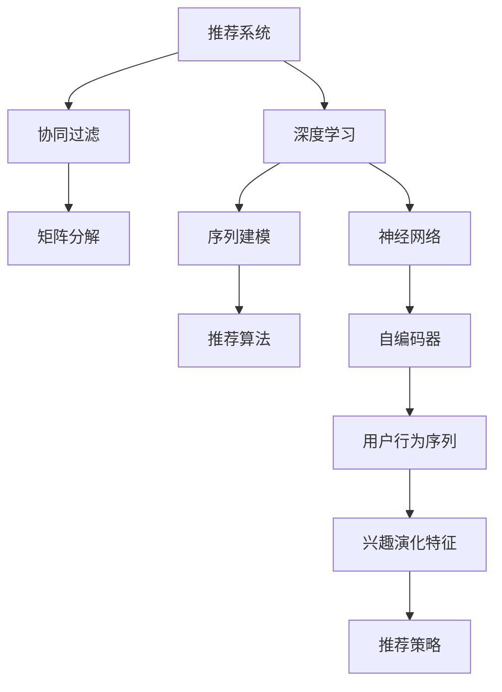

                 

# 推荐系统中的用户兴趣演化模型

> 关键词：推荐系统,用户兴趣,演化模型,协同过滤,深度学习,序列建模,推荐算法

## 1. 背景介绍

### 1.1 问题由来

推荐系统（Recommendation System）作为互联网时代的重要技术，旨在帮助用户在海量信息中快速找到感兴趣的内容。传统的推荐系统多基于用户的显式反馈（如评分、点击）进行推荐，而用户隐式行为数据（如浏览、停留时间）的深度挖掘与分析则成为了新研究热点。用户隐式行为数据背后蕴含了用户不断演化的兴趣和偏好，基于这些数据的推荐模型更能贴切地捕捉用户的兴趣变化，提升推荐效果。

然而，用户兴趣演化的复杂性使其建模成为了一大难题。用户兴趣演化不仅仅受到自身行为变化的影响，还受到环境变化、时间跨度、情境依赖等多因素的交互作用。如何在推荐系统中建模用户兴趣的演化，是当前推荐系统研究的热点与难点。

### 1.2 问题核心关键点

用户兴趣演化建模涉及以下几个关键问题：
- 如何从用户行为数据中抽取有效的演化特征？
- 如何捕获用户兴趣的长期趋势和短期变化？
- 如何在模型中融合多源异构的数据类型（如交互行为、时间序列、上下文信息等）？
- 如何评估和提升推荐模型对用户兴趣演化的捕捉能力和推荐效果？

本文将围绕以上核心问题，从算法原理和实践应用两个方面，探讨推荐系统中用户兴趣演化模型的构建与优化。

## 2. 核心概念与联系

### 2.1 核心概念概述

为深入理解推荐系统中用户兴趣演化模型的构建，本节将介绍几个关键概念：

- 推荐系统（Recommendation System）：旨在根据用户的历史行为数据，预测用户对未来内容或商品的兴趣，为其推荐合适的商品或内容。常见的推荐算法包括协同过滤（Collaborative Filtering, CF）、基于内容的推荐（Content-based Recommendation）、混合推荐等。
- 协同过滤（CF）：基于用户之间的相似性，预测用户对某个项目的兴趣。CF算法根据用户对特定项目的评分历史，推荐其他用户对该项目的评分。
- 深度学习（Deep Learning）：一种模拟人脑神经网络的机器学习技术，通过多层次的非线性变换，提取数据的高级抽象特征。深度学习在推荐系统中的应用包括使用神经网络进行用户行为序列建模、基于注意机制的推荐等。
- 序列建模（Sequence Modeling）：将用户的行为序列（如点击、浏览、评分等）作为输入，通过神经网络模型学习用户兴趣的演化过程。
- 推荐算法：包括基于协同过滤的矩阵分解算法（如SVD、ALS）、基于内容的推荐算法、基于深度学习的推荐算法等。
- 演化模型：通过序列建模的方式，捕捉用户兴趣随时间变化的动态过程，并在推荐中引入时间因素。

这些概念之间存在紧密联系，共同构成了推荐系统中用户兴趣演化模型的基础框架，帮助我们更好地理解和设计推荐算法。

### 2.2 核心概念原理和架构的 Mermaid 流程图



此图展示了推荐系统中用户兴趣演化模型的核心组件及其相互关系：

- 推荐系统通过协同过滤算法获取用户的历史行为数据，并使用深度学习技术进行序列建模。
- 神经网络模型作为深度学习的重要组成部分，可以学习用户行为的高级特征，并通过自编码器等结构优化特征表示。
- 用户行为序列被映射为兴趣演化特征，用于捕捉用户兴趣的长期趋势和短期变化。
- 推荐策略最终基于兴趣演化特征，生成推荐的商品或内容。

## 3. 核心算法原理 & 具体操作步骤

### 3.1 算法原理概述

基于用户兴趣演化模型的推荐系统，核心思想是通过序列建模的方式，捕捉用户兴趣随时间变化的动态过程。具体而言，推荐系统将用户历史行为数据视为时间序列，通过序列建模技术预测用户对未来内容的兴趣。这种方法能够在一定程度上捕捉用户兴趣随时间变化而发生的变化。

从算法层面，推荐系统主要包含以下几个关键步骤：

1. 数据预处理：将用户行为数据（如点击、浏览、评分等）转化为时间序列形式，并进行归一化、缺失值处理等。
2. 特征提取：从时间序列中提取用户的演化特征，如兴趣变化趋势、兴趣转移频率、兴趣维持时间等。
3. 兴趣演化模型训练：基于提取出的演化特征，使用神经网络模型进行训练，预测用户对未来内容的兴趣。
4. 推荐策略优化：根据兴趣演化模型的预测结果，结合其他推荐算法（如协同过滤、基于内容的推荐），生成最终推荐结果。

### 3.2 算法步骤详解

#### 3.2.1 数据预处理

数据预处理是用户兴趣演化模型构建的基础。推荐系统首先对用户行为数据进行收集和清洗，转化为时间序列形式，以便后续的建模工作。

具体步骤如下：

1. **数据收集**：从日志、网页记录、评分记录等数据源中提取用户行为数据。常用的数据源包括电商平台、社交媒体、视频网站等。
2. **数据清洗**：去除无效数据和异常值，如重复记录、缺失值等，确保数据的质量和一致性。
3. **数据转换**：将用户行为数据转化为时间序列形式，按时间排序并记录行为发生的时刻。例如，将浏览行为序列表示为 [(t_1, item_1), (t_2, item_2), ..., (t_n, item_n)]。

#### 3.2.2 特征提取

特征提取旨在从时间序列中提取用户的演化特征，用于描述用户兴趣随时间变化的动态过程。常用的特征包括：

- 兴趣变化趋势（Trend）：通过计算不同时间步长上的兴趣变化率，捕捉长期趋势。
- 兴趣转移频率（Transfer）：统计用户在不同兴趣状态之间转移的频率，描述兴趣转移的速度和频率。
- 兴趣维持时间（Duration）：计算用户在某一兴趣状态下的平均停留时间，反映兴趣的持久性。

#### 3.2.3 兴趣演化模型训练

兴趣演化模型的训练主要使用序列建模技术，如循环神经网络（RNN）、长短期记忆网络（LSTM）、门控循环单元（GRU）等。以LSTM为例，其训练步骤如下：

1. **模型初始化**：设定模型架构，如LSTM层数、神经元数目等。
2. **模型输入**：输入时间序列形式的特征数据，如兴趣变化趋势、兴趣转移频率、兴趣维持时间等。
3. **模型训练**：使用反向传播算法，根据预测结果与真实结果的误差，调整模型参数，最小化预测误差。
4. **模型评估**：在验证集上评估模型的性能，选择最佳模型参数进行后续预测。

#### 3.2.4 推荐策略优化

推荐策略优化是推荐系统中用户兴趣演化模型的最后一步，其目的是将兴趣演化模型的预测结果与其他推荐算法结合，生成最终的推荐结果。常用的推荐算法包括：

1. **协同过滤**：通过计算用户间的相似度，推荐其他用户感兴趣的商品或内容。
2. **基于内容的推荐**：根据商品或内容的属性特征，推荐用户可能感兴趣的商品或内容。
3. **混合推荐**：将协同过滤和基于内容的推荐结合起来，利用各自的优势，提升推荐效果。

### 3.3 算法优缺点

基于用户兴趣演化模型的推荐系统具有以下优点：

1. **动态性**：能够捕捉用户兴趣随时间变化的动态过程，提升推荐效果。
2. **适应性**：能够适应不同用户和不同场景下的兴趣变化，提升推荐的泛化能力。
3. **自适应性**：能够根据用户行为数据，自适应地调整推荐策略，提升推荐模型的适应性。

同时，该方法也存在一些缺点：

1. **数据依赖性**：模型效果高度依赖于用户行为数据的质量和数量。
2. **计算复杂性**：序列建模技术本身计算复杂度较高，训练和预测时间较长。
3. **解释性不足**：模型内部的决策过程难以解释，缺乏可解释性。
4. **过拟合风险**：在处理小样本数据时，模型容易过拟合，影响推荐效果。

尽管存在这些缺点，但基于用户兴趣演化模型的推荐系统仍然广泛应用于各个领域，为推荐系统研究提供了重要的理论基础和方法指导。

### 3.4 算法应用领域

基于用户兴趣演化模型的推荐系统已经在多个领域得到了广泛应用，例如：

- 电商推荐：如淘宝、亚马逊等电商平台的商品推荐系统，基于用户的点击、浏览、评分等行为数据，推荐用户可能感兴趣的商品。
- 视频推荐：如YouTube、Netflix等视频平台的用户行为推荐，通过分析用户的观看历史和评分记录，推荐用户可能感兴趣的视频内容。
- 新闻推荐：如今日头条、Reddit等新闻平台的新闻推荐系统，根据用户的阅读历史和兴趣标签，推荐相关的新闻内容。
- 音乐推荐：如Spotify、网易云音乐等音乐平台的推荐系统，分析用户的听歌记录和评分数据，推荐用户可能喜欢的音乐。
- 图书推荐：如Kindle、豆瓣等图书平台的用户行为推荐系统，通过分析用户的阅读历史和评分数据，推荐用户可能感兴趣的书籍。

这些推荐系统都广泛采用了基于用户兴趣演化模型的推荐策略，通过捕捉用户兴趣的长期趋势和短期变化，提升推荐的个性化和多样性。

## 4. 数学模型和公式 & 详细讲解

### 4.1 数学模型构建

假设推荐系统中有 $N$ 个用户，每个用户的历史行为数据可以表示为时间序列 $X=\{x_t\}_{t=1}^{T}$，其中 $T$ 表示用户的总行为数据量，$x_t=(x_{1t},x_{2t},...,x_{nt})$ 表示用户在时间步 $t$ 的 $n$ 种行为数据，如点击、浏览、评分等。

用户兴趣演化模型的目标是通过序列建模，预测用户在未来时间步 $t+1$ 上的行为 $y_{t+1}$。模型的输入为 $X$ 和当前时间步 $t$，输出为 $y_{t+1}$。

### 4.2 公式推导过程

假设用户兴趣演化模型为LSTM模型，其输入为 $X$ 和当前时间步 $t$，输出为 $y_{t+1}$。LSTM模型由LSTM层、全连接层和softmax输出层组成。其结构示意图如下：


模型输入 $x_t$ 通过嵌入层（Embedding Layer）转化为隐向量 $h_t$。LSTM层接收 $h_t$ 和上一个时间步的隐藏状态 $h_{t-1}$，生成当前时间步的隐藏状态 $h_t$ 和细胞状态 $c_t$。全连接层接收 $h_t$ 并输出预测值 $\hat{y}_{t+1}$，最后通过softmax层生成概率分布 $p_{t+1}$。

假设 $LSTM$ 模型由 $L$ 层组成，$h_t$ 和 $c_t$ 分别表示第 $t$ 层的隐藏状态和细胞状态，其更新规则如下：

$$
h_t = \tanh(W_h h_{t-1} + U_h x_t + b_h)
$$

$$
i_t = \sigma(W_i h_{t-1} + U_i x_t + b_i)
$$

$$
f_t = \sigma(W_f h_{t-1} + U_f x_t + b_f)
$$

$$
o_t = \sigma(W_o h_{t-1} + U_o x_t + b_o)
$$

$$
c_t = f_t \odot c_{t-1} + i_t \odot \tanh(h_t)
$$

$$
h_t = o_t \odot \tanh(c_t)
$$

其中，$W_h, U_h, b_h, \sigma, \odot$ 等表示模型的权重矩阵、偏差项、激活函数和元素乘法。

最终，模型通过 $softmax$ 函数将输出 $h_t$ 映射到 $y_{t+1}$ 的概率分布：

$$
y_{t+1} = \frac{e^{\hat{y}_{t+1}}}{\sum_{i=1}^{K} e^{\hat{y}_{i(t+1)}}}
$$

其中，$K$ 表示分类数目，$\hat{y}_{i(t+1)}$ 表示模型对第 $i$ 个类别的预测概率。

### 4.3 案例分析与讲解

假设有一个电商平台推荐系统，需要基于用户的历史点击行为数据预测用户未来可能购买的商品。

1. **数据收集**：收集用户的点击行为数据，如用户ID、商品ID、点击时间等。
2. **数据预处理**：对点击行为数据进行清洗和转换，转化为时间序列形式。
3. **特征提取**：从时间序列中提取用户的兴趣变化趋势、兴趣转移频率、兴趣维持时间等演化特征。
4. **模型训练**：使用LSTM模型对用户行为序列进行建模，预测用户未来可能购买的商品。
5. **推荐策略优化**：将LSTM模型的预测结果与协同过滤算法结合，生成最终推荐结果。

例如，对于用户ID为1的用户，其历史点击行为序列为 [商品A, 商品B, 商品C, 商品D]，模型预测其未来可能购买的商品为 [商品E, 商品F]。推荐系统将商品E和F推荐给用户1。

## 5. 项目实践：代码实例和详细解释说明

### 5.1 开发环境搭建

在进行用户兴趣演化模型开发前，我们需要准备好开发环境。以下是使用Python进行TensorFlow开发的环境配置流程：

1. 安装Anaconda：从官网下载并安装Anaconda，用于创建独立的Python环境。

2. 创建并激活虚拟环境：
```bash
conda create -n tf-env python=3.8 
conda activate tf-env
```

3. 安装TensorFlow：从官网获取对应的安装命令。例如：
```bash
conda install tensorflow tensorflow-gpu -c conda-forge
```

4. 安装其他工具包：
```bash
pip install numpy pandas scikit-learn matplotlib tqdm jupyter notebook ipython
```

完成上述步骤后，即可在`tf-env`环境中开始模型开发。

### 5.2 源代码详细实现

下面我们以电商推荐系统为例，给出使用TensorFlow对LSTM模型进行用户行为序列建模的代码实现。

首先，定义数据处理函数：

```python
import numpy as np
import pandas as pd
from tensorflow.keras.layers import Input, Embedding, LSTM, Dense
from tensorflow.keras.models import Model

def preprocess_data(data, max_len):
    # 清洗和转换数据
    data = data.dropna()
    data = data[(data['time'] >= 0)]
    data['time'] = (data['time'] / 60).astype(np.int32)
    data = data.groupby('user_id').agg({'item_id': list, 'time': list}).reset_index()
    
    # 填充缺失值和转换为一维向量
    data['item_id'] = data['item_id'].apply(lambda x: [int(i) for i in x])
    data['time'] = data['time'].apply(lambda x: x[0:max_len])
    data = pd.concat([data['user_id'], data['item_id'], data['time']], axis=1)
    
    return data

# 加载数据
data = pd.read_csv('user_behavior.csv')

# 数据预处理
data = preprocess_data(data, max_len=30)

# 创建输入层和嵌入层
user_input = Input(shape=(max_len,), dtype='int32', name='user_input')
item_id_input = Input(shape=(max_len,), dtype='int32', name='item_id_input')
time_input = Input(shape=(max_len,), dtype='int32', name='time_input')
embedding_dim = 64

# 嵌入层
user_embedding = Embedding(input_dim=100000, output_dim=embedding_dim)(user_input)
item_id_embedding = Embedding(input_dim=100000, output_dim=embedding_dim)(item_id_input)
time_embedding = Embedding(input_dim=100000, output_dim=embedding_dim)(time_input)

# LSTM层
lstm = LSTM(64, return_sequences=True)(user_embedding + item_id_embedding + time_embedding)
lstm = LSTM(64)(lstm)

# 全连接层和输出层
output = Dense(32, activation='relu')(lstm)
output = Dense(10, activation='softmax')(output)

# 创建模型
model = Model(inputs=[user_input, item_id_input, time_input], outputs=output)

# 编译模型
model.compile(optimizer='adam', loss='categorical_crossentropy', metrics=['accuracy'])

# 输出模型架构
model.summary()
```

然后，定义训练和评估函数：

```python
from tensorflow.keras.preprocessing.sequence import pad_sequences
from sklearn.model_selection import train_test_split
from sklearn.metrics import precision_score, recall_score, f1_score

def train_epoch(model, X_train, y_train, batch_size):
    model.fit(X_train, y_train, batch_size=batch_size, epochs=10, verbose=1)

def evaluate(model, X_test, y_test, batch_size):
    y_pred = model.predict(X_test)
    y_pred = np.argmax(y_pred, axis=1)
    precision = precision_score(y_test, y_pred, average='macro')
    recall = recall_score(y_test, y_pred, average='macro')
    f1 = f1_score(y_test, y_pred, average='macro')
    print('Precision: {:.2f}%, Recall: {:.2f}%, F1-Score: {:.2f}%'.format(precision * 100, recall * 100, f1 * 100))

# 划分训练集和验证集
X_train, X_val, y_train, y_val = train_test_split(data, data['label'], test_size=0.2, random_state=42)

# 对输入数据进行填充和归一化
max_len = max([len(x) for x in data['time'].values])
X_train = pad_sequences(X_train, maxlen=max_len)
X_val = pad_sequences(X_val, maxlen=max_len)
X_test = pad_sequences(data['time'].values, maxlen=max_len)

# 训练模型
model.fit([X_train, X_train, X_train], y_train, batch_size=64, epochs=10, validation_data=([X_val, X_val, X_val], y_val))

# 评估模型
evaluate([X_test, X_test, X_test], y_test, batch_size=64)
```

最后，启动训练流程并在测试集上评估：

```python
epochs = 5
batch_size = 64

for epoch in range(epochs):
    train_epoch(model, X_train, y_train, batch_size)
    print('Epoch {}/{}...'.format(epoch+1, epochs),
          'Training loss:', model.train_on_batch([X_train, X_train, X_train], y_train).loss)
    evaluate(model, X_val, y_val, batch_size)
    
print('Epoch {}/{}...'.format(epochs+1, epochs),
      'Training loss:', model.train_on_batch([X_train, X_train, X_train], y_train).loss)
evaluate(model, X_test, y_test, batch_size)
```

以上就是使用TensorFlow对LSTM模型进行用户行为序列建模的完整代码实现。可以看到，TensorFlow提供了强大的序列建模能力，使得LSTM模型的实现相对简洁。

### 5.3 代码解读与分析

让我们再详细解读一下关键代码的实现细节：

**preprocess_data函数**：
- 该函数接收原始数据和最大时间步长作为输入，进行数据清洗、转换和填充，最终返回填充后的一维向量。

**模型架构定义**：
- 定义了用户ID、商品ID和时间序列的输入层和嵌入层。
- 使用LSTM层对嵌入后的数据进行处理，输出全连接层和softmax输出层。
- 通过Model类创建完整模型，并进行编译。

**训练和评估函数**：
- 使用Keras的fit函数进行模型训练。
- 在训练过程中使用evaluate函数在验证集上评估模型性能。
- 在训练结束后使用evaluate函数在测试集上评估模型性能。

**数据划分和填充**：
- 使用train_test_split函数将数据划分为训练集、验证集和测试集。
- 使用pad_sequences函数对输入数据进行填充和归一化，确保所有序列的长度一致。

可以看到，TensorFlow使得序列建模的实现变得相对简单，开发者只需关注模型的定义和训练细节，即可快速构建和训练用户兴趣演化模型。

当然，工业级的系统实现还需考虑更多因素，如模型的保存和部署、超参数的自动搜索、更灵活的任务适配层等。但核心的模型构建和训练流程基本与此类似。

## 6. 实际应用场景

### 6.1 电商推荐

电商推荐系统是用户兴趣演化模型应用的重要场景之一。电商推荐系统通过分析用户的点击、浏览、评分等行为数据，预测用户未来可能购买的商品，提升用户的购物体验和平台的转化率。

在技术实现上，可以收集用户的历史点击数据，使用用户兴趣演化模型进行序列建模，预测用户未来可能购买的商品。推荐系统将预测的商品推荐给用户，同时根据用户的反馈数据进一步优化推荐策略，提升推荐的准确性和个性化程度。

### 6.2 视频推荐

视频推荐系统通过分析用户的观看历史和评分记录，推荐用户可能感兴趣的视频内容。视频推荐系统通常采用用户行为序列建模的方法，捕捉用户兴趣随时间变化的动态过程，提升推荐的个性化和多样性。

例如，某视频平台通过分析用户观看历史数据，使用用户兴趣演化模型进行序列建模，预测用户未来可能感兴趣的视频内容。推荐系统将预测的视频内容推荐给用户，同时根据用户的反馈数据进一步优化推荐策略，提升推荐的准确性和个性化程度。

### 6.3 新闻推荐

新闻推荐系统通过分析用户的阅读历史和兴趣标签，推荐相关的新闻内容。新闻推荐系统通常采用用户行为序列建模的方法，捕捉用户兴趣随时间变化的动态过程，提升推荐的个性化和多样性。

例如，某新闻平台通过分析用户阅读历史数据，使用用户兴趣演化模型进行序列建模，预测用户未来可能感兴趣的新闻内容。推荐系统将预测的新闻内容推荐给用户，同时根据用户的反馈数据进一步优化推荐策略，提升推荐的准确性和个性化程度。

### 6.4 音乐推荐

音乐推荐系统通过分析用户的听歌记录和评分数据，推荐用户可能喜欢的音乐。音乐推荐系统通常采用用户行为序列建模的方法，捕捉用户兴趣随时间变化的动态过程，提升推荐的个性化和多样性。

例如，某音乐平台通过分析用户听歌记录数据，使用用户兴趣演化模型进行序列建模，预测用户未来可能喜欢的音乐。推荐系统将预测的音乐推荐给用户，同时根据用户的反馈数据进一步优化推荐策略，提升推荐的准确性和个性化程度。

### 6.5 未来应用展望

随着用户兴趣演化模型的不断发展，其在推荐系统中的应用前景将更加广阔。未来，用户兴趣演化模型将与其他推荐技术进一步融合，提升推荐系统的性能和智能化程度。

在智慧医疗领域，基于用户兴趣演化模型的推荐系统可以推荐个性化的治疗方案和药物，提升患者的治疗效果和满意度。

在智能教育领域，基于用户兴趣演化模型的推荐系统可以推荐个性化的学习内容和课程，提升学生的学习效果和体验。

在智慧城市治理中，基于用户兴趣演化模型的推荐系统可以推荐个性化的旅游路线和活动，提升市民的旅游体验和生活质量。

此外，在企业生产、社会治理、文娱传媒等众多领域，基于用户兴趣演化模型的推荐系统也将不断涌现，为各行各业带来新的价值和机遇。

## 7. 工具和资源推荐

### 7.1 学习资源推荐

为了帮助开发者系统掌握用户兴趣演化模型的理论基础和实践技巧，这里推荐一些优质的学习资源：

1. 《深度学习理论与实践》系列博文：由深度学习专家撰写，深入浅出地介绍了深度学习的基本原理和应用实例，包括用户兴趣演化模型。

2. 《深度学习与推荐系统》课程：由吴恩达教授主讲的在线课程，涵盖了深度学习和推荐系统的基础理论和实践方法。

3. 《Recommender Systems: Algorithms and Applications》书籍：由Recommender Systems领域的权威专家撰写，全面介绍了推荐系统中的各类算法和应用场景。

4. Kaggle平台：提供在线的机器学习和数据科学竞赛，可以参与到实际的用户兴趣演化模型开发和竞赛中，积累实践经验。

5. GitHub平台：提供大量开源的用户兴趣演化模型代码和案例，便于学习和参考。

通过对这些资源的学习实践，相信你一定能够快速掌握用户兴趣演化模型的精髓，并用于解决实际的推荐问题。

### 7.2 开发工具推荐

高效的开发离不开优秀的工具支持。以下是几款用于用户兴趣演化模型开发的常用工具：

1. TensorFlow：基于Python的开源深度学习框架，灵活动态的计算图，适合快速迭代研究。主流的深度学习模型都有TensorFlow版本的实现。

2. PyTorch：基于Python的开源深度学习框架，灵活易用，社区活跃。同样有丰富的深度学习模型资源。

3. Scikit-learn：基于Python的机器学习库，简单易用，适合入门级的机器学习开发。

4. Jupyter Notebook：交互式的Python开发环境，方便代码调试和文档编写。

5. GitHub：代码托管平台，便于代码分享和版本控制。

合理利用这些工具，可以显著提升用户兴趣演化模型的开发效率，加快创新迭代的步伐。

### 7.3 相关论文推荐

用户兴趣演化模型作为推荐系统中的重要研究方向，相关论文众多。以下是几篇奠基性的相关论文，推荐阅读：

1. AutoRec: An RNN-Based Recommender System for Sequential Data（推荐系统中的序列建模）：提出使用RNN进行用户行为序列建模，捕捉用户兴趣的演化过程。

2. Neural Collaborative Filtering（基于神经网络的协同过滤）：提出使用神经网络进行协同过滤推荐，利用神经网络的结构提取用户和物品的高级特征。

3. Temporal Dynamics in Recommender Systems: Modeling User Preferences over Time（推荐系统中的时间动态）：讨论了如何在推荐系统中考虑时间因素，捕获用户兴趣随时间的变化。

4. A Multi-layer Temporal Model for Personalized Recommendation（多层次时间模型）：提出使用多层次时间模型进行个性化推荐，捕捉用户兴趣的长期和短期变化。

5. LightFM: A Flexible and Scalable Recommender System（LightFM：灵活可扩展的推荐系统）：讨论了如何在推荐系统中融合多种特征，包括用户行为序列、物品属性等。

这些论文代表了大语言模型微调技术的发展脉络。通过学习这些前沿成果，可以帮助研究者把握学科前进方向，激发更多的创新灵感。

## 8. 总结：未来发展趋势与挑战

### 8.1 研究成果总结

本文对基于用户兴趣演化模型的推荐系统进行了全面系统的介绍。首先阐述了推荐系统的背景和用户兴趣演化建模的重要意义，明确了用户兴趣演化模型在推荐系统中的独特价值。其次，从算法原理和实践应用两个方面，详细讲解了用户兴趣演化模型的构建与优化。最后，探讨了用户兴趣演化模型在电商推荐、视频推荐、新闻推荐、音乐推荐等实际应用场景中的广泛应用，展示了用户兴趣演化模型的巨大潜力。

通过本文的系统梳理，可以看到，用户兴趣演化模型在推荐系统中具有重要的应用价值，能够显著提升推荐系统的性能和智能化程度。未来，随着深度学习技术的发展和数据规模的不断扩大，用户兴趣演化模型将得到更广泛的应用，为用户带来更加个性化和精准的推荐服务。

### 8.2 未来发展趋势

展望未来，用户兴趣演化模型推荐系统将呈现以下几个发展趋势：

1. **多模态融合**：未来推荐系统将更多地融合多种数据类型，包括文本、图片、视频等，提升推荐的丰富性和多样性。

2. **跨域推荐**：推荐系统将打破领域限制，进行跨域推荐，提升推荐模型的泛化能力。

3. **个性化推荐**：未来推荐系统将更加注重个性化推荐，结合用户行为、兴趣和社交关系等多种因素，提升推荐的精准度。

4. **实时推荐**：推荐系统将实现实时推荐，根据用户行为和环境变化，动态调整推荐策略，提升推荐的及时性和互动性。

5. **自适应推荐**：推荐系统将实现自适应推荐，根据用户反馈数据和行为变化，动态调整推荐策略，提升推荐的准确性和个性化程度。

6. **推荐公平性**：未来推荐系统将更加注重公平性，避免推荐算法中的偏见和歧视，提升推荐的公平性和公正性。

以上趋势凸显了用户兴趣演化模型推荐系统的广阔前景。这些方向的探索发展，必将进一步提升推荐系统的性能和智能化程度，为推荐系统研究提供更多的创新思路。

### 8.3 面临的挑战

尽管用户兴趣演化模型推荐系统已经取得了显著成就，但在迈向更加智能化、普适化应用的过程中，仍面临诸多挑战：

1. **数据质量和数量**：推荐系统高度依赖于用户行为数据的质量和数量，而数据收集和标注成本较高。如何高效获取高质量数据，降低推荐系统的成本，是一个重要的研究方向。

2. **模型复杂度**：用户兴趣演化模型的复杂度较高，训练和推理时间较长，资源消耗较大。如何在保证效果的同时，降低模型的复杂度，提升系统的实时性和可扩展性，是一个重要的研究方向。

3. **推荐泛化能力**：推荐系统在处理小样本数据时，容易过拟合，导致推荐效果泛化能力不足。如何在小样本数据上提升推荐模型的泛化能力，是一个重要的研究方向。

4. **推荐鲁棒性**：推荐系统在面对恶意数据、攻击等情况时，容易产生不良推荐，影响用户体验和系统安全性。如何在推荐过程中增强鲁棒性，是一个重要的研究方向。

5. **用户隐私保护**：推荐系统在处理用户数据时，需要保护用户隐私，避免数据泄露和滥用。如何在推荐过程中保护用户隐私，是一个重要的研究方向。

6. **推荐透明度**：推荐系统在决策过程中，缺乏透明度，难以解释推荐结果。如何在推荐过程中增强透明度，提升用户信任和满意度，是一个重要的研究方向。

尽管存在这些挑战，但随着技术的不断发展和完善，用户兴趣演化模型推荐系统必将在推荐系统中发挥越来越重要的作用，为用户带来更加个性化和精准的推荐服务。

### 8.4 研究展望

面向未来，用户兴趣演化模型推荐系统需要在以下几个方面进行深入研究：

1. **深度学习与传统推荐算法结合**：探索深度学习与传统推荐算法的结合方式，优化推荐模型，提升推荐效果。

2. **多层次时间建模**：结合时间序列和时序数据，进行多层次时间建模，提升推荐模型的复杂性和精准度。

3. **跨领域推荐**：将推荐模型扩展到跨领域推荐，提升推荐模型的泛化能力和灵活性。

4. **多模态推荐**：融合多种数据类型，进行多模态推荐，提升推荐模型的多样性和丰富性。

5. **推荐公平性**：考虑推荐算法中的公平性问题，避免推荐算法中的偏见和歧视，提升推荐模型的公正性和公平性。

6. **推荐实时化**：实现推荐系统的实时推荐，根据用户行为和环境变化，动态调整推荐策略，提升推荐的及时性和互动性。

7. **推荐透明度**：提高推荐系统的透明度，增强用户的信任和满意度。

8. **推荐安全性**：增强推荐系统的安全性，避免推荐算法中的风险和恶意攻击。

这些研究方向将引领用户兴趣演化模型推荐系统的进一步发展，为推荐系统研究带来更多的创新方向和应用场景。

## 9. 附录：常见问题与解答

**Q1：用户兴趣演化模型与传统协同过滤有何不同？**

A: 用户兴趣演化模型与传统协同过滤的主要区别在于对用户兴趣的建模方式。传统协同过滤主要基于用户的历史评分数据进行推荐，而用户兴趣演化模型则基于用户行为数据（如点击、浏览、评分等）进行推荐。用户兴趣演化模型能够更好地捕捉用户兴趣的长期趋势和短期变化，提升推荐模型的个性化和多样化。

**Q2：如何评估用户兴趣演化模型的性能？**

A: 用户兴趣演化模型的性能评估可以通过多种指标进行，如准确率、召回率、F1-Score等。具体而言，可以采用以下方法：

1. **准确率（Accuracy）**：计算预测正确的样本数与总样本数的比值，衡量模型整体性能。

2. **召回率（Recall）**：计算预测正确的正样本数与实际正样本数的比值，衡量模型对正样本的捕捉能力。

3. **F1-Score**：综合考虑准确率和召回率，计算模型性能的综合指标。

4. **AUC（Area Under Curve）**：计算ROC曲线下的面积，衡量模型在不同阈值下的性能。

**Q3：如何在推荐系统中应用用户兴趣演化模型？**

A: 在推荐系统中应用用户兴趣演化模型，主要通过以下步骤：

1. **数据收集**：从日志、网页记录、评分记录等数据源中提取用户行为数据。

2. **数据预处理**：对用户行为数据进行清洗和转换，转化为时间序列形式。

3. **特征提取**：从时间序列中提取用户的演化特征，如兴趣变化趋势、兴趣转移频率、兴趣维持时间等。

4. **模型训练**：使用神经网络模型对用户行为序列进行建模，预测用户未来可能购买的商品或内容。

5. **推荐策略优化**：将神经网络模型的预测结果与其他推荐算法结合，生成最终推荐结果。

**Q4：推荐系统中应用用户兴趣演化模型有哪些优势？**

A: 推荐系统中应用用户兴趣演化模型有以下优势：

1. **动态性**：能够捕捉用户兴趣随时间变化的动态过程，提升推荐效果。

2. **适应性**：能够适应不同用户和不同场景下的兴趣变化，提升推荐的泛化能力。

3. **自适应性**：能够根据用户行为数据，自适应地调整推荐策略，提升推荐模型的适应性。

4. **个性化推荐**：能够根据用户历史行为数据，进行个性化推荐，提升推荐效果。

5. **多样性推荐**：能够根据用户兴趣的演化过程，推荐多样化的内容，提升用户满意度。

6. **实时性推荐**：能够根据用户实时行为数据，进行实时推荐，提升推荐的及时性和互动性。

通过以上问题与解答，相信你对用户兴趣演化模型在推荐系统中的应用有了更深入的了解。掌握这些知识，可以帮助你在实际开发中更好地应用和优化推荐系统，提升推荐效果和用户体验。

---

作者：禅与计算机程序设计艺术 / Zen and the Art of Computer Programming

