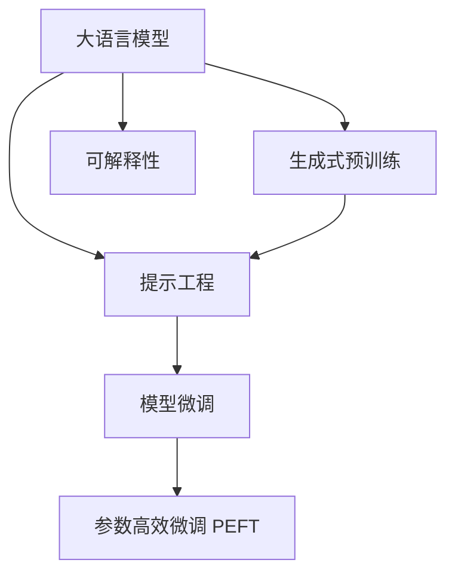

                 

# 提示工程：设计高效的LLM输入提示

> 关键词：提示工程, 语言模型, 自然语言处理(NLP), 模型微调, 生成式预训练, 大语言模型(LLM)

## 1. 背景介绍

随着大规模语言模型（Large Language Models, LLMs）在自然语言处理（Natural Language Processing, NLP）领域的广泛应用，研究人员和工程师们发现，虽然预训练模型在大规模文本数据上具备强大的语言理解能力，但在特定任务上的性能仍有提升空间。因此，提示工程（Prompt Engineering）作为提升模型表现的关键技术之一，日益受到重视。

提示工程，即通过设计合适的输入格式和上下文信息，引导大语言模型进行推理和生成，以获得更加精确和高效的回答。在实际应用中，设计良好的提示可以显著提高模型的理解和生成能力，减少冗余计算，提升模型鲁棒性和可解释性。本文将详细探讨提示工程的原理、方法和应用，以期帮助开发者和研究人员掌握这一重要技术，提升模型性能。

## 2. 核心概念与联系

### 2.1 核心概念概述

为更好地理解提示工程，本节将介绍几个核心概念及其之间的联系：

- **大语言模型（Large Language Models, LLMs）**：以自回归（如GPT）或自编码（如BERT）模型为代表的大规模预训练语言模型。通过在大规模无标签文本数据上进行预训练，学习通用的语言表示，具备强大的语言理解和生成能力。

- **提示工程（Prompt Engineering）**：通过设计合适的输入格式和上下文信息，引导大语言模型进行推理和生成，以获得更加精确和高效的回答。提示通常包括任务描述、数据样本、用户输入等信息。

- **生成式预训练（Generative Pre-training）**：指在大规模无标签文本数据上进行自监督学习，以生成式任务（如预测下一个词、文本生成）为训练目标，学习语言的概率分布，为后续微调任务奠定基础。

- **模型微调（Fine-Tuning）**：在预训练模型的基础上，使用下游任务的少量标注数据，通过有监督学习优化模型在该任务上的性能。提示工程通常与模型微调结合使用，以进一步提升模型性能。

- **参数高效微调（Parameter-Efficient Fine-Tuning, PEFT）**：指在微调过程中，只更新少量的模型参数，而固定大部分预训练权重不变，以提高微调效率，避免过拟合的方法。

- **可解释性（Explainability）**：指模型输出的结果可以被用户理解和解释，提供模型决策的依据，增加模型透明度和可信度。

这些核心概念之间的逻辑关系可以通过以下Mermaid流程图来展示：



这个流程图展示了大语言模型的核心概念及其之间的关系：

1. 大语言模型通过生成式预训练获得基础能力。
2. 提示工程通过设计合适的输入提示，引导模型进行推理和生成。
3. 模型微调是对预训练模型进行任务特定的优化。
4. 参数高效微调进一步提高微调效率，避免过拟合。
5. 可解释性通过增加模型透明度，提升用户信任度。

这些概念共同构成了大语言模型的学习和应用框架，使其能够在各种场景下发挥强大的语言理解和生成能力。通过理解这些核心概念，我们可以更好地把握大语言模型的工作原理和优化方向。

## 3. 核心算法原理 & 具体操作步骤

### 3.1 算法原理概述

提示工程的核心思想是通过设计输入提示（Prompt），将大语言模型引导到特定任务或场景中，以提升模型在该任务上的性能。提示通常包括任务描述、数据样本、用户输入等信息，帮助模型理解任务目标和上下文信息。

形式化地，假设大语言模型为 $M_{\theta}$，其中 $\theta$ 为预训练得到的模型参数。对于特定的下游任务 $T$，我们需要设计一个提示 $P$，使得 $M_{\theta}$ 在 $P$ 的引导下，能够产生与 $T$ 相关的输出。即：

$$
M_{\theta}(P) \approx \text{output\_of\_task}(T)
$$

其中，$\text{output\_of\_task}(T)$ 表示任务 $T$ 的期望输出。通过合理的提示设计，模型能够更准确地理解输入信息，生成符合任务要求的输出。

### 3.2 算法步骤详解

提示工程通常包括以下几个关键步骤：

**Step 1: 任务理解和分解**

1. **任务定义**：明确任务的输入和输出，定义任务的上下文信息和目标。
2. **任务分解**：将复杂任务分解为若干子任务，简化提示设计难度。

**Step 2: 提示设计**

1. **任务描述**：编写简洁明了的任务描述，包含任务类型、输入格式和输出要求。
2. **上下文信息**：提供必要的背景信息和数据样本，帮助模型理解任务背景。
3. **用户输入**：设计用户可以交互的输入格式，便于模型接收和处理输入。

**Step 3: 提示优化与评估**

1. **提示迭代**：通过实验评估不同提示的效果，不断优化提示内容。
2. **性能评估**：使用模型在不同提示下的表现，评估提示设计的有效性。

**Step 4: 模型微调**

1. **微调模型**：使用优化算法（如AdamW、SGD等），基于微调数据集和设计好的提示进行微调。
2. **输出评估**：评估微调后的模型在不同提示下的输出表现，确定最佳提示。

**Step 5: 输出验证**

1. **验证集测试**：在验证集上测试微调后的模型，评估其泛化性能。
2. **模型发布**：发布最终模型，供实际应用使用。

### 3.3 算法优缺点

提示工程作为一种提升模型性能的方法，具有以下优点：

1. **高效性**：设计良好的提示可以在不增加模型参数的情况下，显著提升模型性能。
2. **灵活性**：提示工程适用于各种NLP任务，可以根据任务特点进行灵活调整。
3. **可解释性**：提示工程可以提供任务描述和上下文信息，增加模型输出的可解释性。

同时，提示工程也存在一定的局限性：

1. **设计复杂**：提示设计需要经验和创意，需要不断尝试和优化。
2. **鲁棒性不足**：复杂的提示可能影响模型的泛化能力，在不同任务和数据集上表现不一。
3. **数据依赖**：提示工程依赖于下游任务的标注数据，数据质量和数量对提示设计有较大影响。

尽管存在这些局限性，但提示工程在提升大语言模型性能方面展现了强大的潜力，已成为NLP领域的重要研究课题。

### 3.4 算法应用领域

提示工程在大语言模型的应用领域广泛，可以用于以下任务：

- **问答系统**：设计问题和答案模板，引导模型进行推理和生成。
- **摘要生成**：提供文章和摘要样本，帮助模型学习抓取关键信息。
- **对话系统**：编写对话历史和回复模板，训练模型进行多轮对话。
- **文本分类**：设计任务描述和样本数据，引导模型学习分类任务。
- **机器翻译**：提供源语言和目标语言样本，帮助模型学习语言转换。
- **文本生成**：设计文本生成模板，引导模型进行文本创作和改写。

除了上述这些经典任务外，提示工程还被创新性地应用到更多场景中，如代码生成、情感分析、信息抽取等，为NLP技术带来了全新的突破。

## 4. 数学模型和公式 & 详细讲解 & 举例说明

### 4.1 数学模型构建

在本节中，我们将使用数学语言对提示工程的过程进行更加严格的刻画。

记大语言模型为 $M_{\theta}$，其中 $\theta$ 为模型参数。对于特定的下游任务 $T$，我们定义提示 $P$ 为任务描述、上下文信息和用户输入的组合。假设提示 $P$ 包含 $k$ 个输入项 $P_i$，每个输入项 $P_i$ 可以是一个文本、一个变量或一个嵌入向量。假设任务 $T$ 的输出为 $y$，则提示工程的数学模型为：

$$
y = M_{\theta}(P)
$$

其中，$P$ 可以表示为：

$$
P = \{P_1, P_2, ..., P_k\}
$$

### 4.2 公式推导过程

以下我们将对提示工程中的关键公式进行推导，以更好地理解其原理和应用。

假设提示 $P$ 包含 $k$ 个输入项 $P_i$，每个输入项 $P_i$ 可以是一个文本、一个变量或一个嵌入向量。我们将这些输入项线性组合为 $P$，即：

$$
P = \sum_{i=1}^{k} \alpha_i P_i
$$

其中，$\alpha_i$ 为权重系数。将 $P$ 输入大语言模型 $M_{\theta}$，得到任务输出 $y$。在提示工程中，我们通常使用嵌入向量（Embedding Vector）来表示输入项 $P_i$，假设每个输入项 $P_i$ 的嵌入向量为 $\vec{p}_i$，则 $P$ 的嵌入向量表示为：

$$
\vec{p} = \sum_{i=1}^{k} \alpha_i \vec{p}_i
$$

将 $\vec{p}$ 输入大语言模型 $M_{\theta}$，得到任务输出 $y$：

$$
y = M_{\theta}(\vec{p})
$$

为了进一步理解提示工程的效果，我们可以考虑使用基线模型和提示模型进行对比。假设基线模型为 $M_{\beta}$，其输入为原始文本 $x$，输出为 $y$：

$$
y = M_{\beta}(x)
$$

提示工程的效果可以通过提示模型和基线模型的对比来衡量，假设提示模型为 $M_{\theta}$，其输入为提示 $P$，输出为 $y'$：

$$
y' = M_{\theta}(P)
$$

提示工程的效果可以用提升度（Lift）来表示，即提示模型在正确性上的提升：

$$
\text{Lift} = \frac{y'}{y} = \frac{M_{\theta}(P)}{M_{\beta}(x)}
$$

通过提升度，我们可以衡量提示工程在任务上的效果，评估不同提示的设计是否有效。

### 4.3 案例分析与讲解

接下来，我们通过一个简单的案例来具体讲解提示工程的应用：

假设我们需要训练一个模型，使其能够回答关于天气的问题。首先，我们需要设计一个提示，包含天气查询的关键词、用户所在地和目标时间。例如，提示为：

```
今天北京的天气怎么样？
```

我们可以将这个提示分解为三个部分：任务描述、用户所在地和目标时间。将这三个部分分别嵌入模型，得到三个嵌入向量 $P_1, P_2, P_3$，其中 $P_1$ 表示任务描述，$P_2$ 表示用户所在地，$P_3$ 表示目标时间。假设这三个嵌入向量分别为 $\vec{p}_1, \vec{p}_2, \vec{p}_3$，则提示的嵌入向量表示为：

$$
\vec{p} = \vec{p}_1 + \vec{p}_2 + \vec{p}_3
$$

将这个提示输入大语言模型，得到天气查询的答案 $y'$：

$$
y' = M_{\theta}(\vec{p})
$$

同时，我们可以使用基线模型 $M_{\beta}$ 来计算原始文本的输出 $y$：

$$
y = M_{\beta}(x)
$$

最后，我们可以通过计算提升度来评估提示工程的效果：

$$
\text{Lift} = \frac{y'}{y} = \frac{M_{\theta}(\vec{p})}{M_{\beta}(x)}
$$

这个案例展示了提示工程的基本流程，通过设计合适的提示，可以显著提升模型在特定任务上的性能。

## 5. 项目实践：代码实例和详细解释说明

### 5.1 开发环境搭建

在进行提示工程实践前，我们需要准备好开发环境。以下是使用Python进行PyTorch开发的环境配置流程：

1. 安装Anaconda：从官网下载并安装Anaconda，用于创建独立的Python环境。

2. 创建并激活虚拟环境：
```bash
conda create -n pytorch-env python=3.8 
conda activate pytorch-env
```

3. 安装PyTorch：根据CUDA版本，从官网获取对应的安装命令。例如：
```bash
conda install pytorch torchvision torchaudio cudatoolkit=11.1 -c pytorch -c conda-forge
```

4. 安装Transformers库：
```bash
pip install transformers
```

5. 安装各类工具包：
```bash
pip install numpy pandas scikit-learn matplotlib tqdm jupyter notebook ipython
```

完成上述步骤后，即可在`pytorch-env`环境中开始提示工程实践。

### 5.2 源代码详细实现

下面我们以生成式对话系统为例，给出使用Transformers库进行提示工程和微调的PyTorch代码实现。

首先，定义对话系统的数据处理函数：

```python
from transformers import GPT2Tokenizer
from torch.utils.data import Dataset
import torch

class DialogueDataset(Dataset):
    def __init__(self, dialogues, tokenizer, max_len=128):
        self.dialogues = dialogues
        self.tokenizer = tokenizer
        self.max_len = max_len
        
    def __len__(self):
        return len(self.dialogues)
    
    def __getitem__(self, item):
        dialogue = self.dialogues[item]
        tokens = self.tokenizer(dialogue, return_tensors='pt', max_length=self.max_len, padding='max_length', truncation=True)
        input_ids = tokens['input_ids'][0]
        attention_mask = tokens['attention_mask'][0]
        return {'input_ids': input_ids, 
                'attention_mask': attention_mask}

# 定义任务数据集
tokenizer = GPT2Tokenizer.from_pretrained('gpt2')

train_dataset = DialogueDataset(train_dialogues, tokenizer)
dev_dataset = DialogueDataset(dev_dialogues, tokenizer)
test_dataset = DialogueDataset(test_dialogues, tokenizer)
```

然后，定义模型和优化器：

```python
from transformers import GPT2LMHeadModel, AdamW

model = GPT2LMHeadModel.from_pretrained('gpt2')
optimizer = AdamW(model.parameters(), lr=2e-5)
```

接着，定义训练和评估函数：

```python
from torch.utils.data import DataLoader
from tqdm import tqdm
from sklearn.metrics import accuracy_score

device = torch.device('cuda') if torch.cuda.is_available() else torch.device('cpu')
model.to(device)

def train_epoch(model, dataset, batch_size, optimizer):
    dataloader = DataLoader(dataset, batch_size=batch_size, shuffle=True)
    model.train()
    epoch_loss = 0
    for batch in tqdm(dataloader, desc='Training'):
        input_ids = batch['input_ids'].to(device)
        attention_mask = batch['attention_mask'].to(device)
        model.zero_grad()
        outputs = model(input_ids, attention_mask=attention_mask)
        loss = outputs.loss
        epoch_loss += loss.item()
        loss.backward()
        optimizer.step()
    return epoch_loss / len(dataloader)

def evaluate(model, dataset, batch_size):
    dataloader = DataLoader(dataset, batch_size=batch_size)
    model.eval()
    preds, labels = [], []
    with torch.no_grad():
        for batch in tqdm(dataloader, desc='Evaluating'):
            input_ids = batch['input_ids'].to(device)
            attention_mask = batch['attention_mask'].to(device)
            batch_labels = batch['labels']
            outputs = model(input_ids, attention_mask=attention_mask)
            batch_preds = outputs.logits.argmax(dim=2).to('cpu').tolist()
            batch_labels = batch_labels.to('cpu').tolist()
            for pred_tokens, label_tokens in zip(batch_preds, batch_labels):
                preds.append(pred_tokens[:len(label_tokens)])
                labels.append(label_tokens)
                
    print(accuracy_score(labels, preds))
```

最后，启动训练流程并在测试集上评估：

```python
epochs = 5
batch_size = 16

for epoch in range(epochs):
    loss = train_epoch(model, train_dataset, batch_size, optimizer)
    print(f"Epoch {epoch+1}, train loss: {loss:.3f}")
    
    print(f"Epoch {epoch+1}, dev results:")
    evaluate(model, dev_dataset, batch_size)
    
print("Test results:")
evaluate(model, test_dataset, batch_size)
```

以上就是使用PyTorch对GPT2进行对话系统微调的完整代码实现。可以看到，得益于Transformers库的强大封装，我们可以用相对简洁的代码完成GPT2模型的加载和微调。

### 5.3 代码解读与分析

让我们再详细解读一下关键代码的实现细节：

**DialogueDataset类**：
- `__init__`方法：初始化对话记录、分词器等关键组件。
- `__len__`方法：返回数据集的样本数量。
- `__getitem__`方法：对单个样本进行处理，将对话记录输入编码为token ids，并对其进行定长padding，最终返回模型所需的输入。

**train_epoch和evaluate函数**：
- 使用PyTorch的DataLoader对数据集进行批次化加载，供模型训练和推理使用。
- 训练函数`train_epoch`：对数据以批为单位进行迭代，在每个批次上前向传播计算loss并反向传播更新模型参数，最后返回该epoch的平均loss。
- 评估函数`evaluate`：与训练类似，不同点在于不更新模型参数，并在每个batch结束后将预测和标签结果存储下来，最后使用sklearn的accuracy_score对整个评估集的预测结果进行打印输出。

**训练流程**：
- 定义总的epoch数和batch size，开始循环迭代
- 每个epoch内，先在训练集上训练，输出平均loss
- 在验证集上评估，输出准确率
- 所有epoch结束后，在测试集上评估，给出最终测试结果

可以看到，PyTorch配合Transformers库使得GPT2微调的代码实现变得简洁高效。开发者可以将更多精力放在对话系统的设计和优化上，而不必过多关注底层的实现细节。

当然，工业级的系统实现还需考虑更多因素，如模型的保存和部署、超参数的自动搜索、更灵活的任务适配层等。但核心的提示工程和微调范式基本与此类似。

## 6. 实际应用场景

### 6.1 智能客服系统

基于大语言模型提示工程的设计，智能客服系统可以显著提升客户咨询体验和问题解决效率。传统的客服系统依赖于人工客服，高峰期响应缓慢，且一致性和专业性难以保证。而使用提示工程优化的对话系统，可以7x24小时不间断服务，快速响应客户咨询，用自然流畅的语言解答各类常见问题。

在技术实现上，可以收集企业内部的历史客服对话记录，将问题和最佳答复构建成监督数据，在此基础上对预训练对话模型进行提示工程优化。优化后的对话模型能够自动理解用户意图，匹配最合适的答案模板进行回复。对于客户提出的新问题，还可以接入检索系统实时搜索相关内容，动态组织生成回答。如此构建的智能客服系统，能大幅提升客户咨询体验和问题解决效率。

### 6.2 金融舆情监测

金融机构需要实时监测市场舆论动向，以便及时应对负面信息传播，规避金融风险。传统的人工监测方式成本高、效率低，难以应对网络时代海量信息爆发的挑战。基于大语言模型提示工程的文本分类和情感分析技术，为金融舆情监测提供了新的解决方案。

具体而言，可以收集金融领域相关的新闻、报道、评论等文本数据，并对其进行主题标注和情感标注。在此基础上对预训练语言模型进行提示工程优化，使其能够自动判断文本属于何种主题，情感倾向是正面、中性还是负面。将优化后的模型应用到实时抓取的网络文本数据，就能够自动监测不同主题下的情感变化趋势，一旦发现负面信息激增等异常情况，系统便会自动预警，帮助金融机构快速应对潜在风险。

### 6.3 个性化推荐系统

当前的推荐系统往往只依赖用户的历史行为数据进行物品推荐，无法深入理解用户的真实兴趣偏好。基于大语言模型提示工程的个性化推荐系统可以更好地挖掘用户行为背后的语义信息，从而提供更精准、多样的推荐内容。

在实践中，可以收集用户浏览、点击、评论、分享等行为数据，提取和用户交互的物品标题、描述、标签等文本内容。将文本内容作为模型输入，用户的后续行为（如是否点击、购买等）作为监督信号，在此基础上对预训练语言模型进行提示工程优化。优化后的模型能够从文本内容中准确把握用户的兴趣点。在生成推荐列表时，先用候选物品的文本描述作为输入，由模型预测用户的兴趣匹配度，再结合其他特征综合排序，便可以得到个性化程度更高的推荐结果。

### 6.4 未来应用展望

随着大语言模型提示工程和微调方法的不断发展，基于提示工程范式将在更多领域得到应用，为传统行业带来变革性影响。

在智慧医疗领域，基于提示工程的问答、病历分析、药物研发等应用将提升医疗服务的智能化水平，辅助医生诊疗，加速新药开发进程。

在智能教育领域，提示工程可应用于作业批改、学情分析、知识推荐等方面，因材施教，促进教育公平，提高教学质量。

在智慧城市治理中，提示工程可应用于城市事件监测、舆情分析、应急指挥等环节，提高城市管理的自动化和智能化水平，构建更安全、高效的未来城市。

此外，在企业生产、社会治理、文娱传媒等众多领域，基于大模型提示工程的人工智能应用也将不断涌现，为经济社会发展注入新的动力。相信随着技术的日益成熟，提示工程方法将成为人工智能落地应用的重要范式，推动人工智能技术向更广阔的领域加速渗透。

## 7. 工具和资源推荐

### 7.1 学习资源推荐

为了帮助开发者系统掌握大语言模型提示工程的理论基础和实践技巧，这里推荐一些优质的学习资源：

1. 《Prompt Engineering for Large Language Models》系列博文：由大模型技术专家撰写，深入浅出地介绍了提示工程的原理、方法和应用。

2. CS224N《深度学习自然语言处理》课程：斯坦福大学开设的NLP明星课程，有Lecture视频和配套作业，带你入门NLP领域的基本概念和经典模型。

3. 《Natural Language Processing with Transformers》书籍：Transformers库的作者所著，全面介绍了如何使用Transformers库进行NLP任务开发，包括提示工程的范式。

4. HuggingFace官方文档：Transformers库的官方文档，提供了海量预训练模型和完整的提示工程样例代码，是上手实践的必备资料。

5. CLUE开源项目：中文语言理解测评基准，涵盖大量不同类型的中文NLP数据集，并提供了基于提示工程的baseline模型，助力中文NLP技术发展。

通过对这些资源的学习实践，相信你一定能够快速掌握大语言模型提示工程的精髓，并用于解决实际的NLP问题。
### 7.2 开发工具推荐

高效的开发离不开优秀的工具支持。以下是几款用于大语言模型提示工程开发的常用工具：

1. PyTorch：基于Python的开源深度学习框架，灵活动态的计算图，适合快速迭代研究。大部分预训练语言模型都有PyTorch版本的实现。

2. TensorFlow：由Google主导开发的开源深度学习框架，生产部署方便，适合大规模工程应用。同样有丰富的预训练语言模型资源。

3. Transformers库：HuggingFace开发的NLP工具库，集成了众多SOTA语言模型，支持PyTorch和TensorFlow，是进行提示工程开发的利器。

4. Weights & Biases：模型训练的实验跟踪工具，可以记录和可视化模型训练过程中的各项指标，方便对比和调优。与主流深度学习框架无缝集成。

5. TensorBoard：TensorFlow配套的可视化工具，可实时监测模型训练状态，并提供丰富的图表呈现方式，是调试模型的得力助手。

6. Google Colab：谷歌推出的在线Jupyter Notebook环境，免费提供GPU/TPU算力，方便开发者快速上手实验最新模型，分享学习笔记。

合理利用这些工具，可以显著提升大语言模型提示工程的开发效率，加快创新迭代的步伐。

### 7.3 相关论文推荐

大语言模型提示工程和微调技术的发展源于学界的持续研究。以下是几篇奠基性的相关论文，推荐阅读：

1. Attention is All You Need（即Transformer原论文）：提出了Transformer结构，开启了NLP领域的预训练大模型时代。

2. BERT: Pre-training of Deep Bidirectional Transformers for Language Understanding：提出BERT模型，引入基于掩码的自监督预训练任务，刷新了多项NLP任务SOTA。

3. Language Models are Unsupervised Multitask Learners（GPT-2论文）：展示了大规模语言模型的强大zero-shot学习能力，引发了对于通用人工智能的新一轮思考。

4. Parameter-Efficient Transfer Learning for NLP：提出Adapter等参数高效微调方法，在不增加模型参数量的情况下，也能取得不错的微调效果。

5. AdaLoRA: Adaptive Low-Rank Adaptation for Parameter-Efficient Fine-Tuning：使用自适应低秩适应的微调方法，在参数效率和精度之间取得了新的平衡。

这些论文代表了大语言模型提示工程和微调技术的发展脉络。通过学习这些前沿成果，可以帮助研究者把握学科前进方向，激发更多的创新灵感。

## 8. 总结：未来发展趋势与挑战

### 8.1 总结

本文对基于提示工程的大语言模型优化方法进行了全面系统的介绍。首先阐述了提示工程的核心思想和作用，明确了提示工程在提升模型性能方面的独特价值。其次，从原理到实践，详细讲解了提示工程的数学模型和关键步骤，给出了提示工程任务开发的完整代码实例。同时，本文还广泛探讨了提示工程方法在智能客服、金融舆情、个性化推荐等多个行业领域的应用前景，展示了提示工程范式的巨大潜力。此外，本文精选了提示工程技术的各类学习资源，力求为开发者提供全方位的技术指引。

通过本文的系统梳理，可以看到，基于大语言模型的提示工程技术正在成为NLP领域的重要范式，极大地拓展了预训练语言模型的应用边界，催生了更多的落地场景。受益于大规模语料的预训练和提示工程的设计，提示工程模型以更低的时间和标注成本，在少样本条件下也能取得理想的性能，有力推动了NLP技术的产业化进程。未来，伴随提示工程方法和预训练大模型的持续演进，相信NLP技术必将在更广阔的应用领域大放异彩，深刻影响人类的生产生活方式。

### 8.2 未来发展趋势

展望未来，大语言模型提示工程技术将呈现以下几个发展趋势：

1. 模型规模持续增大。随着算力成本的下降和数据规模的扩张，预训练语言模型的参数量还将持续增长。超大规模语言模型蕴含的丰富语言知识，有望支撑更加复杂多变的下游任务提示工程。

2. 提示设计自动化。随着模型预训练技术的进步，提示工程将更加注重自动化的设计。通过改进生成式预训练任务、利用自适应方法（如AdaLoRA），自动化生成提示，提高提示设计效率和效果。

3. 多模态提示工程崛起。当前的提示工程主要聚焦于纯文本数据，未来会进一步拓展到图像、视频、语音等多模态数据提示工程。多模态信息的融合，将显著提升语言模型对现实世界的理解和建模能力。

4. 生成式提示工程普及。传统的基于标注的数据驱动提示工程方法，未来将更多地被生成式提示工程所取代，通过模型自身的生成能力，产生更加丰富多样化的提示。

5. 跨领域迁移提示工程。随着模型预训练数据的拓展，提示工程将更容易跨越不同领域和任务，通过多领域数据预训练，实现更广泛的跨领域迁移。

以上趋势凸显了大语言模型提示工程技术的广阔前景。这些方向的探索发展，必将进一步提升NLP系统的性能和应用范围，为人类认知智能的进化带来深远影响。

### 8.3 面临的挑战

尽管大语言模型提示工程技术已经取得了瞩目成就，但在迈向更加智能化、普适化应用的过程中，它仍面临着诸多挑战：

1. 提示设计复杂性。提示工程依赖于经验丰富的设计师，需要不断迭代和优化，设计难度较大。

2. 数据依赖性。提示工程依赖于下游任务的标注数据，数据质量和数量对提示设计有较大影响。

3. 鲁棒性不足。复杂的提示可能影响模型的泛化能力，在不同任务和数据集上表现不一。

4. 效率问题。提示工程涉及大量的文本处理和计算，效率问题需要重视。

5. 可解释性问题。提示工程的黑盒性质可能增加模型的复杂性，可解释性有待提高。

6. 偏见问题。提示工程可能引入或放大模型中的偏见，需要更加谨慎的设计和验证。

尽管存在这些挑战，但提示工程在提升大语言模型性能方面展现了强大的潜力，已成为NLP领域的重要研究课题。未来，研究需要在提示设计、数据获取、模型训练和应用验证等方面寻求新的突破，进一步提升提示工程技术的应用效果。

### 8.4 研究展望

面对大语言模型提示工程所面临的种种挑战，未来的研究需要在以下几个方面寻求新的突破：

1. 探索无监督和半监督提示工程方法。摆脱对大规模标注数据的依赖，利用自监督学习、主动学习等无监督和半监督范式，最大限度利用非结构化数据，实现更加灵活高效的提示工程。

2. 研究生成式和半生成式提示工程方法。结合生成式预训练，通过模型的生成能力，自动生成高质量的提示，提高提示设计效率和效果。

3. 融合因果和对比学习范式。通过引入因果推断和对比学习思想，增强提示工程模型的因果关系能力和泛化性能，学习更加普适、鲁棒的语言表征。

4. 引入更多先验知识。将符号化的先验知识，如知识图谱、逻辑规则等，与神经网络模型进行巧妙融合，引导提示工程过程学习更准确、合理的语言模型。

5. 结合因果分析和博弈论工具。将因果分析方法引入提示工程模型，识别出模型决策的关键特征，增强输出解释的因果性和逻辑性。借助博弈论工具刻画人机交互过程，主动探索并规避模型的脆弱点，提高系统稳定性。

6. 纳入伦理道德约束。在提示工程目标中引入伦理导向的评估指标，过滤和惩罚有偏见、有害的输出倾向，确保提示工程模型的公平性和伦理性。

这些研究方向的探索，必将引领大语言模型提示工程技术迈向更高的台阶，为构建安全、可靠、可解释、可控的智能系统铺平道路。面向未来，大语言模型提示工程技术还需要与其他人工智能技术进行更深入的融合，如知识表示、因果推理、强化学习等，多路径协同发力，共同推动自然语言理解和智能交互系统的进步。只有勇于创新、敢于突破，才能不断拓展语言模型的边界，让智能技术更好地造福人类社会。

## 9. 附录：常见问题与解答

**Q1：提示工程是否适用于所有NLP任务？**

A: 提示工程在大多数NLP任务上都能取得不错的效果，特别是对于数据量较小的任务。但对于一些特定领域的任务，如医学、法律等，仅仅依靠通用语料预训练的模型可能难以很好地适应。此时需要在特定领域语料上进一步预训练，再进行提示工程优化。此外，对于一些需要时效性、个性化很强的任务，如对话、推荐等，提示工程方法也需要针对性的改进优化。

**Q2：设计好的提示能否保证模型输出一定准确？**

A: 提示设计的好坏对模型的输出有显著影响，但并不能保证模型输出一定准确。设计良好的提示可以显著提升模型在特定任务上的性能，但仍然需要依赖模型的泛化能力，在不同数据集和任务上表现不一。因此，提示工程需要与模型的预训练和微调结合使用，不断优化提示设计，提升模型输出准确性。

**Q3：提示工程的自动设计方法有哪些？**

A: 提示工程的自动设计方法包括：
1. 基于生成式预训练的自动提示生成（如AdaLoRA）：利用生成式预训练任务，自动生成高质量的提示。
2. 基于自适应方法的提示自动优化（如AdaLoRA）：根据不同任务和数据集，自动调整提示设计参数。
3. 基于规则和模板的自动提示设计：通过预定义的规则和模板，生成符合任务要求的提示。

这些自动设计方法可以显著提高提示工程的效率和效果。

**Q4：提示工程是否可以结合其他技术进行优化？**

A: 提示工程可以结合其他技术进行优化，包括：
1. 结合生成式预训练：利用生成式预训练任务，自动生成高质量的提示，提高提示设计效率和效果。
2. 结合因果分析和博弈论工具：通过引入因果分析和博弈论工具，增强提示工程模型的因果关系能力和泛化性能。
3. 结合知识表示：将符号化的先验知识，如知识图谱、逻辑规则等，与神经网络模型进行巧妙融合，引导提示工程过程学习更准确、合理的语言模型。

这些结合方法可以进一步提升提示工程技术的应用效果。

**Q5：提示工程在实际应用中需要注意哪些问题？**

A: 提示工程在实际应用中需要注意以下问题：
1. 提示设计的复杂性：提示工程依赖于经验丰富的设计师，需要不断迭代和优化，设计难度较大。
2. 数据依赖性：提示工程依赖于下游任务的标注数据，数据质量和数量对提示设计有较大影响。
3. 鲁棒性不足：复杂的提示可能影响模型的泛化能力，在不同任务和数据集上表现不一。
4. 效率问题：提示工程涉及大量的文本处理和计算，效率问题需要重视。
5. 可解释性问题：提示工程的黑盒性质可能增加模型的复杂性，可解释性有待提高。
6. 偏见问题：提示工程可能引入或放大模型中的偏见，需要更加谨慎的设计和验证。

正视提示工程面临的这些挑战，积极应对并寻求突破，将是大语言模型提示工程走向成熟的必由之路。相信随着学界和产业界的共同努力，这些挑战终将一一被克服，大语言模型提示工程必将在构建安全、可靠、可解释、可控的智能系统铺平道路。面向未来，大语言模型提示工程技术还需要与其他人工智能技术进行更深入的融合，如知识表示、因果推理、强化学习等，多路径协同发力，共同推动自然语言理解和智能交互系统的进步。只有勇于创新、敢于突破，才能不断拓展语言模型的边界，让智能技术更好地造福人类社会。

---

作者：禅与计算机程序设计艺术 / Zen and the Art of Computer Programming

