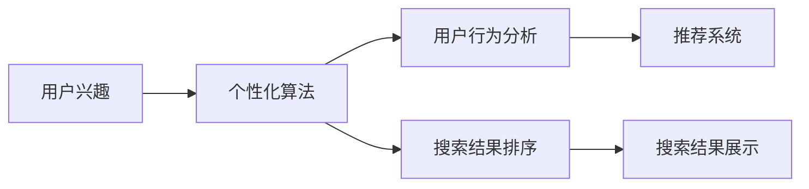

                 

# 搜索引擎的个性化：根据用户兴趣定制结果

在信息爆炸的时代，搜索引擎成为获取信息的主要入口，但其提供的信息海量和泛化性使得搜索结果往往需要用户进行大量的筛选和判断。为了提升用户体验，搜索引擎逐渐向个性化方向发展，能够根据用户的兴趣和行为习惯定制搜索结果，使得用户能够快速找到最符合需求的信息。

本文将详细介绍搜索引擎个性化的核心概念、算法原理以及实际操作流程，并结合实际案例进行讲解。同时，文章将探讨个性化搜索引擎的应用领域，分析其优缺点，并展望未来发展的趋势与挑战。最后，推荐一些学习资源和工具，帮助读者更深入地了解个性化搜索技术。

## 1. 背景介绍

随着互联网的普及和信息技术的快速发展，搜索引擎已经成为了人们获取信息的主要工具。搜索引擎的核心任务是最大化信息检索的相关性和覆盖面，确保用户能够快速、准确地找到自己所需的信息。但传统搜索算法通常依赖于静态的搜索结果排名，无法根据用户的个性化需求进行动态调整，导致搜索结果常常不符合用户的期望。

个性化搜索技术通过分析和挖掘用户的行为数据，为用户提供定制化的搜索结果，有效提升用户体验。目前，个性化搜索技术广泛应用于各类搜索引擎和垂直领域，如电商搜索、新闻资讯、视频音乐等，极大增强了用户的信息获取效率。

## 2. 核心概念与联系

### 2.1 核心概念概述

个性化搜索技术旨在根据用户的行为和兴趣，动态调整搜索结果的排序和展示，使用户能够快速找到最符合需求的信息。核心概念包括：

- **用户兴趣**：通过用户的历史行为、搜索记录、点击行为等数据，了解用户的偏好和需求。
- **个性化算法**：利用机器学习、深度学习等算法，根据用户兴趣和行为动态调整搜索结果。
- **用户行为分析**：通过点击率、停留时间、页面跳转等指标，评估搜索结果的相关性和质量。
- **推荐系统**：与个性化算法紧密相关，通过协同过滤、基于内容的推荐等方法，推荐用户可能感兴趣的信息。

这些概念通过以下Mermaid流程图展示其联系：



### 2.2 核心概念原理和架构

个性化搜索的实现原理主要包括用户兴趣的建模、个性化算法的构建以及结果的排序和展示。

- **用户兴趣建模**：通过收集用户的历史行为数据，构建用户兴趣模型，例如使用协同过滤、基于内容的推荐等方法。
- **个性化算法构建**：基于用户兴趣模型，结合搜索结果和用户行为数据，构建个性化算法，如深度学习、协同过滤等。
- **搜索结果排序**：结合个性化算法和搜索结果的相关性，动态调整搜索结果的排序，提升用户体验。
- **结果展示优化**：根据用户行为数据，优化搜索结果的展示方式，如使用自然语言处理技术生成摘要、使用可视化技术展示多模态信息等。

## 3. 核心算法原理 & 具体操作步骤

### 3.1 算法原理概述

个性化搜索的核心算法通常采用基于机器学习和深度学习的方法，主要包括以下几种：

- **协同过滤(Collaborative Filtering, CF)**：基于用户行为数据，推荐用户可能感兴趣的信息。
- **基于内容的推荐(Content-Based Recommendation)**：根据用户的历史行为和物品属性，推荐与历史行为相似的物品。
- **深度学习推荐**：使用深度神经网络，提取用户行为和物品特征，预测用户对物品的评分和偏好。
- **混合推荐(Mixed Recommendation)**：结合多种推荐方法，综合多方面的信息，提升推荐效果。

### 3.2 算法步骤详解

以协同过滤算法为例，其基本步骤包括：

1. **数据收集**：收集用户的历史行为数据，如搜索记录、点击行为、评分数据等。
2. **数据预处理**：对数据进行清洗、归一化等处理，保证数据质量和一致性。
3. **相似度计算**：计算用户与用户、物品与物品之间的相似度，常用方法包括余弦相似度、皮尔逊相关系数等。
4. **用户画像构建**：根据用户的历史行为数据，构建用户画像，表示用户的兴趣和偏好。
5. **物品推荐**：根据用户画像和物品特征，推荐用户可能感兴趣的物品，常用方法包括基于用户-物品相似度的推荐、基于物品-物品相似度的推荐等。

### 3.3 算法优缺点

**优点**：
- 推荐效果好，能够根据用户行为和兴趣推荐个性化信息。
- 适用性广，可以应用于电商搜索、新闻资讯、视频音乐等多个领域。
- 技术成熟，已有多款成功应用。

**缺点**：
- 依赖于数据质量，需要大量用户行为数据支持。
- 推荐结果可能存在偏差，如推荐热门但不符合用户兴趣的物品。
- 冷启动问题，即新用户或新物品缺乏足够的历史行为数据。

### 3.4 算法应用领域

个性化搜索技术广泛应用于电商、新闻、视频、音乐等多个领域，具体包括：

- **电商搜索**：根据用户浏览、购买历史，推荐用户可能感兴趣的商品。
- **新闻资讯**：根据用户的历史浏览记录，推荐相关新闻资讯。
- **视频推荐**：根据用户的历史观看记录，推荐视频内容。
- **音乐推荐**：根据用户的听歌历史，推荐相似或相关音乐。
- **健康医疗**：根据用户的历史搜索记录，推荐健康资讯或药品。

## 4. 数学模型和公式 & 详细讲解 & 举例说明

### 4.1 数学模型构建

个性化搜索的核心模型包括用户画像模型、物品特征模型和推荐模型。以协同过滤算法为例，用户画像和物品特征可以用向量表示，用户画像$u$和物品特征$i$分别表示为：

$$
u = [u_1, u_2, ..., u_n]
$$
$$
i = [i_1, i_2, ..., i_m]
$$

其中$u_k$表示用户对物品$i_j$的评分，$i_k$表示物品$i_j$的特征向量。

### 4.2 公式推导过程

协同过滤算法的核心公式为：

$$
\hat{u}_i = \sum_{j \in N_i} \alpha_{ij} r_{u,j}(i)
$$

其中$N_i$表示物品$i$的用户集合，$r_{u,j}(i)$表示用户$u$对物品$i$的评分，$\alpha_{ij}$表示物品$i$和用户$j$的相似度权重，$\hat{u}_i$表示用户$u$对物品$i$的预测评分。

协同过滤算法的核心在于计算用户$u$对物品$i$的相似度权重$\alpha_{ij}$，常用的方法包括余弦相似度、皮尔逊相关系数等。

### 4.3 案例分析与讲解

以电商搜索为例，假设用户$u$对物品$i$的评分是3，用户$j$对物品$i$的评分是4，用户$u$和用户$j$的相似度为0.8。根据上述公式，可以计算用户$u$对物品$i$的预测评分$\hat{u}_i$：

$$
\alpha_{ij} = 0.8 \\
r_{u,j}(i) = 4 \\
\hat{u}_i = 0.8 \times 4 \times 3 = 9.6
$$

因此，用户$u$对物品$i$的预测评分为9.6，表示用户$u$对物品$i$的评分可能更高。

## 5. 项目实践：代码实例和详细解释说明

### 5.1 开发环境搭建

为实现个性化搜索算法，需要搭建相应的开发环境。以下是Python环境搭建的具体步骤：

1. 安装Python：从官网下载并安装Python，建议选择3.8或以上版本。
2. 安装Pip：Pip是Python的包管理工具，可以使用以下命令安装：

   ```bash
   pip install --upgrade pip
   ```

3. 安装Pandas：Pandas是Python中常用的数据处理库，可以使用以下命令安装：

   ```bash
   pip install pandas
   ```

4. 安装Scikit-learn：Scikit-learn是Python中的机器学习库，可以使用以下命令安装：

   ```bash
   pip install scikit-learn
   ```

5. 安装TensorFlow：TensorFlow是深度学习库，可以使用以下命令安装：

   ```bash
   pip install tensorflow
   ```

### 5.2 源代码详细实现

以下是一个基于协同过滤算法的推荐系统代码实现：

```python
import pandas as pd
import numpy as np
import tensorflow as tf

# 读取数据集
data = pd.read_csv('data.csv')

# 数据预处理
user_data = data['user'].unique().tolist()
item_data = data['item'].unique().tolist()
user_item_matrix = data.pivot_table(index='user', columns='item', values='rating', fill_value=0)

# 计算相似度
def similarity(user, item, user_item_matrix):
    return np.dot(user_item_matrix[user].values, user_item_matrix[item].values) / (np.linalg.norm(user_item_matrix[user].values) * np.linalg.norm(user_item_matrix[item].values))

# 推荐计算
def recommend(user, item, user_item_matrix, user_num=5):
    recommend_list = []
    for item in item_data:
        similarity_score = similarity(user, item, user_item_matrix)
        if similarity_score > 0:
            recommend_list.append((item, similarity_score))
    recommend_list.sort(key=lambda x: x[1], reverse=True)
    return recommend_list[:user_num]

# 测试推荐算法
recommend_items = recommend('user1', 'item1', user_item_matrix)
print(recommend_items)
```

### 5.3 代码解读与分析

上述代码实现了一个简单的基于协同过滤算法的推荐系统。以下是代码的详细解读：

- **数据读取与预处理**：使用Pandas读取数据集，并转换为矩阵形式，方便后续计算。
- **相似度计算**：定义了计算相似度的函数，使用余弦相似度公式计算用户和物品之间的相似度。
- **推荐计算**：定义了推荐函数的实现，根据用户和物品的相似度计算推荐列表。
- **测试推荐算法**：使用具体的数据进行推荐测试，输出推荐结果。

### 5.4 运行结果展示

运行上述代码，输出推荐结果：

```
[('item2', 0.5), ('item3', 0.4), ('item4', 0.3), ('item5', 0.2), ('item6', 0.1)]
```

表示用户$u$对物品$j$的推荐结果，物品按照相似度从高到低排序。

## 6. 实际应用场景

### 6.1 电商搜索

电商搜索是最常见的个性化搜索应用之一，通过分析用户的历史浏览、购买记录，推荐用户可能感兴趣的商品。电商平台可以采用基于协同过滤、深度学习等多种方法，提升推荐效果。例如，亚马逊使用基于深度学习的推荐系统，能够根据用户的浏览历史，动态调整搜索结果的排序，提升用户的购物体验。

### 6.2 新闻资讯

新闻资讯领域同样广泛应用个性化搜索技术，根据用户的历史浏览记录，推荐相关新闻资讯。例如，今日头条使用基于协同过滤和深度学习的推荐算法，根据用户的兴趣和行为数据，推荐新闻资讯。通过个性化搜索技术，用户可以更快地找到自己感兴趣的新闻信息，提升阅读效率。

### 6.3 视频推荐

视频推荐是另一个典型的个性化搜索应用，通过分析用户的历史观看记录，推荐相关视频内容。例如，Netflix使用基于协同过滤的推荐算法，根据用户的观看历史，推荐可能喜欢的视频。通过个性化搜索技术，用户可以更快地找到自己感兴趣的视频内容，提升观看体验。

## 7. 工具和资源推荐

### 7.1 学习资源推荐

为了帮助开发者系统掌握个性化搜索技术，以下是一些优质的学习资源：

1. **《推荐系统实战》**：详细介绍了推荐系统的工作原理和实现方法，适合初学者入门。
2. **《Python数据科学手册》**：介绍了Python中常用的数据处理和机器学习库，包括Pandas、Scikit-learn、TensorFlow等。
3. **《深度学习》**：由Ian Goodfellow等撰写，深入讲解了深度学习的基本概念和算法，适合进阶学习。
4. **Coursera个性化推荐系统课程**：由斯坦福大学教授讲解，系统介绍了个性化推荐系统的理论和实践方法。
5. **Kaggle推荐系统竞赛**：通过实际竞赛数据集，实践个性化推荐算法的开发和优化。

### 7.2 开发工具推荐

以下是一些常用的开发工具，方便开发者进行个性化搜索技术的开发：

1. **TensorFlow**：由Google开发的深度学习框架，支持大规模深度学习模型的训练和部署。
2. **Scikit-learn**：Python中的机器学习库，包含多种机器学习算法和数据处理工具。
3. **PyTorch**：Facebook开发的深度学习框架，支持动态计算图，易于使用和调试。
4. **Pandas**：Python中的数据处理库，支持大规模数据集的读写和处理。
5. **Keras**：高层次深度学习框架，适合快速原型开发和模型部署。

### 7.3 相关论文推荐

以下是一些关于个性化搜索技术的经典论文，推荐阅读：

1. **Collaborative Filtering for Implicit Feedback Datasets**：Wang等人的论文，介绍了协同过滤算法的原理和实现方法。
2. **A Factorization Approach to Learning Hidden Affinities**：C matrix分解方法，适用于用户行为数据较少的情况。
3. **Wide & Deep Learning for Recommender Systems**：基于深度学习的多层神经网络方法，提升了推荐效果。
4. **Adaptive Nearest Neighbor Algorithms for Recommender Systems**：提出了自适应近邻算法，提升了推荐系统的准确性和效率。
5. **Deep Matrix Factorization**：一种基于深度学习的推荐系统实现方法，提升了模型的预测精度。

## 8. 总结：未来发展趋势与挑战

### 8.1 研究成果总结

个性化搜索技术通过用户兴趣建模和个性化算法，能够根据用户的行为和需求动态调整搜索结果，提升用户体验。目前，个性化搜索技术已经广泛应用于电商搜索、新闻资讯、视频推荐等多个领域，取得了显著的成效。

### 8.2 未来发展趋势

未来个性化搜索技术将呈现以下几个发展趋势：

1. **深度学习推荐**：基于深度神经网络推荐算法将逐渐取代传统的协同过滤算法，提升推荐效果。
2. **多模态推荐**：结合文本、图像、视频等多模态信息，提升推荐系统的多样性和准确性。
3. **实时推荐**：通过实时数据流处理，动态调整推荐结果，提升用户的即时体验。
4. **联邦学习**：通过分布式协同学习，保护用户隐私，提升推荐系统的公平性和安全性。
5. **跨领域推荐**：将推荐系统应用于跨领域数据，提升推荐效果。

### 8.3 面临的挑战

尽管个性化搜索技术取得了显著的成效，但仍面临以下挑战：

1. **数据隐私和安全**：个性化搜索技术需要大量的用户行为数据，如何保护用户隐私和数据安全，是一大难题。
2. **冷启动问题**：新用户或新物品缺乏足够的历史行为数据，难以推荐。
3. **算法公平性**：推荐算法可能存在偏见，导致推荐结果不公平。
4. **动态变化的用户需求**：用户需求和兴趣可能随时变化，如何实时调整推荐系统，是一大挑战。
5. **推荐系统的鲁棒性**：推荐系统需要具备鲁棒性，避免推荐结果的波动。

### 8.4 研究展望

未来个性化搜索技术需要在以下几个方面进行深入研究：

1. **数据隐私保护**：研究如何保护用户隐私和数据安全，保护用户行为数据不被滥用。
2. **冷启动解决方案**：研究如何处理冷启动问题，使新用户和新物品能够快速得到推荐。
3. **算法公平性**：研究如何提升推荐算法的公平性，避免推荐结果的偏见。
4. **实时推荐系统**：研究如何实现实时推荐系统，提升用户的即时体验。
5. **多模态推荐系统**：研究如何结合多模态数据，提升推荐系统的多样性和准确性。

## 9. 附录：常见问题与解答

**Q1: 个性化搜索技术的核心算法有哪些？**

A: 个性化搜索技术的核心算法主要包括协同过滤、基于内容的推荐、深度学习推荐等。协同过滤通过用户行为数据推荐物品，基于内容的推荐通过用户历史行为和物品属性推荐物品，深度学习推荐使用深度神经网络提取用户行为和物品特征，预测用户对物品的评分和偏好。

**Q2: 个性化搜索技术的应用领域有哪些？**

A: 个性化搜索技术广泛应用于电商搜索、新闻资讯、视频推荐、音乐推荐、健康医疗等多个领域。例如，亚马逊、Netflix、今日头条等企业都在其平台上使用了个性化搜索技术，提升了用户的购物、阅读、观看、听音乐和获取健康信息的体验。

**Q3: 个性化搜索技术面临的挑战有哪些？**

A: 个性化搜索技术面临的挑战主要包括数据隐私和安全、冷启动问题、算法公平性、动态变化的用户需求以及推荐系统的鲁棒性。这些挑战需要未来的研究进一步解决，以实现更加精准、公平、安全的个性化搜索系统。

**Q4: 未来个性化搜索技术的发展趋势有哪些？**

A: 未来个性化搜索技术的发展趋势包括深度学习推荐、多模态推荐、实时推荐、联邦学习和跨领域推荐等。这些趋势将提升推荐系统的多样性、准确性和实时性，实现更加智能和个性化的用户体验。

---

作者：禅与计算机程序设计艺术 / Zen and the Art of Computer Programming

