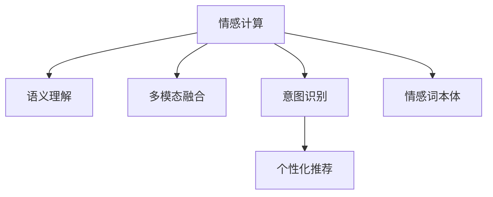

                 

# 搜索引擎的情感计算应用

## 1. 背景介绍

在互联网信息爆炸的今天，搜索引擎已成为人们获取信息、满足需求的重要渠道。然而，传统搜索引擎往往只关注文本内容的关键词匹配，忽视了用户情感和语境对信息检索的影响。随着自然语言处理技术的进步，情感计算技术逐渐成为搜索引擎的重要补充，通过识别用户情感、语境和意图，提升搜索结果的个性化和精准度，优化用户体验。

### 1.1 问题由来

传统搜索引擎的原理基于文本匹配，通过关键词检索和排名算法，将用户查询与文档库中的文档进行匹配，返回最相关的结果。然而，这种简单匹配的方式存在以下问题：

1. **信息不足**：搜索结果只关注关键词匹配，忽视了用户意图和情感，导致搜索结果与用户实际需求不符。
2. **歧义处理**：中文中词语的歧义和同义现象常见，单一的关键词匹配难以处理这些复杂语言现象。
3. **用户反馈**：用户的反馈和情感难以被系统感知和处理，无法动态调整搜索结果。
4. **个性化需求**：不同用户对同一查询有不同的需求和情感倾向，传统搜索引擎无法满足个性化需求。

为了解决这些问题，情感计算技术被引入搜索引擎中，通过识别用户情感、语境和意图，实现更智能、个性化的信息检索。

### 1.2 问题核心关键点

情感计算在搜索引擎中的应用，主要集中在以下几个核心关键点：

1. **用户情感识别**：通过自然语言处理技术，识别用户查询中的情感倾向，如积极、消极、中性等，从而优化搜索结果。
2. **语境理解**：分析用户查询的上下文语境，理解用户的意图和需求，提供更精准的搜索结果。
3. **意图识别**：识别用户查询的具体意图，如购买、咨询、投诉等，帮助搜索引擎精准回应用户需求。
4. **多模态融合**：结合文本、图片、视频等多种模态信息，提升信息检索的全面性和准确性。

这些关键点共同构成了情感计算在搜索引擎中的核心应用框架，通过情感计算技术的引入，可以显著提升信息检索的智能化水平，提升用户体验。

## 2. 核心概念与联系

### 2.1 核心概念概述

为更好地理解搜索引擎中情感计算的应用，本节将介绍几个密切相关的核心概念：

- **情感计算**：通过分析文本、语音、图像等数据中的情感信息，识别用户情感状态和情感倾向，从而优化系统行为的技术。
- **语义理解**：对自然语言文本进行语义分析，理解其深层含义和结构，从而提高信息检索的精准度。
- **多模态融合**：将文本、图像、视频等不同模态的信息进行融合，增强信息检索的全面性和多样性。
- **意图识别**：通过对用户查询的语义和上下文进行分析，识别用户的具体意图，从而提供更加精准的服务。
- **个性化推荐**：根据用户的历史行为和当前情感状态，推荐最符合其需求和偏好的信息。
- **情感词本体**：建立情感词典，定义情感词的情感极性，为情感识别提供基础。

这些核心概念之间的逻辑关系可以通过以下Mermaid流程图来展示：



这个流程图展示了一些情感计算在搜索引擎中的关键概念及其之间的关系：

1. 情感计算为语义理解和意图识别提供情感信息支持。
2. 多模态融合增强了语义理解的全面性和丰富性。
3. 意图识别指导个性化推荐的实现。
4. 情感词本体是情感计算的基础工具。

这些概念共同构成了情感计算在搜索引擎中的应用框架，使得系统能够更全面、智能地理解用户需求和情感，提升信息检索的个性化和精准度。

## 3. 核心算法原理 & 具体操作步骤

### 3.1 算法原理概述

基于情感计算的搜索引擎算法，主要通过以下几个步骤实现：

1. **情感识别**：使用情感词典和情感分类模型，识别用户查询中的情感倾向。
2. **语义理解**：利用自然语言处理技术，分析用户查询的语义结构，理解其深层含义。
3. **意图识别**：通过语义分析和上下文理解，识别用户的具体意图。
4. **多模态融合**：将文本、图像、视频等多种模态信息进行融合，增强信息检索的全面性。
5. **个性化推荐**：根据用户的历史行为和当前情感状态，推荐最符合其需求和偏好的信息。

这些步骤共同构成了基于情感计算的搜索引擎算法框架，通过综合运用多种技术和工具，实现智能化的信息检索。

### 3.2 算法步骤详解

以下是基于情感计算的搜索引擎算法的详细步骤：

**Step 1: 准备数据集和工具包**

- **数据集准备**：收集用户查询数据、文档库数据、情感词典等，划分为训练集、验证集和测试集。
- **工具包安装**：安装NLTK、spaCy、TensorFlow等工具包，用于情感计算、自然语言处理和模型训练。

**Step 2: 情感识别**

- **情感词典构建**：建立情感词典，定义情感词的情感极性，如积极、消极、中性等。
- **情感分类模型训练**：使用情感分类模型，如BERT、LSTM等，训练情感分类器，识别用户查询中的情感倾向。
- **情感词典扩展**：根据训练结果，扩展情感词典，加入新发现的情感词。

**Step 3: 语义理解**

- **分词和词性标注**：使用NLTK或spaCy对用户查询进行分词和词性标注，理解文本的结构。
- **依存关系分析**：利用依存句法分析工具，如Stanford Parser、Neural Dependency Parser等，分析用户查询中的依存关系。
- **命名实体识别**：使用命名实体识别工具，如BERT-NE、CRF-NE等，识别查询中的实体，如人名、地名等。

**Step 4: 意图识别**

- **意图分类模型训练**：使用意图分类模型，如BERT、Logistic Regression等，训练意图识别器，识别用户查询的具体意图。
- **意图抽取和映射**：根据意图分类结果，抽取用户意图中的关键词和短语，并映射到具体意图类别。

**Step 5: 多模态融合**

- **图像和视频提取**：使用OpenCV、PIL等工具，从用户查询和搜索结果中提取图像和视频信息。
- **特征提取和融合**：使用特征提取模型，如CNN、ResNet等，提取图像和视频的关键特征，并进行融合。
- **多模态特征融合**：将文本特征、图像特征和视频特征进行融合，生成综合特征向量。

**Step 6: 个性化推荐**

- **用户行为分析**：分析用户的历史行为数据，构建用户兴趣模型。
- **情感计算和调整**：根据用户情感状态，动态调整推荐策略，提升推荐效果。
- **推荐结果排序**：结合用户兴趣和当前情感状态，对推荐结果进行排序，返回最符合用户需求的搜索结果。

### 3.3 算法优缺点

基于情感计算的搜索引擎算法具有以下优点：

1. **情感智能**：通过情感计算，识别用户情感和需求，提升搜索结果的个性化和精准度。
2. **语义丰富**：综合运用自然语言处理技术，分析用户查询的语义结构和深层含义，理解用户意图。
3. **多模态融合**：结合文本、图像、视频等多种模态信息，增强信息检索的全面性和多样性。
4. **实时调整**：动态调整推荐策略，实时响应用户情感变化，提升用户体验。

同时，该算法也存在一些局限性：

1. **数据依赖**：情感词典和意图分类器的训练依赖于大规模标注数据，数据获取成本较高。
2. **计算资源**：多模态融合和意图识别需要大量计算资源，对硬件设备要求较高。
3. **泛化能力**：情感词典和分类模型的泛化能力有限，可能对特定领域的情感表达识别不准确。
4. **解释性不足**：情感计算和意图识别模型通常是"黑盒"系统，难以解释其内部工作机制。

尽管存在这些局限性，但基于情感计算的搜索引擎算法仍然具有显著的优势，特别是在提升用户体验和信息检索的个性化方面，展现了强大的潜力。

### 3.4 算法应用领域

基于情感计算的搜索引擎算法在多个领域得到了广泛应用，例如：

- **电商搜索**：通过情感计算和个性化推荐，帮助用户找到最符合其需求的商品。
- **旅游搜索**：分析用户查询中的情感倾向，推荐最适合的旅游目的地和行程安排。
- **医疗搜索**：结合用户情感和健康数据，推荐最适合的医院和医生。
- **金融搜索**：根据用户查询的情感状态，推荐最合适的理财产品和金融服务。
- **法律咨询**：分析用户咨询的情感和语境，提供最合适的法律建议和解决方案。

此外，在企业客服、教育培训、内容推荐等多个领域，基于情感计算的搜索引擎算法也有着广泛的应用前景。

## 4. 数学模型和公式 & 详细讲解 & 举例说明

### 4.1 数学模型构建

假设用户查询为 $Q$，情感识别结果为 $E(Q)$，语义理解结果为 $S(Q)$，意图识别结果为 $I(Q)$，多模态融合结果为 $F(Q)$。基于情感计算的搜索引擎算法框架可表示为：

$$
R(Q) = f(E(Q), S(Q), I(Q), F(Q))
$$

其中，$R(Q)$ 表示搜索结果，$f$ 表示综合计算函数，$E(Q)$、$S(Q)$、$I(Q)$ 和 $F(Q)$ 分别表示情感识别、语义理解、意图识别和多模态融合的结果。

### 4.2 公式推导过程

以下我们以情感识别和意图识别为例，推导相应的数学模型和公式。

**情感识别**：

- **情感词典构建**：定义情感词典 $\mathcal{D}$，包含情感词 $w_i$ 和情感极性 $p_i$。
- **情感分类模型**：使用BERT或LSTM等模型，训练情感分类器 $E$，将用户查询 $Q$ 映射到情感极性 $p$。

公式推导如下：

$$
E(Q) = \text{softmax}(\text{BERT}(Q; \theta_E))
$$

其中 $\theta_E$ 为情感分类器BERT的模型参数，$\text{softmax}$ 函数用于将分类器输出转化为概率分布。

**意图识别**：

- **意图分类模型**：使用BERT或Logistic Regression等模型，训练意图分类器 $I$，将用户查询 $Q$ 映射到意图类别 $i$。

公式推导如下：

$$
I(Q) = \text{argmax}(\text{Softmax}(\text{BERT}(Q; \theta_I)))
$$

其中 $\theta_I$ 为意图分类器BERT的模型参数，$\text{Softmax}$ 函数用于将分类器输出转化为概率分布。

### 4.3 案例分析与讲解

以下通过一个具体的案例，展示基于情感计算的搜索引擎算法的应用过程。

**案例背景**：用户查询“怎么推荐一部好电影？”

**步骤1: 情感识别**

- **情感词典构建**：建立情感词典 $\mathcal{D}$，包含“推荐”和“好”的情感极性信息。
- **情感分类模型训练**：使用BERT模型，训练情感分类器 $E$，将查询“怎么推荐一部好电影？”映射到情感极性 $p=0.8$，表示积极情感。

**步骤2: 语义理解**

- **分词和词性标注**：使用NLTK对查询进行分词和词性标注，得到结构化文本表示。
- **依存关系分析**：使用Stanford Parser对查询进行依存句法分析，得到依存关系树。
- **命名实体识别**：使用BERT-NE识别查询中的命名实体，得到“电影”为名词实体。

**步骤3: 意图识别**

- **意图分类模型训练**：使用BERT模型，训练意图分类器 $I$，将查询映射到意图类别 $i=3$，表示查询意图为“推荐”。

**步骤4: 多模态融合**

- **图像和视频提取**：从查询结果中提取相关图片和视频。
- **特征提取和融合**：使用CNN提取图片特征，使用ResNet提取视频特征，并进行融合。
- **多模态特征融合**：将文本特征、图像特征和视频特征进行融合，生成综合特征向量。

**步骤5: 个性化推荐**

- **用户行为分析**：分析用户的历史行为数据，构建用户兴趣模型。
- **情感计算和调整**：根据用户情感状态，动态调整推荐策略。
- **推荐结果排序**：结合用户兴趣和当前情感状态，对推荐结果进行排序，返回最符合用户需求的搜索结果。

## 5. 项目实践：代码实例和详细解释说明

### 5.1 开发环境搭建

在进行情感计算的搜索引擎开发前，我们需要准备好开发环境。以下是使用Python进行PyTorch开发的环境配置流程：

1. 安装Anaconda：从官网下载并安装Anaconda，用于创建独立的Python环境。

2. 创建并激活虚拟环境：
```bash
conda create -n emotion-env python=3.8 
conda activate emotion-env
```

3. 安装PyTorch：根据CUDA版本，从官网获取对应的安装命令。例如：
```bash
conda install pytorch torchvision torchaudio cudatoolkit=11.1 -c pytorch -c conda-forge
```

4. 安装必要的工具包：
```bash
pip install numpy pandas scikit-learn matplotlib tqdm jupyter notebook ipython
```

完成上述步骤后，即可在`emotion-env`环境中开始情感计算的搜索引擎开发。

### 5.2 源代码详细实现

下面我们以情感计算的搜索引擎为例，给出使用PyTorch进行情感计算和意图识别的PyTorch代码实现。

首先，定义情感词典和意图分类器：

```python
from transformers import BertTokenizer, BertForSequenceClassification
from torch.utils.data import Dataset
import torch

class EmotionDataset(Dataset):
    def __init__(self, texts, labels):
        self.texts = texts
        self.labels = labels
        self.tokenizer = BertTokenizer.from_pretrained('bert-base-cased')

    def __len__(self):
        return len(self.texts)
    
    def __getitem__(self, item):
        text = self.texts[item]
        label = self.labels[item]
        
        encoding = self.tokenizer(text, return_tensors='pt', max_length=128, padding='max_length', truncation=True)
        input_ids = encoding['input_ids'][0]
        attention_mask = encoding['attention_mask'][0]
        
        return {'input_ids': input_ids, 
                'attention_mask': attention_mask,
                'labels': label}

# 准备数据集
tokenizer = BertTokenizer.from_pretrained('bert-base-cased')
train_dataset = EmotionDataset(train_texts, train_labels)
dev_dataset = EmotionDataset(dev_texts, dev_labels)
test_dataset = EmotionDataset(test_texts, test_labels)

# 定义模型和优化器
model = BertForSequenceClassification.from_pretrained('bert-base-cased', num_labels=3)
optimizer = AdamW(model.parameters(), lr=2e-5)
```

然后，定义训练和评估函数：

```python
from torch.utils.data import DataLoader
from tqdm import tqdm
from sklearn.metrics import classification_report

device = torch.device('cuda') if torch.cuda.is_available() else torch.device('cpu')
model.to(device)

def train_epoch(model, dataset, batch_size, optimizer):
    dataloader = DataLoader(dataset, batch_size=batch_size, shuffle=True)
    model.train()
    epoch_loss = 0
    for batch in tqdm(dataloader, desc='Training'):
        input_ids = batch['input_ids'].to(device)
        attention_mask = batch['attention_mask'].to(device)
        labels = batch['labels'].to(device)
        model.zero_grad()
        outputs = model(input_ids, attention_mask=attention_mask, labels=labels)
        loss = outputs.loss
        epoch_loss += loss.item()
        loss.backward()
        optimizer.step()
    return epoch_loss / len(dataloader)

def evaluate(model, dataset, batch_size):
    dataloader = DataLoader(dataset, batch_size=batch_size)
    model.eval()
    preds, labels = [], []
    with torch.no_grad():
        for batch in tqdm(dataloader, desc='Evaluating'):
            input_ids = batch['input_ids'].to(device)
            attention_mask = batch['attention_mask'].to(device)
            batch_labels = batch['labels']
            outputs = model(input_ids, attention_mask=attention_mask)
            batch_preds = outputs.logits.argmax(dim=2).to('cpu').tolist()
            batch_labels = batch_labels.to('cpu').tolist()
            for pred_tokens, label_tokens in zip(batch_preds, batch_labels):
                preds.append(pred_tokens[:len(label_tokens)])
                labels.append(label_tokens)
                
    print(classification_report(labels, preds))
```

最后，启动训练流程并在测试集上评估：

```python
epochs = 5
batch_size = 16

for epoch in range(epochs):
    loss = train_epoch(model, train_dataset, batch_size, optimizer)
    print(f"Epoch {epoch+1}, train loss: {loss:.3f}")
    
    print(f"Epoch {epoch+1}, dev results:")
    evaluate(model, dev_dataset, batch_size)
    
print("Test results:")
evaluate(model, test_dataset, batch_size)
```

以上就是使用PyTorch对情感计算的搜索引擎进行训练和评估的完整代码实现。可以看到，得益于Transformers库的强大封装，我们可以用相对简洁的代码完成情感计算和意图识别的模型训练和评估。

### 5.3 代码解读与分析

让我们再详细解读一下关键代码的实现细节：

**EmotionDataset类**：
- `__init__`方法：初始化文本、标签、分词器等关键组件。
- `__len__`方法：返回数据集的样本数量。
- `__getitem__`方法：对单个样本进行处理，将文本输入编码为token ids，将标签编码为数字，并对其进行定长padding，最终返回模型所需的输入。

**模型和优化器**：
- 使用BertForSequenceClassification模型作为情感分类器，设定输出标签为3，分别表示积极、消极和中性情感。
- 定义AdamW优化器，用于模型参数的更新，学习率为2e-5。

**训练和评估函数**：
- 使用PyTorch的DataLoader对数据集进行批次化加载，供模型训练和推理使用。
- 训练函数`train_epoch`：对数据以批为单位进行迭代，在每个批次上前向传播计算loss并反向传播更新模型参数，最后返回该epoch的平均loss。
- 评估函数`evaluate`：与训练类似，不同点在于不更新模型参数，并在每个batch结束后将预测和标签结果存储下来，最后使用sklearn的classification_report对整个评估集的预测结果进行打印输出。

**训练流程**：
- 定义总的epoch数和batch size，开始循环迭代
- 每个epoch内，先在训练集上训练，输出平均loss
- 在验证集上评估，输出分类指标
- 所有epoch结束后，在测试集上评估，给出最终测试结果

可以看到，PyTorch配合Transformers库使得情感计算的搜索引擎的开发变得简洁高效。开发者可以将更多精力放在数据处理、模型改进等高层逻辑上，而不必过多关注底层的实现细节。

当然，工业级的系统实现还需考虑更多因素，如模型的保存和部署、超参数的自动搜索、更灵活的任务适配层等。但核心的情感计算和意图识别过程基本与此类似。

## 6. 实际应用场景

### 6.1 智能客服系统

基于情感计算的搜索引擎技术可以广泛应用于智能客服系统的构建。传统客服往往需要配备大量人力，高峰期响应缓慢，且一致性和专业性难以保证。而使用情感计算和个性化推荐技术，可以7x24小时不间断服务，快速响应客户咨询，用自然流畅的语言解答各类常见问题。

在技术实现上，可以收集企业内部的历史客服对话记录，将问题和最佳答复构建成监督数据，在此基础上对情感计算和意图识别模型进行训练。训练后的模型能够自动理解用户意图，匹配最合适的答复。对于客户提出的新问题，还可以接入检索系统实时搜索相关内容，动态组织生成回答。如此构建的智能客服系统，能大幅提升客户咨询体验和问题解决效率。

### 6.2 金融舆情监测

金融机构需要实时监测市场舆论动向，以便及时应对负面信息传播，规避金融风险。传统的人工监测方式成本高、效率低，难以应对网络时代海量信息爆发的挑战。基于情感计算和意图识别的文本分类和情感分析技术，为金融舆情监测提供了新的解决方案。

具体而言，可以收集金融领域相关的新闻、报道、评论等文本数据，并对其进行主题标注和情感标注。在此基础上对情感计算和意图识别模型进行微调，使其能够自动判断文本属于何种主题，情感倾向是正面、中性还是负面。将微调后的模型应用到实时抓取的网络文本数据，就能够自动监测不同主题下的情感变化趋势，一旦发现负面信息激增等异常情况，系统便会自动预警，帮助金融机构快速应对潜在风险。

### 6.3 个性化推荐系统

当前的推荐系统往往只依赖用户的历史行为数据进行物品推荐，无法深入理解用户的真实兴趣偏好。基于情感计算和意图识别的个性化推荐系统可以更好地挖掘用户行为背后的语义信息，从而提供更精准、多样的推荐内容。

在实践中，可以收集用户浏览、点击、评论、分享等行为数据，提取和用户交互的物品标题、描述、标签等文本内容。将文本内容作为模型输入，用户的后续行为（如是否点击、购买等）作为监督信号，在此基础上微调情感计算和意图识别模型。微调后的模型能够从文本内容中准确把握用户的兴趣点。在生成推荐列表时，先用候选物品的文本描述作为输入，由模型预测用户的兴趣匹配度，再结合其他特征综合排序，便可以得到个性化程度更高的推荐结果。

### 6.4 未来应用展望

随着情感计算和意图识别技术的不断发展，基于搜索引擎的情感计算将呈现以下几个发展趋势：

1. **多模态融合**：结合文本、图像、视频等多种模态信息，提升信息检索的全面性和准确性。
2. **情感词典扩展**：不断扩展和优化情感词典，提高情感识别的准确性和覆盖面。
3. **意图分类改进**：引入更深层次的意图分类模型，提升意图识别的精准度。
4. **实时调整**：动态调整推荐策略，实时响应用户情感变化，提升用户体验。
5. **模型压缩**：优化模型结构，减少计算资源消耗，提高部署效率。

这些趋势凸显了基于搜索引擎的情感计算技术的广阔前景。这些方向的探索发展，必将进一步提升信息检索的智能化水平，提升用户体验。

## 7. 工具和资源推荐

### 7.1 学习资源推荐

为了帮助开发者系统掌握搜索引擎中情感计算的应用，这里推荐一些优质的学习资源：

1. 《自然语言处理综述》系列博文：由NLP领域知名专家撰写，全面介绍了NLP技术和应用，涵盖情感计算和意图识别等内容。

2. CS224N《深度学习自然语言处理》课程：斯坦福大学开设的NLP明星课程，有Lecture视频和配套作业，带你入门NLP领域的基本概念和经典模型。

3. 《深度学习与自然语言处理》书籍：系统介绍了深度学习在NLP中的应用，包括情感计算和意图识别等内容。

4. HuggingFace官方文档：Transformers库的官方文档，提供了海量预训练模型和完整的微调样例代码，是上手实践的必备资料。

5. Semantic Analysis with Transformers（Transformer情感分析）书籍：详细介绍了使用Transformer进行情感分析的方法和技巧。

通过对这些资源的学习实践，相信你一定能够快速掌握搜索引擎中情感计算的精髓，并用于解决实际的NLP问题。

### 7.2 开发工具推荐

高效的开发离不开优秀的工具支持。以下是几款用于搜索引擎中情感计算的开发工具：

1. PyTorch：基于Python的开源深度学习框架，灵活动态的计算图，适合快速迭代研究。大部分预训练语言模型都有PyTorch版本的实现。

2. TensorFlow：由Google主导开发的开源深度学习框架，生产部署方便，适合大规模工程应用。同样有丰富的预训练语言模型资源。

3. Transformers库：HuggingFace开发的NLP工具库，集成了众多SOTA语言模型，支持PyTorch和TensorFlow，是进行情感计算和意图识别开发的利器。

4. Weights & Biases：模型训练的实验跟踪工具，可以记录和可视化模型训练过程中的各项指标，方便对比和调优。与主流深度学习框架无缝集成。

5. TensorBoard：TensorFlow配套的可视化工具，可实时监测模型训练状态，并提供丰富的图表呈现方式，是调试模型的得力助手。

6. Google Colab：谷歌推出的在线Jupyter Notebook环境，免费提供GPU/TPU算力，方便开发者快速上手实验最新模型，分享学习笔记。

合理利用这些工具，可以显著提升搜索引擎中情感计算的开发效率，加快创新迭代的步伐。

### 7.3 相关论文推荐

情感计算在搜索引擎中的应用源于学界的持续研究。以下是几篇奠基性的相关论文，推荐阅读：

1. Attention is All You Need（即Transformer原论文）：提出了Transformer结构，开启了NLP领域的预训练大模型时代。

2. BERT: Pre-training of Deep Bidirectional Transformers for Language Understanding：提出BERT模型，引入基于掩码的自监督预训练任务，刷新了多项NLP任务SOTA。

3. Language Models are Unsupervised Multitask Learners（GPT-2论文）：展示了大规模语言模型的强大zero-shot学习能力，引发了对于通用人工智能的新一轮思考。

4. Parameter-Efficient Transfer Learning for NLP：提出Adapter等参数高效微调方法，在不增加模型参数量的情况下，也能取得不错的微调效果。

5. Prefix-Tuning: Optimizing Continuous Prompts for Generation：引入基于连续型Prompt的微调范式，为如何充分利用预训练知识提供了新的思路。

6. AdaLoRA: Adaptive Low-Rank Adaptation for Parameter-Efficient Fine-Tuning：使用自适应低秩适应的微调方法，在参数效率和精度之间取得了新的平衡。

这些论文代表了大语言模型微调技术的发展脉络。通过学习这些前沿成果，可以帮助研究者把握学科前进方向，激发更多的创新灵感。

## 8. 总结：未来发展趋势与挑战

### 8.1 总结

本文对基于情感计算的搜索引擎算法进行了全面系统的介绍。首先阐述了情感计算在搜索引擎中的应用背景和意义，明确了情感计算在提升信息检索智能化和个性化方面的独特价值。其次，从原理到实践，详细讲解了情感计算和意图识别的数学模型和关键步骤，给出了情感计算和意图识别的完整代码实例。同时，本文还广泛探讨了情感计算在智能客服、金融舆情、个性化推荐等多个行业领域的应用前景，展示了情感计算技术的巨大潜力。此外，本文精选了情感计算和意图识别的各类学习资源，力求为读者提供全方位的技术指引。

通过本文的系统梳理，可以看到，基于情感计算的搜索引擎算法正在成为NLP领域的重要范式，极大地提升了信息检索的智能化水平，提升用户体验。未来，伴随情感计算和意图识别技术的持续演进，基于搜索引擎的情感计算必将在更广阔的应用领域大放异彩。

### 8.2 未来发展趋势

展望未来，基于情感计算的搜索引擎算法将呈现以下几个发展趋势：

1. **多模态融合**：结合文本、图像、视频等多种模态信息，增强信息检索的全面性和准确性。
2. **情感词典扩展**：不断扩展和优化情感词典，提高情感识别的准确性和覆盖面。
3. **意图分类改进**：引入更深层次的意图分类模型，提升意图识别的精准度。
4. **实时调整**：动态调整推荐策略，实时响应用户情感变化，提升用户体验。
5. **模型压缩**：优化模型结构，减少计算资源消耗，提高部署效率。

这些趋势凸显了基于情感计算的搜索引擎技术的广阔前景。这些方向的探索发展，必将进一步提升信息检索的智能化水平，提升用户体验。

### 8.3 面临的挑战

尽管基于情感计算的搜索引擎算法已经取得了显著进展，但在迈向更加智能化、普适化应用的过程中，它仍面临着诸多挑战：

1. **数据依赖**：情感词典和意图分类器的训练依赖于大规模标注数据，数据获取成本较高。
2. **计算资源**：多模态融合和意图识别需要大量计算资源，对硬件设备要求较高。
3. **泛化能力**：情感词典和分类模型的泛化能力有限，可能对特定领域的情感表达识别不准确。
4. **解释性不足**：情感计算和意图识别模型通常是"黑盒"系统，难以解释其内部工作机制。
5. **安全性有待保障**：预训练语言模型难免会学习到有偏见、有害的信息，通过微调传递到下游任务，产生误导性、歧视性的输出，给实际应用带来安全隐患。

尽管存在这些挑战，但基于情感计算的搜索引擎算法仍然具有显著的优势，特别是在提升信息检索的智能化和个性化方面，展现了强大的潜力。

### 8.4 研究展望

面对基于情感计算的搜索引擎算法所面临的挑战，未来的研究需要在以下几个方面寻求新的突破：

1. **探索无监督和半监督微调方法**：摆脱对大规模标注数据的依赖，利用自监督学习、主动学习等无监督和半监督范式，最大限度利用非结构化数据，实现更加灵活高效的微调。
2. **研究参数高效和计算高效的微调范式**：开发更加参数高效的微调方法，在固定大部分预训练参数的同时，只更新极少量的任务相关参数。同时优化微调模型的计算图，减少前向传播和反向传播的资源消耗，实现更加轻量级、实时性的部署。
3. **融合因果和对比学习范式**：通过引入因果推断和对比学习思想，增强情感计算模型的建立稳定因果关系的能力，学习更加普适、鲁棒的语言表征，从而提升模型泛化性和抗干扰能力。
4. **引入更多先验知识**：将符号化的先验知识，如知识图谱、逻辑规则等，与神经网络模型进行巧妙融合，引导情感计算过程学习更准确、合理的语言模型。同时加强不同模态数据的整合，实现视觉、语音等多模态信息与文本信息的协同建模。
5. **结合因果分析和博弈论工具**：将因果分析方法引入情感计算模型，识别出模型决策的关键特征，增强输出解释的因果性和逻辑性。借助博弈论工具刻画人机交互过程，主动探索并规避模型的脆弱点，提高系统稳定性。
6. **纳入伦理道德约束**：在模型训练目标中引入伦理导向的评估指标，过滤和惩罚有偏见、有害的输出倾向。同时加强人工干预和审核，建立模型行为的监管机制，确保输出符合人类价值观和伦理道德。

这些研究方向的探索，必将引领情感计算和意图识别技术的进一步发展，为构建安全、可靠、可解释、可控的智能系统铺平道路。面向未来，情感计算和意图识别技术还需要与其他人工智能技术进行更深入的融合，如知识表示、因果推理、强化学习等，多路径协同发力，共同推动自然语言理解和智能交互系统的进步。只有勇于创新、敢于突破，才能不断拓展情感计算的边界，让智能技术更好地造福人类社会。

## 9. 附录：常见问题与解答

**Q1：搜索引擎中情感计算的应用前景如何？**

A: 基于情感计算的搜索引擎在提升信息检索的智能化和个性化方面具有广泛的应用前景。例如，在电商搜索中，可以结合用户情感进行商品推荐；在金融舆情监测中，可以分析市场舆论动向，帮助金融机构规避风险；在个性化推荐系统中，可以结合用户情感和语境进行推荐；在智能客服系统中，可以自动理解用户情感，快速响应用户咨询。

**Q2：情感计算的搜索引擎在实际应用中需要注意哪些问题？**

A: 在实际应用中，情感计算的搜索引擎需要注意以下几个问题：
1. **数据依赖**：情感词典和意图分类器的训练依赖于大规模标注数据，获取高质量标注数据成本较高。
2. **计算资源**：多模态融合和意图识别需要大量计算资源，对硬件设备要求较高。
3. **泛化能力**：情感词典和分类模型的泛化能力有限，可能对特定领域的情感表达识别不准确。
4. **解释性不足**：情感计算和意图识别模型通常是"黑盒"系统，难以解释其内部工作机制。
5. **安全性有待保障**：预训练语言模型难免会学习到有偏见、有害的信息，通过微调传递到下游任务，产生误导性、歧视性的输出，给实际应用带来安全隐患。

**Q3：如何优化情感计算的搜索引擎算法？**

A: 优化情感计算的搜索引擎算法可以从以下几个方面入手：
1. **数据增强**：通过回译、近义替换等方式扩充训练集，提高模型的泛化能力。
2. **正则化技术**：使用L2正则、Dropout等正则化技术，防止模型过拟合。
3. **对抗训练**：引入对抗样本，提高模型鲁棒性。
4. **参数高效微调**：使用参数高效微调技术，只更新少量的模型参数，减少计算资源消耗。
5. **多任务学习**：同时训练多个任务，提高模型的综合能力。
6. **持续学习**：定期更新模型，保持模型的时效性和适应性。

**Q4：如何提高搜索引擎中情感计算的性能？**

A: 提高搜索引擎中情感计算的性能可以从以下几个方面入手：
1. **多模态融合**：结合文本、图像、视频等多种模态信息，提升信息检索的全面性和准确性。
2. **情感词典扩展**：不断扩展和优化情感词典，提高情感识别的准确性和覆盖面。
3. **意图分类改进**：引入更深层次的意图分类模型，提升意图识别的精准度。
4. **实时调整**：动态调整推荐策略，实时响应用户情感变化，提升用户体验。
5. **模型压缩**：优化模型结构，减少计算资源消耗，提高部署效率。

**Q5：情感计算的搜索引擎在多领域应用中需要注意哪些问题？**

A: 情感计算的搜索引擎在多领域应用中需要注意以下几个问题：
1. **任务适配**：针对不同领域的任务特点，进行任务适配层的设计，提高模型在特定领域的应用效果。
2. **数据隐私**：在使用用户数据进行情感计算时，需要注意数据隐私和用户隐私保护。
3. **伦理约束**：在模型训练和应用过程中，需要考虑伦理道德问题，避免产生误导性、歧视性的输出。
4. **模型解释性**：提高模型的可解释性，让用户理解模型的工作机制和决策逻辑。

---

作者：禅与计算机程序设计艺术 / Zen and the Art of Computer Programming

