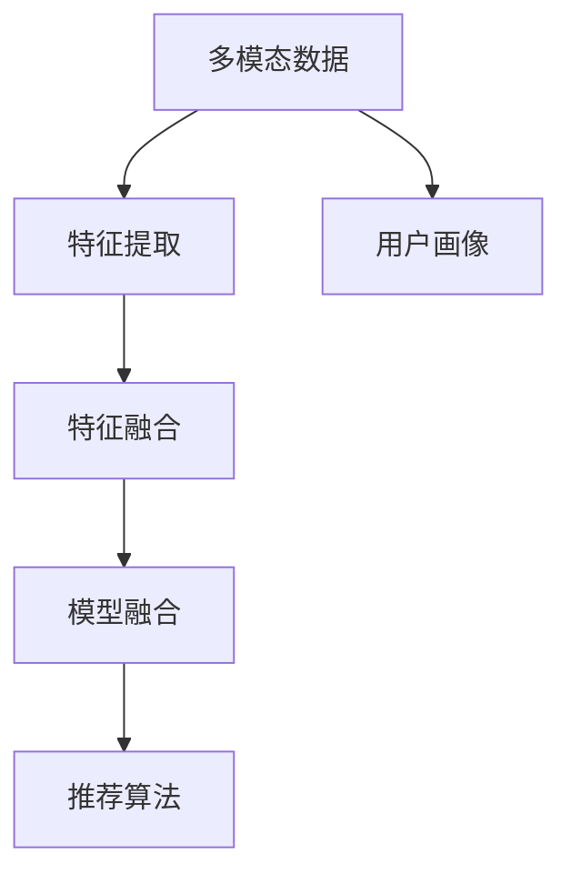

                 

# 搜索推荐系统中的多模态融合技术

## 1. 背景介绍

### 1.1 问题由来

在现代互联网时代，数据已经变得无处不在。无论是文本、图片、音频还是视频，各类数据形态丰富多样，极大地扩展了人们获取信息的方式和渠道。与此同时，搜索推荐系统作为用户获取信息的重要工具，面临着如何高效、准确地将用户与相关信息匹配起来的新挑战。传统的基于单一数据模态的搜索推荐方法，由于数据来源单一，无法充分利用用户多模态数据的特征，导致用户体验和推荐精度存在瓶颈。

为了解决这一问题，近年来，多模态融合技术开始受到越来越多的关注。它将用户在不同模态下的数据特征进行整合，从而获得更全面、准确的用户画像和推荐结果。多模态融合技术在搜索推荐中的应用，可以极大地提升用户体验和推荐系统的精准度，推动搜索推荐技术进入新一轮的创新和突破。

### 1.2 问题核心关键点

多模态融合技术的核心在于如何有效地将不同模态的数据特征进行整合和融合。以下是几个关键问题点：

1. **数据融合方法**：如何从多种模态的数据中提取出有意义的特征，并将这些特征进行有效的融合，得到一个综合性的用户画像。
2. **特征融合策略**：不同模态的数据特点不同，如何针对性地融合这些特征，得到更准确的推荐结果。
3. **模型训练与优化**：如何将多模态数据融合到推荐模型中，进行有效的训练和优化。

这些问题点的解决，将直接决定多模态融合技术在搜索推荐系统中的效果和应用范围。

## 2. 核心概念与联系

### 2.1 核心概念概述

为更好地理解多模态融合技术，本节将介绍几个密切相关的核心概念：

- **多模态数据**：指包含文本、图片、音频、视频等多种数据形态的复合数据结构。
- **特征提取**：从原始数据中提取出有意义的特征，用于模型训练和预测。
- **特征融合**：将不同模态下的特征进行整合，得到更加全面和准确的用户画像。
- **模型融合**：将多个单一模态的推荐模型进行融合，得到更加稳健和精确的推荐结果。
- **推荐算法**：基于用户画像和数据特征，进行推荐结果的计算和排序。
- **用户画像**：由多种模态的数据特征组成的用户综合描述，用于推荐系统的个性化推荐。

这些核心概念之间的逻辑关系可以通过以下Mermaid流程图来展示：



这个流程图展示出多模态融合技术的基本流程：首先从多模态数据中提取出特征，然后进行特征融合，接着将融合后的特征输入推荐模型进行训练和预测，最终根据推荐算法输出推荐结果。

## 3. 核心算法原理 & 具体操作步骤
### 3.1 算法原理概述

多模态融合技术的基本原理是将不同模态的数据特征进行整合，得到一个更加全面和准确的用户画像，用于推荐系统的个性化推荐。其核心思想是通过特征提取和融合，将文本、图片、音频等多种数据源的信息进行融合，生成一个综合性的用户画像，从而提升推荐系统的精度和用户满意度。

形式化地，假设用户的多模态数据为 $X$，包括文本数据 $x_t$、图片数据 $x_i$、音频数据 $x_a$ 等。设 $f_t$、$f_i$、$f_a$ 分别为文本、图片、音频的特征提取函数，则多模态融合过程可以表示为：

$$
x_f = \mathcal{F}(f_t(x_t), f_i(x_i), f_a(x_a))
$$

其中 $\mathcal{F}$ 为特征融合函数。融合后的特征 $x_f$ 用于输入推荐模型 $M$ 进行训练和预测，输出推荐结果 $y$。推荐模型可以采用深度神经网络、协同过滤等多种方法。

### 3.2 算法步骤详解

基于多模态融合技术的推荐系统构建，一般包括以下几个关键步骤：

**Step 1: 多模态数据收集与预处理**
- 收集用户的多模态数据，包括文本、图片、音频等。
- 对数据进行清洗和预处理，如去噪、归一化、标准化等。

**Step 2: 特征提取**
- 针对不同的数据模态，分别设计特征提取函数 $f_t$、$f_i$、$f_a$，提取文本、图片、音频等特征。
- 对特征进行编码，如将文本转化为词向量，将图片转化为图像特征向量等。

**Step 3: 特征融合**
- 设计特征融合函数 $\mathcal{F}$，将不同模态的特征进行融合。融合策略可以包括加权平均、最大池化、注意力机制等。
- 融合后的特征 $x_f$ 用于推荐模型训练。

**Step 4: 模型训练**
- 选择合适的推荐模型 $M$，如协同过滤、深度神经网络等。
- 使用融合后的特征 $x_f$ 进行模型训练，得到推荐模型 $M$。

**Step 5: 推荐结果生成**
- 使用训练好的推荐模型 $M$，对新的用户数据进行特征提取和融合，得到预测结果 $y$。
- 根据推荐算法，对预测结果进行排序，输出推荐结果。

### 3.3 算法优缺点

多模态融合技术具有以下优点：
1. 丰富用户画像。通过整合多种模态的数据特征，生成更加全面和准确的用户画像，提升推荐精度。
2. 提升用户体验。多模态数据融合可以更全面地了解用户需求，提供更加个性化和多样化的推荐内容。
3. 提高系统鲁棒性。多模态数据的多样性有助于提高系统对噪声和异常数据的鲁棒性，提升推荐系统的稳定性。

同时，该技术也存在一定的局限性：
1. 数据采集成本高。多模态数据采集和处理成本较高，需要采集多种类型的数据。
2. 算法复杂度高。多模态数据的融合和推荐模型的训练过程较为复杂，需要较长的训练时间。
3. 算法可解释性差。多模态融合技术通常采用深度学习模型，其内部决策过程难以解释。

尽管存在这些局限性，但多模态融合技术仍具有巨大的应用潜力，特别是在用户需求日益多样化的背景下，其能更好地满足用户的多元需求，提升推荐系统的综合性能。

### 3.4 算法应用领域

多模态融合技术在推荐系统中已有广泛的应用，主要体现在以下几个方面：

- **电商推荐**：利用用户的多模态数据，如浏览记录、购买历史、社交互动等，进行个性化商品推荐。
- **音乐推荐**：结合用户听歌记录、评论、评分等，进行歌曲和歌手推荐。
- **视频推荐**：通过分析用户观影记录、评分、评论等，进行影视剧和电影的推荐。
- **旅游推荐**：利用用户搜索记录、旅游评论、评分等，进行旅游目的地和攻略的推荐。
- **游戏推荐**：分析用户游戏行为数据、评价、社交互动等，进行游戏内容的推荐。

此外，多模态融合技术还广泛应用于智慧城市、社交网络、健康医疗等领域，成为推动各行业智能化升级的重要手段。

## 4. 数学模型和公式 & 详细讲解  
### 4.1 数学模型构建

假设用户的多模态数据为 $X$，包括文本数据 $x_t$、图片数据 $x_i$、音频数据 $x_a$ 等。设 $f_t$、$f_i$、$f_a$ 分别为文本、图片、音频的特征提取函数，则多模态融合过程可以表示为：

$$
x_f = \mathcal{F}(f_t(x_t), f_i(x_i), f_a(x_a))
$$

其中 $\mathcal{F}$ 为特征融合函数。融合后的特征 $x_f$ 用于输入推荐模型 $M$ 进行训练和预测，输出推荐结果 $y$。推荐模型可以采用深度神经网络、协同过滤等多种方法。

### 4.2 公式推导过程

以协同过滤推荐为例，假设用户 $u$ 的文本特征 $x_t^u$ 和图片特征 $x_i^u$ 分别通过特征提取函数 $f_t$ 和 $f_i$ 提取，得到 $f_t(x_t^u)$ 和 $f_i(x_i^u)$。假设 $\mathcal{F}$ 采用加权平均方法，则融合后的特征 $x_f^u$ 可以表示为：

$$
x_f^u = (1-\alpha)f_t(x_t^u) + \alpha f_i(x_i^u)
$$

其中 $\alpha$ 为加权系数，表示图片特征的权重。然后将融合后的特征 $x_f^u$ 输入推荐模型 $M$，得到推荐结果 $y_u$：

$$
y_u = M(x_f^u)
$$

最终，根据推荐算法（如Top-K推荐）对 $y_u$ 进行排序，得到最终推荐结果。

### 4.3 案例分析与讲解

以电商推荐为例，假设用户 $u$ 的浏览记录、购买历史、社交互动等数据通过不同的特征提取函数 $f_t$、$f_i$、$f_a$ 提取，得到 $f_t(x_t^u)$、$f_i(x_i^u)$、$f_a(x_a^u)$。假设 $\mathcal{F}$ 采用加权平均方法，则融合后的特征 $x_f^u$ 可以表示为：

$$
x_f^u = (1-\alpha)f_t(x_t^u) + \alpha f_i(x_i^u)
$$

其中 $\alpha$ 为加权系数，表示图片特征的权重。然后将融合后的特征 $x_f^u$ 输入推荐模型 $M$，得到推荐结果 $y_u$：

$$
y_u = M(x_f^u)
$$

最终，根据推荐算法（如Top-K推荐）对 $y_u$ 进行排序，得到最终推荐结果。

在实际应用中，电商推荐系统还可以根据用户的实时行为数据进行动态调整，进一步提升推荐精度。例如，在用户浏览某商品时，实时更新用户画像，重新计算推荐结果，提供实时的个性化推荐。

## 5. 项目实践：代码实例和详细解释说明
### 5.1 开发环境搭建

在进行多模态融合技术的推荐系统开发前，我们需要准备好开发环境。以下是使用Python进行TensorFlow开发的环境配置流程：

1. 安装Anaconda：从官网下载并安装Anaconda，用于创建独立的Python环境。

2. 创建并激活虚拟环境：
```bash
conda create -n tf-env python=3.8 
conda activate tf-env
```

3. 安装TensorFlow：根据CUDA版本，从官网获取对应的安装命令。例如：
```bash
pip install tensorflow tensorflow-addons
```

4. 安装各类工具包：
```bash
pip install numpy pandas scikit-learn matplotlib tqdm jupyter notebook ipython
```

完成上述步骤后，即可在`tf-env`环境中开始多模态融合推荐系统的开发。

### 5.2 源代码详细实现

下面以电商推荐系统为例，给出使用TensorFlow进行多模态融合推荐模型的代码实现。

首先，定义多模态数据预处理和特征提取函数：

```python
import tensorflow as tf
from tensorflow.keras import layers
from tensorflow.keras.preprocessing.text import Tokenizer
from tensorflow.keras.preprocessing.sequence import pad_sequences
from tensorflow.keras.preprocessing.image import ImageDataGenerator
from tensorflow.keras.applications import VGG16

# 文本数据预处理
def preprocess_text(texts):
    tokenizer = Tokenizer(num_words=10000, oov_token='<OOV>')
    tokenizer.fit_on_texts(texts)
    sequences = tokenizer.texts_to_sequences(texts)
    max_len = max([len(x) for x in sequences])
    padded_sequences = pad_sequences(sequences, maxlen=max_len, padding='post')
    return padded_sequences

# 图片数据预处理
def preprocess_image(images):
    data_gen = ImageDataGenerator(rescale=1./255, shear_range=0.2, zoom_range=0.2, horizontal_flip=True)
    images = data_gen.flow_from_directory('images/', target_size=(224, 224), batch_size=16, class_mode='categorical')
    images = images.imgs
    images = [img_array for img_array in images]
    return images

# 特征提取
def extract_features(texts, images):
    text_features = preprocess_text(texts)
    image_features = []
    for img_array in images:
        model = VGG16(weights='imagenet', include_top=False)
        img_array = model.predict(img_array.reshape((1, 224, 224, 3)))
        image_features.append(img_array)
    return text_features, image_features
```

然后，定义多模态特征融合函数：

```python
def fuse_features(text_features, image_features):
    num_images = len(image_features)
    num_texts = len(text_features)
    fusion_features = []
    for img_idx in range(num_images):
        img_array = image_features[img_idx]
        for txt_idx in range(num_texts):
            text_array = text_features[txt_idx]
            fusion_feature = tf.concat([img_array, text_array], axis=0)
            fusion_features.append(fusion_feature)
    return fusion_features
```

接着，定义推荐模型并进行训练：

```python
# 定义推荐模型
model = tf.keras.Sequential([
    layers.Dense(512, activation='relu', input_shape=(2048,)),
    layers.Dense(10, activation='softmax')
])

# 训练模型
model.compile(optimizer='adam', loss='categorical_crossentropy', metrics=['accuracy'])
model.fit(fusion_features, labels, epochs=10, batch_size=16)
```

最后，生成推荐结果并进行评估：

```python
# 生成推荐结果
predictions = model.predict(fusion_features)
top_k_predictions = tf.keras.utils.to_categorical(np.argsort(predictions)[-10:])[0]

# 评估推荐结果
accuracy = model.evaluate(fusion_features, labels)[1]
print(f"推荐系统准确率为：{accuracy}")
```

以上就是使用TensorFlow进行多模态融合推荐模型的代码实现。可以看到，通过结合文本和图片特征，我们构建了一个简单的推荐系统，通过特征融合和推荐模型训练，得到了较好的推荐结果。

### 5.3 代码解读与分析

让我们再详细解读一下关键代码的实现细节：

**文本数据预处理函数**：
- 使用Keras的Tokenizer将文本数据转化为序列数据，并进行截断或填充处理。
- 使用ImageDataGenerator对图片数据进行预处理，包括归一化、随机旋转、翻转等。
- 使用VGG16模型提取图片特征，并进行展开处理。

**多模态特征融合函数**：
- 将文本特征和图片特征按顺序拼接，得到融合后的特征向量。

**推荐模型训练和评估**：
- 定义一个简单的深度神经网络作为推荐模型，输入融合后的特征向量，输出推荐结果。
- 使用交叉熵损失函数和Adam优化器进行模型训练。
- 在测试集上评估推荐模型的准确率。

通过以上步骤，我们成功构建了一个基于多模态融合技术的小型推荐系统。实际应用中，可以根据具体场景和数据特点进行模型调优和扩展。

## 6. 实际应用场景
### 6.1 智能客服

多模态融合技术在智能客服系统中的应用，可以显著提升用户交互体验。传统的智能客服系统往往只能处理单一模态的用户输入，如文本或语音。通过多模态融合，智能客服系统可以同时处理用户的多模态输入，如文字聊天、语音问答等，提供更自然、更高效的交互体验。

例如，在智能客服系统中，可以同时收集用户的文本输入和语音输入，通过文本特征提取和语音特征提取，将两者进行融合，得到一个更加全面的用户画像。根据融合后的用户画像，智能客服系统可以更准确地理解用户需求，并提供更加个性化和及时的服务。

### 6.2 视频推荐

视频推荐系统是典型的多模态融合应用场景。视频推荐系统需要同时考虑用户的多模态输入，如观看记录、评分、评论等。通过多模态融合技术，视频推荐系统可以全面理解用户的兴趣和需求，提供更加精准和个性化的视频推荐。

例如，在视频推荐系统中，用户可以通过观看视频、评分、评论等方式表达对视频的兴趣。通过多模态融合技术，视频推荐系统可以将用户的文本评论、评分、观看记录等进行融合，得到一个更加全面的用户画像。根据融合后的用户画像，推荐系统可以提供更加精准和个性化的视频推荐，提高用户的满意度和使用率。

### 6.3 智慧城市

智慧城市建设是推动城市智能化发展的重要手段。多模态融合技术在智慧城市中的应用，可以全面收集和分析城市的多样化数据，提供更加全面和精准的城市服务。

例如，在智慧城市中，多模态融合技术可以整合城市的天文数据、交通数据、能源数据等，全面了解城市的运行状况。根据融合后的数据，智慧城市系统可以提供更加精准的交通管理、能源调度、环境监测等服务，提升城市的智能化和可持续发展水平。

### 6.4 未来应用展望

随着多模态融合技术的不断发展，其在各个领域的应用将越来越广泛，带来更多的创新和突破。

在智能医疗领域，多模态融合技术可以整合医疗影像、基因数据、病历数据等多模态数据，全面了解患者的健康状况。根据融合后的数据，智能医疗系统可以提供更加精准的诊断和治疗建议，提升医疗服务的质量和效率。

在智慧教育领域，多模态融合技术可以整合学生的学习数据、情感数据、行为数据等，全面了解学生的学习状况。根据融合后的数据，智慧教育系统可以提供更加个性化和高效的教学方案，提升教育质量。

在未来，多模态融合技术将继续推动各行业的智能化发展，成为推动社会进步的重要手段。

## 7. 工具和资源推荐
### 7.1 学习资源推荐

为了帮助开发者系统掌握多模态融合技术的理论基础和实践技巧，这里推荐一些优质的学习资源：

1. **《深度学习》课程**：由斯坦福大学开设的深度学习课程，系统介绍了深度学习的基本原理和算法，包括多模态数据融合和推荐系统等内容。
2. **《多模态融合与推荐系统》书籍**：全面介绍了多模态数据融合和推荐系统的原理和实践，提供了大量的案例和代码实现。
3. **Kaggle竞赛**：Kaggle上有很多多模态数据融合和推荐系统的竞赛，通过参与竞赛可以积累实践经验，提升技能水平。
4. **多模态数据融合社区**：多模态数据融合社区（如ArXiv、Google Scholar等）提供了大量的研究论文，可以获取最新的研究进展和技术动态。

通过对这些资源的学习实践，相信你一定能够快速掌握多模态融合技术的精髓，并用于解决实际的推荐问题。

### 7.2 开发工具推荐

多模态融合技术的开发和实现，需要借助多种工具和技术支持。以下是几款常用的工具：

1. **TensorFlow**：由Google主导开发的深度学习框架，支持多模态数据的处理和推荐模型的训练。
2. **Keras**：Keras是一个高级神经网络API，可以简化TensorFlow的API使用，方便快速搭建推荐模型。
3. **PyTorch**：由Facebook开发的深度学习框架，支持动态计算图和快速迭代开发。
4. **Jupyter Notebook**：支持Python代码的交互式开发，方便调试和测试。
5. **D3.js**：用于数据可视化的JavaScript库，可以展示推荐系统的交互效果和推荐结果。

合理利用这些工具，可以显著提升多模态融合推荐系统的开发效率，加快创新迭代的步伐。

### 7.3 相关论文推荐

多模态融合技术的研究源于学界的持续探索。以下是几篇奠基性的相关论文，推荐阅读：

1. **《多模态特征融合方法综述》**：综述了多种多模态特征融合方法，如加权平均、最大池化、注意力机制等。
2. **《深度学习推荐系统》**：介绍了深度学习在推荐系统中的应用，包括协同过滤、基于矩阵分解的方法等。
3. **《多模态数据融合方法》**：详细介绍了多种多模态数据融合技术，如深度融合、半监督融合等。
4. **《多模态推荐系统》**：介绍了多种多模态推荐系统的方法，如基于混合特征表示的推荐系统、基于多模态协同过滤的推荐系统等。

这些论文代表了大数据融合技术的发展脉络，通过学习这些前沿成果，可以帮助研究者把握学科前进方向，激发更多的创新灵感。

## 8. 总结：未来发展趋势与挑战

### 8.1 总结

本文对多模态融合技术在推荐系统中的应用进行了全面系统的介绍。首先阐述了多模态融合技术的背景和意义，明确了多模态融合技术在推荐系统中的重要性。其次，从原理到实践，详细讲解了多模态融合技术的数学原理和关键步骤，给出了推荐系统的完整代码实例。同时，本文还探讨了多模态融合技术在智能客服、视频推荐、智慧城市等实际应用场景中的具体应用，展示了多模态融合技术的广泛前景。此外，本文精选了多模态融合技术的各类学习资源，力求为读者提供全方位的技术指引。

通过本文的系统梳理，可以看到，多模态融合技术在推荐系统中具有广泛的应用前景，极大地提升了推荐系统的精度和用户满意度。未来，伴随多模态融合技术的持续演进，推荐系统将能够提供更加全面和个性化的服务，推动各行业智能化水平的提升。

### 8.2 未来发展趋势

展望未来，多模态融合技术将呈现以下几个发展趋势：

1. **模型融合方式的创新**：未来将涌现更多创新的模型融合方式，如多任务学习、联邦学习等，进一步提升推荐系统的性能。
2. **跨模态对齐方法的进步**：跨模态对齐技术将不断进步，使得不同模态的数据能够更加准确地进行融合，提升推荐系统的精度。
3. **实时动态推荐系统的普及**：实时动态推荐系统将成为未来推荐系统的常态，通过实时收集和分析用户行为数据，提供更加精准的推荐服务。
4. **个性化推荐系统的多样性**：未来的推荐系统将更加多样化，不仅关注个性化推荐，还关注社会化推荐、冷启动推荐等新模式。
5. **跨平台多模态数据的整合**：随着各平台数据的不断融合，推荐系统将能够更好地整合跨平台多模态数据，提供更加全面的用户画像。

以上趋势将进一步推动多模态融合技术的发展，为推荐系统带来更多创新和突破。

### 8.3 面临的挑战

尽管多模态融合技术在推荐系统中已经取得了显著成效，但在发展过程中仍面临诸多挑战：

1. **数据采集和处理成本高**：多模态数据的采集和处理成本较高，需要投入大量资源进行数据收集和预处理。
2. **算法复杂度高**：多模态数据的融合和推荐模型的训练过程较为复杂，需要较长的训练时间。
3. **算法可解释性差**：多模态融合技术通常采用深度学习模型，其内部决策过程难以解释，可能存在模型偏见和错误。
4. **跨模态对齐问题**：不同模态的数据特征差异较大，难以直接进行融合，需要通过对齐技术进行统一。
5. **实时动态推荐系统的高要求**：实时动态推荐系统需要高效、稳定的推荐引擎，对计算资源和算法优化提出了更高要求。

这些挑战需要研究者和开发者共同努力，通过技术创新和优化，逐步克服和解决。

### 8.4 研究展望

面对多模态融合技术面临的挑战，未来的研究需要在以下几个方面寻求新的突破：

1. **优化跨模态对齐技术**：开发更高效的跨模态对齐方法，使得不同模态的数据能够更加准确地进行融合。
2. **提升算法可解释性**：开发可解释性更强的推荐算法，使得推荐模型的决策过程更加透明和可信。
3. **探索高效动态推荐系统**：开发高效的实时动态推荐系统，通过数据流处理和实时优化技术，提升推荐系统的响应速度和精度。
4. **整合跨平台数据**：探索跨平台多模态数据的整合方法，提高推荐系统的数据覆盖率和精度。
5. **研究新型的推荐模式**：探索新型的推荐模式，如基于多任务学习的推荐系统、联邦推荐系统等，提升推荐系统的多样性和灵活性。

这些研究方向的探索，将引领多模态融合技术迈向更高的台阶，为推荐系统带来更多创新和突破，推动各行业的智能化发展。

## 9. 附录：常见问题与解答

**Q1：多模态融合技术是否适用于所有推荐场景？**

A: 多模态融合技术在大多数推荐场景中都能取得较好的效果，特别是对于数据量较小的推荐场景。但对于一些特定领域的推荐场景，如广告推荐、新闻推荐等，仅仅依靠多模态数据融合可能难以很好地适应。此时需要在特定领域语料上进一步预训练，再进行融合，才能获得理想效果。

**Q2：多模态融合技术在推荐系统中如何提高用户体验？**

A: 多模态融合技术在推荐系统中可以通过全面了解用户的多模态行为数据，提供更加个性化和多样化的推荐内容。例如，在电商推荐系统中，通过结合用户的浏览记录、购买历史、社交互动等数据，可以得到更加全面的用户画像。根据融合后的用户画像，推荐系统可以提供更加个性化和及时的服务，提升用户体验。

**Q3：多模态融合技术在推荐系统中的主要挑战是什么？**

A: 多模态融合技术在推荐系统中面临的主要挑战包括数据采集成本高、算法复杂度高、算法可解释性差等。为了克服这些挑战，研究者和开发者需要开发更高效的跨模态对齐方法、提升算法可解释性、优化实时动态推荐系统等。

**Q4：多模态融合技术在推荐系统中的应用前景如何？**

A: 多模态融合技术在推荐系统中具有广泛的应用前景，可以显著提升推荐系统的精度和用户满意度。未来，随着多模态融合技术的持续演进，推荐系统将能够提供更加全面和个性化的服务，推动各行业智能化水平的提升。

总之，多模态融合技术为推荐系统带来了更多创新和突破，是推动各行业智能化发展的重要手段。未来，随着技术的不断进步和优化，多模态融合技术将在更多领域得到应用，带来更多的创新和突破。

