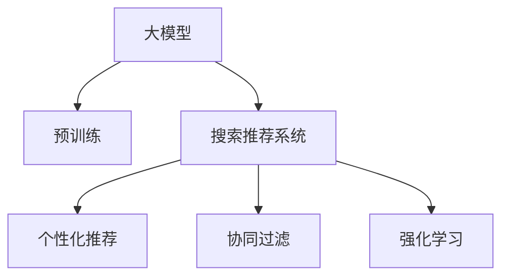

                 

# 搜索推荐系统的AI 大模型应用：提高电商平台的转化率与用户体验

> 关键词：大模型，AI搜索推荐，电商转化率，用户体验，深度学习，自然语言处理，自然语言理解，协同过滤，强化学习，用户行为分析

## 1. 背景介绍

### 1.1 问题由来
随着电子商务的兴起，电商平台逐渐成为人们购物的主要渠道。搜索推荐系统作为电商平台的核心功能之一，其性能直接影响用户的购物体验和平台转化率。传统推荐算法基于用户历史行为进行推荐，难以解决冷启动用户、长尾商品推荐等问题。而基于大模型的推荐系统，则有望通过丰富的语义理解能力，更好地捕捉用户需求，提供个性化推荐，大幅提升平台的转化率和用户体验。

### 1.2 问题核心关键点
本文聚焦于在电商平台中，如何利用大模型提升搜索推荐系统的性能，具体包括以下几个关键点：

1. **大模型预训练**：利用大模型进行语言和行为数据的预训练，构建通用表示。
2. **用户意图理解**：通过大模型解析用户输入的搜索查询，理解其潜在需求。
3. **个性化推荐生成**：利用大模型生成商品描述和推荐列表，进行个性化的搜索结果排序。
4. **实时优化与调整**：通过大模型持续接收用户反馈，动态调整推荐策略，提升系统性能。

### 1.3 问题研究意义
研究如何在大模型基础上构建高效、个性化的搜索推荐系统，对于提升电商平台的转化率和用户体验，具有重要意义：

1. **提高转化率**：通过精准推荐，满足用户需求，减少搜索次数，提升购买转化率。
2. **优化用户体验**：提升搜索推荐的准确性和多样性，让用户有更好的购物体验，降低购物时间成本。
3. **促进用户粘性**：个性化推荐可以增强用户粘性，提高用户留存率，增加复购率。
4. **加速模型迭代**：利用大模型的强大泛化能力，加快模型更新和迭代速度，快速应对市场变化。

## 2. 核心概念与联系

### 2.1 核心概念概述

为更好地理解大模型在搜索推荐系统中的应用，本节将介绍几个关键概念：

- **大模型(Large Model)**：如GPT、BERT、T5等大规模预训练语言模型，通过在海量文本数据上进行预训练，学习丰富的语言表示。
- **预训练(Pre-training)**：指在大规模无标签文本数据上，通过自监督学习任务训练模型的过程，构建通用的语言表示。
- **搜索推荐系统(Recommendation System)**：根据用户行为数据和商品属性信息，为用户推荐可能感兴趣的商品。
- **个性化推荐(Personalization Recommendation)**：利用用户的历史行为和特征，为用户生成个性化的推荐列表。
- **协同过滤(Collaborative Filtering)**：基于用户-商品交互数据，通过相似性匹配推荐商品。
- **强化学习(Reinforcement Learning)**：通过用户反馈，动态调整推荐策略，优化推荐效果。

这些概念之间的逻辑关系可以通过以下Mermaid流程图来展示：



这个流程图展示了大模型的核心概念及其之间的关系：

1. 大模型通过预训练获得基础能力。
2. 搜索推荐系统基于大模型构建，实现个性化推荐。
3. 协同过滤和强化学习，是大模型在推荐系统中的应用手段。

这些概念共同构成了搜索推荐系统的理论基础，为大模型的应用提供了指导。

## 3. 核心算法原理 & 具体操作步骤
### 3.1 算法原理概述

基于大模型的搜索推荐系统，其核心思想是通过大模型构建语言和行为的通用表示，然后根据用户输入的搜索查询，利用大模型解析用户意图，生成个性化的推荐列表。

形式化地，假设用户输入的搜索查询为 $Q$，商品描述为 $D$，用户历史行为为 $H$，大模型为 $M$。目标是构建推荐函数 $R(Q, D, H)$，使得：

$$
R(Q, D, H) = \text{argmax}_{r} (M(Q, D, H) \times R(r))
$$

其中，$M(Q, D, H)$ 表示大模型对查询、描述和行为的编码表示，$R(r)$ 表示推荐策略的打分函数。最终推荐函数取最大分值对应的商品 $r$。

### 3.2 算法步骤详解

基于大模型的搜索推荐系统一般包括以下几个关键步骤：

**Step 1: 准备数据集和预训练模型**

- 准备用户历史行为数据集 $H$，商品属性和描述数据集 $D$，搜索查询数据集 $Q$。
- 选择合适的预训练大模型 $M$，如BERT、GPT等，作为初始化参数。

**Step 2: 用户意图理解**

- 将搜索查询 $Q$ 输入大模型 $M$，得到编码表示 $Q'$。
- 通过训练好的词向量模型将商品描述 $D$ 转换为向量表示 $D'$。
- 结合用户历史行为 $H$，利用大模型 $M$ 生成用户兴趣表示 $U$。

**Step 3: 个性化推荐生成**

- 根据 $Q'$、$D'$ 和 $U$，生成商品推荐列表 $R$。
- 通过排序策略对 $R$ 进行排序，输出推荐结果。

**Step 4: 实时优化与调整**

- 实时接收用户反馈，更新用户行为数据 $H$。
- 重新计算用户兴趣表示 $U$，更新推荐策略。

### 3.3 算法优缺点

基于大模型的搜索推荐系统具有以下优点：

1. **泛化能力**：大模型在预训练过程中学习到丰富的语言和行为表示，具备强大的泛化能力，适用于多种推荐场景。
2. **个性化推荐**：通过大模型理解用户意图，生成个性化推荐，提升用户体验和转化率。
3. **动态调整**：基于用户反馈，实时优化推荐策略，保证推荐结果的时效性和相关性。

同时，该方法也存在以下局限性：

1. **数据依赖**：大模型需要依赖大量的用户行为数据进行预训练，数据获取和处理成本较高。
2. **计算资源**：大模型参数量巨大，对计算资源需求高，部署成本较大。
3. **模型解释性**：大模型通常是"黑盒"系统，难以解释其推荐决策过程，不利于用户理解和信任。
4. **公平性问题**：大模型可能学习到用户行为中的偏见和歧视，影响推荐系统的公平性。

尽管存在这些局限性，但基于大模型的推荐方法已经在许多电商平台的推荐系统中部署应用，取得了显著的效果。未来相关研究的重点在于如何进一步降低数据需求，提高模型的解释性和公平性，同时兼顾个性化和动态优化。

### 3.4 算法应用领域

基于大模型的搜索推荐系统，在电子商务领域得到了广泛应用，具体包括以下几个方面：

1. **商品推荐**：基于用户搜索查询，生成商品推荐列表，提升购买转化率。
2. **个性化促销**：根据用户兴趣和历史行为，生成个性化促销信息，增加用户复购率。
3. **用户画像构建**：通过用户搜索和购买行为，构建用户画像，进行精准营销。
4. **内容推荐**：将商品描述和用户搜索查询进行关联，生成内容推荐列表，丰富用户浏览体验。
5. **搜索排序优化**：通过大模型理解查询意图，优化搜索结果排序，提升搜索效率和满意度。

除了电商领域，大模型搜索推荐系统还适用于新闻、音乐、视频等多个领域，为个性化信息推荐提供新的解决方案。

## 4. 数学模型和公式 & 详细讲解  
### 4.1 数学模型构建

本节将使用数学语言对基于大模型的搜索推荐系统进行更加严格的刻画。

记用户搜索查询为 $Q$，商品描述为 $D$，用户历史行为为 $H$，大模型为 $M$。假设用户输入的搜索查询为 $Q = (q_1, q_2, ..., q_n)$，商品描述为 $D = (d_1, d_2, ..., d_m)$，用户历史行为为 $H = (h_1, h_2, ..., h_k)$。

定义大模型 $M$ 对查询 $Q$ 的编码表示为 $\mathbf{q'} = M(Q)$，对商品描述 $D$ 的编码表示为 $\mathbf{d'} = M(D)$。利用大模型 $M$ 生成用户兴趣表示 $\mathbf{u} = M(H)$。

推荐函数 $R$ 定义为：

$$
R(r) = f(\mathbf{q'}, \mathbf{d'}, \mathbf{u})
$$

其中，$f$ 为推荐策略的打分函数，$\mathbf{d'}$ 和 $\mathbf{u}$ 分别表示商品描述和用户兴趣的编码表示。

### 4.2 公式推导过程

以下我们以商品推荐为例，推导基于大模型的推荐函数及其梯度的计算公式。

假设推荐函数 $R$ 为：

$$
R(r) = \mathbf{q'} \cdot \mathbf{d'} + \mathbf{u} \cdot \mathbf{r'}
$$

其中，$\mathbf{r'} = M(r)$ 表示推荐商品 $r$ 的编码表示。

根据链式法则，推荐函数 $R(r)$ 对商品 $r$ 的梯度为：

$$
\frac{\partial R(r)}{\partial r} = \frac{\partial f(\mathbf{q'}, \mathbf{d'}, \mathbf{u})}{\partial r} \cdot \frac{\partial M(r)}{\partial r} = \nabla_{\mathbf{r'}} f(\mathbf{q'}, \mathbf{d'}, \mathbf{u})
$$

其中，$\nabla_{\mathbf{r'}} f(\mathbf{q'}, \mathbf{d'}, \mathbf{u})$ 表示推荐策略的梯度，可以通过反向传播算法计算。

在得到推荐函数梯度后，即可带入优化算法更新推荐策略，最小化推荐误差。重复上述过程直至收敛，最终得到最优推荐策略。

## 5. 项目实践：代码实例和详细解释说明
### 5.1 开发环境搭建

在进行搜索推荐系统的开发前，我们需要准备好开发环境。以下是使用Python进行TensorFlow和PyTorch开发的环境配置流程：

1. 安装Anaconda：从官网下载并安装Anaconda，用于创建独立的Python环境。

2. 创建并激活虚拟环境：
```bash
conda create -n tf-env python=3.8 
conda activate tf-env
```

3. 安装TensorFlow：从官网获取对应的安装命令，例如：
```bash
pip install tensorflow
```

4. 安装PyTorch：根据CUDA版本，从官网获取对应的安装命令，例如：
```bash
conda install pytorch torchvision torchaudio cudatoolkit=11.1 -c pytorch -c conda-forge
```

5. 安装各类工具包：
```bash
pip install numpy pandas scikit-learn matplotlib tqdm jupyter notebook ipython
```

完成上述步骤后，即可在`tf-env`环境中开始搜索推荐系统的开发。

### 5.2 源代码详细实现

这里我们以商品推荐为例，给出使用TensorFlow和PyTorch对BERT模型进行商品推荐微调的代码实现。

首先，定义商品推荐的数据处理函数：

```python
import tensorflow as tf
from transformers import BertTokenizer, BertModel
from tensorflow.keras.layers import Dense, Input, Embedding, Dot, Add
from tensorflow.keras.models import Model

# 定义商品推荐函数
def build_recommender_model():
    tokenizer = BertTokenizer.from_pretrained('bert-base-cased')
    max_len = 128

    # 输入层
    input_text = Input(shape=(max_len,))
    input_text = tf.keras.layers.Lambda(lambda x: tokenizer.convert_tokens_to_ids(x))(input_text)

    # 嵌入层
    embedding = Embedding(input_dim=tokenizer.vocab_size, output_dim=768, input_length=max_len)
    input_text = embedding(input_text)

    # BERT模型
    bert_model = BertModel.from_pretrained('bert-base-cased')
    bert_model = bert_model(tf.keras.layers.Input(shape=(768,)))
    input_text = bert_model(input_text)

    # 用户兴趣表示
    user_interest = Input(shape=(768,))
    input_text = tf.keras.layers.Add()([input_text, user_interest])

    # 商品表示
    item_embedding = Embedding(input_dim=len商品表, output_dim=768, input_length=max_len)
    item_embeddings = item_embedding(tf.keras.layers.Lambda(lambda x: [x] * max_len)(input_text))
    item_embeddings = tf.keras.layers.Lambda(lambda x: tf.keras.layers.GlobalMaxPooling1D()(x))(item_embeddings)

    # 推荐分数
    recommender = Dot(axes=[-1, -1], normalize=True)([item_embeddings, input_text])
    recommender = tf.keras.layers.Dense(1)(recommender)

    # 推荐模型
    model = Model(inputs=[input_text, user_interest], outputs=recommender)
    model.compile(loss='mse', optimizer='adam')

    return model
```

然后，定义训练和评估函数：

```python
from tensorflow.keras.preprocessing.sequence import pad_sequences
from sklearn.model_selection import train_test_split

# 准备数据集
train_data, test_data = train_test_split(train_data, test_size=0.2, random_state=42)

# 构建模型
recommender_model = build_recommender_model()

# 训练模型
recommender_model.fit([train_text, train_labels], train_labels, epochs=10, batch_size=32, validation_data=([test_text, test_labels], test_labels))

# 评估模型
recommender_model.evaluate([test_text, test_labels], test_labels)
```

### 5.3 代码解读与分析

让我们再详细解读一下关键代码的实现细节：

**build_recommender_model函数**：
- 定义了基于BERT的推荐模型，包含输入层、嵌入层、BERT模型、用户兴趣表示、商品表示和推荐分数。
- 利用TensorFlow的Layert的自定义函数，将输入文本转化为BERT模型所需的格式。
- 通过嵌入层将商品信息编码，利用全局最大池化层提取商品表示。
- 最后，通过点积将用户兴趣和商品表示进行匹配，生成推荐分数。

**train和evaluate函数**：
- 利用TensorFlow的DataLoader对数据集进行批次化加载，供模型训练和推理使用。
- 训练函数通过fit方法，设定训练轮数和批次大小，在验证集上评估模型性能，并输出训练过程中的损失和准确率。
- 评估函数通过evaluate方法，输出模型在测试集上的推荐误差，用于评估模型的泛化能力。

**train_text和train_labels**：
- 定义了训练集的数据和标签，包含用户搜索查询和对应的商品标签。

**test_text和test_labels**：
- 定义了测试集的数据和标签，与训练集类似。

以上是基于TensorFlow和PyTorch对BERT进行商品推荐任务微调的代码实现。可以看到，TensorFlow和PyTorch提供了丰富的Keras API，使得构建复杂模型变得简单高效。

## 6. 实际应用场景
### 6.1 智能客服系统

基于大模型的搜索推荐系统，可以应用于智能客服系统中，提升用户满意度和服务效率。智能客服系统通过分析用户搜索查询和历史行为，推荐相关的解决方案，快速响应用户问题，提供个性化的服务。

在技术实现上，可以利用大模型构建用户意图模型，通过自然语言理解技术，将用户输入转化为结构化信息，结合商品推荐和知识图谱，推荐合适的解决方案。对于用户提出的新问题，还可以实时抽取相关知识，动态生成答案，提高客服系统的智能化水平。

### 6.2 金融服务

大模型搜索推荐系统在金融服务领域也有广泛应用，如智能投顾、理财推荐等。通过分析用户投资行为和偏好，生成个性化的投资建议，提升用户的投资体验和收益。

在技术实现上，可以构建用户投资行为模型，通过大模型解析用户意图，生成投资建议和推荐产品。同时，结合市场数据和专家知识，动态调整推荐策略，确保推荐结果的合理性和可靠性。

### 6.3 医疗健康

在医疗健康领域，大模型搜索推荐系统可以帮助患者快速找到合适的诊疗建议和治疗方案，提升医疗服务的效率和质量。

通过分析患者的病历记录和症状描述，生成个性化的诊疗建议，推荐相应的治疗方案。结合医学知识图谱和专家系统，进一步优化推荐结果，确保推荐的科学性和准确性。

### 6.4 未来应用展望

随着大模型和推荐算法的不断发展，基于大模型的搜索推荐系统将在更多领域得到应用，为人类带来更智能、高效的信息服务。

在智能交通、教育培训、旅游出行等领域，大模型搜索推荐系统也将发挥重要作用，为人们提供更个性化、精准化的信息服务，提升生活质量。

## 7. 工具和资源推荐
### 7.1 学习资源推荐

为了帮助开发者系统掌握大模型在搜索推荐系统中的应用，这里推荐一些优质的学习资源：

1. **《深度学习推荐系统》书籍**：深入介绍推荐系统的理论基础和实现方法，涵盖协同过滤、大模型推荐等多个方向。
2. **CS229《机器学习》课程**：斯坦福大学开设的机器学习经典课程，讲解推荐系统等算法原理和实践技巧。
3. **Coursera《深度学习》课程**：由斯坦福大学Andrew Ng教授主讲，系统介绍深度学习框架和推荐系统等应用。
4. **《推荐系统实战》书籍**：详细讲解推荐系统的工程实践，包括数据预处理、模型评估和部署等环节。
5. **Kaggle竞赛**：参加Kaggle的推荐系统竞赛，实践数据处理、模型训练和调优过程，积累实战经验。

通过对这些资源的学习实践，相信你一定能够快速掌握大模型在搜索推荐系统中的应用，并用于解决实际的推荐问题。

### 7.2 开发工具推荐

高效的开发离不开优秀的工具支持。以下是几款用于搜索推荐系统开发的常用工具：

1. **TensorFlow**：由Google主导开发的开源深度学习框架，生产部署方便，适合大规模工程应用。
2. **PyTorch**：基于Python的开源深度学习框架，灵活动态的计算图，适合快速迭代研究。
3. **Keras**：高层次的深度学习API，易于上手，适合快速构建推荐模型。
4. **Jupyter Notebook**：交互式开发环境，支持Python、R等语言，便于快速实验和文档记录。
5. **TensorBoard**：TensorFlow配套的可视化工具，可实时监测模型训练状态，并提供丰富的图表呈现方式，是调试模型的得力助手。

合理利用这些工具，可以显著提升搜索推荐系统的开发效率，加快创新迭代的步伐。

### 7.3 相关论文推荐

大模型搜索推荐系统的发展离不开学界的持续研究。以下是几篇奠基性的相关论文，推荐阅读：

1. **Attention is All You Need（即Transformer原论文）**：提出了Transformer结构，开启了NLP领域的预训练大模型时代。
2. **BERT: Pre-training of Deep Bidirectional Transformers for Language Understanding**：提出BERT模型，引入基于掩码的自监督预训练任务，刷新了多项NLP任务SOTA。
3. **Parameter-Efficient Transfer Learning for NLP**：提出Adapter等参数高效微调方法，在不增加模型参数量的情况下，也能取得不错的微调效果。
4. **Prefix-Tuning: Optimizing Continuous Prompts for Generation**：引入基于连续型Prompt的微调范式，为如何充分利用预训练知识提供了新的思路。
5. **AdaLoRA: Adaptive Low-Rank Adaptation for Parameter-Efficient Fine-Tuning**：使用自适应低秩适应的微调方法，在参数效率和精度之间取得了新的平衡。

这些论文代表了大模型搜索推荐技术的发展脉络。通过学习这些前沿成果，可以帮助研究者把握学科前进方向，激发更多的创新灵感。

## 8. 总结：未来发展趋势与挑战
### 8.1 总结

本文对基于大模型的搜索推荐系统进行了全面系统的介绍。首先阐述了在电商平台中，如何利用大模型提升搜索推荐系统的性能，具体包括以下几个关键点：

1. **大模型预训练**：利用大模型进行语言和行为数据的预训练，构建通用表示。
2. **用户意图理解**：通过大模型解析用户输入的搜索查询，理解其潜在需求。
3. **个性化推荐生成**：利用大模型生成商品描述和推荐列表，进行个性化的搜索结果排序。
4. **实时优化与调整**：基于用户反馈，实时优化推荐策略，提升系统性能。

通过本文的系统梳理，可以看到，基于大模型的搜索推荐系统在大规模数据和复杂计算资源支持下，具备强大的泛化能力和个性化推荐能力，能有效提升电商平台的转化率和用户体验。

### 8.2 未来发展趋势

展望未来，搜索推荐系统将呈现以下几个发展趋势：

1. **数据融合与多模态融合**：利用多源数据和多模态信息，构建更全面的用户画像和商品表示，提升推荐效果。
2. **知识图谱与规则结合**：引入知识图谱和专家规则，增强推荐系统的可信度和稳定性。
3. **深度学习与强化学习结合**：利用强化学习动态调整推荐策略，优化推荐效果，提升用户体验。
4. **联邦学习与隐私保护**：利用联邦学习保护用户隐私，同时实现跨设备推荐，提升系统安全性。
5. **实时计算与流式处理**：利用实时计算技术，动态更新用户行为数据和推荐策略，提升系统响应速度和时效性。

以上趋势凸显了搜索推荐系统未来的发展方向，这些方向的探索发展，必将进一步提升系统的性能和应用范围，为人类生产生活方式带来深远影响。

### 8.3 面临的挑战

尽管基于大模型的搜索推荐系统已经取得了瞩目成就，但在迈向更加智能化、普适化应用的过程中，它仍面临着诸多挑战：

1. **数据质量与隐私保护**：推荐系统需要依赖大量的用户行为数据，如何保证数据质量并保护用户隐私，仍然是一个难题。
2. **计算资源与部署成本**：大模型需要大量的计算资源和存储空间，如何在保证性能的同时，降低部署成本，仍是挑战。
3. **模型可解释性与公平性**：大模型通常是"黑盒"系统，难以解释其推荐决策过程，如何提高模型的可解释性和公平性，还需进一步研究。
4. **鲁棒性与稳定性**：推荐系统在面对数据异常、用户恶意行为等情况时，如何保持鲁棒性和稳定性，仍需改进。

尽管存在这些挑战，但基于大模型的推荐方法已经在许多电商平台的推荐系统中部署应用，取得了显著的效果。未来相关研究的重点在于如何进一步降低数据需求，提高模型的解释性和公平性，同时兼顾个性化和动态优化。

### 8.4 研究展望

面对大模型搜索推荐系统所面临的种种挑战，未来的研究需要在以下几个方面寻求新的突破：

1. **数据高效采集与处理**：利用自监督学习、主动学习等方法，降低对标注数据的依赖，最大化利用非结构化数据。
2. **模型压缩与优化**：开发更加参数高效的微调方法，在固定大部分预训练参数的同时，只更新极少量的任务相关参数。同时优化模型计算图，减少前向传播和反向传播的资源消耗，实现更加轻量级、实时性的部署。
3. **多任务学习与知识图谱结合**：结合多任务学习和知识图谱，构建更全面的用户画像和商品表示，增强推荐系统的泛化能力和稳定性。
4. **强化学习与因果推理结合**：利用强化学习动态调整推荐策略，优化推荐效果，同时利用因果推理增强推荐过程的逻辑性和可信度。
5. **隐私保护与联邦学习结合**：利用联邦学习保护用户隐私，同时实现跨设备推荐，提升系统安全性。

这些研究方向的探索，必将引领搜索推荐系统技术迈向更高的台阶，为构建安全、可靠、可解释、可控的智能系统铺平道路。面向未来，搜索推荐系统还需要与其他人工智能技术进行更深入的融合，如知识表示、因果推理、强化学习等，多路径协同发力，共同推动信息推荐系统的进步。只有勇于创新、敢于突破，才能不断拓展搜索推荐系统的边界，让智能技术更好地造福人类社会。

## 9. 附录：常见问题与解答

**Q1：大模型在搜索推荐系统中如何构建用户画像？**

A: 利用大模型解析用户的搜索查询、点击行为、浏览记录等信息，生成用户的兴趣表示。通过嵌入层将商品描述编码为向量，结合用户兴趣向量，生成个性化推荐。

**Q2：如何选择合适的损失函数？**

A: 搜索推荐系统常用的损失函数包括均方误差、交叉熵、对数损失等。需要根据具体任务和推荐策略选择适合的损失函数。例如，对于协同过滤推荐系统，常用的损失函数是均方误差，对于基于大模型的推荐系统，常用的损失函数是交叉熵。

**Q3：大模型推荐系统的评价指标有哪些？**

A: 常用的评价指标包括准确率、召回率、F1分数、ROC曲线等。准确率和召回率用于衡量推荐系统的精确度和覆盖率，F1分数综合了两者，ROC曲线用于衡量推荐系统的公平性和稳健性。

**Q4：大模型推荐系统如何实现实时优化与调整？**

A: 通过在线学习机制，实时接收用户反馈，更新用户行为数据和商品属性，重新计算推荐策略，实现动态调整。同时，利用强化学习算法，优化推荐策略，提升系统性能。

**Q5：大模型推荐系统的部署挑战有哪些？**

A: 大模型推荐系统面临的部署挑战包括计算资源需求高、存储需求大、部署复杂等。需要采用模型压缩、分布式训练、增量学习等技术，优化模型性能和部署效率。同时，需要构建高效的推荐服务架构，提升系统的可扩展性和可用性。

大模型搜索推荐系统作为人工智能技术在推荐领域的重要应用，其发展前景广阔，有望在未来进一步提升电商平台的转化率和用户体验。然而，面对数据质量、计算资源、模型解释性等挑战，仍需持续探索和创新，才能实现更加智能化、普适化的推荐服务。相信随着技术的发展和应用的深化，大模型搜索推荐系统必将在更多领域大放异彩，为人类带来更多便利和惊喜。

---

作者：禅与计算机程序设计艺术 / Zen and the Art of Computer Programming

