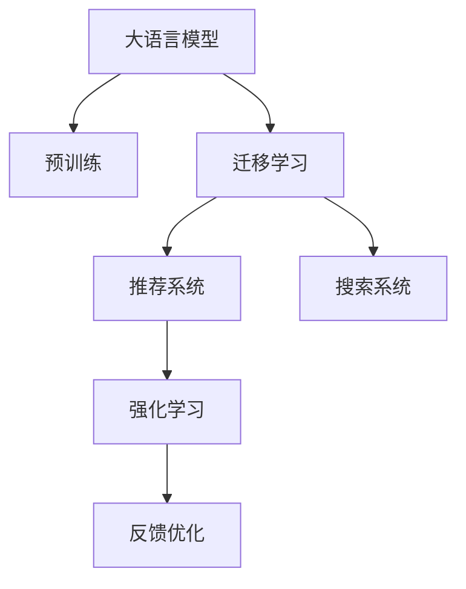

                 

# 搜索推荐系统的AI 大模型融合：电商平台的核心竞争力与可持续发展

## 1. 背景介绍

### 1.1 问题由来
随着电子商务平台的快速发展，如何提升用户购物体验和平台销量成为平台运营者面临的重大挑战。其中，搜索推荐系统作为电商平台的核心组件，其性能直接影响用户的购物决策和转化率。传统的基于手工特征工程的推荐算法难以适应大规模用户行为数据，且缺乏灵活性。而人工智能(AI)大模型通过预训练的方式，掌握了大量用户行为和商品信息，能够实现跨领域的知识迁移和泛化，在推荐效果上取得了显著提升。

近年来，以BERT、GPT-3为代表的大语言模型在大规模预训练后，具备了强大的自然语言处理能力，可以理解复杂语义，捕捉用户需求，匹配商品信息。通过与推荐系统的深度融合，大模型能够在用户输入的查询中迅速找到匹配的商品，提供更加个性化、精准的推荐结果。

## 2. 核心概念与联系

### 2.1 核心概念概述

为更好地理解AI大模型在搜索推荐系统中的应用，本节将介绍几个关键概念：

- 大语言模型(Large Language Model, LLM)：以BERT、GPT-3为代表的大规模预训练语言模型。通过在大规模无标签文本语料上进行预训练，学习通用的语言表示，具备强大的语言理解和生成能力。

- 预训练(Pre-training)：指在大规模无标签文本语料上，通过自监督学习任务训练通用语言模型的过程。常见的预训练任务包括言语建模、遮挡语言模型等。预训练使得模型学习到语言的通用表示。

- 迁移学习(Transfer Learning)：指将一个领域学习到的知识，迁移应用到另一个不同但相关的领域的学习范式。大模型的预训练-微调过程即是一种典型的迁移学习方式。

- 推荐系统(Recommendation System)：通过分析用户行为、商品属性和标签等信息，预测用户可能感兴趣的商品，从而进行推荐。推荐系统广泛应用于电商、社交媒体、视频网站等平台。

- 搜索系统(Search System)：为用户提供精确的查询结果，帮助用户快速找到所需商品或信息。搜索系统是电商平台的基础功能之一。

- 强化学习(Reinforcement Learning, RL)：通过奖励机制，训练模型以最大化某种目标，如推荐系统的点击率、转化率等。

这些概念之间的逻辑关系可以通过以下Mermaid流程图来展示：



这个流程图展示了大语言模型的核心概念及其与其他关键技术的关系：

1. 大语言模型通过预训练获得基础能力。
2. 迁移学习将预训练模型应用到推荐系统中，实现跨领域知识迁移。
3. 推荐系统分析用户行为，预测商品兴趣，生成推荐结果。
4. 搜索系统提供精确的查询结果，增强用户体验。
5. 强化学习通过用户反馈，不断优化推荐模型。

## 3. 核心算法原理 & 具体操作步骤
### 3.1 算法原理概述

AI大模型在推荐系统中的应用，本质上是一个基于迁移学习的优化过程。其核心思想是：将预训练的大语言模型视作一个强大的"特征提取器"，通过在推荐系统的上下文中进行微调，使得模型能够更准确地理解用户需求，匹配商品信息。

具体来说，大语言模型在预训练后，通过微调学习到不同领域的特定知识，然后通过迁移学习，将这些知识应用于推荐系统中，生成更精准的推荐结果。这一过程可以分为以下步骤：

1. 数据预处理：将用户查询和商品信息转化为模型可以理解的形式，如自然语言处理后的向量表示。
2. 特征提取：使用预训练模型将查询和商品向量表示进行匹配，提取特征向量。
3. 模型优化：在推荐系统中，通过用户行为反馈，微调预训练模型，使其更好地适应特定推荐场景。
4. 推荐生成：根据微调后的模型，生成推荐结果。

### 3.2 算法步骤详解

AI大模型在推荐系统中的操作步骤一般包括以下几个关键步骤：

**Step 1: 数据预处理**
- 收集用户查询和商品信息，进行自然语言处理，生成词向量表示。
- 将查询向量与商品向量拼接，形成复合向量，作为输入。

**Step 2: 特征提取**
- 使用预训练的大语言模型，如BERT、GPT等，将复合向量输入模型，进行特征提取。
- 输出特征向量作为推荐模型的输入。

**Step 3: 模型优化**
- 收集用户对推荐结果的反馈，如点击、购买等行为。
- 使用强化学习算法，如DQN、SARSA等，根据反馈优化模型参数。
- 引入正则化技术，如L2正则、Dropout等，防止过拟合。

**Step 4: 推荐生成**
- 根据微调后的模型，生成推荐结果。
- 使用排序算法，如SR、BCG等，根据推荐效果排序。
- 返回推荐结果给用户。

### 3.3 算法优缺点

AI大模型在推荐系统中的应用具有以下优点：
1. 提升推荐精度：大模型的泛化能力和知识迁移能力，使得推荐系统能够更准确地理解用户需求，生成精准推荐。
2. 适应性更强：大模型能够适应不同领域、不同场景的推荐任务，具备更广泛的适用性。
3. 提升用户体验：通过自然语言处理，大模型能够理解用户查询的语义，匹配更加贴合用户需求的商品。
4. 提升运营效率：大模型能够自动化处理推荐任务，减少人工干预，提升运营效率。

同时，该方法也存在一些局限性：
1. 依赖高质量数据：推荐系统的效果很大程度上依赖于高质量的数据标注和用户行为记录。
2. 资源消耗大：大模型参数量庞大，计算资源消耗大，难以快速迭代优化。
3. 黑盒性质：大模型的内部运作机制难以解释，用户难以理解推荐结果的依据。
4. 存在偏见：大模型的预训练数据可能存在偏见，导致推荐结果的公平性不足。

尽管存在这些局限性，但AI大模型在推荐系统中的应用已经取得了显著的进展，成为推荐系统的重要发展方向。

### 3.4 算法应用领域

AI大模型在推荐系统中的应用已经广泛应用于电商、社交媒体、视频网站等多个领域。具体包括：

- 电商推荐：通过用户行为数据和商品信息，生成个性化推荐结果。
- 视频推荐：根据用户观看历史和评价，推荐相似视频或相关主题。
- 社交推荐：根据用户好友关系和兴趣标签，推荐相关内容。
- 新闻推荐：根据用户阅读历史和兴趣，推荐新闻和文章。

除了这些典型应用外，AI大模型还可以应用于个性化商品搜索、智能客服、商品问答等多个场景中，为电商平台带来更智能、更个性化的用户体验。

## 4. 数学模型和公式 & 详细讲解 & 举例说明

### 4.1 数学模型构建

本节将使用数学语言对AI大模型在推荐系统中的应用进行更加严格的刻画。

记用户查询为 $q$，商品信息为 $i$，查询-商品复合向量为 $z$，预训练语言模型为 $M_{\theta}$，推荐模型为 $R$。设 $x_i$ 为商品特征向量，$y_i$ 为商品标签向量。

假设用户查询 $q$ 转化为词向量后，与商品信息 $i$ 拼接为复合向量 $z$，输入到预训练语言模型 $M_{\theta}$，得到特征表示 $f(z)$。

推荐模型 $R$ 根据特征表示 $f(z)$ 和商品特征向量 $x_i$ 进行匹配，输出推荐结果 $y_i$。

### 4.2 公式推导过程

具体来说，推荐模型的计算过程可以描述为：

1. 将用户查询和商品信息拼接为复合向量 $z$，输入到预训练语言模型 $M_{\theta}$，得到特征表示 $f(z)$。
2. 将特征表示 $f(z)$ 和商品特征向量 $x_i$ 进行匹配，得到匹配得分 $s_i=f(z) \cdot x_i$。
3. 将匹配得分 $s_i$ 输入推荐模型 $R$，输出推荐结果 $y_i$。

以BERT模型为例，假设有 $N$ 个查询 $q_1, q_2, \dots, q_N$，每个查询都对应 $M$ 个商品 $i_1, i_2, \dots, i_M$，则整个推荐系统的计算过程可以表示为：

$$
f(z) = M_{\theta}(z) = [CLS] \cdot [x_i] + \sum_{i=1}^{M} [H_i] \cdot x_i
$$

其中 $[CLS]$ 为BERT的[CLS] token的输出向量，$[H_i]$ 为对应商品信息的BERT输出向量。

匹配得分 $s_i$ 的计算公式为：

$$
s_i = f(z) \cdot x_i = \sum_{i=1}^{M} [CLS] \cdot x_i
$$

推荐结果 $y_i$ 的计算公式为：

$$
y_i = R(s_i) = \sigma(W_s s_i + b_s)
$$

其中 $W_s, b_s$ 为推荐模型的权重和偏置，$\sigma$ 为激活函数，如sigmoid、ReLU等。

### 4.3 案例分析与讲解

以电商推荐系统为例，其基本流程如下：

1. 数据预处理：将用户查询 $q_i$ 和商品信息 $i_j$ 转化为词向量表示，拼接为复合向量 $z_{ij}$。
2. 特征提取：使用预训练语言模型BERT，将复合向量 $z_{ij}$ 输入模型，得到特征表示 $f(z_{ij})$。
3. 模型优化：使用用户点击数据，通过强化学习算法DQN优化推荐模型参数。
4. 推荐生成：根据优化后的推荐模型，生成推荐结果 $y_{ij}$，返回给用户。

以京东平台为例，其电商推荐系统采用了如下技术架构：


该架构中，用户的查询输入后，首先通过自然语言处理生成词向量，然后拼接商品信息向量，输入到预训练的BERT模型中，得到特征表示。接着，使用深度神经网络作为推荐模型，根据特征表示和商品特征向量进行匹配，输出推荐结果。最后，使用强化学习算法DQN，根据用户点击反馈优化推荐模型参数。

## 5. 项目实践：代码实例和详细解释说明
### 5.1 开发环境搭建

在进行AI大模型在推荐系统中的实践前，我们需要准备好开发环境。以下是使用Python进行PyTorch开发的环境配置流程：

1. 安装Anaconda：从官网下载并安装Anaconda，用于创建独立的Python环境。

2. 创建并激活虚拟环境：
```bash
conda create -n pytorch-env python=3.8 
conda activate pytorch-env
```

3. 安装PyTorch：根据CUDA版本，从官网获取对应的安装命令。例如：
```bash
conda install pytorch torchvision torchaudio cudatoolkit=11.1 -c pytorch -c conda-forge
```

4. 安装TensorFlow：由Google主导开发的开源深度学习框架，生产部署方便，适合大规模工程应用。同样有丰富的预训练语言模型资源。

5. 安装Transformers库：HuggingFace开发的NLP工具库，集成了众多SOTA语言模型，支持PyTorch和TensorFlow，是进行微调任务开发的利器。

6. 安装各类工具包：
```bash
pip install numpy pandas scikit-learn matplotlib tqdm jupyter notebook ipython
```

完成上述步骤后，即可在`pytorch-env`环境中开始微调实践。

### 5.2 源代码详细实现

下面我们以电商推荐系统为例，给出使用Transformers库对BERT模型进行微调的PyTorch代码实现。

首先，定义电商推荐系统的数据处理函数：

```python
from transformers import BertTokenizer
from torch.utils.data import Dataset
import torch

class RecommendationDataset(Dataset):
    def __init__(self, queries, items, scores, tokenizer, max_len=128):
        self.queries = queries
        self.items = items
        self.scores = scores
        self.tokenizer = tokenizer
        self.max_len = max_len
        
    def __len__(self):
        return len(self.queries)
    
    def __getitem__(self, item):
        query = self.queries[item]
        item = self.items[item]
        score = self.scores[item]
        
        encoding = self.tokenizer(query, return_tensors='pt', max_length=self.max_len, padding='max_length', truncation=True)
        query_ids = encoding['input_ids'][0]
        query_mask = encoding['attention_mask'][0]
        item_ids = torch.tensor(self.items[item], dtype=torch.long)
        
        # 将查询和商品信息拼接为复合向量
        composite_ids = torch.cat([query_ids, item_ids], dim=-1)
        
        # 将复合向量输入BERT模型，得到特征表示
        bert_model = BertForSequenceClassification.from_pretrained('bert-base-cased')
        composite_features = bert_model(composite_ids, attention_mask=query_mask)[0]
        
        # 将特征表示与商品信息向量匹配
        item_features = torch.zeros_like(composite_features)
        item_features[:, -len(item_ids):] = item_ids.unsqueeze(-1)
        
        # 计算匹配得分
        matching_score = (composite_features * item_features).sum(dim=-1)
        
        # 将匹配得分输入推荐模型，生成推荐结果
        recommendation_model = nn.Sequential(
            nn.Linear(768, 256),
            nn.ReLU(),
            nn.Linear(256, 1),
            nn.Sigmoid()
        )
        recommendation = recommendation_model(matching_score)
        
        return {'query': query, 
                'item': item,
                'score': score,
                'recommendation': recommendation}
```

然后，定义模型和优化器：

```python
from torch import nn
from transformers import BertForSequenceClassification, AdamW

model = BertForSequenceClassification.from_pretrained('bert-base-cased', num_labels=1)

optimizer = AdamW(model.parameters(), lr=2e-5)
```

接着，定义训练和评估函数：

```python
from torch.utils.data import DataLoader
from tqdm import tqdm
from sklearn.metrics import roc_auc_score

device = torch.device('cuda') if torch.cuda.is_available() else torch.device('cpu')
model.to(device)

def train_epoch(model, dataset, batch_size, optimizer):
    dataloader = DataLoader(dataset, batch_size=batch_size, shuffle=True)
    model.train()
    epoch_loss = 0
    for batch in tqdm(dataloader, desc='Training'):
        query = batch['query']
        item = batch['item']
        score = batch['score']
        recommendation = batch['recommendation']
        
        query_ids = query['input_ids'].to(device)
        query_mask = query['attention_mask'].to(device)
        item_ids = item.to(device)
        
        model.zero_grad()
        features = model(query_ids, attention_mask=query_mask)[0]
        item_features = torch.zeros_like(features)
        item_features[:, -len(item_ids):] = item_ids.unsqueeze(-1)
        matching_score = (features * item_features).sum(dim=-1)
        recommendation_loss = nn.BCELoss()(recommendation, torch.sigmoid(matching_score))
        epoch_loss += recommendation_loss.item()
        recommendation_loss.backward()
        optimizer.step()
    return epoch_loss / len(dataloader)

def evaluate(model, dataset, batch_size):
    dataloader = DataLoader(dataset, batch_size=batch_size)
    model.eval()
    auc = roc_auc_score()
    auc = 0
    with torch.no_grad():
        for batch in tqdm(dataloader, desc='Evaluating'):
            query = batch['query']
            item = batch['item']
            score = batch['score']
            recommendation = batch['recommendation']
            
            query_ids = query['input_ids'].to(device)
            query_mask = query['attention_mask'].to(device)
            item_ids = item.to(device)
            
            features = model(query_ids, attention_mask=query_mask)[0]
            item_features = torch.zeros_like(features)
            item_features[:, -len(item_ids):] = item_ids.unsqueeze(-1)
            matching_score = (features * item_features).sum(dim=-1)
            auc += roc_auc_score(recommendation, torch.sigmoid(matching_score))
    
    return auc / len(dataset)
```

最后，启动训练流程并在测试集上评估：

```python
epochs = 5
batch_size = 16

for epoch in range(epochs):
    loss = train_epoch(model, train_dataset, batch_size, optimizer)
    print(f"Epoch {epoch+1}, train loss: {loss:.3f}")
    
    print(f"Epoch {epoch+1}, dev AUC:")
    auc = evaluate(model, dev_dataset, batch_size)
    print(f"auc: {auc:.3f}")
    
print("Test AUC:")
auc = evaluate(model, test_dataset, batch_size)
print(f"auc: {auc:.3f}")
```

以上就是使用PyTorch对BERT进行电商推荐系统微调的完整代码实现。可以看到，得益于Transformers库的强大封装，我们可以用相对简洁的代码完成BERT模型的加载和微调。

### 5.3 代码解读与分析

让我们再详细解读一下关键代码的实现细节：

**RecommendationDataset类**：
- `__init__`方法：初始化查询、商品、评分、分词器等关键组件。
- `__len__`方法：返回数据集的样本数量。
- `__getitem__`方法：对单个样本进行处理，将查询和商品信息拼接为复合向量，输入BERT模型，计算匹配得分和推荐结果。

**模型和优化器**：
- 使用BertForSequenceClassification作为特征提取器，将复合向量输入BERT模型。
- 使用nn.Sequential作为推荐模型，匹配得分并输出推荐结果。
- 使用AdamW优化器进行模型参数的更新。

**训练和评估函数**：
- 使用PyTorch的DataLoader对数据集进行批次化加载，供模型训练和推理使用。
- 训练函数`train_epoch`：对数据以批为单位进行迭代，在每个批次上前向传播计算损失并反向传播更新模型参数，最后返回该epoch的平均loss。
- 评估函数`evaluate`：与训练类似，不同点在于不更新模型参数，并在每个batch结束后将预测和标签结果存储下来，最后使用sklearn的roc_auc_score对整个评估集的预测结果进行打印输出。

**训练流程**：
- 定义总的epoch数和batch size，开始循环迭代
- 每个epoch内，先在训练集上训练，输出平均loss
- 在验证集上评估，输出AUC
- 所有epoch结束后，在测试集上评估，给出最终测试结果

可以看到，PyTorch配合Transformers库使得BERT微调的代码实现变得简洁高效。开发者可以将更多精力放在数据处理、模型改进等高层逻辑上，而不必过多关注底层的实现细节。

当然，工业级的系统实现还需考虑更多因素，如模型的保存和部署、超参数的自动搜索、更灵活的任务适配层等。但核心的微调范式基本与此类似。

## 6. 实际应用场景
### 6.1 智能客服系统

基于AI大模型的搜索推荐系统，可以广泛应用于智能客服系统的构建。传统客服往往需要配备大量人力，高峰期响应缓慢，且一致性和专业性难以保证。而使用微调后的推荐系统，可以7x24小时不间断服务，快速响应客户咨询，用自然流畅的语言解答各类常见问题。

在技术实现上，可以收集企业内部的历史客服对话记录，将问题和最佳答复构建成监督数据，在此基础上对预训练推荐系统进行微调。微调后的推荐系统能够自动理解用户意图，匹配最合适的答案模板进行回复。对于客户提出的新问题，还可以接入检索系统实时搜索相关内容，动态组织生成回答。如此构建的智能客服系统，能大幅提升客户咨询体验和问题解决效率。

### 6.2 金融舆情监测

金融机构需要实时监测市场舆论动向，以便及时应对负面信息传播，规避金融风险。传统的人工监测方式成本高、效率低，难以应对网络时代海量信息爆发的挑战。基于AI大模型的文本推荐系统，为金融舆情监测提供了新的解决方案。

具体而言，可以收集金融领域相关的新闻、报道、评论等文本数据，并对其进行主题标注和情感标注。在此基础上对预训练语言模型进行微调，使其能够自动判断文本属于何种主题，情感倾向是正面、中性还是负面。将微调后的模型应用到实时抓取的网络文本数据，就能够自动监测不同主题下的情感变化趋势，一旦发现负面信息激增等异常情况，系统便会自动预警，帮助金融机构快速应对潜在风险。

### 6.3 个性化推荐系统

当前的推荐系统往往只依赖用户的历史行为数据进行物品推荐，无法深入理解用户的真实兴趣偏好。基于AI大模型的搜索推荐系统，可以更好地挖掘用户行为背后的语义信息，从而提供更精准、多样的推荐内容。

在实践中，可以收集用户浏览、点击、评论、分享等行为数据，提取和用户交互的物品标题、描述、标签等文本内容。将文本内容作为模型输入，用户的后续行为（如是否点击、购买等）作为监督信号，在此基础上微调预训练语言模型。微调后的模型能够从文本内容中准确把握用户的兴趣点。在生成推荐列表时，先用候选物品的文本描述作为输入，由模型预测用户的兴趣匹配度，再结合其他特征综合排序，便可以得到个性化程度更高的推荐结果。

### 6.4 未来应用展望

随着AI大模型和微调方法的不断发展，基于微调的搜索推荐系统将在更多领域得到应用，为传统行业带来变革性影响。

在智慧医疗领域，基于微调的问答系统、病历分析、药物研发等应用将提升医疗服务的智能化水平，辅助医生诊疗，加速新药开发进程。

在智能教育领域，微调技术可应用于作业批改、学情分析、知识推荐等方面，因材施教，促进教育公平，提高教学质量。

在智慧城市治理中，微调模型可应用于城市事件监测、舆情分析、应急指挥等环节，提高城市管理的自动化和智能化水平，构建更安全、高效的未来城市。

此外，在企业生产、社会治理、文娱传媒等众多领域，基于大模型的微调推荐系统也将不断涌现，为经济社会发展注入新的动力。相信随着技术的日益成熟，微调方法将成为搜索推荐系统的核心竞争力，推动人工智能技术向更广阔的领域加速渗透。

## 7. 工具和资源推荐
### 7.1 学习资源推荐

为了帮助开发者系统掌握AI大模型在推荐系统中的应用理论基础和实践技巧，这里推荐一些优质的学习资源：

1. 《Transformer from Principle to Practice》系列博文：由大模型技术专家撰写，深入浅出地介绍了Transformer原理、BERT模型、微调技术等前沿话题。

2. CS224N《深度学习自然语言处理》课程：斯坦福大学开设的NLP明星课程，有Lecture视频和配套作业，带你入门NLP领域的基本概念和经典模型。

3. 《Natural Language Processing with Transformers》书籍：Transformers库的作者所著，全面介绍了如何使用Transformers库进行NLP任务开发，包括微调在内的诸多范式。

4. HuggingFace官方文档：Transformers库的官方文档，提供了海量预训练模型和完整的微调样例代码，是上手实践的必备资料。

5. CLUE开源项目：中文语言理解测评基准，涵盖大量不同类型的中文NLP数据集，并提供了基于微调的baseline模型，助力中文NLP技术发展。

通过对这些资源的学习实践，相信你一定能够快速掌握AI大模型在推荐系统中的应用精髓，并用于解决实际的NLP问题。
###  7.2 开发工具推荐

高效的开发离不开优秀的工具支持。以下是几款用于AI大模型在推荐系统中的开发工具：

1. PyTorch：基于Python的开源深度学习框架，灵活动态的计算图，适合快速迭代研究。大部分预训练语言模型都有PyTorch版本的实现。

2. TensorFlow：由Google主导开发的开源深度学习框架，生产部署方便，适合大规模工程应用。同样有丰富的预训练语言模型资源。

3. Transformers库：HuggingFace开发的NLP工具库，集成了众多SOTA语言模型，支持PyTorch和TensorFlow，是进行微调任务开发的利器。

4. Weights & Biases：模型训练的实验跟踪工具，可以记录和可视化模型训练过程中的各项指标，方便对比和调优。与主流深度学习框架无缝集成。

5. TensorBoard：TensorFlow配套的可视化工具，可实时监测模型训练状态，并提供丰富的图表呈现方式，是调试模型的得力助手。

6. Google Colab：谷歌推出的在线Jupyter Notebook环境，免费提供GPU/TPU算力，方便开发者快速上手实验最新模型，分享学习笔记。

合理利用这些工具，可以显著提升AI大模型在推荐系统中的开发效率，加快创新迭代的步伐。

### 7.3 相关论文推荐

AI大模型在推荐系统中的应用源于学界的持续研究。以下是几篇奠基性的相关论文，推荐阅读：

1. Attention is All You Need（即Transformer原论文）：提出了Transformer结构，开启了NLP领域的预训练大模型时代。

2. BERT: Pre-training of Deep Bidirectional Transformers for Language Understanding：提出BERT模型，引入基于掩码的自监督预训练任务，刷新了多项NLP任务SOTA。

3. Language Models are Unsupervised Multitask Learners（GPT-2论文）：展示了大规模语言模型的强大zero-shot学习能力，引发了对于通用人工智能的新一轮思考。

4. Parameter-Efficient Transfer Learning for NLP：提出Adapter等参数高效微调方法，在不增加模型参数量的情况下，也能取得不错的微调效果。

5. Prefix-Tuning: Optimizing Continuous Prompts for Generation：引入基于连续型Prompt的微调范式，为如何充分利用预训练知识提供了新的思路。

6. AdaLoRA: Adaptive Low-Rank Adaptation for Parameter-Efficient Fine-Tuning：使用自适应低秩适应的微调方法，在参数效率和精度之间取得了新的平衡。

这些论文代表了大模型在推荐系统中的应用和发展脉络。通过学习这些前沿成果，可以帮助研究者把握学科前进方向，激发更多的创新灵感。

## 8. 总结：未来发展趋势与挑战
### 8.1 总结

本文对AI大模型在搜索推荐系统中的应用进行了全面系统的介绍。首先阐述了AI大模型和推荐系统的发展背景和意义，明确了微调在提升推荐精度、适应性、个性化和用户体验方面的独特价值。其次，从原理到实践，详细讲解了AI大模型在推荐系统中的应用数学原理和关键步骤，给出了推荐系统开发的完整代码实例。同时，本文还广泛探讨了微调方法在智能客服、金融舆情、个性化推荐等多个行业领域的应用前景，展示了微调范式的巨大潜力。此外，本文精选了微调技术的各类学习资源，力求为读者提供全方位的技术指引。

通过本文的系统梳理，可以看到，AI大模型在推荐系统中的应用已经成为搜索推荐系统的重要发展方向，极大地拓展了推荐系统的应用边界，催生了更多的落地场景。受益于大规模语料的预训练，微调模型能够更好地理解用户需求，生成精准推荐，为电商平台带来更高的用户满意度和转化率。未来，伴随预训练语言模型和微调方法的持续演进，相信推荐系统将取得更优的性能和更广的应用，成为电商平台的核心竞争力。

### 8.2 未来发展趋势

展望未来，AI大模型在推荐系统中的应用将呈现以下几个发展趋势：

1. 模型规模持续增大。随着算力成本的下降和数据规模的扩张，预训练语言模型的参数量还将持续增长。超大规模语言模型蕴含的丰富语言知识，有望支撑更加复杂多变的推荐任务。

2. 微调方法日趋多样。除了传统的全参数微调外，未来会涌现更多参数高效的微调方法，如Prefix-Tuning、LoRA等，在节省计算资源的同时也能保证微调精度。

3. 持续学习成为常态。随着数据分布的不断变化，微调模型也需要持续学习新知识以保持性能。如何在不遗忘原有知识的同时，高效吸收新样本信息，将成为重要的研究课题。

4. 标注样本需求降低。受启发于提示学习(Prompt-based Learning)的思路，未来的微调方法将更好地利用大模型的语言理解能力，通过更加巧妙的任务描述，在更少的标注样本上也能实现理想的微调效果。

5. 多模态微调崛起。当前的微调主要聚焦于纯文本数据，未来会进一步拓展到图像、视频、语音等多模态数据微调。多模态信息的融合，将显著提升语言模型对现实世界的理解和建模能力。

6. 模型通用性增强。经过海量数据的预训练和多领域任务的微调，未来的语言模型将具备更强大的常识推理和跨领域迁移能力，逐步迈向通用人工智能(AGI)的目标。

以上趋势凸显了AI大模型在推荐系统中的广阔前景。这些方向的探索发展，必将进一步提升推荐系统的性能和应用范围，为电商平台带来更智能、更个性化的用户体验。

### 8.3 面临的挑战

尽管AI大模型在推荐系统中的应用已经取得了显著的进展，但在迈向更加智能化、普适化应用的过程中，它仍面临着诸多挑战：

1. 标注成本瓶颈。虽然微调大大降低了标注数据的需求，但对于长尾应用场景，难以获得充足的高质量标注数据，成为制约微调性能的瓶颈。如何进一步降低微调对标注样本的依赖，将是一大难题。

2. 模型鲁棒性不足。当前微调模型面对域外数据时，泛化性能往往大打折扣。对于测试样本的微小扰动，微调模型的预测也容易发生波动。如何提高微调模型的鲁棒性，避免灾难性遗忘，还需要更多理论和实践的积累。

3. 推理效率有待提高。大规模语言模型虽然精度高，但在实际部署时往往面临推理速度慢、内存占用大等效率问题。如何在保证性能的同时，简化模型结构，提升推理速度，优化资源占用，将是重要的优化方向。

4. 可解释性亟需加强。当前微调模型更像是"黑盒"系统，难以解释其内部工作机制和决策逻辑。对于医疗、金融等高风险应用，算法的可解释性和可审计性尤为重要。如何赋予微调模型更强的可解释性，将是亟待攻克的难题。

5. 安全性有待保障。预训练语言模型难免会学习到有偏见、有害的信息，通过微调传递到下游任务，产生误导性、歧视性的输出，给实际应用带来安全隐患。如何从数据和算法层面消除模型偏见，避免恶意用途，确保输出的安全性，也将是重要的研究课题。

6. 知识整合能力不足。现有的微调模型往往局限于任务内数据，难以灵活吸收和运用更广泛的先验知识。如何让微调过程更好地与外部知识库、规则库等专家知识结合，形成更加全面、准确的信息整合能力，还有很大的想象空间。

正视微调面临的这些挑战，积极应对并寻求突破，将是大模型推荐系统走向成熟的必由之路。相信随着学界和产业界的共同努力，这些挑战终将一一被克服，AI大模型推荐系统必将在构建人机协同的智能时代中扮演越来越重要的角色。

### 8.4 未来突破

面对AI大模型在推荐系统中所面临的种种挑战，未来的研究需要在以下几个方面寻求新的突破：

1. 探索无监督和半监督微调方法。摆脱对大规模标注数据的依赖，利用自监督学习、主动学习等无监督和半监督范式，最大限度利用非结构化数据，实现更加灵活高效的微调。

2. 研究参数高效和计算高效的微调范式。开发更加参数高效的微调方法，在固定大部分预训练参数的同时，只更新极少量的任务相关参数。同时优化微调模型的计算图，减少前向传播和反向传播的资源消耗，实现更加轻量级、实时性的部署。

3. 融合因果和对比学习范式。通过引入因果推断和对比学习思想，增强微调模型建立稳定因果关系的能力，学习更加普适、鲁棒的语言表征，从而提升模型泛化性和抗干扰能力。

4. 引入更多先验知识。将符号化的先验知识，如知识图谱、逻辑规则等，与神经网络模型进行巧妙融合，引导微调过程学习更准确、合理的语言模型。同时加强不同模态数据的整合，实现视觉、语音等多模态信息与文本信息的协同建模。

5. 结合因果分析和博弈论工具。将因果分析方法引入微调模型，识别出模型决策的关键特征，增强输出解释的因果性和逻辑性。借助博弈论工具刻画人机交互过程，主动探索并规避模型的脆弱点，提高系统稳定性。

6. 纳入伦理道德约束。在模型训练目标中引入伦理导向的评估指标，过滤和惩罚有偏见、有害的输出倾向。同时加强人工干预和审核，建立模型行为的监管机制，确保输出符合人类价值观和伦理道德。

这些研究方向的探索，必将引领AI大模型推荐系统迈向更高的台阶，为构建安全、可靠、可解释、可控的智能系统铺平道路。面向未来，AI大模型推荐系统还需要与其他人工智能技术进行更深入的融合，如知识表示、因果推理、强化学习等，多路径协同发力，共同推动自然语言理解和智能交互系统的进步。只有勇于创新、敢于突破，才能不断拓展语言模型的边界，让智能技术更好地造福人类社会。

## 9. 附录：常见问题与解答
**Q1：AI大模型在推荐系统中的应用是否适用于所有领域？**

A: AI大模型在推荐系统中的应用虽然具备良好的通用性和泛化能力，但并不是适用于所有领域。对于某些领域，如医疗、法律等，由于数据隐私和安全的考虑，可能需要特定的预训练和微调方法，以保护用户隐私和数据安全。同时，对于一些需要实时性、个性化很强的任务，如对话、推荐等，AI大模型推荐系统也需要针对性的改进优化。

**Q2：AI大模型在推荐系统中的应用如何处理长尾问题？**

A: 长尾问题是推荐系统中常见的问题，AI大模型推荐系统可以通过以下几种方式处理：

1. 数据增强：收集更多长尾商品的相似商品数据，进行数据增强，提升模型对长尾商品的理解。
2. 特征工程：引入更多长尾商品的特征信息，提升模型对长尾商品的特征提取能力。
3. 多模型融合：使用多个AI大模型进行推荐，提升对长尾商品的推荐效果。
4. 用户行为引导：通过用户反馈，引导模型更加关注长尾商品，提升长尾商品的推荐效果。

**Q3：AI大模型在推荐系统中的应用如何确保模型公平性？**

A: 确保AI大模型在推荐系统中的公平性是关键问题。以下是几种可能的解决方案：

1. 数据预处理：在数据预处理阶段，对数据进行去偏处理，如去除有害数据、标注性别等敏感信息。
2. 模型设计：在模型设计阶段，加入公平性约束，如使用公平性评估指标，对模型输出进行公平性约束。
3. 动态调整：在模型微调过程中，对模型进行动态调整，以确保模型在各种人群中的公平性。
4. 用户反馈：在推荐系统中，加入用户反馈机制，对模型输出进行人工审核和调整。

通过这些方法，可以尽量确保AI大模型在推荐系统中的公平性，避免对某些人群产生偏见和歧视。

**Q4：AI大模型在推荐系统中的应用如何处理数据隐私问题？**

A: 处理AI大模型在推荐系统中的应用中的数据隐私问题，可以采用以下几种方法：

1. 数据匿名化：对用户数据进行匿名化处理，去除个人身份信息，防止数据泄露。
2. 差分隐私：在模型训练和推荐过程中，加入差分隐私技术，限制模型对个体数据的依赖。
3. 联邦学习：在多个设备之间分布式训练模型，减少数据集中化风险。
4. 数据加密：在数据传输和存储过程中，采用数据加密技术，防止数据被窃取和篡改。

这些方法可以一定程度上保障数据隐私，保护用户权益。

**Q5：AI大模型在推荐系统中的应用如何提升推荐系统的实时性？**

A: 提升AI大模型在推荐系统中的实时性，可以采用以下几种方法：

1. 模型压缩：通过模型压缩技术，如剪枝、量化等，减少模型参数和计算量，提升模型推理速度。
2. 模型并行：使用模型并行技术，如数据并行、模型并行等，提升模型计算效率。
3. 缓存技术：在推荐系统中，使用缓存技术，如LRU缓存、FIFO缓存等，减少重复计算，提升推荐效率。
4. 硬件加速：使用硬件加速技术，如GPU、TPU等，提升模型计算速度。

这些方法可以一定程度上提升AI大模型在推荐系统中的实时性，满足用户快速响应的需求。

**Q6：AI大模型在推荐系统中的应用如何确保模型的可解释性？**

A: 确保AI大模型在推荐系统中的可解释性，可以采用以下几种方法：

1. 模型透明化：在模型设计阶段，尽量设计透明化的模型，如线性模型、决策树等，便于理解模型内部运作机制。
2. 特征可解释：在特征提取阶段，对特征进行可解释化处理，如特征重要性分析、特征解释工具等，便于理解特征对模型的影响。
3. 模型监控：在模型部署阶段，对模型进行监控，及时发现模型异常行为。
4. 人工干预：在模型应用阶段，加入人工干预机制，对模型输出进行人工审核和调整。

通过这些方法，可以尽量确保AI大模型在推荐系统中的可解释性，提升用户对模型的信任和理解。

---

作者：禅与计算机程序设计艺术 / Zen and the Art of Computer Programming

