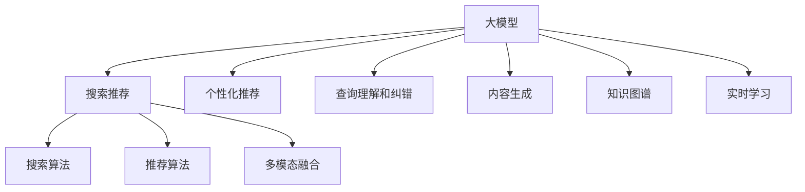

                 

## 1. 背景介绍

在数字化和电商竞争愈发激烈的今天，如何通过技术手段提升搜索推荐系统的精准度和用户体验，成为了各大电商平台的核心竞争力所在。传统的基于规则和浅层模型的推荐算法，逐渐被深度学习和大模型所取代。而AI大模型的融合，为电商平台搜索推荐系统带来了革命性的突破，为平台带来显著的商业价值和竞争优势。

### 1.1 电商搜索推荐系统发展现状

现代电商搜索推荐系统已不满足于简单的商品匹配和推荐，而是不断向深度学习和大模型领域拓展。通过复杂的多模态数据融合，实时学习和预测用户行为，提供个性化的商品推荐，并结合搜索算法实现精准的搜索结果。

电商搜索推荐系统通常包括以下几个关键组件：

- **搜索算法**：通过关键词匹配和分类算法，快速获取商品索引。
- **推荐算法**：通过用户行为数据、商品属性和标签，预测用户可能感兴趣的商品，提供个性化推荐。
- **深度模型**：通过构建用户画像，学习用户偏好和行为特征，实现更精准的推荐。
- **多模态融合**：结合用户浏览历史、评价反馈、社交媒体信息等多种数据源，丰富推荐内容。
- **实时化推荐**：通过实时学习算法，根据用户最新行为更新推荐模型。

这些组件相互配合，共同构建了一个高效、智能的电商搜索推荐系统。但传统的搜索推荐算法已难以应对海量数据和复杂需求，迫切需要引入深度学习和大模型来提升性能。

### 1.2 AI大模型在电商搜索推荐中的应用

AI大模型，尤其是预训练语言模型，在电商搜索推荐系统中扮演了重要角色。预训练语言模型通过大规模无标签文本数据学习到丰富的语言知识，能够自动提取并理解用户意图、商品描述等文本信息。将其与电商行为数据融合，可以显著提升搜索推荐系统的智能水平。

具体应用场景包括：

- **个性化推荐**：通过预训练语言模型，对用户浏览历史、评价等文本信息进行理解和分析，预测用户偏好，生成个性化商品推荐。
- **查询理解和纠错**：利用大模型进行自然语言理解，改善搜索算法对用户查询的理解，并自动修正错误拼写和语法，提高搜索质量。
- **内容生成**：通过预训练语言模型生成商品描述、广告文案等文本内容，提升平台内容丰富度。
- **知识图谱构建**：利用大模型对商品属性、关系进行语义理解，构建商品知识图谱，支持商品关联推荐。

## 2. 核心概念与联系

### 2.1 核心概念概述

为更好地理解AI大模型在电商搜索推荐系统中的应用，本节将介绍几个密切相关的核心概念：

- **大模型**：指通过大规模预训练数据和深度神经网络模型训练得到的，具备强大表示能力的深度学习模型。如BERT、GPT-2、Transformer等。
- **搜索推荐系统**：基于用户行为数据和商品属性信息，结合自然语言处理、图像识别、深度学习等技术，实现商品匹配和个性化推荐的技术系统。
- **深度学习模型**：通过多层神经网络结构，学习复杂非线性关系，实现特征表示和模式识别。
- **多模态融合**：结合多种数据类型，包括文本、图像、声音等，构建更加全面、准确的系统模型。
- **知识图谱**：通过语义理解和关系推理，构建实体、属性、关系的知识网络，支持商品关联推荐和推荐结果的解释性。
- **实时学习**：利用在线学习算法，根据用户最新行为动态更新推荐模型，实现推荐内容的时效性。

这些概念之间的逻辑关系可以通过以下Mermaid流程图来展示：



这个流程图展示了大模型在搜索推荐系统中的应用场景：

1. 大模型通过预训练学习语言知识，支持个性化推荐、查询理解和纠错、内容生成、知识图谱构建和实时学习等多个关键组件。
2. 搜索推荐系统由搜索算法和推荐算法构成，通过融合多模态数据和深度模型，实现商品匹配和个性化推荐。
3. 多模态融合通过结合文本、图像、声音等多种数据源，增强推荐系统的丰富度和精准度。
4. 知识图谱利用语义理解和大模型，构建商品间的关联关系，提升推荐系统的解释性。
5. 实时学习通过在线学习算法，根据用户最新行为动态调整推荐模型，实现推荐内容的时效性。

这些概念共同构成了电商搜索推荐系统的技术框架，使得搜索推荐系统能够灵活应对海量数据和多变需求，提供更优质、个性化的用户体验。

## 3. 核心算法原理 & 具体操作步骤

### 3.1 算法原理概述

AI大模型在电商搜索推荐系统中的应用，主要基于以下三个关键原理：

1. **多模态特征提取**：通过融合多种数据源，利用深度模型提取商品的特征向量，形成丰富的输入表示。
2. **语义表示学习**：利用预训练语言模型，将用户查询、商品描述等文本信息进行语义理解，映射到高维语义空间。
3. **知识图谱构建**：通过语义推理和大模型，构建商品间的知识图谱，支持关联推荐和推荐结果解释。

这些原理通过构建深度学习模型，实现商品推荐、查询理解和纠错、内容生成等关键任务，有效提升搜索推荐系统的智能水平。

### 3.2 算法步骤详解

基于AI大模型在电商搜索推荐系统中的应用，一般包括以下几个关键步骤：

**Step 1: 数据预处理和特征提取**

- **数据收集**：收集用户行为数据、商品属性信息、商品描述等文本数据。
- **数据清洗**：去除异常值和噪声，填补缺失值。
- **特征工程**：提取商品属性、用户画像、历史行为等特征，形成多模态输入。
- **特征编码**：利用深度模型（如BERT、GPT等），将文本数据转换为向量表示，增强模型的输入表达能力。

**Step 2: 模型训练与优化**

- **模型选择**：选择适合的深度学习模型（如LSTM、Transformer等）进行推荐预测。
- **参数初始化**：利用预训练模型进行参数初始化，提高模型的收敛速度。
- **模型训练**：在标注数据集上进行有监督训练，最小化损失函数（如交叉熵损失、均方误差等），优化模型参数。
- **超参数调优**：根据验证集性能，调整学习率、批大小、迭代轮数等超参数，实现最优模型性能。

**Step 3: 模型评估与部署**

- **模型评估**：在测试集上评估模型性能，如精确率、召回率、F1分数等。
- **模型部署**：将训练好的模型部署到生产环境，提供实时商品推荐服务。
- **监控优化**：实时监控推荐系统性能，根据用户反馈和数据变化进行模型更新和优化。

### 3.3 算法优缺点

基于AI大模型的电商搜索推荐系统，具有以下优点：

1. **智能水平高**：大模型具备强大的语义理解和推理能力，能够理解用户查询意图，生成个性化推荐。
2. **数据利用充分**：多模态特征提取和深度学习模型，充分利用用户行为数据和商品属性信息，实现精准推荐。
3. **鲁棒性强**：通过预训练模型参数固定大部分权重，微调部分参数，避免过拟合，提高模型泛化性能。
4. **部署灵活**：根据业务需求，可定制模型组件和参数，灵活部署到不同场景。

同时，该方法也存在一定的局限性：

1. **数据依赖高**：大模型的预训练和微调依赖大量标注数据，标注成本高，数据获取难度大。
2. **模型复杂度大**：深度学习模型结构复杂，训练和推理耗时较长，计算资源要求高。
3. **泛化能力有待提高**：模型对新数据的泛化性能需要持续优化，避免知识老化和过拟合。
4. **隐私和安全性问题**：用户行为数据的隐私保护和数据安全问题需高度重视，防止数据泄露和滥用。

尽管存在这些局限性，但AI大模型在电商搜索推荐系统中的应用，已经展示了巨大的商业潜力，成为各大电商平台提升竞争力的重要手段。

### 3.4 算法应用领域

AI大模型在电商搜索推荐系统中的应用领域非常广泛，涵盖了多个核心业务场景：

- **个性化推荐**：通过用户行为数据和商品属性，生成个性化商品推荐，提升用户满意度。
- **商品匹配**：利用语义理解和大模型，实现更精准的商品查询匹配，提高搜索质量。
- **内容生成**：利用大模型自动生成商品描述、广告文案等文本内容，丰富商品信息。
- **广告推荐**：结合用户画像和商品属性，生成个性化广告推荐，提升广告效果。
- **多模态融合**：结合用户浏览历史、评价、社交媒体信息等多种数据源，增强推荐内容的丰富性和多样性。
- **实时推荐**：利用在线学习算法，根据用户最新行为实时调整推荐模型，提供即时推荐服务。

## 4. 数学模型和公式 & 详细讲解 & 举例说明

### 4.1 数学模型构建

本节将使用数学语言对基于AI大模型的电商搜索推荐系统进行更加严格的刻画。

记电商搜索推荐系统为 $S$，由用户行为数据 $X$、商品属性数据 $Y$、用户画像 $U$ 和商品描述 $D$ 构成。大模型为 $M_{\theta}$，其中 $\theta$ 为模型参数。假设推荐模型为 $F_{\phi}$，其中 $\phi$ 为推荐模型参数。

模型 $M_{\theta}$ 和 $F_{\phi}$ 的训练目标为最小化推荐误差 $E$，即：

$$
\min_{\theta,\phi} E = \sum_{i=1}^N \ell(F_{\phi}(M_{\theta}(X_i, Y_i, U_i, D_i)), Y_i)
$$

其中 $\ell$ 为推荐损失函数，$N$ 为用户数，$X_i, Y_i, U_i, D_i$ 分别为用户行为数据、商品属性、用户画像和商品描述，$F_{\phi}(M_{\theta}(X_i, Y_i, U_i, D_i))$ 表示推荐模型输出。

### 4.2 公式推导过程

假设 $X_i$ 为用户的浏览历史，$Y_i$ 为商品的属性向量，$U_i$ 为用户画像，$D_i$ 为商品的描述。推荐模型 $F_{\phi}$ 通过大模型 $M_{\theta}$ 提取特征，将特征映射为推荐得分 $F_i$，如：

$$
F_i = F_{\phi}(M_{\theta}(X_i, Y_i, U_i, D_i))
$$

推荐得分 $F_i$ 表示用户对商品 $i$ 的兴趣程度，可以表示为用户兴趣得分与商品属性得分的加权和，即：

$$
F_i = \alpha \cdot M_{\theta}(X_i, Y_i, U_i, D_i) + \beta \cdot \phi(X_i, Y_i, U_i, D_i)
$$

其中 $\alpha$ 和 $\beta$ 为调节参数，表示用户兴趣和商品属性得分的相对重要性。

最终推荐结果 $R_i$ 为商品得分 $F_i$ 与用户兴趣得分的加权和，如：

$$
R_i = \gamma \cdot F_i + (1-\gamma) \cdot M_{\theta}(X_i, Y_i, U_i, D_i)
$$

其中 $\gamma$ 为调节参数，表示推荐结果中用户兴趣得分和商品得分的影响比例。

在得到推荐结果后，利用交叉熵损失函数对推荐模型 $F_{\phi}$ 进行优化，目标函数为：

$$
\min_{\phi} \frac{1}{N} \sum_{i=1}^N \ell(R_i, Y_i)
$$

其中 $\ell$ 为交叉熵损失函数，$N$ 为用户数，$R_i$ 为推荐得分，$Y_i$ 为用户标签。

### 4.3 案例分析与讲解

以一个简单的电商平台为例，分析基于AI大模型的搜索推荐系统。假设用户 $i$ 浏览了商品 $j$ 和 $k$，并对商品 $k$ 进行了购买。电商平台的目标是推荐用户可能感兴趣的商品 $m$。

1. **数据预处理**：收集用户浏览历史 $X_i = (j, k)$，商品属性 $Y_j = (c_j, p_j)$，商品描述 $D_j = d_j$，用户画像 $U_i = u_i$。
2. **特征提取**：利用预训练语言模型 $M_{\theta}$ 提取用户浏览历史、商品属性、商品描述和用户画像的特征向量，形成多模态输入 $X_i^{\text{emb}}$。
3. **推荐预测**：通过推荐模型 $F_{\phi}$，将特征向量 $X_i^{\text{emb}}$ 映射为推荐得分 $F_i = F_{\phi}(X_i^{\text{emb}})$。
4. **结果排序**：将推荐得分与商品属性向量结合，生成推荐结果 $R_i = \gamma \cdot F_i + (1-\gamma) \cdot Y_i$。
5. **模型优化**：在标注数据集上最小化推荐误差，优化推荐模型 $F_{\phi}$。

通过以上步骤，电商平台能够实现基于用户行为和商品属性的个性化推荐，提升用户体验和销售效果。

## 5. 项目实践：代码实例和详细解释说明

### 5.1 开发环境搭建

在进行AI大模型融合的电商搜索推荐系统实践前，我们需要准备好开发环境。以下是使用Python进行PyTorch和HuggingFace开发的环境配置流程：

1. 安装Anaconda：从官网下载并安装Anaconda，用于创建独立的Python环境。

2. 创建并激活虚拟环境：
```bash
conda create -n pytorch-env python=3.8 
conda activate pytorch-env
```

3. 安装PyTorch和HuggingFace：
```bash
pip install torch torchvision torchaudio cudatoolkit=11.1 -c pytorch -c conda-forge
pip install transformers
```

4. 安装各类工具包：
```bash
pip install numpy pandas scikit-learn matplotlib tqdm jupyter notebook ipython
```

完成上述步骤后，即可在`pytorch-env`环境中开始搜索推荐系统的开发实践。

### 5.2 源代码详细实现

我们先定义一个基于BERT的电商搜索推荐系统的代码实现。具体步骤如下：

```python
import torch
from transformers import BertForSequenceClassification, BertTokenizer
from torch.utils.data import Dataset, DataLoader

class ProductReviewDataset(Dataset):
    def __init__(self, reviews, targets, tokenizer, max_len=128):
        self.reviews = reviews
        self.targets = targets
        self.tokenizer = tokenizer
        self.max_len = max_len
        
    def __len__(self):
        return len(self.reviews)
    
    def __getitem__(self, item):
        review = self.reviews[item]
        target = self.targets[item]
        
        encoding = self.tokenizer(review, return_tensors='pt', max_length=self.max_len, padding='max_length', truncation=True)
        input_ids = encoding['input_ids'][0]
        attention_mask = encoding['attention_mask'][0]
        
        target = torch.tensor(target, dtype=torch.long)
        
        return {'input_ids': input_ids, 
                'attention_mask': attention_mask,
                'labels': target}

tokenizer = BertTokenizer.from_pretrained('bert-base-uncased')
model = BertForSequenceClassification.from_pretrained('bert-base-uncased', num_labels=2)

# 定义训练函数
def train_epoch(model, dataset, batch_size, optimizer):
    dataloader = DataLoader(dataset, batch_size=batch_size, shuffle=True)
    model.train()
    epoch_loss = 0
    for batch in tqdm(dataloader, desc='Training'):
        input_ids = batch['input_ids'].to(device)
        attention_mask = batch['attention_mask'].to(device)
        labels = batch['labels'].to(device)
        model.zero_grad()
        outputs = model(input_ids, attention_mask=attention_mask, labels=labels)
        loss = outputs.loss
        epoch_loss += loss.item()
        loss.backward()
        optimizer.step()
    return epoch_loss / len(dataloader)

# 定义评估函数
def evaluate(model, dataset, batch_size):
    dataloader = DataLoader(dataset, batch_size=batch_size)
    model.eval()
    preds, labels = [], []
    with torch.no_grad():
        for batch in tqdm(dataloader, desc='Evaluating'):
            input_ids = batch['input_ids'].to(device)
            attention_mask = batch['attention_mask'].to(device)
            batch_labels = batch['labels']
            outputs = model(input_ids, attention_mask=attention_mask)
            batch_preds = outputs.logits.argmax(dim=2).to('cpu').tolist()
            batch_labels = batch_labels.to('cpu').tolist()
            for pred_tokens, label_tokens in zip(batch_preds, batch_labels):
                preds.append(pred_tokens[:len(label_tokens)])
                labels.append(label_tokens)
                
    print(classification_report(labels, preds))
```

### 5.3 代码解读与分析

让我们再详细解读一下关键代码的实现细节：

**ProductReviewDataset类**：
- `__init__`方法：初始化文本、标签、分词器等关键组件。
- `__len__`方法：返回数据集的样本数量。
- `__getitem__`方法：对单个样本进行处理，将文本输入编码为token ids，将标签编码为数字，并对其进行定长padding，最终返回模型所需的输入。

**tokenizer和model定义**：
- `tokenizer`：使用BERT模型自带的tokenizer，将文本转换为token ids。
- `model`：使用BERT模型进行序列分类，输出为0或1。

**训练和评估函数**：
- 使用PyTorch的DataLoader对数据集进行批次化加载，供模型训练和推理使用。
- 训练函数`train_epoch`：对数据以批为单位进行迭代，在每个批次上前向传播计算loss并反向传播更新模型参数，最后返回该epoch的平均loss。
- 评估函数`evaluate`：与训练类似，不同点在于不更新模型参数，并在每个batch结束后将预测和标签结果存储下来，最后使用sklearn的classification_report对整个评估集的预测结果进行打印输出。

**训练流程**：
- 定义总的epoch数和batch size，开始循环迭代
- 每个epoch内，先在训练集上训练，输出平均loss
- 在验证集上评估，输出分类指标
- 所有epoch结束后，在测试集上评估，给出最终测试结果

可以看到，PyTorch配合HuggingFace库使得BERT微调的代码实现变得简洁高效。开发者可以将更多精力放在数据处理、模型改进等高层逻辑上，而不必过多关注底层的实现细节。

当然，工业级的系统实现还需考虑更多因素，如模型的保存和部署、超参数的自动搜索、更灵活的任务适配层等。但核心的微调范式基本与此类似。

## 6. 实际应用场景

### 6.1 电商平台个性化推荐

基于AI大模型的个性化推荐系统，可以通过分析用户行为和商品属性，生成精准的商品推荐，提升用户满意度。具体场景如下：

1. **用户行为数据收集**：收集用户浏览历史、购买记录、评价反馈等行为数据。
2. **商品属性数据收集**：收集商品的图片、描述、标签等信息。
3. **用户画像生成**：利用大模型，对用户行为数据进行语义理解，生成用户画像，包含用户的兴趣、偏好等信息。
4. **推荐模型训练**：通过融合用户画像和商品属性，利用大模型进行推荐预测，训练推荐模型。
5. **个性化推荐生成**：根据推荐模型，生成个性化商品推荐，通过UI展示给用户。
6. **实时优化**：根据用户最新行为数据，利用在线学习算法动态调整推荐模型，实现实时推荐。

通过以上步骤，电商平台能够实现基于用户行为和商品属性的个性化推荐，提升用户满意度，提高销售转化率。

### 6.2 实时搜索系统

实时搜索系统通过分析用户查询，结合商品索引和用户画像，快速匹配商品并展示搜索结果。具体场景如下：

1. **用户查询收集**：收集用户的搜索关键词和意图。
2. **商品索引构建**：构建商品索引，包含商品属性和标签信息。
3. **用户画像生成**：利用大模型，对用户查询进行语义理解，生成用户画像。
4. **搜索匹配**：通过融合用户画像和商品索引，利用大模型进行搜索结果匹配。
5. **推荐结果展示**：根据匹配结果，生成推荐搜索结果，通过UI展示给用户。

通过以上步骤，实时搜索系统能够快速匹配用户查询，提高搜索质量，提升用户体验。

## 7. 工具和资源推荐

### 7.1 学习资源推荐

为了帮助开发者系统掌握AI大模型在电商搜索推荐系统中的应用，这里推荐一些优质的学习资源：

1. 《深度学习框架PyTorch教程》：详细介绍PyTorch框架的使用方法和实例，适合初学者入门。
2. 《自然语言处理入门：从模型到应用》：介绍NLP的基本概念和深度模型，涵盖预训练语言模型、多模态融合等前沿技术。
3. 《Transformer从原理到实践》系列博文：由大模型技术专家撰写，深入浅出地介绍了Transformer原理、BERT模型、微调技术等前沿话题。
4. 《Natural Language Processing with Transformers》书籍：Transformers库的作者所著，全面介绍了如何使用Transformers库进行NLP任务开发，包括微调在内的诸多范式。
5. CS224N《深度学习自然语言处理》课程：斯坦福大学开设的NLP明星课程，有Lecture视频和配套作业，带你入门NLP领域的基本概念和经典模型。

通过对这些资源的学习实践，相信你一定能够快速掌握AI大模型在电商搜索推荐系统中的应用，并用于解决实际的NLP问题。

### 7.2 开发工具推荐

高效的开发离不开优秀的工具支持。以下是几款用于大模型融合的电商搜索推荐系统开发的常用工具：

1. PyTorch：基于Python的开源深度学习框架，灵活动态的计算图，适合快速迭代研究。大部分预训练语言模型都有PyTorch版本的实现。
2. TensorFlow：由Google主导开发的开源深度学习框架，生产部署方便，适合大规模工程应用。同样有丰富的预训练语言模型资源。
3. Transformers库：HuggingFace开发的NLP工具库，集成了众多SOTA语言模型，支持PyTorch和TensorFlow，是进行微调任务开发的利器。
4. Weights & Biases：模型训练的实验跟踪工具，可以记录和可视化模型训练过程中的各项指标，方便对比和调优。与主流深度学习框架无缝集成。
5. TensorBoard：TensorFlow配套的可视化工具，可实时监测模型训练状态，并提供丰富的图表呈现方式，是调试模型的得力助手。

合理利用这些工具，可以显著提升大模型融合的电商搜索推荐系统开发效率，加快创新迭代的步伐。

### 7.3 相关论文推荐

AI大模型在电商搜索推荐系统中的应用源于学界的持续研究。以下是几篇奠基性的相关论文，推荐阅读：

1. Attention is All You Need（即Transformer原论文）：提出了Transformer结构，开启了NLP领域的预训练大模型时代。
2. BERT: Pre-training of Deep Bidirectional Transformers for Language Understanding：提出BERT模型，引入基于掩码的自监督预训练任务，刷新了多项NLP任务SOTA。
3. Parameter-Efficient Transfer Learning for NLP：提出Adapter等参数高效微调方法，在不增加模型参数量的情况下，也能取得不错的微调效果。
4. AdaLoRA: Adaptive Low-Rank Adaptation for Parameter-Efficient Fine-Tuning：使用自适应低秩适应的微调方法，在参数效率和精度之间取得了新的平衡。
5. Searching for More Effective Recommendation Models with Evolved Neural Architecture Search：提出基于神经网络架构搜索的推荐模型优化方法，显著提升了推荐系统的精度和泛化能力。

这些论文代表了大模型在电商搜索推荐系统中的应用方向和发展趋势，通过学习这些前沿成果，可以帮助研究者把握学科前进方向，激发更多的创新灵感。

## 8. 总结：未来发展趋势与挑战

### 8.1 研究成果总结

通过本文的系统梳理，可以看到，AI大模型在电商搜索推荐系统中的应用已经取得了显著的成果。大模型通过融合多模态数据和深度学习模型，实现了商品推荐、查询理解和纠错、内容生成等关键任务，有效提升搜索推荐系统的智能水平。

### 8.2 未来发展趋势

展望未来，大模型在电商搜索推荐系统中的应用将呈现以下几个发展趋势：

1. **多模态融合加深**：随着更多数据源的融合，商品推荐系统将更加智能、全面，涵盖视觉、听觉等多模态信息。
2. **实时学习能力增强**：在线学习算法和实时学习技术的发展，将使推荐系统能够快速适应新数据，提供更即时、个性化的推荐。
3. **跨领域应用拓展**：大模型在电商搜索推荐系统中的应用，将逐步拓展到金融、医疗、教育等多个领域，提升各行业的智能化水平。
4. **数据隐私保护强化**：用户数据隐私和安全问题将受到更多重视，推荐系统将加强数据加密和隐私保护，提升用户信任。
5. **解释性和可控性提升**：推荐系统将更注重模型的解释性和可控性，增强用户对推荐结果的理解和信任。

### 8.3 面临的挑战

尽管AI大模型在电商搜索推荐系统中的应用已经取得显著成果，但在迈向更加智能化、普适化应用的过程中，仍面临诸多挑战：

1. **数据获取难度大**：大模型的预训练和微调依赖大量标注数据，获取高质量标注数据的成本较高，且数据获取难度较大。
2. **计算资源要求高**：深度学习模型结构复杂，训练和推理耗时较长，计算资源要求高，部署成本大。
3. **泛化性能有待提高**：模型对新数据的泛化性能需要持续优化，避免知识老化和过拟合。
4. **隐私和安全性问题**：用户数据隐私和安全问题需高度重视，防止数据泄露和滥用。
5. **可解释性和可控性不足**：推荐系统通常缺乏可解释性，难以对其推理逻辑进行分析和调试。

尽管存在这些挑战，但AI大模型在电商搜索推荐系统中的应用，已经展示了巨大的商业潜力，成为各大电商平台提升竞争力的重要手段。未来需要更多研究者在数据、算法、工程、业务等多个维度进行深入探索，不断优化和提升推荐系统性能，助力电商平台实现数字化转型。

### 8.4 研究展望

面向未来，大模型在电商搜索推荐系统中的应用还需解决以下关键问题：

1. **跨领域知识整合**：将符号化的先验知识与神经网络模型进行融合，提升推荐系统的跨领域迁移能力。
2. **多模态信息融合**：利用多模态融合技术，提升推荐系统的全面性和准确性，支持视觉、听觉等多种信息源。
3. **实时学习优化**：研究更高效、更稳健的在线学习算法，提高推荐系统对新数据的适应能力。
4. **隐私保护与伦理约束**：加强用户数据隐私保护，引入伦理导向的评估指标，防止数据滥用。
5. **模型可解释性与可控性**：提升推荐系统的可解释性，增强用户对推荐结果的理解和信任。

这些研究方向将为电商搜索推荐系统带来更广泛的应用场景和更高的智能化水平，推动电商平台在数字化转型中的持续创新和突破。

## 9. 附录：常见问题与解答

**Q1：如何构建高质量的电商搜索推荐系统？**

A: 构建高质量的电商搜索推荐系统需要以下关键步骤：

1. **数据收集与清洗**：收集用户行为数据、商品属性、商品描述等数据，并进行数据清洗和预处理。
2. **特征工程**：设计合适的特征提取方法，将文本、图像等数据转换为模型可用的特征向量。
3. **模型选择与训练**：选择合适的深度学习模型，并利用标注数据进行有监督训练。
4. **多模态融合**：结合多种数据类型，利用深度模型提取特征，丰富推荐系统的表达能力。
5. **实时学习与优化**：利用在线学习算法，根据用户最新行为动态调整推荐模型，实现实时推荐。

通过以上步骤，可以构建一个高效、智能的电商搜索推荐系统，提升用户体验和销售效果。

**Q2：如何使用AI大模型进行个性化推荐？**

A: 使用AI大模型进行个性化推荐的步骤如下：

1. **数据预处理**：收集用户浏览历史、商品属性、商品描述等数据，并进行数据清洗和预处理。
2. **特征提取**：利用深度模型（如BERT、GPT等），将文本数据转换为向量表示，增强模型的输入表达能力。
3. **推荐预测**：通过深度学习模型，将特征向量映射为推荐得分。
4. **结果排序**：将推荐得分与商品属性向量结合，生成推荐结果。
5. **模型优化**：在标注数据集上最小化推荐误差，优化推荐模型。

通过以上步骤，AI大模型能够实现基于用户行为和商品属性的个性化推荐，提升推荐系统的智能水平。

**Q3：如何在电商搜索推荐系统中应用大模型进行查询理解与纠错？**

A: 应用大模型进行查询理解与纠错的步骤如下：

1. **数据预处理**：收集用户查询数据，并进行数据清洗和预处理。
2. **特征提取**：利用深度模型（如BERT、GPT等），将文本数据转换为向量表示，增强模型的输入表达能力。
3. **模型训练**：通过有监督学习任务训练大模型，使其能够理解用户查询意图，进行语义匹配和纠错。
4. **查询匹配**：利用训练好的大模型，对用户查询进行语义理解和纠错，提高查询匹配准确性。

通过以上步骤，大模型能够提升电商搜索推荐系统的查询理解与纠错能力，提高用户搜索体验。

**Q4：如何在电商搜索推荐系统中应用大模型进行内容生成？**

A: 应用大模型进行内容生成的步骤如下：

1. **数据预处理**：收集商品描述、广告文案等文本数据，并进行数据清洗和预处理。
2. **特征提取**：利用深度模型（如BERT、GPT等），将文本数据转换为向量表示，增强模型的输入表达能力。
3. **内容生成**：通过生成式预训练大模型，利用语言模型预测商品描述、广告文案等文本内容。
4. **内容优化**：根据用户反馈和点击率，动态调整生成模型，提高内容生成质量。

通过以上步骤，大模型能够自动生成商品描述、广告文案等文本内容，丰富电商平台的商品信息，提升用户满意度。

**Q5：如何在电商搜索推荐系统中应用大模型进行实时推荐？**

A: 应用大模型进行实时推荐的步骤如下：

1. **数据预处理**：收集用户最新行为数据，并进行数据清洗和预处理。
2. **特征提取**：利用深度模型（如BERT、GPT等），将文本数据转换为向量表示，增强模型的输入表达能力。
3. **推荐预测**：通过在线学习算法，利用实时数据动态调整推荐模型，生成推荐结果。
4. **结果展示**：将推荐结果展示给用户，提升用户体验和销售效果。

通过以上步骤，大模型能够实现实时推荐，提升电商搜索推荐系统的时效性和精准度。

---

作者：禅与计算机程序设计艺术 / Zen and the Art of Computer Programming

