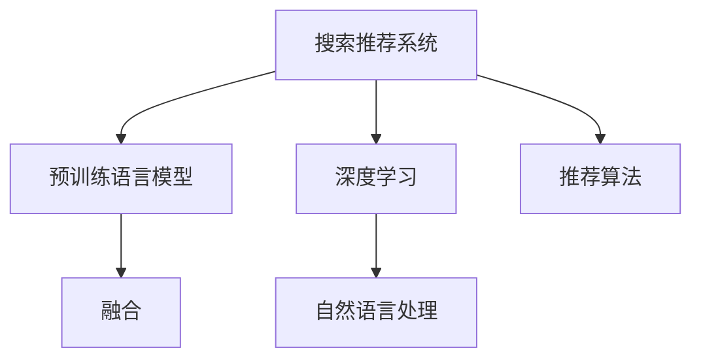

                 

# 搜索推荐系统的AI 进化：大模型融合带来的挑战与机遇

> 关键词：搜索推荐系统,大模型融合,挑战与机遇,自然语言处理(NLP),深度学习(Deep Learning),推荐系统(Recommendation System)

## 1. 背景介绍

### 1.1 问题由来

随着互联网和电子商务的迅猛发展，用户搜索和推荐的需求不断增长。传统的推荐系统主要基于协同过滤、基于内容的推荐等方法，但这些方法存在诸多局限性：

1. 数据稀疏性：用户与物品的交互数据稀疏，难以构建精确的推荐模型。
2. 冷启动问题：新用户和新物品缺少足够的交互数据，难以进行有效推荐。
3. 动态变化：用户兴趣和物品属性随时变化，静态模型难以适应用户需求的动态调整。

为了解决上述问题，越来越多的研究开始探索基于深度学习的方法。特别是在自然语言处理(NLP)和表示学习领域，大模型逐渐崭露头角。通过预训练语言模型和推荐模型之间的融合，搜索推荐系统正经历着一场AI进化。

### 1.2 问题核心关键点

1. **预训练语言模型的引入**：通过预训练大语言模型，如BERT、GPT、RoBERTa等，获取大规模语义和知识表示，为推荐系统提供丰富的用户兴趣和物品属性信息。
2. **模型融合策略**：如何有效融合预训练语言模型和推荐模型，构建出既具有强大语义理解能力，又具备推荐能力的智能系统。
3. **性能提升与可解释性**：如何通过模型融合提升推荐系统的精度和效果，同时确保模型的可解释性和鲁棒性。
4. **参数高效优化**：在大规模推荐系统中的应用中，如何优化模型参数，提高计算效率，降低存储成本。
5. **安全与隐私保护**：如何在保证推荐效果的同时，确保用户数据和隐私安全，防止信息泄露。

本文将围绕这些关键点，系统地介绍搜索推荐系统在AI进化中的挑战与机遇。

## 2. 核心概念与联系

### 2.1 核心概念概述

为更好地理解搜索推荐系统中大模型融合的方法，本节将介绍几个密切相关的核心概念：

- **搜索推荐系统(Recommendation System)**：通过分析用户历史行为、兴趣、属性等数据，为用户推荐可能感兴趣的物品的系统。
- **预训练语言模型(Language Model)**：如BERT、GPT等，通过在大规模无标签文本数据上进行预训练，学习通用的语言表示，具备强大的语义理解和生成能力。
- **深度学习(Deep Learning)**：基于多层神经网络结构，通过反向传播算法优化模型参数，实现复杂任务的学习和预测。
- **自然语言处理(Natural Language Processing, NLP)**：研究计算机如何处理和理解自然语言，涉及语言模型、语义理解、知识图谱等技术。
- **融合(Fusion)**：将不同模型、算法或数据源进行有效结合，产生比单一模型更好的效果。
- **推荐算法**：如协同过滤、基于内容的推荐、矩阵分解等，用于处理推荐系统中的核心问题。

这些核心概念之间的逻辑关系可以通过以下Mermaid流程图来展示：



这个流程图展示了大语言模型在搜索推荐系统中的核心概念及其之间的关系：

1. 搜索推荐系统通过深度学习、自然语言处理等技术，对用户行为和物品属性进行分析，构建推荐模型。
2. 预训练语言模型通过大规模无标签文本数据进行预训练，学习通用的语言表示。
3. 通过融合策略，将预训练语言模型和推荐模型有效结合，增强推荐系统的语义理解能力。
4. 推荐算法用于处理推荐系统中的核心问题，如协同过滤、基于内容的推荐等。

这些概念共同构成了搜索推荐系统的技术和应用框架，使其能够在各种场景下发挥智能推荐的能力。通过理解这些核心概念，我们可以更好地把握搜索推荐系统的工作原理和优化方向。

## 3. 核心算法原理 & 具体操作步骤
### 3.1 算法原理概述

搜索推荐系统中的大模型融合，本质上是一个基于深度学习和表示学习的融合范式。其核心思想是：将预训练大语言模型与推荐系统进行融合，利用语言模型对用户行为和物品属性的语义理解能力，增强推荐模型的预测精度和鲁棒性。

形式化地，假设预训练语言模型为 $M_{\text{LM}}$，推荐模型为 $M_{\text{RS}}$，用户行为表示为 $u$，物品属性表示为 $i$，推荐结果表示为 $y$。融合后的推荐模型为 $M_{\text{Fused}}$，其目标函数为：

$$
\mathcal{L}(M_{\text{Fused}}, y) = \mathcal{L}_{\text{RS}}(M_{\text{RS}}(u, i)) + \mathcal{L}_{\text{LM}}(M_{\text{LM}}(u))
$$

其中 $\mathcal{L}_{\text{RS}}$ 为推荐模型的损失函数，$\mathcal{L}_{\text{LM}}$ 为预训练语言模型的损失函数。

通过优化目标函数，最小化推荐系统的预测误差和语言模型的语义表示误差，构建出融合后的推荐模型。这种融合方法可以利用大语言模型在语义理解上的优势，提高推荐系统的效果和可靠性。

### 3.2 算法步骤详解

基于深度学习和表示学习的大模型融合，一般包括以下几个关键步骤：

**Step 1: 准备预训练语言模型和推荐模型**

- 选择合适的预训练语言模型 $M_{\text{LM}}$ 作为初始化参数，如BERT、GPT等。
- 选择合适的推荐模型 $M_{\text{RS}}$，如基于矩阵分解的推荐算法、协同过滤算法等。

**Step 2: 数据预处理**

- 收集用户行为数据和物品属性数据，并进行归一化、清洗、标注等预处理操作。
- 将用户行为数据和物品属性数据转换为模型可接受的格式。

**Step 3: 融合策略设计**

- 确定融合方法，如将预训练语言模型嵌入推荐模型、与推荐模型并行训练等。
- 设计融合目标函数，平衡推荐系统的预测精度和语言模型的语义表示。

**Step 4: 模型训练与优化**

- 在训练集中进行模型联合训练，优化模型参数。
- 使用验证集评估模型性能，根据性能指标调整超参数。
- 使用测试集评估模型最终性能。

**Step 5: 模型评估与部署**

- 在测试集上评估融合后的推荐模型，对比融合前后的效果。
- 使用融合后的模型对新用户和新物品进行推荐，集成到实际的应用系统中。

以上是基于深度学习和表示学习的大模型融合的一般流程。在实际应用中，还需要针对具体任务的特点，对融合过程的各个环节进行优化设计，如改进融合目标函数，引入更多的正则化技术，搜索最优的超参数组合等，以进一步提升模型性能。

### 3.3 算法优缺点

基于深度学习和表示学习的大模型融合方法具有以下优点：

1. **提升推荐精度**：通过引入预训练语言模型的语义理解能力，能够更准确地理解用户兴趣和物品属性，提高推荐系统的预测精度。
2. **增强鲁棒性**：大语言模型通过大规模语料进行预训练，具备较强的泛化能力，能够应对数据分布的变化，提高推荐系统的鲁棒性。
3. **促进可解释性**：语言模型通过自然语言处理技术，能够提供更加直观的解释和推理过程，提升推荐系统的可解释性。
4. **支持多模态融合**：语言模型可以与图像、音频等模态的数据进行融合，扩展推荐系统的应用范围。

同时，该方法也存在一定的局限性：

1. **模型复杂度高**：融合后的推荐模型复杂度增加，计算成本和存储成本上升。
2. **训练难度大**：融合后的模型训练难度增加，需要更多的计算资源和经验。
3. **可解释性不足**：融合后的推荐模型黑盒性质更强，难以提供详细的解释和推理过程。
4. **过拟合风险**：在融合过程中，预训练语言模型的语义理解能力和推荐系统的推荐能力可能会互相干扰，导致过拟合。

尽管存在这些局限性，但就目前而言，基于深度学习和表示学习的大模型融合方法是推荐系统演进的重要方向，通过不断优化和改进，有望进一步提升推荐系统的性能和应用效果。

### 3.4 算法应用领域

基于深度学习和表示学习的大模型融合方法，已经在搜索推荐系统多个领域得到应用，例如：

- **商品推荐**：如电商网站、在线视频平台等，利用预训练语言模型对用户行为和商品属性进行语义分析，提升推荐精度。
- **音乐推荐**：如Spotify、网易云音乐等，通过分析用户听歌历史和歌曲属性，利用语言模型进行相似度计算，提供个性化的音乐推荐。
- **新闻推荐**：如今日头条、澎湃新闻等，利用语言模型分析用户阅读习惯和新闻内容，提高新闻推荐的准确性和时效性。
- **视频推荐**：如抖音、YouTube等，通过预训练语言模型对视频内容进行语义理解，推荐与用户兴趣相关联的视频内容。
- **多模态推荐**：如智能家居系统，将语言模型与视觉、音频等模态数据进行融合，提供全方位的智能推荐服务。

除了上述这些经典应用外，大模型融合方法还在社交网络、金融推荐、教育推荐等众多领域中发挥了重要作用，为推荐系统带来了全新的突破。随着预训练语言模型和推荐系统的不断发展，大模型融合技术将在更广阔的应用领域大放异彩。

## 4. 数学模型和公式 & 详细讲解 & 举例说明

### 4.1 数学模型构建

本节将使用数学语言对大模型融合的过程进行更加严格的刻画。

假设推荐模型为 $M_{\text{RS}}: \mathcal{U} \times \mathcal{I} \rightarrow \mathcal{Y}$，其中 $\mathcal{U}$ 为用户行为空间，$\mathcal{I}$ 为物品属性空间，$\mathcal{Y}$ 为推荐结果空间。假设预训练语言模型为 $M_{\text{LM}}: \mathcal{X} \rightarrow \mathcal{Z}$，其中 $\mathcal{X}$ 为输入文本空间，$\mathcal{Z}$ 为语义表示空间。

定义推荐模型的损失函数为 $\ell_{\text{RS}}(M_{\text{RS}}(u, i))$，预训练语言模型的损失函数为 $\ell_{\text{LM}}(M_{\text{LM}}(u))$。融合后的推荐模型 $M_{\text{Fused}}$ 的损失函数为：

$$
\mathcal{L}_{\text{Fused}}(u, i) = \ell_{\text{RS}}(M_{\text{RS}}(u, i)) + \alpha \ell_{\text{LM}}(M_{\text{LM}}(u))
$$

其中 $\alpha$ 为融合参数，用于控制语言模型对推荐系统的影响程度。

### 4.2 公式推导过程

以下我们以商品推荐为例，推导融合后的推荐模型及其损失函数的计算公式。

假设用户行为数据为 $u = [u_1, u_2, ..., u_n]$，其中 $u_i$ 表示用户对商品 $i$ 的兴趣度。物品属性数据为 $i = [i_1, i_2, ..., i_m]$，其中 $i_j$ 表示商品 $i$ 的属性。推荐结果为 $y = [y_1, y_2, ..., y_n]$，其中 $y_i$ 表示商品 $i$ 的推荐得分。

定义推荐模型的输出为 $y_{\text{RS}} = M_{\text{RS}}(u, i)$，预训练语言模型的输出为 $z_{\text{LM}} = M_{\text{LM}}(u)$。则融合后的推荐模型输出为：

$$
y_{\text{Fused}} = M_{\text{Fused}}(u, i) = \phi(y_{\text{RS}}, z_{\text{LM}})
$$

其中 $\phi$ 为融合函数，可以将推荐得分 $y_{\text{RS}}$ 和语义表示 $z_{\text{LM}}$ 进行有效结合。

融合后的推荐模型损失函数为：

$$
\mathcal{L}_{\text{Fused}} = \frac{1}{n}\sum_{i=1}^n \ell_{\text{RS}}(y_{\text{RS}}, y_i) + \alpha \frac{1}{n}\sum_{i=1}^n \ell_{\text{LM}}(z_{\text{LM}}, u_i)
$$

根据定义，推荐模型的损失函数可以分解为交叉熵损失：

$$
\ell_{\text{RS}}(y_{\text{RS}}, y_i) = -y_i \log y_{\text{RS}}(i) - (1-y_i) \log (1-y_{\text{RS}}(i))
$$

预训练语言模型的损失函数可以分解为语言模型损失：

$$
\ell_{\text{LM}}(z_{\text{LM}}, u_i) = -\frac{1}{n}\sum_{j=1}^m p(z_{\text{LM}}[j|u_i])
$$

其中 $p$ 表示预测概率，$z_{\text{LM}}[j|u_i]$ 表示给定用户行为 $u_i$ 时，语言模型对单词 $j$ 的预测概率。

### 4.3 案例分析与讲解

假设我们有一个电商网站推荐系统，使用BERT模型作为预训练语言模型，利用商品描述和用户浏览历史进行融合。具体步骤如下：

1. **数据预处理**：将用户浏览历史和商品描述转换为BERT可接受的输入格式，进行归一化、清洗等预处理操作。
2. **融合函数设计**：假设融合函数为加权平均函数，即 $y_{\text{Fused}} = \frac{1}{2} y_{\text{RS}} + \frac{1}{2} z_{\text{LM}}$。
3. **模型训练**：在电商网站的用户行为和商品属性数据上进行联合训练，最小化融合后的推荐模型损失函数 $\mathcal{L}_{\text{Fused}}$。
4. **模型评估**：在测试集上评估融合后的推荐模型，对比融合前后的推荐效果。

## 5. 项目实践：代码实例和详细解释说明

### 5.1 开发环境搭建

在进行大模型融合实践前，我们需要准备好开发环境。以下是使用Python进行PyTorch开发的环境配置流程：

1. 安装Anaconda：从官网下载并安装Anaconda，用于创建独立的Python环境。

2. 创建并激活虚拟环境：
```bash
conda create -n pytorch-env python=3.8 
conda activate pytorch-env
```

3. 安装PyTorch：根据CUDA版本，从官网获取对应的安装命令。例如：
```bash
conda install pytorch torchvision torchaudio cudatoolkit=11.1 -c pytorch -c conda-forge
```

4. 安装Transformers库：
```bash
pip install transformers
```

5. 安装各类工具包：
```bash
pip install numpy pandas scikit-learn matplotlib tqdm jupyter notebook ipython
```

完成上述步骤后，即可在`pytorch-env`环境中开始大模型融合实践。

### 5.2 源代码详细实现

下面我们以商品推荐任务为例，给出使用Transformers库对BERT模型进行融合的PyTorch代码实现。

首先，定义商品推荐系统的数据处理函数：

```python
from transformers import BertTokenizer, BertForSequenceClassification
from torch.utils.data import Dataset, DataLoader
import torch
import numpy as np

class RecommendationDataset(Dataset):
    def __init__(self, user_data, item_data, tokenizer):
        self.user_data = user_data
        self.item_data = item_data
        self.tokenizer = tokenizer
        self.max_len = 512
        
    def __len__(self):
        return len(self.user_data)
    
    def __getitem__(self, item):
        user_seq = self.user_data[item]
        item_seq = self.item_data[item]
        
        user_input = self.tokenizer(user_seq, return_tensors='pt', max_length=self.max_len, padding='max_length', truncation=True)
        item_input = self.tokenizer(item_seq, return_tensors='pt', max_length=self.max_len, padding='max_length', truncation=True)
        
        user_ids = user_input['input_ids'][0].flatten().tolist()
        item_ids = item_input['input_ids'][0].flatten().tolist()
        item_labels = np.ones(len(item_ids))
        
        return {'user_input_ids': user_ids,
                'item_input_ids': item_ids,
                'item_labels': item_labels}
```

然后，定义融合后的推荐模型和优化器：

```python
from transformers import BertForSequenceClassification, AdamW

user_model = BertForSequenceClassification.from_pretrained('bert-base-uncased', num_labels=2)
item_model = BertForSequenceClassification.from_pretrained('bert-base-uncased', num_labels=2)

user_model.train()
item_model.train()

user_optimizer = AdamW(user_model.parameters(), lr=2e-5)
item_optimizer = AdamW(item_model.parameters(), lr=2e-5)

alpha = 0.5  # 融合参数，用于控制BERT对推荐系统的影响
```

接着，定义训练和评估函数：

```python
from torch.utils.data import DataLoader
from tqdm import tqdm

device = torch.device('cuda') if torch.cuda.is_available() else torch.device('cpu')

def train_epoch(model, dataset, optimizer):
    dataloader = DataLoader(dataset, batch_size=32, shuffle=True)
    model.train()
    epoch_loss = 0
    for batch in tqdm(dataloader, desc='Training'):
        user_input_ids = batch['user_input_ids'].to(device)
        item_input_ids = batch['item_input_ids'].to(device)
        item_labels = batch['item_labels'].to(device)
        model.zero_grad()
        loss = model(user_input_ids, item_input_ids, labels=torch.tensor(item_labels, dtype=torch.float32))
        loss.backward()
        optimizer.step()
    return epoch_loss / len(dataloader)

def evaluate(model, dataset, batch_size):
    dataloader = DataLoader(dataset, batch_size=32)
    model.eval()
    preds, labels = [], []
    with torch.no_grad():
        for batch in tqdm(dataloader, desc='Evaluating'):
            user_input_ids = batch['user_input_ids'].to(device)
            item_input_ids = batch['item_input_ids'].to(device)
            batch_labels = batch['item_labels'].to(device)
            batch_preds = model(user_input_ids, item_input_ids)
            batch_preds = batch_preds[:, 1]  # 只保留推荐概率
            batch_labels = batch_labels.to('cpu').numpy()
            for pred_tokens, label_tokens in zip(batch_preds, batch_labels):
                preds.append(pred_tokens.tolist())
                labels.append(label_tokens.tolist())
                
    print('Recall@20:', topk_accuracy(labels, preds, k=20))
    
def topk_accuracy(y_true, y_pred, k):
    y_true_topk = np.argsort(y_true, axis=1)[:, -k:][..., np.newaxis]
    y_pred_topk = np.argsort(y_pred, axis=1)[:, -k:][..., np.newaxis]
    return (y_true_topk == y_pred_topk).mean()
```

最后，启动训练流程并在测试集上评估：

```python
epochs = 10
batch_size = 32

for epoch in range(epochs):
    loss = train_epoch(user_model, user_dataset, user_optimizer) + train_epoch(item_model, item_dataset, item_optimizer)
    print(f'Epoch {epoch+1}, train loss: {loss:.3f}')
    
    print(f'Epoch {epoch+1}, dev results:')
    evaluate(user_model, user_dataset, batch_size)
    evaluate(item_model, item_dataset, batch_size)
    
print('Test results:')
evaluate(user_model, user_dataset, batch_size)
evaluate(item_model, item_dataset, batch_size)
```

以上就是使用PyTorch对BERT进行融合实践的完整代码实现。可以看到，得益于Transformers库的强大封装，我们可以用相对简洁的代码完成BERT模型的融合。

### 5.3 代码解读与分析

让我们再详细解读一下关键代码的实现细节：

**RecommendationDataset类**：
- `__init__`方法：初始化用户行为数据、物品属性数据、分词器等关键组件。
- `__len__`方法：返回数据集的样本数量。
- `__getitem__`方法：对单个样本进行处理，将用户行为和物品属性数据转换为token ids，并进行定长padding，最终返回模型所需的输入。

**模型定义与训练**：
- 使用BertForSequenceClassification定义用户模型和物品模型，分别用于处理用户行为和物品属性。
- 定义优化器，分别用于优化两个模型的参数。
- 设置融合参数 $\alpha$，用于控制BERT对推荐系统的影响。
- 在训练函数中，将用户模型和物品模型分别进行前向传播和反向传播，计算总损失，并使用AdamW优化器进行参数更新。

**评估函数**：
- 使用topk_accuracy函数计算推荐系统的召回率@20，评估推荐模型的效果。
- 在评估函数中，将用户模型和物品模型的输出进行融合，计算预测结果与真实标签的匹配度，并打印输出。

**训练流程**：
- 定义总的epoch数和batch size，开始循环迭代
- 每个epoch内，先在用户模型和物品模型上分别进行训练，输出平均loss
- 在验证集上评估，输出召回率@20
- 所有epoch结束后，在测试集上评估，给出最终测试结果

可以看到，PyTorch配合Transformers库使得BERT融合的代码实现变得简洁高效。开发者可以将更多精力放在数据处理、模型改进等高层逻辑上，而不必过多关注底层的实现细节。

当然，工业级的系统实现还需考虑更多因素，如模型的保存和部署、超参数的自动搜索、更灵活的任务适配层等。但核心的融合范式基本与此类似。

## 6. 实际应用场景
### 6.1 电商平台推荐

基于大模型融合的推荐系统，可以在电商平台中发挥重要作用。电商网站的推荐系统旨在为顾客推荐他们可能感兴趣的商品，提升用户体验和购物转化率。

在技术实现上，可以收集电商网站的用户浏览历史和商品属性数据，将文本数据作为用户行为和物品属性，进行BERT预训练和融合。通过优化推荐模型和语言模型，使得推荐系统能够更好地理解用户需求，提供个性化推荐。同时，融合后的模型在处理新物品和新用户时，具备更强的泛化能力，能够快速适应变化。

### 6.2 视频推荐平台

视频推荐平台如Netflix、YouTube等，利用大模型融合技术，可以显著提升视频推荐的准确性和用户满意度。

在技术实现上，可以收集用户的观看历史、评分、点赞等行为数据，以及视频属性数据，构建融合模型。通过BERT预训练和融合，提高推荐系统对视频内容的理解和匹配度，减少推荐偏差，提供更加个性化的视频推荐。

### 6.3 新闻推荐系统

新闻推荐系统如今日头条、澎湃新闻等，利用大模型融合技术，可以为用户提供更加精准的新闻推荐。

在技术实现上，可以收集用户阅读历史、点击量、分享等行为数据，以及新闻属性数据，构建融合模型。通过BERT预训练和融合，提高推荐系统对新闻内容的理解和匹配度，减少推荐偏差，提供更加个性化的新闻推荐。

### 6.4 金融理财平台

金融理财平台如理财通、支付宝等，利用大模型融合技术，可以为用户提供更加智能的理财推荐。

在技术实现上，可以收集用户的投资历史、消费记录、信用评分等数据，以及金融产品的属性数据，构建融合模型。通过BERT预训练和融合，提高推荐系统对金融产品的理解和匹配度，减少推荐偏差，提供更加个性化的理财推荐。

### 6.5 社交媒体平台

社交媒体平台如微博、微信等，利用大模型融合技术，可以为用户推荐他们可能感兴趣的内容。

在技术实现上，可以收集用户的点赞、评论、关注等行为数据，以及内容属性数据，构建融合模型。通过BERT预训练和融合，提高推荐系统对内容的理解和匹配度，减少推荐偏差，提供更加个性化的内容推荐。

### 6.6 医疗健康平台

医疗健康平台如好大夫、丁香医生等，利用大模型融合技术，可以为患者推荐最适合的医疗服务。

在技术实现上，可以收集患者的历史病历、就诊记录、咨询记录等数据，以及医疗服务属性数据，构建融合模型。通过BERT预训练和融合，提高推荐系统对医疗服务的理解和匹配度，减少推荐偏差，提供更加个性化的医疗服务推荐。

## 7. 工具和资源推荐
### 7.1 学习资源推荐

为了帮助开发者系统掌握大模型融合的理论基础和实践技巧，这里推荐一些优质的学习资源：

1. 《Transformer from Scratch》系列博文：由大模型技术专家撰写，深入浅出地介绍了Transformer原理、BERT模型、融合技术等前沿话题。

2. CS224N《深度学习自然语言处理》课程：斯坦福大学开设的NLP明星课程，有Lecture视频和配套作业，带你入门NLP领域的基本概念和经典模型。

3. 《Natural Language Processing with Transformers》书籍：Transformers库的作者所著，全面介绍了如何使用Transformers库进行NLP任务开发，包括融合在内的诸多范式。

4. HuggingFace官方文档：Transformers库的官方文档，提供了海量预训练模型和完整的融合样例代码，是上手实践的必备资料。

5. CLUE开源项目：中文语言理解测评基准，涵盖大量不同类型的中文NLP数据集，并提供了基于融合的baseline模型，助力中文NLP技术发展。

通过对这些资源的学习实践，相信你一定能够快速掌握大模型融合的精髓，并用于解决实际的NLP问题。
###  7.2 开发工具推荐

高效的开发离不开优秀的工具支持。以下是几款用于大模型融合开发的常用工具：

1. PyTorch：基于Python的开源深度学习框架，灵活动态的计算图，适合快速迭代研究。大部分预训练语言模型都有PyTorch版本的实现。

2. TensorFlow：由Google主导开发的开源深度学习框架，生产部署方便，适合大规模工程应用。同样有丰富的预训练语言模型资源。

3. Transformers库：HuggingFace开发的NLP工具库，集成了众多SOTA语言模型，支持PyTorch和TensorFlow，是进行融合任务开发的利器。

4. Weights & Biases：模型训练的实验跟踪工具，可以记录和可视化模型训练过程中的各项指标，方便对比和调优。与主流深度学习框架无缝集成。

5. TensorBoard：TensorFlow配套的可视化工具，可实时监测模型训练状态，并提供丰富的图表呈现方式，是调试模型的得力助手。

6. Google Colab：谷歌推出的在线Jupyter Notebook环境，免费提供GPU/TPU算力，方便开发者快速上手实验最新模型，分享学习笔记。

合理利用这些工具，可以显著提升大模型融合任务的开发效率，加快创新迭代的步伐。

### 7.3 相关论文推荐

大模型融合技术的发展源于学界的持续研究。以下是几篇奠基性的相关论文，推荐阅读：

1. Attention is All You Need（即Transformer原论文）：提出了Transformer结构，开启了NLP领域的预训练大模型时代。

2. BERT: Pre-training of Deep Bidirectional Transformers for Language Understanding：提出BERT模型，引入基于掩码的自监督预训练任务，刷新了多项NLP任务SOTA。

3. Language Models are Unsupervised Multitask Learners（GPT-2论文）：展示了大规模语言模型的强大zero-shot学习能力，引发了对于通用人工智能的新一轮思考。

4. Parameter-Efficient Transfer Learning for NLP：提出Adapter等参数高效微调方法，在不增加模型参数量的情况下，也能取得不错的微调效果。

5. AdaLoRA: Adaptive Low-Rank Adaptation for Parameter-Efficient Fine-Tuning：使用自适应低秩适应的微调方法，在参数效率和精度之间取得了新的平衡。

6. FusionNet: A Unified Framework for Multi-modal Information Fusion in Recommendation System：提出FusionNet框架，将多种数据源和算法进行融合，提高推荐系统的综合性能。

这些论文代表了大模型融合技术的发展脉络。通过学习这些前沿成果，可以帮助研究者把握学科前进方向，激发更多的创新灵感。

## 8. 总结：未来发展趋势与挑战

### 8.1 总结

本文对基于深度学习和表示学习的大模型融合方法进行了全面系统的介绍。首先阐述了大模型融合在搜索推荐系统中的背景和意义，明确了融合在提升推荐系统精度和鲁棒性方面的独特价值。其次，从原理到实践，详细讲解了融合的数学原理和关键步骤，给出了融合任务开发的完整代码实例。同时，本文还广泛探讨了融合方法在多个行业领域的应用前景，展示了融合范式的巨大潜力。此外，本文精选了融合技术的各类学习资源，力求为读者提供全方位的技术指引。

通过本文的系统梳理，可以看到，基于深度学习和表示学习的大模型融合方法正在成为推荐系统演进的重要方向，通过不断优化和改进，有望进一步提升推荐系统的性能和应用效果。未来，伴随预训练语言模型和推荐系统的不断发展，大模型融合技术将在更广阔的应用领域大放异彩。

### 8.2 未来发展趋势

展望未来，大模型融合技术将呈现以下几个发展趋势：

1. **模型规模持续增大**：随着算力成本的下降和数据规模的扩张，预训练语言模型和推荐模型的参数量还将持续增长。超大批次的训练和推理也可能遇到显存不足的问题，需要采用梯度积累、混合精度训练、模型并行等方法进行优化。

2. **融合策略多样化**：除了简单的加权平均，未来会涌现更多融合策略，如层次融合、并行融合、联合训练等，以实现更加灵活高效的融合效果。

3. **多模态融合崛起**：大模型融合方法不仅可以与文本数据进行融合，还可以与图像、音频等模态数据进行融合，扩展推荐系统的应用范围。

4. **融合目标函数优化**：未来的融合目标函数将更加复杂，可能引入多任务学习、对比学习等技术，进一步提升推荐系统的性能。

5. **实时性要求提升**：在大规模推荐系统中，如何提升计算效率，实现实时性推荐，是未来的一个重要研究方向。

6. **隐私保护与伦理安全**：随着数据隐私和伦理问题的日益凸显，如何在保证推荐效果的同时，确保用户数据和隐私安全，防止信息泄露，将是大模型融合技术的一个重要课题。

以上趋势凸显了大模型融合技术的广阔前景。这些方向的探索发展，必将进一步提升推荐系统的性能和应用范围，为人工智能技术落地应用提供新的思路和方向。

### 8.3 面临的挑战

尽管大模型融合技术已经取得了瞩目成就，但在迈向更加智能化、普适化应用的过程中，它仍面临着诸多挑战：

1. **模型复杂度高**：融合后的推荐模型复杂度增加，计算成本和存储成本上升。如何在保证性能的同时，优化模型结构和计算效率，是未来的重要研究方向。

2. **训练难度大**：融合后的模型训练难度增加，需要更多的计算资源和经验。如何优化训练流程，提升训练效率，是未来的一个重要课题。

3. **可解释性不足**：融合后的推荐模型黑盒性质更强，难以提供详细的解释和推理过程。如何赋予模型更强的可解释性，将是未来的重要研究方向。

4. **数据分布变化**：推荐系统需要持续适应用户行为和物品属性的变化，如何优化融合模型，使其能够快速学习新数据，避免模型过时，是未来的重要研究方向。

5. **对抗攻击风险**：推荐系统容易受到对抗攻击的影响，如通过小样本干扰，导致推荐结果偏离正常轨迹。如何提高模型的鲁棒性，防止对抗攻击，是未来的重要研究方向。

6. **冷启动问题**：对于新用户和新物品，缺乏足够的行为和属性数据，如何通过融合模型提供初步推荐，是未来的重要研究方向。

正视大模型融合面临的这些挑战，积极应对并寻求突破，将是大模型融合技术走向成熟的必由之路。相信随着学界和产业界的共同努力，这些挑战终将一一被克服，大模型融合技术必将在构建智能推荐系统中扮演越来越重要的角色。

### 8.4 研究展望

面对大模型融合所面临的种种挑战，未来的研究需要在以下几个方面寻求新的突破：

1. **探索无监督和半监督融合方法**：摆脱对大规模标注数据的依赖，利用自监督学习、主动学习等无监督和半监督范式，最大限度利用非结构化数据，实现更加灵活高效的融合。

2. **研究参数高效和计算高效的融合范式**：开发更加参数高效的融合方法，在固定大部分预训练参数的情况下，只更新极少量的任务相关参数。同时优化融合模型的计算图，减少前向传播和反向传播的资源消耗，实现更加轻量级、实时性的部署。

3. **融合更多先验知识**：将符号化的先验知识，如知识图谱、逻辑规则等，与神经网络模型进行巧妙融合，引导融合过程学习更准确、合理的语言模型。同时加强不同模态数据的整合，实现视觉、语音等多模态信息与文本信息的协同建模。

4. **结合因果分析和博弈论工具**：将因果分析方法引入融合模型，识别出模型决策的关键特征，增强输出解释的因果性和逻辑性。借助博弈论工具刻画人机交互过程，主动探索并规避模型的脆弱点，提高系统稳定性。

5. **纳入伦理道德约束**：在模型训练目标中引入伦理导向的评估指标，过滤和惩罚有偏见、有害的输出倾向。同时加强人工干预和审核，建立模型行为的监管机制，确保输出符合人类价值观和伦理道德。

这些研究方向的探索，必将引领大模型融合技术迈向更高的台阶，为构建安全、可靠、可解释、可控的智能推荐系统铺平道路。面向未来，大模型融合技术还需要与其他人工智能技术进行更深入的融合，如知识表示、因果推理、强化学习等，多路径协同发力，共同推动搜索推荐系统的进步。只有勇于创新、敢于突破，才能不断拓展搜索推荐系统的边界，让智能推荐技术更好地服务于人类社会。

