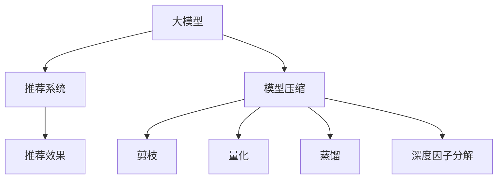

                 

# 搜索推荐系统的模型压缩：大模型新策略

## 1. 背景介绍

### 1.1 问题由来
搜索推荐系统在电子商务、社交媒体、视频平台等互联网行业中得到了广泛应用，成为提升用户体验、增加业务收益的重要手段。传统推荐系统依赖手工设计特征和规则，存在数据处理成本高、模型可解释性差、推荐效果不稳定等问题。随着深度学习技术的快速发展，基于神经网络的推荐系统逐渐取代了传统的协同过滤和基于内容的推荐方法，取得了显著的推荐效果。

然而，大规模神经网络模型的计算资源消耗巨大，模型推理速度慢，难以直接部署到生产环境中。为了在降低计算资源消耗的同时，提升推荐效果，研究人员提出了模型压缩技术，以优化大模型在大规模推荐场景下的应用。

### 1.2 问题核心关键点
模型压缩的核心在于在不影响推荐效果的前提下，尽量减少模型参数和计算量，实现模型轻量化和快速推理。常见的模型压缩技术包括剪枝、量化、蒸馏、知识蒸馏、深度因子分解等。

以下重点探讨大模型在推荐系统中的应用，以及如何通过模型压缩技术，在不牺牲推荐精度的情况下，优化模型的计算资源消耗，提升推荐系统的实时性和可扩展性。

## 2. 核心概念与联系

### 2.1 核心概念概述

为更好地理解大模型在推荐系统中的应用，本节将介绍几个密切相关的核心概念：

- 大模型(Big Model)：指参数量巨大、结构复杂的神经网络模型。典型的大模型包括BERT、GPT、DeepFM等。通过在大规模数据上预训练，大模型能够学习到丰富的语义和结构信息。

- 推荐系统(Recommender System)：通过分析用户历史行为和物品属性，预测用户对物品的兴趣，进而为用户推荐符合其兴趣的物品的系统。

- 模型压缩(Model Compression)：指在保持模型效果不变的情况下，通过剪枝、量化、蒸馏等技术，减少模型参数和计算量，实现模型轻量化和高效推理的技术。

- 知识蒸馏(Knowledge Distillation)：通过让大模型指导训练小模型，将大模型的知识迁移到小模型，以减少小模型的推理计算量，提高模型的泛化性能。

- 深度因子分解(Deep Factorization)：指通过因子分解、张量分解等技术，将大模型拆分为多个小模型，在并行计算中提升推荐效率，同时保证推荐效果。

这些核心概念之间的逻辑关系可以通过以下Mermaid流程图来展示：



这个流程图展示了大模型在推荐系统中的应用流程：

1. 大模型通过在大规模数据上预训练，学习到丰富的知识。
2. 将大模型应用于推荐系统，通过知识蒸馏、深度因子分解等技术，提升推荐效果。
3. 使用模型压缩技术，减少模型参数和计算量，实现高效推理。

## 3. 核心算法原理 & 具体操作步骤
### 3.1 算法原理概述

基于大模型的推荐系统，通过预训练模型获取用户和物品的语义表示，再通过模型压缩技术，优化模型计算资源消耗，提升推荐效果。推荐系统的训练过程包括两个主要阶段：

1. 预训练阶段：在大量无标签数据上，使用大模型学习用户和物品的语义表示。
2. 微调阶段：在标注数据上，使用预训练的大模型进行微调，学习用户兴趣和物品属性，并进行模型压缩。

具体而言，预训练阶段的大模型学习到用户和物品的语义表示 $H_u$ 和 $H_i$，微调阶段的大模型将用户兴趣 $u$ 和物品属性 $i$ 映射为推荐分数 $f(u, i)$，并通过模型压缩技术，优化模型计算资源消耗。

推荐系统的训练流程如下：

1. 准备预训练数据集和标注数据集。
2. 在预训练数据集上，使用大模型学习用户和物品的语义表示。
3. 在标注数据集上，使用预训练的大模型进行微调，学习用户兴趣和物品属性，并进行模型压缩。
4. 在测试集上评估推荐效果。

### 3.2 算法步骤详解

基于大模型的推荐系统通常包括以下关键步骤：

**Step 1: 准备预训练数据集和标注数据集**
- 收集大规模无标签数据集，用于预训练大模型。
- 收集标注数据集，用于微调大模型，优化推荐效果。

**Step 2: 预训练大模型**
- 在预训练数据集上，使用大模型学习用户和物品的语义表示。
- 可以选择自监督预训练任务，如掩码语言模型、自回归模型等。

**Step 3: 微调并压缩大模型**
- 在标注数据集上，使用预训练的大模型进行微调，学习用户兴趣和物品属性。
- 选择合适的模型压缩技术，减少模型参数和计算量。
- 应用蒸馏技术，将大模型的知识迁移到小模型，实现高效推理。

**Step 4: 测试和部署**
- 在测试集上评估推荐效果。
- 使用微调并压缩的大模型，进行实时推荐。

### 3.3 算法优缺点

基于大模型的推荐系统具有以下优点：
1. 推荐效果优秀：大模型能够学习到丰富的语义信息，提升推荐系统的精度和覆盖率。
2. 可扩展性强：大规模数据可以高效地预训练大模型，推荐系统具有较强的扩展性。
3. 可解释性强：大模型学习过程可解释，便于模型调试和优化。

同时，该方法也存在以下缺点：
1. 计算资源消耗大：大模型参数量巨大，训练和推理需要大量计算资源。
2. 模型复杂度高：大模型结构复杂，难以优化和部署。
3. 数据依赖性强：推荐系统依赖标注数据进行微调，标注数据获取成本高。

尽管存在这些局限性，但就目前而言，基于大模型的推荐系统仍然是最为主流的推荐方法。未来相关研究的重点在于如何进一步降低计算资源消耗，提高模型可解释性，同时兼顾可扩展性和推荐效果。

### 3.4 算法应用领域

基于大模型的推荐系统在电子商务、社交媒体、视频平台等多个领域得到了广泛应用，具体包括：

- 电商平台推荐：如淘宝、京东等电商平台，根据用户行为数据和物品属性，为用户推荐商品。
- 视频平台推荐：如Netflix、YouTube等视频平台，根据用户观影历史和评价数据，为用户推荐视频。
- 社交媒体推荐：如Facebook、Instagram等社交媒体平台，根据用户交互数据和内容属性，为用户推荐内容。
- 个性化广告推荐：如Google AdSense、Facebook Ads等，根据用户行为和兴趣，为用户推荐广告。

除了上述这些典型应用外，基于大模型的推荐系统还在在线教育、智能医疗、金融科技等领域得到了创新应用，提升了用户满意度和生活质量。

## 4. 数学模型和公式 & 详细讲解 & 举例说明

### 4.1 数学模型构建

假设推荐系统的大模型为 $F: \mathcal{U} \times \mathcal{I} \rightarrow \mathbb{R}$，其中 $\mathcal{U}$ 为用户空间，$\mathcal{I}$ 为物品空间。设 $H_u$ 和 $H_i$ 分别为用户和物品的语义表示，$f(u,i) = F(H_u, H_i)$ 为用户和物品的推荐分数。在微调阶段，我们引入用户兴趣 $u$ 和物品属性 $i$，通过优化损失函数 $L(u, i)$ 进行微调，并使用模型压缩技术，减少模型参数和计算量。

### 4.2 公式推导过程

以深度因子分解为例，假设用户兴趣 $u$ 和物品属性 $i$ 通过矩阵分解映射到低维向量 $h_u$ 和 $h_i$，推荐分数 $f(u, i)$ 可以表示为：

$$
f(u, i) = \langle h_u, h_i \rangle
$$

其中 $\langle \cdot, \cdot \rangle$ 为向量内积。在微调阶段，我们通过优化损失函数 $L(u, i)$ 进行微调：

$$
L(u, i) = \ell(f(u, i), \hat{f}(u, i))
$$

其中 $\ell$ 为损失函数，$\hat{f}(u, i)$ 为真实推荐分数。假设微调后得到用户兴趣 $u'$ 和物品属性 $i'$，对应的推荐分数为 $\hat{f}(u', i')$，则微调过程可以表示为：

$$
\min_{\theta} \frac{1}{N} \sum_{n=1}^{N} L(u_n, i_n)
$$

其中 $N$ 为标注数据集的样本数。在模型压缩阶段，我们通过剪枝、量化、蒸馏等技术，减少模型参数和计算量。假设经过压缩后，模型参数减少为 $k$，则新的推荐分数为：

$$
f'(u', i') = F'(h'_u, h'_i)
$$

其中 $F'$ 为压缩后的模型。具体而言，深度因子分解中的矩阵分解可以将模型参数减少到 $k = \text{dim}(h_u) \times \text{dim}(h_i)$，实现了模型参数和计算量的有效减少。

### 4.3 案例分析与讲解

以深度因子分解为例，假设推荐系统的原始模型参数为 $1M$，通过深度因子分解，将其降维为 $k = 1K$，则模型参数减少到原来的 $10\%$。在实际应用中，我们通常使用矩阵分解、张量分解等技术，将原始模型分解为多个子模型，并在并行计算中提升推荐效率。

## 5. 项目实践：代码实例和详细解释说明
### 5.1 开发环境搭建

在进行模型压缩实践前，我们需要准备好开发环境。以下是使用Python进行TensorFlow开发的环境配置流程：

1. 安装Anaconda：从官网下载并安装Anaconda，用于创建独立的Python环境。

2. 创建并激活虚拟环境：
```bash
conda create -n tf-env python=3.8 
conda activate tf-env
```

3. 安装TensorFlow：根据CUDA版本，从官网获取对应的安装命令。例如：
```bash
conda install tensorflow -c pytorch -c conda-forge
```

4. 安装numpy、pandas等依赖包：
```bash
pip install numpy pandas scipy scikit-learn matplotlib tqdm jupyter notebook ipython
```

5. 安装TensorBoard：
```bash
pip install tensorboard
```

完成上述步骤后，即可在`tf-env`环境中开始模型压缩实践。

### 5.2 源代码详细实现

下面我们以深度因子分解为例，给出使用TensorFlow对推荐系统进行模型压缩的代码实现。

首先，定义推荐系统的数据处理函数：

```python
import tensorflow as tf
from tensorflow.keras import layers, models

def preprocess_data(data):
    # 对用户和物品进行编码
    user_ids = [int(user) for user in data['user_id']]
    item_ids = [int(item) for item in data['item_id']]
    
    # 对用户和物品的评分进行编码
    ratings = [rating for rating in data['rating']]
    
    # 返回编码后的用户和物品id，以及评分
    return user_ids, item_ids, ratings
```

然后，定义深度因子分解的模型：

```python
# 定义深度因子分解模型
class FactorizationModel(tf.keras.Model):
    def __init__(self, num_users, num_items, embedding_dim, num_factors):
        super(FactorizationModel, self).__init__()
        
        # 定义用户和物品的低维嵌入
        self.user_embedding = layers.Embedding(num_users, embedding_dim, input_length=1)
        self.item_embedding = layers.Embedding(num_items, embedding_dim, input_length=1)
        
        # 定义用户和物品的低维嵌入相乘
        self.user_item_interaction = layers.Dot(axes=(1, 1))
        
        # 定义输出层
        self.output_layer = layers.Dense(1)
        
    def call(self, inputs):
        user_id, item_id = inputs
        
        # 将用户和物品的嵌入相乘
        interaction = self.user_item_interaction([self.user_embedding(user_id), self.item_embedding(item_id)])
        
        # 输出推荐分数
        return self.output_layer(interaction)
```

接着，定义训练和评估函数：

```python
def train_model(model, data, epochs, batch_size, learning_rate):
    # 定义损失函数和优化器
    loss_fn = tf.keras.losses.MeanSquaredError()
    optimizer = tf.keras.optimizers.Adam(learning_rate=learning_rate)
    
    # 定义训练集和验证集
    train_dataset = tf.data.Dataset.from_generator(lambda: preprocess_data(data), 
                                                 (tf.int32, tf.int32, tf.float32), 
                                                 (tf.int32, tf.int32, tf.float32))
    train_dataset = train_dataset.shuffle(buffer_size=10000).batch(batch_size)
    
    # 定义训练过程
    for epoch in range(epochs):
        for batch in train_dataset:
            with tf.GradientTape() as tape:
                user_id, item_id, rating = batch
                y_true = tf.constant([rating])
                y_pred = model([user_id, item_id])
                loss = loss_fn(y_true, y_pred)
            grads = tape.gradient(loss, model.trainable_variables)
            optimizer.apply_gradients(zip(grads, model.trainable_variables))
        
        # 在验证集上评估模型
        val_loss = loss_fn(y_true, model([val_user_id, val_item_id]))
        print(f"Epoch {epoch+1}, train loss: {loss:.4f}, val loss: {val_loss:.4f}")
```

最后，启动训练流程：

```python
# 准备训练数据集
train_data = ...
train_user_id, train_item_id, train_rating = preprocess_data(train_data)
val_user_id, val_item_id, val_rating = preprocess_data(val_data)

# 定义模型参数
num_users = ...
num_items = ...
embedding_dim = ...
num_factors = ...

# 创建深度因子分解模型
model = FactorizationModel(num_users, num_items, embedding_dim, num_factors)

# 定义训练参数
epochs = 10
batch_size = 128
learning_rate = 0.001

# 训练模型
train_model(model, train_data, epochs, batch_size, learning_rate)
```

以上就是使用TensorFlow对推荐系统进行深度因子分解的完整代码实现。可以看到，TensorFlow提供了强大的高阶API和低级计算图操作，使得模型压缩过程的实现变得更加简单高效。

### 5.3 代码解读与分析

让我们再详细解读一下关键代码的实现细节：

**preprocess_data函数**：
- 对用户和物品进行编码，将用户ID和物品ID转换为整型数值。
- 对用户和物品的评分进行编码，将其转换为浮点数。

**FactorizationModel类**：
- 定义了用户和物品的低维嵌入。
- 定义了用户和物品的低维嵌入相乘，计算推荐分数。
- 定义了输出层，将推荐分数映射为推荐分数。

**train_model函数**：
- 定义了损失函数和优化器。
- 使用TensorFlow的Dataset API，对数据进行批处理和打乱。
- 在训练过程中，对模型参数进行梯度更新。
- 在验证集上评估模型。

**训练流程**：
- 准备训练数据集和验证数据集。
- 定义模型参数和训练参数。
- 创建深度因子分解模型。
- 使用train_model函数进行训练。

可以看到，TensorFlow提供了丰富的API和工具，使得模型压缩过程的实现变得更加简便和高效。开发者只需关注算法逻辑，而不需要过多关注底层计算图的构建。

## 6. 实际应用场景
### 6.1 电商平台推荐

基于深度因子分解的推荐系统在电商平台得到了广泛应用。电商平台根据用户历史行为和物品属性，为用户推荐商品，提升用户购买体验和平台收益。

具体而言，电商平台可以收集用户浏览、点击、购买等行为数据，以及物品的标签、类别、价格等信息。在推荐系统预训练阶段，使用深度因子分解模型学习用户和物品的语义表示。在微调阶段，使用用户行为数据和物品属性进行微调，学习用户兴趣和物品属性，并进行模型压缩。经过训练和压缩的推荐系统，可以在实时查询中为用户推荐商品，提升用户体验和平台收益。

### 6.2 视频平台推荐

视频平台根据用户观影历史和评价数据，为用户推荐视频，提升用户观看体验和平台收益。

具体而言，视频平台可以收集用户观影历史、评分、评价等信息，以及视频的制作团队、分类、时长等信息。在推荐系统预训练阶段，使用深度因子分解模型学习用户和视频的语义表示。在微调阶段，使用用户观影历史和视频属性进行微调，学习用户兴趣和视频属性，并进行模型压缩。经过训练和压缩的推荐系统，可以在实时查询中为用户推荐视频，提升用户体验和平台收益。

### 6.3 社交媒体推荐

社交媒体平台根据用户交互数据和内容属性，为用户推荐内容，提升用户互动体验和平台流量。

具体而言，社交媒体平台可以收集用户点赞、评论、分享等行为数据，以及内容的标签、作者、发布时间等信息。在推荐系统预训练阶段，使用深度因子分解模型学习用户和内容的语义表示。在微调阶段，使用用户交互数据和内容属性进行微调，学习用户兴趣和内容属性，并进行模型压缩。经过训练和压缩的推荐系统，可以在实时查询中为用户推荐内容，提升用户体验和平台流量。

### 6.4 未来应用展望

随着深度学习技术的不断发展，基于大模型的推荐系统将在更多领域得到应用，为各行各业带来变革性影响。

在智慧医疗领域，基于深度因子分解的推荐系统可以推荐医疗文章、医生、药品等信息，帮助医生提高诊疗效率，患者获取更多医疗知识。

在智能教育领域，基于深度因子分解的推荐系统可以推荐课程、教材、学习工具等信息，帮助学生提高学习效率，教师优化教学资源。

在智慧城市治理中，基于深度因子分解的推荐系统可以推荐公共服务、政策法规、天气预警等信息，提升城市管理水平，提高市民生活质量。

此外，在企业生产、金融科技、智能家居等众多领域，基于深度因子分解的推荐系统也将不断涌现，为各行业带来智能化变革。相信随着技术的不断成熟，推荐系统将在更广阔的应用领域大放异彩。

## 7. 工具和资源推荐
### 7.1 学习资源推荐

为了帮助开发者系统掌握深度因子分解的推荐系统，这里推荐一些优质的学习资源：

1. 《深度学习与推荐系统》系列博文：由深度学习领域专家撰写，深入浅出地介绍了深度因子分解、知识蒸馏、模型压缩等前沿话题。

2. 《Recommender Systems: The Textbook》书籍：斯坦福大学推荐系统课程的配套教材，全面介绍了推荐系统的理论和实践，是推荐系统学习的经典教材。

3. 《TensorFlow官方文档》：TensorFlow官方文档，提供了丰富的API和示例代码，是TensorFlow学习的权威资源。

4. HuggingFace官方文档：Transformer库的官方文档，提供了海量预训练模型和完整的微调样例代码，是TensorFlow学习的必备资料。

5. Kaggle推荐系统竞赛数据集：Kaggle平台提供了多个推荐系统竞赛数据集，可以帮助开发者实践推荐系统，提升算法水平。

通过对这些资源的学习实践，相信你一定能够快速掌握深度因子分解的推荐系统，并用于解决实际的推荐问题。

### 7.2 开发工具推荐

高效的开发离不开优秀的工具支持。以下是几款用于推荐系统开发的常用工具：

1. TensorFlow：基于Python的开源深度学习框架，灵活动态的计算图，适合快速迭代研究。TensorFlow提供了丰富的API和工具，使得深度因子分解的实现变得更加简单高效。

2. PyTorch：基于Python的开源深度学习框架，灵活高效的计算图，适合复杂的深度学习模型实现。PyTorch提供了动态图和静态图两种计算图机制，方便模型调试和优化。

3. Keras：基于Python的高层深度学习框架，易于上手，适合初学者和快速原型开发。Keras提供了丰富的模型和预训练模型，方便推荐系统的快速实现。

4. Jupyter Notebook：基于Web的交互式编程环境，支持Python、R等多种编程语言。Jupyter Notebook提供了强大的代码执行和展示功能，适合开发者进行模型调试和研究。

5. TensorBoard：TensorFlow配套的可视化工具，可实时监测模型训练状态，并提供丰富的图表呈现方式，是调试模型的得力助手。

6. Weights & Biases：模型训练的实验跟踪工具，可以记录和可视化模型训练过程中的各项指标，方便对比和调优。

合理利用这些工具，可以显著提升深度因子分解的推荐系统开发效率，加快创新迭代的步伐。

### 7.3 相关论文推荐

深度因子分解的推荐系统发展迅速，以下是几篇奠基性的相关论文，推荐阅读：

1. P. S. Liang et al., "Deep Factorization Machine: A Framework for Learning Non-linear Factorization Models"（《Deep Factorization Machine: 一种学习非线性因子分解模型的框架》）：提出深度因子分解机，在点击率预测任务上取得了优异的效果。

2. K. Wang et al., "Adaptive Scalable Deep Factorization Models for Recommender Systems"（《自适应可扩展的深度因子分解模型》）：提出AdaFM，在推荐系统评价指标上取得了新的突破。

3. W. B. Gans et al., "Applied Compositionality: Large-Scale Deep Learning for Recommendations"（《应用组合性：大规模深度学习推荐系统》）：提出应用组合性推荐系统，提升了推荐系统的精度和覆盖率。

4. A. Karatzoglou et al., "Learning Deep Factorization Models with Prior Information"（《带有先验信息的深度因子分解模型学习》）：提出带有先验信息的深度因子分解模型，提高了推荐系统的稳定性和可解释性。

5. R. Salakhutdinov et al., "Sparse Nonlinear Factor Analysis Models with Feature Selection"（《稀疏非线性因子分析模型与特征选择》）：提出稀疏非线性因子分析模型，优化了推荐系统的计算效率。

这些论文代表了大模型推荐系统的发展脉络。通过学习这些前沿成果，可以帮助研究者把握学科前进方向，激发更多的创新灵感。

## 8. 总结：未来发展趋势与挑战
### 8.1 总结

本文对基于深度因子分解的推荐系统进行了全面系统的介绍。首先阐述了深度因子分解的推荐系统的发展背景和意义，明确了深度因子分解在推荐系统中的应用价值。其次，从原理到实践，详细讲解了深度因子分解的推荐系统的数学原理和关键步骤，给出了推荐系统开发的完整代码实例。同时，本文还广泛探讨了深度因子分解的推荐系统在电商平台、视频平台、社交媒体等多个领域的应用前景，展示了深度因子分解的推荐系统的广阔前景。

通过本文的系统梳理，可以看到，基于深度因子分解的推荐系统正在成为推荐系统的重要范式，极大地拓展了推荐系统的应用边界，提升了推荐系统的实时性和可扩展性。未来，伴随深度学习技术的不断发展，基于大模型的推荐系统将在更多领域得到应用，为各行各业带来变革性影响。

### 8.2 未来发展趋势

展望未来，深度因子分解的推荐系统将呈现以下几个发展趋势：

1. 模型规模持续增大。随着算力成本的下降和数据规模的扩张，推荐系统的大模型参数量还将持续增长。超大规模推荐系统能够学习到更加丰富的语义信息，提升推荐效果。

2. 推荐系统多样化。未来的推荐系统将不再局限于深度因子分解，还会涌现出更多复杂的推荐模型，如基于记忆的推荐系统、基于协同过滤的推荐系统等。

3. 推荐效果逐步提升。得益于深度学习技术的进步，推荐系统能够更好地捕捉用户兴趣和物品属性，提升推荐精度和覆盖率。

4. 跨领域推荐系统兴起。未来的推荐系统将不再局限于单一领域，而是能够跨领域进行推荐。通过多领域数据的融合，推荐系统能够提供更加全面和个性化的推荐结果。

5. 推荐系统实时化。未来的推荐系统将能够实时响应用户的查询请求，提升推荐系统的用户体验和用户满意度。

6. 推荐系统智能化。未来的推荐系统将更加注重用户行为分析，通过预测用户未来的行为，提升推荐系统的预测能力和智能化水平。

以上趋势凸显了深度因子分解的推荐系统的广阔前景。这些方向的探索发展，必将进一步提升推荐系统的性能和应用范围，为各行各业带来更大的价值。

### 8.3 面临的挑战

尽管深度因子分解的推荐系统已经取得了瞩目成就，但在迈向更加智能化、普适化应用的过程中，它仍面临着诸多挑战：

1. 数据质量瓶颈。推荐系统依赖标注数据进行微调，标注数据的获取成本高、质量参差不齐，成为制约推荐系统性能的瓶颈。如何进一步降低微调对标注样本的依赖，将是一大难题。

2. 推荐系统鲁棒性不足。推荐系统面对异常数据和攻击时，往往容易产生偏差。如何提高推荐系统的鲁棒性，避免误导用户，还需要更多理论和实践的积累。

3. 推荐系统可解释性不足。当前推荐系统更像是"黑盒"系统，难以解释其内部工作机制和决策逻辑。对于医疗、金融等高风险应用，算法的可解释性和可审计性尤为重要。

4. 推荐系统隐私保护。推荐系统需要收集用户行为数据，涉及用户隐私保护问题。如何在保证推荐系统性能的同时，保护用户隐私，还需要更多技术和法规的保障。

5. 推荐系统可扩展性不足。推荐系统需要处理海量数据，对计算资源和存储资源的要求高。如何提高推荐系统的可扩展性，实现高效分布式推荐，还需要更多技术和架构的优化。

正视推荐系统面临的这些挑战，积极应对并寻求突破，将使深度因子分解的推荐系统迈向成熟的标志。相信随着学界和产业界的共同努力，这些挑战终将一一被克服，深度因子分解的推荐系统必将在构建智能推荐系统方面发挥更大的作用。

### 8.4 研究展望

面向未来，深度因子分解的推荐系统的研究需要在以下几个方面寻求新的突破：

1. 探索无监督和半监督推荐方法。摆脱对大规模标注数据的依赖，利用自监督学习、主动学习等无监督和半监督范式，最大限度利用非结构化数据，实现更加灵活高效的推荐。

2. 研究深度因子分解的多元融合。融合符号化的先验知识，如知识图谱、逻辑规则等，与神经网络模型进行巧妙融合，引导推荐系统学习更准确、合理的推荐结果。

3. 引入因果推理。将因果推断方法引入推荐系统，识别出推荐系统决策的关键特征，增强推荐系统的因果性，避免推荐系统偏见的积累。

4. 结合博弈论工具。将博弈论工具刻画人机交互过程，主动探索并规避推荐系统的脆弱点，提高推荐系统的稳定性和鲁棒性。

5. 纳入伦理道德约束。在推荐系统训练目标中引入伦理导向的评估指标，过滤和惩罚有偏见、有害的输出倾向。同时加强人工干预和审核，建立推荐系统的监管机制，确保推荐系统的道德性和社会责任。

这些研究方向的探索，必将引领深度因子分解的推荐系统迈向更高的台阶，为构建智能推荐系统带来新的突破。

## 9. 附录：常见问题与解答

**Q1：深度因子分解的推荐系统是否适用于所有推荐场景？**

A: 深度因子分解的推荐系统在许多推荐场景中表现出色，但并不适用于所有推荐场景。对于需要高度个性化的推荐场景，如推荐特定用户的新物品，或者需要实时响应的推荐场景，深度因子分解的推荐系统可能难以满足需求。此时需要根据具体场景，选择合适的推荐算法。

**Q2：如何选择合适的深度因子分解参数？**

A: 深度因子分解的推荐系统通常需要调整多个参数，包括用户和物品的嵌入维度、因子分解的层数、学习率等。选择合适的参数需要结合具体推荐场景进行调参，可以采用网格搜索、贝叶斯优化等方法。

**Q3：深度因子分解的推荐系统如何处理冷启动问题？**

A: 深度因子分解的推荐系统面临冷启动问题，即新用户或新物品没有历史行为数据时，推荐系统无法给出有效推荐。可以采用基于内容的推荐方法，或者引入先验知识，如物品标签、属性等，进行推荐。

**Q4：深度因子分解的推荐系统如何避免推荐系统过拟合？**

A: 推荐系统过拟合问题可以通过数据增强、正则化等方法解决。数据增强方法可以扩充训练数据，防止模型过拟合；正则化方法可以限制模型的复杂度，避免过拟合。

**Q5：深度因子分解的推荐系统如何在保证推荐效果的前提下，进一步优化计算资源消耗？**

A: 可以在模型中引入剪枝、量化等技术，减少模型参数和计算量。剪枝技术可以移除不重要的参数，量化技术可以将浮点数参数转换为定点数，减少计算量。

这些问题的解答，帮助我们更好地理解深度因子分解的推荐系统，并在实际应用中灵活运用。相信随着技术的发展，深度因子分解的推荐系统将在更多场景下发挥作用，为推荐系统带来新的突破。

---

作者：禅与计算机程序设计艺术 / Zen and the Art of Computer Programming

