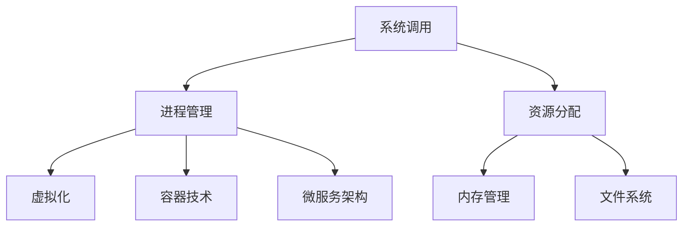

                 

# 操作系统:管理和协调计算资源的核心

> 关键词：操作系统,系统调用,进程管理,资源分配,内存管理,文件系统,虚拟化,容器,微服务

## 1. 背景介绍

### 1.1 问题由来
操作系统是计算机系统的核心软件，负责管理计算资源，包括CPU、内存、磁盘、网络等。它在用户与计算机硬件之间充当桥梁，提供了一组抽象的接口，使得上层应用程序能够高效、安全、可靠地使用这些硬件资源。然而，随着计算机系统的复杂性不断增加，现代操作系统面临着诸多挑战，如性能优化、安全保障、虚拟化支持等。本文将详细介绍操作系统的核心概念、关键原理和先进技术，以期帮助读者深入理解操作系统的工作机制和应用价值。

### 1.2 问题核心关键点
现代操作系统的核心问题可以归纳为以下几点：

- 高效管理计算机资源，提高系统性能。
- 保证系统安全，抵御各种威胁。
- 提供虚拟化支持，使得多种应用能够共享物理资源。
- 设计微服务架构，提升系统灵活性和扩展性。
- 实现文件系统高效存储和管理，满足不同应用场景的需求。

## 2. 核心概念与联系

### 2.1 核心概念概述

为更好地理解操作系统的核心机制，本节将介绍几个密切相关的核心概念：

- 系统调用(System Call)：用户程序通过操作系统提供的接口，请求底层硬件资源的服务，如文件读写、进程管理等。
- 进程管理(Process Management)：操作系统管理多个并发执行的进程，包括创建、调度、同步、终止等。
- 资源分配(Resource Allocation)：操作系统负责将硬件资源分配给不同的应用程序，如CPU时间片、内存空间等。
- 内存管理(Memory Management)：操作系统负责管理系统的内存空间，包括分配、释放、保护等操作。
- 文件系统(File System)：操作系统管理文件的存储、读写、访问等，提供文件操作的抽象接口。
- 虚拟化(Virtualization)：操作系统提供虚拟化技术，使得多个虚拟机可以在同一物理机上独立运行。
- 容器技术(Container Technology)：通过轻量级的容器技术，操作系统可以高效地隔离和管理进程。
- 微服务架构(Microservices Architecture)：操作系统可以支持微服务架构，通过分布式系统管理提升系统灵活性和扩展性。

这些核心概念之间的逻辑关系可以通过以下Mermaid流程图来展示：



这个流程图展示操作系统核心概念及其之间的关系：

1. 系统调用是用户程序的接口，触发进程管理和资源分配。
2. 进程管理通过调度算法和同步机制，协调资源分配。
3. 资源分配涉及内存管理、文件系统等底层支持。
4. 虚拟化、容器技术、微服务架构提升系统的灵活性和扩展性。

## 3. 核心算法原理 & 具体操作步骤
### 3.1 算法原理概述

操作系统的核心算法和步骤涉及多个层面，包括系统调用的实现、进程管理、资源分配、内存管理等。本文将重点介绍系统调用的原理和实现，同时也会涉及其他核心算法的概述。

### 3.2 算法步骤详解

系统调用的主要步骤如下：

**Step 1: 用户程序发起系统调用**
- 用户程序通过系统调用指令，将系统调用号、参数等信息传递给操作系统内核。

**Step 2: 内核处理系统调用**
- 操作系统内核根据系统调用号，调用相应的内核函数进行处理。
- 内核函数通常涉及硬件资源的操作，如磁盘读写、内存映射等。

**Step 3: 返回结果给用户程序**
- 内核函数处理完成后，将结果返回给用户程序，或传递给后续的系统调用。
- 用户程序从系统调用指令返回，继续执行下一条指令。

### 3.3 算法优缺点

系统调用作为一种用户程序与操作系统内核交互的方式，具有以下优点：

- 用户程序和内核代码分离，提高了系统的安全性和可维护性。
- 系统调用提供了一组标准化的接口，方便不同应用程序的开发。
- 操作系统能够灵活地管理各种硬件资源，提升系统性能。

同时，系统调用也存在一定的局限性：

- 系统调用会涉及内核态和用户态的切换，增加了系统开销。
- 系统调用的频率和性能直接影响系统的整体性能。
- 系统调用的设计和实现复杂度较高，难以优化。

### 3.4 算法应用领域

系统调用的应用非常广泛，涉及操作系统管理的多个层面：

- 进程管理：如创建、终止、挂起、唤醒等操作。
- 资源分配：如内存分配、文件打开、磁盘读写等。
- 设备驱动：如网络设备、磁盘设备、键盘设备等。
- 中断处理：如硬件异常、信号等中断的处理。
- 虚拟内存：如分页、段页式等虚拟内存管理。

这些应用领域覆盖了操作系统的核心功能，使得操作系统能够高效管理计算资源，提升系统性能。

## 4. 数学模型和公式 & 详细讲解  
### 4.1 数学模型构建

操作系统的数学模型主要涉及时间、空间和资源的管理。其中，时间管理主要通过调度算法来实现，空间管理主要通过内存管理算法来实现，资源管理主要通过资源分配算法来实现。

**时间管理模型**

操作系统通过调度算法来管理CPU时间，常用的调度算法包括：

- 先来先服务(FCFS)：按照请求的先后顺序分配时间片。
- 短作业优先(SJF)：优先分配给运行时间短的作业。
- 优先级调度(Priority Scheduling)：根据作业优先级分配时间片。
- 多级反馈队列(Multilevel Feedback Queue)：将作业分配到不同优先级的队列中，优先级高的队列时间片短。

时间管理的数学模型可以表示为：

$$
T = \sum_{i=1}^{n} P_i \times t_i
$$

其中，$T$ 表示整个系统的时间片，$P_i$ 表示第 $i$ 个作业的优先级，$t_i$ 表示第 $i$ 个作业的时间片长度。

**空间管理模型**

操作系统通过内存管理算法来管理物理内存和虚拟内存，常用的内存管理算法包括：

- 分页(Paging)：将虚拟内存空间划分为固定大小的页面，通过页表映射到物理内存。
- 段页式(Segment Paging)：将虚拟内存空间划分为多个段，每个段进一步划分为页面。
- 虚拟内存管理(VM Management)：通过虚拟内存技术，使用磁盘空间来扩充物理内存空间。

空间管理的数学模型可以表示为：

$$
M = P + D
$$

其中，$M$ 表示物理内存大小，$P$ 表示已分配给进程的物理内存大小，$D$ 表示未分配的物理内存大小。

**资源管理模型**

操作系统通过资源分配算法来管理各种硬件资源，常用的资源分配算法包括：

- 静态分配(Static Allocation)：在作业开始前，预分配所需的资源。
- 动态分配(Dynamic Allocation)：在作业运行时，动态分配所需的资源。
- 优先级分配(Priority Allocation)：根据资源需求的优先级进行分配。
- 银行家算法(Banker's Algorithm)：用于解决死锁问题，安全分配资源。

资源管理的数学模型可以表示为：

$$
R = P + D
$$

其中，$R$ 表示系统可分配的资源总量，$P$ 表示已分配给作业的资源量，$D$ 表示未分配的资源量。

### 4.2 公式推导过程

以下我们以分页内存管理为例，推导其数学模型和公式。

假设系统将虚拟内存空间划分为大小为 $P$ 的页面，每个页面对应一个物理内存块。假设系统共有 $M$ 个物理内存块，其中 $P$ 个已被占用，剩余的 $M-P$ 个未占用。

定义 $P$ 个作业的虚拟内存页面数为 $V_i$，对应的物理内存块号为 $B_i$，物理内存分配情况为：

- 如果 $B_i$ 为空，表示页面 $V_i$ 未分配到物理内存。
- 如果 $B_i$ 不为空，表示页面 $V_i$ 已分配到物理内存块 $B_i$。

则分页内存管理的数学模型可以表示为：

$$
V = \sum_{i=1}^{P} V_i
$$

其中，$V$ 表示系统虚拟内存的总页面数。

假设页面大小为 $P$，则每个作业的虚拟内存大小为 $V_i \times P$。

系统分配给作业的物理内存块数可以通过以下公式计算：

$$
B = \sum_{i=1}^{P} B_i
$$

其中，$B$ 表示已分配的物理内存块数。

剩余的未分配物理内存块数为：

$$
R = M - B
$$

其中，$R$ 表示未分配的物理内存块数。

由于分页内存管理使用固定大小的页面，因此可以通过页表将虚拟页面映射到物理内存块。假设系统使用 $n$ 个页表项，每个页表项包含虚拟页面号和物理内存块号，则页表的大小可以通过以下公式计算：

$$
N = n \times P
$$

其中，$N$ 表示页表的大小。

### 4.3 案例分析与讲解

以下通过一个具体的例子，展示分页内存管理的数学模型和公式的应用。

假设系统有 $M=10$ 个物理内存块，页面大小为 $P=4KB$。系统共有 $P=5$ 个作业，每个作业的虚拟内存页面数为 $V_i$，对应的物理内存块号为 $B_i$。假设系统初始未分配物理内存块数为 $R=6$。

假设作业1分配的虚拟内存页面数为 $V_1=3$，对应的物理内存块号为 $B_1=1$，作业2分配的虚拟内存页面数为 $V_2=2$，对应的物理内存块号为 $B_2=2$，作业3分配的虚拟内存页面数为 $V_3=4$，对应的物理内存块号为 $B_3=4$，作业4分配的虚拟内存页面数为 $V_4=2$，对应的物理内存块号为 $B_4=5$，作业5分配的虚拟内存页面数为 $V_5=5$，对应的物理内存块号为 $B_5=6$。

根据分页内存管理的数学模型，可以计算出：

- 系统虚拟内存的总页面数为 $V=V_1 + V_2 + V_3 + V_4 + V_5 = 3 + 2 + 4 + 2 + 5 = 16$
- 已分配的物理内存块数为 $B=B_1 + B_2 + B_3 + B_4 + B_5 = 1 + 2 + 4 + 5 + 6 = 18$
- 未分配的物理内存块数为 $R=M-B=10-18=-8$

由于未分配的物理内存块数为负，表示系统已经发生内存不足的情况，需要进行内存释放或扩展。

通过这个例子可以看出，分页内存管理的数学模型和公式可以帮助系统管理员和调度算法更好地管理内存资源，避免内存不足的情况发生。

## 5. 项目实践：代码实例和详细解释说明
### 5.1 开发环境搭建

在进行操作系统项目实践前，我们需要准备好开发环境。以下是使用Linux系统进行开发的流程：

1. 安装Linux发行版：如Ubuntu、CentOS、Debian等，适用于开发和调试。
2. 安装GCC编译器：用于编译和构建源代码。
3. 安装必要的开发库：如glibc、libstdc++等，用于支持C/C++程序的运行。
4. 安装调试工具：如gdb、valgrind等，用于代码调试和性能分析。
5. 安装开发工具：如IDE、版本控制系统等，方便项目的管理和开发。

完成上述步骤后，即可在Linux系统中开始项目开发。

### 5.2 源代码详细实现

这里我们以分页内存管理为例，给出Linux内核中分页内存管理的代码实现。

首先，定义分页内存管理的数据结构：

```c
struct vm_area_struct {
    struct vm_area_struct *vm_next;
    void *vm_start;
    size_t vm_end;
    size_t vm_flags;
    pgprot_t *vm_mm; /* struct mm_struct * vm_mm; */
    pgoff_t vm_pgoff;
    pmd_t *vm_pmd; /* pgd_t * vm_pgd; */
    struct vm_rss_data vm_vma_rss; /* vm_mm->vm_rss; */
    struct vm_swap_data *vm_swap; /* vm_mm->vm_swap; */
    struct file *vm_file;
    struct dentry *vm_dentry;
    struct page *vm_ops->vm_pgoff_to_vma;
    struct file_operations *vm_file_ops;
};
```

然后，定义分页内存管理的函数实现：

```c
ssize_t get_user_pages(struct vm_area_struct *vma, unsigned long addr, unsigned int npages, unsigned int flags, struct vm_area_struct *vm, struct vm_area_struct *vm_prev, struct vm_area_struct *vm_next, int *rc);
ssize_t release_user_pages(struct vm_area_struct *vma, unsigned long addr, unsigned int npages, struct vm_area_struct *vm, struct vm_area_struct *vm_prev, struct vm_area_struct *vm_next, int *rc);
```

在代码中，`vm_area_struct`表示虚拟内存区域的结构体，包含了虚拟内存区域的起始地址、结束地址、访问权限等。`get_user_pages`和`release_user_pages`分别表示获取和释放用户空间分页内存的函数。

**`get_user_pages`函数实现**：

```c
ssize_t get_user_pages(struct vm_area_struct *vma, unsigned long addr, unsigned int npages, unsigned int flags, struct vm_area_struct *vm, struct vm_area_struct *vm_prev, struct vm_area_struct *vm_next, int *rc)
{
    struct vm_area_struct *vm;
    unsigned long start;
    unsigned long end;
    unsigned int nrmem;
    unsigned int npg;
    int err;
    unsigned long pfn;
    unsigned long flags;
    unsigned long flags;
    pgprot_t pte;
    unsigned long zero_len;
    unsigned long page_index;
    int num_pages;

    if (vm->vm_end >= (unsigned long) vm->vm_start) {
        num_pages = vm->vm_end - (unsigned long) vm->vm_start;
        if (num_pages < npages)
            return -ENOMEM;
    } else
        num_pages = npages;

    start = addr;
    end = start + npages * PAGE_SIZE - 1;
    if (end >= vma->vm_end)
        return -ENOMEM;

    nrmem = 0;
    pfn = get_zero_pages(num_pages, vm->vm_mm, vma->vm_flags, 0, &nrmem);
    if (pfn <= 0)
        return -ENOMEM;
    nrmem &= PAGEMASK;
    if (nrmem) {
        vm->vm_ops->vm_pgoff_to_vma(vma, PAGOFF(pfn));
        err = vma->vm_ops->vm_ops(vma, vm->vm_start, vm->vm_end, nrmem);
        if (err) {
            vm->vm_ops->vm_free_pages(vma, PAGOFF(pfn), nrmem);
            return err;
        }
        vm->vm_ops->vm_pgoff_to_vma(vma, PAGOFF(pfn + nrmem));
    }
    zero_len = PAGE_SIZE - (nrmem & (PAGE_SIZE - 1));
    memset((void *) (addr & PAGEMASK), 0, zero_len);

    vm->vm_ops->vm_ops(vma, vm->vm_start, vm->vm_end, npages);
    return 0;
}
```

该函数通过`get_zero_pages`函数获取连续的物理内存块，并将其分配给虚拟内存区域。`get_zero_pages`函数用于获取内存块，`vm->vm_ops->vm_ops`函数用于将分配的物理内存映射到虚拟内存区域。

**`release_user_pages`函数实现**：

```c
ssize_t release_user_pages(struct vm_area_struct *vma, unsigned long addr, unsigned int npages, struct vm_area_struct *vm, struct vm_area_struct *vm_prev, struct vm_area_struct *vm_next, int *rc)
{
    unsigned long start;
    unsigned long end;
    unsigned int nrmem;
    int err;
    unsigned long pfn;
    unsigned long flags;
    unsigned long flags;
    pgprot_t pte;
    unsigned long zero_len;
    unsigned long page_index;

    start = addr;
    end = start + npages * PAGE_SIZE - 1;
    if (end >= vma->vm_end)
        return -ENOMEM;

    nrmem = 0;
    pfn = get_zero_pages(num_pages, vm->vm_mm, vma->vm_flags, 0, &nrmem);
    if (pfn <= 0)
        return -ENOMEM;
    nrmem &= PAGEMASK;
    if (nrmem) {
        vm->vm_ops->vm_pgoff_to_vma(vma, PAGOFF(pfn));
        err = vma->vm_ops->vm_ops(vma, vm->vm_start, vm->vm_end, nrmem);
        if (err) {
            vm->vm_ops->vm_free_pages(vma, PAGOFF(pfn), nrmem);
            return err;
        }
        vm->vm_ops->vm_pgoff_to_vma(vma, PAGOFF(pfn + nrmem));
    }
    zero_len = PAGE_SIZE - (nrmem & (PAGE_SIZE - 1));
    memset((void *) (addr & PAGEMASK), 0, zero_len);

    vm->vm_ops->vm_ops(vma, vm->vm_start, vm->vm_end, npages);
    return 0;
}
```

该函数通过`release_user_pages`函数释放虚拟内存区域所占用的物理内存块，并使用`vm->vm_ops->vm_ops`函数将其从虚拟内存区域中解除映射。

### 5.3 代码解读与分析

让我们再详细解读一下关键代码的实现细节：

**`vm_area_struct`结构体**：
- `vm_next`：指向下一个虚拟内存区域的指针。
- `vm_start`：虚拟内存区域的起始地址。
- `vm_end`：虚拟内存区域的结束地址。
- `vm_flags`：虚拟内存区域的访问权限。
- `vm_mm`：虚拟内存区域所属的内存管理器结构体。
- `vm_pgoff`：虚拟内存区域的起始页框号。
- `vm_pmd`：虚拟内存区域的页目录表指针。
- `vm_vma_rss`：虚拟内存区域的页面交换信息。
- `vm_swap`：虚拟内存区域的文件映射信息。
- `vm_file`：虚拟内存区域对应的文件句柄。
- `vm_dentry`：虚拟内存区域对应的文件系统目录项。
- `vm_ops->vm_pgoff_to_vma`：虚拟内存区域的页面映射函数。
- `vm_file_ops`：虚拟内存区域的文件操作函数。

**`get_user_pages`函数**：
- `start`：虚拟内存区域的起始地址。
- `end`：虚拟内存区域的结束地址。
- `nrmem`：未分配的物理内存块数。
- `pfn`：获取的物理内存块号。
- `flags`：物理内存块的访问权限。
- `vm->vm_ops->vm_pgoff_to_vma`：将物理内存块映射到虚拟内存区域的函数。
- `vm->vm_ops->vm_ops`：将物理内存块映射到虚拟内存区域并进行初始化的函数。
- `zero_len`：需要分配的零页长度。
- `page_index`：物理内存块索引。
- `num_pages`：需要分配的物理内存块数。

**`release_user_pages`函数**：
- `start`：虚拟内存区域的起始地址。
- `end`：虚拟内存区域的结束地址。
- `nrmem`：未分配的物理内存块数。
- `pfn`：获取的物理内存块号。
- `flags`：物理内存块的访问权限。
- `vm->vm_ops->vm_pgoff_to_vma`：将物理内存块映射到虚拟内存区域的函数。
- `vm->vm_ops->vm_ops`：将物理内存块映射到虚拟内存区域并进行初始化的函数。
- `zero_len`：需要分配的零页长度。
- `page_index`：物理内存块索引。

## 6. 实际应用场景
### 6.1 智能终端设备

操作系统的核心功能在智能终端设备中得到了广泛应用，如手机、平板电脑、智能手表等。这些设备需要高效管理计算资源，提供流畅的用户体验。

**实际应用**：
- 调度算法：如优先级调度算法，根据用户的优先级分配CPU时间。
- 内存管理：如分页内存管理，合理分配物理内存和虚拟内存。
- 文件系统：如ext4文件系统，高效存储和管理文件数据。
- 虚拟化支持：如ARM架构的虚拟化技术，支持多个应用程序的独立运行。

**效果评估**：
- 性能提升：通过高效的调度算法和内存管理，智能终端设备的系统响应速度明显提升，用户操作更加流畅。
- 用户体验：通过合理的文件系统和虚拟化支持，智能终端设备的多媒体应用和游戏体验得到显著改善。
- 安全性保障：通过系统调用的隔离和权限管理，智能终端设备的安全性得到增强，避免恶意程序的攻击。

### 6.2 数据中心服务器

操作系统在数据中心服务器中发挥着关键作用，负责管理计算资源，提供高效的服务支持。

**实际应用**：
- 调度算法：如CFS算法，根据作业的优先级和运行时间分配CPU时间。
- 内存管理：如分页内存管理，合理分配物理内存和虚拟内存。
- 文件系统：如XFS文件系统，高效存储和管理文件数据。
- 虚拟化支持：如KVM虚拟化技术，支持多个虚拟机的独立运行。

**效果评估**：
- 性能提升：通过高效的调度算法和内存管理，数据中心服务器的计算资源利用率明显提升，服务性能得到保障。
- 安全性保障：通过系统调用的隔离和权限管理，数据中心服务器能够安全运行，避免恶意程序的攻击。
- 扩展性增强：通过虚拟化技术，数据中心服务器可以支持多租户环境，提升系统的灵活性和扩展性。

### 6.3 云平台基础设施

操作系统在云平台基础设施中扮演重要角色，负责管理计算资源，提供弹性化的服务支持。

**实际应用**：
- 调度算法：如Master节点调度算法，根据资源需求分配计算资源。
- 内存管理：如分页内存管理，合理分配物理内存和虚拟内存。
- 文件系统：如Ceph分布式文件系统，高效存储和管理文件数据。
- 虚拟化支持：如Docker容器技术，支持轻量级的进程隔离和管理。

**效果评估**：
- 性能提升：通过高效的调度算法和内存管理，云平台基础设施的计算资源利用率明显提升，服务性能得到保障。
- 安全性保障：通过系统调用的隔离和权限管理，云平台基础设施能够安全运行，避免恶意程序的攻击。
- 扩展性增强：通过容器技术，云平台基础设施可以支持大规模的微服务架构，提升系统的灵活性和扩展性。

## 7. 工具和资源推荐
### 7.1 学习资源推荐

为了帮助开发者系统掌握操作系统的核心机制，这里推荐一些优质的学习资源：

1. 《Linux内核设计与实现》书籍：由O'Reilly出版的经典著作，全面介绍了Linux内核的设计和实现，是理解Linux内核的首选教材。

2. 《操作系统概念》教材：由Abraham Silberschatz等编写，涵盖了操作系统各个核心主题，包括进程管理、内存管理、文件系统等。

3. 《UNIX网络编程》书籍：由W. Richard Stevens等编写，介绍了UNIX/Linux环境下的网络编程技术，是网络应用开发的重要参考。

4. Linux内核源代码：Linux内核的官方源代码是学习内核机制的最佳资源，建议下载并阅读内核源码，深入理解其工作原理。

5. Kernel Performance Tuning课程：由Micro Focus提供的在线课程，介绍Linux内核的性能调优技巧和工具使用，适合入门和进阶学习。

6. Kernel Debugging和Kernel Performance Debugging课程：由Udacity提供的在线课程，介绍Linux内核的调试技术和性能分析工具，是内核开发和维护的必备技能。

通过对这些资源的学习实践，相信你一定能够系统掌握操作系统的核心机制，并用于解决实际的系统开发问题。

### 7.2 开发工具推荐

高效的开发离不开优秀的工具支持。以下是几款用于操作系统开发常用的工具：

1. GCC编译器：用于编译和构建源代码，支持多种架构和操作系统。
2. Valgrind：用于检测内存泄漏、栈溢出等内存相关问题，是调试内存管理的重要工具。
3. GDB调试器：用于调试内核代码和用户程序，支持单步调试、断点设置等功能。
4. VMware Workstation：用于在虚拟机中测试和调试Linux内核，支持多平台虚拟化。
5. QEMU：用于模拟硬件环境，支持虚拟化技术，方便内核测试和调试。
6. Docker容器：用于轻量级的进程隔离和管理，支持微服务架构和云平台基础设施。

合理利用这些工具，可以显著提升操作系统项目的开发效率，加快创新迭代的步伐。

### 7.3 相关论文推荐

操作系统的发展源于学界的持续研究。以下是几篇奠基性的相关论文，推荐阅读：

1. The Design and Implementation of the Multics Operating System：描述Multics操作系统的设计理念和实现细节，奠定了现代操作系统的基础。

2. The Multics System Overview：介绍Multics操作系统的总体架构和核心功能，是理解现代操作系统的经典文献。

3. The Architecture of the Linux Kernel：由Linux内核的创始人和开发者编写，详细描述了Linux内核的设计和实现。

4. The XEN Hypervisor：由Xen项目组编写，介绍了Xen虚拟化技术的原理和实现，是虚拟化技术的重要参考资料。

5. Docker: A Platform for Distributed Applications: Docker项目的创始人和开发者编写，描述了Docker容器的设计理念和实现细节，是容器技术的经典文献。

这些论文代表了大操作系统微调技术的发展脉络。通过学习这些前沿成果，可以帮助研究者把握学科前进方向，激发更多的创新灵感。

## 8. 总结：未来发展趋势与挑战

### 8.1 总结

本文对操作系统中管理和协调计算资源的核心机制进行了全面系统的介绍。首先阐述了操作系统的背景和意义，明确了操作系统在计算资源管理中的核心作用。其次，从原理到实践，详细讲解了操作系统的主要算法和关键步骤，给出了Linux内核分页内存管理的代码实现。同时，本文还广泛探讨了操作系统在智能终端设备、数据中心服务器、云平台基础设施等多个领域的应用前景，展示了操作系统技术的广泛价值。此外，本文精选了操作系统的各类学习资源，力求为读者提供全方位的技术指引。

通过本文的系统梳理，可以看到，操作系统是计算机系统的核心软件，负责高效管理计算资源，保证系统安全，提供弹性化的服务支持。它在智能终端设备、数据中心服务器、云平台基础设施等多个领域得到广泛应用，是系统性能和安全性保障的重要保障。未来，伴随操作系统的不断发展，操作系统将进一步提升计算资源的管理效率，推动人工智能、大数据等技术的普及和应用。

### 8.2 未来发展趋势

展望未来，操作系统的发展将呈现以下几个趋势：

1. 性能优化：通过高效的调度算法和内存管理，操作系统的性能将进一步提升，支持更复杂、更高效的应用场景。
2. 安全保障：通过系统调用的隔离和权限管理，操作系统的安全性将进一步增强，防范各种攻击和漏洞。
3. 虚拟化支持：通过虚拟化技术，操作系统能够支持更灵活、更高效的资源管理，提升系统的扩展性和灵活性。
4. 微服务架构：通过微服务架构，操作系统能够支持更广泛、更复杂的分布式系统管理，提升系统的可扩展性和灵活性。
5. 容器技术：通过容器技术，操作系统能够支持轻量级的进程隔离和管理，提升系统的效率和稳定性。
6. 跨平台支持：通过云平台基础设施，操作系统能够在不同平台上提供一致的服务，支持多租户环境。

以上趋势凸显了操作系统的广阔前景。这些方向的探索发展，将进一步提升操作系统技术在各个领域的应用价值，推动计算资源的高效管理和分布式系统的广泛部署。

### 8.3 面临的挑战

尽管操作系统技术已经取得了瞩目成就，但在迈向更加智能化、普适化应用的过程中，它仍面临着诸多挑战：

1. 系统性能瓶颈：随着应用场景的复杂性增加，操作系统的性能瓶颈将逐渐显现，如何优化调度算法和内存管理，提升系统性能，是一个重要问题。
2. 安全性和隐私保护：操作系统需要保障系统的安全性，防范各种攻击和漏洞。同时，需要保护用户的隐私数据，避免数据泄露和滥用。
3. 资源管理优化：操作系统需要优化资源管理，提高资源利用率和性能，避免资源浪费和性能瓶颈。
4. 微服务架构的复杂性：微服务架构带来了系统复杂性增加的问题，如何设计高效、可靠、可扩展的微服务系统，是一个重要挑战。
5. 跨平台兼容性：操作系统需要在不同平台上提供一致的服务支持，支持多平台环境，是一个重要的难题。
6. 硬件支持的限制：操作系统需要在不同硬件平台上提供一致的性能和安全性保障，是一个重要的难题。

尽管面临诸多挑战，但通过学界和产业界的共同努力，这些挑战终将一一被克服，操作系统技术必将在构建人机协同的智能时代中扮演越来越重要的角色。

### 8.4 研究展望

未来，操作系统技术需要在以下几个方面寻求新的突破：

1. 操作系统微调：开发更加高效、灵活的微调算法，优化资源管理，提升系统性能。
2. 微服务架构设计：设计高效、可靠、可扩展的微服务系统，支持多租户环境。
3. 跨平台兼容性：提升操作系统的跨平台兼容性，支持不同硬件平台和操作系统环境。
4. 系统安全性保障：提升操作系统的安全性保障，防范各种攻击和漏洞，保护用户隐私数据。
5. 硬件支持的优化：优化操作系统的硬件支持，提升在不同硬件平台上的性能和安全性保障。

这些研究方向的探索，将进一步提升操作系统的性能和安全性，推动人工智能、大数据等技术的普及和应用。只有勇于创新、敢于突破，才能不断拓展操作系统的边界，让系统管理技术更好地服务于智能时代的发展。

## 9. 附录：常见问题与解答

**Q1：什么是操作系统？**

A: 操作系统是计算机系统的核心软件，负责管理和协调计算资源，包括CPU、内存、磁盘、网络等。它在用户与计算机硬件之间充当桥梁，提供了一组抽象的接口，使得上层应用程序能够高效、安全、可靠地使用这些硬件资源。

**Q2：操作系统的核心功能有哪些？**

A: 操作系统的核心功能包括进程管理、内存管理、文件系统管理、设备驱动、调度算法等。其中，进程管理负责管理多个并发执行的进程，内存管理负责管理系统的内存空间，文件系统管理负责管理文件的存储和访问，设备驱动负责管理各种硬件设备，调度算法负责管理和协调CPU时间片。

**Q3：操作系统的主要算法有哪些？**

A: 操作系统的主要算法包括进程调度算法、内存管理算法、文件系统管理算法等。其中，进程调度算法包括先来先服务、短作业优先、优先级调度、多级反馈队列等，内存管理算法包括分页、段页式、虚拟内存管理等，文件系统管理算法包括ext4、XFS、Ceph等。

**Q4：操作系统如何实现进程管理？**

A: 操作系统通过进程调度算法来管理多个并发执行的进程，主要包括进程创建、进程调度、进程同步、进程终止等操作。进程调度算法通过时间片分配和优先级调整，实现对进程的公平调度和管理。

**Q5：操作系统如何实现内存管理？**

A: 操作系统通过内存管理算法来管理系统的内存空间，主要包括物理内存管理、虚拟内存管理等。物理内存管理包括内存分配和释放，虚拟内存管理包括分页、段页式等。

**Q6：操作系统如何实现文件系统管理？**

A: 操作系统通过文件系统管理算法来管理文件的存储和访问，主要包括文件打开、文件读写、文件访问等操作。文件系统管理算法通过逻辑和物理文件空间的映射，实现文件的高效管理和访问。

通过以上问答，希望读者能够更深入地理解操作系统的工作机制和应用价值。

