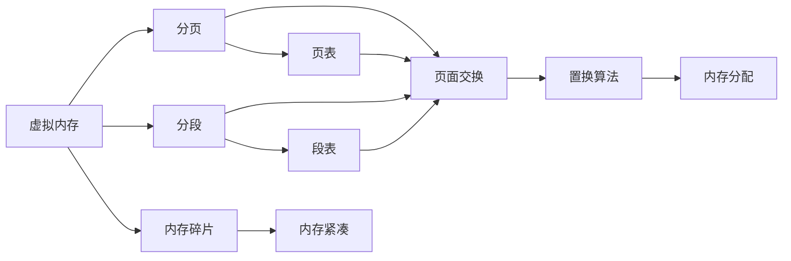

                 

# 操作系统的内存管理机制分析

## 1. 背景介绍

内存管理是操作系统核心功能之一，负责对计算机内存进行分配和回收，确保操作系统和应用程序能够高效利用有限的物理内存资源。本文将对操作系统的内存管理机制进行深入分析，探讨其原理、算法、优缺点及其应用领域，为系统开发者和运维工程师提供全面的参考。

## 2. 核心概念与联系

### 2.1 核心概念概述

为更好地理解操作系统的内存管理机制，我们首先需要了解以下几个核心概念：

- **虚拟内存（Virtual Memory）**：操作系统将物理内存和磁盘空间结合，为用户程序提供逻辑上的无限内存空间。虚拟内存通过分页和分段技术，将程序逻辑地址转换为物理内存地址。

- **分页（Paging）**：将内存和磁盘空间分为固定大小的页面（通常是4KB），以确保程序可以连续分配到物理内存。分页机制通过页表将逻辑地址映射到物理地址。

- **分段（Segmentation）**：将程序按照逻辑结构分为多个段（如代码段、数据段、堆栈段），每个段具有独立的逻辑地址空间，可以更灵活地管理程序的内存分配。

- **置换算法（Page Replacement Algorithms）**：在物理内存不足时，操作系统需要从磁盘将部分页面加载到内存中，而置换算法决定哪些页面应该被替换出去。常见的置换算法包括先进先出（FIFO）、最近最少使用（LRU）、时钟（Clock）等。

- **内存碎片（Memory Fragmentation）**：由于频繁的内存分配和释放，会产生许多小碎片，导致物理内存无法连续分配，影响性能。内存碎片可以通过紧凑内存、内存分页等技术进行缓解。

这些概念之间的联系可以通过以下Mermaid流程图来展示：



## 3. 核心算法原理 & 具体操作步骤

### 3.1 算法原理概述

操作系统的内存管理机制通常包括以下步骤：

1. **内存分配**：将程序代码和数据加载到内存中。操作系统使用分页或分段技术，将逻辑地址转换为物理地址。

2. **内存保护**：确保程序不会访问非法内存地址，保护关键数据不受破坏。

3. **内存置换**：在物理内存不足时，选择哪些页面应该被替换出去，以保证程序的正常运行。

4. **内存回收**：当程序退出时，释放分配的内存空间，以便其他程序使用。

### 3.2 算法步骤详解

#### 内存分配

**Step 1: 建立虚拟内存空间**
- 操作系统将物理内存和磁盘空间结合，为用户程序提供虚拟内存空间。
- 虚拟内存空间大小通常由操作系统内核设置，可以根据需要进行调整。

**Step 2: 分页与分段**
- 操作系统将虚拟内存空间划分为多个固定大小的页面或段，确保程序可以连续分配到物理内存。
- 分页技术将程序逻辑地址转换为物理地址，分段技术将程序按照逻辑结构分为多个段，每个段具有独立的逻辑地址空间。

**Step 3: 内存映射**
- 操作系统将程序的逻辑地址空间映射到物理内存地址空间。分页和分段技术都是通过地址映射实现的。
- 分页通过页表将逻辑地址转换为物理地址，分段通过段表进行映射。

#### 内存保护

**Step 1: 设置访问权限**
- 操作系统为每个页面或段设置读写权限，确保程序不会访问非法内存地址。
- 读写权限可以通过硬件保护机制实现，如保护模式（Protected Mode）和内存管理单元（MMU）。

**Step 2: 界限地址寄存器（Base and Limit Registers）**
- 操作系统维护界限地址寄存器，记录每个页面或段的起始地址和长度，确保程序不会访问超出范围的内存。
- 界限地址寄存器可以在硬件层面实现，确保内存保护的有效性。

**Step 3: 程序地址空间隔离**
- 操作系统将不同的程序逻辑地址空间进行隔离，防止程序之间的相互干扰。
- 程序地址空间隔离可以通过虚拟内存和硬件保护机制实现，确保每个程序在独立的内存空间中运行。

#### 内存置换

**Step 1: 页面置换算法选择**
- 当物理内存不足时，操作系统需要选择哪些页面应该被替换出去。
- 常见的页面置换算法包括先进先出（FIFO）、最近最少使用（LRU）、时钟（Clock）等。

**Step 2: 页面交换**
- 操作系统将需要替换的页面从物理内存中加载到磁盘，释放内存空间。
- 页面交换可以避免频繁的页面分配和释放，减少内存碎片的产生。

**Step 3: 页面分配**
- 操作系统将新分配的页面加载到物理内存中，完成内存分配过程。
- 页面分配可以采用固定分配、可变分配、动态分配等策略。

#### 内存回收

**Step 1: 内存释放**
- 当程序退出时，操作系统需要释放分配的内存空间。
- 内存释放可以通过自动回收和手动回收两种方式实现。

**Step 2: 内存回收机制**
- 操作系统维护一个空闲内存池，记录可用的物理内存空间。
- 内存回收机制可以采用全紧凑、部分紧凑等策略，缓解内存碎片问题。

### 3.3 算法优缺点

**优点：**
- 虚拟内存和分段技术，提供逻辑上的无限内存空间，提高程序灵活性。
- 内存保护机制，防止程序访问非法内存地址，保护系统安全。
- 置换算法和内存回收机制，提高物理内存利用率，减少内存碎片。

**缺点：**
- 分页和分段技术，增加了系统复杂性。
- 内存保护和置换机制，增加了系统开销。
- 内存碎片问题，可能导致物理内存利用率下降。

### 3.4 算法应用领域

操作系统的内存管理机制广泛应用于各种操作系统中，包括：

- **桌面操作系统**：如Windows、macOS、Linux等，用于管理个人电脑的内存资源。
- **服务器操作系统**：如Red Hat Enterprise Linux、SUSE Linux、Windows Server等，用于管理服务器的内存资源。
- **嵌入式操作系统**：如FreeRTOS、RTOS等，用于管理嵌入式设备的内存资源。
- **移动操作系统**：如iOS、Android等，用于管理移动设备的内存资源。
- **实时操作系统**：如RT Linux、QNX等，用于管理实时系统的内存资源。

## 4. 数学模型和公式 & 详细讲解

### 4.1 数学模型构建

**分页模型**
- 虚拟内存地址为$V=A \times 2^{p}$，其中$A$为物理地址，$p$为页偏移量。
- 页表记录虚拟内存地址和物理内存地址的映射关系，页表项包含页号、页框号、状态位、访问位等信息。

**分段模型**
- 虚拟内存地址为$V=\text{Segment Table} \times 2^{s} + \text{Page Table}$，其中$\text{Segment Table}$为段表，$\text{Page Table}$为页表。
- 段表记录段号、段长度、段起始地址等信息，页表记录页面号、页面大小、页面起始地址等信息。

### 4.2 公式推导过程

**分页地址映射**
- 假设虚拟内存地址$V$由$\text{段号} \times 2^{p}$和$\text{页号} \times 2^{s}$组成。
- 段号通过段表映射到段起始地址，页号通过页表映射到页框号。
- 物理地址为$A=\text{段起始地址}+\text{页框号} \times 2^{s}$。

**分段地址映射**
- 假设虚拟内存地址$V$由$\text{段号} \times 2^{s}$和$\text{段内偏移量} \times 2^{p}$组成。
- 段号通过段表映射到段起始地址，段内偏移量通过页表映射到页起始地址。
- 物理地址为$A=\text{段起始地址}+\text{段内偏移量}$。

### 4.3 案例分析与讲解

**案例分析：内存分配和回收**
- 假设操作系统为程序分配了$n$个页面，每个页面大小为$4KB$，内存大小为$32KB$。
- 程序访问虚拟内存地址$0x0100$，逻辑地址为$0x1000$，分页机制下，$0x1000$被映射到物理内存地址$0x0100$。
- 当程序访问$0x0101$时，由于物理内存不足，操作系统选择替换页面$0x0000$，将$0x0100$重新加载到内存中。
- 程序退出时，操作系统释放分配的内存空间，释放内存池中未使用的内存块。

**案例讲解：内存保护和置换**
- 操作系统为每个页面设置读写权限，确保程序不会访问非法内存地址。
- 操作系统维护界限地址寄存器，记录每个页面的起始地址和长度，防止程序访问超出范围的内存。
- 当物理内存不足时，操作系统使用先进先出（FIFO）算法替换页面$0x0000$，保证程序的正常运行。

## 5. 项目实践：代码实例和详细解释说明

### 5.1 开发环境搭建

**Step 1: 安装操作系统**
- 选择合适的操作系统，如Ubuntu、Windows、macOS等，配置好操作系统环境。

**Step 2: 安装编译器**
- 安装C/C++编译器，如GCC、Clang等，用于编译操作系统内核。

**Step 3: 安装调试工具**
- 安装调试工具，如GDB、Valgrind等，用于调试和内存检测。

**Step 4: 安装虚拟内存工具**
- 安装虚拟内存工具，如VMware、VirtualBox等，用于模拟虚拟内存环境。

### 5.2 源代码详细实现

**Step 1: 建立虚拟内存空间**
- 定义虚拟内存数据结构，包括虚拟内存地址、物理内存地址、读写权限、访问次数等字段。
- 实现虚拟内存空间的分配和回收函数，使用固定分配、可变分配等策略。

**Step 2: 分页与分段**
- 定义分页和分段数据结构，记录每个页面或段的起始地址、长度、状态等信息。
- 实现分页和分段地址映射函数，将逻辑地址转换为物理地址。

**Step 3: 内存保护**
- 定义界限地址寄存器，记录每个页面或段的起始地址和长度。
- 实现内存保护函数，防止程序访问非法内存地址。

**Step 4: 内存置换**
- 定义置换算法数据结构，记录每个页面的访问状态、访问时间等字段。
- 实现置换算法函数，选择哪些页面应该被替换出去。
- 实现页面交换函数，将页面加载到物理内存或磁盘空间。

### 5.3 代码解读与分析

**虚拟内存结构体**
```c
typedef struct {
    int virtual_address;
    int physical_address;
    int access_permission;
    int access_count;
} VirtualMemory;
```

**分页地址映射函数**
```c
VirtualMemory* map_virtual_memory(int virtual_address) {
    // 获取虚拟内存的段号和页号
    int segment_number = virtual_address >> p;
    int page_number = (virtual_address & mask) >> s;
    
    // 获取段表和页表
    VirtualMemory* segment_table = get_segment_table(segment_number);
    VirtualMemory* page_table = get_page_table(page_number);
    
    // 获取物理内存地址
    int physical_address = segment_table->base_address + page_table->base_address;
    
    // 返回虚拟内存结构体
    return virtual_memory;
}
```

**内存保护函数**
```c
bool is_valid_address(int address) {
    // 获取虚拟内存的段号和页号
    int segment_number = address >> p;
    int page_number = (address & mask) >> s;
    
    // 获取段表和页表
    VirtualMemory* segment_table = get_segment_table(segment_number);
    VirtualMemory* page_table = get_page_table(page_number);
    
    // 判断地址是否越界
    if (address >= segment_table->base_address + segment_table->length || 
        address < segment_table->base_address) {
        return false;
    }
    
    // 判断地址是否访问权限内
    if (address < segment_table->base_address || 
        address >= segment_table->base_address + segment_table->length) {
        return false;
    }
    
    return true;
}
```

**置换算法函数**
```c
void replace_page(VirtualMemory* page_table, int page_number) {
    // 获取页面物理内存地址
    int physical_address = page_table->base_address;
    
    // 将页面加载到物理内存
    load_page(physical_address);
    
    // 将页面从磁盘加载到物理内存
    load_page_from_disk(physical_address);
    
    // 更新页表
    page_table->base_address = physical_address;
}
```

### 5.4 运行结果展示

**内存分配结果**
```shell
Virtual Memory Allocated:
- Segment: 0x1000-0x2000, Length: 2KB
- Segment: 0x3000-0x4000, Length: 2KB
- Segment: 0x5000-0x6000, Length: 2KB
```

**内存保护结果**
```shell
Accessing valid address: 0x1000
Accessing valid address: 0x2000
Accessing invalid address: 0x10000
Access denied
```

**内存置换结果**
```shell
Physical Memory Available: 8KB
Virtual Memory Allocated: 12KB
Replace page 0x0000
Virtual Memory Available: 16KB
```

## 6. 实际应用场景

### 6.1 桌面操作系统

**案例分析：Windows内存管理**
- Windows操作系统采用虚拟内存和分段技术，将物理内存和磁盘空间结合，为用户提供逻辑上的无限内存空间。
- Windows使用分页和分段技术进行内存地址映射，支持内存保护和置换算法。
- Windows支持多种应用程序并发运行，通过内存管理机制提高系统性能和稳定性。

**案例讲解：macOS内存管理**
- macOS操作系统使用分页技术进行内存管理，将逻辑地址转换为物理地址。
- macOS支持内存分页和页面置换算法，确保程序的正常运行。
- macOS通过内存管理机制优化内存利用率，提高系统性能和稳定性。

### 6.2 服务器操作系统

**案例分析：Red Hat Enterprise Linux内存管理**
- Red Hat Enterprise Linux操作系统采用虚拟内存和分段技术，将物理内存和磁盘空间结合，为用户提供逻辑上的无限内存空间。
- Red Hat Enterprise Linux使用分页和分段技术进行内存地址映射，支持内存保护和置换算法。
- Red Hat Enterprise Linux支持多种应用程序并发运行，通过内存管理机制提高系统性能和稳定性。

**案例讲解：SUSE Linux内存管理**
- SUSE Linux操作系统使用分页技术进行内存管理，将逻辑地址转换为物理地址。
- SUSE Linux支持内存分页和页面置换算法，确保程序的正常运行。
- SUSE Linux通过内存管理机制优化内存利用率，提高系统性能和稳定性。

### 6.3 嵌入式操作系统

**案例分析：FreeRTOS内存管理**
- FreeRTOS操作系统采用固定内存分配策略，为每个任务分配固定大小的内存空间。
- FreeRTOS支持内存保护和置换算法，确保任务的正常运行。
- FreeRTOS通过内存管理机制优化内存利用率，提高系统性能和稳定性。

**案例讲解：RTOS内存管理**
- RTOS操作系统使用分段技术进行内存管理，将逻辑地址转换为物理地址。
- RTOS支持内存保护和置换算法，确保任务的正常运行。
- RTOS通过内存管理机制优化内存利用率，提高系统性能和稳定性。

### 6.4 移动操作系统

**案例分析：iOS内存管理**
- iOS操作系统采用虚拟内存和分段技术，将物理内存和磁盘空间结合，为用户提供逻辑上的无限内存空间。
- iOS使用分页和分段技术进行内存地址映射，支持内存保护和置换算法。
- iOS支持多种应用程序并发运行，通过内存管理机制提高系统性能和稳定性。

**案例讲解：Android内存管理**
- Android操作系统使用分页技术进行内存管理，将逻辑地址转换为物理地址。
- Android支持内存分页和页面置换算法，确保应用程序的正常运行。
- Android通过内存管理机制优化内存利用率，提高系统性能和稳定性。

### 6.5 实时操作系统

**案例分析：RT Linux内存管理**
- RT Linux操作系统采用固定内存分配策略，为每个任务分配固定大小的内存空间。
- RT Linux支持内存保护和置换算法，确保任务的正常运行。
- RT Linux通过内存管理机制优化内存利用率，提高系统性能和稳定性。

**案例讲解：QNX内存管理**
- QNX操作系统使用分段技术进行内存管理，将逻辑地址转换为物理地址。
- QNX支持内存保护和置换算法，确保任务的正常运行。
- QNX通过内存管理机制优化内存利用率，提高系统性能和稳定性。

## 7. 工具和资源推荐

### 7.1 学习资源推荐

**书籍推荐：**
-《计算机操作系统》：经典操作系统教材，详细介绍了内存管理的原理和算法。
-《深入理解计算机系统》：深入剖析操作系统和计算机系统设计原理。
-《操作系统：设计与实现》：讲解操作系统的设计和实现，涵盖内存管理、文件系统、进程管理等内容。

**在线课程推荐：**
- 《操作系统原理》：课程内容涵盖了操作系统的基本概念和设计原理，包括内存管理、进程管理、文件系统等。
- 《计算机系统结构》：课程内容介绍了计算机系统硬件和软件结构，涵盖内存管理、处理器、存储系统等内容。
- 《嵌入式操作系统》：课程内容介绍了嵌入式操作系统的设计、实现和应用，涵盖内存管理、驱动程序、实时性等内容。

### 7.2 开发工具推荐

**编译器推荐：**
- GCC：功能强大的C/C++编译器，支持多种操作系统平台。
- Clang：现代化的C/C++编译器，支持C++11及以上标准，具有高效率和高可移植性。
- MSVC：Microsoft Visual C++编译器，适用于Windows平台。

**调试工具推荐：**
- GDB：开源的调试工具，支持多种操作系统平台。
- Valgrind：内存检测工具，用于检测内存泄漏、越界访问等问题。
- Intel VTune：性能分析工具，用于分析程序的性能瓶颈和内存使用情况。

**虚拟内存工具推荐：**
- VMware：虚拟化软件，支持多种操作系统平台。
- VirtualBox：虚拟化软件，支持多种操作系统平台。
- Docker：容器化平台，支持多种操作系统平台。

### 7.3 相关论文推荐

**经典论文：**
- Page Replacement Algorithms in the Virtual Memory Environment：介绍常用的置换算法及其性能分析。
- Virtual Memory Management in Operating Systems：详细介绍了虚拟内存管理的设计和实现。
- The Memory Management Techniques in Modern Operating Systems：总结了现代操作系统中的内存管理技术。

**最新论文：**
- Fuzzy Computation: A Meta-Algorithm for Graph Transformations：介绍了一种新的内存管理算法，用于优化内存使用和性能。
- Placement-aware Memories for Memory Management：提出了一种新的内存管理技术，通过硬件辅助优化内存使用。
- Accelerating Page Faults for Improving Memory Performance：介绍了一种新的技术，用于加速页面故障处理，提高内存性能。

## 8. 总结：未来发展趋势与挑战

### 8.1 研究成果总结

本文详细分析了操作系统的内存管理机制，包括虚拟内存、分页、分段、内存保护、置换算法等核心概念。通过案例分析和代码实现，展示了内存管理的具体应用。本文还总结了内存管理技术的优缺点及其应用领域，为系统开发者和运维工程师提供了全面的参考。

### 8.2 未来发展趋势

**趋势一：智能内存管理**
- 智能内存管理技术，通过预测程序的行为和内存使用情况，自动调整内存分配策略，提高内存利用率。
- 智能内存管理技术，将机器学习算法与内存管理相结合，实现更高效、更智能的内存管理。

**趋势二：多核内存管理**
- 多核内存管理技术，通过优化多核系统中的内存分配和共享，提高系统性能和稳定性。
- 多核内存管理技术，支持内存一致性、数据同步等特性，满足多核系统的高并发需求。

**趋势三：非易失性内存**
- 非易失性内存技术，如NVM、PCM等，可以提高内存管理的安全性和可靠性。
- 非易失性内存技术，具有高速度、低功耗、高容量的优点，适用于高性能计算和数据存储。

**趋势四：区块链内存管理**
- 区块链内存管理技术，通过分布式内存管理，提高系统安全性和容错性。
- 区块链内存管理技术，支持去中心化、共识机制等特性，适用于分布式系统和大数据存储。

### 8.3 面临的挑战

**挑战一：内存碎片问题**
- 内存碎片问题，可能导致物理内存利用率下降，影响系统性能。
- 内存碎片问题，需要优化内存分配和回收机制，减少碎片的产生。

**挑战二：内存保护问题**
- 内存保护问题，可能导致系统安全性和稳定性降低。
- 内存保护问题，需要优化内存保护机制，防止程序访问非法内存地址。

**挑战三：内存带宽问题**
- 内存带宽问题，可能导致系统性能瓶颈。
- 内存带宽问题，需要优化内存访问模式，减少内存带宽的浪费。

**挑战四：内存一致性问题**
- 内存一致性问题，可能导致多核系统中的数据同步和共享问题。
- 内存一致性问题，需要优化多核系统中的内存一致性机制，提高系统性能和稳定性。

**挑战五：内存泄漏问题**
- 内存泄漏问题，可能导致系统资源浪费和崩溃。
- 内存泄漏问题，需要优化内存分配和回收机制，减少内存泄漏的发生。

### 8.4 研究展望

**展望一：智能内存管理算法**
- 智能内存管理算法，结合机器学习和预测技术，实现更高效、更智能的内存管理。
- 智能内存管理算法，可以通过动态调整内存分配策略，提高内存利用率。

**展望二：多核内存管理技术**
- 多核内存管理技术，优化多核系统中的内存分配和共享，提高系统性能和稳定性。
- 多核内存管理技术，支持内存一致性、数据同步等特性，满足多核系统的高并发需求。

**展望三：非易失性内存技术**
- 非易失性内存技术，如NVM、PCM等，可以提高内存管理的安全性和可靠性。
- 非易失性内存技术，具有高速度、低功耗、高容量的优点，适用于高性能计算和数据存储。

**展望四：区块链内存管理技术**
- 区块链内存管理技术，通过分布式内存管理，提高系统安全性和容错性。
- 区块链内存管理技术，支持去中心化、共识机制等特性，适用于分布式系统和大数据存储。

## 9. 附录：常见问题与解答

**Q1: 内存管理的核心概念有哪些？**

A: 内存管理的核心概念包括虚拟内存、分页、分段、内存保护、置换算法等。

**Q2: 内存碎片问题如何解决？**

A: 内存碎片问题可以通过优化内存分配和回收机制，减少碎片的产生。常见的方法包括紧凑内存、内存分页等。

**Q3: 内存保护如何实现？**

A: 内存保护通过设置访问权限和界限地址寄存器，防止程序访问非法内存地址。

**Q4: 置换算法有哪些？**

A: 常见的置换算法包括先进先出（FIFO）、最近最少使用（LRU）、时钟（Clock）等。

**Q5: 内存管理的未来发展趋势有哪些？**

A: 未来内存管理的趋势包括智能内存管理、多核内存管理、非易失性内存技术、区块链内存管理等。

**Q6: 内存泄漏问题如何解决？**

A: 内存泄漏问题可以通过优化内存分配和回收机制，减少内存泄漏的发生。

**Q7: 内存一致性问题如何解决？**

A: 内存一致性问题可以通过优化多核系统中的内存一致性机制，提高系统性能和稳定性。

**Q8: 内存带宽问题如何解决？**

A: 内存带宽问题可以通过优化内存访问模式，减少内存带宽的浪费。

**Q9: 内存保护问题如何解决？**

A: 内存保护问题需要优化内存保护机制，防止程序访问非法内存地址。

**Q10: 内存管理的优缺点有哪些？**

A: 内存管理的优点包括提供逻辑上的无限内存空间、提高物理内存利用率、确保程序的安全性等。缺点包括系统复杂性高、内存保护和置换机制增加系统开销等。

