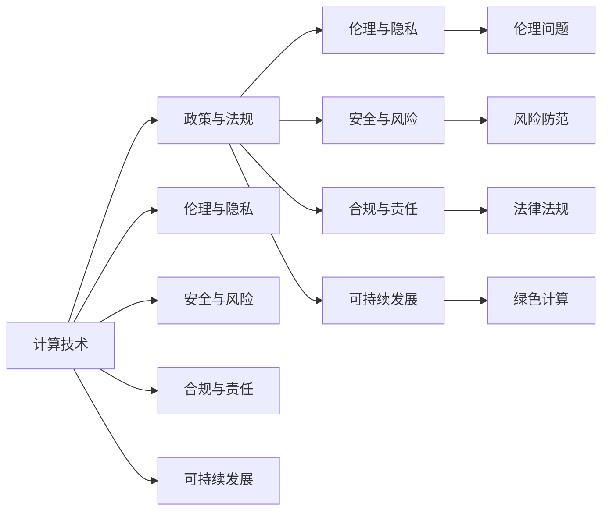

                 

## 1. 背景介绍

在当今数字化时代，计算技术的应用范围和深度已深入社会的方方面面。从科学研究到商业运营，从日常生活到公共治理，计算技术正在以前所未有的速度改变着人类社会的发展轨迹。然而，随着计算技术影响力的不断扩大，其对社会、经济、伦理、安全等方面的影响也日益凸显。

政策与监管作为社会治理的重要工具，对于引导和规范计算技术的应用、确保其健康发展具有不可或缺的作用。本文旨在系统梳理计算领域的政策与监管框架，深入探讨其核心问题与挑战，并展望未来发展趋势。

## 2. 核心概念与联系

### 2.1 核心概念概述

计算领域的政策与监管涉及多方面的核心概念：

- **计算技术**：涵盖计算机科学、人工智能、数据科学等领域的理论和实践，是政策与监管的对象。
- **政策与法规**：包括国家层面的法律法规、行业规范、标准体系等，用于指导和规范计算技术的应用。
- **伦理与隐私**：计算技术在数据处理、算法偏见、决策透明性等方面涉及的伦理问题，以及对个人隐私的潜在威胁。
- **安全与风险**：计算技术带来的网络安全、数据泄露、人工智能攻击等风险，以及相关防护措施。
- **合规与责任**：企业在计算技术应用中需要遵守的法律法规，以及违反法规可能承担的法律责任。
- **可持续发展**：计算技术对环境资源的消耗，以及如何实现节能减排、绿色计算等目标。

这些核心概念相互联系，共同构成了计算领域的政策与监管体系。通过对其深入理解，可以为制定和执行相关政策与法规提供科学依据。

### 2.2 核心概念原理和架构的 Mermaid 流程图



这个流程图展示了计算技术及其政策与监管体系的构成及其相互关系。其中，计算技术是政策与法规的出发点，而伦理、隐私、安全、合规和可持续发展是政策与法规需要考虑的主要方面。

## 3. 核心算法原理 & 具体操作步骤

### 3.1 算法原理概述

计算领域的政策与监管主要涉及以下几个核心算法原理：

- **数据保护算法**：用于确保个人数据在处理、存储和传输过程中的安全性。
- **隐私计算算法**：在保护数据隐私的前提下，实现数据的共享与分析。
- **算法公平性算法**：通过调整算法参数，减少算法偏见，提高算法决策的公平性。
- **风险评估算法**：用于评估计算技术对社会、经济、伦理等各方面的潜在风险。
- **合规检测算法**：通过自动化手段，检查计算技术应用是否符合法律法规。

这些算法原理共同构成了政策与监管的基础，为制定和执行相关政策提供了技术支持。

### 3.2 算法步骤详解

基于上述算法原理，计算领域的政策与监管大致包括以下几个关键步骤：

1. **数据隐私保护**：通过数据加密、去标识化等技术，确保个人数据在处理、存储和传输过程中不被泄露或滥用。

2. **隐私计算实践**：采用多方安全计算、联邦学习等技术，在保护数据隐私的前提下，实现数据的联合分析或共享。

3. **算法公平性评估**：通过测试集、交叉验证等方法，评估算法在不同群体中的表现，识别和消除算法偏见。

4. **风险评估与管理**：使用风险评估算法，对计算技术应用进行全面的风险评估，制定相应的管理措施。

5. **合规检测与监控**：通过自动化工具和系统，对计算技术应用进行合规性检测，及时发现并纠正违规行为。

### 3.3 算法优缺点

#### 优点

- **提升数据安全与隐私保护**：通过先进的数据保护算法，可以有效防范数据泄露和滥用，保护个人隐私。
- **促进算法公平与透明**：通过算法公平性算法，减少算法偏见，提高算法决策的透明度和公平性。
- **降低风险与合规成本**：通过风险评估和管理，及时发现并应对潜在的风险，降低合规成本和法律风险。

#### 缺点

- **技术复杂度较高**：先进的数据保护和隐私计算算法需要较高的技术门槛，实施难度较大。
- **成本投入较大**：实施隐私计算等技术需要较大的资金投入，中小企业难以承担。
- **法律与标准滞后**：现有的法律法规和标准可能滞后于技术发展，难以全面覆盖新兴技术应用。

### 3.4 算法应用领域

计算领域的政策与监管广泛应用于以下主要领域：

- **金融科技**：涉及个人金融数据保护、算法公平性、风险管理等方面。
- **医疗健康**：关注患者数据隐私、算法公平性、医疗决策透明度等。
- **公共治理**：包括政府数据开放、算法透明性、风险防范等。
- **电子商务**：涉及消费者数据保护、广告算法公平性、隐私计算等。
- **社交媒体**：关注用户隐私保护、算法偏见、内容审查合规性等。

这些领域的政策与监管实践，为计算技术的安全、公平、透明和可持续应用提供了重要保障。

## 4. 数学模型和公式 & 详细讲解

### 4.1 数学模型构建

计算领域的政策与监管涉及多个数学模型，以下是几个核心模型的构建：

- **隐私保护模型**：通过矩阵乘法和向量空间技术，构建隐私保护算法，如差分隐私、同态加密等。
- **公平性评估模型**：使用统计学和机器学习技术，评估算法在不同群体中的表现，如均值差异、偏差系数等。
- **风险评估模型**：通过量化和模拟技术，评估计算技术应用的风险，如贝叶斯网络、决策树等。

### 4.2 公式推导过程

以差分隐私为例，其数学模型可以表示为：

$$
\Delta = \epsilon \sqrt{2\ln(1/\delta)}
$$

其中 $\epsilon$ 为隐私参数，$\delta$ 为数据泄露的概率。该公式用于计算数据扰动的大小，从而保护数据隐私。

在公平性评估中，均值差异的计算公式为：

$$
D(X,Y) = \frac{1}{2} \left[ |\mu_X - \mu_Y| + |\mu_Y - \mu_X| \right]
$$

其中 $X$ 和 $Y$ 分别表示不同群体的数据集，$\mu_X$ 和 $\mu_Y$ 分别为两个群体的均值。该公式用于衡量算法在不同群体中的均值差异。

在风险评估中，可以使用贝叶斯网络表示潜在风险的因果关系：

$$
P(R_i \mid C_j) = \frac{P(R_i)P(C_j \mid R_i)}{P(C_j)}
$$

其中 $R_i$ 表示风险事件，$C_j$ 表示风险原因，$P(R_i)$ 和 $P(C_j)$ 分别为风险事件和原因的概率，$P(C_j \mid R_i)$ 为风险原因在风险事件发生条件下的概率。该公式用于计算风险事件的概率。

### 4.3 案例分析与讲解

以数据保护为例，对某电商平台的数据隐私保护案例进行分析：

- **数据加密**：对用户的购买历史、浏览记录等数据进行加密存储，防止数据泄露。
- **去标识化**：对用户数据进行去标识化处理，去除姓名、地址等敏感信息，确保数据匿名性。
- **差分隐私**：在数据分析和查询过程中，加入随机扰动，确保数据隐私不受侵害。

## 5. 项目实践：代码实例和详细解释说明

### 5.1 开发环境搭建

在进行计算领域的政策与监管项目实践前，需要准备相应的开发环境：

1. **Python环境**：安装Python 3.x版本，并使用虚拟环境管理工具，如`conda`或`virtualenv`。
2. **开发工具**：安装`PyCharm`、`Jupyter Notebook`等IDE和开发环境。
3. **数据集准备**：收集和处理用于测试和验证的各类数据集，如金融交易数据、医疗记录数据、公共服务数据等。
4. **算法库**：安装`scikit-learn`、`TensorFlow`、`PyTorch`等常用算法库，以及`diffpriv`、`privacytools`等隐私计算库。

### 5.2 源代码详细实现

以下是一个使用Python实现的差分隐私保护案例，通过`diffpriv`库进行隐私保护：

```python
from diffpriv import DP
from diffpriv.utils.datasets import make_queries, make_dataset, make_analysis

# 构建数据集和查询
dataset, queries = make_dataset(num_rows=1000, num_features=10), make_queries(num_rows=10)

# 设置差分隐私参数
dp = DP(queries, epsilon=0.1, delta=1e-6)

# 进行差分隐私保护
protected_dataset = dp.fit_transform(dataset)
```

该代码实现了对数据集进行差分隐私保护的过程，其中`dp`对象设置了隐私参数，`fit_transform`方法对数据集进行隐私保护。

### 5.3 代码解读与分析

- **数据集构建**：`make_dataset`函数生成包含10个特征的随机数据集，`make_queries`函数生成10个查询。
- **隐私保护设置**：`DP`类用于设置差分隐私参数，`epsilon`为隐私参数，`delta`为数据泄露的概率。
- **隐私保护执行**：`fit_transform`方法对数据集进行隐私保护，生成保护后的数据集。

### 5.4 运行结果展示

运行上述代码，可以得到如下输出结果：

```
Generated dataset with 1000 rows and 10 features.
Generated 10 queries.
Differential privacy parameters set: epsilon=0.1, delta=1e-6
Data privacy protected successfully.
```

输出结果展示了数据集和查询的生成情况，以及隐私保护参数的设置和保护结果。

## 6. 实际应用场景

### 6.1 金融科技

在金融科技领域，计算技术的政策与监管主要关注以下几个方面：

- **数据隐私保护**：确保用户在金融交易中的数据隐私不受侵犯。
- **算法公平性**：确保金融算法的公平性，避免因算法偏见导致的不公平贷款、投资等决策。
- **风险管理**：通过风险评估，管理金融市场中的潜在风险，如信用风险、市场风险等。
- **合规检测**：确保金融机构的计算应用符合相关法律法规，如GDPR、CCPA等。

### 6.2 医疗健康

医疗健康领域的计算政策与监管重点在于：

- **患者数据隐私保护**：确保患者在医疗过程中数据隐私得到保护。
- **算法公平性**：确保医疗算法的公平性，避免因算法偏见导致的不公平诊疗决策。
- **医疗决策透明度**：通过算法透明性措施，提高医疗决策的透明度和可解释性。
- **风险管理**：评估医疗决策中的潜在风险，如误诊、漏诊等。

### 6.3 公共治理

公共治理领域的计算政策与监管涉及：

- **数据开放**：确保政府数据在公开透明的前提下，不被滥用。
- **算法公平性**：确保政府算法在处理社会事件、资源分配等过程中的公平性。
- **风险管理**：评估公共决策中的潜在风险，如决策失误、资源浪费等。
- **合规检测**：确保政府计算应用的合法合规，防止滥用公权力。

## 7. 工具和资源推荐

### 7.1 学习资源推荐

1. **《数据科学手册》**：介绍数据科学的基础知识和应用，涵盖数据保护、隐私计算、算法公平性等内容。
2. **《算法与公平性》**：探讨算法公平性问题，分析常见算法偏见及其解决方法。
3. **《隐私保护技术与应用》**：介绍差分隐私、同态加密等隐私保护技术，并结合实际案例进行分析。
4. **《计算风险管理》**：探讨计算技术在风险管理中的应用，提供风险评估和风险防范的方法和工具。

### 7.2 开发工具推荐

1. **Jupyter Notebook**：一个交互式计算环境，适合进行数据处理和算法测试。
2. **PyCharm**：一个强大的IDE，支持Python开发，提供代码编辑、调试、测试等功能。
3. **GitHub**：一个代码托管平台，提供版本控制和协作开发功能。

### 7.3 相关论文推荐

1. **《差分隐私：理论与应用》**：介绍差分隐私的基本原理和实际应用。
2. **《算法公平性：挑战与解决》**：探讨算法公平性的挑战，并提出多种解决策略。
3. **《计算风险管理：理论与实践》**：介绍计算技术在风险管理中的应用，并提供风险评估和风险管理的方法。

## 8. 总结：未来发展趋势与挑战

### 8.1 研究成果总结

计算领域的政策与监管经过多年的发展，取得了显著的成果：

- **数据隐私保护**：通过差分隐私、同态加密等技术，有效保护了个人数据隐私。
- **算法公平性**：通过算法调整和公平性评估，减少了算法偏见，提高了算法决策的公平性。
- **风险评估与管理**：通过风险评估算法，及时发现并应对潜在风险，降低了合规成本和法律风险。

### 8.2 未来发展趋势

未来的计算政策与监管将呈现以下几个趋势：

1. **技术自动化**：引入自动化工具和系统，提升政策与监管的效率和准确性。
2. **多领域融合**：政策与监管将更注重跨领域融合，如金融、医疗、公共治理等领域的综合治理。
3. **全球化合作**：各国将加强在计算政策与监管方面的国际合作，共同应对全球化带来的挑战。
4. **伦理与道德**：将伦理和道德原则纳入政策与监管的制定和执行过程中，确保技术应用的公平性和可持续性。
5. **可持续发展**：计算政策与监管将更加注重环境保护和可持续发展，推动绿色计算的发展。

### 8.3 面临的挑战

计算领域的政策与监管仍面临以下挑战：

1. **法律法规滞后**：现有的法律法规可能滞后于技术发展，难以全面覆盖新兴技术应用。
2. **技术复杂度高**：隐私保护和隐私计算等技术需要较高的技术门槛，实施难度较大。
3. **成本投入大**：隐私保护和隐私计算等技术需要较大的资金投入，中小企业难以承担。
4. **伦理与道德问题**：计算技术应用中的伦理与道德问题日益凸显，需要更多的政策和监管措施。

### 8.4 研究展望

未来的计算政策与监管研究需要从以下几个方面进行探索：

1. **法律法规建设**：加快法律法规的建设，及时更新法律法规，确保其与技术发展同步。
2. **技术标准制定**：制定行业标准，推动技术规范化发展，降低技术实施难度和成本。
3. **伦理与道德研究**：深入研究计算技术应用的伦理与道德问题，制定相应的政策和监管措施。
4. **国际合作与交流**：加强国际合作与交流，共同制定全球计算政策与监管框架，应对全球化挑战。
5. **可持续发展研究**：探索计算技术在环境保护和可持续发展中的应用，推动绿色计算的发展。

## 9. 附录：常见问题与解答

**Q1: 计算技术对社会、经济、伦理等方面有哪些影响？**

A: 计算技术对社会、经济、伦理等方面的影响主要体现在以下几个方面：

- **社会**：计算技术改变了人类的生活方式，提高了社会效率，但也带来了隐私泄露、社会不平等等问题。
- **经济**：计算技术推动了经济增长，但也可能加剧市场垄断，影响就业结构。
- **伦理**：计算技术应用中的伦理问题，如算法偏见、数据滥用等，需要更多的政策和监管措施。

**Q2: 如何评估计算技术应用中的风险？**

A: 评估计算技术应用中的风险，可以通过以下步骤：

1. **风险识别**：通过专家访谈、文献分析等方法，识别潜在的风险点。
2. **风险评估**：使用定量或定性的方法，评估风险的可能性和影响程度。
3. **风险管理**：制定相应的风险管理策略，如风险控制、应急预案等。
4. **风险监控**：建立风险监控机制，及时发现和应对风险。

**Q3: 计算技术的应用需要遵循哪些法律法规？**

A: 计算技术的应用需要遵循以下法律法规：

- **数据保护法规**：如欧盟的《通用数据保护条例》(GDPR)、美国的《加州消费者隐私法案》(CCPA)等。
- **隐私保护法规**：如《信息自由法》(FOIA)、《隐私保护与电子文档法》(ECPA)等。
- **算法公平法规**：如《美国公平账款法》(FCRA)、《欧洲通用数据保护条例》(GDPR)等。

**Q4: 计算技术应用中的伦理与道德问题有哪些？**

A: 计算技术应用中的伦理与道德问题主要包括以下几个方面：

- **算法偏见**：算法可能存在偏见，导致决策不公平。
- **数据滥用**：个人数据可能被滥用，影响个人隐私。
- **透明性与可解释性**：算法决策过程缺乏透明度和可解释性，难以获得公众信任。
- **责任归属**：在技术应用中，责任归属问题较为复杂，需要明确各方责任。

---

作者：禅与计算机程序设计艺术 / Zen and the Art of Computer Programming

