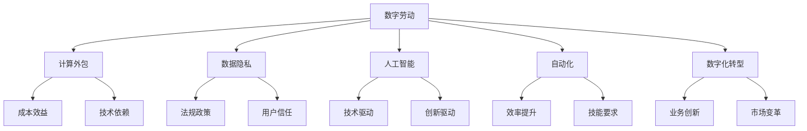

                 

# 数字劳动：人类计算的社会和经济影响

> 关键词：数字劳动, 人类计算, 社会影响, 经济影响, 计算外包, 数据隐私, 人工智能, 自动化

## 1. 背景介绍

### 1.1 问题由来
随着信息技术的发展，数字化和网络化正在深刻改变着人类的工作方式和社会结构。数字化劳动（Digital Labor）的概念应运而生，指的是通过数字平台（如互联网、移动应用、社交媒体等）进行的分工协作，其中计算劳动在其中占据了重要地位。数字化劳动不仅改变了传统的生产和工作模式，还对社会经济结构产生了深远影响。

### 1.2 问题核心关键点
数字化劳动的核心在于计算，即通过计算机和网络平台进行的分工协作。这种计算劳动具有以下几个关键特点：

- **分布性**：计算劳动不再局限于传统的工作场所，而是通过互联网进行分布式协作。
- **技术性**：计算劳动需要一定的技术背景和技能，通常涉及编程、数据分析等专业知识。
- **经济性**：计算劳动为数字经济提供了重要的动力源泉，许多新兴经济活动如人工智能、大数据、区块链等都依赖于计算劳动。
- **社会性**：计算劳动还涉及到数据隐私、信息安全等社会问题，与社会的整体利益密切相关。

这些问题关系到数字化时代的生产方式、社会结构和经济形态的演变，是当前数字化转型中的重要研究课题。

### 1.3 问题研究意义
研究数字化劳动对社会和经济的影响，对于理解数字化时代的生产力和生产关系具有重要意义。数字化劳动的出现和普及，不仅改变了传统劳动市场的供需格局，还对劳动力、市场、企业和政府的互动关系产生了深远影响。

1. **生产力的变革**：计算劳动极大地提高了生产效率和劳动生产率，推动了数字经济的快速发展。
2. **劳动力市场的变化**：计算劳动的出现为劳动力市场注入了新的需求，对劳动力技能要求更高，就业结构也随之改变。
3. **企业管理的创新**：数字化劳动使得企业能够更高效地进行管理和运营，提高企业的竞争力和市场反应速度。
4. **政府治理的挑战**：计算劳动带来的数据隐私、信息安全等新问题，对政府治理和监管提出了新的要求。

## 2. 核心概念与联系

### 2.1 核心概念概述

为了深入理解数字化劳动对社会和经济的影响，本节将介绍几个核心概念及其之间的联系：

- **数字劳动（Digital Labor）**：通过数字化平台进行的分工协作，其中计算劳动占据了重要地位。
- **计算外包（Computational Outsourcing）**：将计算任务外包给第三方平台或专业机构，以降低成本和提高效率。
- **数据隐私（Data Privacy）**：在数字化劳动中，数据隐私和安全问题变得尤为重要，涉及到用户的个人信息保护。
- **人工智能（AI）**：计算劳动的一个重要应用领域，AI技术的发展为数字化劳动提供了强大的技术支持。
- **自动化（Automation）**：通过计算劳动实现的任务自动化，极大地提高了生产效率和劳动生产率。
- **数字化转型（Digital Transformation）**：通过数字化劳动，企业和社会在生产方式、管理模式、运营效率等方面进行全面转型。

这些概念之间的关系可以通过以下Mermaid流程图来展示：



这个流程图展示了大计算劳动的概念及其与其他核心概念的联系：

1. **数字劳动**是计算劳动的主要载体，涉及到数据外包、人工智能、自动化等具体形式。
2. **计算外包**通过降低成本和提高效率，是数字劳动的重要组成部分。
3. **数据隐私**关系到用户个人信息的保护，是数字劳动中的重要问题。
4. **人工智能**和**自动化**为计算劳动提供了技术支持，推动了数字劳动的发展。
5. **数字化转型**则是数字劳动带来的整体社会经济变革，涉及到企业、市场、政府等多个层面。

这些概念共同构成了数字化劳动的理论框架，有助于我们全面理解其对社会和经济的影响。

## 3. 核心算法原理 & 具体操作步骤
### 3.1 算法原理概述

数字化劳动的核心是计算劳动，即通过计算机和网络平台进行的分工协作。这种计算劳动的原理可以概括为以下几个方面：

- **任务外包**：将具体的计算任务外包给第三方平台或专业机构，以降低成本和提高效率。
- **分布式计算**：利用网络平台进行分布式计算，使得计算任务可以在全球范围内分配和执行。
- **云计算**：通过云平台提供计算资源和工具，使得用户无需拥有自己的计算设备也能进行复杂的计算任务。

这些原理共同构成了数字化劳动的基础，使得计算劳动能够在大规模、高效和灵活的环境中得以实现。

### 3.2 算法步骤详解

基于上述原理，数字化劳动的实施通常包括以下几个关键步骤：

**Step 1: 任务定义和外包**
- 明确需要进行的计算任务，包括任务的性质、规模和复杂度。
- 选择合适的计算外包平台或专业机构，评估其技术实力和信誉。
- 签订外包合同，明确双方的权利和义务。

**Step 2: 分布式计算和云服务**
- 将计算任务分解为多个子任务，分配给不同的计算节点进行并行计算。
- 利用云计算平台提供的计算资源和工具，进行分布式计算。
- 监控计算进程，确保任务按时完成，并及时处理异常情况。

**Step 3: 数据管理与安全**
- 设计数据管理系统，确保数据的存储、传输和处理符合安全标准。
- 实施数据加密、访问控制等措施，保护用户数据隐私。
- 定期进行安全审计，发现和修复潜在的安全漏洞。

**Step 4: 结果分析和应用**
- 对计算结果进行分析和处理，提取有价值的信息。
- 将分析结果应用于实际业务场景，如市场预测、客户分析等。
- 持续改进计算模型和算法，提升计算效率和精度。

### 3.3 算法优缺点

数字化劳动的优势在于其高效性和灵活性，能够在大规模、复杂和动态的计算任务中发挥重要作用。但其缺点也显而易见：

**优点**：
- **成本效益**：通过外包和分布式计算，降低成本，提高效率。
- **技术依赖性**：利用先进的技术和工具，提高计算任务的准确性和可操作性。
- **灵活性**：能够快速适应变化多端的市场需求，灵活调整计算资源和算法。

**缺点**：
- **依赖外部平台**：计算劳动依赖于外部平台，一旦平台出现问题，计算任务可能受阻。
- **数据隐私风险**：数据传输和处理过程中可能存在隐私泄露和安全问题。
- **技术门槛高**：需要具备一定的技术背景和技能，对一些用户来说门槛较高。

### 3.4 算法应用领域

数字化劳动的应用范围广泛，涵盖各个领域，具体包括：

- **金融科技（FinTech）**：在金融领域，计算劳动用于风险管理、资产定价、客户分析等，推动金融服务的数字化转型。
- **医疗健康（HealthTech）**：在医疗领域，计算劳动用于数据分析、疾病预测、智能诊疗等，提升医疗服务的质量和效率。
- **智能制造（Smart Manufacturing）**：在制造业，计算劳动用于生产过程优化、质量控制、设备维护等，推动智能制造的发展。
- **智慧城市（Smart Cities）**：在城市管理中，计算劳动用于交通管理、环境监测、公共安全等，提升城市治理的智能化水平。
- **电子商务（E-commerce）**：在电商领域，计算劳动用于客户推荐、市场分析、供应链管理等，提升电商平台的竞争力。

## 4. 数学模型和公式 & 详细讲解  
### 4.1 数学模型构建

数字化劳动的数学模型可以从以下几个方面进行构建：

- **任务外包模型**：描述计算任务外包的过程和效率，如计算成本、时间等。
- **分布式计算模型**：描述分布式计算的资源分配和任务调度，如节点数、任务大小等。
- **数据隐私模型**：描述数据隐私的保护措施和风险评估，如数据加密、访问控制等。
- **人工智能模型**：描述计算劳动在AI技术中的应用，如机器学习、深度学习等。

### 4.2 公式推导过程

以**任务外包模型**为例，假设计算任务总成本为$C$，外包费用为$O$，计算时间为$T$，则任务外包的成本效益模型可以表示为：

$$
\text{Cost-Benefit} = \frac{C - O}{T}
$$

其中，$C - O$表示外包后节省的成本，$T$表示完成任务所需的时间。

### 4.3 案例分析与讲解

**案例分析**：某公司需要将一个大规模的数据分析任务外包给第三方平台，预计总成本为1000万元，外包费用为300万元。根据历史数据，完成这个任务需要20天。

- **计算任务外包成本效益**：
  $$
  \text{Cost-Benefit} = \frac{1000 - 300}{20} = 35 \text{万元/天}
  $$

这个案例展示了计算任务外包的成本效益，即在节省成本的同时，提高了计算效率。

## 5. 项目实践：代码实例和详细解释说明
### 5.1 开发环境搭建

在进行数字化劳动实践前，我们需要准备好开发环境。以下是使用Python进行计算任务外包的开发环境配置流程：

1. 安装Anaconda：从官网下载并安装Anaconda，用于创建独立的Python环境。

2. 创建并激活虚拟环境：
```bash
conda create -n pytorch-env python=3.8 
conda activate pytorch-env
```

3. 安装PyTorch：根据CUDA版本，从官网获取对应的安装命令。例如：
```bash
conda install pytorch torchvision torchaudio cudatoolkit=11.1 -c pytorch -c conda-forge
```

4. 安装相关的库：
```bash
pip install requests pandas numpy matplotlib
```

完成上述步骤后，即可在`pytorch-env`环境中开始计算任务外包的实践。

### 5.2 源代码详细实现

这里我们以一个简单的计算任务外包为例，给出使用Python进行计算任务外包的代码实现。

首先，定义计算任务的外包函数：

```python
import requests

def compute_task(task, url):
    response = requests.post(url, json={"task": task})
    return response.json()
```

然后，定义一个简单的计算任务，并进行外包计算：

```python
task = {"name": "Compute Task", "data": [1, 2, 3, 4, 5]}
url = "https://api.outsourcing-platform.com/compute"

result = compute_task(task, url)
print(result)
```

在这个代码实现中，我们通过调用一个第三方平台提供的API进行计算任务的外包。具体来说，将计算任务以JSON格式发送到指定的URL，并获取计算结果。

### 5.3 代码解读与分析

**代码实现细节**：
- 定义了计算任务外包函数`compute_task`，接收计算任务和API地址作为参数，发送POST请求，并解析JSON格式的响应结果。
- 定义了一个简单的计算任务`task`，包含任务名称和数据列表。
- 通过调用第三方平台提供的API，将计算任务发送到指定的URL，获取计算结果。
- 最终将计算结果打印输出。

**代码解读与分析**：
- **API调用**：通过HTTP请求与第三方平台进行通信，获取计算结果。
- **数据处理**：将计算任务封装成JSON格式的数据，发送到API，并在响应中解析结果。
- **结果展示**：将计算结果以JSON格式输出，便于后续分析和应用。

## 6. 实际应用场景
### 6.1 智能制造中的计算劳动

在智能制造中，计算劳动被广泛应用于生产过程优化、质量控制、设备维护等方面。通过将生产数据上传到云端平台，利用分布式计算和人工智能技术，实时分析和优化生产过程，提高生产效率和产品质量。

**具体应用**：某智能制造企业通过计算劳动实现了生产过程的实时监控和优化。具体步骤如下：
1. 将生产设备的数据上传到云端平台。
2. 利用分布式计算技术，对生产数据进行实时分析和处理。
3. 通过人工智能算法，对生产过程进行优化，提高生产效率和产品质量。

### 6.2 智慧城市中的计算劳动

在智慧城市中，计算劳动被广泛应用于交通管理、环境监测、公共安全等方面。通过实时采集和处理城市数据，利用计算劳动进行智能化分析和决策，提升城市治理的智能化水平。

**具体应用**：某智慧城市通过计算劳动实现了交通管理的智能化。具体步骤如下：
1. 利用智能摄像头采集城市交通数据。
2. 通过分布式计算技术，对交通数据进行实时分析和处理。
3. 通过人工智能算法，对交通流量进行预测和优化，提升交通管理效率。

### 6.3 金融科技中的计算劳动

在金融科技中，计算劳动被广泛应用于风险管理、资产定价、客户分析等方面。通过计算劳动进行数据分析和预测，提升金融服务的质量和效率，降低金融风险。

**具体应用**：某金融科技公司通过计算劳动实现了风险管理。具体步骤如下：
1. 收集客户的贷款数据和信用记录。
2. 利用分布式计算技术，对客户数据进行实时分析和处理。
3. 通过人工智能算法，对客户的信用风险进行预测和评估，提高风险管理水平。

### 6.4 未来应用展望

随着数字化劳动的发展，其在各领域的深入应用将成为未来数字经济的重要驱动力。未来，计算劳动将在以下几个方面进一步拓展：

- **跨领域融合**：计算劳动将更多地与其他领域的知识和技术进行融合，如工业互联网、智慧医疗、智能制造等。
- **技术创新**：计算劳动将推动人工智能、区块链、大数据等技术的发展，提升计算任务的复杂度和精度。
- **应用扩展**：计算劳动将应用于更多新兴领域，如虚拟现实、增强现实、边缘计算等，拓展其应用边界。

## 7. 工具和资源推荐
### 7.1 学习资源推荐

为了帮助开发者系统掌握数字化劳动的理论基础和实践技巧，这里推荐一些优质的学习资源：

1. 《Python数据分析》系列书籍：深入介绍Python在数据分析和处理中的应用，涵盖数据外包和分布式计算等主题。
2. CS224N《深度学习自然语言处理》课程：斯坦福大学开设的NLP明星课程，涵盖数据隐私和计算劳动等前沿话题。
3. 《人工智能基础》书籍：介绍人工智能技术的基本原理和应用，涵盖计算外包和分布式计算等主题。
4. Coursera平台《机器学习与人工智能》课程：由斯坦福大学和机器学习领域多位专家联合主讲，涵盖计算劳动和数据隐私等主题。
5. Kaggle平台上的相关竞赛：通过实践学习和应用，掌握计算劳动和数据外包等实际问题。

通过对这些资源的学习实践，相信你一定能够快速掌握计算劳动的精髓，并用于解决实际的计算任务。

### 7.2 开发工具推荐

高效的开发离不开优秀的工具支持。以下是几款用于计算任务外包开发的常用工具：

1. Python：基于Python的开源语言，适合开发计算任务外包等应用程序。
2. PyTorch：基于Python的开源深度学习框架，支持分布式计算和自动化学习。
3. TensorFlow：由Google主导开发的开源深度学习框架，支持分布式计算和高性能计算。
4. Scikit-learn：基于Python的数据科学库，提供丰富的数据处理和机器学习工具。
5. Docker：轻量级的容器化平台，支持分布式计算和资源管理。

合理利用这些工具，可以显著提升计算任务外包的开发效率，加快创新迭代的步伐。

### 7.3 相关论文推荐

计算劳动的研究源于学界的持续研究。以下是几篇奠基性的相关论文，推荐阅读：

1. "Computational Outsourcing: A Survey"（《计算外包：综述》）：提供计算外包的全面综述，涵盖外包模式、经济效益和案例分析等主题。
2. "Data Privacy in the Age of Big Data"（《大数据时代的隐私保护》）：探讨数据隐私的挑战和解决方案，为计算劳动中的隐私保护提供理论基础。
3. "Machine Learning and the Future of Work"（《机器学习与未来工作》）：分析机器学习对劳动力市场的影响，探讨计算劳动的未来发展趋势。
4. "Automation and the Economy"（《自动化与经济》）：讨论自动化技术对经济的影响，为计算劳动的经济学研究提供理论支持。
5. "Human Labor in the Age of Artificial Intelligence"（《人工智能时代的劳动力》）：分析人工智能对劳动力市场和就业结构的影响，探讨计算劳动的社会学意义。

这些论文代表了大计算劳动的发展脉络，通过学习这些前沿成果，可以帮助研究者把握学科前进方向，激发更多的创新灵感。

## 8. 总结：未来发展趋势与挑战
### 8.1 总结

本文对计算劳动的定义、原理和应用进行了全面系统的介绍。首先阐述了计算劳动的概念及其与数字化劳动的联系，明确了计算劳动在数字化时代的核心地位。其次，从原理到实践，详细讲解了计算劳动的算法原理和操作步骤，给出了计算任务外包的代码实现。同时，本文还广泛探讨了计算劳动在智能制造、智慧城市、金融科技等多个领域的应用前景，展示了计算劳动的广阔潜力。此外，本文精选了计算劳动相关的学习资源、开发工具和相关论文，力求为读者提供全方位的技术指引。

通过本文的系统梳理，可以看到，计算劳动的出现和普及，正在深刻改变人类的生产方式和社会结构。计算劳动不仅改变了传统劳动市场的供需格局，还对劳动力、市场、企业和政府的互动关系产生了深远影响。未来，计算劳动将在更多领域得到应用，为数字经济的持续发展注入新的动力。

### 8.2 未来发展趋势

展望未来，计算劳动的发展趋势将呈现以下几个方面：

1. **跨领域融合**：计算劳动将更多地与其他领域的知识和技术进行融合，推动新兴领域的快速发展。
2. **技术创新**：计算劳动将推动人工智能、区块链、大数据等技术的发展，提升计算任务的复杂度和精度。
3. **应用扩展**：计算劳动将应用于更多新兴领域，如虚拟现实、增强现实、边缘计算等，拓展其应用边界。
4. **社会影响**：计算劳动将进一步影响劳动力市场和社会结构，引发更多关于就业、收入和社会不平等等问题的探讨。

### 8.3 面临的挑战

尽管计算劳动的发展前景广阔，但在迈向更加智能化、普适化应用的过程中，它仍面临诸多挑战：

1. **数据隐私和安全**：计算劳动依赖大量的数据，数据隐私和安全问题变得尤为重要，需要更为严格的数据保护措施。
2. **技术门槛高**：计算劳动需要具备一定的技术背景和技能，对一些用户来说门槛较高，需要更多的培训和教育。
3. **算法透明性**：计算劳动中使用的机器学习算法往往是"黑盒"系统，难以解释其内部工作机制和决策逻辑，增加了算法的透明性和可解释性问题。
4. **资源消耗大**：计算劳动在处理大规模计算任务时，需要消耗大量的计算资源和存储资源，成本较高。
5. **伦理和道德问题**：计算劳动中涉及到的数据隐私、信息安全等伦理问题需要引起重视，避免潜在的社会负面影响。

### 8.4 研究展望

面对计算劳动面临的诸多挑战，未来的研究需要在以下几个方面寻求新的突破：

1. **数据隐私保护**：开发更加高效、安全的数据隐私保护技术，确保用户数据的安全性和隐私性。
2. **算法透明性**：提高机器学习算法的透明性和可解释性，增强其可信度和可接受性。
3. **资源优化**：通过分布式计算和高效算法，优化计算任务的处理效率，降低计算成本。
4. **伦理和社会规范**：制定伦理和社会规范，确保计算劳动在符合法律法规和社会公德的前提下进行。
5. **跨领域应用**：推动计算劳动与其他领域知识的融合，提升其应用价值和创新潜力。

这些研究方向的探索，将引领计算劳动技术迈向更高的台阶，为构建安全、可靠、可解释、可控的智能系统铺平道路。面向未来，计算劳动需要在技术、伦理和社会等多个层面进行全面优化，才能更好地服务于数字经济的发展。

## 9. 附录：常见问题与解答

**Q1：计算劳动如何影响劳动力市场？**

A: 计算劳动的出现和普及，对劳动力市场产生了深远影响：
1. **技能要求提高**：计算劳动需要具备一定的技术背景和技能，对劳动力市场的技能要求提高。
2. **就业结构变化**：计算劳动的出现带来了新的就业机会，但同时也可能导致部分传统劳动岗位的消失。
3. **收入分配不均**：计算劳动往往集中在高收入群体，加剧了收入分配的不均。
4. **就业灵活性增加**：计算劳动为劳动力提供了更多的就业选择和灵活性。

**Q2：如何应对计算劳动中的数据隐私和安全问题？**

A: 应对计算劳动中的数据隐私和安全问题，可以采取以下措施：
1. **数据加密**：对传输和存储的数据进行加密处理，确保数据的安全性。
2. **访问控制**：严格控制数据的访问权限，确保只有授权人员才能访问敏感数据。
3. **数据匿名化**：对数据进行匿名化处理，减少数据泄露的风险。
4. **安全审计**：定期进行安全审计，发现和修复潜在的安全漏洞。
5. **法律规范**：制定和完善相关法律法规，保障数据隐私和安全。

**Q3：计算劳动在金融科技中的应用前景如何？**

A: 计算劳动在金融科技中具有广阔的应用前景：
1. **风险管理**：利用计算劳动进行数据处理和分析，提升风险管理的准确性和效率。
2. **资产定价**：通过计算劳动进行复杂的金融数据分析，提升资产定价的精确性。
3. **客户分析**：利用计算劳动进行客户数据分析，提升客户服务的质量和效率。
4. **智能投顾**：通过计算劳动进行智能投顾服务，提供个性化的投资建议。

**Q4：计算劳动在智能制造中的应用难点是什么？**

A: 计算劳动在智能制造中的应用难点主要包括以下几点：
1. **数据质量**：智能制造中涉及大量的传感器数据，数据质量参差不齐，需要高质量的数据预处理和清洗。
2. **实时性要求高**：智能制造中的计算任务需要实时处理，对计算资源的实时性和可靠性要求高。
3. **设备兼容性**：不同设备的数据格式和接口不一致，需要统一数据格式和接口。
4. **算法复杂度**：智能制造中的计算任务涉及复杂的模型和算法，需要较高的技术背景和技能。

**Q5：如何提高计算劳动的效率和精度？**

A: 提高计算劳动的效率和精度，可以采取以下措施：
1. **优化算法**：使用高效的算法和数据结构，减少计算时间和资源消耗。
2. **分布式计算**：利用分布式计算技术，将计算任务分配到多个计算节点进行并行计算，提升计算效率。
3. **云平台优化**：通过优化云平台资源分配和调度，提高计算资源的利用效率。
4. **自动化优化**：利用自动化技术进行算法优化和参数调整，提升计算任务的精度。

通过这些措施，可以有效提升计算劳动的效率和精度，更好地满足实际需求。

---

作者：禅与计算机程序设计艺术 / Zen and the Art of Computer Programming

