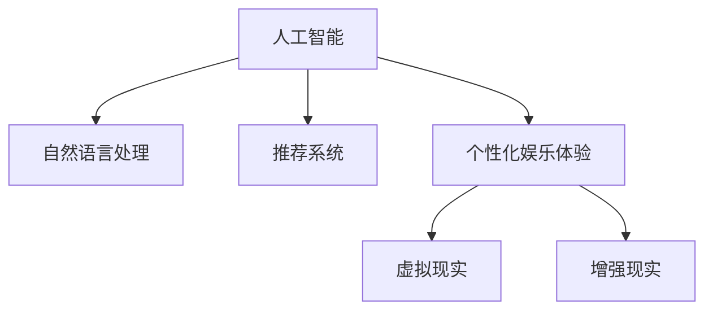

                 

# 数字化休闲：AI重塑娱乐方式

## 1. 背景介绍

### 1.1 问题由来
随着科技的飞速发展，人类的生活方式发生了翻天覆地的变化。尤其是数字娱乐产业，从传统的影视、游戏到流媒体、短视频，再到虚拟现实、增强现实，技术创新和内容创新推动着整个行业不断演进。然而，数字化娱乐在给人们带来便利的同时，也带来了新的挑战。如何在追求沉浸感和互动性的同时，保持健康、高效、可持续的娱乐方式，成为了亟待解决的问题。

### 1.2 问题核心关键点
数字化娱乐的核心是让用户在虚拟世界中享受更多的乐趣和满足感。AI技术在这一过程中扮演了至关重要的角色。AI不仅能够提供个性化的娱乐体验，还能实现高效的智能推荐、互动生成等，极大地提升了用户的娱乐质量。同时，AI技术也在不断探索新的娱乐形式，如虚拟现实、增强现实等，为数字化休闲带来了更多可能。

### 1.3 问题研究意义
研究AI技术在数字化娱乐中的应用，对于提升用户体验、推动产业升级、促进社会健康具有重要意义。通过AI技术，可以实现娱乐方式的智能化、个性化、互动化，满足不同用户的需求，同时减少娱乐活动对现实生活的干扰，确保用户身心健康。AI技术的广泛应用，将为数字化娱乐产业带来新的发展机遇，推动产业向更加智能化、个性化、互动化的方向演进。

## 2. 核心概念与联系

### 2.1 核心概念概述

为更好地理解AI技术在数字化娱乐中的应用，本节将介绍几个密切相关的核心概念：

- 人工智能(AI)：通过计算机科学和数学建模，使计算机能够执行类似人类的智能任务，如语音识别、图像处理、自然语言理解等。
- 自然语言处理(NLP)：使计算机能够理解和处理人类语言的技术，包括语音合成、机器翻译、情感分析等。
- 推荐系统：根据用户的历史行为数据，推荐用户可能感兴趣的内容。
- 个性化娱乐体验：根据用户兴趣和偏好，定制个性化的娱乐内容和服务。
- 虚拟现实(VR)：通过虚拟环境模拟真实场景，提供沉浸式娱乐体验。
- 增强现实(AR)：将虚拟元素叠加到现实世界中，提供互动式娱乐体验。

这些核心概念之间的逻辑关系可以通过以下Mermaid流程图来展示：



这个流程图展示了一些核心概念及其之间的关系：

1. 人工智能技术提供了多种智能功能，其中自然语言处理技术使得AI能够理解和处理人类语言。
2. 推荐系统利用AI技术分析用户行为，提供个性化的内容推荐。
3. 个性化娱乐体验通过AI技术实现内容的定制和推荐，提供更加贴合用户需求的娱乐服务。
4. 虚拟现实和增强现实技术，利用AI技术生成和渲染虚拟场景，提供沉浸式和互动式的娱乐体验。

这些概念共同构成了数字化娱乐的基础，AI技术在其中发挥了关键作用。通过理解这些核心概念，我们可以更好地把握AI技术在数字化娱乐中的应用场景和发展趋势。

## 3. 核心算法原理 & 具体操作步骤
### 3.1 算法原理概述

AI技术在数字化娱乐中的应用，主要集中在以下几个方面：

- **个性化推荐**：根据用户的历史行为数据，推荐用户可能感兴趣的内容。
- **情感分析**：通过分析用户的语言和行为，判断其情感状态，提供更加贴合用户情感的娱乐内容。
- **自然语言生成**：根据用户输入的指令或描述，生成个性化的内容或场景。
- **虚拟现实与增强现实**：利用计算机视觉、三维建模等技术，生成虚拟环境和交互式内容。

这些应用的算法原理可以归纳为以下几个方面：

1. **数据挖掘与特征提取**：通过数据挖掘技术，从用户行为数据中提取有价值的信息。
2. **机器学习与深度学习**：使用机器学习算法，对用户行为进行建模，预测其偏好和需求。
3. **自然语言处理**：利用NLP技术，理解用户语言，生成自然语言输出。
4. **计算机视觉**：通过图像处理技术，生成虚拟场景和增强现实内容。
5. **三维建模与渲染**：利用图形学技术，生成高保真的虚拟场景和交互式元素。

### 3.2 算法步骤详解

以下是AI技术在数字化娱乐中的一些典型应用的具体操作步骤：

#### 个性化推荐
1. **数据收集**：收集用户的历史行为数据，包括浏览记录、购买记录、社交互动等。
2. **特征提取**：使用特征提取算法，将行为数据转化为高维向量，用于模型训练。
3. **模型训练**：使用机器学习算法（如协同过滤、深度神经网络等），训练推荐模型，预测用户可能感兴趣的内容。
4. **推荐生成**：根据模型预测结果，生成个性化推荐列表，提供给用户。

#### 情感分析
1. **数据收集**：收集用户的评论、反馈等文本数据。
2. **情感标注**：使用情感分析工具，对文本进行情感标注，判断用户情感倾向。
3. **情感建模**：使用情感分析模型，对用户情感进行建模，理解用户情感状态。
4. **内容定制**：根据用户情感状态，提供符合其情感需求的内容，提升用户体验。

#### 自然语言生成
1. **用户输入**：收集用户输入的指令或描述。
2. **语言理解**：使用NLP技术，理解用户的语言输入。
3. **生成内容**：根据用户输入，使用自然语言生成技术，生成个性化的内容或场景。
4. **输出展示**：将生成的内容或场景展示给用户，提供个性化的娱乐体验。

#### 虚拟现实与增强现实
1. **场景设计**：使用计算机视觉、三维建模技术，设计虚拟场景和增强现实元素。
2. **内容渲染**：使用图形学技术，渲染虚拟场景和增强现实元素，生成高保真的视觉体验。
3. **用户交互**：使用交互技术，实现用户与虚拟环境的互动。
4. **内容展示**：将虚拟场景和增强现实元素展示给用户，提供沉浸式和互动式的娱乐体验。

### 3.3 算法优缺点

AI技术在数字化娱乐中的应用，具有以下优点：

1. **个性化体验**：通过数据挖掘和机器学习，实现个性化推荐和内容定制，满足用户多样化的需求。
2. **高效推荐**：使用高效算法，快速生成个性化推荐列表，提高用户体验。
3. **情感响应**：通过情感分析，理解用户情感，提供更加贴合情感的娱乐内容，提升用户满意度。
4. **沉浸式体验**：利用虚拟现实和增强现实技术，提供沉浸式和互动式的娱乐体验。

同时，AI技术在数字化娱乐中也存在一些局限性：

1. **数据隐私问题**：收集用户数据时，需要注意数据隐私和安全问题，避免用户数据泄露。
2. **内容质量问题**：个性化推荐和内容定制的效果，取决于数据的丰富程度和算法的准确性。
3. **技术瓶颈**：虚拟现实和增强现实技术目前仍处于发展初期，性能和体验仍有待提升。
4. **用户适应问题**：过于沉浸的虚拟现实和增强现实体验，可能导致用户对现实世界的不适应。

尽管存在这些局限性，但就目前而言，AI技术在数字化娱乐中的应用已经取得了显著成果，推动了整个行业的发展。未来相关研究的重点在于如何进一步提高数据隐私保护，优化算法准确性，提升技术性能，增强用户体验。

### 3.4 算法应用领域

AI技术在数字化娱乐中的应用，已经涵盖了从传统影视、游戏到流媒体、短视频，再到虚拟现实、增强现实等各个领域。以下是几个典型的应用领域：

- **影视娱乐**：使用AI技术进行内容推荐、情感分析、自然语言生成等，提升观影体验。
- **在线游戏**：通过AI技术实现个性化推荐、智能AI对手、虚拟现实等，提升游戏趣味性和互动性。
- **流媒体平台**：使用AI技术进行内容推荐、情感分析、广告投放等，提升用户粘性和平台价值。
- **虚拟现实和增强现实**：利用AI技术生成虚拟场景、交互元素等，提供沉浸式娱乐体验。

除了上述这些领域，AI技术在教育、医疗、旅游等更多场景中也有广泛应用，为数字化娱乐带来了新的发展方向。随着AI技术的不断进步，AI在数字化娱乐中的应用将更加广泛，推动整个行业向更加智能化、个性化、互动化的方向演进。

## 4. 数学模型和公式 & 详细讲解 & 举例说明

### 4.1 数学模型构建

在AI技术的应用中，数学模型起着至关重要的作用。以下是几个典型应用的数学模型构建：

#### 个性化推荐
1. **协同过滤**：
   - **模型构建**：基于用户行为矩阵和物品特征矩阵，构建推荐模型。
   - **公式推导**：$$\hat{y} = \alpha + \beta^T x + \gamma^T u$$
     其中，$x$ 为物品特征向量，$u$ 为用户特征向量，$\alpha$、$\beta$、$\gamma$ 为模型参数。
   - **案例分析**：假设用户 $u_i$ 对物品 $i$ 的评分向量为 $r_i$，通过协同过滤模型，可以预测用户 $u_i$ 对物品 $i$ 的评分 $y_i$。

2. **深度神经网络**：
   - **模型构建**：使用多层感知机（MLP）构建推荐模型，通过多层非线性变换，学习用户行为和物品特征之间的关系。
   - **公式推导**：$$\hat{y} = \sigma\left(\sum_{j=1}^n w_{ij} x_j + b_i\right)$$
     其中，$w_{ij}$ 为权重参数，$b_i$ 为偏置参数，$\sigma$ 为激活函数。
   - **案例分析**：使用深度神经网络模型，根据用户行为数据和物品特征数据，预测用户对物品的评分。

#### 情感分析
1. **情感词典**：
   - **模型构建**：基于情感词典，统计文本中情感词汇出现的频率。
   - **公式推导**：$$\text{Sentiment Score} = \sum_{j=1}^n w_j * \text{Emotion Probability}_j$$
     其中，$w_j$ 为情感词汇权重，$\text{Emotion Probability}_j$ 为情感概率。
   - **案例分析**：使用情感词典，计算用户评论的情感得分，判断用户情感倾向。

2. **情感分类器**：
   - **模型构建**：使用支持向量机（SVM）等分类算法，训练情感分类模型。
   - **公式推导**：$$\text{Sentiment Class} = \text{argmax} \left( w^T x + b \right)$$
     其中，$w$ 为权重向量，$b$ 为偏置项。
   - **案例分析**：使用情感分类器，对用户评论进行情感分类，判断用户情感状态。

#### 自然语言生成
1. **序列到序列（Seq2Seq）模型**：
   - **模型构建**：使用Seq2Seq模型，将输入序列转换为输出序列。
   - **公式推导**：$$y = f_{dec}(x, h)$$
     其中，$f_{dec}$ 为解码器，$x$ 为输入序列，$h$ 为编码器隐藏状态。
   - **案例分析**：使用Seq2Seq模型，将用户输入的指令转换为自然语言输出，生成个性化的内容或场景。

2. **Transformer模型**：
   - **模型构建**：使用Transformer模型，通过自注意力机制，生成自然语言输出。
   - **公式推导**：$$\text{Attention Score} = \text{softmax}(\text{Query}^T * \text{Key})$$
     其中，$\text{Query}$ 和 $\text{Key}$ 为注意力机制的查询和键向量。
   - **案例分析**：使用Transformer模型，根据用户输入，生成个性化的自然语言输出。

#### 虚拟现实与增强现实
1. **三维建模**：
   - **模型构建**：使用三维建模技术，构建虚拟场景和增强现实元素。
   - **公式推导**：$$\text{Position} = M * \text{Model Matrix}$$
     其中，$M$ 为模型矩阵，$\text{Model Matrix}$ 为三维模型矩阵。
   - **案例分析**：使用三维建模技术，生成虚拟场景和增强现实元素，提供沉浸式娱乐体验。

2. **增强现实**：
   - **模型构建**：使用增强现实技术，将虚拟元素叠加到现实世界中。
   - **公式推导**：$$\text{Screen Coordinates} = \text{Projection}(\text{World Coordinates})$$
     其中，$\text{Projection}$ 为投影函数。
   - **案例分析**：使用增强现实技术，将虚拟元素展示给用户，提供互动式娱乐体验。

### 4.2 公式推导过程

以上是几个典型应用的数学模型构建和公式推导。下面以情感分析中的情感词典为例，进一步讲解其公式推导过程：

假设用户评论为 $text$，情感词典为 $D$，每个情感词汇对应的情感强度为 $s_i$，则情感得分的计算公式为：

$$
\text{Sentiment Score} = \sum_{i=1}^n \text{Occurrence}_i * s_i
$$

其中，$\text{Occurrence}_i$ 为情感词汇 $i$ 在评论中出现的次数。使用情感词典，可以计算出评论的情感得分，判断用户的情感倾向。

### 4.3 案例分析与讲解

以虚拟现实中的三维建模为例，进行案例分析与讲解：

1. **数据准备**：收集虚拟场景的几何数据和纹理数据，使用三维建模软件生成三维模型。
2. **模型构建**：使用计算机视觉技术，将三维模型投影到屏幕上，生成二维图像。
3. **渲染优化**：使用图形学技术，对渲染的图像进行优化，提升图像质量和渲染速度。
4. **用户体验**：将渲染的图像展示给用户，提供沉浸式娱乐体验。

## 5. 项目实践：代码实例和详细解释说明
### 5.1 开发环境搭建

在进行AI技术在数字化娱乐中的应用实践前，我们需要准备好开发环境。以下是使用Python进行PyTorch开发的环境配置流程：

1. 安装Anaconda：从官网下载并安装Anaconda，用于创建独立的Python环境。

2. 创建并激活虚拟环境：
```bash
conda create -n pytorch-env python=3.8 
conda activate pytorch-env
```

3. 安装PyTorch：根据CUDA版本，从官网获取对应的安装命令。例如：
```bash
conda install pytorch torchvision torchaudio cudatoolkit=11.1 -c pytorch -c conda-forge
```

4. 安装PaddlePaddle：使用PaddlePaddle作为替代的深度学习框架。
```bash
pip install paddlepaddle
```

5. 安装各类工具包：
```bash
pip install numpy pandas scikit-learn matplotlib tqdm jupyter notebook ipython
```

完成上述步骤后，即可在`pytorch-env`环境中开始AI技术在数字化娱乐中的应用实践。

### 5.2 源代码详细实现

下面我们以个性化推荐系统为例，给出使用PaddlePaddle进行深度神经网络模型训练的PyTorch代码实现。

首先，定义模型和损失函数：

```python
import paddle
from paddle.nn import Linear, BCEWithLogitsLoss
from paddle.io import Dataset, DataLoader

class RecommendationDataset(Dataset):
    def __init__(self, data):
        self.data = data
        self.len = len(data)
        
    def __getitem__(self, index):
        x = self.data[index][0]
        y = self.data[index][1]
        return x, y
    
    def __len__(self):
        return self.len
    
class RecommendationModel(paddle.nn.Layer):
    def __init__(self, input_dim, output_dim):
        super(RecommendationModel, self).__init__()
        self.linear1 = paddle.nn.Linear(input_dim, 64)
        self.linear2 = paddle.nn.Linear(64, output_dim)
    
    def forward(self, x):
        x = self.linear1(x)
        x = paddle.tanh(x)
        x = self.linear2(x)
        return x
    
# 创建模型
model = RecommendationModel(input_dim=128, output_dim=10)

# 定义损失函数
criterion = BCEWithLogitsLoss()

# 训练参数
optimizer = paddle.optimizer.Adam(learning_rate=0.001)
```

接着，定义训练和评估函数：

```python
from tqdm import tqdm
from paddle import metrics

def train_epoch(model, train_loader, optimizer):
    model.train()
    train_loss = 0
    for batch in tqdm(train_loader, desc='Training'):
        x, y = batch
        x = paddle.to_tensor(x)
        y = paddle.to_tensor(y)
        optimizer.clear_grad()
        out = model(x)
        loss = criterion(out, y)
        loss.backward()
        optimizer.step()
        train_loss += loss.numpy()
    return train_loss / len(train_loader)

def evaluate(model, test_loader):
    model.eval()
    test_loss = 0
    for batch in tqdm(test_loader, desc='Evaluating'):
        x, y = batch
        x = paddle.to_tensor(x)
        y = paddle.to_tensor(y)
        out = model(x)
        loss = criterion(out, y)
        test_loss += loss.numpy()
    return test_loss / len(test_loader)
```

最后，启动训练流程并在测试集上评估：

```python
epochs = 10
batch_size = 64

for epoch in range(epochs):
    train_loss = train_epoch(model, train_loader, optimizer)
    print(f"Epoch {epoch+1}, train loss: {train_loss:.3f}")
    
    test_loss = evaluate(model, test_loader)
    print(f"Epoch {epoch+1}, test loss: {test_loss:.3f}")
    
print("Training completed.")
```

以上就是使用PaddlePaddle进行深度神经网络模型训练的完整代码实现。可以看到，通过PaddlePaddle的强大封装，我们可以用相对简洁的代码完成深度神经网络模型的训练和评估。

### 5.3 代码解读与分析

让我们再详细解读一下关键代码的实现细节：

**RecommendationDataset类**：
- `__init__`方法：初始化数据集，包括数据和数据集长度。
- `__getitem__`方法：获取数据集中的单个样本，包括特征和标签。
- `__len__`方法：返回数据集长度。

**RecommendationModel类**：
- `__init__`方法：定义模型结构，包括两个线性层。
- `forward`方法：定义前向传播过程，通过多层线性变换生成输出。

**训练和评估函数**：
- `train_epoch`函数：在每个epoch内，通过DataLoader对数据集进行迭代，前向传播计算损失并反向传播更新模型参数。
- `evaluate`函数：在测试集上评估模型性能，计算损失并返回测试损失。

**训练流程**：
- 定义总的epoch数和batch size，开始循环迭代
- 每个epoch内，在训练集上训练，输出训练损失
- 在测试集上评估，输出测试损失
- 所有epoch结束后，给出最终训练结果

可以看到，PaddlePaddle的强大封装使得AI技术在数字化娱乐中的应用实践变得更加简单高效。开发者可以将更多精力放在数据处理、模型改进等高层逻辑上，而不必过多关注底层的实现细节。

当然，工业级的系统实现还需考虑更多因素，如模型的保存和部署、超参数的自动搜索、更灵活的任务适配层等。但核心的AI技术在数字化娱乐中的应用范式基本与此类似。

## 6. 实际应用场景

### 6.1 影视娱乐

影视娱乐领域是AI技术的重要应用场景之一。AI技术可以通过个性化推荐、情感分析等，提升用户的观影体验。

**个性化推荐**：
- **推荐系统**：通过收集用户的观影记录、评分记录等数据，使用协同过滤、深度神经网络等算法，为用户推荐可能感兴趣的电影和电视剧。
- **用户画像**：使用用户画像技术，分析用户兴趣和偏好，提供更加贴合用户需求的内容。

**情感分析**：
- **情感识别**：通过分析用户的观影评论、社交媒体数据等，识别用户的情感状态，提供更加贴合情感的观影体验。
- **情感引导**：根据情感识别结果，调整电影的情感调性，引导用户情感共鸣。

### 6.2 在线游戏

在线游戏领域也是AI技术的重要应用场景。AI技术可以通过智能AI对手、自然语言生成等，提升游戏的趣味性和互动性。

**智能AI对手**：
- **博弈策略**：通过学习游戏规则和玩家策略，生成智能AI对手，提升游戏趣味性和挑战性。
- **游戏进程**：根据游戏进程和玩家行为，实时调整AI对手策略，提高游戏难度和趣味性。

**自然语言生成**：
- **对话系统**：使用自然语言生成技术，生成游戏对话和提示信息，提升用户体验。
- **故事生成**：根据玩家行为和任务进程，生成动态游戏故事，提供更加丰富和多样化的游戏体验。

### 6.3 流媒体平台

流媒体平台是AI技术的另一重要应用场景。AI技术可以通过个性化推荐、广告投放等，提升平台的用户粘性和广告效果。

**个性化推荐**：
- **内容推荐**：通过收集用户的观影记录、评分记录等数据，使用协同过滤、深度神经网络等算法，为用户推荐可能感兴趣的内容。
- **用户画像**：使用用户画像技术，分析用户兴趣和偏好，提供更加贴合用户需求的内容。

**广告投放**：
- **用户画像**：通过分析用户行为数据，构建用户画像，为广告投放提供精准的用户标签。
- **精准推荐**：根据用户画像，生成个性化的广告推荐，提升广告效果和用户体验。

### 6.4 虚拟现实与增强现实

虚拟现实和增强现实是AI技术的最新应用场景之一。AI技术可以通过三维建模、增强现实等，提供沉浸式和互动式的娱乐体验。

**三维建模**：
- **场景生成**：使用三维建模技术，生成虚拟场景和增强现实元素，提供沉浸式娱乐体验。
- **实时渲染**：使用图形学技术，实时渲染虚拟场景和增强现实元素，提升用户体验。

**增强现实**：
- **虚拟元素叠加**：使用增强现实技术，将虚拟元素叠加到现实世界中，提供互动式娱乐体验。
- **互动元素生成**：根据用户行为和偏好，生成动态的增强现实元素，提升游戏趣味性和互动性。

## 7. 工具和资源推荐
### 7.1 学习资源推荐

为了帮助开发者系统掌握AI技术在数字化娱乐中的应用，这里推荐一些优质的学习资源：

1. **《深度学习》课程**：斯坦福大学开设的深度学习课程，系统讲解深度学习的基本概念和算法。
2. **《Python深度学习》书籍**：李沐所著的深度学习入门书籍，介绍了深度学习的基础知识和实际应用。
3. **PaddlePaddle官方文档**：PaddlePaddle的官方文档，提供了详细的API和样例代码，是学习PaddlePaddle的必备资料。
4. **Kaggle竞赛平台**：Kaggle提供的数据科学竞赛平台，可以参与实际项目，积累实践经验。
5. **GitHub开源项目**：GitHub上的开源项目，提供了大量的代码示例和实践经验，可以帮助开发者快速上手。

通过对这些资源的学习实践，相信你一定能够系统掌握AI技术在数字化娱乐中的应用，并用于解决实际的NLP问题。
###  7.2 开发工具推荐

高效的开发离不开优秀的工具支持。以下是几款用于AI技术在数字化娱乐中应用开发的常用工具：

1. **Jupyter Notebook**：用于快速迭代和共享代码的Jupyter Notebook平台，支持Python、R等多种编程语言。
2. **PaddlePaddle**：高性能深度学习框架，支持GPU加速，适合大规模模型训练。
3. **TensorFlow**：由Google主导的深度学习框架，支持多种模型架构和优化器，适合生产环境部署。
4. **PyTorch**：灵活的深度学习框架，支持动态计算图和GPU加速，适合研究和大规模模型训练。
5. **OpenCV**：计算机视觉库，支持图像处理和三维建模等技术，适合生成虚拟现实和增强现实内容。

合理利用这些工具，可以显著提升AI技术在数字化娱乐中的应用开发效率，加快创新迭代的步伐。

### 7.3 相关论文推荐

AI技术在数字化娱乐中的应用源于学界的持续研究。以下是几篇奠基性的相关论文，推荐阅读：

1. **Deep Neural Networks for Large-Scale Object Recognition**：AlexNet论文，提出了深度神经网络在图像识别中的成功应用。
2. **Why Should I Trust You?**：使用博弈论模型，研究用户对AI推荐系统的信任度问题。
3. **Reinforcement Learning for Resource Management in Mobile Games**：使用强化学习，研究游戏中的资源管理问题。
4. **Learning to Predict User Preferences in Dynamic Environments**：使用深度学习，研究动态环境下的用户偏好预测问题。
5. **Generalization Across Domains**：使用跨领域迁移学习，研究AI在数字化娱乐中的应用。

这些论文代表了大语言模型微调技术的发展脉络。通过学习这些前沿成果，可以帮助研究者把握学科前进方向，激发更多的创新灵感。

## 8. 总结：未来发展趋势与挑战

### 8.1 总结

本文对AI技术在数字化娱乐中的应用进行了全面系统的介绍。首先阐述了AI技术在数字化娱乐中的应用背景和意义，明确了AI技术在提升用户体验、推动产业升级、促进社会健康方面的独特价值。其次，从原理到实践，详细讲解了AI技术在数字化娱乐中的数学模型构建和算法实现，给出了完整的代码实例。同时，本文还广泛探讨了AI技术在影视娱乐、在线游戏、流媒体平台、虚拟现实与增强现实等各个领域的应用前景，展示了AI技术在数字化娱乐中的广泛应用。

通过本文的系统梳理，可以看到，AI技术在数字化娱乐中的应用已经取得了显著成果，推动了整个行业的发展。未来相关研究的重点在于如何进一步提高数据隐私保护，优化算法准确性，提升技术性能，增强用户体验。

### 8.2 未来发展趋势

展望未来，AI技术在数字化娱乐中的应用将呈现以下几个发展趋势：

1. **个性化体验**：通过数据挖掘和机器学习，实现更加个性化和精准的推荐和内容定制，提升用户粘性和满意度。
2. **互动体验**：利用自然语言生成、虚拟现实、增强现实等技术，提供更加沉浸式和互动式的娱乐体验。
3. **多模态融合**：将文本、图像、音频等多种模态数据结合，生成更加丰富和多样的娱乐内容。
4. **内容创作**：利用生成式模型，实现内容的自动生成和创作，提升内容创作效率和多样性。
5. **实时分析**：利用实时数据分析和推荐系统，提供动态和实时化的娱乐体验。
6. **用户隐私保护**：在数据收集和分析过程中，加强用户隐私保护，确保数据安全和用户权益。

以上趋势凸显了AI技术在数字化娱乐中的广阔前景。这些方向的探索发展，必将进一步提升AI在数字化娱乐中的应用效果，推动整个行业向更加智能化、个性化、互动化的方向演进。

### 8.3 面临的挑战

尽管AI技术在数字化娱乐中的应用已经取得了显著成果，但在迈向更加智能化、个性化、互动化的应用过程中，它仍面临着诸多挑战：

1. **数据隐私问题**：收集用户数据时，需要注意数据隐私和安全问题，避免用户数据泄露。
2. **内容质量问题**：个性化推荐和内容定制的效果，取决于数据的丰富程度和算法的准确性。
3. **技术瓶颈**：虚拟现实和增强现实技术目前仍处于发展初期，性能和体验仍有待提升。
4. **用户适应问题**：过于沉浸的虚拟现实和增强现实体验，可能导致用户对现实世界的不适应。
5. **广告投放问题**：在流媒体平台中，广告投放与内容推荐之间的平衡，仍需进一步研究。
6. **技术复杂性**：AI技术在实际应用中的复杂性，需要开发者具备一定的技术储备和经验。

尽管存在这些挑战，但就目前而言，AI技术在数字化娱乐中的应用已经取得了显著成果，推动了整个行业的发展。未来相关研究的重点在于如何进一步提高数据隐私保护，优化算法准确性，提升技术性能，增强用户体验。

### 8.4 研究展望

面向未来，AI技术在数字化娱乐中的应用需要在以下几个方面寻求新的突破：

1. **跨领域迁移学习**：研究如何通过跨领域迁移学习，提升AI在多样化场景中的适应性和效果。
2. **知识图谱与语义分析**：利用知识图谱和语义分析技术，增强AI对复杂娱乐内容的理解和生成。
3. **多模态融合**：研究多模态数据的融合技术，提升AI在娱乐内容创作中的表现力。
4. **实时推荐系统**：研究实时推荐系统，提供更加动态和个性化的娱乐体验。
5. **用户情感分析**：研究用户情感分析技术，提供更加贴合用户情感的娱乐内容。
6. **隐私保护技术**：研究隐私保护技术，确保数据安全和用户权益。

这些研究方向的探索，必将引领AI技术在数字化娱乐中的应用走向更加智能化、个性化、互动化的方向，推动整个行业向更高的层次演进。

## 9. 附录：常见问题与解答

**Q1：AI技术在数字化娱乐中的应用有哪些？**

A: AI技术在数字化娱乐中的应用主要集中在以下几个方面：
1. **个性化推荐**：通过收集用户的历史行为数据，推荐用户可能感兴趣的内容。
2. **情感分析**：通过分析用户的语言和行为，判断其情感状态，提供更加贴合用户情感的娱乐内容。
3. **自然语言生成**：根据用户输入的指令或描述，生成个性化的内容或场景。
4. **虚拟现实与增强现实**：利用计算机视觉、三维建模等技术，生成虚拟环境和交互式内容。

**Q2：AI技术在数字化娱乐中的应用有哪些优势？**

A: AI技术在数字化娱乐中的应用具有以下优势：
1. **个性化体验**：通过数据挖掘和机器学习，实现个性化推荐和内容定制，满足用户多样化的需求。
2. **高效推荐**：使用高效算法，快速生成个性化推荐列表，提高用户体验。
3. **情感响应**：通过情感分析，理解用户情感，提供更加贴合情感的娱乐内容，提升用户满意度。
4. **沉浸式体验**：利用虚拟现实和增强现实技术，提供沉浸式和互动式的娱乐体验。

**Q3：AI技术在数字化娱乐中的应用有哪些挑战？**

A: AI技术在数字化娱乐中的应用面临以下挑战：
1. **数据隐私问题**：收集用户数据时，需要注意数据隐私和安全问题，避免用户数据泄露。
2. **内容质量问题**：个性化推荐和内容定制的效果，取决于数据的丰富程度和算法的准确性。
3. **技术瓶颈**：虚拟现实和增强现实技术目前仍处于发展初期，性能和体验仍有待提升。
4. **用户适应问题**：过于沉浸的虚拟现实和增强现实体验，可能导致用户对现实世界的不适应。
5. **广告投放问题**：在流媒体平台中，广告投放与内容推荐之间的平衡，仍需进一步研究。
6. **技术复杂性**：AI技术在实际应用中的复杂性，需要开发者具备一定的技术储备和经验。

这些挑战凸显了AI技术在数字化娱乐中的广泛应用，但同时也为未来的研究和实践提供了方向和契机。

**Q4：未来AI技术在数字化娱乐中的应用有哪些发展趋势？**

A: 未来AI技术在数字化娱乐中的应用将呈现以下几个发展趋势：
1. **个性化体验**：通过数据挖掘和机器学习，实现更加个性化和精准的推荐和内容定制，提升用户粘性和满意度。
2. **互动体验**：利用自然语言生成、虚拟现实、增强现实等技术，提供更加沉浸式和互动式的娱乐体验。
3. **多模态融合**：将文本、图像、音频等多种模态数据结合，生成更加丰富和多样的娱乐内容。
4. **内容创作**：利用生成式模型，实现内容的自动生成和创作，提升内容创作效率和多样性。
5. **实时分析**：利用实时数据分析和推荐系统，提供动态和实时化的娱乐体验。
6. **用户隐私保护**：在数据收集和分析过程中，加强用户隐私保护，确保数据安全和用户权益。

这些趋势凸显了AI技术在数字化娱乐中的广阔前景，为未来的研究和实践提供了方向和契机。

**Q5：AI技术在数字化娱乐中的应用有哪些应用场景？**

A: AI技术在数字化娱乐中的应用场景包括：
1. **影视娱乐**：使用AI技术进行内容推荐、情感分析、自然语言生成等，提升观影体验。
2. **在线游戏**：通过AI技术实现智能AI对手、自然语言生成等，提升游戏的趣味性和互动性。
3. **流媒体平台**：使用AI技术进行个性化推荐、广告投放等，提升平台的用户粘性和广告效果。
4. **虚拟现实与增强现实**：利用AI技术生成虚拟场景、交互元素等，提供沉浸式娱乐体验。

这些应用场景展示了AI技术在数字化娱乐中的广泛应用，为未来的研究和实践提供了方向和契机。

---

作者：禅与计算机程序设计艺术 / Zen and the Art of Computer Programming

