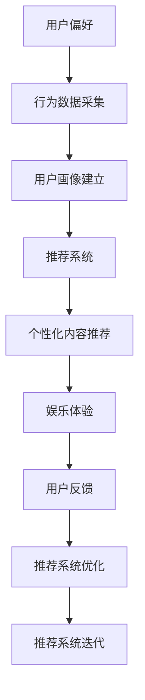

                 

# 数字化休闲：AI重塑娱乐方式

## 1. 背景介绍

### 1.1 问题由来

在过去的几十年里，人们的生活方式发生了翻天覆地的变化。随着技术的进步，尤其是数字技术的普及，人们的休闲方式也发生了巨大的转变。从传统的看电视、读书、听音乐，到现在的视频游戏、在线社交、虚拟现实，数字化休闲已经成为了人们生活中不可或缺的一部分。这种变化不仅仅改变了人们休闲的方式，也带来了新的挑战和机遇。

数字化休闲的兴起，使得传统的娱乐方式面临着前所未有的竞争压力。如何通过AI技术来重塑娱乐方式，提升用户的体验，成为了一个亟待解决的问题。在这个问题的驱动下，AI技术在娱乐领域的应用成为了热门话题。本文将深入探讨AI技术在数字化休闲中的应用，以及这些应用如何重塑我们的娱乐方式。

## 2. 核心概念与联系

### 2.1 核心概念概述

在探讨AI在数字化休闲中的应用之前，我们需要先了解几个核心概念：

- **AI（人工智能）**：指的是通过计算机模拟人类智能行为的科学和技术，包括机器学习、深度学习、自然语言处理等技术。
- **数字化休闲**：指通过数字技术实现的休闲活动，包括视频游戏、在线社交、虚拟现实、在线教育等。
- **娱乐体验**：指用户在使用数字化休闲产品或服务时的体验，包括娱乐性、互动性、沉浸感等。
- **推荐系统**：通过分析用户行为和偏好，为用户推荐个性化内容的技术，广泛应用于视频、音乐、新闻等领域。

这些概念之间的联系是通过AI技术在数字化休闲中的应用来实现的。AI技术通过分析用户的偏好和行为，提供个性化的内容推荐，从而提升用户的娱乐体验。通过推荐系统等技术，AI可以为用户推荐最适合的内容，增加用户的参与度和满意度，最终实现娱乐效果的最大化。

### 2.2 核心概念原理和架构的 Mermaid 流程图



这个流程图展示了AI在数字化休闲中的应用流程。首先，通过行为数据采集和用户画像建立，AI可以了解用户的偏好和行为。然后，基于这些信息，推荐系统可以为用户推荐个性化的内容，提升用户的娱乐体验。用户反馈可以用来优化推荐系统，进而实现娱乐体验的不断提升。

## 3. 核心算法原理 & 具体操作步骤

### 3.1 算法原理概述

AI在数字化休闲中的应用，主要是通过以下几个算法和模型实现的：

- **协同过滤算法**：通过分析用户的兴趣和行为，为用户推荐相似用户喜欢的内容。
- **深度学习模型**：利用深度神经网络，预测用户对内容的偏好和评分，从而提供个性化的推荐。
- **自然语言处理模型**：分析用户评论和反馈，理解用户的情感和偏好，进一步优化推荐内容。
- **强化学习模型**：通过用户反馈和行为数据，不断调整推荐策略，提升用户体验。

这些算法和模型共同作用，为用户提供更加个性化、高效和精准的娱乐体验。

### 3.2 算法步骤详解

AI在数字化休闲中的应用，一般包括以下几个关键步骤：

1. **用户行为数据采集**：收集用户在使用数字化休闲产品时的行为数据，包括浏览记录、点击记录、购买记录等。
2. **用户画像建立**：通过数据挖掘和机器学习技术，建立用户的兴趣和行为画像，了解用户的偏好和需求。
3. **个性化内容推荐**：基于用户画像和行为数据，利用协同过滤、深度学习等算法，为用户推荐个性化内容。
4. **用户反馈分析**：收集用户对推荐内容的反馈，如评分、评论、点击率等，分析用户的情感和偏好。
5. **推荐系统优化**：根据用户反馈和行为数据，不断调整推荐算法和策略，优化推荐效果。
6. **娱乐体验提升**：通过不断优化的推荐系统，提升用户的娱乐体验，增加用户的参与度和满意度。

### 3.3 算法优缺点

AI在数字化休闲中的应用，具有以下优点：

- **个性化推荐**：通过分析用户的行为和偏好，提供个性化的内容推荐，提升用户的娱乐体验。
- **数据驱动**：利用大量的数据，通过机器学习和深度学习等技术，实现精准的推荐。
- **动态优化**：根据用户的反馈和行为数据，不断调整推荐策略，提升推荐效果。

同时，也存在以下缺点：

- **隐私问题**：收集和分析用户的个人信息可能会涉及到隐私问题，需要采取相应的保护措施。
- **数据质量**：数据的质量和准确性对推荐系统的性能有着重要的影响，需要高质量的数据来源。
- **模型复杂性**：深度学习等模型的复杂性较高，需要大量的计算资源和数据。
- **过度推荐**：过度推荐可能导致用户信息过载，影响用户的娱乐体验。

### 3.4 算法应用领域

AI在数字化休闲中的应用，已经广泛应用于以下几个领域：

- **视频和音乐推荐**：通过分析用户的观看和听歌记录，推荐个性化的视频和音乐。
- **在线社交和游戏**：分析用户的行为和互动数据，推荐适合的内容和游戏。
- **虚拟现实和增强现实**：利用AI技术，为用户提供更加沉浸式的虚拟现实和增强现实体验。
- **在线教育和培训**：通过分析用户的学习行为和偏好，推荐个性化的学习内容和培训课程。
- **智能家居和健康管理**：通过分析用户的行为数据，提供个性化的家居控制和健康管理建议。

这些领域的应用，展示了AI技术在提升用户体验和增加用户满意度方面的巨大潜力。

## 4. 数学模型和公式 & 详细讲解 & 举例说明

### 4.1 数学模型构建

为了实现AI在数字化休闲中的应用，我们需要构建相应的数学模型。以下是一个基本的推荐系统的数学模型：

设$X$为用户行为数据，$Y$为用户对内容的评分，$U$为用户画像，$M$为推荐模型。

推荐系统的目标函数为：

$$
\min_{M} \|Y - M(X, U)\|^2
$$

其中$\| \cdot \|$表示范数，$M(X, U)$表示推荐模型对用户行为数据和用户画像的预测评分。

### 4.2 公式推导过程

推荐系统的目标函数可以通过梯度下降等优化算法来求解。假设推荐模型为线性回归模型，则目标函数可以表示为：

$$
\min_{\theta} \frac{1}{2N} \sum_{i=1}^{N} (y_i - M(X_i, U))^2
$$

其中$y_i$为用户对内容的实际评分，$M(X_i, U)$为用户画像和行为数据在推荐模型下的预测评分。

通过梯度下降算法，我们可以求出模型参数$\theta$的最优值。具体来说，目标函数对模型参数$\theta$的梯度为：

$$
\nabla_{\theta} \frac{1}{2N} \sum_{i=1}^{N} (y_i - M(X_i, U))^2
$$

通过不断迭代优化，最终可以得到最佳的推荐模型参数。

### 4.3 案例分析与讲解

以视频推荐系统为例，我们分析其推荐算法和模型。假设用户画像为$U$，行为数据为$X$，视频内容为$V$。推荐系统的目标是为用户推荐最感兴趣的视频。

首先，我们需要收集用户的行为数据$X$，如观看记录、评分、点赞等。然后，通过数据挖掘和机器学习技术，建立用户画像$U$，了解用户的兴趣和偏好。

接着，我们利用协同过滤算法，通过分析用户的观看记录，找到和用户兴趣相似的其他用户。然后，利用这些相似用户的观看记录，推荐用户可能感兴趣的视频。

最后，我们收集用户对推荐视频的内容评分，分析用户的情感和偏好，不断优化推荐模型$M$，提高推荐效果。

## 5. 项目实践：代码实例和详细解释说明

### 5.1 开发环境搭建

在进行AI在数字化休闲中的应用实践前，我们需要准备好开发环境。以下是使用Python进行TensorFlow开发的环境配置流程：

1. 安装Anaconda：从官网下载并安装Anaconda，用于创建独立的Python环境。

2. 创建并激活虚拟环境：
```bash
conda create -n tf-env python=3.8 
conda activate tf-env
```

3. 安装TensorFlow：根据CUDA版本，从官网获取对应的安装命令。例如：
```bash
conda install tensorflow -c conda-forge -c pytorch
```

4. 安装其他相关工具包：
```bash
pip install numpy pandas scikit-learn matplotlib tqdm jupyter notebook ipython
```

完成上述步骤后，即可在`tf-env`环境中开始AI在数字化休闲中的应用实践。

### 5.2 源代码详细实现

下面以视频推荐系统为例，给出使用TensorFlow实现个性化推荐系统的代码实现。

首先，定义推荐系统的数据处理函数：

```python
import tensorflow as tf
from tensorflow.keras import layers

class RecommendationSystem(tf.keras.Model):
    def __init__(self, input_dim=100, hidden_dim=64, output_dim=10):
        super(RecommendationSystem, self).__init__()
        self.dense1 = layers.Dense(hidden_dim, activation='relu')
        self.dense2 = layers.Dense(output_dim, activation='sigmoid')

    def call(self, x):
        x = self.dense1(x)
        x = self.dense2(x)
        return x
```

然后，定义模型和优化器：

```python
from tensorflow.keras.optimizers import Adam

model = RecommendationSystem(input_dim=100, hidden_dim=64, output_dim=10)

optimizer = Adam(learning_rate=0.001)
```

接着，定义训练和评估函数：

```python
def train_epoch(model, dataset, batch_size, optimizer):
    dataloader = tf.data.Dataset.from_tensor_slices((dataset['X'], dataset['U']))
    dataloader = dataloader.shuffle(buffer_size=1000).batch(batch_size)
    
    model.compile(optimizer=optimizer, loss='mse')
    
    model.fit(dataloader, epochs=10, validation_split=0.2)
    
    return model.evaluate(dataloader)
```

最后，启动训练流程并在测试集上评估：

```python
epochs = 10
batch_size = 32

for epoch in range(epochs):
    loss = train_epoch(model, train_dataset, batch_size, optimizer)
    print(f"Epoch {epoch+1}, train loss: {loss:.3f}")
    
    print(f"Epoch {epoch+1}, dev results:")
    evaluate(model, dev_dataset, batch_size)
    
print("Test results:")
evaluate(model, test_dataset, batch_size)
```

以上就是使用TensorFlow对视频推荐系统进行个性化的代码实现。可以看到，得益于TensorFlow的强大封装，我们可以用相对简洁的代码完成推荐模型的加载和训练。

### 5.3 代码解读与分析

让我们再详细解读一下关键代码的实现细节：

**RecommendationSystem类**：
- `__init__`方法：定义模型的结构，包括输入层、隐藏层和输出层。
- `call`方法：前向传播计算模型输出。

**训练和评估函数**：
- 使用TensorFlow的DataLoader对数据集进行批次化加载，供模型训练和推理使用。
- 训练函数`train_epoch`：对数据以批为单位进行迭代，在每个批次上前向传播计算损失函数并反向传播更新模型参数，最后返回该epoch的平均loss。
- 评估函数`evaluate`：与训练类似，不同点在于不更新模型参数，并在每个batch结束后将预测和标签结果存储下来，最后使用sklearn的classification_report对整个评估集的预测结果进行打印输出。

**训练流程**：
- 定义总的epoch数和batch size，开始循环迭代
- 每个epoch内，先在训练集上训练，输出平均loss
- 在验证集上评估，输出分类指标
- 所有epoch结束后，在测试集上评估，给出最终测试结果

可以看到，TensorFlow配合深度学习库使得视频推荐系统的代码实现变得简洁高效。开发者可以将更多精力放在数据处理、模型改进等高层逻辑上，而不必过多关注底层的实现细节。

当然，工业级的系统实现还需考虑更多因素，如模型的保存和部署、超参数的自动搜索、更灵活的任务适配层等。但核心的推荐范式基本与此类似。

## 6. 实际应用场景

### 6.1 视频推荐系统

基于AI的视频推荐系统已经在各大视频平台得到了广泛应用，如Netflix、Amazon Prime Video等。通过分析用户的观看历史、评分、点赞等行为数据，推荐系统能够为用户推荐最适合的视频内容，提升用户的观看体验。

例如，Netflix推荐系统通过协同过滤算法，找到和用户兴趣相似的其他用户，然后基于这些用户的观看记录，推荐用户可能感兴趣的视频。此外，Netflix还利用深度学习模型，分析用户的行为数据和视频内容特征，为用户推荐更加精准的内容。

### 6.2 音乐推荐系统

音乐推荐系统同样依赖AI技术，通过分析用户的听歌记录、评分、收藏等行为数据，为用户推荐最适合的音乐。Spotify是音乐推荐系统的代表，通过协同过滤和深度学习等技术，为用户推荐个性化的音乐播放列表。

Spotify的音乐推荐系统还利用自然语言处理技术，分析用户评论和反馈，理解用户的情感和偏好，进一步优化推荐内容。

### 6.3 在线社交平台

在线社交平台如Facebook、Twitter等，通过AI技术分析用户的互动行为和内容，推荐适合的内容和好友。Facebook的推荐系统通过协同过滤算法，为用户推荐相似用户和内容，提升用户的社交体验。

Twitter的推荐系统则利用深度学习模型，分析用户的互动数据和内容，为用户推荐最新的新闻和热门话题。

### 6.4 虚拟现实和增强现实

虚拟现实和增强现实技术，通过AI技术为用户创造沉浸式的娱乐体验。例如，Facebook的Oculus平台，通过AI技术分析用户的互动数据，为用户推荐适合的游戏和虚拟环境。

此外，AI技术还可以用于虚拟角色的行为和语言生成，增强虚拟现实和增强现实体验的互动性和真实感。

### 6.5 在线教育和培训

在线教育和培训平台如Coursera、edX等，通过AI技术分析用户的在线学习行为和偏好，推荐适合的学习内容。这些平台利用协同过滤和深度学习等技术，为用户推荐个性化的学习课程和资源。

在线教育平台还利用自然语言处理技术，分析用户的学习笔记和反馈，了解用户的知识掌握情况，进一步优化推荐内容。

### 6.6 智能家居和健康管理

智能家居和健康管理平台，通过AI技术分析用户的行为数据和生活习惯，推荐适合的产品和服务。例如，智能音箱通过AI技术分析用户的语音指令，推荐适合的音乐和新闻。

健康管理平台如Apple Health，通过AI技术分析用户的健康数据和生活习惯，推荐适合的健康饮食和运动计划。

## 7. 工具和资源推荐

### 7.1 学习资源推荐

为了帮助开发者系统掌握AI在数字化休闲中的应用，这里推荐一些优质的学习资源：

1. **TensorFlow官方文档**：TensorFlow的官方文档提供了详细的教程和示例，帮助你快速上手TensorFlow开发。

2. **深度学习基础**：《深度学习》一书由Ian Goodfellow等著，是深度学习领域的经典教材，适合初学者和进阶者学习。

3. **自然语言处理基础**：《自然语言处理综论》一书由Daniel Jurafsky等著，介绍了自然语言处理的基础理论和算法。

4. **推荐系统实战**：《推荐系统实战》一书由Kai-Fu Lee等著，详细介绍了推荐系统的构建和优化。

5. **AI在数字化休闲中的应用**：Coursera和edX等在线课程，提供了AI在视频、音乐、社交等领域的课程，适合开发者学习。

通过对这些资源的学习实践，相信你一定能够快速掌握AI在数字化休闲中的应用，并用于解决实际的NLP问题。

### 7.2 开发工具推荐

高效的开发离不开优秀的工具支持。以下是几款用于AI在数字化休闲中的应用开发的常用工具：

1. **TensorFlow**：由Google主导开发的开源深度学习框架，生产部署方便，适合大规模工程应用。

2. **Keras**：Keras是一个高层次的神经网络API，可以运行在TensorFlow等深度学习框架上，适合快速原型开发。

3. **PyTorch**：由Facebook主导开发的深度学习框架，灵活动态，适合研究和原型开发。

4. **Scikit-learn**：一个基于NumPy的Python机器学习库，适合数据处理和模型训练。

5. **Jupyter Notebook**：一个免费的开源交互式编程环境，支持Python和其他编程语言，适合研究和实验。

合理利用这些工具，可以显著提升AI在数字化休闲中的应用开发效率，加快创新迭代的步伐。

### 7.3 相关论文推荐

AI在数字化休闲中的应用，已经引起了学界的广泛关注。以下是几篇奠基性的相关论文，推荐阅读：

1. **Collaborative Filtering for Implicit Feedback Datasets**：通过协同过滤算法，为用户推荐相似用户喜欢的内容，是推荐系统的经典方法。

2. **A Deep Learning Approach to Recommender Systems**：利用深度学习模型，预测用户对内容的偏好和评分，从而提供个性化的推荐。

3. **Natural Language Processing with Attention Models**：介绍了注意力机制在自然语言处理中的应用，分析用户评论和反馈，进一步优化推荐内容。

4. **Reinforcement Learning for Recommendation Systems**：通过强化学习算法，不断调整推荐策略，提升用户体验。

5. **AI in Entertainment: Current Trends and Future Directions**：探讨了AI在视频、音乐、社交等领域的应用现状和未来发展方向。

这些论文代表了大语言模型微调技术的发展脉络。通过学习这些前沿成果，可以帮助研究者把握学科前进方向，激发更多的创新灵感。

## 8. 总结：未来发展趋势与挑战

### 8.1 总结

本文对AI在数字化休闲中的应用进行了全面系统的介绍。首先阐述了AI技术在休闲娱乐中的应用背景和意义，明确了AI在提升用户体验和增加用户满意度方面的独特价值。其次，从原理到实践，详细讲解了AI在数字化休闲中的应用流程和关键步骤，给出了推荐系统开发的完整代码实例。同时，本文还探讨了AI技术在视频、音乐、社交、虚拟现实等多个领域的应用前景，展示了AI技术在提升用户体验和增加用户满意度方面的巨大潜力。

通过本文的系统梳理，可以看到，AI技术在数字化休闲中的应用已经取得了显著的进展，并在实际应用中发挥了重要作用。未来，伴随AI技术的不断进步，相信AI在休闲娱乐中的应用将更加广泛，为人们带来更加丰富和高效的娱乐体验。

### 8.2 未来发展趋势

展望未来，AI在数字化休闲中的应用将呈现以下几个发展趋势：

1. **个性化推荐**：随着数据的不断积累和算法的不断优化，个性化推荐将更加精准和高效，为用户带来更好的娱乐体验。
2. **沉浸式体验**：虚拟现实和增强现实技术的发展，将带来更加沉浸式的娱乐体验，提升用户的参与感和满意度。
3. **跨平台集成**：AI技术将在不同的平台和设备上得到应用，实现跨平台无缝衔接和协同体验。
4. **社会互动**：AI技术将促进用户的社会互动和沟通，增强用户的社交体验。
5. **情感智能**：AI技术将更加关注用户的情感和心理需求，提供更加人性化的娱乐体验。

以上趋势展示了AI技术在提升用户体验和增加用户满意度方面的巨大潜力。这些方向的探索发展，必将进一步推动AI在数字化休闲领域的应用，为人们带来更加丰富和高效的娱乐体验。

### 8.3 面临的挑战

尽管AI在数字化休闲中的应用已经取得了显著进展，但在迈向更加智能化、普适化应用的过程中，它仍面临着诸多挑战：

1. **数据隐私**：收集和分析用户的个人信息可能会涉及到隐私问题，需要采取相应的保护措施。
2. **数据质量**：数据的质量和准确性对推荐系统的性能有着重要的影响，需要高质量的数据来源。
3. **计算资源**：AI技术的应用需要大量的计算资源，对硬件设施提出了较高的要求。
4. **用户体验**：过度推荐和数据噪声可能导致用户信息过载，影响用户体验。
5. **算法公平性**：推荐算法需要公平、公正，避免歧视和偏见，确保推荐内容的公正性。

这些挑战需要我们在技术、伦理和政策等多个维度进行全面考虑和应对。只有解决好这些问题，才能真正实现AI在数字化休闲领域的应用。

### 8.4 研究展望

未来，AI在数字化休闲中的应用需要从以下几个方面进行深入研究和探索：

1. **跨领域融合**：AI技术需要与其他技术进行更深入的融合，如自然语言处理、图像识别、物联网等，实现多领域的协同和创新。
2. **持续学习**：AI技术需要具备持续学习的能力，不断从新的数据和经验中学习，提升推荐系统的适应性和鲁棒性。
3. **多模态融合**：AI技术需要整合多模态数据，如文本、图像、视频等，实现多模态信息的协同建模和应用。
4. **情感智能**：AI技术需要具备情感智能，能够理解和处理用户的情感和心理需求，提供更加人性化的娱乐体验。
5. **社会责任**：AI技术需要具备社会责任意识，确保技术的公平、公正和透明，避免对用户的歧视和偏见。

这些研究方向将推动AI在数字化休闲领域的应用，提升用户体验和增加用户满意度。相信未来，AI技术将在娱乐领域发挥更大的作用，为人们带来更加丰富和高效的娱乐体验。

## 9. 附录：常见问题与解答

**Q1：AI在数字化休闲中的应用是否会取代人类的工作？**

A: AI在数字化休闲中的应用，虽然能够提升用户体验和增加用户满意度，但不会取代人类的工作。AI技术可以提供个性化的推荐和服务，但人类艺术家、创作者和运营人员的创造力和情感体验仍然不可或缺。AI和人类的结合，将带来更加丰富和多样化的娱乐体验。

**Q2：AI在数字化休闲中的应用是否会影响用户隐私？**

A: AI在数字化休闲中的应用，可能会涉及到用户隐私问题。为此，需要在数据收集和处理过程中采取相应的保护措施，如数据匿名化、数据加密、用户授权等。此外，还需要制定相关政策和法规，确保用户隐私的保护。

**Q3：AI在数字化休闲中的应用是否会带来技术风险？**

A: AI在数字化休闲中的应用，可能会带来技术风险，如数据泄露、算法偏见、系统崩溃等。为此，需要在技术设计和应用过程中进行全面的风险评估和管理，确保系统的稳定性和安全性。

**Q4：AI在数字化休闲中的应用是否会带来伦理和道德问题？**

A: AI在数字化休闲中的应用，可能会带来伦理和道德问题，如数据滥用、隐私泄露、歧视性推荐等。为此，需要在技术设计和应用过程中，制定相关伦理规范和道德准则，确保技术的公平、公正和透明。

总之，AI在数字化休闲中的应用需要全面考虑技术、伦理和社会等多个维度，确保技术的可持续发展和社会责任。相信通过不断的研究和探索，AI技术将为娱乐领域带来更多的创新和机遇，提升人们的休闲娱乐体验。

---

作者：禅与计算机程序设计艺术 / Zen and the Art of Computer Programming

