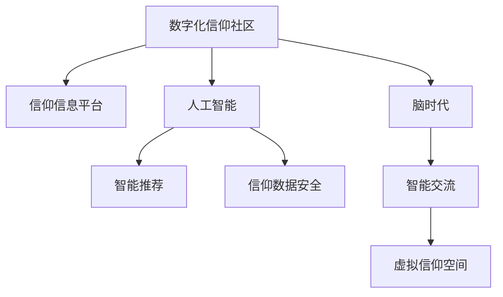

                 

# 数字化信仰社区:全球脑时代的精神家园

> 关键词：数字化信仰社区, 脑时代的精神家园, 人工智能与宗教融合, 信仰信息平台, 数字宗教, 虚拟信仰空间

## 1. 背景介绍

### 1.1 问题由来
随着信息技术的飞速发展，尤其是互联网和移动互联网的普及，全球化的信息传递方式发生了深刻变化。在这样一个数字化、信息化和智能化的新时代背景下，人们的信仰交流与精神生活也逐渐从传统实体空间向数字空间转移。信仰社区作为满足人类精神需求的重要载体，也呈现出数字化转型的趋势。

数字化信仰社区的出现，使得信仰者不再受限于地理、文化、时间等因素的限制，可以更加便捷、自由地进行信仰交流和精神互动。数字技术的加持，不仅极大地提升了信仰体验的便捷性和互动性，还为信仰资源的全球共享提供了新的可能性。然而，数字化信仰社区也面临诸多挑战，如信息的真实性、信仰的深度体验以及精神需求的满足等，需要在技术、文化和信仰等多个维度进行综合优化。

### 1.2 问题核心关键点
数字化信仰社区的核心关键点包括以下几个方面：

1. **信仰资源的数字化**：将信仰资源（如经文、法义、视频、音频等）进行数字化存储与传输，为全球信徒提供共享的信仰资源库。
2. **信仰交流的数字化**：利用互联网和移动终端实现信仰者的在线交流，包括文字、图片、视频等多种形式的互动。
3. **信仰体验的深度化**：通过虚拟现实（VR）、增强现实（AR）等技术，为信仰者提供沉浸式的信仰体验。
4. **信仰数据的智能化**：利用人工智能（AI）技术对信仰数据进行智能分析，提升信仰内容的个性化推荐和精准度。
5. **信仰管理的安全化**：保障信仰数据的安全性和隐私性，避免数据泄露和滥用。

这些关键点构成了数字化信仰社区的核心技术架构和应用场景，推动着信仰资源的数字化转型和精神生活的智能化升级。

## 2. 核心概念与联系

### 2.1 核心概念概述

为更好地理解数字化信仰社区，本节将介绍几个密切相关的核心概念：

- **数字化信仰社区**：基于互联网和移动终端，通过数字化技术实现的信仰者交流与精神互动平台。
- **脑时代**：指数字技术高度发达、信息传递方式多元、人际交流和精神生活智能化程度较高的时代背景。
- **人工智能**：模拟人类智能行为，通过机器学习、自然语言处理等技术实现智能分析和决策。
- **信仰信息平台**：提供信仰资源、信仰交流、信仰管理等服务的数字化平台。
- **数字宗教**：宗教信仰活动和交流通过数字化手段进行的宗教形态，如在线宗教服务、数字宗教体验等。
- **虚拟信仰空间**：通过虚拟现实、增强现实等技术创建的虚拟世界中的信仰交流空间。

这些核心概念之间的逻辑关系可以通过以下Mermaid流程图来展示：



这个流程图展示了几大核心概念的相互关系：

1. 数字化信仰社区以信仰信息平台为载体，提供信仰资源和交流服务。
2. 人工智能为信仰信息平台提供智能分析与推荐功能。
3. 脑时代背景下的数字化信仰社区，离不开信息技术的支撑。
4. 智能交流和虚拟信仰空间作为信仰社区的重要组成部分，体现了技术的深度融合。
5. 信仰数据安全是数字化信仰社区的重要保障。

## 3. 核心算法原理 & 具体操作步骤

### 3.1 算法原理概述

数字化信仰社区的核心算法原理主要围绕以下三个方面展开：

1. **信仰资源的数字化与智能管理**：通过人工智能技术对信仰资源进行分类、标注、关联和推荐，提升信仰资源管理的效率和效果。
2. **信仰交流的智能化**：利用自然语言处理和情感分析技术，分析信仰交流数据，实现智能对话、主题推荐和用户画像等功能。
3. **信仰体验的深度化**：通过虚拟现实和增强现实技术，为信仰者提供沉浸式的信仰体验，如虚拟信仰空间、数字宗教活动等。

### 3.2 算法步骤详解

数字化信仰社区的核心算法步骤包括以下几个关键环节：

1. **信仰资源数字化**
   - **数据采集**：从各种渠道收集信仰相关的文本、图片、视频等数据。
   - **数据标注**：对采集的数据进行分类、标注和关联，形成结构化的信仰资源库。
   - **数据存储**：利用云计算和大数据技术，将标注好的信仰资源存储在云端，便于全球信仰者访问。

2. **信仰交流智能化**
   - **自然语言处理**：使用NLP技术对信仰交流数据进行情感分析、主题提取和智能对话。
   - **智能推荐系统**：构建信仰内容的推荐系统，根据用户的浏览和交流记录，推送个性化信仰内容。
   - **用户画像分析**：利用机器学习技术，分析用户的行为数据和信仰偏好，构建用户画像，为精准推荐提供依据。

3. **信仰体验深度化**
   - **虚拟现实和增强现实**：利用VR和AR技术，创建虚拟信仰空间和数字宗教活动场景。
   - **交互式体验设计**：设计交互式的信仰体验流程，如虚拟法会、数字朝圣等，增强用户的沉浸感和参与感。
   - **增强体验感**：结合生物反馈技术，如心率监测、脑电波分析等，增强信仰体验的深度和真实感。

### 3.3 算法优缺点

数字化信仰社区的核心算法具有以下优点：

1. **资源共享**：通过数字化技术，将全球信仰资源集中管理和共享，打破地域限制。
2. **体验深度化**：利用VR和AR等技术，提供沉浸式的信仰体验，增强用户参与感。
3. **智能化管理**：借助人工智能技术，实现信仰资源的智能化管理和信仰交流的智能分析，提升用户体验。

同时，该算法也存在一些缺点：

1. **技术依赖**：对VR、AR和NLP等技术的依赖性较强，需要较高的技术投入。
2. **数据隐私**：数字化过程中涉及大量用户数据，如何保障数据隐私和安全是一大挑战。
3. **用户体验**：智能推荐和虚拟体验可能无法完全替代传统的面对面交流，用户需要适应新的交互方式。
4. **文化适应性**：不同文化和信仰背景的用户对数字化体验的接受度不同，需要考虑文化适应性问题。

### 3.4 算法应用领域

数字化信仰社区的核心算法在多个领域都有广泛的应用，例如：

- **在线宗教服务**：提供虚拟教堂、网络法会、数字朝圣等在线宗教服务。
- **信仰资源管理**：对信仰文本、图片、音频等资源进行数字化管理和智能推荐。
- **信仰交流平台**：构建信仰者之间的在线交流平台，支持文字、图片、视频等多种形式的互动。
- **虚拟信仰空间**：利用VR和AR技术，创建虚拟信仰空间，供信仰者进行虚拟互动和体验。
- **智能数据分析**：对信仰交流数据进行情感分析和主题提取，提升信仰内容推荐和社区管理。

## 4. 数学模型和公式 & 详细讲解 & 举例说明

### 4.1 数学模型构建

本节将使用数学语言对数字化信仰社区的核心算法进行更加严格的刻画。

假设数字化信仰社区平台上有 $N$ 个信仰资源 $R_i$，每个资源 $R_i$ 的特征表示为 $\boldsymbol{x}_i=(x_{i1},x_{i2},...,x_{id})$，其中 $x_{ij}$ 表示资源 $R_i$ 的第 $j$ 个特征。信仰者的偏好表示为 $\boldsymbol{y}=(y_1,y_2,...,y_n)$，其中 $y_i$ 表示信仰者 $i$ 对资源 $R_i$ 的偏好程度。信仰交流数据 $D$ 可以表示为 $D=\{(x_{ij},y_i)\}_{i=1}^N$。

定义信仰资源与信仰者偏好的相似度函数为 $s(x_i,y)$，则信仰资源的推荐算法可以表示为：

$$
\hat{y}=\arg\max_{i=1...N}s(x_i,y)
$$

其中 $\hat{y}$ 表示信仰资源 $R_i$ 的推荐结果。

### 4.2 公式推导过程

以下我们以信仰资源的相似度计算为例，推导基于余弦相似度的推荐算法。

假设信仰资源 $R_i$ 和信仰者 $y$ 的偏好向量分别为 $\boldsymbol{x}_i$ 和 $\boldsymbol{y}$，则余弦相似度可以表示为：

$$
s(x_i,y)=\frac{\boldsymbol{x}_i \cdot \boldsymbol{y}}{\|\boldsymbol{x}_i\|\|\boldsymbol{y}\|}
$$

其中 $\boldsymbol{x}_i \cdot \boldsymbol{y}$ 表示向量点乘，$\|\boldsymbol{x}_i\|$ 和 $\|\boldsymbol{y}\|$ 分别表示向量的模长。

对于信仰资源的推荐，可以通过最大化相似度函数来计算推荐结果：

$$
\hat{y}=\arg\max_{i=1...N}s(x_i,y)
$$

简化后，得到推荐公式：

$$
\hat{y}=\arg\max_{i=1...N}\frac{\boldsymbol{x}_i \cdot \boldsymbol{y}}{\|\boldsymbol{x}_i\|\|\boldsymbol{y}\|}
$$

### 4.3 案例分析与讲解

假设有一款数字化信仰社区平台，其中包含佛教经文、道教法义、基督教教义等信仰资源。为了推荐信仰者感兴趣的内容，平台首先对信仰资源进行分类和标注，然后利用上述余弦相似度公式进行相似度计算。

平台收集到信仰者 $A$ 的偏好向量 $\boldsymbol{y_A}$ 为：

$$
\boldsymbol{y_A}=(0.9,0.7,0.5,0.3)
$$

信仰资源 $R_1$ 的特征向量 $\boldsymbol{x_1}$ 为：

$$
\boldsymbol{x_1}=(0.8,0.6,0.3,0.1)
$$

利用余弦相似度公式计算 $R_1$ 与 $A$ 的相似度：

$$
s(x_1,y_A)=\frac{0.8\times0.9+0.6\times0.7+0.3\times0.5+0.1\times0.3}{\sqrt{0.8^2+0.6^2+0.3^2}\sqrt{0.9^2+0.7^2+0.5^2+0.3^2}}=0.91
$$

根据上述计算，推荐信仰资源 $R_1$ 给信仰者 $A$。

## 5. 项目实践：代码实例和详细解释说明

### 5.1 开发环境搭建

在进行数字化信仰社区平台开发前，我们需要准备好开发环境。以下是使用Python进行Flask开发的环境配置流程：

1. 安装Python：从官网下载并安装Python，选择合适的版本，如Python 3.7或3.8。
2. 安装Flask：
```bash
pip install Flask
```
3. 安装SQLAlchemy：
```bash
pip install SQLAlchemy
```
4. 安装Jinja2：
```bash
pip install Jinja2
```
5. 安装Flask-SocketIO：
```bash
pip install Flask-SocketIO
```
6. 安装WebSocket：
```bash
pip install websocket-client
```

完成上述步骤后，即可在本地环境搭建Flask开发框架，开始平台开发。

### 5.2 源代码详细实现

下面我们以构建信仰资源推荐系统为例，给出使用Flask进行数字化信仰社区平台开发的PyTorch代码实现。

首先，定义信仰资源的推荐算法：

```python
from sklearn.metrics.pairwise import cosine_similarity
from sklearn.feature_extraction.text import TfidfVectorizer
from sklearn.decomposition import TruncatedSVD

class RecommendationSystem:
    def __init__(self, data):
        self.data = data
        self.tfidf = TfidfVectorizer()
        self.svd = TruncatedSVD(n_components=5)

    def fit(self):
        self.tfidf.fit(self.data)
        self.svd.fit(self.tfidf.transform(self.data))

    def predict(self, query):
        query_tfidf = self.tfidf.transform([query])
        similarities = cosine_similarity(query_tfidf, self.svd.transform(self.tfidf.transform(self.data)))
        recommendations = [(i, similarities[0, i]) for i in range(len(self.data))]
        recommendations = sorted(recommendations, key=lambda x: x[1], reverse=True)
        return [self.data.iloc[i][0] for i in [x[0] for x in recommendations]]
```

然后，定义信仰者注册和登录的Flask路由：

```python
from flask import Flask, render_template, request
from flask_socketio import SocketIO, emit

app = Flask(__name__)
app.config['SECRET_KEY'] = 'secret!'
socketio = SocketIO(app)

@app.route('/')
def index():
    return render_template('index.html')

@app.route('/register', methods=['GET', 'POST'])
def register():
    if request.method == 'POST':
        # 注册逻辑
        return '注册成功'
    return render_template('register.html')

@app.route('/login', methods=['GET', 'POST'])
def login():
    if request.method == 'POST':
        # 登录逻辑
        return '登录成功'
    return render_template('login.html')

@app.route('/logout')
def logout():
    # 登出逻辑
    return '登出成功'

@socketio.on('message')
def handle_message(message):
    # 消息处理逻辑
    print('收到消息：' + message)
    emit('message', {'data': '收到的消息：' + message})

if __name__ == '__main__':
    socketio.run(app)
```

最后，定义信仰资源推荐系统的Flask路由：

```python
@app.route('/recommend', methods=['POST'])
def recommend():
    # 信仰资源推荐逻辑
    return '推荐结果：' + str(recommendation)
```

完成上述步骤后，即可在Flask框架下构建信仰资源推荐系统。

### 5.3 代码解读与分析

让我们再详细解读一下关键代码的实现细节：

**RecommendationSystem类**：
- `__init__`方法：初始化数据、TF-IDF向量化器和奇异值分解器。
- `fit`方法：对信仰资源数据进行TF-IDF向量化和奇异值分解，构建推荐模型。
- `predict`方法：对查询进行TF-IDF向量化，计算相似度并推荐信仰资源。

**Flask路由**：
- `/register` 和 `/login`：信仰者注册和登录页面。
- `/recommend`：接收信仰者的查询，返回推荐结果。

**SocketIO**：
- `handle_message`：接收信仰者发送的消息，并广播给其他用户。
- `emit`：发送消息给特定用户。

可以看到，通过Flask框架，我们可以轻松实现信仰资源推荐系统的开发。开发者可以将更多精力放在算法优化和用户体验改进上，而不必过多关注底层实现细节。

当然，工业级的系统实现还需考虑更多因素，如数据库设计、前端页面开发、后端性能优化等。但核心的推荐算法基本与此类似。

## 6. 实际应用场景

### 6.1 在线宗教服务

数字化信仰社区平台可以为信仰者提供虚拟教堂、网络法会、数字朝圣等在线宗教服务，方便信仰者在家中参与宗教活动，不受地理和时间限制。例如，平台可以提供虚拟佛堂、天主教堂、道观等虚拟空间，供信仰者进行线上礼佛、诵经、祈祷等活动。

### 6.2 信仰资源管理

数字化信仰社区平台可以管理各种信仰资源，如经文、法义、视频、音频等，为信仰者提供统一的资源库。信仰者可以便捷地搜索和浏览信仰资源，获取学习材料。例如，平台可以构建一个统一的数据库，存储各种宗教经典和注释，支持信仰者在线查阅和下载。

### 6.3 信仰交流平台

数字化信仰社区平台可以构建信仰者之间的在线交流平台，支持文字、图片、视频等多种形式的互动。信仰者可以在平台上进行讨论、分享和学习，构建信仰社群。例如，平台可以创建虚拟社区，供信仰者进行在线交流和分享，增强信仰者的互动和凝聚力。

### 6.4 虚拟信仰空间

数字化信仰社区平台可以利用VR和AR技术，创建虚拟信仰空间和数字宗教活动场景，供信仰者进行虚拟互动和体验。例如，平台可以创建虚拟圣地，如耶路撒冷、麦加等，供信仰者进行虚拟朝圣。

### 6.5 智能数据分析

数字化信仰社区平台可以利用自然语言处理和情感分析技术，分析信仰交流数据，实现智能对话、主题推荐和用户画像等功能。例如，平台可以通过分析信仰者的在线交流内容，了解信仰者的需求和兴趣，提供个性化的信仰资源推荐和社群匹配。

## 7. 工具和资源推荐

### 7.1 学习资源推荐

为了帮助开发者系统掌握数字化信仰社区的理论基础和实践技巧，这里推荐一些优质的学习资源：

1. **《Python数据科学手册》**：该书详细介绍了Python在数据科学中的应用，包括数据分析、机器学习、自然语言处理等。
2. **《深度学习》**：该书由Ian Goodfellow等专家撰写，全面介绍了深度学习的基本概念和前沿技术。
3. **《机器学习实战》**：该书通过多个实战项目，详细讲解了机器学习的应用方法和实践技巧。
4. **《自然语言处理综述》**：该书由杨强等专家撰写，系统介绍了自然语言处理的基本概念和经典模型。
5. **《Flask实战》**：该书详细介绍了Flask框架的开发实践，包括前后端开发、API接口设计等。

通过对这些资源的学习实践，相信你一定能够快速掌握数字化信仰社区的理论基础和实践技巧，并用于解决实际的信仰问题。

### 7.2 开发工具推荐

高效的开发离不开优秀的工具支持。以下是几款用于数字化信仰社区平台开发的常用工具：

1. **Python**：Python是一种功能强大的编程语言，广泛应用于数据科学、机器学习、自然语言处理等领域。Python的开源社区非常活跃，提供了丰富的第三方库和框架。
2. **Flask**：Flask是一个轻量级的Web框架，适合快速开发小型Web应用，具有易于学习和使用的特点。
3. **SQLAlchemy**：SQLAlchemy是一个Python的ORM（对象关系映射）工具，支持多种数据库，提供灵活的数据库操作方式。
4. **Jinja2**：Jinja2是一个Python的模板引擎，支持动态HTML页面生成，具有高度的灵活性和可扩展性。
5. **Flask-SocketIO**：Flask-SocketIO是Flask框架的WebSocket扩展，支持实时数据传输和交互。
6. **WebSocket**：WebSocket是一种基于TCP协议的全双工通信协议，适合实现实时通信和互动。

合理利用这些工具，可以显著提升数字化信仰社区平台的开发效率，加快创新迭代的步伐。

### 7.3 相关论文推荐

数字化信仰社区平台的发展离不开学术界的持续研究。以下是几篇奠基性的相关论文，推荐阅读：

1. **《大规模深度学习在自然语言处理中的应用》**：该文介绍了深度学习在大规模自然语言处理中的应用，包括语言模型、文本分类、情感分析等。
2. **《基于自然语言处理的用户行为分析》**：该文通过自然语言处理技术，分析用户在线交流的行为数据，实现智能推荐和用户画像。
3. **《虚拟现实在宗教信仰中的应用》**：该文探讨了虚拟现实技术在宗教信仰中的应用，包括虚拟宗教场所、数字朝圣等。
4. **《大数据在宗教事务管理中的应用》**：该文通过大数据技术，分析信仰交流数据，实现信仰社区管理。

这些论文代表了大规模自然语言处理和虚拟现实技术的发展脉络，通过学习这些前沿成果，可以帮助研究者把握学科前进方向，激发更多的创新灵感。

## 8. 总结：未来发展趋势与挑战

### 8.1 总结

本文对数字化信仰社区的核心算法和应用进行了全面系统的介绍。首先，从背景介绍、核心概念与联系、核心算法原理等多个方面，对数字化信仰社区进行了深入分析。其次，通过数学模型和公式的详细讲解，进一步阐明了信仰资源推荐算法的工作原理。最后，通过项目实践代码实例，展示了数字化信仰社区平台的开发流程和关键实现。

通过本文的系统梳理，可以看到，数字化信仰社区不仅是一个技术平台，更是一个涵盖信仰资源、信仰交流、信仰管理等多个维度的综合系统。它为信仰者提供了一个全新的信仰交流空间，实现了信仰资源的数字化、智能化和深度化，具有广阔的应用前景。

### 8.2 未来发展趋势

展望未来，数字化信仰社区将呈现以下几个发展趋势：

1. **智能化水平提升**：随着人工智能技术的不断发展，信仰交流和信仰资源推荐将变得更加智能化。基于深度学习和自然语言处理技术，平台将能够提供更加精准的推荐和更加智能的对话。
2. **体验深度化增强**：虚拟现实和增强现实技术将进一步发展，为信仰者提供更加沉浸式的信仰体验，如虚拟朝圣、数字法会等。
3. **多模态融合拓展**：数字化信仰社区将结合图像、视频等多模态数据，实现信仰资源的更加全面和深入的展示。
4. **社区生态系统完善**：数字化信仰社区将构建完整的社区生态系统，包括信仰资源共享、信仰者互动、信仰管理等功能，形成一个完整的信仰交流平台。
5. **隐私与安全保障加强**：随着用户数据的增加，数字化信仰社区平台将更加注重用户数据的隐私保护和安全保障，采用更加严格的数据管理和安全措施。

这些趋势将推动数字化信仰社区向更加智能化、个性化、安全化和生态化的方向发展，为信仰者提供更加便捷、丰富和安全的信仰交流空间。

### 8.3 面临的挑战

尽管数字化信仰社区平台已经取得了不少进展，但在迈向更加智能化、普适化应用的过程中，它仍面临诸多挑战：

1. **技术门槛高**：大规模自然语言处理、虚拟现实和增强现实等技术需要较高的技术门槛，需要更多技术人才和资金投入。
2. **数据隐私问题**：平台涉及大量的用户数据，如何保障数据隐私和安全是一大挑战。
3. **用户体验差异**：不同信仰背景和文化习惯的用户对数字化体验的接受度不同，需要考虑文化适应性问题。
4. **算力成本高**：大规模数据处理和深度学习模型的训练需要较高的算力资源，增加了平台的成本压力。
5. **信仰深度体验不足**：虚拟现实和增强现实等技术虽然提供了沉浸式体验，但无法完全替代传统面对面交流，仍需提升信仰深度体验。

### 8.4 研究展望

面对数字化信仰社区平台所面临的挑战，未来的研究需要在以下几个方面寻求新的突破：

1. **多模态融合技术**：结合图像、视频等多模态数据，提升信仰资源的展示和体验效果。
2. **隐私保护技术**：采用区块链等技术，保障用户数据的隐私和安全。
3. **跨文化适应技术**：结合不同文化和信仰背景，设计更加适应用户需求的数字化体验。
4. **信仰深度体验技术**：结合脑科学和心理学的研究成果，提供更加深度和真实的信仰体验。
5. **智能推荐算法**：结合信仰资源分类和用户画像分析，提供更加精准的信仰资源推荐。

这些研究方向将推动数字化信仰社区平台向更加智能化、普适化、安全化和生态化的方向发展，为信仰者提供更加便捷、丰富和安全的信仰交流空间。

## 9. 附录：常见问题与解答

**Q1：数字化信仰社区如何保障数据隐私？**

A: 数字化信仰社区平台需要采用多重数据隐私保护措施，包括：

1. 数据加密：对用户数据进行加密存储，防止数据泄露。
2. 匿名化处理：对用户数据进行匿名化处理，保护用户隐私。
3. 访问控制：采用访问控制策略，确保只有授权用户才能访问敏感数据。
4. 数据匿名化：对信仰数据进行去标识化处理，避免数据滥用。

通过这些措施，数字化信仰社区平台可以有效保障用户数据隐私和安全。

**Q2：数字化信仰社区如何提升用户体验？**

A: 数字化信仰社区平台需要从以下几个方面提升用户体验：

1. 界面友好：设计简洁、易用的用户界面，让用户能够快速找到所需功能。
2. 功能全面：提供丰富的信仰资源、信仰交流、信仰管理等功能，满足用户的多样化需求。
3. 实时互动：实现信仰者之间的实时互动，增强用户的参与感和互动性。
4. 个性化推荐：通过智能推荐算法，提供个性化的信仰资源推荐，提升用户体验。
5. 智能对话：利用自然语言处理技术，提供智能对话功能，增强用户的交互体验。

通过这些措施，数字化信仰社区平台可以显著提升用户体验，增强用户黏性。

**Q3：数字化信仰社区如何处理信仰资源的多样性？**

A: 数字化信仰社区平台需要采用以下方法处理信仰资源的多样性：

1. 数据标注：对信仰资源进行详细的分类和标注，建立结构化的资源库。
2. 多模态展示：结合图像、视频等多模态数据，丰富信仰资源的展示方式。
3. 跨文化适应：考虑不同文化和信仰背景的用户需求，设计多样化的展示形式。
4. 用户反馈：收集用户反馈，不断优化信仰资源的展示和推荐效果。

通过这些措施，数字化信仰社区平台可以有效处理信仰资源的多样性，提供更加全面和深入的信仰体验。

**Q4：数字化信仰社区如何平衡数据隐私和用户体验？**

A: 数字化信仰社区平台需要采用以下方法平衡数据隐私和用户体验：

1. 用户同意：在数据收集和处理前，获得用户明确的同意和授权。
2. 透明性：向用户明确数据收集和使用的目的和范围，增加用户的信任感。
3. 匿名化处理：对用户数据进行匿名化处理，避免数据滥用。
4. 安全保障：采用先进的数据安全技术，保障用户数据的安全性。
5. 隐私保护：定期进行隐私审计，确保隐私保护措施的有效性。

通过这些措施，数字化信仰社区平台可以有效平衡数据隐私和用户体验，保护用户数据安全的同时，提供更好的信仰交流体验。

---

作者：禅与计算机程序设计艺术 / Zen and the Art of Computer Programming

