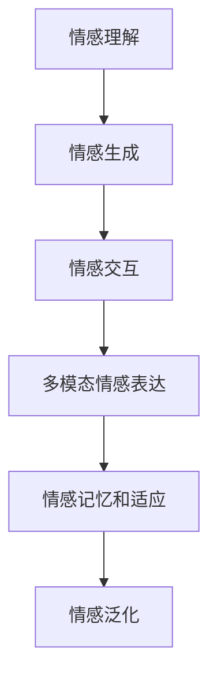

                 

# 数字化情感:元宇宙中的虚拟关系构建

在元宇宙的宏伟蓝图中，虚拟关系构建是一个核心的组成部分。情感作为人类交流的基础元素，是构建深厚虚拟关系的关键。随着人工智能技术的飞速发展，数字化情感正在成为连接虚拟世界与现实世界的一座重要桥梁。本文将深入探讨数字化情感的核心概念、算法原理以及其在元宇宙中的实际应用，为元宇宙的虚拟关系构建提供全面的技术指导。

## 1. 背景介绍

### 1.1 问题由来

随着虚拟现实(VR)、增强现实(AR)和混合现实(MR)技术的不断进步，元宇宙正迅速成为新的技术趋势和应用热潮。在元宇宙中，虚拟关系构建成为核心需求，如何通过数字化情感实现虚拟角色的交互和体验成为焦点。然而，传统自然语言处理(NLP)技术在情感识别和生成方面存在瓶颈，难以全面满足元宇宙的情感需求。

### 1.2 问题核心关键点

数字化情感的核心在于通过人工智能技术，让虚拟角色能够理解、生成和表达人类情感。这需要解决以下几个关键问题：

1. **情感理解**：理解虚拟角色的表情、语调和上下文，从而准确感知其情感状态。
2. **情感生成**：基于情感理解，生成符合情境和角色的情感表达，如语音、表情和行为。
3. **情感交互**：实现虚拟角色与用户之间的双向情感交互，提升用户体验。

## 2. 核心概念与联系

### 2.1 核心概念概述

为更好地理解数字化情感在元宇宙中的构建，本节将介绍几个密切相关的核心概念：

- **情感理解**：指通过分析语音、文字、面部表情等数据，识别虚拟角色的情感状态。
- **情感生成**：指根据情感理解，自动生成虚拟角色的语音、面部表情和行为等，以符合当前情境。
- **情感交互**：指虚拟角色与用户之间的情感沟通和互动，提升用户体验和沉浸感。
- **多模态情感表达**：指结合语音、面部表情、动作等多种模态，丰富情感表达方式，提高真实感。
- **情感记忆和适应**：指虚拟角色能够记住与用户的互动历史，并根据历史情感进行适应的能力。
- **情感泛化**：指虚拟角色在不同情境下保持情感一致性的能力。

这些核心概念之间的逻辑关系可以通过以下Mermaid流程图来展示：



这个流程图展示了大规模语言模型微调的核心概念及其之间的关系：

1. 情感理解是情感生成的基础。
2. 情感生成是实现情感交互的关键。
3. 多模态情感表达丰富了情感交互的维度。
4. 情感记忆和适应增强了情感交互的个性化。
5. 情感泛化使得虚拟角色在不同情境下保持情感一致。

这些概念共同构成了数字化情感的核心框架，为元宇宙中的虚拟关系构建提供了理论基础。

## 3. 核心算法原理 & 具体操作步骤
### 3.1 算法原理概述

数字化情感的构建，本质上是一个基于深度学习的多模态情感分析与生成过程。其核心思想是：通过收集虚拟角色的多模态数据，如语音、面部表情、文字等，使用深度神经网络模型进行情感分析和情感生成，使得虚拟角色能够理解用户的情感状态，并根据情感生成相应的回应。

形式化地，假设虚拟角色的情感状态为 $E$，当前情境下的上下文为 $C$，多模态输入为 $X$，情感模型为 $M$。情感构建的目标是最大化虚拟角色在当前情境下对用户情感的准确识别和生成，即：

$$
\max_{E,C,X} \mathcal{L}(M(E|C,X))
$$

其中 $\mathcal{L}$ 为情感模型的损失函数，用于衡量模型在情感识别和生成任务上的性能。

### 3.2 算法步骤详解

数字化情感构建的一般步骤如下：

**Step 1: 数据准备**
- 收集虚拟角色的多模态数据，包括语音、面部表情、文字等。
- 标注数据以供情感模型的训练和验证。

**Step 2: 多模态数据融合**
- 将不同模态的数据进行融合，形成综合的情感输入向量。
- 采用TF-IDF、余弦相似度等方法，将文本数据转化为向量形式。

**Step 3: 情感分析与生成**
- 使用深度神经网络模型，如卷积神经网络(CNN)、循环神经网络(RNN)、长短时记忆网络(LSTM)等，对融合后的数据进行情感分析。
- 基于情感分析结果，生成相应的语音、面部表情和行为等，以表达虚拟角色的情感。

**Step 4: 情感交互与反馈**
- 将生成的情感表达应用到虚拟角色中，观察其与用户的互动效果。
- 根据用户反馈调整情感模型，提高情感识别的准确性和情感生成的自然度。

**Step 5: 情感记忆与泛化**
- 记录虚拟角色与用户的互动历史，以便情感模型能够记住和适应用户的情感状态。
- 在不同情境下，使用迁移学习等方法，确保情感模型在不同情境下保持一致性。

### 3.3 算法优缺点

数字化情感构建具有以下优点：
1. 能够实现跨模态的情感理解与生成，提升虚拟角色的真实感和用户体验。
2. 能够通过多模态融合，增强情感识别的准确性和泛化能力。
3. 能够根据用户反馈进行自适应学习，不断优化情感表达。

同时，该方法也存在一些局限性：
1. 对数据质量要求高，需要高质量标注的多模态数据。
2. 情感模型训练复杂，需要大量的计算资源和时间。
3. 情感生成存在一定的不确定性，难以完全匹配人类情感。

尽管存在这些局限性，但数字化情感构建在大规模元宇宙应用中，仍具有重要的应用前景。未来相关研究的重点在于如何进一步降低对数据的依赖，提高模型的泛化能力，同时兼顾情感生成的自然性和多样性。

### 3.4 算法应用领域

数字化情感构建技术已经在多个领域得到了初步应用，包括但不限于：

- **虚拟客服**：通过情感分析，提升虚拟客服的互动体验和解决问题的能力。
- **虚拟偶像**：结合语音合成和面部表情生成技术，打造能够真实表达情感的虚拟偶像。
- **虚拟旅游**：通过多模态情感识别，为游客提供个性化的导游服务和情感支持。
- **虚拟教练**：结合语音和面部表情，提升虚拟教练的互动效果和教学质量。
- **虚拟演员**：在影视、游戏等领域，为虚拟角色赋予情感表达能力，提升内容真实感。

## 4. 数学模型和公式 & 详细讲解 & 举例说明

### 4.1 数学模型构建

在数字化情感构建中，情感模型的构建是关键。以语音情感识别为例，可以采用以下模型：

- **特征提取**：将语音信号转化为MFCC特征向量。
- **情感分类**：使用深度神经网络对MFCC特征向量进行情感分类，如正向、负向、中性等。
- **情感生成**：基于情感分类结果，生成相应的面部表情和语音语调。

数学上，可以定义一个情感模型 $M$，输入为语音信号 $x$，输出为情感分类 $e$：

$$
M(x) = \mathbb{E}[e|x] = \sigma(\phi(x))
$$

其中 $\phi$ 为特征提取和情感分类的深度神经网络模型，$\sigma$ 为激活函数。

### 4.2 公式推导过程

以情感分类为例，情感模型可以采用多层的卷积神经网络：

- **输入层**：将MFCC特征向量作为输入，维度为 $d$。
- **卷积层**：使用多个卷积核对输入特征进行卷积操作，提取局部特征。
- **池化层**：对卷积层的输出进行池化操作，减小特征维度。
- **全连接层**：将池化层的输出通过全连接层进行分类，得到情感分类结果。

具体公式推导如下：

设 $x \in \mathbb{R}^d$ 为MFCC特征向量，$W_k \in \mathbb{R}^{d \times f_k}$ 为第 $k$ 层的卷积核，$b_k \in \mathbb{R}^{f_k}$ 为偏置项，$\sigma_k$ 为第 $k$ 层的激活函数，$h_k \in \mathbb{R}^{f_k}$ 为第 $k$ 层的输出。则情感分类的过程可以表示为：

$$
h_1 = \sigma_1(\phi_1(x))
$$
$$
h_2 = \sigma_2(\phi_2(h_1))
$$
$$
\ldots
$$
$$
h_L = \sigma_L(\phi_L(h_{L-1}))
$$
$$
e = \sigma_L(h_L)
$$

其中 $L$ 为层数，$\phi_k$ 为第 $k$ 层的神经网络模型，$\sigma_k$ 为激活函数。

### 4.3 案例分析与讲解

以情感生成为例，我们可以采用Seq2Seq模型进行语音合成和面部表情生成。假设输入为情感状态 $e$，输出为语音 $y$ 和面部表情 $t$：

$$
M(e) = \{y, t\}
$$

其中 $y$ 为语音生成模型，$t$ 为面部表情生成模型。

以语音生成为例，可以采用以下模型：

- **编码器**：使用RNN对情感状态 $e$ 进行编码，得到编码向量 $h_e$。
- **解码器**：使用RNN对编码向量 $h_e$ 进行解码，生成语音序列 $y$。
- **损失函数**：使用交叉熵损失函数，最大化语音生成模型的性能。

具体公式推导如下：

设 $e \in \{1,2,3\}$ 为情感状态，$y \in \mathbb{R}^T$ 为语音序列，$h_e \in \mathbb{R}^H$ 为编码向量，$W_{e2y} \in \mathbb{R}^{H \times T}$ 为编码器到解码器的权重矩阵，$b_{e2y} \in \mathbb{R}^T$ 为偏置项，$W_y \in \mathbb{R}^{T \times H}$ 为解码器到输出的权重矩阵，$b_y \in \mathbb{R}^T$ 为偏置项。则语音生成模型的过程可以表示为：

$$
h_e = \sigma_1(\phi_e(e))
$$
$$
y_t = \phi_y(h_e, W_{e2y}, b_{e2y})
$$
$$
y_{t+1} = \phi_y(y_t, W_y, b_y)
$$
$$
\mathcal{L}(y) = -\frac{1}{N}\sum_{i=1}^N \log P(y_i|y_{<i})
$$

其中 $T$ 为语音序列长度，$H$ 为编码向量维度，$\phi_y$ 为解码器模型，$\log P(y_i|y_{<i})$ 为条件概率。

## 5. 项目实践：代码实例和详细解释说明

### 5.1 开发环境搭建

在进行情感构建实践前，我们需要准备好开发环境。以下是使用Python进行PyTorch开发的环境配置流程：

1. 安装Anaconda：从官网下载并安装Anaconda，用于创建独立的Python环境。

2. 创建并激活虚拟环境：
```bash
conda create -n emotional-env python=3.8 
conda activate emotional-env
```

3. 安装PyTorch：根据CUDA版本，从官网获取对应的安装命令。例如：
```bash
conda install pytorch torchvision torchaudio cudatoolkit=11.1 -c pytorch -c conda-forge
```

4. 安装Transformers库：
```bash
pip install transformers
```

5. 安装各类工具包：
```bash
pip install numpy pandas scikit-learn matplotlib tqdm jupyter notebook ipython
```

完成上述步骤后，即可在`emotional-env`环境中开始情感构建实践。

### 5.2 源代码详细实现

这里我们以语音情感识别为例，给出使用PyTorch进行情感构建的PyTorch代码实现。

首先，定义情感分类的数据处理函数：

```python
from torch.utils.data import Dataset, DataLoader
from torchvision.transforms import ToTensor
from librosa import load, feature

class EmotionDataset(Dataset):
    def __init__(self, data_path, labels_path):
        self.data, self.labels = self.load_data(data_path, labels_path)
        self.transform = ToTensor()
    
    def __len__(self):
        return len(self.data)
    
    def __getitem__(self, index):
        x, _ = self.load_audio(self.data[index])
        y = self.load_labels(self.labels[index])
        return self.transform(x), y
    
    def load_data(self, data_path, labels_path):
        # 读取音频和标签数据
        data = []
        labels = []
        with open(data_path, 'r') as f:
            for line in f:
                data.append(line.split(',')[0])
        with open(labels_path, 'r') as f:
            for line in f:
                labels.append(int(line.split(',')[1]))
        return data, labels
    
    def load_audio(self, path):
        # 读取音频文件并提取MFCC特征
        x, sr = load(path, sr=16000)
        return feature.mfcc(y=x, sr=sr)
    
    def load_labels(self, path):
        # 读取标签文件
        with open(path, 'r') as f:
            return int(f.read())
```

然后，定义情感分类的模型：

```python
import torch.nn as nn
import torch.nn.functional as F

class EmotionClassifier(nn.Module):
    def __init__(self, input_dim=13, hidden_dim=128, output_dim=3):
        super(EmotionClassifier, self).__init__()
        self.fc1 = nn.Linear(input_dim, hidden_dim)
        self.fc2 = nn.Linear(hidden_dim, hidden_dim)
        self.fc3 = nn.Linear(hidden_dim, output_dim)
    
    def forward(self, x):
        x = F.relu(self.fc1(x))
        x = F.relu(self.fc2(x))
        x = self.fc3(x)
        return x
```

接着，定义训练和评估函数：

```python
from sklearn.model_selection import train_test_split
from sklearn.metrics import accuracy_score

device = torch.device('cuda' if torch.cuda.is_available() else 'cpu')
model = EmotionClassifier().to(device)

def train_epoch(model, data_loader, optimizer):
    model.train()
    loss = 0
    for data, target in data_loader:
        data, target = data.to(device), target.to(device)
        optimizer.zero_grad()
        output = model(data)
        loss += F.cross_entropy(output, target).item()
        output = output.argmax(dim=1)
        loss.backward()
        optimizer.step()
    return loss / len(data_loader)

def evaluate(model, data_loader):
    model.eval()
    correct = 0
    with torch.no_grad():
        for data, target in data_loader:
            data, target = data.to(device), target.to(device)
            output = model(data)
            pred = output.argmax(dim=1)
            correct += pred.eq(target).sum().item()
    print('Accuracy: {:.2f}%'.format(100 * correct / len(data_loader.dataset)))
```

最后，启动训练流程并在测试集上评估：

```python
import os

data_path = 'data/audio/"
labels_path = 'data/labels.txt'
train_data, test_data = train_test_split(os.listdir(data_path), test_size=0.2)

train_dataset = EmotionDataset(train_data, labels_path)
test_dataset = EmotionDataset(test_data, labels_path)

train_loader = DataLoader(train_dataset, batch_size=32, shuffle=True)
test_loader = DataLoader(test_dataset, batch_size=32, shuffle=False)

epochs = 10
learning_rate = 0.001

optimizer = torch.optim.Adam(model.parameters(), lr=learning_rate)

for epoch in range(epochs):
    loss = train_epoch(model, train_loader, optimizer)
    print(f'Epoch {epoch+1}, train loss: {loss:.3f}')
    
    print(f'Epoch {epoch+1}, test accuracy: ')
    evaluate(model, test_loader)
```

以上就是使用PyTorch进行语音情感识别的完整代码实现。可以看到，借助PyTorch和Transformers库，我们可以快速搭建并训练情感分类模型。

### 5.3 代码解读与分析

让我们再详细解读一下关键代码的实现细节：

**EmotionDataset类**：
- `__init__`方法：初始化数据路径、标签路径、数据预处理方式等。
- `__len__`方法：返回数据集的样本数量。
- `__getitem__`方法：对单个样本进行处理，提取MFCC特征，进行标签编码，并对其定长padding。

**EmotionClassifier模型**：
- `__init__`方法：定义模型结构，包括三个全连接层。
- `forward`方法：前向传播计算模型输出。

**训练和评估函数**：
- 使用PyTorch的DataLoader对数据集进行批次化加载，供模型训练和推理使用。
- 训练函数`train_epoch`：对数据以批为单位进行迭代，在每个批次上前向传播计算loss并反向传播更新模型参数。
- 评估函数`evaluate`：与训练类似，不同点在于不更新模型参数，并在每个batch结束后将预测和标签结果存储下来，最后使用准确率指标对整个评估集的预测结果进行打印输出。

**训练流程**：
- 定义总的epoch数和学习率，开始循环迭代
- 每个epoch内，先在训练集上训练，输出平均loss
- 在测试集上评估，输出准确率
- 所有epoch结束后，保存模型参数

可以看到，PyTorch配合Transformers库使得情感构建代码实现变得简洁高效。开发者可以将更多精力放在数据处理、模型改进等高层逻辑上，而不必过多关注底层的实现细节。

当然，工业级的系统实现还需考虑更多因素，如模型的保存和部署、超参数的自动搜索、更灵活的任务适配层等。但核心的情感构建范式基本与此类似。

## 6. 实际应用场景

### 6.1 智能客服系统

基于情感分析，智能客服系统可以实时监控客户情绪，识别情绪波动，并在必要时介入人工服务。通过情感生成，虚拟客服可以根据客户的情绪状态，自动生成相应的回复，提升交互体验。

具体实现时，可以收集客户历史语音、文字记录，构建情感模型，并在客户访问时实时提取语音、面部表情等多模态数据进行情感分析。根据情感分析结果，生成对应的语音和表情，并调整客服策略，实现情感驱动的智能客服。

### 6.2 虚拟偶像

虚拟偶像的情感构建是其核心竞争力之一。通过情感生成，虚拟偶像能够自然地与粉丝进行互动，甚至在特定情境下表现出真实的情感反应，提升用户体验。

在实践中，可以通过情感分析对虚拟偶像的实时表演进行监控，如面部表情、语音语调等，判断其情感状态。根据情感状态，生成相应的情感反应，如喜怒哀乐，并应用于虚拟偶像的表演中，实现情感驱动的虚拟偶像。

### 6.3 虚拟旅游

虚拟旅游中，情感构建可以帮助游客感受虚拟场景的情感氛围，增强沉浸感。通过多模态情感识别，虚拟导游可以根据游客的情绪状态，推荐不同的旅游路线和体验活动。

具体实现时，可以收集游客的语音、面部表情等数据，构建情感模型。在游客浏览虚拟场景时，实时提取其情感状态，根据情感状态推荐相应的旅游活动，提升用户体验。

### 6.4 虚拟教练

虚拟教练的情感构建可以提升教学效果，增强互动体验。通过情感生成，虚拟教练可以根据学生的情绪状态，调整教学内容和节奏，提供更加个性化和人性化的教育服务。

具体实现时，可以收集学生的语音、面部表情等数据，构建情感模型。在教学过程中，实时提取学生的情感状态，根据情感状态调整教学内容和节奏，实现情感驱动的虚拟教练。

### 6.5 未来应用展望

随着数字化情感构建技术的不断成熟，其应用前景将更加广阔。以下是一些未来可能的发展方向：

1. **全模态情感交互**：结合语音、面部表情、身体语言等多种模态，实现更加丰富和真实的情感交互。
2. **情境感知情感**：通过上下文理解，实现对特定情境下情感的精准识别和生成。
3. **情感学习与迁移**：利用迁移学习技术，将情感模型在不同领域、不同任务间进行迁移，提升泛化能力。
4. **情感记忆与适应**：记录并分析与用户的互动历史，实现情感记忆和自适应学习，提升个性化体验。
5. **情感与行为耦合**：将情感模型与行为生成模型结合，实现情感驱动的行为生成，提升交互自然度。
6. **情感与环境的耦合**：将情感模型与环境感知模型结合，实现情感与环境的双向交互，提升沉浸感。

## 7. 工具和资源推荐

### 7.1 学习资源推荐

为了帮助开发者系统掌握数字化情感构建的理论基础和实践技巧，这里推荐一些优质的学习资源：

1. 《自然语言处理入门》书籍：全面介绍了自然语言处理的基本概念和经典算法，包括情感分析等任务。

2. 《深度学习基础》课程：斯坦福大学开设的深度学习入门课程，涵盖深度神经网络、多模态情感分析等内容。

3. 《情感计算导论》书籍：系统介绍了情感计算的基本概念、技术方法及其在各个领域的应用。

4. 《情感生成与识别》会议：顶级NLP会议ACL的情感生成与识别专刊，汇聚了最新的研究进展和经典论文。

5. 《情感分析与生成》书籍：介绍情感分析与生成技术的理论基础和实践方法，涵盖多模态情感分析、情感生成等。

通过对这些资源的学习实践，相信你一定能够快速掌握数字化情感构建的精髓，并用于解决实际的NLP问题。

### 7.2 开发工具推荐

高效的开发离不开优秀的工具支持。以下是几款用于数字化情感构建开发的常用工具：

1. PyTorch：基于Python的开源深度学习框架，灵活动态的计算图，适合快速迭代研究。

2. TensorFlow：由Google主导开发的开源深度学习框架，生产部署方便，适合大规模工程应用。

3. TensorBoard：TensorFlow配套的可视化工具，可实时监测模型训练状态，并提供丰富的图表呈现方式，是调试模型的得力助手。

4. Weights & Biases：模型训练的实验跟踪工具，可以记录和可视化模型训练过程中的各项指标，方便对比和调优。

5. Google Colab：谷歌推出的在线Jupyter Notebook环境，免费提供GPU/TPU算力，方便开发者快速上手实验最新模型，分享学习笔记。

合理利用这些工具，可以显著提升数字化情感构建任务的开发效率，加快创新迭代的步伐。

### 7.3 相关论文推荐

数字化情感构建技术的发展源于学界的持续研究。以下是几篇奠基性的相关论文，推荐阅读：

1. "Deep Speech 2: End-to-End Speech Recognition in English and Mandarin"：介绍深度神经网络在语音识别中的应用，为语音情感识别提供了理论基础。

2. "Emotion Recognition using Deep CNNs"：使用深度卷积神经网络进行情感识别，提升了情感识别的准确性和泛化能力。

3. "Attend, Infer, Repeat: Fast Multimodal Sequence-to-Sequence Models"：将多模态情感识别与生成结合起来，实现了高效的情感构建。

4. "Towards Explainable Multimodal Emotion Recognition and Generation"：探讨情感构建的可解释性和多样性，为情感构建提供了新思路。

5. "End-to-End Multimodal Affective Conversational Agents"：将多模态情感识别与对话系统结合，实现了情感驱动的对话系统。

这些论文代表了大规模元宇宙应用中的情感构建技术的发展脉络。通过学习这些前沿成果，可以帮助研究者把握学科前进方向，激发更多的创新灵感。

## 8. 总结：未来发展趋势与挑战

### 8.1 总结

本文对数字化情感构建方法进行了全面系统的介绍。首先阐述了数字化情感构建在元宇宙中的重要性和核心概念，明确了情感理解、情感生成和情感交互等关键点。其次，从原理到实践，详细讲解了数字化情感构建的数学模型和关键算法，给出了情感分类的完整代码实现。同时，本文还广泛探讨了情感构建在虚拟客服、虚拟偶像、虚拟旅游等多个领域的应用前景，展示了其广阔的应用前景。此外，本文精选了情感构建技术的各类学习资源，力求为开发者提供全方位的技术指引。

通过本文的系统梳理，可以看到，数字化情感构建方法在大规模元宇宙应用中具有重要的应用前景。在虚拟关系构建、情感驱动的智能客服、虚拟偶像等方面，数字化情感构建将发挥巨大的作用。未来，伴随技术的不断演进，情感构建技术将进一步推动元宇宙的智能化和普适化进程，构建更加真实、丰富、个性化的虚拟世界。

### 8.2 未来发展趋势

展望未来，数字化情感构建技术将呈现以下几个发展趋势：

1. **全模态情感理解**：结合语音、面部表情、身体语言等多种模态，实现更加全面和准确的情感识别。
2. **多任务学习**：利用多任务学习技术，提升情感识别和生成的准确性和泛化能力。
3. **情感与认知耦合**：将情感模型与认知模型结合，实现情感驱动的认知计算。
4. **实时情感分析**：实现实时情感分析，提升交互的及时性和自然度。
5. **情感与行为的耦合**：将情感模型与行为生成模型结合，实现情感驱动的行为生成，提升交互的自然度。
6. **情感与环境的耦合**：将情感模型与环境感知模型结合，实现情感与环境的双向交互，提升沉浸感。

### 8.3 面临的挑战

尽管数字化情感构建技术已经取得了一定的进展，但在迈向更加智能化、普适化应用的过程中，它仍面临诸多挑战：

1. **数据质量和多样性**：高质量的多模态数据对情感构建至关重要。如何获取多样化的标注数据，提升情感识别的准确性和泛化能力，仍是一个难题。
2. **计算资源消耗**：情感构建需要大量的计算资源和时间，如何优化模型结构，提高训练效率，仍是一个重要的研究方向。
3. **情感生成的自然度**：当前情感生成存在一定的不确定性，如何生成更加自然、真实的情感表达，仍是一个挑战。
4. **情感模型的泛化能力**：情感模型在不同领域、不同情境下的泛化能力有限，如何提升情感模型的泛化能力，仍是一个重要的研究方向。
5. **情感与行为一致性**：情感模型与行为生成模型之间的耦合效果仍需进一步提升，如何实现情感驱动的行为生成，仍是一个挑战。
6. **情感与环境的耦合效果**：情感模型与环境感知模型的结合效果仍需提升，如何实现情感与环境的双向交互，提升沉浸感，仍是一个重要的研究方向。

### 8.4 研究展望

面对数字化情感构建技术面临的挑战，未来的研究需要在以下几个方面寻求新的突破：

1. **无监督和半监督情感构建**：摆脱对大规模标注数据的依赖，利用自监督学习、主动学习等无监督和半监督范式，最大限度利用非结构化数据，实现更加灵活高效的情感构建。
2. **情感生成的多样性和自然性**：开发更加多样和自然的情感生成模型，如生成对抗网络(GANs)、变分自编码器(VAEs)等，提升情感生成的自然度。
3. **情感与认知的耦合**：将符号化的先验知识，如知识图谱、逻辑规则等，与神经网络模型进行巧妙融合，引导情感模型学习更准确、合理的情感表达。
4. **情感与行为的耦合**：将情感模型与行为生成模型结合，实现情感驱动的行为生成，提升交互的自然度。
5. **情感与环境的耦合**：将情感模型与环境感知模型结合，实现情感与环境的双向交互，提升沉浸感。
6. **情感记忆与适应**：记录并分析与用户的互动历史，实现情感记忆和自适应学习，提升个性化体验。

这些研究方向的探索，必将引领数字化情感构建技术迈向更高的台阶，为元宇宙的智能化和普适化应用提供强有力的技术支持。

## 9. 附录：常见问题与解答

**Q1: 什么是数字化情感构建?**

A: 数字化情感构建是一种基于深度学习技术，使虚拟角色能够理解、生成和表达人类情感的方法。它结合了语音、面部表情、文字等多种模态，实现对用户情感的精准识别和自然生成，从而提升虚拟角色的交互体验和真实感。

**Q2: 情感构建的常用模型有哪些?**

A: 常用的情感构建模型包括深度神经网络模型，如卷积神经网络(CNN)、循环神经网络(RNN)、长短时记忆网络(LSTM)等，以及Seq2Seq模型、生成对抗网络(GANs)、变分自编码器(VAEs)等。

**Q3: 情感构建有哪些主要步骤?**

A: 情感构建的主要步骤包括数据准备、多模态数据融合、情感分析与生成、情感交互与反馈、情感记忆与泛化等。其中，多模态数据融合和情感分析是关键步骤。

**Q4: 情感构建的应用场景有哪些?**

A: 情感构建在元宇宙中具有广泛的应用场景，如智能客服、虚拟偶像、虚拟旅游、虚拟教练等。情感构建能够提升虚拟角色的交互体验和真实感，增强用户的沉浸感和满意度。

**Q5: 情感构建的挑战有哪些?**

A: 情感构建面临的主要挑战包括数据质量和多样性、计算资源消耗、情感生成的自然度、情感模型的泛化能力、情感与行为的一致性、情感与环境的耦合效果等。

---

作者：禅与计算机程序设计艺术 / Zen and the Art of Computer Programming

