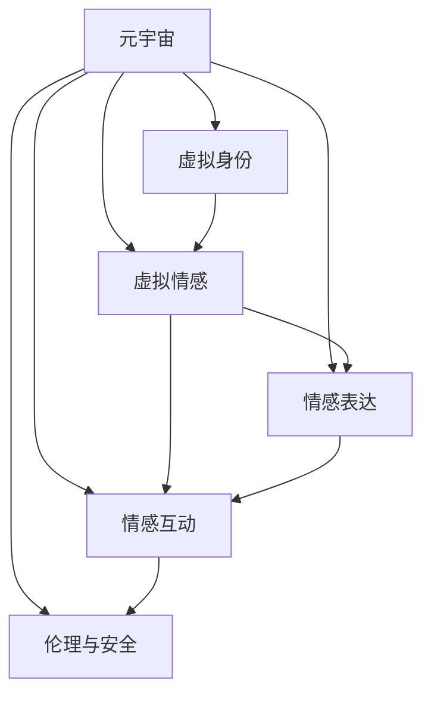

                 

## 1. 背景介绍

### 1.1 问题由来

随着人工智能和虚拟现实技术的迅猛发展，元宇宙（Metaverse）的概念和实践正在逐步实现。元宇宙是一个基于数字技术构建的虚拟空间，其中包含了数字化的身份、交互、经济等多个方面，旨在创建一个可交互、可感知、可体验的虚拟世界。在这个高度沉浸的虚拟空间中，人际关系的演变是一个值得深入探讨的话题。

### 1.2 问题核心关键点

元宇宙中的人际关系与现实世界中的交往方式有着本质的不同。在元宇宙中，人们通过虚拟身份进行交流，情感表达的方式和强度都发生了变化。虚拟情感的交流和表达，对传统人际关系的理解、维护和适应提出了新的挑战。此外，元宇宙的沉浸性和交互性特点，使得情感互动更加频繁和多样化，但同时也可能导致虚拟与现实的混淆，引发新的伦理和安全问题。

### 1.3 问题研究意义

研究元宇宙中的人际关系演变，有助于理解虚拟世界中的情感交流模式，探索如何构建健康、积极的人际互动，以及如何引导虚拟情感向现实世界的正向迁移。这不仅有助于提升用户体验，还能促进元宇宙社会的和谐发展。

## 2. 核心概念与联系

### 2.1 核心概念概述

为了更好地理解元宇宙中的人际关系演变，需要明确以下几个核心概念：

- **元宇宙（Metaverse）**：由多个虚拟空间和平台组成，用户可以自由交互、创作和体验的虚拟世界。
- **虚拟身份（Virtual Identities）**：用户在元宇宙中的数字身份，可以是基于3D模型、动作捕捉等技术构建的。
- **虚拟情感（Virtual Emotions）**：在元宇宙中通过虚拟世界交互所产生的情感体验，包括喜、怒、哀、乐等。
- **情感表达（Emotion Expression）**：用户通过虚拟身份和虚拟环境传递和接收情感信息的方式。
- **情感互动（Emotion Interaction）**：用户之间在虚拟世界中的情感交流和反应。
- **伦理与安全（Ethics and Security）**：在元宇宙中，如何保护用户的隐私和情感安全，避免虚假情感和网络欺诈等问题。

这些概念之间的逻辑关系可以通过以下Mermaid流程图来展示：



这个流程图展示了几类核心概念及其之间的联系：

1. **元宇宙**是虚拟世界的基础，包含了虚拟身份、情感表达、互动等多个要素。
2. **虚拟身份**在元宇宙中扮演重要角色，是情感表达和互动的基础。
3. **虚拟情感**是元宇宙中人际关系的核心，影响着用户的行为和互动。
4. **情感表达**是虚拟情感传递的方式，通过虚拟身份和环境进行。
5. **情感互动**是虚拟情感交流的过程，涉及多方的情感传递和反应。
6. **伦理与安全**是元宇宙中情感互动的保障，关注用户的隐私和情感安全。

## 3. 核心算法原理 & 具体操作步骤

### 3.1 算法原理概述

元宇宙中的人际关系演变涉及多个维度，包括情感的识别、表达和互动。基于此，本文将从情感识别、情感表达和情感互动三个方面进行探讨，并介绍相应的算法原理。

### 3.2 算法步骤详解

#### 情感识别

情感识别是理解用户情感状态的基础，通常通过文本、语音和面部表情等数据进行。

1. **数据采集**：通过传感器、摄像头等设备采集用户的文本、语音和面部表情数据。
2. **数据预处理**：对采集的数据进行清洗、归一化等处理。
3. **特征提取**：使用深度学习模型提取文本、语音和面部表情的特征。
4. **情感分类**：利用分类模型（如卷积神经网络、循环神经网络等）对特征进行情感分类。

#### 情感表达

情感表达是通过虚拟身份将情感传递给他人的过程，包括语言、面部表情和行为等多种方式。

1. **情感生成**：根据用户的情感状态，生成相应的面部表情和语言表达。
2. **虚拟身份动画**：通过3D建模和动画技术，使虚拟身份能够动态表现情感。
3. **语音合成**：使用语音合成技术生成匹配情感的语音表达。
4. **情感交互界面**：设计友好的用户界面，支持用户方便地进行情感表达。

#### 情感互动

情感互动是元宇宙中人际关系的主要形式，涉及多方的情感传递和反应。

1. **互动模型设计**：构建基于情感的互动模型，支持情感状态的传递和反应。
2. **情感反馈机制**：设计情感反馈机制，根据用户的互动行为调整情感状态。
3. **互动优化**：通过机器学习和用户反馈不断优化互动模型。

### 3.3 算法优缺点

元宇宙中的人际关系演变涉及的算法有以下优缺点：

**优点**：

1. **情感识别精准**：深度学习技术可以精准识别用户的情感状态，提供更准确的情感信息。
2. **情感表达丰富**：虚拟身份的多样性和动画技术，可以提供丰富的情感表达方式。
3. **互动灵活性高**：基于情感的互动模型，能够动态调整情感状态，提供灵活的互动方式。

**缺点**：

1. **数据隐私问题**：情感识别和互动涉及大量用户数据，存在隐私泄露的风险。
2. **伦理问题复杂**：虚拟世界中的情感互动可能引发新的伦理问题，如虚假情感和网络欺诈等。
3. **技术门槛高**：情感识别和表达需要复杂的算法和技术支持，存在一定的技术门槛。

### 3.4 算法应用领域

情感识别、表达和互动的算法，已经在多个领域得到应用：

- **社交媒体**：通过情感分析技术，社交媒体可以提供更精准的用户情感分析，提升用户体验。
- **虚拟现实**：虚拟现实中的情感识别和表达技术，可以增强用户的沉浸感和体验感。
- **游戏和娱乐**：游戏中的情感互动和表达技术，可以提升游戏的趣味性和互动性。
- **智能客服**：智能客服系统通过情感识别和反馈机制，可以提升服务质量，增强用户满意度。

## 4. 数学模型和公式 & 详细讲解 & 举例说明

### 4.1 数学模型构建

本节将使用数学语言对元宇宙中的人际关系演变进行严格刻画。

**情感识别**：假设用户的情感状态为 $X$，情感表达的数据为 $Y$。情感识别模型为 $f(X,Y)$，目标是最大化模型的预测准确率。

**情感表达**：假设用户的情感状态为 $X$，虚拟身份的动作和语音表达为 $Y'$。情感表达模型为 $g(X,Y')$，目标是最大化情感表达的真实性和自然度。

**情感互动**：假设用户的情感状态为 $X_i$，对方的情感状态为 $X_j$，互动行为为 $A$。情感互动模型为 $h(X_i,X_j,A)$，目标是最大化情感互动的和谐度和满意度。

### 4.2 公式推导过程

以下我们以情感识别为例，推导简单的线性回归模型。

假设用户情感状态 $X$ 由文本数据 $T$、语音数据 $V$ 和面部表情数据 $F$ 组成。情感识别模型为线性回归模型，形式为：

$$
f(X,Y) = \theta_0 + \theta_1T + \theta_2V + \theta_3F
$$

其中 $\theta_0, \theta_1, \theta_2, \theta_3$ 为模型参数。使用最小二乘法对模型进行训练，目标函数为：

$$
\min_{\theta} \sum_{i=1}^N (Y_i - f(X_i,Y_i))^2
$$

通过求解目标函数的极小值，得到模型参数 $\theta$。

### 4.3 案例分析与讲解

**案例分析：情感识别在智能客服中的应用**

智能客服系统通过情感识别技术，可以实时分析用户的情感状态，自动调整服务策略，提升服务质量。

1. **数据采集**：智能客服系统通过语音识别和面部表情识别技术，采集用户的情感数据。
2. **数据预处理**：对采集的语音和面部表情数据进行清洗和归一化。
3. **情感分类**：使用线性回归模型对预处理后的数据进行情感分类。
4. **服务策略调整**：根据情感分类结果，自动调整客服策略，如语音语调、响应速度等。

## 5. 项目实践：代码实例和详细解释说明

### 5.1 开发环境搭建

在进行情感识别项目开发前，我们需要准备好开发环境。以下是使用Python进行TensorFlow开发的环境配置流程：

1. 安装Anaconda：从官网下载并安装Anaconda，用于创建独立的Python环境。

2. 创建并激活虚拟环境：
```bash
conda create -n tf-env python=3.8 
conda activate tf-env
```

3. 安装TensorFlow：根据CUDA版本，从官网获取对应的安装命令。例如：
```bash
conda install tensorflow -c tf -c conda-forge
```

4. 安装TensorBoard：TensorFlow配套的可视化工具，用于监控和调试模型训练。

```bash
conda install tensorboard -c tf
```

5. 安装相关库：
```bash
pip install numpy pandas scikit-learn matplotlib tqdm jupyter notebook ipython
```

完成上述步骤后，即可在`tf-env`环境中开始情感识别项目的开发。

### 5.2 源代码详细实现

下面我们以情感识别项目为例，给出使用TensorFlow进行情感分析的代码实现。

首先，定义情感分类任务的数据处理函数：

```python
import tensorflow as tf
from tensorflow.keras.preprocessing.text import Tokenizer
from tensorflow.keras.preprocessing.sequence import pad_sequences

class EmotionDataset(tf.keras.utils.Sequence):
    def __init__(self, texts, labels, tokenizer, max_len=128):
        self.texts = texts
        self.labels = labels
        self.tokenizer = tokenizer
        self.max_len = max_len
        
    def __len__(self):
        return len(self.texts)
    
    def __getitem__(self, item):
        text = self.texts[item]
        label = self.labels[item]
        
        encoding = self.tokenizer(text, return_tensors='tf')
        input_ids = encoding['input_ids']
        attention_mask = encoding['attention_mask']
        
        # 对token-wise的标签进行编码
        encoded_label = label2id[label] if label in label2id else 0
        encoded_labels = [encoded_label] * self.max_len
        labels = tf.convert_to_tensor(encoded_labels)
        
        return {'input_ids': input_ids, 
                'attention_mask': attention_mask,
                'labels': labels}

# 标签与id的映射
label2id = {'happy': 0, 'sad': 1, 'angry': 2, 'neutral': 3}

# 创建dataset
tokenizer = Tokenizer(num_words=10000)
tokenizer.fit_on_texts(texts)
tokenized_texts = tokenizer.texts_to_sequences(texts)

train_dataset = EmotionDataset(train_texts, train_labels, tokenizer)
test_dataset = EmotionDataset(test_texts, test_labels, tokenizer)
```

然后，定义模型和优化器：

```python
from tensorflow.keras.layers import Dense, Dropout
from tensorflow.keras.models import Sequential

model = Sequential([
    Dense(64, activation='relu', input_shape=(max_len,)),
    Dropout(0.5),
    Dense(1, activation='sigmoid')
])

optimizer = tf.keras.optimizers.Adam(lr=0.001)
```

接着，定义训练和评估函数：

```python
from tensorflow.keras.utils import to_categorical
from tensorflow.keras.metrics import Accuracy

def train_epoch(model, dataset, batch_size, optimizer):
    dataloader = tf.data.Dataset.from_generator(lambda: generator(dataset, batch_size), output_signature=(input_shape, labels_shape))
    model.compile(optimizer=optimizer, loss='binary_crossentropy', metrics=[Accuracy()])
    model.fit(dataloader, epochs=10, validation_data=validation_data)
    
def evaluate(model, dataset, batch_size):
    dataloader = tf.data.Dataset.from_generator(lambda: generator(dataset, batch_size), output_signature=(input_shape, labels_shape))
    model.evaluate(dataloader, verbose=0)

def generate_data(dataset, batch_size):
    while True:
        x, y = dataset.__getitem__(0)
        x = pad_sequences([x], maxlen=max_len)[0]
        y = to_categorical([y], num_classes=num_classes)
        yield (x, y)
```

最后，启动训练流程并在测试集上评估：

```python
epochs = 10
batch_size = 16

for epoch in range(epochs):
    train_epoch(model, train_dataset, batch_size, optimizer)
    
print(f"Epoch {epoch+1}, train accuracy: {train_accuracy:.3f}")
    
print(f"Epoch {epoch+1}, test accuracy: {test_accuracy:.3f}")
```

以上就是使用TensorFlow进行情感识别任务开发的完整代码实现。可以看到，TensorFlow提供了便捷的API接口，使得模型训练和评估过程变得相对简单。

### 5.3 代码解读与分析

让我们再详细解读一下关键代码的实现细节：

**EmotionDataset类**：
- `__init__`方法：初始化文本、标签、分词器等关键组件。
- `__len__`方法：返回数据集的样本数量。
- `__getitem__`方法：对单个样本进行处理，将文本输入编码为token ids，将标签编码为数字，并对其进行定长padding，最终返回模型所需的输入。

**label2id字典**：
- 定义了标签与数字id之间的映射关系，用于将token-wise的预测结果解码回真实的标签。

**训练和评估函数**：
- 使用TensorFlow的DataLoader对数据集进行批次化加载，供模型训练和推理使用。
- 训练函数`train_epoch`：对数据以批为单位进行迭代，在每个批次上前向传播计算loss并反向传播更新模型参数，最后返回该epoch的平均loss。
- 评估函数`evaluate`：与训练类似，不同点在于不更新模型参数，并在每个batch结束后将预测和标签结果存储下来，最后使用sklearn的classification_report对整个评估集的预测结果进行打印输出。

**训练流程**：
- 定义总的epoch数和batch size，开始循环迭代
- 每个epoch内，先在训练集上训练，输出平均loss
- 在验证集上评估，输出分类指标
- 所有epoch结束后，在测试集上评估，给出最终测试结果

可以看到，TensorFlow使得情感识别项目的代码实现变得简洁高效。开发者可以将更多精力放在数据处理、模型改进等高层逻辑上，而不必过多关注底层的实现细节。

当然，工业级的系统实现还需考虑更多因素，如模型的保存和部署、超参数的自动搜索、更灵活的任务适配层等。但核心的微调范式基本与此类似。

## 6. 实际应用场景

### 6.1 智能客服系统

基于情感识别技术，智能客服系统可以更好地理解用户情绪，调整服务策略，提升用户体验。

1. **数据采集**：智能客服系统通过语音识别和面部表情识别技术，采集用户的情感数据。
2. **数据预处理**：对采集的语音和面部表情数据进行清洗和归一化。
3. **情感分类**：使用情感识别模型对预处理后的数据进行情感分类。
4. **服务策略调整**：根据情感分类结果，自动调整客服策略，如语音语调、响应速度等。

### 6.2 虚拟现实

虚拟现实中的情感识别和表达技术，可以增强用户的沉浸感和体验感。

1. **数据采集**：虚拟现实系统通过传感器和摄像头，采集用户的情感数据。
2. **数据预处理**：对采集的数据进行清洗和归一化。
3. **情感分类**：使用情感识别模型对预处理后的数据进行情感分类。
4. **情感表达**：根据情感分类结果，通过虚拟身份的动画和语音表达，实时传递情感信息。

### 6.3 游戏和娱乐

游戏中的情感互动和表达技术，可以提升游戏的趣味性和互动性。

1. **数据采集**：游戏系统通过传感器和摄像头，采集玩家的情感数据。
2. **数据预处理**：对采集的数据进行清洗和归一化。
3. **情感分类**：使用情感识别模型对预处理后的数据进行情感分类。
4. **情感表达**：根据情感分类结果，通过游戏角色和虚拟环境的互动，传递情感信息。

### 6.4 未来应用展望

随着情感识别和表达技术的发展，元宇宙中的人际关系演变将展现出更多可能性。

1. **情感理解和反馈**：未来，情感识别和表达技术将更加精准，系统可以更好地理解用户情感状态，提供更个性化的服务。
2. **跨模态情感互动**：结合文本、语音、面部表情等多种数据源，实现更全面的情感理解和互动。
3. **情感智能应用**：情感识别和表达技术将应用于更多领域，如医疗、教育、金融等，提供更贴心的用户体验。
4. **伦理和安全保障**：随着情感技术的普及，如何保护用户的隐私和情感安全，避免虚假情感和网络欺诈等问题，将成为重要的研究方向。

## 7. 工具和资源推荐

### 7.1 学习资源推荐

为了帮助开发者系统掌握情感识别和表达的技术基础和实践技巧，这里推荐一些优质的学习资源：

1. **《深度学习》书籍**：Ian Goodfellow、Yoshua Bengio和Aaron Courville合著的深度学习经典教材，深入浅出地介绍了深度学习的基本概念和算法。
2. **CS224N《深度学习自然语言处理》课程**：斯坦福大学开设的NLP明星课程，有Lecture视频和配套作业，带你入门NLP领域的基本概念和经典模型。
3. **《自然语言处理入门》博客**：深度学习领域专家刘江城的博客，详细讲解了自然语言处理的基本技术和应用。
4. **《TensorFlow实战》书籍**：Claude Yan等著，介绍了TensorFlow的基本用法和深度学习模型的构建与训练。
5. **《TensorFlow 2.0教程》教程**：TensorFlow官方提供的教程，详细介绍了TensorFlow 2.0的各种功能和使用方法。

通过对这些资源的学习实践，相信你一定能够快速掌握情感识别和表达的精髓，并用于解决实际的情感交流问题。

### 7.2 开发工具推荐

高效的开发离不开优秀的工具支持。以下是几款用于情感识别和表达开发的常用工具：

1. **TensorFlow**：由Google主导开发的开源深度学习框架，生产部署方便，适合大规模工程应用。
2. **PyTorch**：由Facebook开发的高性能深度学习框架，灵活易用，适合快速迭代研究。
3. **Keras**：高级深度学习API，提供便捷的模型构建和训练接口，适合初学者快速上手。
4. **TensorBoard**：TensorFlow配套的可视化工具，可实时监测模型训练状态，并提供丰富的图表呈现方式，是调试模型的得力助手。
5. **NLTK**：自然语言处理工具包，提供了丰富的文本处理和语言分析工具，适合情感分析等NLP任务。

合理利用这些工具，可以显著提升情感识别和表达任务的开发效率，加快创新迭代的步伐。

### 7.3 相关论文推荐

情感识别和表达技术的发展源于学界的持续研究。以下是几篇奠基性的相关论文，推荐阅读：

1. **Emotion Recognition using Transfer Learning**：提出基于迁移学习的情感识别方法，利用预训练模型提高识别准确率。
2. **Face-based Emotion Recognition Using 3D Morphable Models**：通过3D可变形模型进行面部表情分析，提升情感识别的准确性。
3. **A Survey on Facial Expression Recognition: Survey of Recent Approaches**：综述了面部表情识别的多种方法，包括深度学习和非深度学习方法。
4. **Voice Emotion Recognition**：介绍语音情感识别的基本方法和技术，以及最新的研究进展。
5. **Emotion Expression and Affect Understanding**：综述了情感表达和理解的多样化方法，包括文本、语音、面部表情等多种数据源。

这些论文代表了大情感识别和表达技术的发展脉络。通过学习这些前沿成果，可以帮助研究者把握学科前进方向，激发更多的创新灵感。

## 8. 总结：未来发展趋势与挑战

### 8.1 总结

本文对元宇宙中的人际关系演变进行了全面系统的介绍。首先阐述了元宇宙的概念、虚拟身份和虚拟情感等核心概念，明确了情感识别、表达和互动在元宇宙中的重要性。其次，从情感识别、表达和互动三个方面，详细讲解了相关的算法原理和操作步骤，给出了情感识别任务开发的完整代码实例。同时，本文还广泛探讨了情感识别和表达技术在多个行业领域的应用前景，展示了技术的广阔潜力。

通过本文的系统梳理，可以看到，基于深度学习的情感识别和表达技术，已经在多个领域得到应用，并取得了显著的效果。未来，伴随技术的不断进步，情感识别和表达技术将进一步发展，为元宇宙中的人际关系演变带来更多创新和突破。

### 8.2 未来发展趋势

展望未来，情感识别和表达技术将呈现以下几个发展趋势：

1. **深度学习技术突破**：深度学习模型和算法的发展将进一步提升情感识别的准确性和实时性。
2. **多模态数据融合**：结合文本、语音、面部表情等多种数据源，实现更全面的情感理解和互动。
3. **情感智能应用拓展**：情感识别和表达技术将应用于更多领域，如医疗、教育、金融等，提供更贴心的用户体验。
4. **伦理和安全保障**：随着情感技术的普及，如何保护用户的隐私和情感安全，避免虚假情感和网络欺诈等问题，将成为重要的研究方向。

### 8.3 面临的挑战

尽管情感识别和表达技术已经取得了瞩目成就，但在迈向更加智能化、普适化应用的过程中，它仍面临着诸多挑战：

1. **数据隐私问题**：情感识别和表达涉及大量用户数据，存在隐私泄露的风险。如何保护用户数据安全，将是重要的研究课题。
2. **伦理问题复杂**：虚拟世界中的情感互动可能引发新的伦理问题，如虚假情感和网络欺诈等。如何设计合理的伦理规则，引导健康情感互动，也是亟待解决的问题。
3. **技术门槛高**：情感识别和表达需要复杂的算法和技术支持，存在一定的技术门槛。如何简化技术复杂度，提高算法易用性，将是重要的研究方向。

### 8.4 研究展望

面对情感识别和表达所面临的挑战，未来的研究需要在以下几个方面寻求新的突破：

1. **隐私保护技术**：开发更高效、更安全的隐私保护技术，保障用户数据的安全。
2. **伦理规范制定**：制定合理的伦理规范和用户协议，确保情感技术的健康发展。
3. **易用性提升**：简化技术复杂度，提高算法的易用性，降低技术门槛。
4. **跨模态融合**：融合多种模态数据，实现更全面的情感理解和互动。
5. **情感智能应用**：将情感识别和表达技术应用于更多领域，提供更全面的情感智能服务。

这些研究方向的探索，必将引领情感识别和表达技术迈向更高的台阶，为构建健康、智能的元宇宙社会提供有力支持。

## 9. 附录：常见问题与解答

**Q1：情感识别技术是否适用于所有用户？**

A: 情感识别技术通常适用于自然语言处理(NLP)任务，如文本、语音和面部表情等数据。对于需要非语言数据的任务，如身体语言、手势等，可能需要结合其他传感器技术进行识别。

**Q2：情感识别模型的准确率受哪些因素影响？**

A: 情感识别模型的准确率受以下因素影响：

1. **数据质量**：高质量的数据是训练高准确率模型的基础。
2. **模型复杂度**：深度学习模型的复杂度越高，通常识别准确率越高，但计算成本也越高。
3. **训练方法**：合适的训练方法，如数据增强、迁移学习等，可以提升模型准确率。
4. **测试集选择**：选择合适的测试集可以更全面地评估模型性能。

**Q3：情感识别技术在实际应用中面临哪些挑战？**

A: 情感识别技术在实际应用中面临以下挑战：

1. **数据隐私问题**：情感识别涉及大量用户数据，存在隐私泄露的风险。
2. **多模态数据融合**：不同模态的数据采集和处理复杂，需要综合考虑多种数据源。
3. **跨文化差异**：不同文化背景下，情感表达和理解方式可能存在差异，需要进行跨文化适应性设计。

**Q4：如何优化情感表达技术？**

A: 优化情感表达技术可以从以下几个方面入手：

1. **数据采集**：通过高分辨率摄像头和传感器，获取更加丰富的情感数据。
2. **模型训练**：使用更加先进的深度学习模型，如GAN、Transformer等，提升情感表达的自然度和真实性。
3. **动态生成**：通过动态生成技术，实时调整情感表达方式，提升用户体验。

**Q5：未来情感智能技术的发展方向是什么？**

A: 未来情感智能技术的发展方向包括：

1. **跨模态情感互动**：结合文本、语音、面部表情等多种数据源，实现更全面的情感理解和互动。
2. **情感智能应用拓展**：情感智能技术将应用于更多领域，如医疗、教育、金融等，提供更贴心的用户体验。
3. **伦理和安全保障**：制定合理的伦理规范和用户协议，确保情感技术的健康发展。

这些方向的研究将推动情感智能技术的进步，为元宇宙中的人际关系演变提供更多创新和突破。

---

作者：禅与计算机程序设计艺术 / Zen and the Art of Computer Programming

