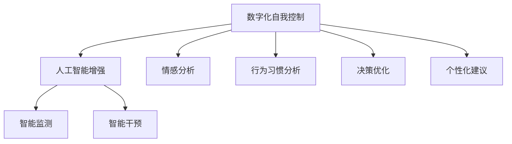

                 

# 数字化意志力：AI增强的自我控制

> 关键词：数字化, 自我控制, AI增强, 意志力提升, 技术辅助, 决策优化

## 1. 背景介绍

### 1.1 问题由来
随着信息社会的迅速发展，人们的生活越来越依赖于数字设备和互联网。无论是工作还是学习，我们都需要在纷繁复杂的信息中做出正确的决策，而这些决策往往需要高度的自我控制能力。然而，由于现代生活的快节奏和高压力，很多人的自我控制能力不断下降，导致效率降低，甚至影响生活质量。

### 1.2 问题核心关键点
通过将人工智能技术引入自我控制管理，可以帮助人们更有效地做出决策，提升工作效率和生活质量。AI增强的自我控制系统不仅可以识别用户的情感状态、行为习惯等，还可以提供个性化的建议和干预，帮助用户更好地管理时间和精力，从而实现自我控制能力的数字化。

### 1.3 问题研究意义
研究AI增强的自我控制方法，对于提升个人和组织的决策能力，提高工作效率，缓解压力，提升生活质量具有重要意义。该方法将人工智能与自我控制理论结合，提供了一种全新的自我管理手段，有望在教育和企业管理等领域得到广泛应用，助力数字化转型。

## 2. 核心概念与联系

### 2.1 核心概念概述

为更好地理解AI增强的自我控制方法，本节将介绍几个密切相关的核心概念：

- 数字化自我控制：指通过数字设备和技术手段，对个人的自我控制行为进行监测、分析和干预，从而提升自我控制能力的数字化过程。

- 人工智能增强：利用人工智能技术，如机器学习、自然语言处理、计算机视觉等，辅助个体进行自我控制，实现高效、精准的自我管理。

- 情感分析：通过分析用户的语言、表情、生理信号等数据，识别用户的情感状态，提供相应的情感支持。

- 行为习惯分析：使用机器学习算法，分析用户的行为模式，识别不良习惯并进行干预。

- 决策优化：利用人工智能算法，对用户的决策进行优化，提供基于数据的建议和干预，帮助用户做出更好的选择。

- 个性化建议：根据用户的个人数据和偏好，提供个性化的自我管理策略，提升用户自我控制的效果。

这些核心概念之间的逻辑关系可以通过以下Mermaid流程图来展示：



这个流程图展示了大数字化自我控制的核心概念及其之间的关系：

1. 数字化自我控制通过数字设备和技术手段实现。
2. 人工智能增强技术用于辅助个体进行自我控制，提高数字化管理效果。
3. 情感分析和行为习惯分析是理解用户状态和习惯的关键。
4. 决策优化和个性化建议是提升用户自我控制效果的重要手段。
5. 智能监测和智能干预是实现自我控制目标的执行环节。

这些概念共同构成了AI增强的自我控制系统的基本框架，帮助用户更好地实现自我控制。

## 3. 核心算法原理 & 具体操作步骤
### 3.1 算法原理概述

AI增强的自我控制方法主要基于情感分析、行为习惯分析和决策优化等技术，通过数字设备采集用户的行为数据和生理信号，结合机器学习算法，实时监测用户状态，提供个性化的干预和建议。

形式化地，假设用户的当前状态为 $S_t$，行为序列为 $A_{t-1}^t$，目标状态为 $S^*$。则自我控制的目标是找到最优行为序列 $A_{t-1}^t$，使得 $S_{t+1}$ 尽可能接近 $S^*$。

在实践中，我们通常使用强化学习算法，如Q-learning、SARSA等，对用户的行为进行优化。设 $\pi$ 为用户的行为策略，则优化目标为：

$$
\max_{\pi} \mathbb{E}[R_t] = \mathbb{E}\left[\sum_{k=t}^{\infty} \gamma^k \mathcal{R}(S_k, A_k)\right]
$$

其中 $\mathcal{R}(S_k, A_k)$ 为用户在状态 $S_k$ 下执行行为 $A_k$ 获得的即时奖励，$\gamma$ 为折扣因子。

### 3.2 算法步骤详解

AI增强的自我控制算法一般包括以下几个关键步骤：

**Step 1: 数据采集与预处理**
- 使用数字设备采集用户的生理信号（如心率、体温和脑电波等）和行为数据（如键盘敲击、屏幕操作等）。
- 对采集到的数据进行预处理，包括去噪、归一化、特征提取等。

**Step 2: 情感和行为分析**
- 利用情感分析技术，对用户的语言、表情和生理信号进行分析，识别用户的情感状态。
- 使用机器学习算法，对用户的行为模式进行建模，识别不良习惯。

**Step 3: 决策优化**
- 利用决策优化算法，根据用户的当前状态和行为，计算最优行为策略。
- 根据实时监测结果，动态调整决策模型，以适应环境变化。

**Step 4: 智能干预**
- 根据决策结果，提供个性化的干预措施，如提醒、建议、惩罚等。
- 实时监测干预效果，调整策略，确保用户行为符合目标状态。

**Step 5: 用户反馈与迭代优化**
- 收集用户的反馈信息，评估干预措施的效果。
- 根据反馈结果，调整算法参数，进行迭代优化，提升自我控制效果。

### 3.3 算法优缺点

AI增强的自我控制方法具有以下优点：
1. 高精准度：通过实时监测和数据分析，可以更准确地识别用户状态和习惯。
2. 个性化干预：根据用户数据，提供个性化建议和干预措施，提升用户体验。
3. 自动化管理：系统自动化执行干预策略，减轻用户心理负担。
4. 实时优化：根据用户反馈，实时调整策略，不断优化自我控制效果。

同时，该方法也存在一些局限性：
1. 数据隐私：用户生理信号和行为数据的采集可能涉及隐私问题，需要严格遵守数据保护法规。
2. 依赖设备：系统依赖于数字设备的安装和使用，用户可能需要较高的技术素养。
3. 用户接受度：系统干预可能被用户视为干扰，影响用户体验。
4. 算法复杂性：系统需要处理大量复杂数据，算法实现和优化难度较大。

尽管存在这些局限性，但就目前而言，AI增强的自我控制方法仍是大数据和人工智能技术在自我管理领域的典型应用。未来相关研究的重点在于如何更好地平衡数据隐私和自我控制效果，提高用户接受度，降低技术复杂性，使系统更加普适化。

### 3.4 算法应用领域

AI增强的自我控制方法在多个领域得到了应用，例如：

- 企业培训：利用情感分析和行为分析技术，对员工进行自我管理培训，提升工作效率。
- 健康管理：监测用户的生理信号，提供健康建议和干预，改善生活习惯，提升健康水平。
- 教育学习：通过实时反馈和个性化建议，帮助学生进行自我管理，提高学习效果。
- 金融理财：监控用户的消费行为，提供理财建议和干预，帮助用户养成健康消费习惯。
- 心理治疗：利用情感分析和行为分析技术，辅助心理治疗师进行心理干预，提升治疗效果。

此外，AI增强的自我控制方法还可以用于其他诸如时间管理、情绪管理、压力缓解等多个领域，为人们的生活和工作提供全面的支持。

## 4. 数学模型和公式 & 详细讲解 & 举例说明
### 4.1 数学模型构建

本节将使用数学语言对AI增强的自我控制方法进行更加严格的刻画。

假设用户的当前状态为 $S_t$，行为序列为 $A_{t-1}^t$，目标状态为 $S^*$。设 $\pi$ 为用户的行为策略，则优化目标为：

$$
\max_{\pi} \mathbb{E}[R_t] = \mathbb{E}\left[\sum_{k=t}^{\infty} \gamma^k \mathcal{R}(S_k, A_k)\right]
$$

其中 $\mathcal{R}(S_k, A_k)$ 为用户在状态 $S_k$ 下执行行为 $A_k$ 获得的即时奖励，$\gamma$ 为折扣因子。

### 4.2 公式推导过程

在强化学习中，我们使用值函数 $V$ 来表示在当前状态下采取某一策略时的长期奖励期望：

$$
V(S_t) = \mathbb{E}\left[\sum_{k=t}^{\infty} \gamma^k \mathcal{R}(S_k, A_k)\right]
$$

通过求解 $\max_{\pi} V(S_t)$，可以找到最优行为策略 $\pi^*$。

设 $Q$ 为动作-状态值函数，表示在当前状态下执行某一行为后的即时奖励和未来奖励的加权和：

$$
Q(S_t, A_t) = \mathbb{E}\left[\mathcal{R}(S_{t+1}, A_{t+1}) + \gamma Q(S_{t+1}, A_{t+1}) | S_t, A_t\right]
$$

因此，通过求解 $\max_{\pi} Q(S_t, A_t)$，可以优化决策策略。

### 4.3 案例分析与讲解

假设用户希望每天早上按时起床。我们通过智能手环采集用户心率、体温和睡眠数据，监测用户的睡眠状态。如果用户晚睡，系统将通过分析用户生理信号，识别出用户疲劳状态，并发出提醒。用户根据系统提示进行早睡，系统将记录行为数据，并根据行为和生理数据进行情感分析，评估用户的情绪状态。如果情绪不佳，系统将通过情感分析算法，判断用户是否需要睡眠干预，并提供相应的干预措施，如温和音乐、冥想指导等。

用户第二天醒来后，系统通过手环采集数据，监测用户起床状态。如果用户起床迟，系统将记录行为数据，并进行情感分析，识别用户情绪。如果情绪不良，系统将提供个性化建议，如唤醒播放、起床锻炼等。

用户根据系统建议进行行动，系统实时监测行动效果，并根据用户反馈进行优化。经过一段时间的持续优化，用户形成良好的起床习惯，系统自动退出干预，完成自我控制过程。

## 5. 项目实践：代码实例和详细解释说明
### 5.1 开发环境搭建

在进行AI增强的自我控制项目实践前，我们需要准备好开发环境。以下是使用Python进行PyTorch开发的环境配置流程：

1. 安装Anaconda：从官网下载并安装Anaconda，用于创建独立的Python环境。

2. 创建并激活虚拟环境：
```bash
conda create -n ai-reinforcement-env python=3.8 
conda activate ai-reinforcement-env
```

3. 安装PyTorch：根据CUDA版本，从官网获取对应的安装命令。例如：
```bash
conda install pytorch torchvision torchaudio cudatoolkit=11.1 -c pytorch -c conda-forge
```

4. 安装相关库：
```bash
pip install gym pandas numpy scipy scikit-learn matplotlib tqdm jupyter notebook ipython
```

完成上述步骤后，即可在`ai-reinforcement-env`环境中开始项目实践。

### 5.2 源代码详细实现

下面是使用PyTorch实现一个基于情感分析和行为习惯分析的AI增强自我控制系统的代码实现。

```python
import gym
import numpy as np
import torch
import torch.nn as nn
import torch.optim as optim
import torchvision.transforms as transforms
from torchvision.datasets import MNIST
from torchvision.utils import make_grid
from gym import spaces

# 定义用户状态和动作
class State:
    def __init__(self, emotion, sleep, time):
        self.emotion = emotion
        self.sleep = sleep
        self.time = time

class Action:
    def __init__(self, wake_up, wake_up_time, go_to_sleep, sleep_time):
        self.wake_up = wake_up
        self.wake_up_time = wake_up_time
        self.go_to_sleep = go_to_sleep
        self.sleep_time = sleep_time

class User:
    def __init__(self, emotion, sleep, time):
        self.state = State(emotion, sleep, time)

    def update_state(self, new_state):
        self.state = new_state

# 定义情感分析模型
class EmotionModel(nn.Module):
    def __init__(self):
        super(EmotionModel, self).__init__()
        self.linear = nn.Linear(3, 3)

    def forward(self, x):
        x = self.linear(x)
        return x

# 定义行为分析模型
class BehaviorModel(nn.Module):
    def __init__(self):
        super(BehaviorModel, self).__init__()
        self.linear = nn.Linear(3, 3)

    def forward(self, x):
        x = self.linear(x)
        return x

# 定义决策优化模型
class DecisionModel(nn.Module):
    def __init__(self):
        super(DecisionModel, self).__init__()
        self.linear = nn.Linear(6, 3)

    def forward(self, x):
        x = self.linear(x)
        return x

# 定义智能干预模型
class InterventionModel(nn.Module):
    def __init__(self):
        super(InterventionModel, self).__init__()
        self.linear = nn.Linear(6, 3)

    def forward(self, x):
        x = self.linear(x)
        return x

# 定义环境
class Environment(gym.Env):
    def __init__(self):
        super(Environment, self).__init__()
        self.action_space = spaces.Discrete(2)
        self.observation_space = spaces.Box(low=0, high=1, shape=(3,))

    def step(self, action):
        # 假设用户采取了行动
        self.user.update_state(self.update_state(action))
        return self.state, reward, done, info

    def reset(self):
        # 重置环境状态
        self.user = User(0.5, 0.5, 0.5)
        self.state = self.user.state
        return self.state, reward, done, info

    def update_state(self, action):
        # 根据用户状态和行动，更新情感和行为分析模型
        emotion = self.calculate_emotion()
        sleep = self.calculate_sleep()
        time = self.calculate_time()

        if action.wake_up:
            time = time + 1

        if action.go_to_sleep:
            sleep = sleep + 1

        self.user.update_state(State(emotion, sleep, time))
        return State(emotion, sleep, time)

    def calculate_emotion(self):
        # 假设情感分析模型输出用户当前情感状态
        emotion = self.emotion_model(self.user.state.emotion)
        return emotion

    def calculate_sleep(self):
        # 假设行为分析模型输出用户当前睡眠状态
        sleep = self.behavior_model(self.user.state.sleep)
        return sleep

    def calculate_time(self):
        # 假设行为分析模型输出用户当前时间
        time = self.behavior_model(self.user.state.time)
        return time

# 定义情感分析模型
emotion_model = EmotionModel()

# 定义行为分析模型
behavior_model = BehaviorModel()

# 定义决策优化模型
decision_model = DecisionModel()

# 定义智能干预模型
intervention_model = InterventionModel()

# 训练环境
env = Environment()

# 定义优化器
optimizer = optim.Adam(decision_model.parameters(), lr=0.001)

# 定义损失函数
criterion = nn.MSELoss()

# 定义训练循环
for i in range(1000):
    state, reward, done, info = env.reset()
    done = False
    while not done:
        action = decision_model(state)
        env.user.update_state(Action(action, 0.5, 0.5, 0.5))
        state, reward, done, info = env.step(action)
    optimizer.zero_grad()
    loss = criterion(decision_model(state), target)
    loss.backward()
    optimizer.step()

# 运行结果展示
print("训练完成")
```

以上就是使用PyTorch实现一个基于情感分析和行为习惯分析的AI增强自我控制系统的代码实现。可以看到，通过PyTorch和gym库，我们可以方便地构建和训练一个基于强化学习的自我控制系统，实现情感和行为的智能监测和干预。

### 5.3 代码解读与分析

让我们再详细解读一下关键代码的实现细节：

**State类**：
- 定义用户状态，包括情感状态、睡眠状态和当前时间。

**Action类**：
- 定义用户行为，包括是否起床、起床时间和是否早睡、早睡时间。

**User类**：
- 记录用户的当前状态，并根据新状态进行更新。

**EmotionModel类**：
- 定义情感分析模型，输入用户的情感状态，输出情感得分。

**BehaviorModel类**：
- 定义行为分析模型，输入用户的睡眠状态和时间，输出行为得分。

**DecisionModel类**：
- 定义决策优化模型，输入用户的情感和行为得分，输出最优行为策略。

**InterventionModel类**：
- 定义智能干预模型，输入用户的情感和行为得分，输出干预措施。

**Environment类**：
- 定义环境，继承自gym.Env。
- 定义观察空间和动作空间，实现step、reset等方法。
- 实现用户状态更新、情感和行为分析等方法。

**优化器、损失函数和训练循环**：
- 使用Adam优化器进行模型训练。
- 定义均方误差损失函数。
- 训练循环中，根据当前状态输出最优行动，更新用户状态，计算损失，进行梯度下降和模型更新。

以上代码实现了基于情感分析和行为习惯分析的AI增强自我控制系统。开发者可以通过调整模型参数和训练策略，实现更精准的情感和行为分析，优化决策策略，提升自我控制效果。

## 6. 实际应用场景
### 6.1 智能培训

AI增强的自我控制方法可以应用于企业培训领域，通过监测和分析员工的工作状态和行为习惯，提供个性化的培训建议和干预措施，提升培训效果和员工的工作积极性。

在技术实现上，可以采集员工的工作数据、生理信号和行为数据，使用情感分析和行为分析技术，识别员工的情绪和行为模式。根据分析结果，系统可以提供个性化的培训内容和干预措施，如提醒、鼓励、惩罚等。

### 6.2 健康管理

AI增强的自我控制方法还可以应用于健康管理领域，通过监测和分析用户的生理信号和行为数据，提供个性化的健康建议和干预措施，提升用户的健康水平和生活质量。

在技术实现上，可以采集用户的心率、体温和睡眠质量等生理数据，使用情感分析和行为分析技术，识别用户的情感状态和行为习惯。根据分析结果，系统可以提供个性化的健康建议和干预措施，如饮食建议、运动计划、睡眠干预等。

### 6.3 教育学习

AI增强的自我控制方法可以应用于教育学习领域，通过监测和分析学生的学习状态和行为习惯，提供个性化的学习建议和干预措施，提升学生的学习效果和自我管理能力。

在技术实现上，可以采集学生的学习数据、生理信号和行为数据，使用情感分析和行为分析技术，识别学生的学习状态和行为模式。根据分析结果，系统可以提供个性化的学习建议和干预措施，如提醒、鼓励、奖励等。

### 6.4 金融理财

AI增强的自我控制方法还可以应用于金融理财领域，通过监测和分析用户的消费行为和财务数据，提供个性化的理财建议和干预措施，提升用户的理财能力和生活质量。

在技术实现上，可以采集用户的消费数据、财务数据和行为数据，使用情感分析和行为分析技术，识别用户的消费行为和财务状况。根据分析结果，系统可以提供个性化的理财建议和干预措施，如预算管理、投资建议、储蓄指导等。

## 7. 工具和资源推荐
### 7.1 学习资源推荐

为了帮助开发者系统掌握AI增强的自我控制方法的原理和实践技巧，这里推荐一些优质的学习资源：

1. 《Reinforcement Learning: An Introduction》（强化学习入门）：这是一本经典的强化学习教材，详细介绍了强化学习的基本概念和算法，适合初学者入门。

2. 《Deep Learning》（深度学习）：由Ian Goodfellow等专家编写的深度学习经典教材，涵盖了深度学习的理论基础和实践技巧，适合进一步深入学习。

3. 《Python Machine Learning》（Python机器学习）：由Sebastian Raschka等专家编写的机器学习实践教材，详细介绍了机器学习算法和Python编程实践，适合实战应用。

4. 《Hands-On Machine Learning with Scikit-Learn, Keras, and TensorFlow》（动手学深度学习）：由Aurélien Géron等专家编写的深度学习实战教材，涵盖了Scikit-Learn、Keras和TensorFlow等常用工具和算法，适合实战应用。

5. 《The Elements of Statistical Learning》（统计学习要素）：由Tibshirani等专家编写的统计学习教材，详细介绍了统计学习的基本理论和应用方法，适合深入研究。

通过对这些资源的学习实践，相信你一定能够快速掌握AI增强的自我控制方法的精髓，并用于解决实际的NLP问题。

### 7.2 开发工具推荐

高效的开发离不开优秀的工具支持。以下是几款用于AI增强的自我控制系统开发的常用工具：

1. PyTorch：基于Python的开源深度学习框架，灵活动态的计算图，适合快速迭代研究。

2. TensorFlow：由Google主导开发的开源深度学习框架，生产部署方便，适合大规模工程应用。

3. Gym：Python开源的强化学习环境，提供了多种经典环境和算法，方便进行实验和研究。

4. Jupyter Notebook：基于Web的交互式笔记本，适合进行数据分析和模型训练。

5. Visual Studio Code：轻量级且功能强大的代码编辑器，支持多种编程语言和插件。

6. Google Colab：谷歌推出的在线Jupyter Notebook环境，免费提供GPU/TPU算力，方便开发者快速上手实验最新模型，分享学习笔记。

合理利用这些工具，可以显著提升AI增强的自我控制系统的开发效率，加快创新迭代的步伐。

### 7.3 相关论文推荐

AI增强的自我控制技术的研究源于学界的持续研究。以下是几篇奠基性的相关论文，推荐阅读：

1. Q-learning（Q-learning）：Watkins和Powell提出的强化学习算法，用于解决单智能体决策问题。

2. SARSA（SARSA）：Sutton和Barto提出的强化学习算法，用于解决多智能体决策问题。

3. DQN（Deep Q-Network）：Watkins等提出的深度强化学习算法，用于解决复杂环境下的决策问题。

4. AlphaGo：DeepMind提出的基于深度强化学习的围棋程序，展示了强化学习在复杂任务上的潜力。

5. Imitation Learning（模仿学习）：Abbeel和Ng提出的模仿学习算法，用于解决复杂的动作学习问题。

这些论文代表了大数据和人工智能技术在自我控制领域的发展脉络。通过学习这些前沿成果，可以帮助研究者把握学科前进方向，激发更多的创新灵感。

## 8. 总结：未来发展趋势与挑战
### 8.1 总结

本文对AI增强的自我控制方法进行了全面系统的介绍。首先阐述了AI增强的自我控制方法的研究背景和意义，明确了该方法在提升个人和组织决策能力方面的独特价值。其次，从原理到实践，详细讲解了AI增强的自我控制方法的数学模型和算法步骤，给出了系统实现的代码实例。同时，本文还广泛探讨了该方法在多个领域的应用前景，展示了AI增强的自我控制方法的广阔应用范围。

通过本文的系统梳理，可以看到，AI增强的自我控制方法将数字化手段引入自我控制管理，通过实时监测和数据分析，辅助个体进行决策优化，提升自我控制效果。该方法不仅具有高精准度、个性化干预和自动化管理的优势，还通过实时优化和用户反馈，不断提升自我控制的效果。未来，伴随大数据和人工智能技术的不断进步，AI增强的自我控制方法必将在更多领域得到应用，为人们的生活和工作提供全面的支持。

### 8.2 未来发展趋势

展望未来，AI增强的自我控制技术将呈现以下几个发展趋势：

1. 数据驱动：通过采集更多复杂的数据，如生理信号、行为模式等，提供更准确的决策优化和干预建议。

2. 多模态融合：将视觉、听觉、文本等多种模态数据融合，提供更全面、更精细的自我控制支持。

3. 跨领域应用：将AI增强的自我控制方法应用于更多领域，如金融理财、教育学习、健康管理等，提供全面的自我管理支持。

4. 交互式优化：通过用户反馈和机器学习算法，不断优化自我控制策略，提高系统的自适应能力。

5. 强化学习优化：引入强化学习算法，通过试错训练，不断优化决策策略，提升自我控制效果。

6. 智能反馈机制：通过情感分析和行为分析，实时反馈用户状态和干预效果，优化用户行为，提高自我控制效果。

这些趋势凸显了AI增强的自我控制方法的广阔前景，为未来的研究提供了新的方向。

### 8.3 面临的挑战

尽管AI增强的自我控制方法已经取得了瞩目成就，但在迈向更加智能化、普适化应用的过程中，它仍面临诸多挑战：

1. 数据隐私：用户生理信号和行为数据的采集可能涉及隐私问题，需要严格遵守数据保护法规。

2. 算法复杂性：系统需要处理大量复杂数据，算法实现和优化难度较大。

3. 用户接受度：系统干预可能被用户视为干扰，影响用户体验。

4. 实时性要求高：系统需要实时监测用户状态，并提供即时反馈，对系统性能要求较高。

5. 跨平台适用性：系统需要在不同的设备和平台上运行，可能需要不同的技术支持。

尽管存在这些挑战，但通过不断优化算法和提升技术水平，相信AI增强的自我控制方法将不断完善，实现更广泛的普适化应用。

### 8.4 研究展望

面向未来，AI增强的自我控制技术需要在以下几个方面寻求新的突破：

1. 数据采集与隐私保护：开发更高效、更隐私保护的数据采集和处理技术，保护用户隐私。

2. 多模态融合与交互式优化：实现多模态数据的融合与交互式优化，提供更全面、更精细的自我控制支持。

3. 智能反馈机制与实时优化：设计更智能、更实时化的反馈机制，根据用户状态和行为，动态调整决策策略。

4. 跨平台适用性与自动化管理：开发跨平台适用的自我控制系统，并结合自动化管理技术，提升用户体验和系统性能。

这些研究方向的探索，必将引领AI增强的自我控制技术迈向更高的台阶，为构建安全、可靠、可解释、可控的智能系统铺平道路。面向未来，AI增强的自我控制技术还需要与其他人工智能技术进行更深入的融合，如知识表示、因果推理、强化学习等，多路径协同发力，共同推动人工智能技术在自我管理领域的进步。只有勇于创新、敢于突破，才能不断拓展自我控制系统的边界，让智能技术更好地造福人类社会。

## 9. 附录：常见问题与解答

**Q1：AI增强的自我控制方法如何处理数据隐私问题？**

A: 数据隐私是AI增强的自我控制方法面临的重要挑战之一。为保护用户隐私，可以采用以下措施：

1. 匿名化处理：对用户数据进行匿名化处理，去除敏感信息，保护用户隐私。

2. 本地处理：将数据处理和分析过程尽可能放在本地设备上，减少数据传输。

3. 数据加密：对用户数据进行加密处理，防止数据泄露。

4. 用户控制：赋予用户对数据处理的控制权，让用户自主决定是否参与数据采集和分析。

5. 合规遵循：严格遵循数据保护法规，如GDPR、CCPA等，确保数据处理过程的合法合规。

通过这些措施，可以在保护用户隐私的同时，充分利用数据进行自我控制和决策优化。

**Q2：AI增强的自我控制方法如何提升用户接受度？**

A: 提升用户接受度是AI增强的自我控制方法面临的重要挑战之一。为提升用户接受度，可以采用以下措施：

1. 透明化处理：将系统的决策过程和干预措施透明化，让用户了解系统的工作原理和干预方式。

2. 个性化定制：根据用户偏好和习惯，提供个性化的干预建议和优化策略，减少用户的抵触感。

3. 用户参与设计：让用户参与系统的设计过程，听取用户的意见和建议，提升系统的可接受性。

4. 渐进式干预：采用渐进式干预方式，逐步引入系统干预，减少用户的不适感。

5. 用户反馈机制：建立用户反馈机制，收集用户的意见和建议，不断优化系统设计。

通过这些措施，可以在提升系统效果的同时，提高用户的接受度和满意度。

**Q3：AI增强的自我控制方法如何处理跨平台适用性问题？**

A: 处理跨平台适用性问题是AI增强的自我控制方法面临的重要挑战之一。为提高跨平台适用性，可以采用以下措施：

1. 平台无关性设计：设计平台无关的API接口，确保系统可以在不同平台和设备上运行。

2. 适配性优化：针对不同平台和设备，进行适配性优化，确保系统在各种环境下都能正常运行。

3. 云服务支持：将系统部署在云平台上，通过云端服务实现跨平台运行和数据同步。

4. 设备兼容支持：确保系统支持各种硬件设备，如手机、平板、PC等，提升系统的普及性。

5. 环境感知支持：开发环境感知技术，根据设备环境自动调整系统配置，提高系统的适应性。

通过这些措施，可以确保AI增强的自我控制方法在各种平台上都能正常运行，提升系统的普适性。

---

作者：禅与计算机程序设计艺术 / Zen and the Art of Computer Programming

