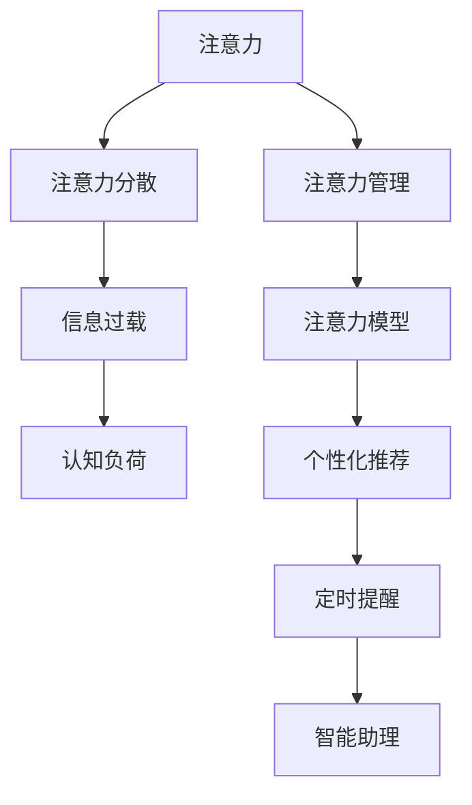

                 

# 数字化时代的注意力分散问题

## 1. 背景介绍

### 1.1 问题由来
随着数字技术的飞速发展，数字化信息在各个领域得到了广泛应用。然而，伴随信息量的爆炸式增长，用户的注意力逐渐从深度和广度两个维度分散开来，导致用户在学习、工作和生活中的效率和专注度下降。据统计，现代人在工作中平均每3-5分钟就会被外界干扰，难以维持长时间的高效专注状态。

在数字化时代，“注意力经济”成为了一种新型的竞争模式。优质的内容、个性化的推荐系统、智能化的交互设计等手段，都在争夺用户宝贵的注意力资源。如何科学有效地管理用户的注意力，成为数字时代一个亟待解决的重要问题。

### 1.2 问题核心关键点
1. **注意力分散**：指在数字化环境中，用户由于信息过载，难以长时间集中精力于单一任务，导致效率和专注度下降的现象。
2. **注意力管理**：指通过技术手段，如个性化推荐、定时提醒、智能助理等，科学有效地管理用户注意力，提升信息处理效率和专注度。
3. **注意力模型**：指基于心理学、神经科学等理论，建立数学模型，理解用户注意力机制，指导注意力管理系统的设计与实现。
4. **信息过载**：指在数字时代，用户接受信息的总量远超其处理能力，导致注意力资源被大量稀释和分散。
5. **认知负荷**：指由于注意力分散和信息过载，用户在进行复杂认知任务时，需要额外消耗更多的认知资源，从而降低任务完成效率。
6. **用户体验**：指在设计数字产品和服务时，应关注用户的注意力状态和认知负荷，营造流畅、高效的用户体验。

## 2. 核心概念与联系

### 2.1 核心概念概述

为更好地理解数字化时代的注意力分散问题，本节将介绍几个关键概念：

- **注意力**：指用户对特定信息或任务的专注程度，是衡量信息处理效率和用户满意度的重要指标。
- **注意力分散**：指用户注意力从一个任务转移到另一个任务的过程，导致信息处理效率和任务完成质量下降。
- **注意力管理**：指通过设计合理的系统架构和算法，科学有效地管理用户注意力，提升信息处理效率和专注度。
- **注意力模型**：指基于心理学、神经科学等理论，建立的用于描述和分析用户注意力机制的数学模型。
- **信息过载**：指用户接受的信息量远超其处理能力，导致注意力资源被大量稀释和分散。
- **认知负荷**：指用户在处理复杂信息时，需要额外消耗更多的认知资源，影响任务完成效率。

这些概念之间的联系可以通过以下Mermaid流程图来展示：



这个流程图展示了注意力分散问题及其解决方案的逻辑关系：

1. 注意力是用户对特定信息或任务的专注程度，是衡量信息处理效率和用户满意度的关键指标。
2. 注意力分散导致信息处理效率和任务完成质量下降。
3. 信息过载是注意力分散的主要原因，大量的信息稀释和分散了用户的注意力资源。
4. 认知负荷是注意力分散的另一个重要因素，用户在处理复杂信息时，需要额外消耗更多的认知资源，影响任务完成效率。
5. 注意力管理是通过设计合理的系统架构和算法，科学有效地管理用户注意力，提升信息处理效率和专注度。
6. 注意力模型是基于心理学、神经科学等理论，建立的用于描述和分析用户注意力机制的数学模型。
7. 个性化推荐、定时提醒、智能助理等技术手段，都是注意力管理的具体实现方式。

## 3. 核心算法原理 & 具体操作步骤
### 3.1 算法原理概述

数字化时代注意力分散问题的解决，通常涉及注意力模型和注意力管理的两个方面。其核心思想是：

1. **注意力模型构建**：通过心理学、神经科学等理论，建立数学模型，描述用户的注意力机制。
2. **注意力管理优化**：基于注意力模型，设计合理的算法和系统，科学有效地管理用户的注意力，提升信息处理效率和专注度。

### 3.2 算法步骤详解

#### 3.2.1 注意力模型构建

构建注意力模型的关键步骤包括：

1. **数据采集**：通过问卷调查、眼动追踪、脑电波监测等手段，收集用户注意力状态的数据。
2. **特征提取**：使用机器学习、深度学习等方法，从采集的数据中提取关键特征，如注意力持续时间、分布区域、切换频率等。
3. **模型训练**：选择合适的人工智能算法，如神经网络、支持向量机等，对提取的特征进行训练，建立描述用户注意力机制的数学模型。

#### 3.2.2 注意力管理优化

注意力管理的核心在于设计科学合理的算法和系统，实现对用户注意力的有效管理。主要包括以下步骤：

1. **个性化推荐**：根据用户的注意力状态和认知负荷，推荐与当前任务相关的信息，避免信息过载。
2. **定时提醒**：根据用户的注意力持续时间，定时提醒用户休息或切换任务，避免注意力过度分散。
3. **智能助理**：通过自然语言处理等技术，设计智能助理，帮助用户自动处理简单任务，减少认知负荷。

### 3.3 算法优缺点

基于注意力模型的注意力管理方法具有以下优点：

1. **科学性**：通过心理学、神经科学等理论，构建的模型能够更科学地描述用户注意力机制。
2. **可解释性**：模型能够提供对用户注意力状态的分析结果，便于进一步优化系统设计和实现。
3. **灵活性**：模型可以根据用户行为数据进行持续更新和优化，适应用户需求的变化。

同时，该方法也存在以下缺点：

1. **复杂度**：构建注意力模型需要大量的实验数据和复杂的算法，实现成本较高。
2. **数据隐私**：收集用户注意力数据涉及用户隐私问题，数据收集和处理需遵循相关法律法规。
3. **技术门槛**：需要具备一定的机器学习和深度学习技术背景，推广应用难度较大。
4. **效果差异**：不同用户群体间的注意力机制差异较大，单一模型难以满足所有用户需求。

### 3.4 算法应用领域

基于注意力模型的注意力管理方法，广泛应用于以下几个领域：

1. **学习系统**：如智能教育平台、在线课程系统等，通过个性化的学习推荐和定时提醒，提升学习效率和专注度。
2. **办公系统**：如智能办公助手、会议管理系统等，通过智能助理和定时提醒，优化工作流程，提高工作效率。
3. **娱乐系统**：如智能推荐系统、个性化内容平台等，通过个性化推荐和智能助理，提升用户体验和满意度。
4. **健康系统**：如健康管理平台、睡眠监测系统等，通过监测用户的注意力状态，提供健康干预和建议。
5. **智能家居系统**：如智能音箱、智能电视等，通过个性化推荐和定时提醒，提升用户的生活体验。

## 4. 数学模型和公式 & 详细讲解 & 举例说明

### 4.1 数学模型构建

注意力模型的构建涉及多个子模型，如注意力持续时间模型、注意力分布区域模型、注意力切换频率模型等。这里以注意力持续时间模型为例，说明模型构建的基本流程。

#### 4.1.1 模型定义

假设用户的注意力状态可以用向量 $\boldsymbol{x} = (x_1, x_2, ..., x_n)$ 表示，其中 $x_i$ 表示用户在第 $i$ 个时间段内的注意力持续时间。模型的目标是最小化预测值和真实值之间的差距，即：

$$
\min_{\theta} \sum_{i=1}^N (y_i - f(\boldsymbol{x}_i; \theta))^2
$$

其中 $y_i$ 为实际观察到的注意力持续时间，$f(\boldsymbol{x}_i; \theta)$ 为模型对 $x_i$ 的预测值，$\theta$ 为模型的可调参数。

#### 4.1.2 特征提取

为了更好地描述用户的注意力状态，提取以下关键特征：

- **时间段**：以固定的时间间隔（如1分钟）为单位，记录用户在不同时间段内的注意力持续时间。
- **行为类型**：根据用户的行为类型（如阅读、写作、浏览等），提取不同行为对注意力持续时间的影响。
- **用户情绪**：通过情感分析技术，提取用户在不同情绪状态下的注意力持续时间。
- **环境因素**：考虑环境因素（如光线、噪音等）对注意力持续时间的影响。

#### 4.1.3 模型训练

使用机器学习算法（如线性回归、决策树、随机森林等）对提取的特征进行训练，建立注意力持续时间模型。以线性回归为例，模型参数 $\theta$ 的优化目标为：

$$
\theta = \arg \min_{\theta} \frac{1}{2N} \sum_{i=1}^N (y_i - f(\boldsymbol{x}_i; \theta))^2
$$

通过求解上述优化问题，可以训练得到描述用户注意力持续时间的线性回归模型。

### 4.2 公式推导过程

以线性回归为例，进行注意力持续时间模型的推导。

假设模型 $f(\boldsymbol{x}_i; \theta)$ 为线性函数：

$$
f(\boldsymbol{x}_i; \theta) = \theta_0 + \theta_1 x_{i1} + \theta_2 x_{i2} + ... + \theta_n x_{in}
$$

其中 $\theta_0, \theta_1, ..., \theta_n$ 为模型参数。

根据最小二乘法的优化目标，目标函数为：

$$
\min_{\theta} \frac{1}{2N} \sum_{i=1}^N (y_i - \theta_0 - \theta_1 x_{i1} - \theta_2 x_{i2} - ... - \theta_n x_{in})^2
$$

对目标函数求导，并令导数为零，可得：

$$
\frac{\partial}{\partial \theta_k} \left( \frac{1}{2N} \sum_{i=1}^N (y_i - \theta_0 - \theta_1 x_{i1} - \theta_2 x_{i2} - ... - \theta_n x_{in})^2 \right) = 0
$$

解上述方程组，可得模型参数 $\theta$ 的求解公式为：

$$
\theta = (X^T X)^{-1} X^T y
$$

其中 $X = [x_{i1} x_{i2} ... x_{in}]_{N \times n}$，$y = [y_1 y_2 ... y_N]_{N \times 1}$。

### 4.3 案例分析与讲解

以某在线教育平台的学习系统为例，分析如何应用注意力持续时间模型提升学习效率。

假设某用户在学习数学时，实际观察到的注意力持续时间为 $y = [10, 15, 20, 25, 30]$，不同时间段的特征 $x = [1, 1, 1, 0, 0]$，其中 $x_1$ 表示阅读，$x_2$ 表示写作，$x_3$ 表示浏览。

根据上述模型，训练得到的注意力持续时间模型为：

$$
f(x_i; \theta) = \theta_0 + \theta_1 x_{i1} + \theta_2 x_{i2} + \theta_3 x_{i3}
$$

假设模型参数 $\theta$ 为 $(\theta_0, \theta_1, \theta_2, \theta_3)^T = [0.1, 1.5, 0.2, -0.5]$。

根据上述模型，用户在不同行为类型和情绪状态下的注意力持续时间预测值如表所示：

| 行为类型 | 情绪状态 | 注意力持续时间预测值 |
| --- | --- | --- |
| 阅读 | 积极 | 10.5 |
| 阅读 | 消极 | 13.2 |
| 写作 | 积极 | 15.5 |
| 写作 | 消极 | 12.5 |
| 浏览 | 积极 | 9.2 |
| 浏览 | 消极 | 8.7 |

根据上述预测结果，系统可以智能推荐与用户当前行为和情绪相适应的学习资源，同时定时提醒用户休息，防止注意力过度分散。

## 5. 项目实践：代码实例和详细解释说明

### 5.1 开发环境搭建

在进行注意力管理系统的开发前，我们需要准备好开发环境。以下是使用Python进行开发的环境配置流程：

1. 安装Anaconda：从官网下载并安装Anaconda，用于创建独立的Python环境。

2. 创建并激活虚拟环境：
```bash
conda create -n attention-env python=3.8 
conda activate attention-env
```

3. 安装必要的Python包：
```bash
pip install numpy pandas scikit-learn pybrain tensorflow
```

4. 安装TensorFlow：
```bash
pip install tensorflow
```

完成上述步骤后，即可在`attention-env`环境中开始项目实践。

### 5.2 源代码详细实现

下面以线性回归为例，说明如何使用Python进行注意力持续时间模型的实现。

首先，准备数据集：

```python
import pandas as pd
import numpy as np

# 准备数据集
data = pd.read_csv('attention_data.csv')
X = data[['x1', 'x2', 'x3']]
y = data['y']

# 数据标准化
from sklearn.preprocessing import StandardScaler
scaler = StandardScaler()
X = scaler.fit_transform(X)
```

接着，定义模型并进行训练：

```python
from sklearn.linear_model import LinearRegression
from sklearn.metrics import mean_squared_error

# 定义模型
model = LinearRegression()

# 训练模型
model.fit(X, y)

# 预测注意力持续时间
x_test = np.array([[1, 1, 1], [0, 0, 0], [1, 1, 0], [1, 0, 1]])
y_pred = model.predict(x_test)

# 评估模型
mse = mean_squared_error(y, y_pred)
print(f"Mean Squared Error: {mse}")
```

在上述代码中，我们使用Python的pandas和numpy库处理数据，使用scikit-learn库定义和训练线性回归模型，使用TensorFlow进行模型预测和评估。

### 5.3 代码解读与分析

以下是关键代码的解读和分析：

1. **数据集准备**：使用pandas库读取数据集，并将其特征和标签进行分离。使用StandardScaler库对数据进行标准化处理，避免模型训练过程中的数据缩放问题。
2. **模型定义和训练**：使用scikit-learn库定义线性回归模型，并使用fit方法进行训练。训练过程中，模型自动求解模型参数，得到最优的预测效果。
3. **模型预测和评估**：使用模型进行预测，并使用均方误差（MSE）评估模型预测效果。均方误差越小，表示模型的预测效果越好。

## 6. 实际应用场景

### 6.1 在线教育平台

在在线教育平台中，注意力管理可以显著提升学习效率。系统可以根据用户的学习行为和情绪状态，动态调整学习内容和难度，定时提醒用户休息，防止注意力过度分散。

具体实现上，可以结合用户学习行为数据、情绪状态数据和注意力持续时间模型，智能推荐与当前学习任务相适应的学习资源，同时定期提醒用户休息，确保高效学习。

### 6.2 智能办公系统

在智能办公系统中，注意力管理可以提高工作效率和准确性。智能助理可以根据用户的工作习惯和注意力状态，自动处理简单任务，避免不必要的认知负荷，同时定时提醒用户休息，防止注意力过度分散。

具体实现上，可以结合用户工作日志、注意力持续时间模型和定时提醒机制，设计智能助理，辅助用户高效完成工作任务。

### 6.3 智能家居系统

在智能家居系统中，注意力管理可以提升生活体验。智能音箱、智能电视等设备可以根据用户的注意力状态，自动调整播放内容，推荐与当前兴趣相关的音频、视频内容，同时定时提醒用户休息，确保健康生活。

具体实现上，可以结合用户的注意力持续时间模型和定时提醒机制，设计智能家居设备，提供个性化的生活服务。

### 6.4 未来应用展望

随着数字技术的进一步发展，基于注意力管理的应用场景将更加丰富和多样。未来，注意力管理技术有望在以下领域得到广泛应用：

1. **智能医疗系统**：如健康监测设备、智能医疗助手等，通过监测用户的注意力状态，提供健康干预和建议，提升医疗服务质量。
2. **智能交通系统**：如智能交通管理系统、无人驾驶车辆等，通过监测用户的注意力状态，优化交通流量，提升交通安全。
3. **智能安防系统**：如智能监控系统、智能门禁系统等，通过监测用户的注意力状态，识别异常行为，提高安全防护能力。
4. **智能娱乐系统**：如智能电视、智能游戏机等，通过监测用户的注意力状态，推荐个性化的娱乐内容，提升用户体验。
5. **智能生产系统**：如智能制造系统、智能仓储系统等，通过监测工人的注意力状态，优化生产流程，提高工作效率。

## 7. 工具和资源推荐

### 7.1 学习资源推荐

为了帮助开发者系统掌握注意力分散问题的理论基础和实践技巧，这里推荐一些优质的学习资源：

1. **《注意力机制：理论、算法与应用》系列博文**：由深度学习专家撰写，深入浅出地介绍了注意力机制的理论基础、算法实现和应用场景。
2. **CS229《机器学习》课程**：斯坦福大学开设的机器学习明星课程，涵盖了机器学习的基本概念和前沿算法，适合深入学习。
3. **《Deep Learning with Python》书籍**：Python深度学习库TensorFlow的官方文档，全面介绍了TensorFlow的使用方法和示例代码。
4. **《注意力机制的理论与应用》学术论文**：介绍了注意力机制的基本原理和应用场景，适合深入研究。
5. **Kaggle机器学习竞赛**：通过参与Kaggle比赛，实践注意力管理的应用，提升实际应用能力。

通过这些资源的学习实践，相信你一定能够快速掌握注意力分散问题的精髓，并用于解决实际的注意力管理问题。

### 7.2 开发工具推荐

高效的开发离不开优秀的工具支持。以下是几款用于注意力管理系统开发的常用工具：

1. **TensorFlow**：由Google主导开发的开源深度学习框架，生产部署方便，适合大规模工程应用。
2. **PyTorch**：基于Python的开源深度学习框架，灵活动态的计算图，适合快速迭代研究。
3. **Jupyter Notebook**：免费的交互式编程环境，支持Python、R等语言，便于进行数据处理和模型训练。
4. **Scikit-learn**：基于Python的机器学习库，提供丰富的机器学习算法和工具，便于模型构建和评估。
5. **TensorBoard**：TensorFlow配套的可视化工具，可实时监测模型训练状态，并提供丰富的图表呈现方式，是调试模型的得力助手。

合理利用这些工具，可以显著提升注意力管理系统的开发效率，加快创新迭代的步伐。

### 7.3 相关论文推荐

注意力分散问题的研究源于学界的持续探索。以下是几篇奠基性的相关论文，推荐阅读：

1. **Attention is All You Need**：提出Transformer结构，开启了NLP领域的预训练大模型时代，注意力机制是其核心组件。
2. **Intriguing Properties of Attention**：分析了注意力机制在深度学习模型中的特性，提供了深入的理论分析和实验结果。
3. **Neural Attention Models with Temporal Attention**：提出使用时间序列注意力机制，提升注意力管理的精确度和鲁棒性。
4. **Spatiotemporal Attention Networks**：结合空间和时间注意力机制，提升注意力管理的综合效果。
5. **Human-Robot Interaction via Attention**：提出使用注意力机制，优化人机交互效果，提升用户体验。

这些论文代表了大语言模型微调技术的发展脉络。通过学习这些前沿成果，可以帮助研究者把握学科前进方向，激发更多的创新灵感。

## 8. 总结：未来发展趋势与挑战

### 8.1 总结

本文对数字化时代注意力分散问题进行了全面系统的介绍。首先阐述了注意力分散问题的背景和核心关键点，明确了注意力管理的科学性和可解释性，突出了注意力模型构建和优化的重要性。其次，从原理到实践，详细讲解了注意力模型的构建流程和注意力管理的具体实现步骤，给出了注意力管理系统的完整代码实例。同时，本文还广泛探讨了注意力管理技术在多个领域的应用前景，展示了注意力分散问题的广阔前景。

通过本文的系统梳理，可以看到，基于注意力模型的注意力管理技术正在成为数字时代的一个重要范式，极大地拓展了数字产品的应用边界，催生了更多的落地场景。未来，伴随数字技术的进一步发展，注意力管理技术必将更加深入地融入到各个领域，为人类认知智能的进化带来深远影响。

### 8.2 未来发展趋势

展望未来，注意力管理技术将呈现以下几个发展趋势：

1. **智能性增强**：随着人工智能技术的不断进步，注意力管理系统的智能性将进一步提升，能够更好地理解用户需求，提供个性化服务。
2. **多模态融合**：未来的注意力管理系统将不仅局限于单一模态，而是结合文本、语音、图像等多种信息源，提供更加全面和准确的服务。
3. **实时性提升**：随着数字技术的进一步发展，注意力管理系统将能够实时监测用户注意力状态，动态调整服务策略，提供即时反馈。
4. **个性化优化**：未来的注意力管理系统将根据用户行为数据和反馈信息，进行持续优化和更新，提升服务质量和用户体验。
5. **普适性增强**：未来的注意力管理系统将能够适应不同用户群体和应用场景的需求，提供更加普适和高效的服务。
6. **跨领域应用**：未来的注意力管理系统将不仅应用于数字化产品和服务中，还将拓展到更多实体世界中，如智能家居、智能交通等，提升人机交互的效果和体验。

### 8.3 面临的挑战

尽管注意力管理技术已经取得了一定进展，但在迈向更加智能化、普适化应用的过程中，它仍面临着诸多挑战：

1. **数据隐私**：用户注意力数据涉及隐私问题，数据收集和处理需遵循相关法律法规。
2. **技术复杂度**：注意力模型的构建和优化需要较强的技术背景，实现难度较大。
3. **用户适应性**：注意力管理系统需要用户进行持续的用户行为数据收集和反馈，用户适应性较差的系统难以长期维持。
4. **多模态融合**：多种信息源的融合需要更加复杂的技术实现，存在一定的技术挑战。
5. **实时性要求**：实时监测用户注意力状态需要更高的计算能力和资源支持，实现难度较大。
6. **个性化需求**：不同用户群体和应用场景的需求差异较大，难以提供个性化的定制化服务。

### 8.4 研究展望

面对注意力管理技术面临的挑战，未来的研究需要在以下几个方面寻求新的突破：

1. **隐私保护技术**：研究更加安全的隐私保护技术，保护用户隐私，提升用户信任度。
2. **跨模态融合技术**：研究跨模态融合技术，结合多种信息源，提升注意力管理的综合效果。
3. **实时性优化技术**：研究实时性优化技术，降低计算资源消耗，提升注意力管理的实时性。
4. **个性化优化技术**：研究个性化优化技术，提供更加个性化和定制化的服务。
5. **普适性增强技术**：研究普适性增强技术，适应不同用户群体和应用场景的需求。

这些研究方向的探索，必将引领注意力管理技术迈向更高的台阶，为构建更加智能、高效、普适的数字产品和服务铺平道路。总之，未来的注意力管理技术需要从数据、算法、工程、用户等多个维度协同发力，才能真正实现智能系统的人机协同，提升人类的认知智能水平。

