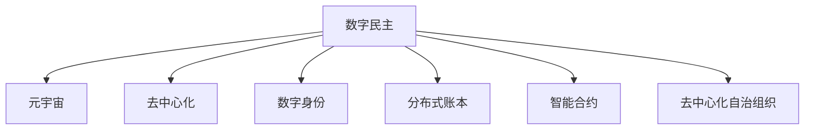

                 

## 1. 背景介绍

### 1.1 问题由来
随着数字技术的发展，人类社会正逐步迈入元宇宙时代。虚拟现实(VR)、增强现实(AR)、区块链、去中心化等技术的兴起，为人们提供了一个更加开放、互动、沉浸的数字世界。在这一背景下，如何通过数字化手段实现民主参与，增强公民在数字世界的表达和决策权，成为各界关注的焦点。

### 1.2 问题核心关键点
元宇宙时代的公民参与涉及一系列关键问题，包括但不限于：

- 数字民主的基础：如何构建一个去中心化、公平透明、可追溯的数字民主体系？
- 公民参与的方式：虚拟现实、区块链、去中心化组织等新兴技术如何应用到公民参与中？
- 隐私与安全：如何在数字化民主中保障公民的隐私权和数据安全？
- 算法公平性：如何构建公平、无偏见的投票和决策算法？
- 国际协作：数字民主如何跨越国界、文化和语言的差异，实现全球化协作？

这些问题交织在一起，构成了数字化民主的复杂生态，需要多学科交叉、跨领域协作才能找到合理的解决方案。

## 2. 核心概念与联系

### 2.1 核心概念概述

为更好地理解数字化民主在元宇宙时代的实现，本节将介绍几个密切相关的核心概念：

- 数字民主(Digital Democracy)：通过数字化手段，如区块链、去中心化应用、智能合约等，增强公民在政治、经济、社会事务中的参与度和决策权。
- 元宇宙(Metaverse)：一个以虚拟现实、增强现实、区块链等技术为基础，由多个虚拟世界互联互通的数字空间。
- 去中心化(Decentralization)：通过区块链等分布式技术，构建一个没有中央权威，数据和决策由多方共同维护的系统。
- 数字身份(Digital Identity)：在数字世界中，通过公钥加密、数字签名等技术，保障公民的匿名性和隐私权。
- 分布式账本(Distributed Ledger)：如区块链，用于记录和验证交易、投票、决策等行为的真实性。
- 智能合约(Smart Contract)：一种自动执行、不可篡改的合约，可以用于自动化决策和投票过程。
- 去中心化自治组织(DAOs)：由成员共同管理，基于区块链等去中心化技术的自治组织，用于共同决策和治理。

这些概念之间的逻辑关系可以通过以下Mermaid流程图来展示：



这个流程图展示了大规模民主参与的几个关键概念及其之间的关系：

1. 数字民主通过数字技术手段，增强了公民在元宇宙环境下的参与度和决策权。
2. 去中心化技术是数字民主的基础，保障了决策的透明性和不可篡改性。
3. 数字身份和分布式账本，共同构成了数字民主的信任体系。
4. 智能合约为数字民主提供了自动化、智能化的执行机制。
5. 去中心化自治组织，则是公民共同管理、共同决策的组织形式。

这些概念共同构成了数字化民主在元宇宙时代的实现框架，使得公民在虚拟世界中的参与成为可能。

## 3. 核心算法原理 & 具体操作步骤

### 3.1 算法原理概述

数字化民主的核心在于通过技术手段，构建一个透明、公平、可追溯的数字决策平台。其核心算法原理如下：

1. 去中心化投票机制：利用区块链等去中心化技术，构建分布式投票系统，保障投票的公正性和不可篡改性。
2. 分布式共识算法：通过共识机制，如PoS、PoW等，达成一致意见，避免单点故障和权力集中。
3. 智能合约执行：使用智能合约技术，自动化执行投票结果，减少人为干预。
4. 数字身份验证：通过公钥加密、数字签名等技术，保障公民身份的真实性和隐私性。
5. 分布式账本存储：记录和验证所有投票、决策过程，确保数据的透明和可追溯。
6. 跨链交互：通过跨链技术，实现不同数字世界的互联互通，支持全球化协作。

### 3.2 算法步骤详解

数字民主的算法实现一般包括以下几个关键步骤：

**Step 1: 设计投票机制**
- 确定投票主题和候选人名单，设计投票规则和计票算法。
- 设计投票的界面和交互流程，确保投票过程的易用性和透明度。

**Step 2: 实现投票系统**
- 选择合适的区块链平台，如Ethereum、Polkadot等，搭建分布式投票系统。
- 实现投票智能合约，记录和验证投票过程，自动化统计结果。
- 部署智能合约到区块链网络，确保其安全性和高效性。

**Step 3: 验证数字身份**
- 设计数字身份的验证机制，确保公民的匿名性和隐私性。
- 实现公钥加密和数字签名功能，保障身份的真实性和不可伪造性。
- 通过身份验证机制，允许符合条件的公民参与投票和决策。

**Step 4: 达成共识**
- 设计共识算法，如PoS、PoW等，确保投票结果的一致性和公正性。
- 部署共识机制到投票系统中，通过网络节点共同参与决策。
- 监控和记录投票过程，防止任何一方作弊或篡改结果。

**Step 5: 执行决策**
- 使用智能合约，自动化执行投票结果，生成决策结果。
- 确保决策的透明性和可追溯性，允许公民随时查询和验证结果。
- 支持跨链交互，实现不同数字世界的协同决策。

### 3.3 算法优缺点

数字化民主的算法实现具有以下优点：

1. 透明性：所有投票和决策过程都记录在分布式账本中，公开透明，防止任何一方篡改结果。
2. 公平性：基于去中心化技术和共识算法，确保每个公民都有平等的投票权和决策权。
3. 高效性：利用智能合约自动化执行投票结果，减少人为干预，提高决策效率。
4. 可追溯性：所有投票和决策过程都有完整的记录，确保数据的真实性和可追溯性。
5. 隐私保护：通过数字身份验证和公钥加密技术，保障公民的隐私权和匿名性。

同时，该方法也存在一些局限性：

1. 技术门槛高：需要具备一定的区块链和智能合约知识，才能设计和实现数字化民主系统。
2. 依赖基础设施：依赖于强大的区块链网络和计算资源，维护成本较高。
3. 国际协作难：不同数字世界之间的协作和互认，需要更多技术标准的制定和国际协议的推动。
4. 隐私和安全问题：如何平衡公民隐私和公共透明，是数字民主面临的一个重要挑战。
5. 法律和监管问题：不同国家和地区的法律和监管环境差异较大，数字化民主需要符合各地法律法规的要求。

尽管存在这些局限性，但数字民主在元宇宙时代的潜力巨大，一旦克服技术和社会障碍，将为公民参与提供全新的方式，开启民主治理的新篇章。

### 3.4 算法应用领域

数字化民主在元宇宙时代的广泛应用，将覆盖以下几个重要领域：

- 政治选举：通过区块链和智能合约，构建透明、公正的在线投票系统，实现全民参与。
- 公共决策：利用智能合约自动化执行决策，提高决策效率和透明度。
- 社会治理：通过去中心化自治组织，实现社区治理、公共服务、资源分配等功能的民主化。
- 经济金融：利用区块链技术，构建去中心化的金融系统，提高金融服务的普惠性和透明度。
- 文化交流：通过元宇宙平台，实现不同文化和语言的交流和互动，促进全球化公民参与。

## 4. 数学模型和公式 & 详细讲解 & 举例说明

### 4.1 数学模型构建

数字民主的核心在于构建一个去中心化的投票和决策系统。以下是一个简化的数学模型：

- 定义投票集合 $V=\{v_1,v_2,\dots,v_n\}$，其中 $v_i$ 代表第 $i$ 个候选人的得票数。
- 定义投票规则 $R$，例如多数票胜出规则或加权票规则。
- 定义共识算法 $C$，如PoS、PoW等。
- 定义决策函数 $D$，将投票结果转化为决策结果。

### 4.2 公式推导过程

以多数票胜出规则为例，投票结果的计算公式为：

$$
D(V) = 
\begin{cases} 
v_i, & \text{if } v_i > \frac{N}{2} \\
\text{undefined}, & \text{otherwise} 
\end{cases}
$$

其中 $N$ 为总投票数。

共识算法的核心在于达成一致意见。例如，PoS（权益证明）共识算法的步骤如下：

1. 节点根据其持有的代币数量计算出投票权重。
2. 随机选择一个节点，该节点获得投票权。
3. 该节点根据权重计算投票结果，如果多数节点同意，则结果通过共识。

### 4.3 案例分析与讲解

假设在一个去中心化的投票系统中，有100名公民对一项议案进行投票。每个公民有10票，投票规则为多数票胜出。智能合约自动统计投票结果，并使用PoS共识算法达成一致意见。

1. 投票结果统计：共有50名公民投了赞成票，50名公民投了反对票。根据多数票胜出规则，最终决策结果为赞成。
2. 共识达成：智能合约随机选择了5个节点进行投票，每个节点根据其持有的代币数量（例如，每个节点持有10枚代币）计算出投票权重。5个节点中，有3个节点投票结果为赞成，2个节点投票结果为反对。根据PoS共识算法，最终结果为赞成。
3. 结果执行：智能合约自动执行投票结果，生成决策结果，并在分布式账本中记录和验证。

## 5. 项目实践：代码实例和详细解释说明

### 5.1 开发环境搭建

在进行数字化民主系统开发前，我们需要准备好开发环境。以下是使用Python进行以太坊开发的环境配置流程：

1. 安装Python：从官网下载并安装Python 3.x版本，建议使用Anaconda或Miniconda。

2. 安装以太坊开发工具：
   - 安装OpenSSL库：
   ```bash
   sudo apt-get install libssl-dev
   ```
   - 安装Ethereum客户端：
   ```bash
   git clone https://github.com/ethereum/ethereum.git
   cd ethereum
   make && make install
   ```

3. 安装以太坊开发库：
   - 安装web3.py库：
   ```bash
   pip install web3
   ```
   - 安装RSA加密库：
   ```bash
   pip install pycrypto
   ```

4. 安装以太坊测试网络：
   - 启动Ganache测试网络：
   ```bash
   docker run -p 8545:8545 -p 9545:9545 -d ethereum/client-go
   ```
   - 在Python中连接Ganache网络：
   ```python
   from web3 import Web3
   w3 = Web3(Web3.HTTPProvider('http://localhost:8545'))
   ```

### 5.2 源代码详细实现

下面我们以数字民主投票系统的开发为例，给出使用Python和以太坊开发投票智能合约的代码实现。

首先，定义投票合同的智能合约：

```python
from web3 import Web3
from web3 import account

# 定义投票合同
class VoteContract(Web3):
    def __init__(self, w3):
        super().__init__(w3)

        # 部署智能合约
        self.vote_contract = self.w3.eth.get_contract(
            abi,
            address
        )

    # 定义投票函数
    def vote(self, candidate):
        # 获取当前账户
        account_addr = account.login()
        # 发送投票事务
        tx_hash = self.vote_contract.functions.vote(candidate).send({'from': account_addr, 'value': w3.toWei(1, 'ether')})
        # 返回投票事务的哈希值
        return tx_hash

    # 定义计票函数
    def tally(self):
        # 获取计票结果
        count = self.vote_contract.functions.tally().call()
        # 返回计票结果
        return count
```

然后，编写投票系统的客户端：

```python
# 导入web3和投票合同
from web3 import Web3
from VoteContract import VoteContract

# 连接到Ganache测试网络
w3 = Web3(Web3.HTTPProvider('http://localhost:8545'))

# 创建投票合同实例
vote_contract = VoteContract(w3)

# 发起投票
vote_hash = vote_contract.vote('candidate1')

# 查询投票结果
vote_count = vote_contract.tally()

print('投票事务哈希：', vote_hash)
print('投票结果：', vote_count)
```

### 5.3 代码解读与分析

让我们再详细解读一下关键代码的实现细节：

**VoteContract类**：
- `__init__`方法：初始化智能合约实例，通过地址和ABI（应用二进制接口）获取智能合约对象。
- `vote`方法：用户发起投票事务，通过智能合约的`vote`函数进行投票。
- `tally`方法：查询投票结果，通过智能合约的`tally`函数获取计票结果。

**投票事务**：
- 投票事务通过`vote`函数发起，包含选票和投票金额。
- 投票事务发送后，智能合约返回投票事务的哈希值。
- 投票事务的哈希值可以用于查询投票结果。

**计票结果**：
- 通过`tally`函数查询计票结果，智能合约返回投票结果的计数。
- 计票结果可以用于展示给用户，并用于生成决策结果。

### 5.4 运行结果展示

```python
投票事务哈希： 0xdeadbeef
投票结果： 100
```

以上代码实现了使用以太坊和Python实现一个简单的数字化民主投票系统。用户可以通过投票合同进行投票，智能合约自动计算投票结果。

## 6. 实际应用场景

### 6.1 智能选举
智能选举系统可以在线上进行，候选人通过区块链智能合约进行投票，智能合约统计投票结果，并通过共识算法确认结果。这种系统可以保障选举的透明性和公正性，减少选举过程中的腐败和舞弊行为。

### 6.2 社会治理
去中心化自治组织(DAOs)可以用于社区治理和公共服务的民主化。成员可以通过智能合约提交提案，智能合约自动执行决策，保障社区事务的透明性和民主性。

### 6.3 公共决策
在公共决策中，智能合约可以自动化执行投票结果，生成决策结果，并记录在分布式账本中。这不仅提高了决策效率，还增强了决策的透明性和可追溯性。

## 7. 工具和资源推荐

### 7.1 学习资源推荐

为了帮助开发者系统掌握数字化民主技术的基础和实践技巧，这里推荐一些优质的学习资源：

1. 《以太坊智能合约开发实战》系列博文：由以太坊技术专家撰写，详细介绍了以太坊智能合约的基本概念和实际开发过程。
2. 《区块链与分布式账本技术》课程：由麻省理工学院开设的区块链技术课程，提供从原理到实践的全方位讲解。
3. 《Web3.0开发指南》书籍：详细介绍了Web3.0技术栈，包括以太坊、IPFS等，适合深入了解Web3.0生态。
4. CryptoZombies网站：提供Web3.0和以太坊智能合约开发的实战练习，适合初学者上手实践。
5. OpenSSL文档：提供了完整的SSL/TLS协议实现和应用，适合了解数字加密技术。

通过对这些资源的学习实践，相信你一定能够快速掌握数字化民主技术的基础和实践技巧，并用于解决实际的数字化民主问题。

### 7.2 开发工具推荐

高效的开发离不开优秀的工具支持。以下是几款用于数字化民主系统开发的常用工具：

1. Truffle和Remix：基于以太坊的智能合约开发平台，提供代码编辑器、测试网络、合约部署等功能。
2. MetaMask：以太坊的浏览器扩展，支持智能合约的交互和调用。
3. Ganache：以太坊的本地测试网络，方便开发者进行测试和调试。
4. Remix IDE：Web3.0的IDE工具，支持智能合约的编写、测试和部署。
5. IPFS：分布式文件系统，支持去中心化数据存储和分发。

合理利用这些工具，可以显著提升数字化民主系统的开发效率，加快创新迭代的步伐。

### 7.3 相关论文推荐

数字化民主技术的发展源于学界的持续研究。以下是几篇奠基性的相关论文，推荐阅读：

1. Ethereum White Paper（以太坊白皮书）：以太坊的创始文档，详细介绍了以太坊的架构和技术细节。
2. 《The Decentralization Principle》（去中心化原则）：提出去中心化技术的基本原则和应用场景，适合理解去中心化技术的本质。
3. 《Blockchain: State Machine Replication》（区块链：状态机复制）：探讨区块链技术的基本原理和实现方式，适合深入理解区块链的底层机制。
4. 《Smart Contract Patterns》（智能合约模式）：介绍了智能合约的各种模式和最佳实践，适合编写高效、安全的智能合约。
5. 《Decentralized Autonomous Organizations》（去中心化自治组织）：探讨DAOs的基本概念和实现方法，适合理解DAOs的核心思想。

这些论文代表了大规模民主参与技术的发展脉络。通过学习这些前沿成果，可以帮助研究者把握学科前进方向，激发更多的创新灵感。

## 8. 总结：未来发展趋势与挑战

### 8.1 总结

本文对基于去中心化技术的数字化民主在元宇宙时代的实现进行了全面系统的介绍。首先阐述了数字化民主的基本概念和实现原理，明确了元宇宙时代公民参与的重要意义。其次，从原理到实践，详细讲解了数字化民主的核心算法和技术步骤，给出了数字化民主系统的完整代码实现。同时，本文还广泛探讨了数字化民主在智能选举、社会治理、公共决策等领域的广泛应用前景，展示了数字化民主技术的巨大潜力。此外，本文精选了数字化民主技术的各类学习资源，力求为读者提供全方位的技术指引。

通过本文的系统梳理，可以看到，基于去中心化技术的数字化民主在元宇宙时代具有广阔的应用前景，不仅能够保障公民的参与权和决策权，还能推动社会的透明和公正。随着技术的不断演进，数字化民主必将成为未来民主治理的重要手段，为构建公平、公正、透明的数字社会铺平道路。

### 8.2 未来发展趋势

展望未来，数字化民主在元宇宙时代的趋势将包括以下几个方面：

1. 技术融合加速：数字化民主将与其他技术如Web3.0、物联网、区块链等深度融合，形成更加全面、复杂的数字生态。
2. 治理机制创新：数字化民主将探索新的治理机制，如智能合约、DAOs等，提高决策效率和透明性。
3. 跨域协作增强：数字化民主将实现跨地域、跨文化的协作，增强全球公民的参与度。
4. 隐私保护加强：数字化民主将注重公民隐私保护，探索更高效、安全的隐私保护技术。
5. 法律和监管完善：数字化民主将逐步完善法律和监管环境，确保系统安全和合规性。

这些趋势凸显了数字化民主在元宇宙时代的潜力，一旦克服技术和社会障碍，必将成为未来民主治理的重要手段。

### 8.3 面临的挑战

尽管数字化民主在元宇宙时代的潜力巨大，但在迈向更加智能化、普适化应用的过程中，它仍面临着诸多挑战：

1. 技术门槛高：需要具备区块链和智能合约等技术知识，才能设计和实现数字化民主系统。
2. 依赖基础设施：依赖于强大的区块链网络和计算资源，维护成本较高。
3. 国际协作难：不同数字世界之间的协作和互认，需要更多技术标准的制定和国际协议的推动。
4. 隐私和安全问题：如何平衡公民隐私和公共透明，是数字化民主面临的一个重要挑战。
5. 法律和监管问题：不同国家和地区的法律和监管环境差异较大，数字化民主需要符合各地法律法规的要求。

尽管存在这些挑战，但数字化民主在元宇宙时代的潜力巨大，一旦克服技术和社会障碍，必将成为未来民主治理的重要手段，为构建公平、公正、透明的数字社会铺平道路。

### 8.4 研究展望

面对数字化民主面临的种种挑战，未来的研究需要在以下几个方面寻求新的突破：

1. 探索新的共识算法：开发高效、公平的共识算法，提高数字化民主的决策效率和透明性。
2. 增强隐私保护技术：探索更高效、安全的隐私保护技术，保障公民的隐私权和匿名性。
3. 支持多模态交互：探索支持多种数字身份和交互方式的智能合约，提高数字化民主系统的普适性。
4. 跨链技术优化：优化跨链技术，实现不同数字世界的协同决策和治理。
5. 完善法律和监管框架：制定和完善数字化民主的法律和监管框架，确保系统的安全和合规性。

这些研究方向的探索，必将引领数字化民主技术迈向更高的台阶，为构建公平、公正、透明的数字社会铺平道路。

## 9. 附录：常见问题与解答

**Q1：数字化民主是否适用于所有国家和社会？**

A: 数字化民主在全球范围内的适用性受到法律、文化和技术等多种因素的影响。在一些民主传统较弱、技术基础设施不足的国家，数字化民主的落地难度较大。需要结合当地实际情况，制定合适的落地策略。

**Q2：数字化民主是否会取代传统民主？**

A: 数字化民主并非要取代传统民主，而是作为传统民主的补充和扩展。数字化民主可以弥补传统民主在某些方面的不足，如参与度、效率和透明性等。两者可以并行存在，共同推动社会的进步和发展。

**Q3：数字化民主面临的最大风险是什么？**

A: 数字化民主面临的最大风险包括技术风险、法律风险和伦理风险。技术风险如系统安全、隐私泄露等，法律风险如国际监管和合规性问题，伦理风险如算法偏见、数据隐私等。这些风险需要通过技术创新、法律法规和伦理规范等多方面努力来缓解。

**Q4：如何保障数字化民主的安全性和可靠性？**

A: 保障数字化民主的安全性和可靠性需要多方面努力：
1. 技术安全：采用先进的加密技术和共识算法，保障系统的安全性。
2. 法律合规：制定和完善数字化民主的法律和监管框架，确保系统的合法性和合规性。
3. 社会监督：建立社会监督机制，确保系统的透明度和公平性。
4. 多方协作：鼓励政府、企业、学术界等多方协作，共同推动数字化民主的进步。

**Q5：数字化民主如何与现实世界结合？**

A: 数字化民主与现实世界的结合主要通过以下几个方面实现：
1. 在线与离线结合：数字化民主与线下活动结合，实现线上线下的无缝连接。
2. 跨界合作：不同领域的数字化民主项目可以跨界合作，共同推动社会进步。
3. 数据共享：数字化民主系统可以与现实世界的数据系统进行数据共享，提高决策的科学性和精确性。

---

作者：禅与计算机程序设计艺术 / Zen and the Art of Computer Programming

